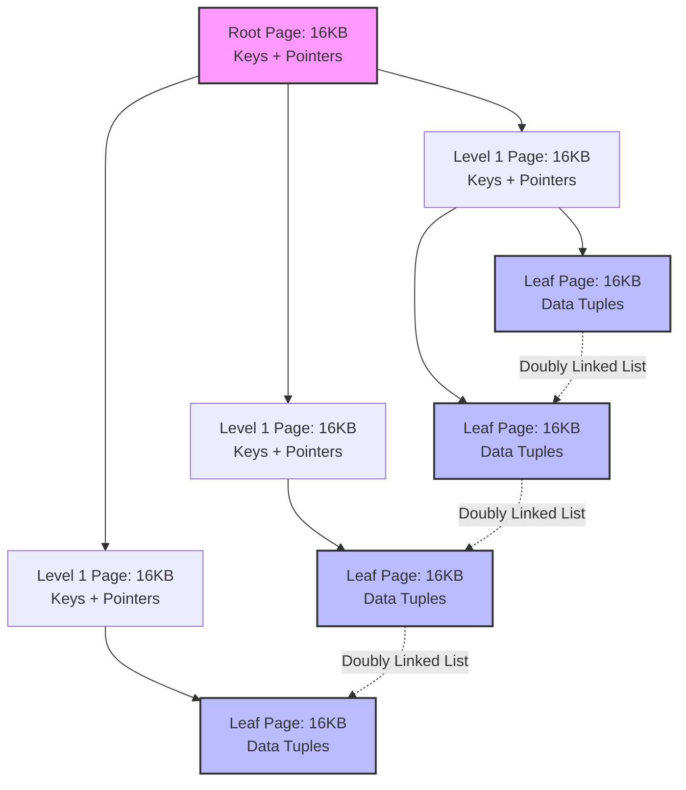
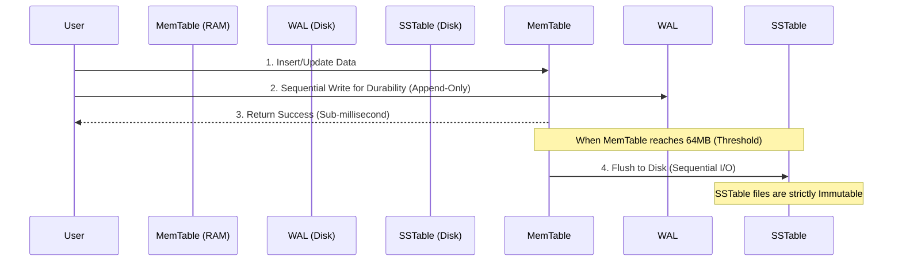

# Anatomy of a Storage Engine: B-Tree vs LSM-Tree and the Physics of Disk I/O

## Why Storage Engine Design Comes Down to I/O, Not CPU

Every large-scale, high-throughput database system has a storage engine sitting at its core, quietly deciding how fast the whole thing can go. Its job sounds simple: keep data structures in RAM, and keep them synchronized with whatever sits on the physical disk — spinning platters, SATA SSDs, or NVMe drives. But once transaction volume crosses a certain threshold, something interesting happens. Performance stops being a CPU story. Query optimizers, instruction pipelining, even network bandwidth — none of that matters anymore. What matters is how the storage device likes to be accessed.

That's the core problem this article digs into: the mismatch between how traditional data structures access data (largely at random) and how physical storage actually behaves (it prefers sequential access, sometimes violently so). Get this wrong, and you pay for it in read amplification, write amplification, space amplification, and tail latency that refuses to behave.

We'll walk through the two data structures that dominate storage engine design today — the B-Tree, the backbone of PostgreSQL and MySQL's InnoDB, and the Log-Structured Merge-Tree (LSM-Tree), the engine behind RocksDB, Cassandra, and CockroachDB. Along the way we'll look at physical I/O costs, cache hierarchies, and the RUM Conjecture, which gives a name to the trade-off every storage engine designer eventually runs into.

## How Spinning Disks Shaped the B-Tree

The B-Tree (and its near-universal variant, the B+Tree) dates back to the 1970s, when Rudolf Bayer and Edward McCreight designed it for the dominant storage medium of the day: the magnetic hard disk. HDDs have one defining trait that shapes everything about their performance — brutally high latency on random access, a direct consequence of being a mechanical device.

A random I/O request on an HDD involves two physical steps:
1. **Seek time ($T_{seek}$):** moving the actuator arm to the right track.
2. **Rotational latency ($L_{rotational}$):** waiting for the platter to spin the target sector under the head.

Rotational latency has a clean formula:

$$ L_{rotational} = \frac{1}{2} \times \frac{60}{\text{RPM}} \text{ (seconds)} $$

Add it all up and a typical 7200 RPM drive averages 8-10 milliseconds per random access. Compare that to a modern CPU executing instructions in fractions of a nanosecond, and you get a bottleneck spanning millions of wasted cycles. Sequential reads on the same track tell a completely different story — hundreds of megabytes per second, because the arm just sits still while the platter spins beneath it.

That gap between random and sequential costs isn't a minor inefficiency — it's exponential, and it forces a design constraint: pull as much useful data as possible out of every disk access you make. The B-Tree solves this by mapping cleanly onto how operating systems already manage memory, in fixed-size pages typically between 4 KB and 16 KB. Each B+Tree node maps to exactly one physical page. To pack more into each node, internal nodes store only routing keys and child pointers — the actual row data lives entirely in the leaves.

### Why B-Tree Lookups Stay Fast at Scale

A B-Tree's routing performance comes down to its fanout ($F$). Say a database uses 16 KB pages (InnoDB's default) and each key-pointer entry takes 12 bytes. That gives an internal node room for roughly:

$$ F = \left\lfloor \frac{B_{size}}{S_{entry}} \right\rfloor \approx 1365 \text{ pointers} $$

Because the fanout is so large, tree height grows logarithmically with a very forgiving base: $\mathcal{O}(\log_F N)$. For a table holding $N = 2.5 \times 10^9$ rows, the tree still only needs:

$$ h = \lceil \log_{1365}(2.5 \times 10^9) \rceil = 3 $$

Three levels. That means a random lookup on disk is bounded to at most 3 physical I/O operations — and in practice, the buffer pool keeps the root and level-1 nodes permanently cached in RAM, so a point lookup often costs just $\mathcal{O}(1)$ I/O.

## The Write Amplification Problem Hiding Inside Every B-Tree

The B-Tree's point-query performance is excellent and predictable, but it comes at a price: everything happens via *in-place updates*. Modify a row, and the storage engine has to find the right 16 KB page, pull it into the buffer pool, patch the bytes in memory, then write the entire 16 KB block back to its original spot on disk (often through Direct I/O, bypassing the OS page cache).

Under write-heavy load, this pattern produces what's called write amplification ($W_A$):

$$ W_A = \frac{\text{Bytes Physically Written To Disk}}{\text{Bytes Logically Requested By User}} $$

Change 50 bytes of actual data, and the engine still has to flush all 16,384 bytes of the containing page. That's a write amplification factor of roughly $W_A \approx 327.68$ — for a tiny logical change.

Costs climb further once a leaf page fills up (Fill Factor = 100%). Inserting into a full page triggers a page split: the engine allocates a new block, locks the current page, moves roughly half the data over, and updates the separator key in the parent. If the parent is also full, the split cascades upward — potentially all the way to the root.

Keeping this tree consistent under heavy concurrency requires an algorithm called *latch crabbing*: a thread grabs a read/write latch on the parent before touching a child, and only releases the parent's latch once it can prove the child won't split. Under a big write burst, latch contention on the upper levels becomes a real bottleneck on multi-core machines.

### Why SSDs Don't Actually Fix the Problem

Solid State Drives, built on NAND flash, changed the physical landscape — they eliminate seek time entirely — but they introduce a different constraint that's just as unforgiving: flash cells can't be overwritten in place. To change even a small region of data, the SSD's Flash Translation Layer (FTL) has to run through a Read-Modify-Write cycle:

1. Read an entire erase block (typically 2-8 MB) from flash into the drive's internal SRAM cache.
2. Modify the relevant 16 KB page within that cache.
3. Erase the *entire* old physical block with a slow, high-voltage command, wiping millions of cells.
4. Write the whole updated block out to a fresh physical location.

The random, fragmented I/O that B-Tree page splits and in-place updates generate collides badly with this erase-block mechanism. Useful bandwidth drops, and — more importantly for anyone running production hardware — the drive's physical lifespan (measured in Terabytes Written, or TBW) shrinks fast, leading to premature failures in busy enterprise environments.

## LSM-Trees: Betting Everything on Sequential Writes

To sidestep the write bottleneck and work with flash's physics instead of against it, the LSM-Tree throws out in-place updates entirely. Every mutation — insert, update, delete — becomes a new, timestamped entry appended sequentially to an in-memory buffer called the MemTable.

Deletes don't physically remove anything — they insert a newer record carrying a tombstone flag instead. The MemTable itself is usually a SkipList, a structure that uses randomized forward pointers to keep insert and search at $\mathcal{O}(\log N)$ without the locking overhead that comes with rebalancing an AVL or Red-Black tree.

Because the whole update path lives in main memory, LSM-Tree write throughput approaches the raw bandwidth of the CPU and memory bus. Durability still has to come from somewhere, though — every write is synchronously appended to a Write-Ahead Log (WAL) on disk before the engine acknowledges success. Since the WAL only ever sees sequential appends, this write costs close to nothing in terms of disk latency.

Once the MemTable crosses a size threshold — 64 MB or 128 MB are common defaults — it freezes into an immutable structure and gets flushed to disk as a Sorted String Table (SSTable) file. By converting what would have been random writes into large sequential ones, the LSM-Tree makes full use of NVMe bandwidth, all but eliminates software-level write amplification, and treats NAND erase blocks the way they want to be treated.

## What Sequential Writes Cost You on the Read Side

This write-side advantage doesn't come free. The lack of in-place updates means a single primary key's history can end up scattered across dozens of files. A point query has to walk backward through time: check the active MemTable, then any frozen MemTables, then however many SSTable files might contain older versions of that key.

Opening, decompressing, and scanning multiple files for a single lookup produces read amplification that can quickly become unacceptable if left unchecked.

### Bloom Filters: Making Reads Fast Again

LSM-Tree implementations solve this with a Bloom filter embedded in every SSTable's metadata footer. A Bloom filter is a compact, probabilistic structure that answers one question — "might this element be in the set?" — using a bit array of size $m$ and $k$ independent hash functions over $n$ elements.

The false-positive probability follows:

$$ P \approx \left(1 - e^{-\frac{kn}{m}}\right)^k $$

Taking the derivative with respect to $k$ shows the optimal number of hash functions is:

$$ k = \frac{m}{n} \ln 2 $$

At this optimum, the filter needs only about 10 bits per key — a trivial amount of RAM — while holding the false-positive rate around 1%. That 1% occasionally causes a wasted disk read, but the payoff is enormous: the filter eliminates roughly 99% of reads that would have hit disk looking for a key that isn't even there. If the Bloom filter says "not present," the engine skips the file without touching storage at all.

### Compaction: Paying Down the Space and Read Debt

Left alone, an LSM-Tree accumulates overlapping SSTable files and dead data (superseded updates, tombstones) indefinitely — this is space amplification, and it only gets worse over time.

The fix is a background process called compaction. The most common approach — Level-Tiered Compaction, used by RocksDB — organizes storage into tiers ($L_0, L_1, L_2, \dots$), where each tier $L_{i+1}$ is capped at roughly $T$ times the size of $L_i$ (commonly $T=10$).

When tier $L_i$ hits its limit, the engine runs an N-way merge sort: it reads the overlapping files from $L_i$ and $L_{i+1}$, merges them in memory to drop obsolete versions and purge tombstones, then writes the deduplicated result back to $L_{i+1}$ sequentially.

This keeps read and space amplification in check, but it isn't free — compaction's background write cost is substantial. For leveled compaction, write amplification roughly follows:

$$ W_A \approx \text{Levels} \times \frac{T}{2} $$

In other words, the system is spending real I/O bandwidth and CPU cycles in the background, just to keep foreground reads fast and reclaim disk space.

## The RUM Conjecture: Why No Storage Engine Wins on Every Axis

None of this trade-off is accidental — it's formalized in the RUM Conjecture (Athanassoulis et al., 2016). The conjecture states that Read overhead ($R$), Update overhead ($U$), and Memory/storage overhead ($M$) are bound together:

$$ R \times U \times M = C $$

You cannot optimize all three simultaneously. Push one down, and at least one of the others goes up.

*   **B-Trees optimize for $R$ and $M$:** reads are fast ($O(\log N)$ lookups), and memory overhead stays low since there's no data duplication. The cost lands on $U$ — updates are expensive because of random I/O and page splits.
*   **LSM-Trees optimize for $U$ and $M$:** updates are fast because they're purely sequential appends, and data ends up densely packed on disk. The cost lands on $R$ — reads are inherently slower, and the engine has to spend CPU on background compaction and keep Bloom filters resident in RAM just to keep that cost bounded.

## What This Means for Choosing a Storage Engine

After walking through how B-Trees and LSM-Trees actually behave under load, a few practical conclusions stand out:

1.  **Hardware physics shapes software architecture, not the other way around.** The B-Tree was built for the rotational mechanics of HDDs, maximizing useful data per seek. The LSM-Tree was built for NAND flash, respecting the erase-block cycle by turning everything into sequential streams.
2.  **Sequential I/O wins, on every medium.** HDD, SSD, NVMe, even RAM cache lines — sequential access consistently beats random access. That's exactly why systems like Kafka and Cassandra scale reliably: they treat the disk as an append-only log.
3.  **There's no free lunch — pick your trade-off deliberately.** If your workload is 95% reads (a user profile service, say), a B-Tree engine like PostgreSQL is the right call. If it's 95% writes (IoT telemetry, financial ledgers, distributed logging), an LSM-Tree engine like RocksDB or Cassandra is what keeps I/O from collapsing under load.
4.  **Write amplification is a hardware lifespan problem, not just a performance one.** In-place updates on flash wear it out faster. Watching $W_A$ in production matters as much for your infrastructure budget as it does for latency.
5.  **The math is what makes scale possible.** Getting to billions of rows without latency spikes rests on probabilistic structures (Bloom filters) and asymptotic bounds (logarithmic fanout). Understanding these proofs is table stakes for designing systems at that scale.
