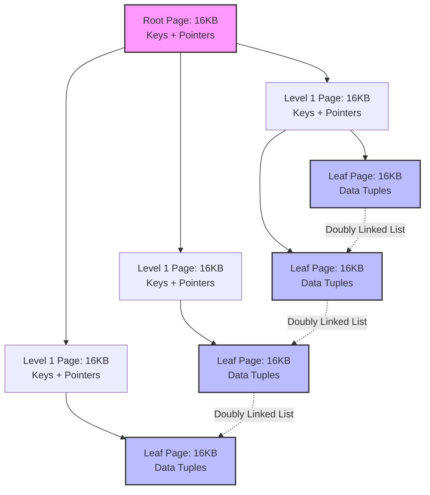
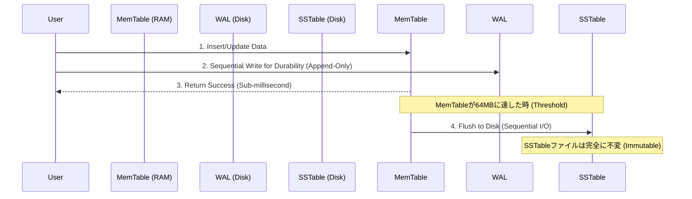

# ストレージエンジンの内部構造:B-TreeとLSM-Treeがディスク物理特性にどう向き合うか

## なぜストレージエンジンの設計はCPUではなくI/Oで決まるのか

大規模かつ高スループットなデータベースシステムには、必ずStorage Engineというコンポーネントが中心に存在し、システム全体の速度を静かに左右しています。その役割自体はシンプルです。RAM上にデータ構造を保持し、それをディスク上の実体——回転する磁気プラッタであれ、SATA SSDであれ、NVMeドライブであれ——と同期させ続けることです。しかし、トランザクション量がある閾値を超えると、興味深いことが起こります。パフォーマンスの話がCPUの話ではなくなるのです。クエリオプティマイザも、命令パイプラインも、ネットワーク帯域幅も、もはや主役ではありません。決定的になるのは、そのストレージデバイスがどのようなアクセスパターンを好むか、という一点です。

これが本稿の核心的なテーマです。従来のデータ構造がデータにアクセスする方法(多くはランダムアクセス)と、物理ストレージが実際に得意とする方法(シーケンシャルアクセス、それも極端に)との間の不一致。ここを見誤ると、Read Amplification、Write Amplification、Space Amplification、そして手に負えないテールレイテンシという形で代償を払うことになります。

本稿では、現在のストレージエンジン設計を支配する2つのデータ構造を見ていきます。PostgreSQLやMySQL InnoDBの背骨であるB-Treeと、RocksDB、Cassandra、CockroachDBを支えるLog-Structured Merge-Tree(LSM-Tree)です。物理I/Oコスト、キャッシュ階層、そしてストレージエンジン設計者なら誰もがいずれ突き当たるトレードオフに名前を与えたRUM Conjectureについても見ていきます。

## 回転するディスクがB-Treeの形を決めた

B-Tree(そしてほぼ普遍的な派生形であるB+Tree)は1970年代、Rudolf BayerとEdward McCreightによって、当時主流だったストレージ媒体——磁気ハードディスク(HDD)——向けに設計されました。HDDにはそのパフォーマンス特性すべてを決定づける、ある一つの性質があります。機械的なデバイスであるがゆえの、ランダムアクセス時の非常に高いレイテンシです。

HDD上でランダムI/Oリクエストが発生すると、物理的に2段階の処理が必要になります。
1. **シーク時間($T_{seek}$):** アクチュエータアームを正しいトラックへ移動させる。
2. **回転遅延($L_{rotational}$):** プラッタが回転し、対象セクタがヘッドの下に来るのを待つ。

回転遅延は次の式で表せます。

$$ L_{rotational} = \frac{1}{2} \times \frac{60}{\text{RPM}} \text{ (秒)} $$

これらを合計すると、標準的な7200 RPMのドライブでは1回のランダムアクセスあたり平均8〜10ミリ秒かかります。ナノ秒未満の単位で命令を実行する現代のCPUと比べれば、これは数百万サイクル分もの無駄が生じるボトルネックです。一方、同一トラック上でのシーケンシャルリードはまったく違う顔を見せます。毎秒数百メガバイトという速度が出るのは、単純にアームが静止したままプラッタだけが回転しているからです。

ランダムアクセスとシーケンシャルアクセスのコスト差は些細な非効率ではなく、指数関数的な開きです。ここから一つの設計上の制約が導かれます。1回のディスクアクセスから、できる限り多くの有用なデータを引き出さなければならない、というものです。B-Treeはこれを、OSがすでに採用しているメモリ管理の仕組み——通常4KBから16KBの固定サイズページ——にきれいに乗せることで解決しました。B+Treeの各ノードは正確に1つの物理ページに対応します。各ノードにより多くの情報を詰め込むため、内部ノードにはルーティングキーと子ポインタだけを格納し、実際の行データはすべてリーフノードに置かれます。

### B+Treeの検索が大規模データでも速い理由

B-Treeのルーティング性能は、ファンアウト係数($F$)にすべて依存します。データベースが16KBページ(InnoDBのデフォルト)を使い、キー・ポインタのエントリ1つが12バイトを消費するとすれば、1つの内部ノードにはおよそ次の数のポインタが収まります。

$$ F = \left\lfloor \frac{B_{size}}{S_{entry}} \right\rfloor \approx 1365 \text{ ポインタ} $$

このファンアウトの大きさのおかげで、ツリーの高さは非常に緩やかな底を持つ対数関数、$\mathcal{O}(\log_F N)$で増加します。$N = 2.5 \times 10^9$(25億)行を保持するテーブルであっても、ツリーの高さは次の値で十分です。

$$ h = \lceil \log_{1365}(2.5 \times 10^9) \rceil = 3 $$

わずか3階層です。つまりディスク上のランダムルックアップは最大3回の物理I/Oに収まるということです。実際にはバッファプールがルートとレベル1のノードを常にRAMにキャッシュしているため、ポイントルックアップのコストは実質$\mathcal{O}(1)$回のI/Oで済むことがほとんどです。

## すべてのB-Treeに潜むWrite Amplificationという問題

B-Treeのポイントクエリ性能は優れていて予測しやすいものですが、それには代償があります。すべての処理が「インプレース更新」を通じて行われるという点です。ある行を変更すると、Storage Engineは該当する16KBページを特定し、それをバッファプールに読み込み、メモリ上でバイト列にパッチを当て、その16KBブロック全体をディスク上の元の場所に書き戻す必要があります(多くの場合、OSのページキャッシュを迂回するDirect I/Oを使って)。

書き込みが集中するワークロードの下では、このパターンがWrite Amplification($W_A$)と呼ばれる現象を生み出します。

$$ W_A = \frac{\text{物理ディスクに実際に書き込まれるバイト数}}{\text{ユーザーが論理的に要求したバイト数}} $$

実際のデータ変更がわずか50バイトであっても、エンジンはそのページを丸ごと16,384バイト分フラッシュしなければなりません。これは、ごく小さな論理的変更に対して$W_A \approx 327.68$というWrite Amplification係数を生む計算になります。

リーフページが満杯(Fill Factor = 100%)になると、コストはさらに跳ね上がります。満杯のページへの挿入はページ分割(Page Split)を引き起こします。エンジンは新しいブロックを確保し、現在のページをロックし、データのおよそ半分を新しいページへ移し、親ノードの分離キーを更新します。親ノードも満杯であれば、この分割は連鎖的に上位へ伝播し、最悪の場合ルートまで達します。

高い並行性の下でこのツリーの整合性を保つには、「ラッチ・クラビング」というアルゴリズムが必要です。あるスレッドは子ノードにアクセスする前に親ノードの読み書きラッチを取得し、子ノードが分割されないと数学的に証明できた時点で初めて親のラッチを解放します。大量の書き込みバーストの間、上位ノードでのラッチ競合はマルチコアCPU環境で実質的なボトルネックとなります。

### SSDがこの問題を根本的には解決しない理由

NANDフラッシュを基盤とするSSDは物理的な前提を大きく変えました——シーク時間を完全に排除したのです——が、その代わりに同じくらい厳しい別の制約を持ち込みました。フラッシュセルはインプレースでの上書きができない、という制約です。ごく小さな領域を変更する場合でも、SSDのFlash Translation Layer(FTL)はRead-Modify-Writeサイクルを実行する必要があります。

1. イレースブロック(通常2〜8MB)全体をフラッシュメモリからドライブ内部のSRAMキャッシュへ読み込む。
2. そのキャッシュ内で該当する16KBページを変更する。
3. 古い物理ブロック「全体」に対して、低速かつ高電圧な消去コマンドを実行し、数百万のセルを消去する。
4. 更新後のブロック全体を新しい物理領域へ書き込む。

B-Treeのページ分割やインプレース更新から生じるランダムで断片化したI/Oは、このイレースブロックの仕組みと激しくぶつかり合います。有効な帯域幅は低下し、さらに重要な点として、稼働中の本番ハードウェアではドライブの物理的な寿命(TBW、Terabytes Writtenで測定)が急速に縮み、負荷の高いエンタープライズ環境では早期故障につながります。

## LSM-Tree:シーケンシャル書き込みにすべてを賭ける設計

書き込みのボトルネックを回避し、フラッシュメモリの物理特性に逆らうのではなく味方につけるため、LSM-Treeはインプレース更新という発想そのものを捨てます。挿入・更新・削除のすべてが、タイムスタンプ付きの新しいエントリとして扱われ、MemTableと呼ばれるインメモリバッファへシーケンシャルに追記されます。

削除操作は物理的にデータを消すのではなく、Tombstoneフラグを持つより新しいレコードを挿入することで表現されます。MemTable自体は通常SkipListで実装され、確率的に決まるフォワードポインタによって、AVL木やRed-Black木のような再バランスに伴うロックコストを一切払うことなく、挿入・検索の計算量を$\mathcal{O}(\log N)$に保ちます。

更新処理全体がメインメモリ上で完結するため、LSM-Treeの書き込みスループットはCPUとメモリバスの理論上の帯域幅に近づきます。とはいえ耐久性(ACIDの「D」)はどこかで確保しなければならず、すべての書き込みはユーザーへの成功応答の前に、ディスク上のWrite-Ahead Log(WAL)へ同期的に追記されます。WALはシーケンシャルな追記しか受け付けないため、このディスク書き込みにかかるレイテンシはほぼゼロに近づきます。

MemTableが一定の容量(64MBや128MBがよく使われる既定値です)を超えると、そのメモリ領域は不変な構造として凍結され、Sorted String Table(SSTable)ファイルとしてディスクへフラッシュされます。本来ランダムだったはずの書き込みを大きなシーケンシャル書き込みへと変換することで、LSM-TreeはNVMeの帯域幅を余すことなく使い切り、ソフトウェア層のWrite Amplificationをほぼ排除し、NANDのイレースブロックが望む扱い方をそのまま実現します。

## シーケンシャル書き込みの代償は読み取り側に現れる

この書き込み側の優位性は無償では手に入りません。インプレース更新がないということは、1つのプライマリキーの履歴が数十のファイルにまたがって散らばりうる、ということでもあります。ポイントクエリは時間を遡る形で調べる必要があります。まず稼働中のMemTable、次に凍結済みのMemTable、そして該当するキーの古いバージョンを持ちうる複数のSSTableファイルです。

1回のルックアップのために複数の独立したファイルを開き、解凍し、スキャンする処理は、放置すればすぐに許容できない水準までReadAmplificationを膨らませます。

### Bloom Filter:読み取りを再び速くする仕組み

LSM-Treeの実装はこれを、各SSTableのメタデータフッターに埋め込まれたBloom Filterで解決します。Bloom Filterは「この要素は集合に含まれているか」という問いに答えるコンパクトな確率的データ構造で、サイズ$m$のビット配列と$k$個の独立したハッシュ関数を使って$n$個の要素を扱います。

偽陽性率は次の式に従います。

$$ P \approx \left(1 - e^{-\frac{kn}{m}}\right)^k $$

これを$k$について微分すると、ハッシュ関数の最適な個数は次のようになることがわかります。

$$ k = \frac{m}{n} \ln 2 $$

この最適値の下では、キー1つあたり約10ビットで済み、必要なRAMはごくわずかです。偽陽性率はおよそ1%に抑えられ、その1%は時折無駄なディスク読み取りを引き起こしますが、見返りは非常に大きいものです。本来ディスクに触れて「存在しないキー」を探しに行くはずだった読み取りの、およそ99%を排除できるのです。Bloom Filterが「存在しない」と答えれば、エンジンはディスクにまったく触れずそのファイルをスキップします。

### Compaction:空間と読み取りの負債を返済する仕組み

放置すれば、LSM-Treeは重複したSSTableファイルと不要になったデータ(上書きされた更新やTombstone)を際限なく蓄積していきます。これがSpace Amplificationで、時間が経つほど悪化します。

その対策がCompactionと呼ばれるバックグラウンド処理です。もっとも一般的な方式であるLevel-Tiered Compaction(RocksDBで採用)は、ストレージ空間を階層($L_0, L_1, L_2, \dots$)に分け、各階層$L_{i+1}$の容量上限を$L_i$のおよそ$T$倍に抑えます(通常$T=10$)。

階層$L_i$が上限に達すると、エンジンはN-way Merge Sortを実行します。$L_i$と$L_{i+1}$の重複するファイルを読み込み、メモリ上でマージして古いバージョンを破棄しTombstoneを削除したうえで、重複を排除した結果を$L_{i+1}$へシーケンシャルに書き戻します。

これによりReadAmplificationとSpace Amplificationは抑えられますが、無償ではありません。Compactionのバックグラウンド書き込みコストはかなりのものです。Leveled Compactionの場合、Write Amplificationはおおよそ次の式に従います。

$$ W_A \approx \text{Levels} \times \frac{T}{2} $$

つまりシステムは、フォアグラウンドの読み取り性能を保ちディスク空間を回収するためだけに、実質的なI/O帯域幅とCPUサイクルをバックグラウンドで消費し続けているということです。

## RUM Conjecture:どんなストレージエンジンもすべての軸で勝てない理由

ここまで見てきたトレードオフは偶然の産物ではなく、RUM Conjecture(Athanassoulis et al., 2016)という形で定式化されています。この定理は、Read Overhead($R$)、Update Overhead($U$)、Memory/Storage Overhead($M$)が次の関係で結びついていると述べます。

$$ R \times U \times M = C $$

この3つを同時に最適化することはできません。どれか一つを下げれば、残りの少なくとも一つは上がります。

*   **B-Treeは$R$と$M$を最適化する:** 読み取りは速く($O(\log N)$のルックアップ)、データの重複がないためメモリオーバーヘッドも低く抑えられます。そのコストは$U$に現れます。ランダムI/Oとページ分割のせいで更新は高コストです。
*   **LSM-Treeは$U$と$M$を最適化する:** 更新は純粋なシーケンシャル追記であるため高速で、データはディスク上に密に詰め込まれます。そのコストは$R$に現れます。読み取りは本質的に遅く、そのコストを抑えるためにバックグラウンドCompactionへCPUを費やし、Bloom FilterをRAMに常駐させ続ける必要があります。

## ストレージエンジンを選ぶうえで実務上意味すること

B-TreeとLSM-Treeが負荷の下で実際にどう振る舞うかを見てきたところで、実務的な結論をいくつか挙げます。

1.  **ハードウェアの物理特性がソフトウェアアーキテクチャを形作るのであって、逆ではありません。** B-TreeはHDDの回転力学のために設計され、1回のシークあたりの有用データ量を最大化しました。LSM-TreeはNANDフラッシュのために設計され、すべてをシーケンシャルなストリームに変換することでイレースブロックのサイクルを尊重します。
2.  **シーケンシャルI/Oはどの媒体でも勝ちます。** HDD、SSD、NVMe、さらにはRAMのキャッシュラインに至るまで、シーケンシャルアクセスは一貫してランダムアクセスを上回ります。KafkaやCassandraのようなシステムが確実にスケールできるのは、ディスクを追記専用のログとして扱っているからにほかなりません。
3.  **万能の答えは存在しません。トレードオフは意図的に選ぶものです。** ワークロードの95%が読み取り(たとえばユーザープロファイルサービス)なら、PostgreSQLのようなB-Treeエンジンが適切な選択です。95%が書き込み(IoTテレメトリ、会計元帳、分散ロギングなど)なら、RocksDBやCassandraのようなLSM-TreeエンジンがI/Oの破綻を防ぎます。
4.  **Write Amplificationは性能問題であると同時にハードウェア寿命の問題です。** フラッシュ上でのインプレース更新は摩耗を早めます。本番環境で$W_A$を監視することは、レイテンシだけでなくインフラ予算のためにも重要です。
5.  **スケールを可能にしているのは数学です。** レイテンシの急増なしに数十億行へスケールできる背景には、確率的構造(Bloom Filter)と漸近的な限界(対数的ファンアウト)があります。これらの証明を理解しておくことは、この規模のシステムを設計するための前提条件です。
