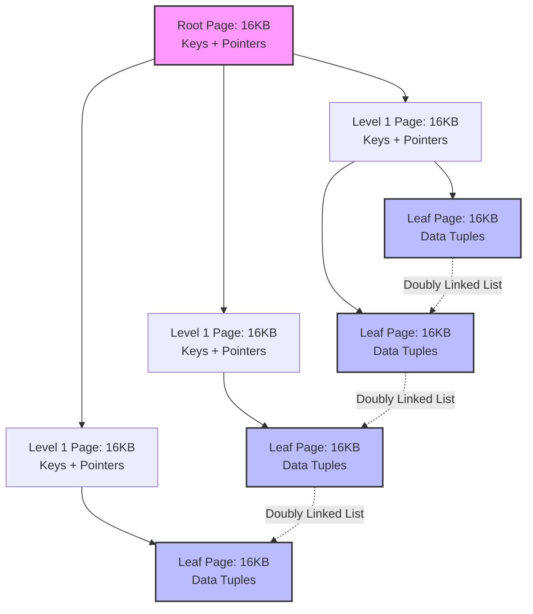
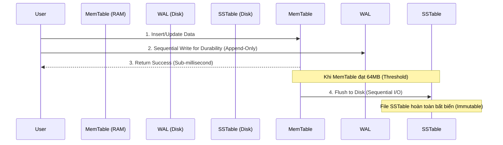

# Giải Phẫu Storage Engine: B-Tree vs LSM-Tree Và Vật Lý Của I/O Đĩa

## Vì Sao Thiết Kế Storage Engine Xoay Quanh I/O Chứ Không Phải CPU

Bất kỳ hệ cơ sở dữ liệu quy mô lớn, thông lượng cao nào cũng có một storage engine nằm ở trung tâm, âm thầm quyết định tốc độ của cả hệ thống. Nhiệm vụ của nó nghe có vẻ đơn giản: giữ cấu trúc dữ liệu trong RAM và đồng bộ nó với những gì nằm trên đĩa vật lý — dù là đĩa từ quay, SSD SATA, hay ổ NVMe. Nhưng khi khối lượng giao dịch vượt qua một ngưỡng nhất định, một điều thú vị xảy ra: hiệu năng không còn là câu chuyện của CPU nữa. Query optimizer, instruction pipelining, hay thậm chí băng thông mạng — không cái nào còn quan trọng. Điều quyết định lúc này là thiết bị lưu trữ "thích" được truy cập theo kiểu nào.

Đó chính là bài toán cốt lõi mà bài viết này đi sâu vào: sự lệch pha giữa cách các cấu trúc dữ liệu truyền thống truy cập dữ liệu (phần lớn là ngẫu nhiên) và cách lưu trữ vật lý thực sự vận hành tốt nhất (tuần tự, đôi khi tuần tự một cách cực đoan). Hiểu sai chỗ này, bạn sẽ phải trả giá bằng read amplification, write amplification, space amplification, và tail latency khó lường.

Chúng ta sẽ đi qua hai cấu trúc dữ liệu đang thống trị thiết kế storage engine ngày nay: B-Tree — nền tảng của PostgreSQL và InnoDB trong MySQL, và Log-Structured Merge-Tree (LSM-Tree) — cỗ máy đứng sau RocksDB, Cassandra và CockroachDB. Cùng với đó là chi phí I/O vật lý, phân cấp cache, và Định lý RUM — cái tên gọi đúng cho sự đánh đổi mà bất kỳ ai thiết kế storage engine cũng sẽ chạm phải sớm hay muộn.

## Đĩa Từ Quay Đã Định Hình B-Tree Như Thế Nào

B-Tree (và biến thể gần như phổ biến tuyệt đối của nó, B+Tree) xuất hiện từ thập niên 1970, khi Rudolf Bayer và Edward McCreight thiết kế nó cho phương tiện lưu trữ chủ đạo thời bấy giờ: ổ cứng từ tính (HDD). HDD có một đặc điểm quyết định gần như mọi thứ về hiệu năng của nó — độ trễ truy cập ngẫu nhiên cực cao, hệ quả trực tiếp của việc đây là một thiết bị cơ học.

Một yêu cầu I/O ngẫu nhiên trên HDD gồm hai bước vật lý:
1. **Thời gian tìm rãnh (Seek Time - $T_{seek}$):** di chuyển cụm đầu từ đến đúng rãnh đĩa.
2. **Độ trễ quay (Rotational Latency - $L_{rotational}$):** chờ đĩa quay để sector cần tìm nằm dưới đầu đọc.

Độ trễ quay có công thức khá gọn:

$$ L_{rotational} = \frac{1}{2} \times \frac{60}{\text{RPM}} \text{ (giây)} $$

Cộng dồn lại, một ổ 7200 RPM tiêu chuẩn mất trung bình 8-10 mili-giây cho mỗi lần truy xuất ngẫu nhiên. So với một CPU hiện đại thực thi lệnh trong vài phần nano-giây, đây là điểm nghẽn lãng phí hàng triệu chu kỳ. Đọc tuần tự trên cùng một rãnh lại kể một câu chuyện hoàn toàn khác — hàng trăm megabyte mỗi giây, đơn giản vì đầu từ chỉ đứng yên trong khi đĩa quay bên dưới.

Khoảng cách giữa chi phí ngẫu nhiên và tuần tự không phải là một sự kém hiệu quả nhỏ — nó mang tính cấp số nhân, và điều đó buộc phải có một ràng buộc thiết kế: lấy ra càng nhiều dữ liệu hữu ích càng tốt trong mỗi lần truy xuất đĩa. B-Tree giải quyết việc này bằng cách ánh xạ gọn gàng vào cách hệ điều hành vốn đã quản lý bộ nhớ — theo các trang kích thước cố định, thường từ 4 KB đến 16 KB. Mỗi nút của B+Tree ánh xạ vào đúng một trang vật lý. Để nhét được nhiều thông tin hơn vào mỗi nút, các nút trong chỉ lưu khóa định tuyến và con trỏ con — toàn bộ dữ liệu hàng thực sự nằm ở các nút lá.

### Vì Sao Tìm Kiếm Trên B+Tree Vẫn Nhanh Ở Quy Mô Lớn

Hiệu năng định tuyến của B-Tree phụ thuộc hoàn toàn vào hệ số phân nhánh (fanout - $F$). Giả sử một database dùng trang 16 KB (mặc định của InnoDB) và mỗi entry khóa-con trỏ tốn 12 byte. Một nút trong khi đó chứa được khoảng:

$$ F = \left\lfloor \frac{B_{size}}{S_{entry}} \right\rfloor \approx 1365 \text{ con trỏ} $$

Nhờ hệ số phân nhánh lớn như vậy, chiều cao cây tăng theo hàm logarit với cơ số rất "dễ chịu": $\mathcal{O}(\log_F N)$. Với một bảng chứa $N = 2.5 \times 10^9$ (2,5 tỷ) dòng, cây vẫn chỉ cần:

$$ h = \lceil \log_{1365}(2.5 \times 10^9) \rceil = 3 $$

Ba tầng. Nghĩa là một lần tìm kiếm ngẫu nhiên trên đĩa bị giới hạn tối đa 3 thao tác I/O vật lý — và trên thực tế, buffer pool giữ root và các nút level-1 thường trực trong RAM, nên chi phí thực tế cho một point lookup thường chỉ là $\mathcal{O}(1)$ I/O.

## Vấn Đề Write Amplification Ẩn Trong Mọi B-Tree

Hiệu năng point-query của B-Tree rất tốt và dễ dự đoán, nhưng cái giá phải trả là: mọi thứ đều diễn ra qua *cập nhật tại chỗ (in-place update)*. Sửa một dòng dữ liệu, storage engine phải tìm đúng trang 16 KB, kéo nó vào buffer pool, vá lại các byte trong bộ nhớ, rồi ghi toàn bộ khối 16 KB đó trở lại đúng vị trí cũ trên đĩa (thường qua Direct I/O, bỏ qua page cache của hệ điều hành).

Dưới tải ghi nặng, cơ chế này tạo ra thứ gọi là write amplification ($W_A$):

$$ W_A = \frac{\text{Số Byte Thực Tế Ghi Xuống Đĩa}}{\text{Số Byte Người Dùng Yêu Cầu Thay Đổi}} $$

Chỉ thay đổi 50 byte dữ liệu thực tế, engine vẫn phải flush toàn bộ 16.384 byte của trang chứa nó. Đó là hệ số write amplification khoảng $W_A \approx 327.68$ — cho một thay đổi logic rất nhỏ.

Chi phí còn tăng thêm khi một trang lá đầy (Fill Factor = 100%). Chèn dữ liệu vào một trang đã đầy sẽ kích hoạt page split: engine cấp phát một khối mới, khóa trang hiện tại, chuyển khoảng một nửa dữ liệu sang trang mới, và cập nhật khóa phân tách ở nút cha. Nếu nút cha cũng đầy, việc phân tách này lan lên trên theo dây chuyền — có thể tới tận root.

Để giữ cây này nhất quán dưới mức độ đồng thời cao, cần một thuật toán gọi là *latch crabbing*: một luồng lấy latch đọc/ghi trên nút cha trước khi chạm vào nút con, và chỉ giải phóng latch của cha khi đã chứng minh được nút con sẽ không bị split. Trong một đợt ghi dồn dập, tranh chấp latch ở các tầng trên trở thành điểm nghẽn thực sự trên máy nhiều lõi.

### Vì Sao SSD Không Thực Sự Giải Quyết Được Vấn Đề

Ổ cứng thể rắn (SSD), xây dựng trên NAND flash, đã thay đổi hoàn toàn bối cảnh vật lý — chúng loại bỏ hoàn toàn seek time — nhưng lại mang đến một ràng buộc khác không kém phần khắc nghiệt: các ô nhớ flash không thể ghi đè tại chỗ. Để thay đổi dù chỉ một vùng dữ liệu nhỏ, Flash Translation Layer (FTL) của SSD phải chạy qua chu trình Read-Modify-Write:

1. Đọc toàn bộ một erase block (thường 2-8 MB) từ flash vào bộ nhớ SRAM nội bộ của ổ đĩa.
2. Sửa trang 16 KB tương ứng trong bộ đệm đó.
3. Xóa *toàn bộ* khối vật lý cũ bằng lệnh xóa điện áp cao, chậm, xóa trắng hàng triệu ô nhớ.
4. Ghi toàn bộ khối đã cập nhật ra một vị trí vật lý mới.

I/O ngẫu nhiên, phân mảnh mà page split và cập nhật tại chỗ của B-Tree sinh ra va chạm dữ dội với cơ chế erase-block này. Băng thông hữu ích giảm, và — quan trọng hơn với bất kỳ ai đang vận hành phần cứng production — tuổi thọ vật lý của ổ đĩa (đo bằng Terabytes Written, hay TBW) co lại nhanh chóng, dẫn đến hỏng hóc sớm trong các môi trường doanh nghiệp có tải cao.

## LSM-Tree: Đặt Cược Tất Cả Vào Ghi Tuần Tự

Để né tránh điểm nghẽn ghi và làm việc thuận theo vật lý của flash thay vì chống lại nó, LSM-Tree bỏ hẳn cập nhật tại chỗ. Mọi thao tác biến đổi — chèn, sửa, xóa — trở thành một entry mới có timestamp, được nối tuần tự vào một buffer trong bộ nhớ gọi là MemTable.

Thao tác xóa không thực sự xóa dữ liệu vật lý — thay vào đó, nó chèn một bản ghi mới hơn mang cờ tombstone. Bản thân MemTable thường được cài đặt bằng SkipList, một cấu trúc dùng con trỏ tiến ngẫu nhiên để giữ độ phức tạp chèn và tìm kiếm ở mức $\mathcal{O}(\log N)$ mà không phải trả chi phí khóa khi tái cân bằng như AVL hay Red-Black tree.

Vì toàn bộ đường đi cập nhật diễn ra trong bộ nhớ chính, thông lượng ghi của LSM-Tree tiệm cận băng thông thô của CPU và bus bộ nhớ. Tuy nhiên độ bền dữ liệu (chữ 'D' trong ACID) vẫn phải được đảm bảo từ đâu đó: mọi thao tác ghi được nối đồng bộ vào một file Write-Ahead Log (WAL) trên đĩa trước khi engine xác nhận thành công. Vì WAL chỉ bao giờ nhận các thao tác nối tuần tự, chi phí ghi này gần như không đáng kể về độ trễ đĩa.

Khi MemTable vượt qua một ngưỡng dung lượng nhất định — 64 MB hoặc 128 MB là các giá trị mặc định phổ biến — vùng bộ nhớ này đóng băng thành một cấu trúc bất biến và được flush xuống đĩa dưới dạng file Sorted String Table (SSTable). Bằng cách biến những gì lẽ ra là ghi ngẫu nhiên thành các đợt ghi tuần tự lớn, LSM-Tree tận dụng tối đa băng thông của NVMe, gần như loại bỏ write amplification ở tầng phần mềm, và đối xử với các erase block của NAND đúng theo cách chúng cần được đối xử.

## Cái Giá Của Ghi Tuần Tự Nằm Ở Phía Đọc

Lợi thế ở phía ghi này không miễn phí. Việc không có cập nhật tại chỗ nghĩa là lịch sử của một khóa chính có thể nằm rải rác trên hàng chục file. Một point query phải lần ngược theo thời gian: kiểm tra MemTable đang hoạt động, rồi các MemTable đã đóng băng, rồi bất kỳ file SSTable nào có thể chứa phiên bản cũ hơn của khóa đó.

Việc mở, giải nén và quét qua nhiều file cho một lần tra cứu duy nhất sinh ra read amplification có thể nhanh chóng vượt ngưỡng chấp nhận được nếu không được kiểm soát.

### Bloom Filter: Đưa Tốc Độ Đọc Trở Lại

Các cài đặt LSM-Tree giải quyết vấn đề này bằng một Bloom filter được nhúng vào phần metadata footer của mỗi SSTable. Bloom filter là một cấu trúc xác suất gọn nhẹ, trả lời câu hỏi "phần tử này có thể nằm trong tập hợp không?" bằng một mảng bit kích thước $m$ và $k$ hàm băm độc lập cho $n$ phần tử.

Xác suất dương tính giả tuân theo công thức:

$$ P \approx \left(1 - e^{-\frac{kn}{m}}\right)^k $$

Lấy đạo hàm theo $k$ cho thấy số hàm băm tối ưu là:

$$ k = \frac{m}{n} \ln 2 $$

Ở mức tối ưu này, filter chỉ cần khoảng 10 bit cho mỗi key — một lượng RAM không đáng kể — trong khi giữ tỷ lệ dương tính giả ở khoảng 1%. Con số 1% đó thỉnh thoảng gây ra một lần đọc đĩa lãng phí, nhưng phần thưởng lại rất lớn: filter loại bỏ khoảng 99% các lần đọc lẽ ra sẽ chạm đĩa để tìm một key không hề tồn tại. Nếu Bloom filter trả lời "không có", engine bỏ qua file đó mà không cần chạm vào lưu trữ.

### Compaction: Trả Nợ Không Gian Và Đọc

Nếu bị bỏ mặc, một LSM-Tree sẽ tích lũy vô hạn các file SSTable chồng lấp và dữ liệu chết (các bản cập nhật đã bị ghi đè, tombstone) — đây là space amplification, và nó chỉ tệ hơn theo thời gian.

Giải pháp là một tiến trình chạy nền gọi là compaction. Cách tiếp cận phổ biến nhất — Level-Tiered Compaction, dùng trong RocksDB — tổ chức không gian lưu trữ thành các tầng ($L_0, L_1, L_2, \dots$), trong đó mỗi tầng $L_{i+1}$ bị giới hạn ở khoảng $T$ lần kích thước của $L_i$ (thường $T=10$).

Khi tầng $L_i$ chạm ngưỡng, engine chạy thuật toán N-way merge sort: đọc các file chồng lấp từ $L_i$ và $L_{i+1}$, gộp chúng trong bộ nhớ để loại bỏ các phiên bản lỗi thời và xóa tombstone, rồi ghi tuần tự kết quả đã loại trùng lặp trở lại $L_{i+1}$.

Điều này giữ read amplification và space amplification trong tầm kiểm soát, nhưng không miễn phí — chi phí ghi nền của compaction khá đáng kể. Với leveled compaction, write amplification xấp xỉ theo công thức:

$$ W_A \approx \text{Levels} \times \frac{T}{2} $$

Nói cách khác, hệ thống đang bỏ ra băng thông I/O và chu kỳ CPU thực sự ở phía nền, chỉ để giữ cho các thao tác đọc ở tuyến trước luôn nhanh và thu hồi lại không gian đĩa.

## Định Lý RUM Conjecture: Vì Sao Không Storage Engine Nào Thắng Trên Mọi Trục

Sự đánh đổi này không phải ngẫu nhiên — nó được hình thức hóa trong Định lý RUM Conjecture (Athanassoulis et al., 2016). Định lý phát biểu rằng Read Overhead ($R$), Update Overhead ($U$), và Memory/Storage Overhead ($M$) bị ràng buộc với nhau:

$$ R \times U \times M = C $$

Bạn không thể tối ưu cả ba cùng lúc. Giảm một chiều xuống, ít nhất một trong hai chiều còn lại sẽ tăng lên.

*   **B-Tree tối ưu cho $R$ và $M$:** đọc nhanh (point lookup $O(\log N)$), và chi phí bộ nhớ thấp vì không có dữ liệu trùng lặp. Cái giá rơi vào $U$ — cập nhật đắt đỏ vì random I/O và page split.
*   **LSM-Tree tối ưu cho $U$ và $M$:** cập nhật nhanh vì chỉ là các thao tác nối tuần tự thuần túy, và dữ liệu được đóng gói dày đặc trên đĩa. Cái giá rơi vào $R$ — đọc vốn dĩ chậm hơn, và engine phải tốn CPU cho compaction chạy nền cũng như giữ Bloom filter thường trực trong RAM chỉ để kiểm soát cái giá đó.

## Điều Này Có Ý Nghĩa Gì Khi Chọn Storage Engine

Sau khi xem xét cách B-Tree và LSM-Tree thực sự vận hành dưới tải, một vài kết luận thực tế nổi bật lên:

1.  **Vật lý phần cứng định hình kiến trúc phần mềm, chứ không phải ngược lại.** B-Tree được xây dựng cho cơ học quay của HDD, cực đại hóa dữ liệu hữu ích cho mỗi lần seek. LSM-Tree được xây dựng cho NAND flash, tôn trọng chu trình erase-block bằng cách biến mọi thứ thành các luồng tuần tự.
2.  **I/O tuần tự luôn thắng, trên mọi loại phương tiện.** HDD, SSD, NVMe, thậm chí cả cache line của RAM — truy cập tuần tự luôn đánh bại truy cập ngẫu nhiên. Đó chính xác là lý do các hệ thống như Kafka và Cassandra scale được một cách đáng tin cậy: chúng coi đĩa như một nhật ký chỉ-nối-thêm.
3.  **Không có bữa trưa miễn phí — hãy chọn đánh đổi một cách có chủ đích.** Nếu workload của bạn 95% là đọc (chẳng hạn một dịch vụ hồ sơ người dùng), một engine dạng B-Tree như PostgreSQL là lựa chọn đúng. Nếu 95% là ghi (IoT telemetry, sổ cái tài chính, distributed logging), một engine LSM-Tree như RocksDB hay Cassandra mới giữ cho I/O không sụp đổ dưới tải.
4.  **Write amplification không chỉ là vấn đề hiệu năng mà còn là vấn đề tuổi thọ phần cứng.** Cập nhật tại chỗ trên flash làm nó hao mòn nhanh hơn. Theo dõi $W_A$ trong production quan trọng không kém gì với ngân sách hạ tầng so với độ trễ.
5.  **Toán học chính là thứ khiến khả năng mở rộng trở nên khả thi.** Việc scale tới hàng tỷ dòng mà không có các đợt tăng vọt độ trễ dựa trên các cấu trúc xác suất (Bloom filter) và các giới hạn tiệm cận (fanout logarit). Hiểu được các chứng minh này là điều kiện cần để thiết kế hệ thống ở quy mô đó.
