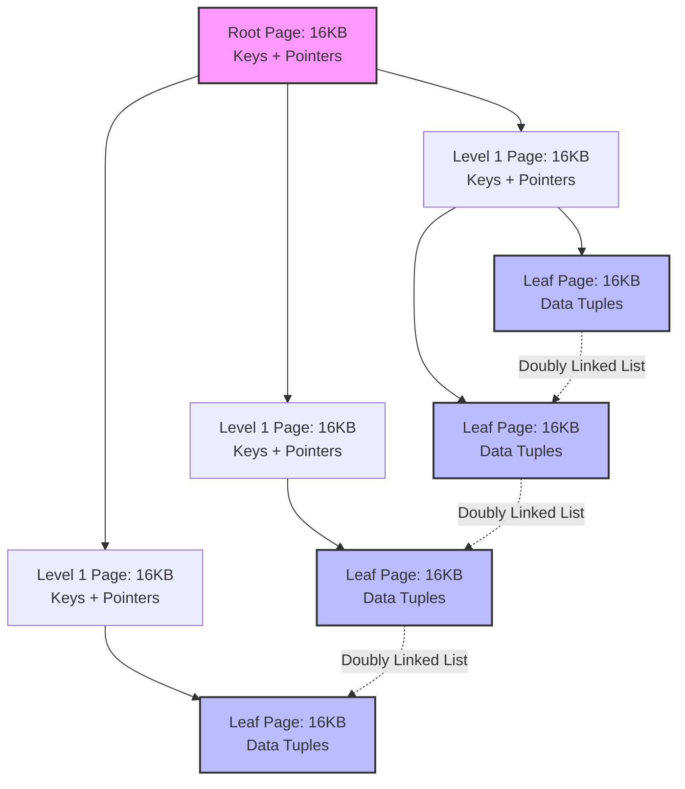
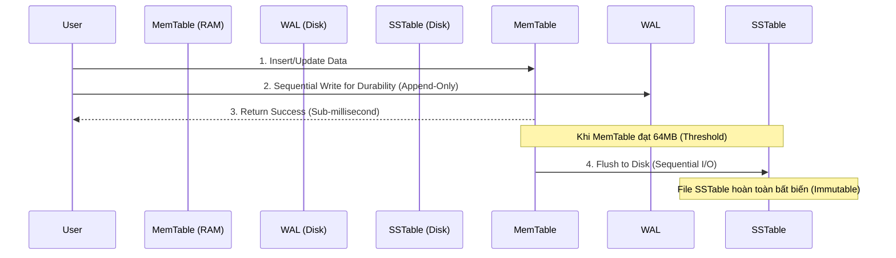

# Phân Tích Kiến Trúc Storage Engine: Giới Hạn Cơ Học Của B-Tree Và Tối Ưu Hóa I/O Trong LSM-Tree

## Tóm Tắt Khái Quát & Đặt Vấn Đề Cốt Lõi

Storage engine là tầng ít được nhắc tới nhất trong một hệ cơ sở dữ liệu, nhưng lại là tầng quyết định phần lớn hiệu năng và khả năng mở rộng thực tế. Nó chịu trách nhiệm quản lý cấu trúc dữ liệu trong RAM và đồng bộ chúng xuống thiết bị lưu trữ vật lý — từ HDD cơ học tới SSD và NVMe. Chọn sai storage engine ở giai đoạn thiết kế, đội ngũ kỹ thuật thường chỉ nhận ra hậu quả khi hệ thống đã chịu tải thật.

Ở quy mô công nghiệp, một điều khá bất ngờ xảy ra: hiệu năng hệ thống không còn bị giới hạn bởi tốc độ CPU, pipeline lệnh, hay băng thông mạng nữa. Nó bị chi phối gần như hoàn toàn bởi đặc tuyến truy xuất I/O (I/O access pattern) của thiết bị lưu trữ bên dưới.

**Vấn đề cốt lõi nằm ở chỗ này:** các cấu trúc dữ liệu truyền thống được thiết kế cho kiểu truy cập ngẫu nhiên, trong khi phần cứng lưu trữ hiện đại lại phạt nặng chính kiểu truy cập đó. Sự lệch pha này tạo ra các điểm nghẽn nghiêm trọng. Ở tầng vi kiến trúc, việc chọn cấu trúc dữ liệu nền tảng quyết định trực tiếp các hệ số khuếch đại (đọc, ghi, không gian) và chi phối độ trễ ở phân vị cao (tail latency).

Bài viết này đi sâu vào hai mô hình storage engine đang thống trị hiện nay: B-Tree — nền tảng của các RDBMS truyền thống như PostgreSQL, MySQL InnoDB — và Log-Structured Merge-Tree (LSM-Tree), cốt lõi của các hệ NoSQL/NewSQL hiện đại như RocksDB, Cassandra, CockroachDB. Chúng ta sẽ xem xét chi phí I/O vật lý, giới hạn phần cứng, phân cấp bộ nhớ đệm, và cách RUM Conjecture hình thức hóa sự đánh đổi giữa hai kiến trúc này.

## Giới Hạn Vật Lý Và Đặc Tuyến I/O Của Thiết Bị Lưu Trữ Từ Tính

B-Tree (và biến thể phổ biến nhất — B+Tree) ra đời từ thập niên 1970, do Rudolf Bayer và Edward McCreight giới thiệu. Nó được thiết kế để phù hợp với loại lưu trữ thống trị thời đó: ổ đĩa từ tính (HDD). Đặc điểm định hình nên toàn bộ thiết kế này là độ trễ truy cập ngẫu nhiên rất cao của HDD, hệ quả trực tiếp từ cơ chế cơ học chậm của nó.

Mỗi yêu cầu I/O ngẫu nhiên trên HDD kéo theo hai thao tác vật lý tách biệt:
1. **Thời gian tìm rãnh (Seek Time - $T_{seek}$):** di chuyển cụm đầu từ (actuator arm) đến đúng rãnh đĩa.
2. **Độ trễ quay (Rotational Latency - $L_{rotational}$):** chờ đĩa quay đến khi sector cần đọc nằm dưới đầu đọc/ghi.

Độ trễ quay được tính theo công thức:

$$ L_{rotational} = \frac{1}{2} \times \frac{60}{\text{RPM}} \text{ (giây)} $$

Cộng cả hai lại, thời gian truy xuất ngẫu nhiên trung bình của một HDD 7200 RPM tiêu chuẩn rơi vào khoảng 8-10 mili-giây. So với tốc độ thực thi lệnh dưới nano-giây của CPU hiện đại, độ trễ này là một hố đen thực sự, lãng phí hàng triệu chu kỳ xử lý cho mỗi lần truy xuất. Ngược lại, đọc tuần tự trên cùng một rãnh đĩa lại rất nhanh — có thể đạt hàng trăm MB/s — đơn giản vì đầu từ chỉ cần đứng yên trong khi đĩa quay bên dưới.

Khoảng cách quá lớn giữa chi phí truy cập ngẫu nhiên và tuần tự buộc các nhà thiết kế phải tối đa hóa lượng dữ liệu hữu ích lấy được trong mỗi lần đụng vào đĩa. B-Tree giải quyết điều này bằng cách bám sát cơ chế phân trang (paging) của hệ điều hành: dữ liệu được quản lý theo khối kích thước cố định, thường 4KB đến 16KB. Một cây B+Tree ánh xạ mỗi node vào đúng một trang vật lý trên đĩa. Để tiết kiệm không gian, các node trong (internal node) chỉ lưu khóa định tuyến và con trỏ, còn toàn bộ dữ liệu thực (payload) dồn xuống các node lá.

### Giới Hạn Toán Học Của Độ Phức Tạp Tìm Kiếm

Hiệu năng định tuyến của B-Tree phụ thuộc trực tiếp vào hệ số phân nhánh (fanout - $F$). Giả sử database dùng kích thước trang $B_{size} = 16 \text{ KB}$ (mặc định của InnoDB trong MySQL), và mỗi entry khóa-con trỏ tốn $S_{entry} = 12 \text{ bytes}$. Một node trong khi đó có thể chứa số con trỏ lên tới:

$$ F = \left\lfloor \frac{B_{size}}{S_{entry}} \right\rfloor \approx 1365 \text{ con trỏ} $$

Với hệ số phân nhánh lớn như vậy, chiều cao cây tăng theo $\mathcal{O}(\log_F N)$ — cơ số logarit rất lớn. Ngay cả với một tập dữ liệu 2,5 tỷ bản ghi ($N = 2.5 \times 10^9$), chiều cao cây vẫn thấp đến bất ngờ:

$$ h = \lceil \log_{1365}(2.5 \times 10^9) \rceil = 3 $$

Nói cách khác, tìm kiếm ngẫu nhiên trên đĩa chỉ cần tối đa 3 lần I/O vật lý. Và trên thực tế con số này còn thấp hơn nữa, vì các database hiện đại đều có buffer pool: root và các node level 1 gần như luôn nằm sẵn trong RAM, khiến chi phí thực tế cho một point lookup thường chỉ còn $\mathcal{O}(1)$ I/O vật lý.

## Vi Kiến Trúc B-Tree Và Nghịch Lý Khuếch Đại Ghi Trên Bộ Nhớ Flash

B-Tree cho hiệu năng truy vấn điểm rất tốt và dễ dự đoán, nhưng cái giá phải trả nằm ở cơ chế *cập nhật tại chỗ (in-place update)*. Mỗi khi một bản ghi bị sửa, storage engine phải: định vị trang 16KB tương ứng, nạp vào buffer pool, sửa mảng byte trong RAM, rồi ghi đè toàn bộ khối 16KB đó trở lại đúng vị trí cũ trên đĩa (thường qua Direct I/O, bỏ qua OS cache).

Với các workload ghi nặng, cơ chế này gây ra hiện tượng Khuếch đại Ghi (Write Amplification - $W_A$), định nghĩa như sau:

$$ W_A = \frac{\text{Số Byte Thực Tế Ghi Xuống Đĩa Vật Lý}}{\text{Số Byte Người Dùng Yêu Cầu Thay Đổi Logic}} $$

Thử hình dung: một update logic chỉ thay đổi 50 bytes dữ liệu, nhưng database buộc phải ghi lại toàn bộ 16384 bytes — hệ số khuếch đại ở tầng phần mềm ngay lập tức là $W_A \approx 327.68$.

Chi phí còn tăng thêm khi một node lá đầy (fill factor 100%). Chèn dữ liệu mới vào lúc này sẽ kích hoạt page split: storage engine phải xin cấp một khối lưu trữ mới, khóa trang hiện tại, chia đôi dữ liệu sang trang mới, rồi cập nhật separator key lên node cha. Nếu node cha cũng đầy, việc phân tách sẽ lan ngược lên trên, có thể ảnh hưởng tới cả root.

Để giữ cây nhất quán trong môi trường đa luồng, hệ thống phải dùng thuật toán *Latch Crabbing*: một luồng phải giữ read/write latch tại node cha trước khi vào node con, và chỉ nhả latch cha khi chắc chắn node con sẽ không bị split. Trong các đợt ghi bùng nổ, tranh chấp latch ở các node cấp cao trở thành điểm nghẽn rõ rệt trên CPU đa lõi.

### Tình Huống Tiến Thoái Lưỡng Nan Của Khối Xóa SSD (SSD Erase-Block Dilemma)

SSD nền NAND Flash làm thay đổi hoàn toàn bức tranh này. Nó loại bỏ độ trễ cơ học $T_{seek}$, nhưng lại mang một ràng buộc vật lý khó nhằn khác: các ô nhớ Flash không hỗ trợ ghi đè trực tiếp. Để sửa một vùng dữ liệu nhỏ, bộ điều khiển SSD (qua tầng Flash Translation Layer - FTL) phải thực hiện chu trình *Read-Modify-Write*:

1. Đọc toàn bộ một khối xóa (erase block, thường 2MB-8MB) vào SRAM nội bộ của ổ đĩa.
2. Sửa trang 16KB cần thay đổi bên trong bộ đệm đó.
3. Xóa (erase) điện áp cao toàn bộ khối vật lý cũ — thao tác chậm, xóa trắng hàng triệu ô nhớ.
4. Ghi toàn bộ khối dữ liệu mới sang một vùng vật lý còn trống.

Khi các luồng I/O ngẫu nhiên, phân mảnh cao — hệ quả của page split và ghi đè tại chỗ trong B-Tree — cộng hưởng với đặc tính erase-block của SSD, băng thông hữu ích bị bào mòn đáng kể. Tệ hơn, nó rút ngắn tuổi thọ vật lý (TBW - Terabytes Written) của các khối NAND Flash, dẫn tới hỏng hóc phần cứng sớm hơn dự kiến trong môi trường doanh nghiệp quy mô lớn.

## Kiến Trúc Log-Structured Merge-Tree: Thiết Kế Ưu Thế Tuần Tự

Để giải quyết tận gốc nút thắt ghi và thích nghi với đặc tính vật lý của Flash, LSM-Tree từ bỏ hoàn toàn mô hình cập nhật tại chỗ. Nó thay bằng ngữ nghĩa *chỉ-nối-thêm (append-only)*: mọi thao tác — chèn, sửa, xóa — đều được xử lý như một sự kiện mới có dấu thời gian, nối tiếp vào một bộ nhớ đệm (MemTable) trong RAM.

Thao tác xóa không xóa dữ liệu vật lý ngay, mà chèn một bản ghi mới đánh dấu *Tombstone*. MemTable thường được cài đặt bằng cấu trúc dữ liệu cân bằng nhanh, hỗ trợ đồng thời tốt như SkipList — dùng xác suất ngẫu nhiên để quyết định số con trỏ tiến (forward pointer) của một node mới, giữ độ phức tạp chèn/tìm ở $\mathcal{O}(\log N)$ mà không cần các thao tác rebalance có khóa tốn kém như AVL hay Red-Black Tree.

Vì toàn bộ cập nhật logic chỉ diễn ra trên RAM, thông lượng ghi của LSM-Tree tiệm cận băng thông lý thuyết của CPU và bus bộ nhớ. Để đảm bảo tính bền (Durability trong ACID) khi mất điện, mỗi ghi vẫn được đồng bộ vào một Write-Ahead Log (WAL) trước khi phản hồi thành công cho client. Vì WAL chỉ nhận I/O tuần tự, độ trễ ghi gần như chạm giới hạn vật lý của thiết bị.

Khi MemTable vượt ngưỡng cấu hình (ví dụ 64MB hoặc 128MB), nó bị đóng băng và flush xuống đĩa thành một file Sorted String Table (SSTable) bất biến. Bằng cách chuyển gần như toàn bộ Random I/O thành Sequential I/O khối lượng lớn, LSM-Tree khai thác tối đa băng thông của NVMe SSD, gần như triệt tiêu write amplification ở tầng phần mềm, và bảo vệ các khối erase-block của NAND Flash.

## Cái Giá Của Ghi Tuần Tự: Khuếch Đại Đọc Và Quá Trình Compaction

Nhưng lợi thế ghi tuần tự của LSM-Tree đi kèm một cái giá lớn cho các workload đọc nhiều. Vì không có cập nhật tại chỗ, các phiên bản dữ liệu bị phân tán khắp nơi — một primary key duy nhất có thể có lịch sử sửa đổi nằm rải rác trên hàng chục file. Một point query buộc phải quét ngược theo thời gian: kiểm tra MemTable đang hoạt động, rồi các MemTable đã đóng băng, rồi lần lượt các SSTable trên đĩa.

Việc mở, giải nén và quét qua nhiều file độc lập như vậy tạo ra Khuếch đại Đọc (Read Amplification), có thể đẩy độ trễ đọc lên mức không chấp nhận được nếu không có biện pháp kiểm soát.

### Bộ Lọc Bloom (Bloom Filters): Tối Ưu Hóa Truy Xuất Đọc Bằng Toán Học

Để giải quyết vấn đề đọc, LSM-Tree nhúng một *Bloom Filter* vào phần metadata footer của mỗi SSTable. Đây là một cấu trúc dữ liệu xác suất, rất tiết kiệm không gian, dùng để kiểm tra nhanh một phần tử có khả năng thuộc một tập hợp hay không. Nó dùng một mảng bit kích thước $m$ và $k$ hàm băm độc lập để ánh xạ $n$ phần tử.

Xác suất dương tính giả (false positive) của Bloom Filter được tính bằng:

$$ P \approx \left(1 - e^{-\frac{kn}{m}}\right)^k $$

Lấy đạo hàm theo $k$ cho thấy cấu hình tối ưu đạt được khi:

$$ k = \frac{m}{n} \ln 2 $$

Ở cấu hình tối ưu này, một LSM database chỉ cần khoảng 10 bit cho mỗi key — RAM tốn không đáng kể. Hệ thống chấp nhận tỷ lệ lỗi $P \approx 1\%$ (dẫn đến một lần đọc đĩa thừa hiếm hoi), nhưng đổi lại thông lượng đọc cải thiện hàng chục lần, vì 99% các lần đọc đĩa vô ích (zero-value reads) bị chặn lại. Nếu Bloom filter báo một khóa *không* nằm trong SSTable, engine bỏ qua hẳn file đó mà không cần chạm đĩa.

### Nghịch Lý Compaction Và Khuếch Đại Không Gian (Space Amplification)

Theo thời gian, khi engine liên tục flush dữ liệu, số lượng SSTable chồng lấp và các bản ghi lỗi thời (bị che khuất bởi update mới hoặc Tombstone) tăng lên không ngừng, gây lãng phí dung lượng — Khuếch đại Không gian (Space Amplification).

Giải pháp là một tiến trình nền chuyên gộp và dọn rác gọi là *Compaction*. Mô hình phổ biến nhất hiện nay là **Level-Tiered Compaction** (dùng trong RocksDB): không gian lưu trữ được chia thành các tầng ($L_0, L_1, L_2, \dots$), trong đó dung lượng tối đa của tầng $L_{i+1}$ luôn lớn gấp $T$ lần tầng $L_i$ (thường $T=10$).

Khi tầng $L_i$ đầy, engine chạy N-way Merge Sort: đọc các file từ $L_i$ và các file chồng lấp ở $L_{i+1}$, gộp lại trong bộ nhớ để loại bỏ phiên bản cũ và Tombstone, rồi ghi tuần tự dữ liệu đã dedup trở lại $L_{i+1}$.

Cách này giới hạn được cả read amplification lẫn space amplification, nhưng chi phí ghi nền lại không nhỏ. Write Amplification cho Leveled Compaction xấp xỉ:

$$ W_A \approx \text{Levels} \times \frac{T}{2} $$

Nói cách khác, hệ thống phải hy sinh một lượng lớn băng thông I/O nền và chu kỳ CPU để giữ hiệu năng đọc ổn định cho luồng xử lý chính và thu hồi không gian đĩa.

## Định Lý RUM Conjecture: Định Luật Cơ Bản Của Cấu Trúc Dữ Liệu

Sự đánh đổi này không phải là chi tiết triển khai ngẫu nhiên — nó được hình thức hóa trong **RUM Conjecture** (Athanassoulis et al., 2016). Định lý phát biểu rằng trong bất kỳ hệ quản trị dữ liệu nào, ba chi phí cốt lõi — Read Overhead ($R$), Update Overhead ($U$), và Memory/Storage Overhead ($M$) — bị ràng buộc bởi một hằng số:

$$ R \times U \times M = C $$

Không kiến trúc sư nào tối ưu được cả ba chiều cùng lúc. Cải thiện một chiều luôn kéo theo suy giảm ở ít nhất một chiều còn lại.

*   **B-Tree tối ưu cho $R$ và $M$:** đọc nhanh ($O(\log N)$ point lookup) và chi phí bộ nhớ thấp (ít dữ liệu trùng lặp). Đổi lại, $U$ rất đắt — cập nhật tốn kém do random I/O và page split.
*   **LSM-Tree tối ưu cho $U$ và $M$:** cập nhật cực nhanh nhờ sequential append-only I/O, và dữ liệu được nén chặt trên đĩa. Đổi lại, $R$ chậm hơn về bản chất, phải bù bằng compaction chạy nền tốn CPU và Bloom Filter giữ trong RAM.

## Bài Học Rút Ra Và Trọng Tâm Kiến Trúc

Từ việc phân tích cơ chế vận hành của B-Tree và LSM-Tree, có vài điểm đáng ghi nhớ khi thiết kế storage engine cho hệ thống thực tế:

1.  **Vật lý phần cứng định đoạt kiến trúc phần mềm:** thuật toán không thể phớt lờ đặc tính vật lý của phần cứng bên dưới. B-Tree là giải pháp tối ưu cho HDD quay cơ học, tối đa hóa dữ liệu lấy được mỗi lần seek. LSM-Tree tối ưu cho NAND Flash SSD, tôn trọng chu trình erase-block bằng cách biến mọi thứ thành luồng tuần tự.
2.  **Sequential I/O luôn thắng Random I/O:** dù là HDD, SSD, NVMe, hay cả cache line của RAM, truy xuất tuần tự luôn nhanh hơn đáng kể so với truy xuất ngẫu nhiên. Các hệ phân tán như Kafka, Cassandra scale tốt vì xử lý đĩa như một append-only log.
3.  **Không có storage engine hoàn hảo — chỉ có RUM Conjecture:** khi chọn storage engine cho một service, bạn phải xác định rõ mình sẵn sàng đánh đổi điều gì. Workload 95% đọc (ví dụ service hồ sơ người dùng) thì B-Tree (PostgreSQL) là lựa chọn hợp lý. Workload 95% ghi (IoT telemetry, sổ cái tài chính, distributed logging) thì LSM-Tree (RocksDB, Cassandra) gần như là bắt buộc để tránh sập I/O.
4.  **Write Amplification bào mòn SSD:** cập nhật tại chỗ trên Flash không chỉ ảnh hưởng hiệu năng mà còn rút ngắn tuổi thọ phần cứng. Theo dõi $W_A$ trong production nên là việc làm thường xuyên.
5.  **Toán học là nền tảng của khả năng mở rộng:** khả năng scale tới hàng tỷ bản ghi mà không gặp latency spike bắt nguồn từ xác suất (Bloom Filter) và giới hạn tiệm cận (fanout logarit). Hiểu rõ những chứng minh này là nền tảng để thiết kế hệ phân tán đạt chuẩn công nghiệp.
