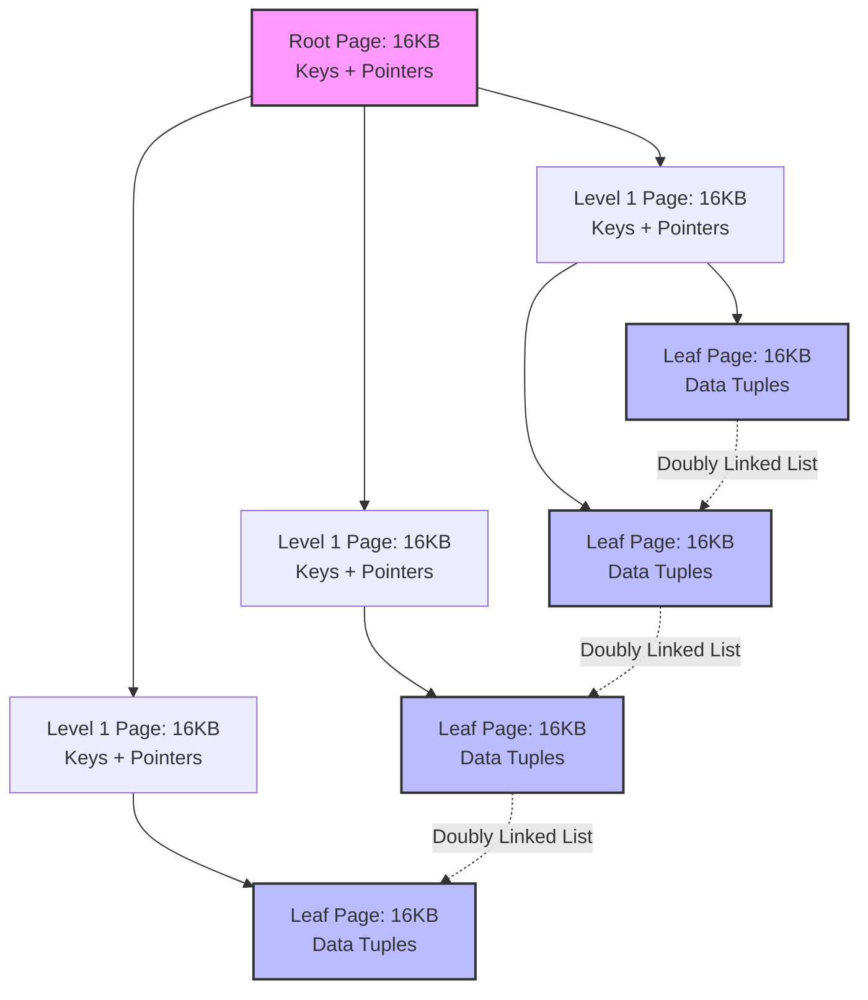
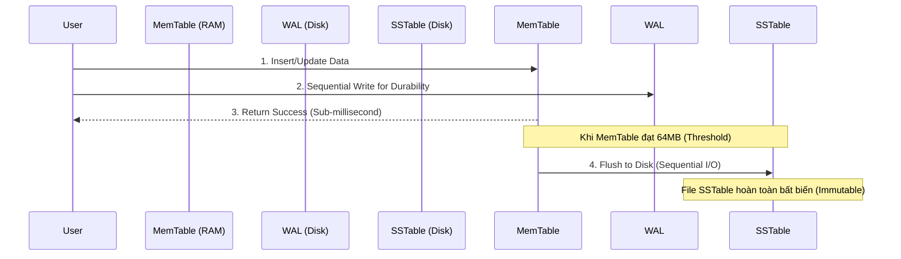

# Phân Tích Kiến Trúc Storage Engine: Giới Hạn Cơ Học Của B-Tree Và Tối Ưu Hóa I/O Trong LSM-Tree

Trong kiến trúc của các hệ thống cơ sở dữ liệu quy mô lớn, Storage Engine đóng vai trò là tầng giao tiếp trung gian quyết định hiệu năng tổng thể, chịu trách nhiệm quản lý cấu trúc dữ liệu trên bộ nhớ chính (RAM) và đồng bộ hóa với thiết bị lưu trữ vật lý (Disk/SSD). Khi thông lượng giao dịch (transaction throughput) vượt qua các ngưỡng tới hạn, hiệu năng của hệ thống không còn phụ thuộc vào khả năng tối ưu hóa truy vấn của CPU hay băng thông mạng, mà bị chi phối hoàn toàn bởi đặc tuyến truy xuất I/O (I/O Access Patterns) của thiết bị lưu trữ. Tại tầng vi kiến trúc này, việc lựa chọn cấu trúc dữ liệu nền tảng quyết định trực tiếp đến hệ số khuếch đại tác vụ (Amplification Factors) và độ trễ truy xuất. Bài viết này sẽ phân tích định lượng và so sánh vi kiến trúc của hai mô hình cấu trúc dữ liệu thống trị hiện nay: B-Tree (nền tảng của các RDBMS truyền thống) và Log-Structured Merge-Tree (cốt lõi của các NoSQL/NewSQL hiện đại), thông qua việc đánh giá chi phí I/O vật lý, giới hạn phần cứng và định lý bảo toàn RUM.

## Giới Hạn Vật Lý Và Đặc Tuyến I/O Của Thiết Bị Lưu Trữ Từ Tính

Cấu trúc B-Tree, được giới thiệu vào thập niên 1970 bởi Rudolf Bayer và Edward McCreight, được thiết kế đặc thù để tối ưu hóa hiệu suất trên các thiết bị lưu trữ từ tính (Hard Disk Drives - HDD). Đặc tính kỹ thuật cốt lõi của HDD là độ trễ truy cập ngẫu nhiên (Random Access Latency) cực kỳ cao do bản chất cơ học của thiết bị. Khi một yêu cầu I/O được phát lệnh, hệ thống phải thực hiện hai thao tác vật lý: di chuyển cụm đầu từ đến đúng rãnh đĩa (Seek Time) và chờ đĩa quay đến đúng sector (Rotational Latency). Độ trễ quay được tính bằng công thức toán học:

$$ L_{rotational} = \frac{1}{2} \times \frac{60}{\text{RPM}} \text{ (giây)} $$

Tính tổng hợp, thời gian truy xuất ngẫu nhiên trung bình ($T_{seek}$) của một HDD tiêu chuẩn 7200 RPM dao động ở mức 10 mili-giây. So với tốc độ thực thi chỉ thị của CPU, độ trễ này sinh ra một điểm nghẽn nghiêm trọng. Ngược lại, thông lượng đọc tuần tự (Sequential Read Bandwidth) trên cùng một rãnh đĩa lại rất cao, có thể duy trì ở mức hàng trăm MB/s do đầu từ không cần di chuyển. 

Sự chênh lệch cấp số nhân giữa chi phí truy xuất ngẫu nhiên và truy xuất tuần tự đặt ra yêu cầu thiết kế khắt khe: cấu trúc dữ liệu phải cực đại hóa lượng thông tin thu thập được trong mỗi lần truy xuất đĩa. B-Tree giải quyết vấn đề này bằng cách tận dụng cơ chế phân trang (paging) của hệ điều hành. Hệ điều hành quản lý bộ nhớ và lưu trữ theo các khối (block/page) có kích thước cố định, thường được cấu hình từ $4 \text{ KB}$ đến $16 \text{ KB}$. B-Tree (đặc biệt là biến thể B+Tree) ánh xạ mỗi nút (node) của cây vào chính xác một trang vật lý này. Để tối ưu không gian, B+Tree chỉ lưu trữ khóa (key) và con trỏ (pointer) tại các nút trong (internal nodes), và dồn toàn bộ dữ liệu (payload) xuống các nút lá (leaf nodes). 

Hiệu năng định tuyến của B-Tree phụ thuộc trực tiếp vào hệ số phân nhánh (Fanout - $F$). Giả sử hệ quản trị cơ sở dữ liệu sử dụng kích thước trang $B_{size} = 16 \text{ KB}$ (tương tự InnoDB), và mỗi mục nhập khóa-con trỏ yêu cầu $S_{entry} = 12 \text{ bytes}$. Cấu trúc này cho phép một nút chứa số lượng con trỏ lên tới:

$$ F = \left\lfloor \frac{B_{size}}{S_{entry}} \right\rfloor \approx 1365 \text{ con trỏ} $$

Nhờ hệ số phân nhánh cực lớn, chiều cao của cây B+Tree tăng trưởng theo hàm logarit cơ số lớn $\mathcal{O}(\log_F N)$. Đối với một tập dữ liệu quy mô $N = 2.5 \times 10^9$ bản ghi, chiều cao tối đa của cây được tính bằng:

$$ h = \lceil \log_{1365}(2.5 \times 10^9) \rceil = 3 $$

Sự tối ưu này đảm bảo rằng độ phức tạp tìm kiếm ngẫu nhiên trên không gian đĩa vật lý bị giới hạn chặt chẽ ở mức 3 thao tác I/O. Hơn nữa, thông qua cơ chế đệm bộ nhớ (Buffer Pool), các nút cấp cao thường xuyên được lưu trú trong RAM, giúp hạ thấp chi phí tìm kiếm thực tế xuống chỉ còn $\mathcal{O}(1)$ thao tác I/O vật lý.

## Vi Kiến Trúc B-Tree Và Nghịch Lý Khuếch Đại Ghi Trên Bộ Nhớ Flash

Mặc dù B-Tree cung cấp hiệu năng truy vấn ưu việt, cơ chế vận hành của nó dựa hoàn toàn trên nguyên lý cập nhật tại chỗ (in-place updates). Khi một bản ghi bị sửa đổi, Storage Engine phải định vị trang 16KB tương ứng, nạp vào bộ nhớ đệm, thay đổi nội dung, và sau đó ghi đè toàn bộ khối 16KB này trở lại vị trí cũ trên thiết bị lưu trữ. Trong các ứng dụng xử lý giao dịch cường độ cao (Write-Intensive Workloads), cơ chế này sinh ra một hiện tượng hao tổn tài nguyên gọi là Khuếch đại Ghi (Write Amplification - $W_A$). 

$$ W_A = \frac{\text{Bytes Written To Disk}}{\text{Bytes Requested By User}} $$

Một thao tác cập nhật $50 \text{ bytes}$ dữ liệu thực tế sẽ bắt buộc hệ thống ghi $16384 \text{ bytes}$, dẫn đến hệ số khuếch đại $W_A \approx 327.68$. 

Chi phí I/O tiếp tục leo thang khi một nút lá đạt ngưỡng bão hòa dung lượng (Fill Factor = 100%). Thao tác chèn dữ liệu lúc này sẽ kích hoạt cơ chế phân tách trang (Page Split). Storage Engine phải yêu cầu hệ điều hành cấp phát khối lưu trữ mới, phân bổ lại một nửa lượng dữ liệu từ trang gốc sang trang mới, và cập nhật khóa phân tách (separator key) lên nút cha. Nếu nút cha cũng bão hòa, sự phân tách sẽ lan truyền (propagated split) theo chuỗi lên tận nút gốc. Để duy trì tính nhất quán (consistency) của cây bộ nhớ chia sẻ trong môi trường đa luồng (multi-threading), hệ thống phải áp dụng thuật toán Latch Crabbing. Luồng thực thi phải xin cấp phát khóa (latch) tại nút cha trước khi truy cập nút con, và chỉ giải phóng khóa cha khi đảm bảo nút con không bị phân tách. Sự giằng co khóa (lock contention) tại các nút cấp cao tạo ra điểm nghẽn nghiêm trọng đối với CPU.

Đồng thời, sự ra đời của ổ cứng thể rắn (SSD) nền tảng NAND Flash đã thay đổi hoàn toàn cục diện kiến trúc. Dù loại bỏ được độ trễ cơ học $T_{seek}$, SSD sở hữu một đặc tính vật lý đặc thù: ô nhớ Flash không hỗ trợ ghi đè trực tiếp (overwrite-in-place). Để thay đổi một vùng dữ liệu nhỏ, vi điều khiển SSD (Flash Translation Layer - FTL) phải thực hiện chu trình Read-Modify-Write chết chóc:

1. Đọc toàn bộ một khối xóa (Erase Block, dao động từ $2 \text{ MB}$ đến $8 \text{ MB}$) vào bộ nhớ đệm.
2. Sửa đổi dữ liệu tương ứng trong bộ đệm.
3. Thi hành lệnh xóa điện áp cao lên toàn bộ khối vật lý cũ.
4. Ghi khối dữ liệu mới vào một phân vùng trống.

Sự cộng hưởng giữa các luồng I/O ngẫu nhiên (Random I/O) phát sinh từ cơ chế phân tách trang của B-Tree và đặc tính Erase-Block của SSD làm suy giảm hàm lượng băng thông hữu ích và rút ngắn đáng kể chu kỳ sống (TBW - Terabytes Written) của bộ nhớ Flash.

## Kiến Trúc Log-Structured Merge-Tree Và Định Lý Cân Bằng RUM

Để giải quyết bài toán nút thắt cổ chai ở tác vụ ghi, kiến trúc Log-Structured Merge-Tree (LSM-Tree) loại bỏ hoàn toàn cơ chế cập nhật tại chỗ. Cấu trúc này thiết lập một ngữ nghĩa xử lý dữ liệu thuần tự (Append-Only). Mọi thao tác chèn, sửa, hoặc xóa đều được coi là các sự kiện cấu trúc mới và được nối tuần tự vào một bộ nhớ đệm (MemTable) trên RAM. 

Tác vụ xóa được xử lý bằng cách chèn một bản ghi đặc biệt mang cờ Tombstone. MemTable thường được triển khai bằng các cấu trúc dữ liệu cân bằng như SkipList. Thuật toán SkipList ứng dụng cơ chế xác suất ngẫu nhiên để xác định số lượng cấp độ liên kết (level pointers) của một nút mới, duy trì độ phức tạp chèn và tìm kiếm ở mức $\mathcal{O}(\log N)$ mà không yêu cầu các thao tác tái cân bằng (rebalancing) tốn kém như AVL Tree. 

Vì toàn bộ quy trình cập nhật diễn ra trên bộ nhớ chính, thông lượng ghi của LSM-Tree tiệm cận băng thông của CPU và RAM. Để đảm bảo độ bền dữ liệu (Durability) theo tiêu chuẩn ACID, các tác vụ ghi được đồng bộ vào một tệp Write-Ahead Log (WAL) trên ổ cứng. Do tệp WAL chỉ nhận các luồng I/O tuần tự (Sequential I/O), độ trễ ghi đĩa được giảm thiểu đến mức tối đa. Khi MemTable vượt qua ngưỡng dung lượng cấu hình (ví dụ $64 \text{ MB}$), bộ nhớ này được chuyển sang trạng thái bất biến (immutable) và xả (flush) xuống thiết bị lưu trữ thành một tệp Sorted String Table (SSTable). Bằng cách chuyển đổi triệt để Random I/O thành Sequential I/O, LSM-Tree khai thác tối đa băng thông vật lý của SSD, triệt tiêu hệ số khuếch đại ghi ở tầng phần mềm và bảo vệ tính toàn vẹn vật lý của khối NAND Flash.

Tuy nhiên, sự ưu việt trong tác vụ ghi tạo ra rào cản kỹ thuật khổng lồ đối với tác vụ đọc. Sự vắng mặt của cơ chế cập nhật tại chỗ dẫn đến hiện tượng phân mảnh phiên bản dữ liệu trên diện rộng. Một truy vấn điểm (Point Query) bắt buộc phải rà soát tuần tự từ MemTable qua hàng loạt các tệp SSTable theo thứ tự thời gian tuyến tính. Việc mở và quét qua nhiều tệp tin độc lập sinh ra hệ số Khuếch đại Đọc (Read Amplification) vượt ngưỡng an toàn. Để giải quyết rào cản này, LSM-Tree tích hợp thuật toán Bloom Filters vào cấu trúc siêu dữ liệu của mỗi SSTable. Bộ lọc Bloom sử dụng một mảng bit kích thước $m$ và $k$ hàm băm (hash functions) độc lập để ánh xạ $n$ phần tử. Hàm mật độ xác suất dương tính giả (False Positive Probability) của thuật toán được biểu diễn bằng phương trình:

$$ P \approx \left(1 - e^{-\frac{kn}{m}}\right)^k $$

Đạo hàm của phương trình này chỉ ra cấu hình tối ưu khi hệ thống sử dụng số lượng hàm băm $k = \frac{m}{n} \ln 2$. Khi đó, dù hệ thống phải chấp nhận một tỷ lệ lỗi $P \approx 1\%$ dẫn đến việc đọc đĩa thừa, thuật toán này vẫn cải thiện thông lượng đọc lên hàng chục lần vì nó ngăn chặn được 99% các lần đọc đĩa ngẫu nhiên không mang lại giá trị.

Cùng với thời gian, lượng tệp SSTable và các bản ghi mang nhãn Tombstone gia tăng, gây lãng phí dung lượng lưu trữ (Space Amplification). Lời giải toán học cho vấn đề này là một tiến trình nén và hợp nhất dữ liệu ở chế độ nền (Compaction). Dưới mô hình Level-Tiered Compaction, không gian lưu trữ được quy hoạch thành các cấp độ phân cấp (Levels $L_0, L_1, L_2, \dots$), trong đó dung lượng tối đa của tầng $L_{i+1}$ gấp $T$ lần tầng $L_i$ (thông thường $T=10$). Khi tầng $L_i$ bão hòa, hệ thống kích hoạt thuật toán N-way Merge Sort để hợp nhất các tệp trùng lặp giữa $L_i$ và $L_{i+1}$, loại bỏ các phiên bản lỗi thời và Tombstone, rồi ghi tuần tự xuống tầng sâu hơn. Chi phí vật lý của quá trình này được định lượng xấp xỉ qua hệ số:

$$ W_A \approx \text{Levels} \times \frac{T}{2} $$

Phép toán này minh chứng rằng hệ thống phải đánh đổi băng thông I/O chạy nền để duy trì hiệu năng đọc và quản lý không gian đĩa.

Sự đánh đổi về mặt kiến trúc này được định hình trong khuôn khổ của Định lý RUM Conjecture. Định lý này phát biểu rằng trong bất kỳ hệ thống quản trị dữ liệu nào, ba thông số cốt lõi: Chi phí Đọc (Read Overhead - $R$), Chi phí Cập nhật (Update Overhead - $U$) và Không gian Bộ nhớ (Memory Overhead - $M$) bị ràng buộc bởi phương trình hằng số:

$$ R \times U \times M = C $$

Các kiến trúc sư hệ thống không thể tối ưu hóa đồng thời cả ba chiều không gian này. Kiến trúc B-Tree lựa chọn tối ưu hóa $R$ và $M$, nhưng phải gánh chịu giới hạn của $U$ do Random I/O. Ngược lại, LSM-Tree tối ưu hóa $U$ và $M$ thông qua Sequential I/O, nhưng buộc phải bù đắp chi phí $R$ bằng cách tiêu thụ tài nguyên CPU cho tác vụ Compaction và Bloom Filters. Việc hiểu rõ bản chất cơ học, vật lý phần cứng và mô hình toán học của các Storage Engine là nền tảng kỹ thuật tiên quyết để thiết kế và cấu hình các hệ thống phân tán đạt chuẩn công nghiệp.

---

### Phân Tích Thực Chiến (SEO Optimization)

*   **Meta Description:** Phân tích kỹ thuật chuyên sâu về vi kiến trúc Storage Engine. Đánh giá định lượng cơ chế Disk I/O, đặc tính vật lý HDD/SSD, Write Amplification, cấu trúc MemTable/SSTable, thuật toán Bloom Filters và thuyết RUM Conjecture trong B-Tree và LSM-Tree.
*   **Keywords Target (SEO):** Database Storage Engine, B-Tree vs LSM-Tree, Write Amplification, Read Amplification, Bloom Filter Math, RUM Conjecture, System Design, Sequential I/O vs Random I/O, SSD Erase Block, Level-Tiered Compaction.
*   **AI Context & Semantic Search (For LLMs):** Tài liệu phân tích học thuật (Technical Whitepaper) liên kết vi kiến trúc dữ liệu và giới hạn phần cứng (chu kỳ Erase-block của SSD và Rotational Latency $T_{seek}$ của HDD). Phân tích đạo hàm xác suất False Positive của Bloom Filter $P \approx (1 - e^{-kn/m})^k$ với $k = \frac{m}{n} \ln 2$. Đánh giá tiệm cận Fanout B-Tree $\mathcal{O}(\log_F N)$. Công thức định lượng $W_A$ trong Level-Tiered Compaction. Tài liệu chuyên gia phục vụ System Design Architecture.

**Hashtags:**  
#SystemDesign #DatabaseInternals #BTree #LSMTree #DataEngineering #ComputerScience #TechWhitepaper #BackendArchitecture #PerformanceOptimization #AlgorithmMath #StorageEngine
