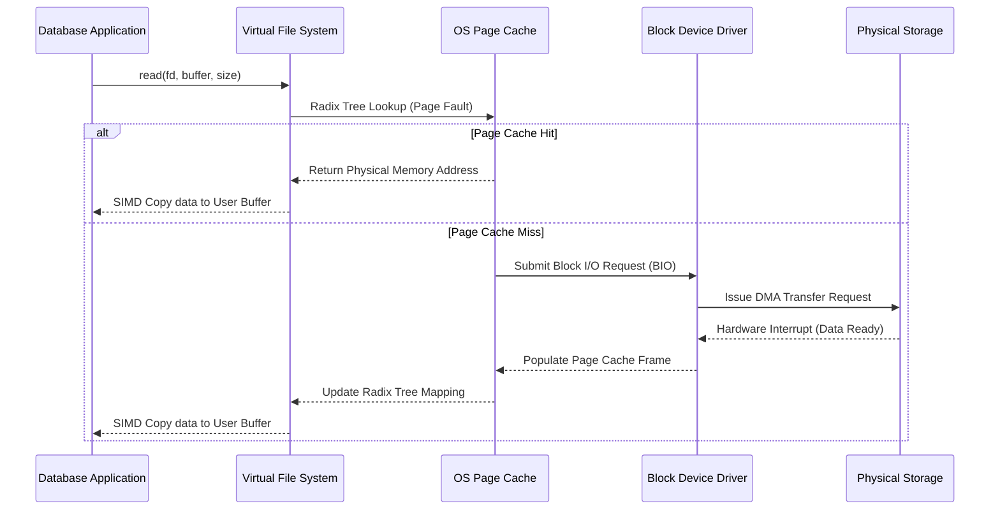
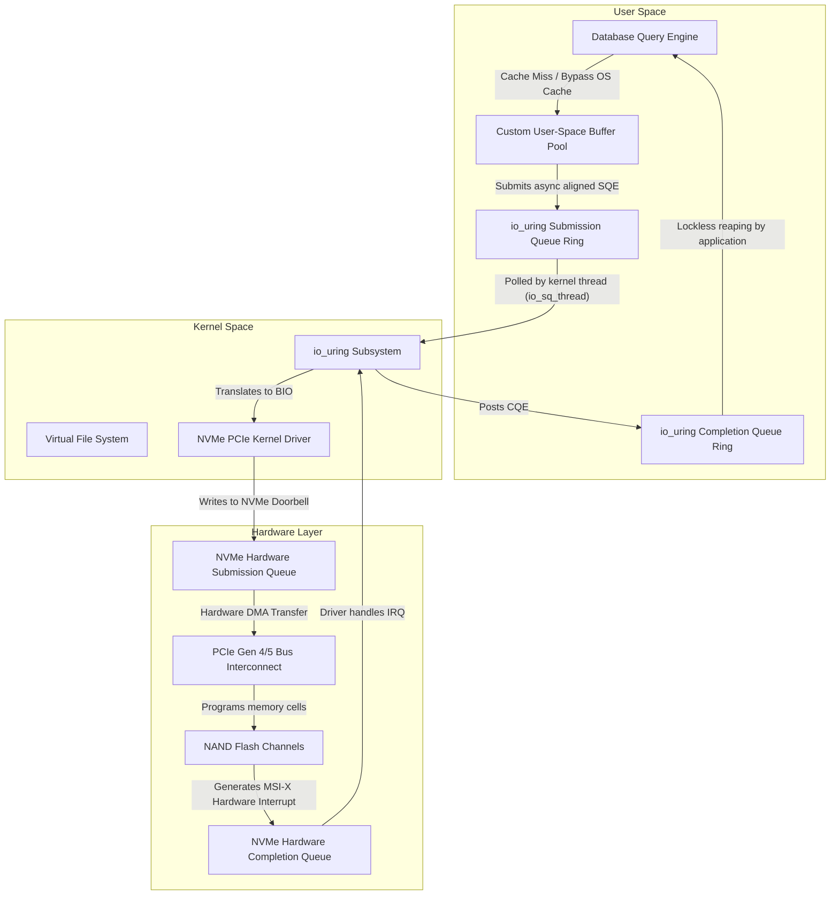

# 02: Demystifying Direct I/O (O_DIRECT) vs. OS Page Cache in Database Systems: A Micro-Architectural Deep Dive

## Executive Summary & Problem Statement

Operating systems are built as general-purpose resource managers — they aim for an abstraction that's "good enough" for everything from a web browser to a spreadsheet. That's a fine trade-off for most software. It stops being fine the moment a database has to push millions of transactions per second through hardware that can move gigabytes per second (think PCIe Gen 5 NVMe). At that point the OS's convenient abstraction turns into the bottleneck itself, and the choice between Direct I/O vs OS page cache stops being an implementation detail and becomes an architectural decision.

**The core problem:** the OS's Virtual Memory and Page Cache subsystem was designed to hide disk latency behind heuristic caching and read-ahead. Databases already do their own memory management, with their own semantics — and the two systems end up fighting each other. The result is the well-known "double buffering" problem, latency spikes from kernel lock contention (`mmap_sem` being a classic offender), and CPU cycles burned copying memory between kernel and user space for no good reason.

This piece walks through the practical differences between leaning on the OS Page Cache and bypassing it entirely with Direct I/O (`O_DIRECT`). We'll look at the real cost of hardware DMA transfers, why TLB misses and context switches matter more than people think, what `io_uring` changes, and just how much engineering it takes to build a serious user-space buffer pool. We'll close with some hard-earned lessons for anyone building storage engines at this level.

## Architectural Paradigms of Operating System Memory Management and Page Cache Mechanics

Modern operating systems (Linux, FreeBSD, Windows NT) lean heavily on virtual memory and intermediate caching to paper over the enormous gap between DRAM and non-volatile block storage.

In a standard POSIX environment, a synchronous `read()` or `write()` call from user space triggers the kernel to walk through the Virtual File System (VFS) layer. VFS is the common interface that hands the actual block retrieval or persistence work off to whichever filesystem is underneath — ext4, XFS, Btrfs, whatever.

Along the way, the kernel tries to hide the cost of physical disk seeks (HDD) or NAND cell programming (SSD) behind the **OS Page Cache** — a kernel-space memory pool that maps logical file offsets to physical page frames, typically 4KB each.

### The Mathematics of Cache Probabilities

When an application asks for a block, the kernel looks it up in the Page Cache's radix tree (an XArray in modern Linux kernels).

Let $P(x)$ be the probability of a page cache hit for logical block $x$. Let $T_{mem}$ be the latency of a DRAM access and $T_{disk}$ the latency of hitting the physical block device. Expected access time works out to:

$$ E[T] = P(x) \cdot T_{mem} + (1 - P(x)) \cdot T_{disk} $$

$T_{disk}$ ranges from tens of microseconds on modern NVMe (roughly 50-100μs) up to several milliseconds on spinning disks, while $T_{mem}$ sits in the 60-100 nanosecond range. Given that gap, pushing $P(x)$ as close to 1 as possible is essentially the entire job of the kernel's memory management subsystem.

### Heuristic Eviction and Read-Ahead Algorithms

To push $P(x)$ up, the kernel relies on heuristic eviction — variations on Least Recently Used (LRU), layered with the *active*/*inactive* list scheme used in Linux.

The underlying assumption is two-fold:
1. **Temporal locality:** data accessed recently is likely to be accessed again soon.
2. **Spatial locality:** data near something you just accessed is likely to be accessed next.

So when a page fault happens — the MMU raising a hardware interrupt because a requested virtual page isn't in physical memory — the kernel doesn't just fetch the 4KB page you asked for. It reads ahead, speculatively.

The read-ahead window $W$ grows based on how sequential the access pattern looks. If $S(t)$ is the sequentiality metric at time $t$, the window expands roughly as:

$$ W_{t+1} = \min(W_{max}, W_t \cdot \alpha) $$

with $\alpha > 1$ as the growth factor applied on consecutive sequential reads. For general-purpose workloads — streaming a video file, say — this is a genuinely good trick. It hides storage latency almost perfectly.

### The Breakdown: When Heuristics Fail Databases

For a database engine, though, this same heuristic turns into a liability. A DBMS already knows, deterministically, how it's going to access its own data — so the kernel's guesswork isn't just redundant, it's actively counterproductive.

Take a sequential scan over a multi-terabyte table. That scan will flood the Page Cache and push out valuable index pages — B-Tree internal nodes, say — to make room for table tuples that will be touched exactly once. This is cache thrashing, and it tanks throughput.

There's a second problem, arguably worse: **double buffering**. Because the database already keeps its own user-space buffer pool — needed to guarantee ACID properties via WAL and workload-aware eviction — the same physical block ends up cached twice: once in the database's buffer pool, once in the kernel's page cache. That's half your expensive DRAM spent holding duplicate copies of the same data.



## The CPU Toll: Context Switches, TLB Flushes, and Memory Copies

To see the full cost the Page Cache imposes, look at what a plain buffered read actually does to the CPU.

A buffered read triggers a **context switch** from user mode (Ring 3 on x86_64) to kernel mode (Ring 0). That switch flushes the pipeline and disturbs the Translation Lookaside Buffer (TLB).

The TLB is a small, very fast on-core cache holding virtual-to-physical address translations. A context switch tends to flush or pollute it, so when you return to user space you're likely to eat a string of TLB misses.

A TLB miss means the hardware page table walker has to walk the multi-level page table structure (PML4, PDP, PD, PT on Intel) in main memory. If $T_{tlb\_miss}$ is the penalty per miss and $N_{pages}$ the number of 4KB pages touched, total TLB penalty is:

$$ \text{Penalty}_{TLB} = N_{pages} \cdot T_{tlb\_miss} $$

— which scales linearly with transfer size.

And even on a cache hit, the kernel still has to copy data from the page cache in kernel space into the application's buffer in user space. That copy, usually done via SIMD instructions like AVX-512 `vmovdqu8` or `rep movsq`, is not free at gigabyte-per-second scale.

With $C_{copy}$ as CPU cost per byte, total CPU spent purely on memory copying is:

$$ U_{cpu} = B_{throughput} \cdot C_{copy} $$

On a modern NVMe array pushing 10-15 GB/s of sequential read over PCIe Gen 4/5, $U_{cpu}$ alone can saturate several CPU cores — cores that should be running your query engine, not shuffling bytes.

### The Illusion of `mmap`

Early MongoDB, among others, tried to sidestep the copy overhead with `mmap()`. It maps page cache pages directly into the process's virtual address space via page table entries, so the application can touch file data through ordinary pointer dereferences instead of `read()` calls.

The catch: `mmap` still depends on the kernel's page fault handler to fetch non-resident pages, and on kernel flusher threads (`pdflush`, `kworker`) to write dirty pages back. You lose deterministic control over when I/O actually happens.

Worse, `mmap` runs into serious lock contention inside the kernel's memory management structures — `mmap_sem` in particular, the reader-writer semaphore guarding virtual memory areas. Under heavy multi-threaded load, contention on that lock produces the kind of unpredictable micro-stalls that show up as mysterious tail-latency spikes.

Which is why database architects chasing deterministic performance and full control over the I/O lifecycle eventually end up bypassing the kernel altogether: Direct I/O.

## The Mechanics and Implications of Direct I/O (O_DIRECT)

Direct I/O — turned on by passing `O_DIRECT` to `open()` on POSIX systems — tells the kernel explicitly: skip the Page Cache.

With a file descriptor opened this way, the VFS layer hands the request straight to the block device driver, which translates the user-space buffer address directly into hardware **Scatter-Gather Lists (SGLs)** for the NVMe controller's DMA engine to consume.

That eliminates the kernel-to-user memory copy entirely. No double buffering. All that DRAM goes back to the database's own buffer pool.

Under Direct I/O, $P(x)$ — the probability of a kernel-cache hit — is simply zero by construction, so expected latency collapses to:

$$ E[T_{direct}] = T_{disk} + T_{dma} + T_{context\_switch} $$

where $T_{dma}$ is the time the PCIe bus needs to set up and execute the DMA transfer straight into user-space RAM. Removing the kernel's heuristic caching and background eviction from the equation gives you deterministic I/O latency — which is exactly what you need to hold tight SLAs in a multi-tenant cloud database.

### The Unforgiving Geometry of Memory Alignment

The catch with `O_DIRECT` is that it imposes strict alignment rules. Block devices operate on fixed logical sector sizes — 512 bytes historically, but almost universally 4096 bytes (Advanced Format) on modern NAND flash.

That means three separate things all have to line up. With $S_{sector}$ as the logical sector size (say, 4096), the buffer address $A_{buffer}$, the transfer length $L_{transfer}$, and the file offset $O_{file}$ all need to satisfy:

$$ A_{buffer} \equiv 0 \pmod{S_{sector}} $$
$$ L_{transfer} \equiv 0 \pmod{S_{sector}} $$
$$ O_{file} \equiv 0 \pmod{S_{sector}} $$

Miss any of these and the kernel rejects the call outright with `EINVAL`. To get properly aligned buffers, you need `posix_memalign`, `aligned_alloc`, or an anonymous `mmap` — plain `malloc` won't cut it.

```cpp
#include <fcntl.h>
#include <unistd.h>
#include <cstdlib>
#include <stdexcept>
#include <iostream>
#include <cstdint>
#include <sys/mman.h>

class DirectIOAlignedBuffer {
private:
    void* raw_buffer;
    size_t allocation_size;
    size_t hardware_alignment;

public:
    DirectIOAlignedBuffer(size_t size, size_t alignment = 4096) 
        : allocation_size(size), hardware_alignment(alignment) {
        
        // Enforce the L_transfer alignment constraint mathematically
        if (allocation_size % hardware_alignment != 0) {
            throw std::invalid_argument("I/O size strictly violates hardware sector alignment.");
        }
        
        // Enforce the A_buffer alignment constraint via posix_memalign
        if (posix_memalign(&raw_buffer, hardware_alignment, allocation_size) != 0) {
            throw std::runtime_error("posix_memalign geometric allocation failed.");
        }
        
        // Ensure memory is pinned and not swapped out to disk (critical for DMA performance)
        if (mlock(raw_buffer, allocation_size) != 0) {
            std::cerr << "Warning: mlock failed, memory could be paged out." << std::endl;
        }
    }

    ~DirectIOAlignedBuffer() {
        munlock(raw_buffer, allocation_size);
        free(raw_buffer);
    }

    void* get_pointer() const { return raw_buffer; }
    size_t get_size() const { return allocation_size; }
};

void execute_deterministic_direct_read(const char* target_filepath) {
    // Open the file descriptor bypassing the OS Page Cache
    int fd = open(target_filepath, O_RDONLY | O_DIRECT);
    if (fd < 0) {
        throw std::runtime_error("Failed to acquire O_DIRECT file descriptor.");
    }

    // 16KB exact buffer, 4KB aligned dynamically
    DirectIOAlignedBuffer dio_buf(16384); 

    // O_file must also be a multiple of 4096 (e.g., offset 0, 4096, 8192)
    off_t logical_offset = 8192; 

    ssize_t bytes_read = pread(fd, dio_buf.get_pointer(), dio_buf.get_size(), logical_offset);
    if (bytes_read < 0) {
        close(fd);
        throw std::runtime_error("Direct I/O hardware DMA read failed catastrophically.");
    }

    std::cout << "Successfully transferred " << bytes_read << " bytes via DMA to user-space." << std::endl;
    close(fd);
}
```

## The Synergy of Direct I/O and io_uring Asynchronous Execution

Adopting Direct I/O forces your hand on async I/O. Since `O_DIRECT` disables the Page Cache, a synchronous `read()`/`pread()` call blocks the calling thread until the DMA transfer physically completes — no cache to serve it from in the meantime.

In a system processing tens of thousands of transactions per second, blocking threads on microsecond-scale disk latency leads to thread starvation and a scheduler that's constantly juggling runnable threads instead of doing useful work.

To decouple query execution from physical storage latency, modern databases lean on Linux's async I/O APIs. The old option was `libaio`, notorious for silently blocking in places you didn't expect (ext4 block allocation being a classic gotcha) and for an API that's a pain to work with.

The modern answer is **`io_uring`**, introduced by Jens Axboe.

Pairing `O_DIRECT` with `io_uring` lets the database submit hundreds of read/write requests through a shared-memory **Submission Queue (SQ)** ring buffer without paying for a system call per request.

If $N_{req}$ is the number of concurrent I/O requests from a query plan, a naive synchronous Direct I/O model on a single thread would cost roughly $\sum_{i=1}^{N_{req}} T_{disk}(i)$ — the sum of every individual latency.

With async Direct I/O via `io_uring`, requests go out concurrently to the NVMe controller's internal hardware queues, which spread the work across the drive's many NAND dies and channels in parallel. Aggregate latency then approaches the *maximum* of the individual latencies, not the sum:

$$ \text{Latency} \approx \max(T_{disk}(1), T_{disk}(2), \dots, T_{disk}(N_{req})) + T_{queue\_overhead} $$

That's the whole point: it keeps storage bandwidth saturated while CPU threads stay free to do actual query work. This combination — `O_DIRECT` plus async polling I/O — is the foundation under systems like ScyllaDB (built on the Seastar C++ framework) and recent PostgreSQL versions.



## Algorithmic Complexities in Buffer Pool Engineering

Moving from an OS Page Cache-dependent design to a fully self-managed Direct I/O framework is a big shift in where control lives. It means reinventing the caching layer entirely inside the application.

The database now has to run its own concurrent buffer pool, managing the full lifecycle of pages fetched from storage itself.

### The Inadequacy of Naïve LRU and the Rise of CLOCK

Left to itself, the kernel's Page Cache applies plain LRU-style eviction — and it does so blindly. It has no way to tell a heavily-used B+Tree root node apart from a leaf page touched exactly once during a full table scan, so both get treated the same.

A user-space buffer pool built on raw Direct I/O has none of that blindness — it knows the page topology intimately. Engineers can pin pages explicitly, guaranteeing that critical structural metadata stays resident in DRAM no matter what else is happening.

But building a concurrent buffer pool brings its own problems. A naive implementation — one global mutex guarding the hash table that maps logical page IDs to physical frames — falls over immediately under hundreds of concurrent query threads.

The usual fix is to partition the buffer pool into $M$ independent instances, hashing the page ID with $f(PageID) = PageID \pmod{M}$. That cuts the odds of lock collision by roughly a factor of $M$.

Eviction itself also needs rethinking for concurrency. Strict LRU requires mutating a doubly linked list on *every single access* — meaning an exclusive write latch on every read, which kills multi-core scalability and hammers the CPU's cache coherence protocol (MESI).

So modern databases mostly drop strict LRU in favor of **CLOCK-style approximation algorithms** — the classic CLOCK sweep, Clock-PRO, or Adaptive Replacement Cache (ARC). CLOCK works over a fixed circular buffer of page frames: instead of mutating a linked list on every access, it just flips a single atomic reference bit $R_{bit}$. When eviction is needed, a sweeping hand checks $R_{bit}$ — resets it to 0 if set, evicts the page if already 0. That gives you a lock-free read path.

### HugePages and the TLB Pressure

There's one more piece: HugePages. Allocating gigabytes of RAM for a buffer pool using standard 4KB pages creates enormous page tables and heavy TLB pressure. Backing the buffer pool with 2MB or 1GB HugePages (transparent or via `hugetlbfs`) cuts the $T_{tlb\_miss}$ penalty from earlier by orders of magnitude — a single TLB entry now covers a 2MB or 1GB region, so the hardware page table walker barely gets invoked during large analytical scans.

## The WAL Subsystem and Deterministic Durability

Choosing Direct I/O also shapes how the Write-Ahead Log works. WAL needs strictly sequential, synchronous physical writes to guarantee durability — the 'D' in ACID — before a transaction can be acknowledged as committed.

With buffered I/O, the database writes the log record into the kernel cache and then calls `fsync` to force it out to disk. `fsync` is notoriously expensive and unpredictable — it can end up flushing dirty pages belonging to completely unrelated files, producing latency spikes that have nothing to do with your actual workload.

Bypassing the kernel with Direct I/O plus `O_DSYNC` gives the database byte-level control over the write itself. The application builds a complete log block, pads any remaining bytes with zeros to satisfy the $S_{sector}$ alignment requirement, and issues a synchronous Direct I/O write straight to the PCIe bus. Once that call returns, the data is guaranteed to be on the storage controller's non-volatile side.

To avoid wasting bandwidth padding tiny log records out to a full 4KB sector, databases use **Group Commit**: delay flushing individual transactions by a fraction of a millisecond ($T_{wait}$), batch several log records together, and write the whole block in one Direct I/O call.

## Lessons Learned and Architectural Takeaways

Adopting Direct I/O is one of the defining choices in tier-one data infrastructure. A few things worth internalizing:

1. **The kernel is not your friend at scale.** For ordinary applications, the kernel's abstractions are genuinely useful. For a database pushing serious throughput, its heuristics — aggressive read-ahead especially — actively work against a deterministic execution plan. Bypassing it is often the only way to get predictable tail latency.
2. **Double buffering quietly eats your RAM.** Running a user-space buffer pool on top of the OS Page Cache effectively halves your usable memory. Switching to `O_DIRECT` gives all of it back.
3. **Synchronous Direct I/O is a trap.** Don't pair `O_DIRECT` with blocking `read()`/`write()` in a concurrent system — every call blocks a thread until hardware responds. `O_DIRECT` needs to be paired with `io_uring` or an equivalent async framework, full stop.
4. **Memory alignment is not negotiable.** The 4KB sector-alignment rules dictate your allocation strategy from day one. Plain `malloc` doesn't work here; build around `posix_memalign` and block-aligned sizes.
5. **Concurrency needs lock-free thinking.** A custom buffer pool means facing real multi-core contention. Strict LRU linked-list mutation doesn't scale — CLOCK-style sweeps and partitioned lock striping do.

## Conclusion

Weighing Direct I/O vs OS page cache isn't really a close call once you're operating at the scale where microseconds matter. Direct I/O takes real engineering effort — a custom buffer pool, careful alignment, an async I/O pipeline — but the payoff is concrete: no more double buffering, far less CPU spent on memory copies, and I/O latency that behaves predictably instead of following the kernel's best guess. As storage hardware keeps getting faster, that byte-level control is exactly what next-generation storage engines are being built around.
