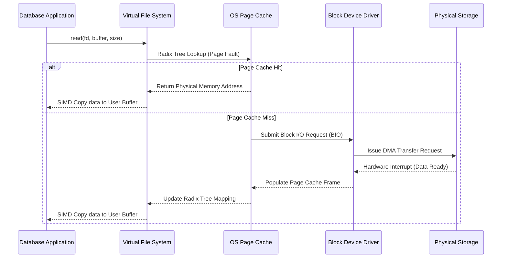
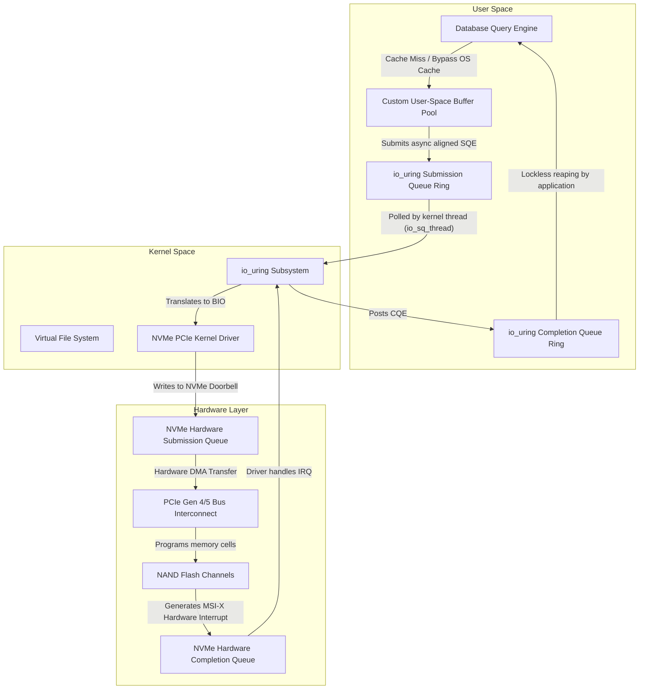

# 02: データベースにおけるDirect I/O（O_DIRECT）とOSページキャッシュの解明：マイクロアーキテクチャの深層

## エグゼクティブサマリーと問題提起

OSはもともと汎用のリソースマネージャーとして作られている。Webブラウザからワードプロセッサまで、あらゆる用途に「そこそこ」動く抽象化を提供するのがOSの仕事だ。だが、データベースが毎秒数百万トランザクションを、PCIe Gen 5 NVMeのようなギガバイト級スループットのハードウェアの上でさばこうとした瞬間、この「そこそこ」の抽象化は途端に足かせになる。ここでDirect I/OとOSページキャッシュのどちらを選ぶかは、単なる実装の細部ではなく、アーキテクチャ全体を左右する判断になる。

**核心の問題はこうだ。** OSの仮想メモリとページキャッシュは、ヒューリスティックなキャッシングと先読みでディスクのレイテンシを隠すために設計されている。一方でデータベースは自分自身のメモリ管理を、独自のセマンティクスで既に行っている。両者は競合し、互いの足を引っ張り合う。その結果が、悪名高い「ダブルバッファリング」であり、`mmap_sem`のようなカーネルのロック競合による予測不能なレイテンシスパイクであり、ユーザー空間とカーネル空間を行き来するだけの無駄なメモリコピーだ。

この記事では、OSページキャッシュに頼る設計と、Direct I/O（`O_DIRECT`）で完全にバイパスする設計の違いを、実務目線で掘り下げる。ハードウェアDMA転送の実際のコスト、TLBミスとコンテキストスイッチがなぜ軽視できないか、`io_uring`が何を変えるのか、そしてユーザー空間バッファプールを本気で作るとどれだけのエンジニアリングが必要になるかを見ていく。最後に、この領域で戦うエンジニアへの実践的な教訓をまとめる。

## OSメモリ管理とページキャッシュメカニズムのアーキテクチャパラダイム

現代のOS(Linux、FreeBSD、Windows NT)は、揮発性のDRAMと不揮発性のブロックストレージの間にある巨大な性能差を埋めるために、仮想メモリ管理と中間キャッシング層に大きく依存している。

標準的なPOSIX環境では、ユーザー空間から同期的な`read()`や`write()`が呼ばれるたびに、OSは仮想ファイルシステム(VFS)層を経由する。VFSは、実際のブロックの取得や永続化をext4、XFS、Btrfsといった下位のファイルシステムに委譲する共通インターフェースだ。

この経路の途中で、OSは物理ディスクヘッドの移動(HDD)やNANDセルへの書き込み(SSD)にかかる遅延を隠すために**OSページキャッシュ**を使う。ページキャッシュはカーネル空間内のメモリプールで、論理的なファイルオフセットを物理ページフレーム(通常4KB)にマッピングし続けている。

### キャッシュ確率の数学

アプリケーションがデータブロックを要求すると、カーネルはページキャッシュの基数木(最新のLinuxカーネルではXArray)を検索する。

論理ブロック$x$に対するページキャッシュヒットの確率を$P(x)$、DRAMアクセスのレイテンシを$T_{mem}$、物理ブロックデバイスへのアクセスレイテンシを$T_{disk}$とすると、期待アクセス時間$E[T]$は次のようになる。

$$ E[T] = P(x) \cdot T_{mem} + (1 - P(x)) \cdot T_{disk} $$

最新のNVMe SSDでは$T_{disk}$が数十マイクロ秒(およそ50〜100μs)、従来型のHDDでは数ミリ秒に達する一方、$T_{mem}$はおおよそ60〜100ナノ秒の範囲に収まる。この差の大きさを踏まえると、$P(x)$をできる限り1に近づけることが、カーネルのメモリ管理サブシステムのほぼすべての仕事だと言っていい。

### ヒューリスティックなエビクションと先読み(Read-Ahead)アルゴリズム

$P(x)$を上げるために、カーネルはLRU(Least Recently Used)の変種をベースにしたヒューリスティックなエビクションを使う。Linuxではactive/inactiveという多世代のリストで拡張されている。

前提になっているのは以下の2つの局所性だ。
1. **時間的局所性:** 最近アクセスされたデータは近い将来また使われる可能性が高い。
2. **空間的局所性:** 近い論理アドレスにあるデータは連続してアクセスされる可能性が高い。

要求された仮想ページが物理メモリに存在せず、MMUがページフォールトを起こしたとき、カーネルは要求された4KBページだけを取ってくるわけではない。投機的に、シーケンシャルな先読みも一緒に行う。

先読みウィンドウ$W$は、アクセスパターンの順次性に応じて動的に広がる。時刻$t$における順次性の指標を$S(t)$とすると、ウィンドウの拡大はおおよそ次のようにモデル化できる。

$$ W_{t+1} = \min(W_{max}, W_t \cdot \alpha) $$

ここで$\alpha > 1$は、連続するシーケンシャルリードに適用される成長係数だ。汎用的なワークロード(動画ファイルの再生など)では、これは実によく効く仕組みで、ストレージのレイテンシをほぼ完全に隠してくれる。

### 崩壊:ヒューリスティックがデータベースでは通用しない理由

ところがデータベースエンジンにとっては、この同じヒューリスティックが厄介者に変わる。データベースは自分のデータアクセスパターンを決定論的に把握している。だからOSレベルの推測は冗長であるだけでなく、時にはむしろ邪魔になる。

数テラバイト規模のテーブルに対するフルスキャンを考えてみよう。このスキャンはページキャッシュを埋め尽くし、価値の高いインデックスページ(B-Treeの内部ノードなど)を、たった一度しか使われないテーブルのタプルのために追い出してしまう。これがキャッシュスラッシングであり、スループットを大きく落とす。

もう一つ、こちらの方が厄介かもしれない問題がある。**ダブルバッファリング**だ。データベースはWALとワークロードに最適化したエビクションでACIDを保証するために、既に自前のユーザー空間バッファプールを持っている。その結果、同じ物理データブロックが、データベースのバッファプールとカーネルのページキャッシュの両方に二重に存在することになる。高価なDRAMの半分が、同じデータの重複コピーに使われているわけだ。



## CPUへの代償:コンテキストスイッチ、TLBフラッシュ、メモリコピー

OSページキャッシュがどれだけコストを課しているかを理解するには、通常のバッファ付きread/writeがCPUに何をしているかを見る必要がある。

バッファ付きのreadはユーザーモード(x86_64ではRing 3)からカーネルモード(Ring 0)への**コンテキストスイッチ**を発生させる。この切り替えはパイプラインをフラッシュし、TLB(Translation Lookaside Buffer)を乱す。

TLBはCPUコア内部にある小さくて高速なキャッシュで、仮想アドレスから物理アドレスへの変換を保持している。コンテキストスイッチが起きると、このTLBはたいていフラッシュされるか汚染され、ユーザー空間に戻ったあとに一連のTLBミスを引き起こす。

TLBミスが起きると、ハードウェアのページテーブルウォーカーがメインメモリ上のマルチレベルページテーブル(IntelでいうPML4、PDP、PD、PT)を辿ることになる。TLBミス1回あたりのペナルティを$T_{tlb\_miss}$、I/Oでタッチする4KBページ数を$N_{pages}$とすると、合計ペナルティは次の通りだ。

$$ \text{Penalty}_{TLB} = N_{pages} \cdot T_{tlb\_miss} $$

これは転送サイズに比例して線形に増える。

そして、たとえキャッシュヒットであっても、カーネルはページキャッシュ(カーネル空間)からアプリケーションのバッファ(ユーザー空間)へのメモリコピーを実行しなければならない。このコピーはAVX-512の`vmovdqu8`や`rep movsq`のようなSIMD命令で最適化されてはいるものの、ギガバイト毎秒のスケールでは決して無視できないコストになる。

1バイトあたりのコピーコストを$C_{copy}$とすると、メモリコピーだけに費やされるCPU使用率は次のようになる。

$$ U_{cpu} = B_{throughput} \cdot C_{copy} $$

PCIe Gen 4/5経由で10〜15GB/sのシーケンシャルリードを叩き出す最近のNVMeアレイでは、$U_{cpu}$だけで複数の高クロックCPUコアを使い切ってしまう。本来クエリ実行に使われるべきコアが、ただのバイトコピーに奪われるわけだ。

### `mmap`という幻想

初期のMongoDBなど一部のデータベースは、`mmap()`でこのコピーのコストを回避しようとした。ページテーブルエントリを介してカーネルのページキャッシュページをプロセスの仮想アドレス空間に直接マッピングし、`read()`を呼ばずにポインタの参照だけでファイルデータにアクセスできるようにする仕組みだ。

しかし`mmap`は、常駐していないページを取ってくるのにカーネルのページフォールトハンドラーに、ダーティページを書き戻すのにカーネルのフラッシャースレッド(`pdflush`や`kworker`)に依存し続ける。つまり、いつ実際のI/Oが発生するかをデータベース側が決定論的に制御できなくなる。

さらに悪いことに、`mmap`はカーネルのメモリ管理構造、特に仮想メモリ領域を保護する`mmap_sem`(リーダー・ライター・セマフォ)まわりで深刻なロック競合を起こす。高度にマルチスレッド化されたワークロードでは、この競合がテールレイテンシのスパイクとして表面化する、いわゆるマイクロストールの原因になる。

だからこそ、決定論的な性能とI/Oライフサイクルの完全な制御を求めるデータベースアーキテクトは、最終的にカーネルを丸ごとバイパスするDirect I/Oに行き着く。

## Direct I/O(O_DIRECT)の仕組みと意味

Direct I/Oは、POSIXシステムで`open()`に`O_DIRECT`フラグを渡すことで有効になる。これはカーネルに対して「ページキャッシュを飛ばせ」と明示的に指示するものだ。

`O_DIRECT`付きで開いたファイルディスクリプタに対するread/writeでは、VFS層はリクエストをそのままブロックデバイスドライバーに渡す。ドライバーはユーザー空間のバッファアドレスを、NVMeコントローラー内蔵のDMAエンジンが処理できるハードウェアの**スキャッター・ギャザーリスト(SGL)**に直接変換する。

これによってカーネル空間とユーザー空間の間のメモリコピーが完全になくなる。ダブルバッファリングも解消され、確保していたDRAMはすべてデータベース自身のバッファプールに戻ってくる。

Direct I/Oではカーネルレベルのキャッシュヒット確率$P(x)$は構造上ゼロなので、期待レイテンシは次のように単純化される。

$$ E[T_{direct}] = T_{disk} + T_{dma} + T_{context\_switch} $$

ここで$T_{dma}$は、PCIeバスがユーザー空間RAMへのDMA転送を準備・実行するのにかかる時間だ。カーネルのヒューリスティックなキャッシングやバックグラウンドのエビクションという不確定要素を取り除くことで、Direct I/Oは決定論的なI/Oレイテンシを実現する。これはマルチテナントのクラウドデータベースが厳格なSLAを守るうえで、譲れない前提条件になる。

### メモリアライメントという容赦のない制約

`O_DIRECT`の代償は、アプリケーションのメモリレイアウトとI/Oサイズに厳格な制約が課されることだ。ブロックストレージデバイスは固定の論理セクターサイズで動作する。かつては512バイトが主流だったが、現在のNANDフラッシュではほぼ4096バイト(Advanced Format)が標準になっている。

そのため、次の3つが同時に条件を満たす必要がある。論理セクターサイズを$S_{sector}$(例: 4096)とすると、バッファアドレス$A_{buffer}$、転送サイズ$L_{transfer}$、ファイルオフセット$O_{file}$はすべて以下を満たさなければならない。

$$ A_{buffer} \equiv 0 \pmod{S_{sector}} $$
$$ L_{transfer} \equiv 0 \pmod{S_{sector}} $$
$$ O_{file} \equiv 0 \pmod{S_{sector}} $$

どれか一つでも満たさなければ、カーネルは即座に`EINVAL`でシステムコールを拒否する。この制約を満たすには、`posix_memalign`や`aligned_alloc`、あるいは匿名の`mmap`を使う必要がある。普通の`malloc`では対応できない。

```cpp
#include <fcntl.h>
#include <unistd.h>
#include <cstdlib>
#include <stdexcept>
#include <iostream>
#include <cstdint>
#include <sys/mman.h>

class DirectIOAlignedBuffer {
private:
    void* raw_buffer;
    size_t allocation_size;
    size_t hardware_alignment;

public:
    DirectIOAlignedBuffer(size_t size, size_t alignment = 4096) 
        : allocation_size(size), hardware_alignment(alignment) {
        
        // L_transferアライメント制約を数学的に強制する
        if (allocation_size % hardware_alignment != 0) {
            throw std::invalid_argument("I/Oサイズがハードウェアセクターアライメントに厳密に違反しています。");
        }
        
        // posix_memalignを介してA_bufferアライメント制約を強制する
        if (posix_memalign(&raw_buffer, hardware_alignment, allocation_size) != 0) {
            throw std::runtime_error("posix_memalignの幾何学的割り当てに失敗しました。");
        }
        
        // メモリが固定され、ディスクにスワップアウトされないことを確認する(DMA性能に重要)
        if (mlock(raw_buffer, allocation_size) != 0) {
            std::cerr << "警告: mlockに失敗しました。メモリがページアウトされる可能性があります。" << std::endl;
        }
    }

    ~DirectIOAlignedBuffer() {
        munlock(raw_buffer, allocation_size);
        free(raw_buffer);
    }

    void* get_pointer() const { return raw_buffer; }
    size_t get_size() const { return allocation_size; }
};

void execute_deterministic_direct_read(const char* target_filepath) {
    // OSページキャッシュをバイパスしてファイル記述子を開く
    int fd = open(target_filepath, O_RDONLY | O_DIRECT);
    if (fd < 0) {
        throw std::runtime_error("O_DIRECTファイル記述子の取得に失敗しました。");
    }

    // 16KBの正確なバッファ、動的に4KBアライメント済み
    DirectIOAlignedBuffer dio_buf(16384); 

    // O_fileも4096の倍数である必要がある(例:オフセット0、4096、8192)
    off_t logical_offset = 8192; 

    ssize_t bytes_read = pread(fd, dio_buf.get_pointer(), dio_buf.get_size(), logical_offset);
    if (bytes_read < 0) {
        close(fd);
        throw std::runtime_error("Direct I/OハードウェアDMA読み取りが致命的に失敗しました。");
    }

    std::cout << "DMAを介してユーザースペースに " << bytes_read << " バイトを正常に転送しました。" << std::endl;
    close(fd);
}
```

## Direct I/Oとio_uring非同期実行の組み合わせ

Direct I/Oを採用すると、必然的に本格的な非同期I/O(AIO)の仕組みが必要になる。`O_DIRECT`はページキャッシュを無効化するので、同期的な`read()`/`pread()`は物理ディスクがDMA転送を完了するまで呼び出し元のスレッドをブロックしたままにする。キャッシュから即答するという逃げ道がないからだ。

毎秒数万件のトランザクションを処理するような高並行のシステムで、マイクロ秒単位のディスクレイテンシを待つためにスレッドをブロックし続けると、スレッド飢餓とスケジューラの過負荷を招く。カーネルは実行可能な他のスレッドを回そうと必死になるだけで、実質的な仕事は進まなくなる。

クエリ実行を物理ストレージのレイテンシから切り離すために、最近のデータベースはLinuxの非同期I/O APIに頼る。以前は`libaio`が使われていたが、ファイルメタデータやext4のブロック割り当てまわりで想定外にブロックすることがあり、APIも扱いにくいという評判だった。

現在の主役はJens Axboeが導入した**`io_uring`**だ。

`O_DIRECT`と`io_uring`を組み合わせると、データベースは共有メモリ上の**送信キュー(SQ)**リングバッファを介して、コストの高いシステムコールを一度も発行することなく数百件の非同期read/writeを投げることができる。

クエリプランが生成する同時I/Oリクエスト数を$N_{req}$とすると、単純な同期Direct I/Oをシングルスレッドで行った場合のレイテンシはおよそ$\sum_{i=1}^{N_{req}} T_{disk}(i)$、つまり各リクエストのレイテンシの合計になる。

一方、`io_uring`による非同期Direct I/Oでは、リクエストはNVMeコントローラー内部のハードウェアキューに同時に送られ、ドライブ内の複数のNANDダイやチャネルの並列性をそのまま活かせる。結果として、合計レイテンシは合計ではなく最大値に近づく。

$$ \text{Latency} \approx \max(T_{disk}(1), T_{disk}(2), \dots, T_{disk}(N_{req})) + T_{queue\_overhead} $$

これがまさに狙いだ。ストレージ帯域を使い切りながら、CPUスレッドはクエリの実処理に専念できる。`O_DIRECT`と非同期ポーリングI/Oのこの組み合わせは、ScyllaDB(Seastar C++フレームワークを採用)や最近のPostgreSQLといったシステムの土台になっている。



## バッファプールエンジニアリングの複雑さ

OSページキャッシュ依存の設計から、完全に自前管理のDirect I/Oフレームワークへ移ることは、制御の主体そのものを大きく移す作業になる。キャッシング層をまるごとアプリケーション側で再発明することになるからだ。

データベースは自分自身の並行性の高いバッファプールを実装し、ストレージから取ってきたページのライフサイクル全体を管理しなければならない。

### 単純なLRUの限界とCLOCKの台頭

OSページキャッシュに任せきりにすると、カーネルはシンプルなLRUで最適化しようとする。しかしカーネルは、頻繁にアクセスされるB+Treeのルートノードのようなメタデータページと、フルテーブルスキャン中に一度しか触られないリーフページを区別できない。両方とも同じように扱われてしまう。

生のDirect I/Oの上に構築されたユーザー空間のバッファプールなら、この盲目さとは無縁だ。ページのトポロジーを熟知しているので、重要な構造メタデータを明示的にピン留めし、DRAM上に常駐させ続けることができる。

ただし、並行性の高いバッファプールの実装には独自の難しさがある。単純に、論理ページIDを物理フレームにマッピングするグローバルなハッシュテーブルを一つのグローバルミューテックスで守る実装は、数百の同時クエリスレッドの下ではすぐに破綻する。

よくある解決策は、バッファプールを$M$個の独立したインスタンスに分割し、$f(PageID) = PageID \pmod{M}$でページIDをハッシュすることだ。これでロック衝突の確率をおよそ$M$分の1に減らせる。

エビクションのアルゴリズムそのものも、並行性を意識して作り直す必要がある。厳密なLRUは、アクセスのたびに双方向連結リストのポインタを書き換えることを要求する。つまり読み取りのたびに排他書き込みラッチが必要になり、マルチコアのスケーラビリティを損ない、CPUのキャッシュコヒーレンスプロトコル(MESI)を酷使する。

そこで多くのデータベースは、厳密なLRUを捨てて**CLOCK系の近似アルゴリズム**を採用している。CLOCKスイープ、Clock-PRO、ARC(Adaptive Replacement Cache)などがそれだ。CLOCKは物理ページフレームの固定長の循環バッファを使う。アクセスのたびにリストを書き換える代わりに、単に1ビットの参照ビット$R_{bit}$を立てるだけでいい。エビクションが必要になったとき、スイープする針が$R_{bit}$を見て、1なら0に戻し、0ならそのページを追い出す。これでロックフリーな読み取りパスが実現できる。

### HugePagesとTLBプレッシャー

もう一つ考慮すべきなのがHugePagesだ。バッファプールに数ギガバイトのRAMを割り当てる際、標準の4KBページのままだとページテーブルが巨大化し、TLBプレッシャーが深刻になる。バッファプールを2MBまたは1GBのHugePages(透過的な場合も`hugetlbfs`による明示的な場合も)で裏打ちすれば、先述の$T_{tlb\_miss}$ペナルティを桁違いに減らせる。1つのTLBエントリが2MBまたは1GBの連続領域をカバーするようになり、大規模な分析スキャン中でもハードウェアページテーブルウォーカーの出番がほとんどなくなる。

## WALサブシステムと決定論的な耐久性

Direct I/Oを選ぶという判断は、WAL(Write-Ahead Log)サブシステムの設計にも直結する。WALはトランザクションのコミットをクライアントに返す前に、耐久性(ACIDの'D')を保証するため、厳密に同期的でシーケンシャルな物理書き込みを必要とする。

バッファ付きI/Oの場合、データベースはログレコードをカーネルキャッシュに書き込み、その後`fsync`を呼んでカーネルにダーティページを物理メディアへフラッシュさせる。`fsync`は高コストで予測しづらい。関係のない別のファイルのダーティページまで巻き込んでフラッシュしてしまうことがあり、ワークロードとは無関係なレイテンシスパイクを引き起こす。

Direct I/Oと`O_DSYNC`でカーネルを完全にバイパスすれば、データベースはログ書き込みの粒度をバイト単位で制御できる。アプリケーションは完結したログブロックを組み立て、$S_{sector}$のアライメント要件を満たすために残りをゼロでパディングし、同期的なDirect I/O書き込みをPCIeバスに直接送る。このシステムコールが戻ってきた時点で、データはストレージコントローラーの不揮発性領域に届いたことが保証される。

小さなログレコードを4KBのセクター境界までパディングすることで生じる無駄を抑えるために、データベースは**グループコミット**を使う。個々のトランザクションのフラッシュをわずかな時間($T_{wait}$)だけ意図的に遅らせ、複数のログレコードをまとめて一つの大きなブロックにし、一回のDirect I/O呼び出しで書き出す。

## 学んだ教訓とアーキテクチャ上の要点

Direct I/Oへの移行は、トップクラスのデータインフラを特徴づける判断の一つだ。この領域を歩くエンジニアが押さえておくべき点をいくつか挙げる。

1. **カーネルはスケール時の味方ではない。** 一般的なアプリケーションにとって、Linuxカーネルの抽象化は本当によくできている。しかし極限のスケールで動くデータベースにとって、カーネルのヒューリスティック(積極的な先読みなど)はむしろ決定論的な実行計画と衝突する。予測可能なテールレイテンシを求めるなら、カーネルのバイパスはほぼ必須になる。
2. **ダブルバッファリングは静かにRAMを食う。** ユーザー空間のバッファプールを維持しながらOSページキャッシュにも頼ると、実質的に使えるメモリが半分になる。`O_DIRECT`に移行すれば、そのDRAMをすべて取り戻せる。
3. **同期的なDirect I/Oは罠だ。** 高並行のシステムで`O_DIRECT`と同期的な`read()`/`write()`を組み合わせてはいけない。ページキャッシュを経由しない以上、すべての呼び出しがハードウェアの応答までスレッドをブロックする。`O_DIRECT`は必ず`io_uring`のような非同期I/Oフレームワークとセットで使う必要がある。
4. **メモリアライメントに妥協はない。** 4KBセクターアライメントの制約が、メモリ確保戦略全体を決めてしまう。標準の`malloc`はI/Oバッファには使えない。`posix_memalign`とブロックアライメントされたサイズを前提にサブシステム全体を設計する必要がある。
5. **並行処理にはロックフリーの発想が要る。** 自前のバッファプールを作ると、本格的なマルチコア同期の課題に直面する。厳密なLRUの連結リスト操作では立ち行かない。CLOCKスイープ系の近似アルゴリズムと、細かく分割したロックストライピングで対処することになる。

## 結論

Direct I/OとOSページキャッシュ、どちらを選ぶかは、マイクロ秒が問われる規模で運用しているなら、実はそれほど悩む余地のない判断だ。Direct I/Oは自前のバッファプール構築、厳密なアライメント管理、非同期I/Oパイプラインの実装と、確かに相応のエンジニアリングコストがかかる。だが見返りは明確だ。ダブルバッファリングがなくなり、メモリコピーに費やすCPUが大幅に減り、I/Oレイテンシがカーネルの推測任せではなく予測可能な形で振る舞うようになる。ストレージハードウェアが進化し続ける中で、このバイト単位の制御こそが次世代のストレージエンジンが依って立つ基盤であり続けるだろう。
