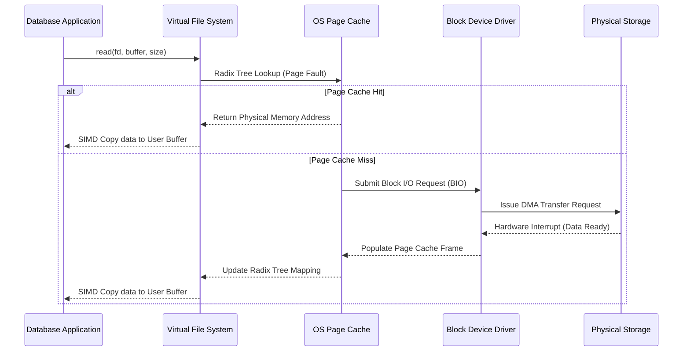
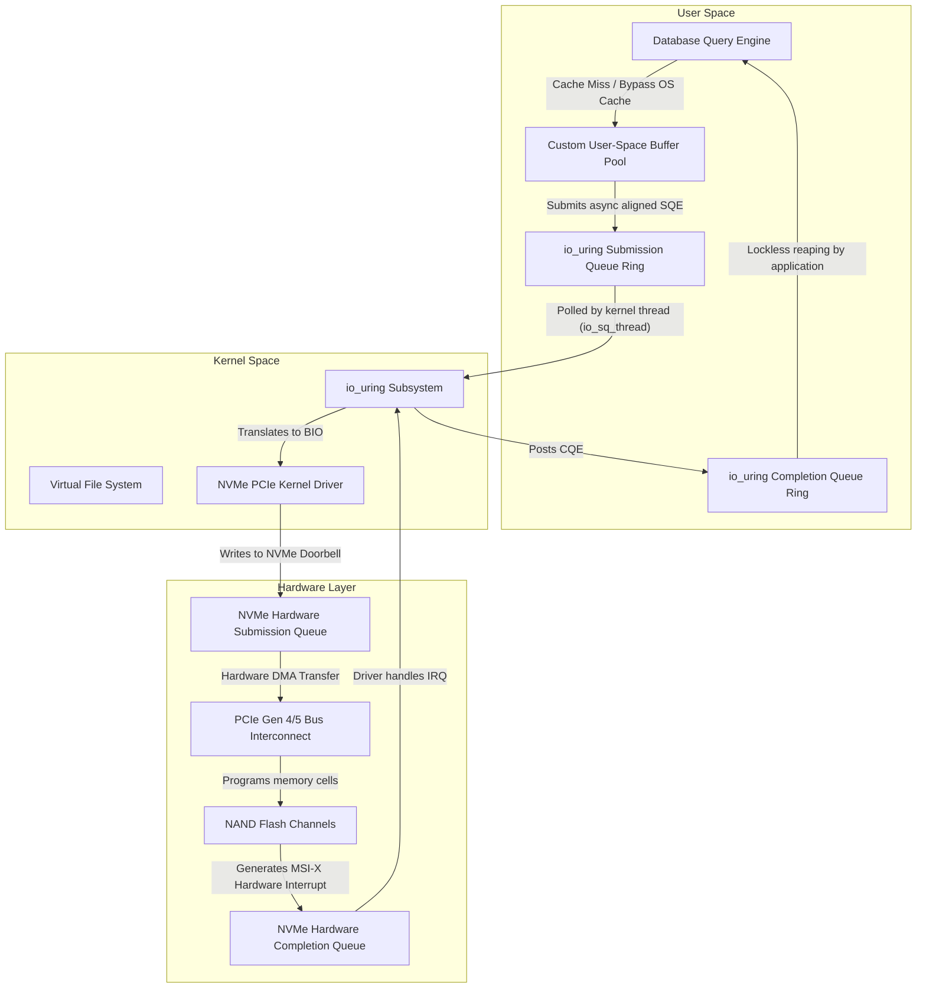

# 02: Giải mã Direct I/O (O_DIRECT) và OS Page Cache trong Cơ sở Dữ liệu: Phân tích Chuyên sâu về Vi kiến trúc

## Tóm tắt Điều hành & Tuyên bố Vấn đề

Hệ điều hành vốn được thiết kế như một trình quản lý tài nguyên đa dụng — cung cấp một lớp trừu tượng "đủ tốt" cho mọi thứ, từ trình duyệt web đến phần mềm soạn thảo văn bản. Cách tiếp cận đó ổn với phần lớn phần mềm. Nhưng khi một hệ quản trị cơ sở dữ liệu (DBMS) phải xử lý hàng triệu giao dịch mỗi giây trên phần cứng có thể đạt thông lượng hàng gigabyte/giây (như PCIe Gen 5 NVMe SSD), lớp trừu tượng tiện lợi đó lại trở thành chính nút thắt cổ chai. Đây là lúc lựa chọn giữa Direct I/O và OS Page Cache không còn là chi tiết triển khai, mà là một quyết định kiến trúc có ảnh hưởng sâu rộng.

**Vấn đề cốt lõi nằm ở đây:** hệ thống Virtual Memory và Page Cache mặc định của OS được thiết kế để che giấu độ trễ đĩa bằng các thuật toán suy nghiệm (heuristic) và đọc trước (read-ahead). Trong khi đó, database đã tự quản lý bộ nhớ của riêng nó, theo logic riêng của nó. Hai hệ thống này va chạm nhau. Kết quả là hiện tượng "double buffering" khét tiếng, các đợt tăng vọt độ trễ khó đoán do tranh chấp khóa trong nhân (như `mmap_sem`), và hàng loạt chu kỳ CPU bị lãng phí chỉ để sao chép dữ liệu qua lại giữa không gian người dùng và không gian nhân.

Bài viết này đi sâu vào sự khác biệt về vi kiến trúc giữa việc dựa vào OS Page Cache và việc bỏ qua nó hoàn toàn bằng Direct I/O (`O_DIRECT`). Chúng ta sẽ xem xét chi phí thực tế của các luồng chuyển giao DMA phần cứng, vì sao TLB miss và context switch đáng quan tâm hơn người ta nghĩ, `io_uring` thay đổi điều gì, và khối lượng công việc cần bỏ ra để xây một buffer pool tự quản lý ở user-space. Cuối bài là một số bài học thực tế cho kỹ sư hệ thống làm việc ở tầng này.

## Các Mô hình Kiến trúc của Quản lý Bộ nhớ Hệ Điều hành và Cơ chế Page Cache

Các hệ điều hành hiện đại (Linux, FreeBSD, Windows NT) dựa nhiều vào quản lý bộ nhớ ảo và các lớp đệm trung gian để che đi khoảng cách hiệu năng khổng lồ giữa DRAM dễ bay hơi và thiết bị lưu trữ khối không bay hơi.

Trong môi trường POSIX chuẩn, mỗi khi ứng dụng ở user-space gọi `read()` hoặc `write()` đồng bộ, hệ điều hành sẽ can thiệp qua lớp Virtual File System (VFS). VFS là giao diện thống nhất, ủy thác việc truy xuất hay lưu trữ khối thực tế cho các filesystem bên dưới như ext4, XFS, Btrfs.

Trong quá trình đó, hệ điều hành cố gắng giảm độ trễ của việc di chuyển đầu đọc đĩa (HDD) hay lập trình ô nhớ NAND (SSD) bằng cách dùng **OS Page Cache** — một vùng đệm trong không gian nhân, ánh xạ offset file logic vào các trang bộ nhớ vật lý (thường 4KB).

### Toán học về Xác suất Cache

Khi ứng dụng yêu cầu một khối dữ liệu, kernel tìm kiếm trong cây radix của Page Cache (hoặc XArray trong các kernel Linux hiện đại).

Gọi $P(x)$ là xác suất Page Cache hit cho khối logic $x$. Gọi $T_{mem}$ là độ trễ truy cập DRAM, $T_{disk}$ là độ trễ truy cập thiết bị khối vật lý. Thời gian truy cập kỳ vọng $E[T]$ được biểu diễn:

$$ E[T] = P(x) \cdot T_{mem} + (1 - P(x)) \cdot T_{disk} $$

$T_{disk}$ dao động từ vài chục micro-giây (khoảng 50-100μs) trên SSD NVMe hiện đại đến vài mili-giây trên HDD truyền thống, trong khi $T_{mem}$ chỉ khoảng 60-100 nano-giây. Với khoảng cách lớn như vậy, đẩy $P(x)$ càng gần 1 càng tốt gần như là toàn bộ nhiệm vụ của hệ thống quản lý bộ nhớ trong kernel.

### Các Thuật toán Loại bỏ Suy nghiệm và Đọc trước (Read-Ahead)

Để tăng $P(x)$, hệ điều hành dùng các thuật toán loại bỏ suy nghiệm — biến thể của Least Recently Used (LRU), kết hợp danh sách nhiều thế hệ như *active*/*inactive* trong kernel Linux.

Nền tảng của cơ chế này là hai giả định:
1. **Tính địa phương thời gian (Temporal Locality):** dữ liệu vừa được truy cập có khả năng cao sẽ được truy cập lại sớm.
2. **Tính địa phương không gian (Spatial Locality):** dữ liệu nằm gần vị trí vừa truy cập có khả năng sẽ được truy cập tiếp theo.

Khi xảy ra page fault — ngắt phần cứng do MMU kích hoạt vì trang ảo được yêu cầu không có trong bộ nhớ vật lý — kernel không chỉ lấy đúng trang 4KB được yêu cầu, mà còn chủ động đọc trước một cách tuần tự.

Kích thước cửa sổ đọc trước $W$ được điều chỉnh động dựa trên tính tuần tự quan sát được. Nếu $S(t)$ là độ đo tính tuần tự tại thời điểm $t$, cửa sổ mở rộng theo:

$$ W_{t+1} = \min(W_{max}, W_t \cdot \alpha) $$

với $\alpha > 1$ là hệ số tăng trưởng áp dụng khi các lần đọc liên tiếp là tuần tự. Với workload đa dụng (như phát một file video), cơ chế này thực sự hiệu quả — nó che giấu độ trễ lưu trữ gần như hoàn hảo.

### Sự Sụp đổ: Khi Thuật toán Suy nghiệm Thất bại Trong Database

Nhưng với một database engine, chính thuật toán suy nghiệm đó lại trở thành gánh nặng. Database đã biết chính xác, mang tính tất định, cách nó sẽ truy cập dữ liệu của mình — nên phỏng đoán của kernel không những dư thừa mà đôi khi còn phản tác dụng.

Hãy hình dung một lượt quét tuần tự (sequential scan) qua một bảng dữ liệu hàng terabyte. Lượt quét này sẽ làm ngập Page Cache, đẩy ra ngoài các trang index quý giá (như node bên trong của B-Tree) để nhường chỗ cho các tuple chỉ được đọc đúng một lần. Đây là hiện tượng cache thrashing, và nó kéo thông lượng hệ thống xuống thấy rõ.

Còn một vấn đề khác, có thể còn phiền hơn: **double buffering**. Vì database đã tự duy trì buffer pool riêng ở user-space để đảm bảo ACID (qua WAL và cơ chế loại bỏ trang tối ưu cho workload giao dịch), cùng một khối dữ liệu vật lý sẽ nằm trùng lặp ở cả buffer pool của database lẫn Page Cache của kernel. Một nửa lượng DRAM đắt đỏ bị dùng để lưu trùng lặp cùng một dữ liệu.



## Cái giá của CPU: Context Switch, Xả TLB, và Sao chép Bộ nhớ

Để hiểu hết chi phí mà OS Page Cache áp lên hệ thống, cần nhìn kỹ vào những gì một thao tác `read`/`write` chuẩn POSIX thực sự làm với CPU.

Một buffered read kích hoạt **context switch** bắt buộc từ chế độ người dùng (Ring 3 trên x86_64) sang chế độ nhân (Ring 0). Bước chuyển này xả sạch pipeline và làm xáo trộn Translation Lookaside Buffer (TLB).

TLB là một bộ nhớ cache nhỏ, cực nhanh, nằm ngay trong lõi CPU, lưu các bản dịch địa chỉ ảo sang vật lý. Khi context switch xảy ra, TLB thường bị xóa sạch hoặc ô nhiễm, dẫn đến một loạt TLB miss khi quay lại user-space.

Một TLB miss buộc bộ đi bộ bảng trang phần cứng (hardware page table walker) phải duyệt qua cấu trúc bảng trang đa cấp (PML4, PDP, PD, PT trên Intel) trong bộ nhớ chính. Gọi $T_{tlb\_miss}$ là hình phạt độ trễ của một TLB miss, $N_{pages}$ là số trang 4KB bị chạm tới, tổng hình phạt TLB là:

$$ \text{Penalty}_{TLB} = N_{pages} \cdot T_{tlb\_miss} $$

— tăng tuyến tính theo kích thước I/O.

Và ngay cả khi cache hit, kernel vẫn phải sao chép dữ liệu từ Page Cache (không gian nhân) sang buffer của ứng dụng (không gian người dùng). Việc sao chép này thường dùng lệnh SIMD (như AVX-512 `vmovdqu8` hay `rep movsq`), nhưng ở tốc độ hàng gigabyte/giây thì chi phí này không hề nhỏ.

Gọi $C_{copy}$ là chi phí CPU trên mỗi byte, tổng CPU dành riêng cho việc sao chép bộ nhớ là:

$$ U_{cpu} = B_{throughput} \cdot C_{copy} $$

Trên các mảng NVMe hiện đại đạt 10-15 GB/s qua bus PCIe Gen 4/5, riêng $U_{cpu}$ đã có thể làm bão hòa nhiều lõi CPU tốc độ cao — những lõi lẽ ra phải dành cho việc thực thi truy vấn.

### Ảo tưởng của `mmap`

MongoDB thời kỳ đầu, cùng một số database khác, từng thử né chi phí sao chép bằng `mmap()`. Lệnh này ánh xạ trực tiếp các trang Page Cache vào không gian địa chỉ ảo của tiến trình thông qua page table entry, cho phép truy cập dữ liệu file bằng con trỏ bộ nhớ thông thường thay vì gọi `read()`.

Nhưng `mmap` vẫn phụ thuộc vào page fault handler của kernel để lấy các trang chưa thường trú, và vào các luồng flush nền của kernel (`pdflush`, `kworker`) để ghi các trang bẩn xuống đĩa. Điều đó có nghĩa là database mất quyền kiểm soát tất định về thời điểm I/O thực sự xảy ra.

Tệ hơn, `mmap` vướng phải tranh chấp khóa nghiêm trọng trong cấu trúc quản lý bộ nhớ của kernel — cụ thể là `mmap_sem`, một reader-writer semaphore bảo vệ vùng bộ nhớ ảo. Dưới tải đa luồng nặng, tranh chấp khóa này gây ra các đợt tăng vọt độ trễ khó đoán, thường gọi là micro-stall.

Đó là lý do các kiến trúc sư database theo đuổi hiệu năng tất định và toàn quyền kiểm soát vòng đời I/O cuối cùng đều đi đến việc bỏ qua kernel hoàn toàn: Direct I/O.

## Cơ Chế Và Hệ Quả Của Direct I/O (O_DIRECT)

Direct I/O — bật lên bằng cách truyền cờ `O_DIRECT` vào `open()` trên hệ thống POSIX — báo cho kernel biết rõ ràng: bỏ qua Page Cache.

Với file descriptor mở theo cách này, lớp VFS chuyển thẳng yêu cầu xuống driver thiết bị khối, và driver dịch địa chỉ buffer ở user-space trực tiếp thành **scatter-gather list (SGL)** phần cứng cho engine DMA của controller NVMe xử lý.

Điều này loại bỏ hoàn toàn việc sao chép bộ nhớ giữa kernel và user-space. Không còn double buffering. Toàn bộ DRAM quay trở lại phục vụ buffer pool của database.

Với Direct I/O, xác suất cache hit ở cấp kernel $P(x)$ bằng 0 theo thiết kế, nên độ trễ kỳ vọng đơn giản hóa thành:

$$ E[T_{direct}] = T_{disk} + T_{dma} + T_{context\_switch} $$

trong đó $T_{dma}$ là thời gian bus PCIe cần để thiết lập và thực thi chuyển giao DMA thẳng vào RAM ở user-space. Bỏ qua yếu tố ngẫu nhiên từ caching suy nghiệm và loại bỏ trang chạy nền của kernel, Direct I/O mang lại độ trễ I/O tất định — điều bắt buộc phải có để đáp ứng SLA nghiêm ngặt trong kiến trúc database đám mây đa khách hàng.

### Hình học Khắc nghiệt của Căn chỉnh Bộ nhớ

Cái giá của `O_DIRECT` là các ràng buộc căn chỉnh nghiêm ngặt. Thiết bị lưu trữ khối hoạt động theo kích thước sector logic cố định — trước đây là 512 byte, nay hầu hết là 4096 byte (Advanced Format) trên NAND flash hiện đại.

Có ba điều phải đồng thời thỏa mãn. Gọi $S_{sector}$ là kích thước sector logic (ví dụ 4096), địa chỉ buffer $A_{buffer}$, kích thước truyền tải $L_{transfer}$, và offset file $O_{file}$ đều phải thỏa mãn:

$$ A_{buffer} \equiv 0 \pmod{S_{sector}} $$
$$ L_{transfer} \equiv 0 \pmod{S_{sector}} $$
$$ O_{file} \equiv 0 \pmod{S_{sector}} $$

Chỉ cần vi phạm một trong ba điều kiện, kernel Linux sẽ từ chối ngay lập tức với lỗi `EINVAL`. Để đảm bảo căn chỉnh, cần dùng `posix_memalign`, `aligned_alloc`, hoặc `mmap` nặc danh — `malloc` thông thường không đáp ứng được.

```cpp
#include <fcntl.h>
#include <unistd.h>
#include <cstdlib>
#include <stdexcept>
#include <iostream>
#include <cstdint>
#include <sys/mman.h>

class DirectIOAlignedBuffer {
private:
    void* raw_buffer;
    size_t allocation_size;
    size_t hardware_alignment;

public:
    DirectIOAlignedBuffer(size_t size, size_t alignment = 4096) 
        : allocation_size(size), hardware_alignment(alignment) {
        
        // Bắt buộc tuân thủ điều kiện L_transfer
        if (allocation_size % hardware_alignment != 0) {
            throw std::invalid_argument("Kích thước I/O vi phạm căn chỉnh sector phần cứng.");
        }
        
        // Ép buộc thỏa mãn A_buffer thông qua posix_memalign
        if (posix_memalign(&raw_buffer, hardware_alignment, allocation_size) != 0) {
            throw std::runtime_error("Cấp phát posix_memalign thất bại.");
        }
        
        // Đảm bảo bộ nhớ được khóa không bị đẩy sang phân vùng swap
        if (mlock(raw_buffer, allocation_size) != 0) {
            std::cerr << "Cảnh báo: mlock thất bại." << std::endl;
        }
    }

    ~DirectIOAlignedBuffer() {
        munlock(raw_buffer, allocation_size);
        free(raw_buffer);
    }

    void* get_pointer() const { return raw_buffer; }
    size_t get_size() const { return allocation_size; }
};

void execute_deterministic_direct_read(const char* target_filepath) {
    // Mở file descriptor với cờ bỏ qua OS Page Cache
    int fd = open(target_filepath, O_RDONLY | O_DIRECT);
    if (fd < 0) {
        throw std::runtime_error("Cấp phát O_DIRECT thất bại.");
    }

    // Cấp phát buffer 16KB chính xác, aligned chuẩn 4KB
    DirectIOAlignedBuffer dio_buf(16384); 

    // Logic O_file cũng phải là bội số của 4096
    off_t logical_offset = 8192; 

    ssize_t bytes_read = pread(fd, dio_buf.get_pointer(), dio_buf.get_size(), logical_offset);
    if (bytes_read < 0) {
        close(fd);
        throw std::runtime_error("Đọc DMA phần cứng thất bại thảm khốc.");
    }

    std::cout << "Chuyển " << bytes_read << " bytes thành công qua DMA vào user-space." << std::endl;
    close(fd);
}
```

## Sự Hiệp lực giữa Direct I/O và io_uring

Dùng Direct I/O gần như bắt buộc phải xây dựng một framework I/O bất đồng bộ (AIO) nghiêm túc. Vì `O_DIRECT` tắt Page Cache, một lệnh `read()`/`pread()` đồng bộ sẽ block luồng gọi cho đến khi ổ đĩa hoàn tất chuyển giao DMA — không còn cache nào để phản hồi tạm thời cả.

Trong một hệ thống xử lý hàng chục ngàn giao dịch mỗi giây, việc block luồng chờ độ trễ đĩa cỡ micro-giây sẽ dẫn đến tình trạng thiếu đói luồng và bộ lập lịch phải vật lộn xoay vòng giữa các luồng khác thay vì làm việc thực sự.

Để tách rời việc thực thi truy vấn khỏi độ trễ lưu trữ vật lý, các database hiện đại dựa vào các API I/O bất đồng bộ của Linux. Trước đây là `libaio`, vốn nổi tiếng vì đôi khi block một cách âm thầm (đặc biệt với metadata file hoặc cấp phát block trên ext4) và có API khá rắc rối.

Giải pháp hiện đại là **`io_uring`**, do Jens Axboe đưa vào kernel Linux.

Kết hợp `O_DIRECT` với `io_uring`, database có thể gửi hàng trăm yêu cầu đọc/ghi qua một ring buffer **Submission Queue (SQ)** chia sẻ bộ nhớ, mà không cần trả chi phí context switch cho từng yêu cầu.

Gọi $N_{req}$ là số yêu cầu I/O đồng thời từ một query plan. Với Direct I/O đồng bộ ngây thơ chạy trên một luồng, tổng độ trễ sẽ xấp xỉ $\sum_{i=1}^{N_{req}} T_{disk}(i)$ — tổng của từng độ trễ riêng lẻ.

Còn với Direct I/O bất đồng bộ qua `io_uring`, các yêu cầu được gửi đồng thời xuống hàng đợi phần cứng bên trong controller NVMe, khai thác song song thực sự giữa nhiều die NAND và nhiều kênh của ổ đĩa. Độ trễ tổng khi đó tiệm cận giá trị lớn nhất, không phải tổng:

$$ \text{Latency} \approx \max(T_{disk}(1), T_{disk}(2), \dots, T_{disk}(N_{req})) + T_{queue\_overhead} $$

Đó chính là mục tiêu: giữ băng thông lưu trữ bão hòa trong khi luồng CPU vẫn rảnh để xử lý truy vấn thực sự. Sự kết hợp `O_DIRECT` cùng I/O polling bất đồng bộ này là nền tảng cho các hệ thống như ScyllaDB (xây trên framework Seastar C++) và các phiên bản PostgreSQL gần đây.



## Độ Phức Tạp Thuật Toán Trong Thiết Kế Buffer Pool

Chuyển từ kiến trúc phụ thuộc OS Page Cache sang một framework Direct I/O tự quản lý hoàn toàn là một dịch chuyển lớn về nơi nắm quyền kiểm soát. Database phải tự xây lại toàn bộ lớp caching bên trong chính ứng dụng.

### Sự Bất cập của LRU Nguyên thủy và Sự Trỗi dậy của CLOCK

Khi hoạt động mù quáng dưới OS Page Cache, kernel chỉ tối ưu bằng LRU đơn giản. Kernel không thể phân biệt một node root của B+Tree được truy cập liên tục với một trang leaf chỉ đọc đúng một lần trong lượt quét toàn bảng — cả hai bị đối xử như nhau.

Ngược lại, một buffer pool ở user-space xây trên Direct I/O nắm rõ cấu trúc topology của trang dữ liệu. Kỹ sư có thể ghim (pin) các trang quan trọng, đảm bảo metadata cấu trúc luôn nằm trong DRAM bất kể chuyện gì xảy ra.

Nhưng xây một buffer pool đồng thời cao cũng mang theo vấn đề riêng. Một implementation ngây thơ — dùng một mutex toàn cục bảo vệ bảng băm ánh xạ page ID sang frame vật lý — sẽ sụp đổ ngay khi có hàng trăm luồng truy vấn chạy song song.

Cách khắc phục phổ biến là chia buffer pool thành $M$ instance độc lập, băm page ID theo $f(PageID) = PageID \pmod{M}$. Điều này giảm xác suất va chạm khóa xuống khoảng $M$ lần.

Bản thân thuật toán loại bỏ trang cũng cần được thiết kế lại cho tính đồng thời. LRU nghiêm ngặt đòi hỏi phải sửa con trỏ trong danh sách liên kết kép ở *mỗi lần truy cập* — nghĩa là mỗi lần đọc đều cần một khóa ghi độc quyền, phá vỡ khả năng mở rộng đa lõi và làm quá tải giao thức nhất quán cache của CPU (MESI).

Vì vậy, hầu hết database hiện đại từ bỏ LRU nghiêm ngặt để chuyển sang các **thuật toán xấp xỉ kiểu CLOCK** — CLOCK sweep cổ điển, Clock-PRO, hoặc Adaptive Replacement Cache (ARC). CLOCK dùng một bộ đệm vòng cố định gồm các frame trang. Thay vì sửa danh sách liên kết ở mỗi lần truy cập, nó chỉ cần bật một bit tham chiếu nguyên tử $R_{bit}$. Khi cần loại bỏ trang, một "kim đồng hồ" quét qua và kiểm tra $R_{bit}$ — nếu là 1 thì đặt về 0, nếu đã là 0 thì loại bỏ trang đó. Cách này cho phép đường đọc hoàn toàn không cần khóa.

### HugePages và Áp Lực TLB

Còn một điểm nữa cần lưu ý: HugePages. Khi cấp phát hàng gigabyte RAM cho buffer pool bằng trang 4KB tiêu chuẩn, bảng trang sẽ phình to và áp lực TLB trở nên nghiêm trọng. Dùng HugePages 2MB hoặc 1GB (dạng transparent hoặc qua `hugetlbfs`) để backing buffer pool sẽ giảm hình phạt $T_{tlb\_miss}$ nói ở trên xuống đáng kể — một entry TLB giờ bao phủ cả một vùng liên tục 2MB hoặc 1GB, gần như loại bỏ hoàn toàn hoạt động của page table walker phần cứng trong các lượt quét phân tích lớn.

## Hệ thống WAL và Độ Bền Tất Định

Quyết định dùng Direct I/O cũng định hình cách Write-Ahead Log (WAL) hoạt động. WAL cần các lượt ghi vật lý tuần tự, đồng bộ nghiêm ngặt để đảm bảo tính bền (chữ 'D' trong ACID) trước khi một giao dịch được xác nhận commit.

Với buffered I/O, database ghi bản ghi log vào cache của kernel rồi gọi `fsync` để buộc kernel đẩy trang bẩn xuống đĩa. `fsync` vốn đắt đỏ và khó lường — nó có thể vô tình đẩy luôn các trang bẩn thuộc về các file hoàn toàn không liên quan, gây ra các đợt tăng vọt độ trễ chẳng liên quan gì đến workload thực tế của bạn.

Bỏ qua kernel bằng Direct I/O kết hợp `O_DSYNC` cho phép database kiểm soát việc ghi log ở cấp độ byte. Ứng dụng tự dựng một block log hoàn chỉnh, đệm các byte còn thiếu bằng số 0 để thỏa mãn yêu cầu căn chỉnh $S_{sector}$, rồi gửi lệnh ghi Direct I/O đồng bộ thẳng xuống bus PCIe. Khi lệnh gọi hệ thống trả về, dữ liệu được đảm bảo đã nằm ở vùng không bay hơi của storage controller.

Để tránh lãng phí băng thông khi phải đệm các bản ghi log nhỏ tới đủ 4KB, database dùng **Group Commit**: cố ý trì hoãn việc flush từng giao dịch trong một khoảng thời gian rất nhỏ ($T_{wait}$), gom nhiều bản ghi log lại, rồi ghi cả khối bằng một lệnh Direct I/O duy nhất.

## Bài Học Kinh Nghiệm và Điểm nhấn Kiến trúc

Chuyển sang kiến trúc Direct I/O là một trong những quyết định đặc trưng của hạ tầng dữ liệu cấp cao nhất. Vài điều đáng ghi nhớ:

1. **Kernel không phải bạn đồng hành khi ở quy mô lớn.** Với ứng dụng thông thường, các trừu tượng của Linux kernel thực sự hữu ích. Nhưng với database ở quy mô cực lớn, các suy nghiệm của kernel (đặc biệt là đọc trước tích cực) lại xung đột trực tiếp với kế hoạch thực thi tất định. Bypass kernel gần như là điều bắt buộc để có tail latency dự đoán được.
2. **Double buffering âm thầm nuốt RAM.** Chạy buffer pool ở user-space song song với OS Page Cache khiến bạn mất một nửa bộ nhớ khả dụng. Chuyển sang `O_DIRECT` trả lại toàn bộ DRAM đó.
3. **Direct I/O đồng bộ là một cái bẫy.** Đừng ghép `O_DIRECT` với `read()`/`write()` đồng bộ trong hệ thống đồng thời cao — mỗi lệnh gọi sẽ block một luồng cho đến khi phần cứng phản hồi. `O_DIRECT` cần đi cùng `io_uring` hoặc một framework I/O bất đồng bộ tương đương, không có ngoại lệ.
4. **Căn chỉnh bộ nhớ không thể thương lượng.** Quy tắc căn chỉnh sector 4KB quyết định toàn bộ chiến lược cấp phát bộ nhớ ngay từ đầu. `malloc` thông thường không dùng được ở đây — mọi thứ phải xây quanh `posix_memalign` và kích thước căn chỉnh theo block.
5. **Đồng thời đòi hỏi tư duy lock-free.** Xây buffer pool riêng nghĩa là phải đối mặt với tranh chấp đa lõi thực sự. Việc sửa danh sách liên kết theo LRU nghiêm ngặt không scale được — CLOCK sweep và chia nhỏ khóa theo kiểu striping mới là giải pháp.

## Kết luận

So sánh Direct I/O và OS Page Cache thực ra không phải là một quyết định khó khăn khi bạn đang vận hành ở quy mô mà từng micro-giây đều có ý nghĩa. Direct I/O đòi hỏi công sức kỹ thuật thật sự — buffer pool tự viết, căn chỉnh cẩn thận, một pipeline I/O bất đồng bộ — nhưng đổi lại là những lợi ích rõ ràng: không còn double buffering, CPU đỡ tốn cho việc sao chép bộ nhớ, và độ trễ I/O trở nên có thể dự đoán thay vì phụ thuộc vào phỏng đoán của kernel. Khi phần cứng lưu trữ tiếp tục nhanh hơn, quyền kiểm soát ở cấp độ byte này chính là nền tảng mà các storage engine thế hệ tiếp theo được xây dựng dựa trên đó.
