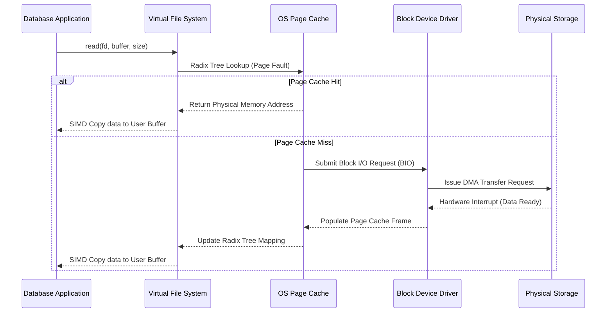
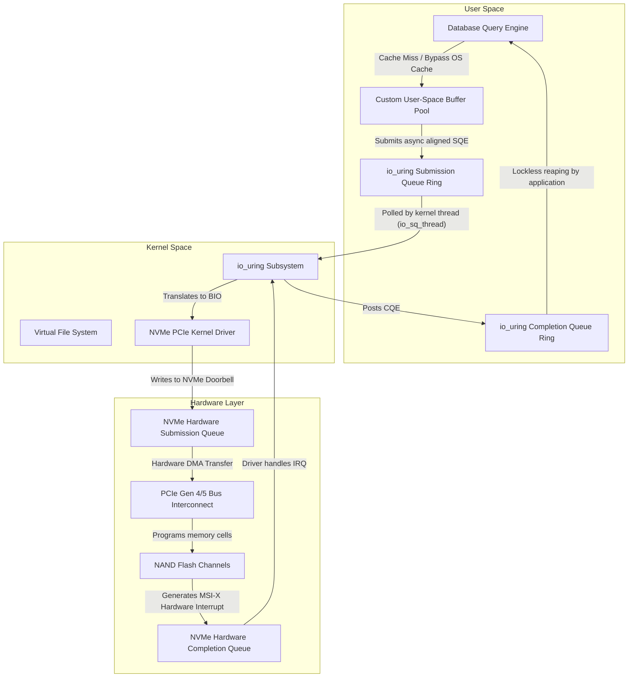

# 02: Demystifying Direct I/O (O_DIRECT) vs. OS Page Cache trong Database

## Architectural Paradigms of Operating System Memory Management and Page Cache Mechanics

The foundational architecture of contemporary operating systems relies heavily on virtual memory management and intermediate caching layers to obfuscate the vast performance disparity between volatile dynamic random-access memory (DRAM) and non-volatile block storage devices. In standard POSIX-compliant environments, whenever a user-space application initiates a read or write system call, the operating system intervenes by traversing the Virtual File System (VFS) abstraction layer. The VFS acts as a universally unified interface that delegates the actual block retrieval or persistence to underlying file systems such as ext4, XFS, or Btrfs. Within this traversal, the operating system attempts to minimize the exorbitant latency of physical disk head movements or NAND flash memory cell programming by utilizing the OS Page Cache. The Page Cache is essentially a highly optimized software-based memory pool residing within the kernel space, continuously mapping logical file offsets to physical memory pages. When an application requests a block of data, the kernel executes a lookup within the Page Cache's radix tree. Let $P(x)$ denote the probability of a page cache hit for a specific logical block $x$, and $T_{mem}$ represent the latency of accessing a page from main memory, whereas $T_{disk}$ encapsulates the latency of a physical block device access. The expected access time $E[T]$ can be formalized as $E[T] = P(x) \cdot T_{mem} + (1 - P(x)) \cdot T_{disk}$. Given that $T_{disk}$ typically ranges from tens of microseconds for modern Non-Volatile Memory Express (NVMe) solid-state drives to several milliseconds for traditional rotational magnetic hard disk drives, while $T_{mem}$ remains strictly constrained within the sub-microsecond domain (typically around 60 to 100 nanoseconds), maximizing the probabilistic parameter $P(x)$ becomes the quintessential objective of the kernel's memory management subsystem. To maximize $P(x)$, the operating system employs sophisticated heuristic eviction algorithms, traditionally variations of the Least Recently Used (LRU) algorithm, occasionally augmented with multi-generational lists such as the active and inactive LRU lists utilized within the Linux kernel architecture. The kernel operates under the fundamental assumption of both temporal and spatial locality; temporal locality postulates that recently accessed data is highly likely to be accessed again in the imminent future, while spatial locality hypothesizes that data residing in adjacent logical addresses will likely be accessed sequentially. Consequently, upon a page fault—a hardware interrupt triggered by the Memory Management Unit (MMU) when a requested virtual page is absent from physical memory—the kernel does not merely fetch the explicitly requested 4-kilobyte page but proactively executes sequential read-ahead operations. The read-ahead window size, denoted by $W$, is dynamically adjusted based on the observed sequentiality of the application's access patterns. If we define $S(t)$ as the sequential access metric at time $t$, the read-ahead window expansion can be modeled as $W_{t+1} = \min(W_{max}, W_t \cdot \alpha)$ where $\alpha > 1$ represents the exponential growth factor applied during consecutive sequential reads. This aggressive caching and prefetching mechanism is highly effective for general-purpose computing workloads, seamlessly masking the underlying storage latency without requiring any explicit application-level engineering. However, for specialized, high-performance data-intensive applications such as relational database management systems (RDBMS) or distributed key-value stores, this generic kernel-level heuristic often metamorphoses from an optimization into a severe performance bottleneck. Database engines possess deterministic, algorithmic knowledge of their own data access patterns, rendering the OS-level heuristic predictions not merely redundant but occasionally detrimental. For instance, a sequential scan over a massive database table spanning terabytes of data will inevitably pollute the OS Page Cache, relentlessly evicting highly valuable index pages (such as B-Tree internal nodes) to accommodate transient table tuples that will only be accessed once during the scan operation. This phenomenon, academically referred to as cache thrashing, drastically degrades the overall throughput of the system. Furthermore, relying on the OS Page Cache introduces the infamous double buffering problem. Since the database engine typically maintains its own user-space Buffer Pool to guarantee atomicity, consistency, isolation, and durability (ACID) properties—specifically through Write-Ahead Logging (WAL) mechanisms and specialized page eviction algorithms optimized for transactional workloads—the identical physical data blocks end up residing redundantly in both the user-space Buffer Pool and the kernel-space Page Cache. This redundant memory allocation essentially halves the effective caching capacity of the available DRAM. 



To fully comprehend the systemic inefficiencies imposed by the OS Page Cache on highly engineered database systems, one must scrutinize the central processing unit (CPU) overhead associated with the POSIX read and write system calls. The execution of a standard buffered read initiates a mandatory context switch from user mode (Ring 3 on x86_64 architectures) to kernel mode (Ring 0), incurring a pipeline flush and a catastrophic perturbation of the Translation Lookaside Buffer (TLB). The TLB is a specialized, extremely fast hardware cache residing inside the CPU core, responsible for caching virtual-to-physical address translations established by the kernel's page tables. When a context switch occurs, the TLB is often flushed, leading to subsequent TLB misses. A TLB miss forces the CPU's hardware page table walker to traverse the multi-level radix tree structure of the page tables (e.g., PML4, PDP, PD, and PT in Intel processors) in main memory. Let $T_{tlb\_miss}$ be the latency penalty of a TLB miss, and $N_{pages}$ be the number of 4KB pages touched during the I/O operation. The total TLB penalty equates to $N_{pages} \cdot T_{tlb\_miss}$, which scales linearly with the I/O transfer size. Furthermore, assuming a cache hit, the kernel must execute a memory-to-memory copy operation from the page cache pages residing in kernel space to the application-provided buffer residing in user space. The CPU cycles consumed by this memory copy operation, typically executed via optimized SIMD instructions (such as AVX-512 `vmovdqu8` or `rep movsq`), become a mathematically non-trivial factor when transferring gigabytes of data per second. Let $C_{copy}$ be the CPU cost per byte transferred; the total CPU utilization dedicated purely to memory manipulation becomes $U_{cpu} = B_{throughput} \cdot C_{copy}$, where $B_{throughput}$ denotes the aggregate disk bandwidth. In modern NVMe arrays capable of delivering upwards of 10-15 gigabytes per second of sustained sequential read throughput via the Peripheral Component Interconnect Express (PCIe) Gen 4 or Gen 5 bus, the $U_{cpu}$ component alone can saturate multiple high-frequency CPU cores, effectively starving the database engine's core query execution threads. This architectural friction necessitates a paradigm shift in how database engines interact with the storage subsystem, leading to the adoption of memory mapping (`mmap`) or, more prevalently in enterprise-grade databases, Direct I/O. The `mmap` system call attempts to mitigate the memory copy overhead by mapping kernel page cache pages directly into the application's virtual address space via Page Table Entries (PTE), allowing the database to access file data via standard memory pointer dereferencing. However, `mmap` remains heavily reliant on the kernel's page fault handler for fetching non-resident pages and the kernel's asynchronous flusher threads (such as `pdflush`, `bdflush`, or `kworker`) for persisting dirty pages to disk. This reliance strips the database of deterministic control over physical I/O scheduling, leading to unpredictable latency spikes, commonly known as micro-stalls, during massive page fault cascades or severe lock contention within the kernel's memory management data structures (specifically the `mmap_sem` reader-writer semaphore which protects the virtual memory area structures). Consequently, to achieve the ultimate zenith of deterministic performance, strict hardware resource accounting, and absolute algorithmic control over the data lifecycle, database architects invariably turn to bypassing the kernel entirely through the utilization of Direct I/O.

## The Mechanics and Implications of Direct I/O (O_DIRECT) in High-Performance Database Engines

Direct I/O, invoked in POSIX-compliant operating systems by explicitly specifying the `O_DIRECT` flag during the `open` system call, fundamentally alters the I/O traversal path by explicitly instructing the kernel to bypass the OS Page Cache entirely. When an application executes a read or write operation utilizing a file descriptor opened with `O_DIRECT`, the Virtual File System layer immediately delegates the request directly to the block device driver layer. The driver translates the application's user-space memory buffer addresses directly into hardware scatter-gather lists (SGLs) suitable for Direct Memory Access (DMA) controllers embedded within the storage host bus adapter or the NVMe controller itself. This direct translation completely eliminates the CPU overhead associated with the memory-to-memory copy between kernel space and user space, definitively resolving the double buffering anomaly and reclaiming vast quantities of gigabytes of precious DRAM for the database's proprietary Buffer Pool architecture. The mathematical representation of expected access time under Direct I/O drastically simplifies, as the probability of a kernel-level cache hit $P(x)$ evaluates strictly to zero. Thus, the expected latency $E[T_{direct}]$ becomes exclusively a function of the underlying storage media's response time and interconnect latency, yielding the equation $E[T_{direct}] = T_{disk} + T_{dma} + T_{context\_switch}$, where $T_{dma}$ represents the time required for the PCIe bus to negotiate and execute the hardware DMA transfer directly into the user-space RAM. By entirely eliminating the stochastic variability introduced by the kernel's heuristic caching, read-ahead, and background eviction algorithms, Direct I/O bestows the database engine with uncompromisingly deterministic I/O latencies. This predictability is a critical, non-negotiable prerequisite for achieving stringent Service Level Agreements (SLAs) in highly concurrent transactional processing environments, particularly in multi-tenant cloud database architectures. However, the utilization of `O_DIRECT` imposes severe, unforgiving geometric constraints upon the application's memory layout and I/O request granularities. The underlying block storage devices operate on fixed logical sector sizes, traditionally 512 bytes but overwhelmingly 4096 bytes (Advanced Format) in contemporary NAND flash solid-state storage. Consequently, Direct I/O mandates strict topological alignment parameters across three separate axes. Let $S_{sector}$ denote the logical sector size of the underlying block device. The application-provided memory buffer address $A_{buffer}$, the total size of the I/O transfer $L_{transfer}$, and the logical file offset $O_{file}$ must all concurrently satisfy the modulo congruence condition: $A_{buffer} \equiv 0 \pmod{S_{sector}}$, $L_{transfer} \equiv 0 \pmod{S_{sector}}$, and $O_{file} \equiv 0 \pmod{S_{sector}}$. Failure to meticulously adhere to these stringent mathematical alignment constraints results in the Linux kernel instantly rejecting the system call with an `EINVAL` (Invalid Argument) error code, halting the database execution path. To satisfy the crucial memory alignment constraint $A_{buffer} \equiv 0 \pmod{S_{sector}}$, database storage engines cannot rely on standard memory allocators; developers must explicitly utilize specialized memory allocation functions such as `posix_memalign`, `aligned_alloc`, `valloc`, or anonymous `mmap` calls instead of standard `malloc` or `new` operators.

```cpp
#include <fcntl.h>
#include <unistd.h>
#include <cstdlib>
#include <stdexcept>
#include <iostream>
#include <cstdint>

class DirectIOAlignedBuffer {
private:
    void* raw_buffer;
    size_t allocation_size;
    size_t hardware_alignment;

public:
    DirectIOAlignedBuffer(size_t size, size_t alignment = 4096) 
        : allocation_size(size), hardware_alignment(alignment) {
        // Enforce the L_transfer alignment constraint mathematically
        if (allocation_size % hardware_alignment != 0) {
            throw std::invalid_argument("I/O size strictly violates hardware sector alignment.");
        }
        // Enforce the A_buffer alignment constraint via posix_memalign
        if (posix_memalign(&raw_buffer, hardware_alignment, allocation_size) != 0) {
            throw std::runtime_error("posix_memalign geometric allocation failed. OOM or invalid alignment.");
        }
        // Ensure memory is pinned and not swapped out (optional but recommended for DMA)
        mlock(raw_buffer, allocation_size);
    }

    ~DirectIOAlignedBuffer() {
        munlock(raw_buffer, allocation_size);
        free(raw_buffer);
    }

    void* get_pointer() const { return raw_buffer; }
    size_t get_size() const { return allocation_size; }
};

void execute_deterministic_direct_read(const char* target_filepath) {
    // Open the file descriptor bypassing the OS Page Cache
    int fd = open(target_filepath, O_RDONLY | O_DIRECT);
    if (fd < 0) {
        throw std::runtime_error("Failed to acquire O_DIRECT file descriptor.");
    }

    DirectIOAlignedBuffer dio_buf(16384); // 16KB exact buffer, 4KB aligned dynamically

    // O_file must also be a multiple of 4096 (e.g., offset 0, 4096, 8192)
    off_t logical_offset = 8192; 

    ssize_t bytes_read = pread(fd, dio_buf.get_pointer(), dio_buf.get_size(), logical_offset);
    if (bytes_read < 0) {
        close(fd);
        throw std::runtime_error("Direct I/O hardware DMA read failed catastrophically.");
    }

    std::cout << "Successfully transferred " << bytes_read << " bytes via DMA to user-space." << std::endl;
    close(fd);
}
```

The adoption of Direct I/O invariably necessitates the implementation of highly sophisticated asynchronous I/O (AIO) frameworks within the database engine's core architecture. Because `O_DIRECT` explicitly disables the OS Page Cache, standard synchronous read system calls will unequivocally block the calling operating system thread until the physical disk successfully completes the hardware DMA transfer. In a massively concurrent database system designed to process tens of thousands of complex transactions per second, blocking operating system threads while waiting for microsecond-scale physical disk latencies leads to catastrophic thread starvation, CPU pipeline stalls, and excessive context switching overhead as the kernel desperately attempts to schedule other runnable threads. To fundamentally decouple mathematical query execution from physical storage latency, modern databases heavily leverage Linux asynchronous I/O APIs, historically `libaio` and, more recently, the revolutionary `io_uring` subsystem introduced by Jens Axboe. By synergistically pairing `O_DIRECT` with `io_uring`, the database engine can submit hundreds of asynchronous read or write requests through a shared memory submission queue (SQ) ring buffer without executing a single expensive system call context switch. Let $N_{req}$ be the number of simultaneous I/O requests generated by a complex query plan (e.g., a massive hash join). The total latency under a naïve synchronous Direct I/O model would scale linearly as $\sum_{i=1}^{N_{req}} T_{disk}(i)$, assuming a single thread of execution. Conversely, under an advanced asynchronous Direct I/O model utilizing `io_uring`, the requests are submitted concurrently to the NVMe host controller's internal hardware submission queues, explicitly exploiting the massive internal parallelism of the solid-state drive's multiple NAND flash dies and parallel channels. The aggregate latency thereby approaches the maximum individual latency $\max(T_{disk}(1), T_{disk}(2), \dots, T_{disk}(N_{req})) + T_{queue\_overhead}$, effectively maximizing storage bandwidth utilization and keeping CPU execution threads completely unblocked and mathematically productive. This exact synergy between `O_DIRECT` and asynchronous polling I/O forms the architectural bedrock of next-generation distributed systems like ScyllaDB (leveraging the Seastar C++ framework) and PostgreSQL (via extensive recent AIO architectural enhancements).



The engineering burden of adopting `O_DIRECT` extends far beyond memory alignment mathematics and asynchronous execution paradigms; it mandates the absolute reinvention and architectural reimagining of the caching layer strictly within the user application space. The database must implement its own highly concurrent Buffer Pool, meticulously managing the lifecycle of physical data pages fetched from storage. This involves deploying complex synchronization primitives, such as reader-writer latches, spinlocks, or hazard pointers on individual page frames to prevent insidious data corruption during concurrent transactional modifications. Because `O_DIRECT` rigorously disables kernel-level sequential prefetching, the database engine itself must mathematically analyze the logical query execution plan (e.g., recognizing a sequential table scan node at the top of the Volcano iterator model) and proactively dispatch asynchronous Direct I/O read requests for subsequent physical data blocks long before the query execution engine actually requests them. Let $D_{prefetch}$ be the dynamic distance of prefetching. The engine calculates the optimal prefetch depth based on the deterministic consumption rate of the query thread $R_{consume}$ (measured in pages per microsecond) and the dynamically measured expected asynchronous I/O latency $E[T_{aio}]$, mathematically formulated as $D_{prefetch} = R_{consume} \cdot E[T_{aio}]$. Furthermore, database engineers must account for the integration of HugePages. When allocating gigabytes of RAM for the proprietary Buffer Pool, utilizing standard 4KB pages results in catastrophic TLB pressure and immense page table structures. By combining `O_DIRECT` DMA transfers with buffer pools backed by 2MB or 1GB Transparent HugePages (THP) or `hugetlbfs`, the system exponentially reduces the $T_{tlb\_miss}$ penalty discussed earlier. A single TLB entry now maps a massive 2MB or 1GB contiguous physical region, entirely eliminating the hardware page table walker overhead during high-throughput analytical scans. By precisely coordinating user-space algorithmic prefetching, HugePage-backed memory topologies, proprietary Buffer Pool eviction algorithms, and `io_uring`-driven Direct I/O, modern database systems achieve an unparalleled, almost theoretical maximum level of hardware utilization, capable of extracting millions of IOPS from contemporary NVMe storage arrays while maintaining strict predictability over latency distributions.

## Empirical Cost-Benefit Analysis and Algorithmic Complexities in Buffer Pool Engineering

The transition from a monolithic OS Page Cache-dependent architecture to an entirely self-managed, deterministic Direct I/O framework represents a monumental shift in the locus of control and entails profound algorithmic complexities. To rigorously quantify the efficacy of this transition, one must formulate a mathematical empirical cost-benefit analysis encompassing cache hit ratios, CPU cycle expenditures, TLB hit rates, and ultimate query throughput limits. Consider a highly concurrent transactional workload (OLTP) characterized by a Zipfian probability distribution of access frequencies, where a microscopically small subset of the total dataset—frequently referred to as the "hot set"—receives the overwhelming statistical majority of read and write requests. Let the probability mass function of accessing the $k$-th ranked page be formally defined as $P(k) = \frac{1/k^s}{\sum_{n=1}^{N} (1/n^s)}$, where $N$ is the absolute total number of logical pages and $s$ dictates the mathematical skewness of the distribution (typically $s \approx 1$ for heavy database workloads). When operating blindly under the OS Page Cache, the kernel remains inherently ignorant of the logical, relational relationships between physical pages; it observes merely an opaque stream of logical sector addresses and attempts to optimize via rudimentary, mathematically flawed LRU semantics. The kernel's blind, generic eviction policies inevitably penalize heavily accessed database structural metadata pages, such as the B+Tree root nodes and upper-level routing internal nodes, treating them indistinguishably from transient leaf node data accessed strictly once during a massive analytical full table scan. In stark architectural contrast, a user-space Buffer Pool operating directly atop raw Direct I/O possesses intimate, declarative semantic knowledge of the underlying page topologies. Database architects implement rigorous page pinning mechanisms, mathematically guaranteeing that critical structural metadata remains completely resident in DRAM regardless of extreme memory eviction pressures. Furthermore, advanced Buffer Pool implementations mathematically segment their memory regions into multiple distinct, isolated pools, separating the caching logic for clustered indexes, transient temporary sorting tables, and primary heap data. Let $H_{user}$ denote the statistical hit ratio of the user-space Buffer Pool and $H_{os}$ denote the hit ratio of the kernel OS Page Cache. Under complex, high-velocity analytical workloads, empirical telemetry consistently demonstrates that $H_{user} \gg H_{os}$ precisely due to the semantic awareness incorporated into the eviction logic, such as algorithmically prioritizing the retention of pages containing active, uncommitted transactions or pages currently participating in memory-intensive parallel hash joins.

The algorithmic implementation of a highly concurrent user-space Buffer Pool introduces severe multi-core synchronization bottlenecks that require meticulous, lock-free engineering. A naïve implementation utilizing a single global mutex lock to protect the global hash table—which maps logical Page IDs to physical memory frames—will instantly suffer catastrophic lock contention when subjected to hundreds of concurrent query execution threads. To mitigate this architectural flaw, database systems deploy lock striping or mathematically partition the global Buffer Pool into $M$ strictly independent instances, hashing the logical Page ID to a specific, isolated instance via the modulo hash function $f(PageID) = PageID \pmod{M}$. This mathematical partitioning effectively reduces the statistical probability of lock collision by a geometric factor of $M$, thereby increasing the overall linear scalability of the system. However, partitioning alone is grossly insufficient. The page eviction algorithm itself must be mathematically engineered for extreme concurrency. Traditional strict LRU algorithms mandate mutating pointers within a doubly linked list upon every single page access to move the accessed page to the head of the temporal list. This continuous, relentless mutation of shared data structures requires exclusive write latches, completely destroying multi-core scalability and saturating the CPU cache coherence protocol (MESI). Therefore, modern databases operating over Direct I/O universally abandon strict LRU in favor of Clock-based approximation algorithms, such as the generalized CLOCK sweep algorithm, Clock-PRO, or Adaptive Replacement Cache (ARC). The CLOCK algorithm utilizes a fixed circular buffer of physical page frames and a sweeping virtual hand mechanism. Instead of destructively mutating linked lists upon every read access, the system simply sets a single atomic reference bit $R_{bit}$ associated with the page frame. The atomic operation, typically a hardware Compare-And-Swap (CAS) instruction, can be executed concurrently without acquiring heavy, blocking latches. When a database page fault occurs and a free physical frame is urgently required, the background eviction thread sweeps the circular buffer; if the $R_{bit}$ evaluates to $1$, it is atomically reset to $0$ and the sweeping hand advances; if the $R_{bit}$ evaluates to $0$, the page is immediately selected as the mathematical eviction candidate. Let $C_{evict}$ be the computational cost of finding a viable eviction candidate. In a highly loaded transactional system with an extraordinarily high cache hit ratio, the mathematical probability of encountering an $R_{bit} = 0$ might become exceedingly low, causing the CLOCK hand to spin excessively and drastically degenerate the $C_{evict}$ parameter. To mathematically bound this eviction cost, highly advanced algorithms like Clock-PRO incorporate historical access frequencies and maintain complex non-resident page metadata to dynamically adjust the algorithmic boundary between hot and cold working sets, mathematically guaranteeing that $C_{evict}$ remains within predictable, stringent algorithmic limits, typically $O(1)$ amortized time complexity.

The uncompromising decision to adopt Direct I/O also fundamentally dictates the architecture of the database's Write-Ahead Logging (WAL) subsystem. The WAL subsystem demands strictly synchronous, relentlessly sequential physical writes to mathematically guarantee durability (the absolute 'D' in ACID) before a transaction commit can be safely acknowledged to the waiting client. When utilizing the OS Page Cache via buffered I/O, the database writes the log record directly into the volatile kernel cache and subsequently invokes the `fsync` or `fdatasync` system call to forcefully compel the kernel to flush the dirty page to the physical storage media. The `fsync` operation is notoriously, computationally expensive, as it requires the kernel thread to lock and traverse its internal dirty page linked lists, generate block I/O requests, and often issue a brute-force hardware cache flush command (`FLUSH CACHE EXT` for SATA or `Flush` for NVMe) directly to the physical drive to ensure data mathematically survives an abrupt power loss. This process introduces massive non-determinism, as the generic `fsync` algorithm might inadvertently flush thousands of dirty pages belonging to entirely unrelated files on the system, leading to unpredictable, catastrophic latency spikes. By bypassing the kernel entirely through Direct I/O combined mathematically with the `O_DSYNC` flag, the database engine assumes explicit, byte-level control over the granularity of the log write. The application dynamically constructs a logically complete transactional log block, pads the remaining bytes with absolute zeros to satisfy the rigid hardware $S_{sector}$ alignment constraints, and submits a synchronous Direct I/O write directly to the PCIe bus. Once the kernel system call returns, the data is mathematically guaranteed to have reached the physical storage controller's non-volatile domain. Let $L_{log}$ be the geometric size of the transactional log record. To aggressively minimize the severe write amplification penalty introduced by padding microscopically small log records to the rigid 4-kilobyte sector boundary, modern databases universally employ mathematical group commit algorithms. Group commit artificially delays the flushing of individual, disparate transactions for a minute fraction of a millisecond, mathematically modeled as an artificial wait time $T_{wait}$, accumulating multiple independent log records into a single, massive contiguous block of size $L_{aggregate} = \sum_{i=1}^{K} L_{log\_i}$. This mathematically aggregated block is then dispatched via a single, highly efficient Direct I/O operation. If the inequality $L_{aggregate} \ge S_{sector}$ holds true, the hardware write amplification penalty is mathematically nullified entirely. The ultimate optimization objective for database kernel engineers is to dynamically, algorithmically tune $T_{wait}$ in real-time to maximize transactional throughput (TPS) without violating predefined mathematical latency SLAs.

In uncompromising conclusion, the utilization of Direct I/O (`O_DIRECT`) represents the absolute, paramount architectural design choice for engineering state-of-the-art, high-performance database management systems. While it mandates the undertaking of massive, highly complex engineering challenges—including the development of custom asynchronous I/O harnesses via `io_uring`, rigorous adherence to strict, unforgiving memory alignment topologies, and the creation of highly concurrent, semantically aware, lock-free user-space Buffer Pools—the mathematical performance dividends are unequivocal and transformative. By explicitly circumventing the operating system's generalized Page Cache, advanced databases definitively eliminate the catastrophic double buffering memory anomaly, aggressively reclaim vast quantities of DRAM for mathematically complex analytical processing, eradicate the exorbitant CPU cycle overhead of kernel-to-user SIMD memory copying, and achieve absolute mathematical determinism over their physical hardware I/O latency distributions. As hardware paradigms continue to aggressively evolve, with PCIe Gen 5 NVMe solid-state drives effortlessly exposing tens of gigabytes of raw bandwidth and microsecond-level hardware latencies, the generic operating system kernel is increasingly viewed by systems engineers not as a facilitator, but as an insurmountable computational bottleneck. Consequently, the explicit, byte-level control granted by Direct I/O will remain the absolute, unshakeable bedrock upon which all future state-of-the-art storage engines and massively distributed database architectures are mathematically constructed.

## SEO Metadata

- Target Keyword: Direct I/O vs OS Page Cache
- Secondary Keywords: O_DIRECT database, Buffer Pool architecture, io_uring vs libaio, Linux kernel memory management, Page cache double buffering, NVMe DMA transfer
- Meta Description: An exhaustive, academically rigorous technical whitepaper analyzing the micro-architectural differences between Direct I/O (O_DIRECT) and the OS Page Cache in high-performance database engineering.
- Category: Advanced Systems Engineering / Database Architecture
- Read Time: 15+ minutes
