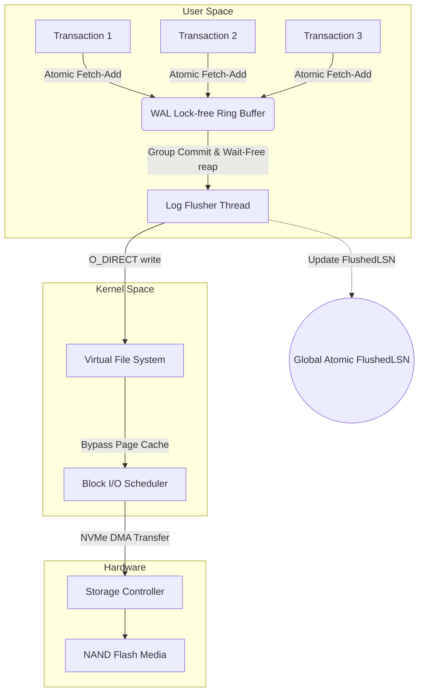
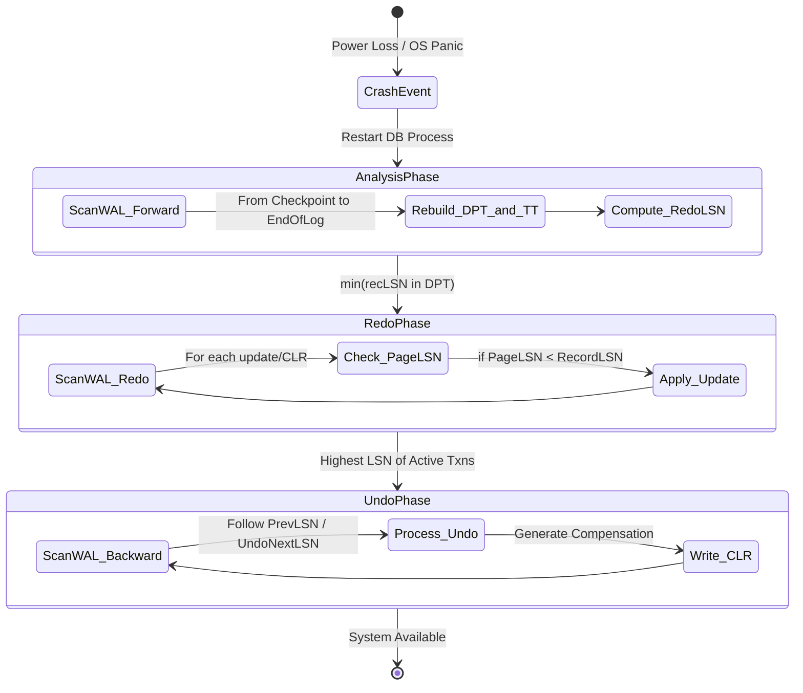

# Write-Ahead Logging (WAL) and the ARIES Recovery Algorithm: An In-Depth Analysis of Micro-Architecture and Mathematical Foundations

## Executive Summary & Problem Statement

Guaranteeing durability without wrecking performance is one of the oldest hard problems in database engineering. The moment a machine loses power or the kernel panics, everything sitting in RAM is gone. So how does a system recover a byte-for-byte accurate state without slowing down hundreds of thousands of transactions per second in the meantime?

**The core problem:** writing complex structures like a B+Tree directly to disk means expensive random I/O with no atomicity guarantee. If the process crashes midway through writing a page, that page is left corrupted — a torn page.

Write-Ahead Logging combined with the ARIES recovery algorithm is the answer the industry settled on decades ago and still hasn't really replaced. This article works through the micro-architecture of WAL, the concurrency model behind it, the queueing theory that makes Group Commit work, and the convergence guarantees that make ARIES recovery provably correct — turning what looks like chaos into a graph that simply cannot break. We'll close with practical lessons for anyone building I/O infrastructure of this kind.

## Theoretical Foundations and Micro-Architecture of Write-Ahead Logging (WAL)

Relational databases and distributed storage systems lean on Write-Ahead Logging to guarantee two of the four ACID properties: Atomicity and Durability. Instead of writing state changes directly into on-disk structures (B+Trees, heap files), the system serializes each change into a log record and appends it to the tail of the WAL stream.

The rule that makes all of this work is simple to state and strict to enforce: no data page $P_i$ may be flushed from the buffer pool to disk unless the log record describing the last change to that page is already durable.

Let $LSN_{page}$ be the Log Sequence Number of the last record that updated page $P_i$, and $LSN_{flushed}$ the largest LSN safely flushed to disk. This inequality must hold at every point in time:

$$ LSN_{page} \le LSN_{flushed} $$

### Structure and Meaning of the Log Sequence Number (LSN)

An LSN is typically a monotonically increasing 64-bit unsigned integer — a logical offset that pinpoints exactly where a record sits in the WAL stream.

Each WAL record carries metadata like:
1. **Transaction ID (TxID):** which transaction this belongs to.
2. **Operation type:** insert, update, delete.
3. **Space ID and Page ID:** where the physical data lives.
4. **Before-Image (Undo Log):** the data before the change, for rollback.
5. **After-Image (Redo Log):** the data after the change, for roll-forward.
6. **PrevLSN:** a pointer back to the previous record from the same transaction, forming a backward chain.

Serializing everything through an LSN sequence imposes a strict global order over every state mutation in the engine. It's what turns a genuinely chaotic multi-threaded system into a clean, ordered sequence of transitions.

### Concurrency Control at the WAL Buffer Level

Worker threads compete for the right to write into an intermediate structure in user-space memory — the WAL buffer. Getting concurrency right here matters more than almost anywhere else in the system, because this is where the whole engine's throughput can quietly collapse.

A naive design using a single global `std::mutex` to guard the WAL buffer falls apart the moment you're pushing a few thousand transactions per second. The usual fix is a lock-free LSN allocation scheme built on the hardware `fetch_add` (compare-and-swap) instruction.

Let $S_{record}$ be the expected size of the record about to be appended. The thread issues one atomic instruction:

$$ LSN_{allocated} = \text{AtomicFetchAndAdd}(\text{Global\_LSN}, S_{record}) $$

That returns an exclusive slot to the thread in a single CPU cycle, without blocking anyone else. The thread then just memcpy's its data into the WAL buffer at that offset. This structure — a **lock-free ring buffer** — is a big part of why systems like ScyllaDB and InnoDB can push hundreds of thousands of TPS.



### The Torn Write Disaster and the CRC32C Checksum

Flushing WAL from RAM to SSD/NVMe runs into a nasty physical problem known as torn write, or sector tearing.

SSDs only guarantee atomic writes at sector granularity — 512 or 4096 bytes. If the database issues a log write bigger than that (a 16KB record, say) and power drops mid-write, part of the record (the first 4KB, say) lands on disk while the rest is still stale garbage from whatever was there before.

To catch this kind of corruption, every WAL record header carries a hardware-accelerated integrity check — usually **CRC32C (Castagnoli)** — computed over the whole payload.

That check runs during recovery, when the log is read back. If:

$$ \text{CRC32C}(\text{ReadPayload}) \ne \text{StoredCRC} $$

the system knows a torn write happened and stops processing that incomplete record right there. Wherever the CRC check first fails is exactly where the valid part of the recovery stream ends.

```cpp
#include <atomic>
#include <cstdint>
#include <cstring>
#include <vector>
#include <nmmintrin.h> // For hardware CRC32 instruction (_mm_crc32_u64)

struct LogRecordHeader {
    uint64_t lsn;
    uint32_t txn_id;
    uint32_t payload_size;
    uint32_t crc32; // Mathematical integrity check
};

class WALManager {
private:
    std::atomic<uint64_t> current_lsn_{0};
    std::atomic<uint64_t> flushed_lsn_{0};
    uint8_t ring_buffer_[1024 * 1024 * 16]; // 16MB lock-free circular buffer
    
public:
    uint64_t AppendRecord(uint32_t txn_id, const std::vector<uint8_t>& data) {
        // Lock-free allocation of buffer space via hardware atomics
        uint32_t total_size = sizeof(LogRecordHeader) + data.size();
        uint64_t allocated_lsn = current_lsn_.fetch_add(total_size, std::memory_order_relaxed);
        
        LogRecordHeader header;
        header.lsn = allocated_lsn;
        header.txn_id = txn_id;
        header.payload_size = data.size();
        header.crc32 = CalculateHardwareCRC32(data.data(), data.size());
        
        // Copy header and payload into the ring_buffer_ using modulo arithmetic
        size_t offset = allocated_lsn % sizeof(ring_buffer_);
        // (Implementation handles wrapping around the edge of the ring buffer)
        
        return allocated_lsn;
    }

    void GroupCommit(uint64_t target_lsn) {
        // Wait-free check if the data has already been flushed by a concurrent thread
        if (flushed_lsn_.load(std::memory_order_acquire) >= target_lsn) {
            return; 
        }
        
        // Acquire internal mutex strictly for disk I/O coordination
        // Issue O_DIRECT write from ring_buffer_ down to physical NVMe
        // Update the global visibility of flushed data
        flushed_lsn_.store(target_lsn, std::memory_order_release);
    }

    uint32_t CalculateHardwareCRC32(const uint8_t* data, size_t length) {
        uint32_t crc = 0xFFFFFFFF;
        const uint64_t* ptr64 = reinterpret_cast<const uint64_t*>(data);
        size_t i = 0;
        
        // Exploit x86-64 SSE 4.2 instruction for massive throughput
        for (; i + 8 <= length; i += 8) {
            crc = _mm_crc32_u64(crc, *ptr64++);
        }
        // ... handle remaining bytes
        return crc ^ 0xFFFFFFFF;
    }
};
```

### Queueing Theory and Group Commit Optimization

I/O performance isn't just a function of code quality — it's governed heavily by the cost of serialization and how you batch disk flushes.

Writing every transaction to disk individually (sync-on-commit) pays a heavy write-amplification tax and burns PCIe bandwidth for no good reason. To get around that, storage engines use **Group Commit**: deliberately hold off for a short window ($T_{wait}$) while a batch of transactions finishes appending to WAL, then issue a single I/O for the whole batch once some threshold is crossed.

In queueing-theory terms, this shifts the model from $M/M/1$ to a batch-service $M/G/1$ (bulk service) queue.

If $t_{append\_i}$ is the append time for transaction $i$ and $t_{flush\_i}$ its individual flush latency, the naive per-transaction cost for $N$ transactions is:

$$ Cost_{naive} = \sum_{i=1}^{N} (t_{append\_i} + t_{flush\_i}) $$

With Group Commit applied across the batch:

$$ Cost_{group} = \sum_{i=1}^{N} (t_{append\_i}) + t_{flush\_group} $$

Tuning $T_{wait}$ is a genuine optimization problem: set it too high and per-transaction latency spikes, applications start timing out. Set it too low and IOPS spike instead, and the hardware chokes. Modern systems like PostgreSQL auto-tune this threshold against measured disk bandwidth at runtime.

## The ARIES Recovery Algorithm: Mathematical Analysis and Convergence Guarantees

**ARIES** (Algorithms for Recovery and Isolation Exploiting Semantics), designed by Dr. C. Mohan at IBM in 1992, is still the reference design for crash recovery. Its core idea is "repeating history" — replaying everything, blindly, and letting the logical semantics of the data sort out correctness.

ARIES rests on two policies:
* **No-Force:** dirty pages don't have to be flushed to disk at commit time (avoids extra random I/O).
* **Steal:** the system is allowed to write pages belonging to an *uncommitted* transaction to disk (to free buffer pool space when needed).

That flexibility is exactly what creates the risk of an inconsistent on-disk state after a crash. ARIES resolves it with three strict phases — Analysis, Redo, Undo — anchored by careful LSN chaining and the **Compensation Log Record (CLR)**, which is what guarantees the whole process actually converges.



### Phase 1: The Analysis Phase

Recovery starts by reading the most recent valid checkpoint. The goal here is to reconstruct memory state as it looked right before the crash, by rebuilding two structures:
1. **Transaction Table (TT):** in-flight transactions and their last known LSN.
2. **Dirty Page Table (DPT):** pages modified in RAM but not yet flushed. Each entry tracks $recLSN$ — the LSN of the very first change that dirtied that page.

Scanning forward from the checkpoint to the end of the log, the system adds transactions to the TT and pages to the DPT as it goes. That scan gives us a key value: $RedoLSN$.

$$ RedoLSN = \min(\{recLSN \mid \text{page} \in DPT\}) $$

$RedoLSN$ sets an absolute floor: anything with a smaller LSN is guaranteed to already be safely on disk, so there's no reason to re-read that older part of the WAL. In graph terms, this scan is really just rebuilding the set of nodes (pages) representing system state.

```rust
struct DirtyPageEntry {
    page_id: u32,
    rec_lsn: u64, // The LSN of the first update that dirtied the page
}

struct TransactionEntry {
    txn_id: u32,
    last_lsn: u64,
    status: TransactionStatus, // Active, Committing, Aborted
}

fn analysis_phase(wal_iterator: &mut WalIterator, checkpoint_lsn: u64) -> (HashMap<u32, TransactionEntry>, HashMap<u32, DirtyPageEntry>, u64) {
    let mut transaction_table: HashMap<u32, TransactionEntry> = HashMap::new();
    let mut dirty_page_table: HashMap<u32, DirtyPageEntry> = HashMap::new();
    
    wal_iterator.seek(checkpoint_lsn);
    
    while let Some(record) = wal_iterator.next() {
        match record.record_type {
            RecordType::Update(page_id) => {
                transaction_table.entry(record.txn_id).or_insert(TransactionEntry {
                    txn_id: record.txn_id,
                    last_lsn: record.lsn,
                    status: TransactionStatus::Active,
                }).last_lsn = record.lsn;
                
                // Track the very first LSN that dirtied this page
                dirty_page_table.entry(page_id).or_insert(DirtyPageEntry {
                    page_id,
                    rec_lsn: record.lsn,
                });
            },
            RecordType::Commit => {
                transaction_table.get_mut(&record.txn_id).unwrap().status = TransactionStatus::Committing;
            },
            // ... other record types handling
        }
    }
    
    let redo_lsn = dirty_page_table.values().map(|entry| entry.rec_lsn).min().unwrap_or(u64::MAX);
    (transaction_table, dirty_page_table, redo_lsn)
}
```

### Phase 2: The Redo Phase and the Idempotence Guarantee

ARIES's philosophy is "blindly repeat history" — it replays every change regardless of whether the originating transaction eventually committed or aborted.

The system scans the WAL starting at $RedoLSN$. For each update record it hits, it runs a short checklist before deciding whether the change actually needs to be redone on disk:

1. **Check the DPT:** the referenced page $P_x$ has to be in the DPT. If it's not there, that page was already safely flushed before the crash.
2. **Check recLSN:** the $recLSN$ stored for $P_x$ in the DPT must be $\le LSN_{record}$.
3. **Check the physical PageLSN:** if both checks pass, load $P_x$ from disk and check its own stamped LSN:
   $$ PageLSN \le LSN_{record} $$

If $PageLSN$ (the LSN physically written into that page on disk) is smaller than $LSN_{record}$, the change never made it to disk — so the system applies the after-image and updates $PageLSN$ to $LSN_{record}$.

That PageLSN stamp acts like a logical clock, and it's exactly what prevents redoing the same change twice. This property — **idempotence** — means no matter how many times Redo gets replayed across repeated crashes, the database never ends up in a corrupted state because of it.

### Phase 3: The Undo Phase and the Mystery of the CLR

This phase rolls back anything not marked Committed in the TT. Unlike the first two phases, Undo walks backward in time.

The system starts from the highest LSN in the TT and follows the $PrevLSN$ chain backward. This is where ARIES's design gets genuinely elegant: every Undo operation writes a **Compensation Log Record (CLR)** back into the WAL.

When applying a before-image to undo an operation, ARIES writes a new $CLR_i$ with a special pointer:

$$ UndoNextLSN = PrevLSN(U_i) $$

That pointer is what guarantees **finite convergence**. If the system crashes a second or third time in the middle of Undo, the next recovery pass will find the CLRs already written and won't try to undo something already undone (which would corrupt data). Instead it follows $UndoNextLSN$ to jump straight past whatever's already been compensated.

The net effect: the recovery state graph is acyclic by construction. The system always converges toward a consistent state and can never get stuck in an infinite undo loop.

## Buffer Architecture, OS Interaction, and the NUMA Nightmare

At millions of transactions per second, keeping WAL fast turns into a real fight with the kernel and the storage path.

A plain `write()` call defaults to landing data in the OS Page Cache — and a kernel panic wipes that out along with everything else. `fsync()`/`fdatasync()` exist to force those dirty bytes down to disk, but they're expensive: they lock inodes and synchronize metadata along the way.

The cleaner answer is **O_DIRECT**, which skips the OS Page Cache entirely and opens a DMA path straight from the WAL buffer to the block I/O subsystem and the NVMe device. With O_DIRECT, the database avoids CPU jitter and the random stalls caused by kernel flusher threads.

The catch, as usual, is alignment: O_DIRECT requires buffers aligned to the block size (4KB, typically), which means `posix_memalign()` instead of plain `malloc()`.

### The NUMA Wall and Partitioned WAL

Non-uniform memory access (NUMA) is its own headache. On multi-socket machines, touching RAM on a neighboring NUMA node is slow. A single centralized ring buffer for the WAL creates **cache line bouncing** — cores on different sockets fighting over the same tail-pointer cache line, forcing MESI coherence traffic across the QPI/UPI interconnect, and throughput collapses under the contention.

The usual fix is **thread-local WAL buffers** (or partitioned WAL buffers), where groups of threads each own an independent log lane. Once a lane fills up, a central flusher thread sorts and merges LSNs before pushing the physical I/O out to SSD. Keeping strict global LSN ordering across sharded lanes like this is a genuinely hard trade-off to get right.

### ZNS NVMe: The Evolution of Hardware/Software Co-Design

NAND flash under a typical WAL workload — small, sequential, append-only writes — takes a beating from write amplification (WAF), because the SSD controller still has to run garbage collection to reclaim space from old, truncated WAL segments.

Newer hardware protocols like **Zoned Namespaces (ZNS)** NVMe let the database tell the drive directly to manage zones under a sequential-write-only rule, which removes the firmware's garbage collector from the picture entirely. When a WAL segment on ZNS becomes safe to discard (because a checkpoint has passed it), the system just issues a Zone Reset — instant reclaim, no write-cycle cost at all.

The path from ARIES's 1990s theory to ZNS NVMe today is a nice example of hardware and software co-design done right — formal guarantees from the '90s literally shaping how silicon gets built decades later.

## Lessons Learned

For anyone building storage systems that need to survive crashes without losing data:
1. **Lock-free design isn't optional.** LSN allocation in a multi-threaded system needs hardware atomic compare-and-swap. A mutex around the WAL buffer will cap your throughput hard.
2. **Trust nothing without a checksum.** Torn writes happen, regularly, at scale. CRC32C via hardware SSE/AVX instructions is the only real defense against silent corruption.
3. **Idempotence is what makes recovery safe.** Redo and Undo both need to be repeatable an unbounded number of times — that's what PageLSN and CLR are for. A crash during recovery must never be able to make things worse.
4. **Bypass the kernel where it counts.** Sub-millisecond, deterministic latency means designing around O_DIRECT and io_uring instead of the OS Page Cache.
5. **Batch your I/O.** Never sync to disk per transaction. Group Commit exists precisely to maximize PCIe bandwidth utilization and keep IOPS costs sane.
