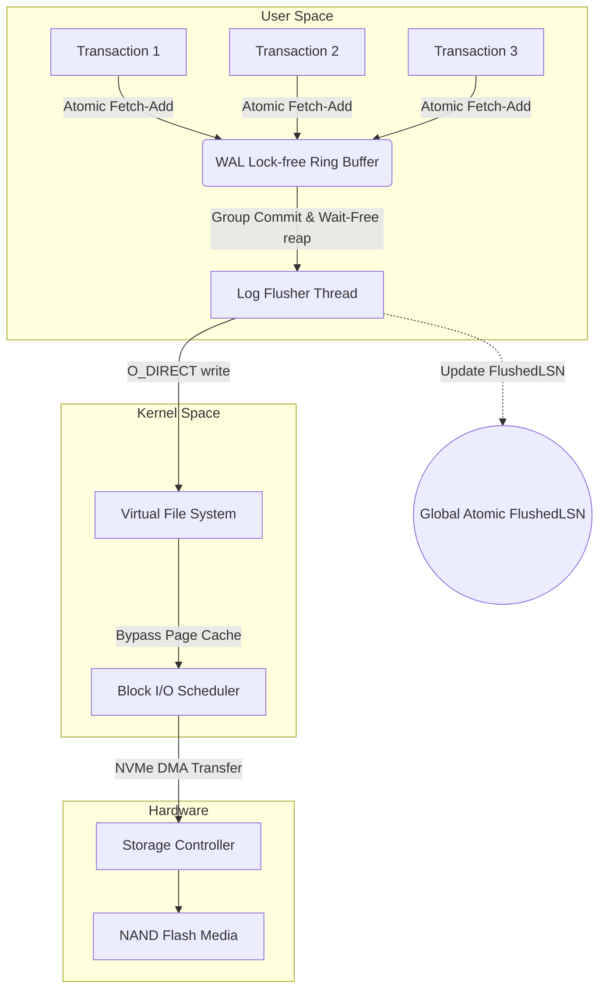
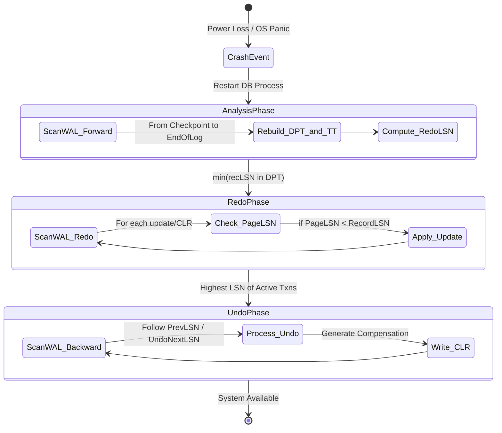

# 03: Write-Ahead Logging (WAL)とARIESリカバリアルゴリズム：マイクロアーキテクチャと数学的基盤の徹底解説

## エグゼクティブサマリーと問題提起

性能を犠牲にせずに永続性を保証するというのは、データベースエンジニアリングの中でも古くて厄介な問題の一つだ。マシンの電源が落ちる、あるいはカーネルパニックが起きる、その瞬間にRAM上にあったものはすべて消える。では、毎秒数十万トランザクションを処理しながら、バイト単位で正確な状態に復旧するにはどうすればいいのか。

**核心の問題はこうだ。** B+Treeのような複雑な構造をそのままディスクに書くと、コストの高いランダムI/Oが発生するうえ、原子性(Atomicity)も保証できない。書き込みの途中でプロセスがクラッシュすれば、そのページは壊れたまま残ってしまう(torn page)。

Write-Ahead Logging(WAL)とARIESリカバリアルゴリズムの組み合わせは、この問題に対して業界が何十年も前にたどり着いた答えであり、いまだにこれを置き換える決定的な代替案は出ていない。この記事ではWALのマイクロアーキテクチャ、その背後にある並行性モデル、Group Commitを機能させる待ち行列理論、そしてARIESリカバリが確実に正しく収束することを保証する仕組みを追っていく。混沌に見えるものが、実は決して壊れないグラフ構造になっている、という話だ。最後に、この種のI/Oインフラを作る人向けの実践的な教訓をまとめる。

## Write-Ahead Logging(WAL)の理論的基礎とマイクロアーキテクチャ

リレーショナルデータベースや分散ストレージシステムは、ACIDの4つの性質のうち原子性(Atomicity)と永続性(Durability)の2つを保証するためにWrite-Ahead Loggingに依存している。状態変化をディスク上の構造(B+Treeやヒープファイルなど)に直接書き込む代わりに、システムは各変更をログレコードとしてシリアライズし、WALストリームの末尾に追記する。

これを成立させているルールは単純だが、厳格に守らなければならない。データページ$P_i$の最後の変更を表すログレコードがディスク上で永続化されていない限り、そのページをバッファプールからディスクへフラッシュしてはならない。

ページ$P_i$を更新した最後のレコードのLog Sequence Numberを$LSN_{page}$、ディスクへ安全にフラッシュされた最大のLSNを$LSN_{flushed}$とすると、次の不等式が常に成立しなければならない。

$$ LSN_{page} \le LSN_{flushed} $$

### Log Sequence Number(LSN)の構造と意味

LSNは通常、単調増加する64ビットの符号なし整数で、WALストリーム内でそのレコードが正確にどこにあるかを示す論理オフセットとして機能する。

各WALレコードは次のようなメタデータを持つ。
1. **Transaction ID(TxID):** どのトランザクションに属するか。
2. **操作タイプ:** insert、update、delete。
3. **Space IDとPage ID:** 物理データがどこにあるか。
4. **Before-Image(Undo Log):** 変更前のデータ。ロールバックに使う。
5. **After-Image(Redo Log):** 変更後のデータ。ロールフォワードに使う。
6. **PrevLSN:** 同じトランザクションの前のレコードへのポインタ。逆方向の連結リストを作る。

すべてをLSNの並びでシリアライズすることで、エンジン内のあらゆる状態変化に厳密な全順序が課される。これによって、実際には混沌としているマルチスレッドのシステムが、きれいに順序づけられた遷移の列に変換される。

### WAL Bufferレベルでの並行性制御

ワーカースレッドは、ユーザー空間メモリ内の中間構造であるWAL Bufferへの書き込み権を奪い合う。ここでの並行性の設計は、システム全体のどこよりも重要だと言っていい。ここがボトルネックになると、スループット全体が静かに崩れるからだ。

WAL Bufferを単一のグローバル`std::mutex`で守る素朴な実装は、毎秒数千トランザクションに達した時点で破綻する。よくある解決策は、ハードウェアの`fetch_add`(compare-and-swap)命令を使ったロックフリーのLSN割り当てだ。

これから追記するレコードの予想サイズを$S_{record}$とすると、スレッドは次のアトミック命令を一つ発行する。

$$ LSN_{allocated} = \text{AtomicFetchAndAdd}(\text{Global\_LSN}, S_{record}) $$

これで、他のスレッドをブロックすることなく、1 CPUサイクルでそのスレッド専用の位置が返ってくる。あとはそのオフセットにデータをmemcpyするだけだ。この構造、**ロックフリーリングバッファ**が、ScyllaDBやInnoDBが数十万TPSを出せる理由の大きな部分を占めている。



### Torn Writeの惨劇とCRC32Cチェックサム

WALをRAMからSSD/NVMeへフラッシュする際には、torn write(sector tearing)という厄介な物理的問題がつきまとう。

SSDはセクター単位(512バイトまたは4096バイト)でしかアトミックな書き込みを保証しない。データベースがそれより大きいログ書き込み(たとえば16KBのレコード)を発行し、そのブロックを書き込んでいる最中に電源が落ちると、レコードの一部(最初の4KBなど)だけがディスクに残り、残りは書き込み前の古いゴミデータのままになる。

この種の破損を検出するため、各WALレコードのヘッダーには、ペイロード全体に対して計算したハードウェアアクセラレーションの整合性チェック — 通常は**CRC32C(Castagnoli)** — が付与される。

このチェックはリカバリ時にログを読み戻すタイミングで実行される。もし

$$ \text{CRC32C}(\text{ReadPayload}) \ne \text{StoredCRC} $$

であれば、torn writeが起きたと判断し、その不完全なレコードの処理をその場で打ち切る。CRCチェックが最初に失敗した地点こそが、リカバリ対象として有効なストリームの終端になる。

```cpp
#include <atomic>
#include <cstdint>
#include <cstring>
#include <vector>
#include <nmmintrin.h> // For hardware CRC32 instruction (_mm_crc32_u64)

struct LogRecordHeader {
    uint64_t lsn;
    uint32_t txn_id;
    uint32_t payload_size;
    uint32_t crc32; // Mathematical integrity check
};

class WALManager {
private:
    std::atomic<uint64_t> current_lsn_{0};
    std::atomic<uint64_t> flushed_lsn_{0};
    uint8_t ring_buffer_[1024 * 1024 * 16]; // 16MB lock-free circular buffer
    
public:
    uint64_t AppendRecord(uint32_t txn_id, const std::vector<uint8_t>& data) {
        // Lock-free allocation of buffer space via hardware atomics
        uint32_t total_size = sizeof(LogRecordHeader) + data.size();
        uint64_t allocated_lsn = current_lsn_.fetch_add(total_size, std::memory_order_relaxed);
        
        LogRecordHeader header;
        header.lsn = allocated_lsn;
        header.txn_id = txn_id;
        header.payload_size = data.size();
        header.crc32 = CalculateHardwareCRC32(data.data(), data.size());
        
        // Copy header and payload into the ring_buffer_ using modulo arithmetic
        size_t offset = allocated_lsn % sizeof(ring_buffer_);
        // (Implementation handles wrapping around the edge of the ring buffer)
        
        return allocated_lsn;
    }

    void GroupCommit(uint64_t target_lsn) {
        // Wait-free check if the data has already been flushed by a concurrent thread
        if (flushed_lsn_.load(std::memory_order_acquire) >= target_lsn) {
            return; 
        }
        
        // Acquire internal mutex strictly for disk I/O coordination
        // Issue O_DIRECT write from ring_buffer_ down to physical NVMe
        // Update the global visibility of flushed data
        flushed_lsn_.store(target_lsn, std::memory_order_release);
    }

    uint32_t CalculateHardwareCRC32(const uint8_t* data, size_t length) {
        uint32_t crc = 0xFFFFFFFF;
        const uint64_t* ptr64 = reinterpret_cast<const uint64_t*>(data);
        size_t i = 0;
        
        // Exploit x86-64 SSE 4.2 instruction for massive throughput
        for (; i + 8 <= length; i += 8) {
            crc = _mm_crc32_u64(crc, *ptr64++);
        }
        // ... handle remaining bytes
        return crc ^ 0xFFFFFFFF;
    }
};
```

### 待ち行列理論とGroup Commitの最適化

I/O性能はコードの出来だけで決まるものではなく、シリアライズとディスクフラッシュのコスト関数に大きく左右される。

トランザクションごとに個別にディスクへ書く(sync-on-commit)方式は、write amplificationのペナルティを払い、PCIe帯域を無駄に消費する。これを避けるために使われるのが**Group Commit**だ。短い待ち時間($T_{wait}$)をわざと設け、その間に複数のトランザクションのWAL追記をまとめ、しきい値を超えたところで一括してI/Oを発行する。

待ち行列理論的に言えば、これはモデルを$M/M/1$からバッチ処理の$M/G/1$(bulk service)へシフトさせることに相当する。

トランザクション$i$の追記時間を$t_{append\_i}$、個別のフラッシュ遅延を$t_{flush\_i}$とすると、$N$個のトランザクションを個別に処理する場合のコストは次の通り。

$$ Cost_{naive} = \sum_{i=1}^{N} (t_{append\_i} + t_{flush\_i}) $$

Group Commitをバッチ全体に適用すると:

$$ Cost_{group} = \sum_{i=1}^{N} (t_{append\_i}) + t_{flush\_group} $$

$T_{wait}$のチューニングは実質的な最適化問題だ。大きすぎればトランザクションごとの遅延が跳ね上がりタイムアウトが発生する。小さすぎればIOPSが跳ね上がりハードウェアが音を上げる。PostgreSQLのような最近のシステムは、実測したディスク帯域をもとにこのしきい値を実行時に自動調整している。

## ARIESリカバリアルゴリズム:数学的分析と収束性

**ARIES**(Algorithms for Recovery and Isolation Exploiting Semantics)は、1992年にIBMのC. Mohan博士が設計したもので、クラッシュリカバリの基準設計として今も使われ続けている。その核心は「歴史を繰り返す(repeating history)」という発想だ。すべてを盲目的にリプレイし、正しさの判断はデータの論理的なセマンティクスに委ねる。

ARIESは次の2つの方針の上に成り立っている。
* **No-Force:** コミット時にダーティページを強制的にディスクへフラッシュしなくてよい(余計なランダムI/Oを避ける)。
* **Steal:** *未コミット*のトランザクションが持つページをディスクに書き出してもよい(必要なときにバッファプールの空きを確保する)。

この柔軟さこそが、クラッシュ後にディスク上のデータが矛盾する原因になる。ARIESはこれをAnalysis、Redo、Undoという3つの厳格なフェーズで解決する。その支えになっているのが、緻密なLSNチェーンと、プロセス全体の収束を保証する**Compensation Log Record(CLR)**だ。



### フェーズ1:Analysisフェーズ

リカバリは、最も新しい有効なチェックポイントを読むところから始まる。ここでの目標は、クラッシュ直前のメモリ状態を再構築することで、次の2つの構造を作り直す。
1. **Transaction Table(TT):** 実行中だったトランザクションと、それぞれの最後のLSN。
2. **Dirty Page Table(DPT):** RAM上で変更されたがまだディスクにフラッシュされていないページ。各エントリは、そのページを最初にダーティにした変更のLSNである$recLSN$を持つ。

チェックポイントからログの末尾まで前方向にスキャンしながら、システムはトランザクションをTTに、ページをDPTに追加していく。このスキャンで、重要な値である$RedoLSN$を計算できる。

$$ RedoLSN = \min(\{recLSN \mid \text{page} \in DPT\}) $$

$RedoLSN$は絶対的な下限を示す。これより小さいLSNを持つレコードはすでにディスクへ安全に反映済みであることが保証されるため、WALのその部分を読み直す必要はない。グラフ理論的に言えば、このスキャンはシステム状態を表すノード(ページ)の集合を再構築する作業だ。

```rust
struct DirtyPageEntry {
    page_id: u32,
    rec_lsn: u64, // The LSN of the first update that dirtied the page
}

struct TransactionEntry {
    txn_id: u32,
    last_lsn: u64,
    status: TransactionStatus, // Active, Committing, Aborted
}

fn analysis_phase(wal_iterator: &mut WalIterator, checkpoint_lsn: u64) -> (HashMap<u32, TransactionEntry>, HashMap<u32, DirtyPageEntry>, u64) {
    let mut transaction_table: HashMap<u32, TransactionEntry> = HashMap::new();
    let mut dirty_page_table: HashMap<u32, DirtyPageEntry> = HashMap::new();
    
    wal_iterator.seek(checkpoint_lsn);
    
    while let Some(record) = wal_iterator.next() {
        match record.record_type {
            RecordType::Update(page_id) => {
                transaction_table.entry(record.txn_id).or_insert(TransactionEntry {
                    txn_id: record.txn_id,
                    last_lsn: record.lsn,
                    status: TransactionStatus::Active,
                }).last_lsn = record.lsn;
                
                // Track the very first LSN that dirtied this page
                dirty_page_table.entry(page_id).or_insert(DirtyPageEntry {
                    page_id,
                    rec_lsn: record.lsn,
                });
            },
            RecordType::Commit => {
                transaction_table.get_mut(&record.txn_id).unwrap().status = TransactionStatus::Committing;
            },
            // ... other record types handling
        }
    }
    
    let redo_lsn = dirty_page_table.values().map(|entry| entry.rec_lsn).min().unwrap_or(u64::MAX);
    (transaction_table, dirty_page_table, redo_lsn)
}
```

### フェーズ2:Redoフェーズとべき等性の保証

ARIESの哲学は「歴史を盲目的に繰り返す」ことにある。元のトランザクションが最終的にコミットされたかアボートされたかに関係なく、すべての変更をそのまま再現する。

システムは$RedoLSN$からWALをスキャンし、update レコードに出会うたびに、それをディスク上で本当にredoする必要があるか短いチェックリストで判定する。

1. **DPTを確認:** 参照先のページ$P_x$がDPTになければ、そのページはクラッシュ前にすでに安全にフラッシュ済みだ。
2. **recLSNを確認:** DPTに記録された$P_x$の$recLSN$が$LSN_{record}$以下であること。
3. **物理的なPageLSNを確認:** 上の2つを満たせば$P_x$をディスクからロードし、そのページ自体に刻まれたLSNを確認する。
   $$ PageLSN \le LSN_{record} $$

$PageLSN$(ディスク上のページに物理的に刻まれたLSN)が$LSN_{record}$より小さければ、その変更はまだディスクに届いていない。システムはafter-imageを適用し、$PageLSN$を$LSN_{record}$に更新する。

このPageLSNの刻印は論理クロックのように働き、同じ変更を二度redoすることを防ぐ。これが**べき等性(idempotence)**であり、クラッシュが何度繰り返されてRedoが何度リプレイされても、そのことが原因でデータベースが壊れることはない。

### フェーズ3:UndoフェーズとCLRの正体

このフェーズでは、TTでコミット済みとマークされていないものをすべてロールバックする。最初の2つのフェーズと違い、Undoは時間を遡ってスキャンする。

システムはTT内の最も高いLSNから出発し、$PrevLSN$のチェーンを後ろへたどっていく。ARIESの設計が本当に洗練されているのはここで、Undo操作のたびに**Compensation Log Record(CLR)**をWALに書き込む点だ。

before-imageを適用して操作を取り消すとき、ARIESは新しい$CLR_i$を書き込み、そこに特別なポインタを持たせる。

$$ UndoNextLSN = PrevLSN(U_i) $$

このポインタが**有限収束**を保証する。Undoの最中にシステムが二度、三度とクラッシュしても、次のリカバリでは既に書かれたCLRに出会うため、すでにUndo済みのレコードを再度Undoしようとすること(データを壊す原因になる)はない。代わりに$UndoNextLSN$をたどって、すでに補償済みの操作を一気に飛び越える。

結果として、リカバリの状態遷移はサイクルを持たないグラフになる。システムは常に一貫した状態へ収束し、無限のUndoループに陥ることは構造上あり得ない。

## バッファアーキテクチャ、OSとの相互作用、そしてNUMAの悩み

毎秒数百万トランザクションという速度になると、WALを速く保つこと自体がカーネルおよびストレージパスとの本格的な戦いになる。

普通の`write()`はデフォルトでOS Page Cacheにデータを置く。カーネルパニックが起きればそれも他のすべてと一緒に消える。`fsync()`や`fdatasync()`はダーティなバイト列を強制的にディスクへ押し出すために存在するが、これはコストが高い。inodeをロックし、メタデータの同期も伴うからだ。

より筋の良い解決策が**O_DIRECT**だ。OS Page Cacheを完全に迂回し、WAL BufferからブロックI/OサブシステムとNVMeデバイスへ直接つながるDMA経路を開く。O_DIRECTを使えば、CPUのジッターやカーネルのフラッシャースレッドによるランダムなストールを避けられる。

ただしここでもお馴染みの制約がある。O_DIRECTはブロックサイズ(通常4KB)にアライメントされたバッファを要求するため、普通の`malloc()`ではなく`posix_memalign()`を使う必要がある。

### NUMAの壁とPartitioned WAL

Non-Uniform Memory Access(NUMA)もそれ自体が頭痛の種だ。マルチソケット構成では、隣接するNUMAノードのRAMへのアクセスは遅い。WAL Bufferを単一の集中型リングバッファとして設計すると、**cache line bouncing**が発生する。異なるソケットのコアが同じtailポインタのキャッシュラインを奪い合い、QPI/UPIインターコネクト越しにMESIコヒーレンストラフィックが発生し、スループットが崩れる。

よくある対策は**スレッドローカルなWAL Buffer**(あるいはパーティション化されたWAL Buffer)だ。スレッドのグループごとに独立したログレーンを持たせ、レーンが一杯になったら中央のflusherスレッドがLSNをソート・マージしてから物理I/OをSSDへ送る。こうしたシャード化されたレーンをまたいで厳密なグローバルLSN順序を保つのは、実際にはかなり難しいトレードオフになる。

### ZNS NVMe:ハードウェアとソフトウェアの共進化

典型的なWALワークロード(小さく、シーケンシャルで、append-onlyな書き込み)の下では、NAND Flashはwrite amplification(WAF)によって消耗する。SSDコントローラーは、切り詰められた古いWALセグメントの領域を回収するために、ガベージコレクションを走らせ続けなければならないからだ。

**Zoned Namespaces(ZNS)** NVMeのような新しいハードウェアプロトコルは、データベースがドライブに対して直接、ゾーンをsequential-write-onlyのルールで管理するよう指示できるようにする。これによってファームウェア側のガベージコレクターがそもそも不要になる。ZNS上のWALセグメントが破棄可能になったとき(チェックポイントがそこを通過したため)、システムはただZone Resetを発行するだけでいい。書き込みサイクルを一切消費せず、即座に領域を回収できる。

1990年代のARIESの理論から今日のZNS NVMeへ至る道筋は、ハードウェアとソフトウェアの共進化がうまくいった好例だ。数十年前の形式的な保証が、そのまま今のシリコンの設計を形作っている。

## 学んだ教訓

クラッシュしてもデータを失わないストレージシステムを作る人へ:
1. **ロックフリー設計は必須。** マルチスレッド環境でのLSN割り当てにはハードウェアのatomic compare-and-swapが要る。WAL Bufferにmutexを使うと、スループットに厳しい上限がかかる。
2. **チェックサムなしに何も信用しない。** torn writeは規模が大きくなれば普通に起きる。ハードウェアのSSE/AVX命令によるCRC32Cは、静かな破損に対する唯一の実質的な防御策だ。
3. **べき等性がリカバリを安全にする。** RedoもUndoも、何度繰り返しても壊れないよう設計する必要がある。それを支えるのがPageLSNとCLRだ。リカバリ中のクラッシュが状況を悪化させることは絶対にあってはならない。
4. **要所ではカーネルを迂回する。** サブミリ秒かつ決定論的なレイテンシが欲しいなら、OS Page Cacheではなく O_DIRECT と io_uring を前提に設計する。
5. **I/Oはバッチにまとめる。** トランザクションごとにディスクへsyncしてはいけない。Group Commitはまさに、PCIe帯域を最大限使い、IOPSコストを妥当な範囲に抑えるために存在する。
