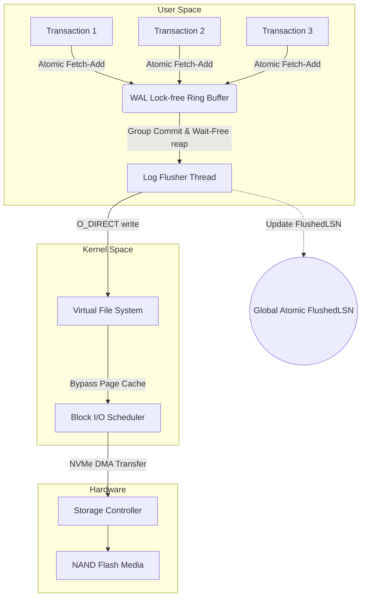
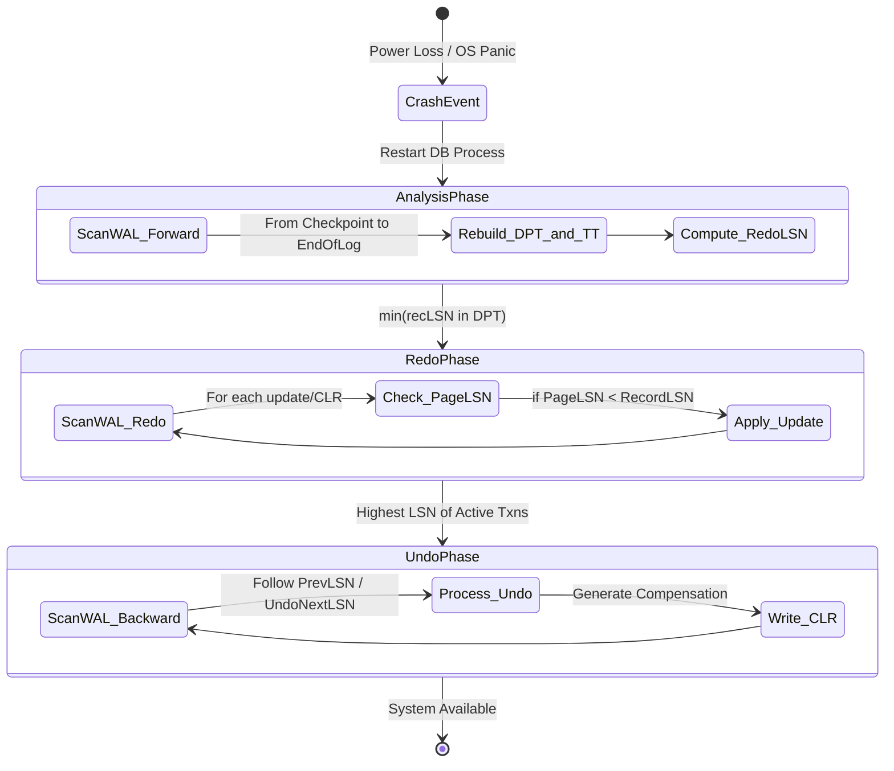

# 03: Write-Ahead Logging (WAL) và Thuật toán Phục hồi ARIES: Phân tích Chuyên sâu về Vi kiến trúc và Nền tảng Toán học

## Tóm tắt Điều hành & Tuyên bố Vấn đề

Đảm bảo độ bền dữ liệu mà không đánh đổi hiệu năng là một trong những bài toán khó lâu đời nhất của ngành database. Khi máy mất điện hay kernel panic, mọi thứ đang nằm trong RAM biến mất ngay lập tức. Vậy làm sao một hệ thống có thể khôi phục lại trạng thái chính xác đến từng byte, trong khi vẫn xử lý hàng trăm nghìn giao dịch mỗi giây?

**Vấn đề cốt lõi:** ghi trực tiếp các cấu trúc dữ liệu phức tạp như B+Tree xuống đĩa nghĩa là chấp nhận chi phí I/O ngẫu nhiên đắt đỏ và không có gì đảm bảo tính nguyên tử. Nếu tiến trình sập giữa chừng lúc đang ghi một trang, trang đó sẽ hỏng — đây gọi là torn page.

Write-Ahead Logging (WAL) kết hợp với thuật toán phục hồi ARIES là câu trả lời mà ngành công nghiệp đã chọn từ nhiều thập kỷ trước, và đến nay vẫn chưa có gì thay thế được nó một cách triệt để. Bài viết này đi qua vi kiến trúc của WAL, mô hình đồng thời đằng sau nó, lý thuyết hàng đợi khiến Group Commit hoạt động hiệu quả, và các đảm bảo hội tụ khiến quá trình phục hồi theo ARIES chứng minh được là đúng đắn — biến thứ trông như hỗn loạn thành một đồ thị không thể phá vỡ. Cuối bài là vài bài học thực tế cho ai đang xây dựng hạ tầng I/O kiểu này.

## Cơ sở Lý thuyết và Kiến trúc Vi mô của Write-Ahead Logging (WAL)

Cơ sở dữ liệu quan hệ và hệ thống lưu trữ phân tán dựa vào Write-Ahead Logging để đảm bảo hai trong bốn tính chất ACID: tính nguyên tử (Atomicity) và tính bền vững (Durability). Thay vì ghi trực tiếp các thay đổi trạng thái vào cấu trúc trên đĩa (B+Tree, heap file), hệ thống tuần tự hóa từng thay đổi thành bản ghi nhật ký và chỉ thêm vào cuối luồng WAL (append-only).

Quy tắc khiến tất cả điều này vận hành được rất đơn giản để phát biểu nhưng nghiêm ngặt để tuân thủ: không trang dữ liệu $P_i$ nào được phép xả từ buffer pool xuống đĩa trừ khi bản ghi nhật ký mô tả thay đổi cuối cùng trên trang đó đã được đảm bảo bền vững.

Gọi $LSN_{page}$ là Log Sequence Number của bản ghi cuối cùng cập nhật trang $P_i$, và $LSN_{flushed}$ là LSN lớn nhất đã được xả an toàn xuống đĩa. Bất đẳng thức sau phải luôn đúng tại mọi thời điểm:

$$ LSN_{page} \le LSN_{flushed} $$

### Cấu trúc và Ý nghĩa của Log Sequence Number (LSN)

LSN thường là một số nguyên không dấu 64-bit tăng đơn điệu — một con trỏ độ dời logic chỉ đích xác vị trí của bản ghi đó trong luồng WAL.

Mỗi bản ghi WAL mang các siêu dữ liệu như:
1. **Transaction ID (TxID):** giao dịch nào sở hữu bản ghi này.
2. **Loại thao tác:** insert, update, delete.
3. **Space ID và Page ID:** dữ liệu vật lý nằm ở đâu.
4. **Before-Image (Undo Log):** dữ liệu trước khi thay đổi, dùng để rollback.
5. **After-Image (Redo Log):** dữ liệu sau khi thay đổi, dùng để roll-forward.
6. **PrevLSN:** con trỏ trỏ về bản ghi trước đó của cùng giao dịch, tạo thành một chuỗi liên kết ngược.

Việc tuần tự hóa mọi thứ qua chuỗi LSN áp đặt một trật tự toàn cục nghiêm ngặt lên mọi thay đổi trạng thái trong engine. Đây chính là thứ biến một hệ thống đa luồng vốn dĩ hỗn loạn thành một chuỗi chuyển trạng thái gọn gàng, có thứ tự.

### Quản lý Đồng thời tại cấp độ WAL Buffer

Các luồng công việc cạnh tranh quyền ghi vào một cấu trúc trung gian trong bộ nhớ user-space — WAL Buffer. Việc thiết kế đồng thời đúng ở đây quan trọng hơn hầu hết mọi nơi khác trong hệ thống, vì đây chính là nơi thông lượng toàn hệ thống có thể âm thầm sụp đổ.

Một thiết kế ngây thơ dùng một `std::mutex` toàn cục để bảo vệ WAL Buffer sẽ sụp đổ ngay khi hệ thống chạm mốc vài nghìn giao dịch mỗi giây. Cách khắc phục phổ biến là cấp phát LSN không cần khóa (lock-free), dựa trên lệnh phần cứng `fetch_add` (compare-and-swap).

Gọi $S_{record}$ là kích thước dự kiến của bản ghi chuẩn bị được thêm vào. Luồng thực thi gọi một lệnh nguyên tử duy nhất:

$$ LSN_{allocated} = \text{AtomicFetchAndAdd}(\text{Global\_LSN}, S_{record}) $$

Lệnh này trả về một vị trí độc quyền cho luồng đó trong một chu kỳ CPU, không hề chặn bất kỳ luồng nào khác. Sau đó luồng chỉ cần memcpy dữ liệu vào WAL Buffer tại độ dời đó. Cấu trúc này — **lock-free ring buffer** — là phần lớn lý do vì sao các hệ thống như ScyllaDB và InnoDB có thể đạt hàng trăm nghìn TPS.



### Thảm họa Torn Write và CRC32C Checksum

Việc xả WAL từ RAM xuống SSD/NVMe gặp phải một vấn đề vật lý phiền phức gọi là torn write, hay sector tearing.

SSD chỉ đảm bảo ghi nguyên tử ở mức đơn vị sector — 512 hoặc 4096 byte. Nếu database phát lệnh ghi log lớn hơn kích thước đó (chẳng hạn một bản ghi 16KB) và mất điện xảy ra ngay giữa lúc ghi, một phần bản ghi (ví dụ 4KB đầu) sẽ nằm trên đĩa, còn phần còn lại vẫn là dữ liệu rác cũ từ trước đó.

Để phát hiện kiểu hỏng hóc này, phần đầu mỗi bản ghi WAL luôn mang theo một mã kiểm tra toàn vẹn tăng tốc bằng phần cứng — thường là **CRC32C (Castagnoli)** — tính trên toàn bộ payload.

Việc kiểm tra này diễn ra khi đọc lại log trong giai đoạn phục hồi. Nếu:

$$ \text{CRC32C}(\text{ReadPayload}) \ne \text{StoredCRC} $$

hệ thống biết ngay một sự kiện torn write đã xảy ra, và dừng xử lý bản ghi không hoàn chỉnh đó tại chỗ. Điểm mà CRC lần đầu tiên thất bại chính là điểm kết thúc hợp lệ của luồng dữ liệu cần phục hồi.

```cpp
#include <atomic>
#include <cstdint>
#include <cstring>
#include <vector>
#include <nmmintrin.h> // For hardware CRC32 instruction (_mm_crc32_u64)

struct LogRecordHeader {
    uint64_t lsn;
    uint32_t txn_id;
    uint32_t payload_size;
    uint32_t crc32; // Mathematical integrity check
};

class WALManager {
private:
    std::atomic<uint64_t> current_lsn_{0};
    std::atomic<uint64_t> flushed_lsn_{0};
    uint8_t ring_buffer_[1024 * 1024 * 16]; // 16MB lock-free circular buffer
    
public:
    uint64_t AppendRecord(uint32_t txn_id, const std::vector<uint8_t>& data) {
        // Lock-free allocation of buffer space via hardware atomics
        uint32_t total_size = sizeof(LogRecordHeader) + data.size();
        uint64_t allocated_lsn = current_lsn_.fetch_add(total_size, std::memory_order_relaxed);
        
        LogRecordHeader header;
        header.lsn = allocated_lsn;
        header.txn_id = txn_id;
        header.payload_size = data.size();
        header.crc32 = CalculateHardwareCRC32(data.data(), data.size());
        
        // Copy header and payload into the ring_buffer_ using modulo arithmetic
        size_t offset = allocated_lsn % sizeof(ring_buffer_);
        // (Implementation handles wrapping around the edge of the ring buffer)
        
        return allocated_lsn;
    }

    void GroupCommit(uint64_t target_lsn) {
        // Wait-free check if the data has already been flushed by a concurrent thread
        if (flushed_lsn_.load(std::memory_order_acquire) >= target_lsn) {
            return; 
        }
        
        // Acquire internal mutex strictly for disk I/O coordination
        // Issue O_DIRECT write from ring_buffer_ down to physical NVMe
        // Update the global visibility of flushed data
        flushed_lsn_.store(target_lsn, std::memory_order_release);
    }

    uint32_t CalculateHardwareCRC32(const uint8_t* data, size_t length) {
        uint32_t crc = 0xFFFFFFFF;
        const uint64_t* ptr64 = reinterpret_cast<const uint64_t*>(data);
        size_t i = 0;
        
        // Exploit x86-64 SSE 4.2 instruction for massive throughput
        for (; i + 8 <= length; i += 8) {
            crc = _mm_crc32_u64(crc, *ptr64++);
        }
        // ... handle remaining bytes
        return crc ^ 0xFFFFFFFF;
    }
};
```

### Lý thuyết Hàng đợi và Tối ưu hóa Group Commit

Hiệu năng I/O không chỉ phụ thuộc vào chất lượng code — nó bị chi phối nhiều bởi chi phí tuần tự hóa và cách gom nhóm việc xả đĩa.

Ghi từng giao dịch xuống đĩa riêng lẻ (sync-on-commit) phải trả một cái giá lớn về write amplification và lãng phí băng thông PCIe một cách không cần thiết. Để tránh điều này, các storage engine dùng **Group Commit**: cố ý trì hoãn trong một khoảng thời gian ngắn ($T_{wait}$) trong khi một loạt giao dịch hoàn tất việc thêm vào WAL, rồi phát một lệnh I/O duy nhất cho cả lô khi vượt ngưỡng nào đó.

Theo ngôn ngữ lý thuyết hàng đợi, cách này chuyển mô hình từ $M/M/1$ sang xử lý theo lô $M/G/1$ (bulk service).

Nếu $t_{append\_i}$ là thời gian thêm vào của giao dịch $i$ và $t_{flush\_i}$ là độ trễ xả riêng lẻ của nó, chi phí ngây thơ cho $N$ giao dịch là:

$$ Cost_{naive} = \sum_{i=1}^{N} (t_{append\_i} + t_{flush\_i}) $$

Khi áp dụng Group Commit cho cả lô:

$$ Cost_{group} = \sum_{i=1}^{N} (t_{append\_i}) + t_{flush\_group} $$

Việc chỉnh $T_{wait}$ là một bài toán tối ưu thực sự: đặt quá lớn thì độ trễ từng giao dịch tăng vọt, ứng dụng bắt đầu timeout. Đặt quá nhỏ thì IOPS tăng vọt và phần cứng đuối sức. Các hệ thống hiện đại như PostgreSQL tự động điều chỉnh ngưỡng này dựa trên băng thông đĩa đo được theo thời gian thực.

## Thuật toán Phục hồi ARIES: Phân tích Toán học và Khả năng Hội tụ

**ARIES** (Algorithms for Recovery and Isolation Exploiting Semantics), do Tiến sĩ C. Mohan thiết kế tại IBM năm 1992, vẫn là thiết kế tham chiếu cho việc phục hồi sau sự cố cho đến ngày nay. Ý tưởng cốt lõi là "lặp lại lịch sử" — replay mọi thứ một cách mù quáng, rồi để ngữ nghĩa logic của dữ liệu tự giải quyết tính đúng đắn.

ARIES dựa trên hai nguyên tắc:
* **No-Force:** không bắt buộc phải xả dirty page xuống đĩa khi commit (tránh I/O ngẫu nhiên thừa).
* **Steal:** hệ thống được phép ghi các trang thuộc một giao dịch *chưa commit* xuống đĩa (để giải phóng buffer pool khi cần).

Chính sự linh hoạt đó tạo ra nguy cơ trạng thái trên đĩa không nhất quán sau sự cố. ARIES giải quyết bằng ba giai đoạn nghiêm ngặt — Analysis, Redo, Undo — được neo giữ bởi chuỗi LSN cẩn thận và **Compensation Log Record (CLR)**, thứ đảm bảo toàn bộ quá trình thực sự hội tụ.



### Giai đoạn 1: Analysis

Quá trình phục hồi bắt đầu bằng việc đọc checkpoint hợp lệ gần nhất. Mục tiêu ở đây là tái tạo trạng thái bộ nhớ đúng như trước khi sập, bằng cách dựng lại hai cấu trúc:
1. **Transaction Table (TT):** các giao dịch đang chạy dở và LSN cuối cùng của mỗi giao dịch.
2. **Dirty Page Table (DPT):** các trang đã thay đổi trong RAM nhưng chưa kịp xả xuống đĩa. Mỗi mục lưu $recLSN$ — LSN của lần thay đổi đầu tiên khiến trang đó trở nên "bẩn".

Quét xuôi từ checkpoint đến cuối log, hệ thống bổ sung giao dịch vào TT và trang vào DPT khi gặp. Lượt quét này cho ra một giá trị quan trọng: $RedoLSN$.

$$ RedoLSN = \min(\{recLSN \mid \text{page} \in DPT\}) $$

$RedoLSN$ đặt ra một cận dưới tuyệt đối: bất kỳ bản ghi nào có LSN nhỏ hơn đều chắc chắn đã nằm an toàn trên đĩa, nên không cần đọc lại phần WAL cũ đó nữa. Nói theo ngôn ngữ đồ thị, lượt quét này thực chất là dựng lại tập hợp các nút (trang) đại diện cho trạng thái hệ thống.

```rust
struct DirtyPageEntry {
    page_id: u32,
    rec_lsn: u64, // The LSN of the first update that dirtied the page
}

struct TransactionEntry {
    txn_id: u32,
    last_lsn: u64,
    status: TransactionStatus, // Active, Committing, Aborted
}

fn analysis_phase(wal_iterator: &mut WalIterator, checkpoint_lsn: u64) -> (HashMap<u32, TransactionEntry>, HashMap<u32, DirtyPageEntry>, u64) {
    let mut transaction_table: HashMap<u32, TransactionEntry> = HashMap::new();
    let mut dirty_page_table: HashMap<u32, DirtyPageEntry> = HashMap::new();
    
    wal_iterator.seek(checkpoint_lsn);
    
    while let Some(record) = wal_iterator.next() {
        match record.record_type {
            RecordType::Update(page_id) => {
                transaction_table.entry(record.txn_id).or_insert(TransactionEntry {
                    txn_id: record.txn_id,
                    last_lsn: record.lsn,
                    status: TransactionStatus::Active,
                }).last_lsn = record.lsn;
                
                // Track the very first LSN that dirtied this page
                dirty_page_table.entry(page_id).or_insert(DirtyPageEntry {
                    page_id,
                    rec_lsn: record.lsn,
                });
            },
            RecordType::Commit => {
                transaction_table.get_mut(&record.txn_id).unwrap().status = TransactionStatus::Committing;
            },
            // ... other record types handling
        }
    }
    
    let redo_lsn = dirty_page_table.values().map(|entry| entry.rec_lsn).min().unwrap_or(u64::MAX);
    (transaction_table, dirty_page_table, redo_lsn)
}
```

### Giai đoạn 2: Redo và sự đảm bảo Idempotence

Triết lý của ARIES là "lặp lại lịch sử một cách mù quáng" — replay lại mọi thay đổi bất kể giao dịch gốc cuối cùng đã commit hay abort.

Hệ thống quét WAL bắt đầu từ $RedoLSN$. Với mỗi bản ghi update gặp phải, nó chạy một danh sách kiểm tra ngắn để quyết định xem thay đổi đó có thực sự cần redo trên đĩa hay không:

1. **Kiểm tra DPT:** trang $P_x$ được tham chiếu phải có trong DPT. Nếu không, trang đó đã được xả an toàn xuống đĩa trước khi sập.
2. **Kiểm tra recLSN:** giá trị $recLSN$ lưu cho $P_x$ trong DPT phải $\le LSN_{record}$.
3. **Kiểm tra PageLSN vật lý:** nếu hai điều kiện trên đều đúng, nạp $P_x$ từ đĩa và kiểm tra LSN in trên chính trang đó:
   $$ PageLSN \le LSN_{record} $$

Nếu $PageLSN$ (LSN được ghi vật lý trên trang trên đĩa) nhỏ hơn $LSN_{record}$, nghĩa là thay đổi này chưa từng được ghi xuống đĩa. Hệ thống áp dụng after-image lên trang, rồi cập nhật $PageLSN$ thành $LSN_{record}$.

Việc đánh dấu PageLSN này hoạt động như một đồng hồ logic, và chính nó ngăn việc redo cùng một thay đổi hai lần. Tính chất này — **idempotence (tính lũy đẳng)** — nghĩa là dù giai đoạn Redo bị replay bao nhiêu lần do sập nguồn liên tiếp, việc đó cũng không bao giờ khiến database bị hỏng.

### Giai đoạn 3: Undo và bí ẩn của CLR

Giai đoạn này rollback mọi thứ chưa được đánh dấu Committed trong TT. Khác với hai giai đoạn trước, Undo quét ngược lại theo thời gian.

Hệ thống bắt đầu từ LSN cao nhất trong TT và đi lùi theo chuỗi $PrevLSN$. Đây là chỗ thiết kế của ARIES thực sự tinh tế: mỗi thao tác Undo đều ghi một **Compensation Log Record (CLR)** trở lại WAL.

Khi áp dụng before-image để hoàn tác một thao tác, ARIES ghi một $CLR_i$ mới, kèm một con trỏ đặc biệt:

$$ UndoNextLSN = PrevLSN(U_i) $$

Con trỏ này chính là thứ đảm bảo **hội tụ hữu hạn**. Nếu hệ thống sập lần hai, lần ba ngay giữa lúc đang Undo, lượt phục hồi tiếp theo sẽ gặp các CLR đã được ghi từ trước, và sẽ không cố Undo một bản ghi đã được Undo rồi (điều đó sẽ làm hỏng dữ liệu). Thay vào đó, nó theo $UndoNextLSN$ để nhảy thẳng qua những gì đã được bù trừ.

Kết quả: đồ thị trạng thái phục hồi không có chu trình theo đúng cấu trúc thiết kế. Hệ thống luôn hội tụ về một trạng thái nhất quán và không bao giờ có thể bị kẹt trong vòng lặp undo vô hạn.

## Kiến trúc Buffer, Tương tác với OS, và Bài toán NUMA

Ở tốc độ hàng triệu giao dịch mỗi giây, việc giữ cho WAL đủ nhanh trở thành một cuộc chiến thực sự với kernel và đường dẫn lưu trữ.

Một lệnh `write()` thông thường mặc định đưa dữ liệu vào OS Page Cache — và một kernel panic sẽ xóa sạch nó cùng mọi thứ khác. `fsync()`/`fdatasync()` tồn tại để ép các byte bẩn đó xuống đĩa, nhưng chúng đắt đỏ: phải khóa inode và đồng bộ metadata trong quá trình đó.

Giải pháp gọn hơn là **O_DIRECT**, bỏ qua hoàn toàn OS Page Cache và mở một đường DMA thẳng từ WAL Buffer xuống hệ thống con Block I/O và thiết bị NVMe. Với O_DIRECT, database tránh được hiện tượng jitter của CPU và các đợt stall ngẫu nhiên do kernel flusher thread gây ra.

Cái giá, như thường lệ, là căn chỉnh: O_DIRECT yêu cầu buffer được căn chỉnh theo kích thước block (thường là 4KB), nghĩa là phải dùng `posix_memalign()` thay vì `malloc()` thông thường.

### Bức tường NUMA và Partitioned WAL

Non-uniform memory access (NUMA) tự nó cũng là một vấn đề đau đầu. Trên các máy nhiều socket, truy cập RAM ở NUMA node lân cận rất chậm. Một ring buffer WAL tập trung duy nhất sẽ gây ra **cache line bouncing** — các lõi ở các socket khác nhau tranh giành cùng một cache line chứa con trỏ tail, buộc phải giải quyết giao thức nhất quán MESI qua bus liên kết QPI/UPI, khiến thông lượng sụp đổ.

Cách khắc phục thường thấy là **WAL Buffer theo từng luồng riêng** (hoặc phân vùng WAL Buffer), nơi mỗi nhóm luồng sở hữu một làn log độc lập. Khi một làn đầy, một luồng flusher trung tâm sẽ sắp xếp và gộp các LSN trước khi đẩy I/O vật lý xuống SSD. Giữ được thứ tự LSN toàn cục nghiêm ngặt qua các làn được chia nhỏ như vậy là một sự đánh đổi thực sự khó xử lý cho đúng.

### ZNS NVMe: Sự Tiến hóa Đồng thiết kế Phần cứng/Phần mềm

NAND flash dưới workload WAL điển hình — ghi nhỏ, tuần tự, chỉ thêm vào — bị hao mòn bởi write amplification (WAF), vì SSD controller vẫn phải chạy garbage collection để thu hồi không gian từ các đoạn WAL cũ đã bị cắt bỏ.

Các giao thức phần cứng mới như **Zoned Namespaces (ZNS)** NVMe cho phép database ra lệnh trực tiếp cho ổ đĩa quản lý các zone theo quy tắc chỉ-ghi-tuần-tự, loại bỏ hoàn toàn garbage collector của firmware khỏi bức tranh. Khi một đoạn WAL trên ZNS trở nên an toàn để bỏ (vì checkpoint đã đi qua nó), hệ thống chỉ cần phát lệnh Zone Reset — thu hồi tức thì, không tốn chu kỳ ghi nào.

Con đường từ lý thuyết ARIES của thập niên 1990 đến ZNS NVMe ngày nay là một ví dụ đẹp về việc đồng thiết kế phần cứng và phần mềm làm đúng cách — những đảm bảo hình thức từ những năm 90 giờ vẫn định hình cách silicon được thiết kế hàng chục năm sau.

## Bài Học Kinh Nghiệm

Dành cho những ai đang xây dựng hệ thống lưu trữ cần sống sót qua sự cố mà không mất dữ liệu:
1. **Thiết kế lock-free không phải là tùy chọn.** Cấp phát LSN trong hệ thống đa luồng cần lệnh nguyên tử compare-and-swap của phần cứng. Dùng mutex bảo vệ WAL Buffer sẽ giới hạn nghiêm trọng thông lượng của bạn.
2. **Đừng tin bất cứ thứ gì mà không có checksum.** Torn write xảy ra thường xuyên ở quy mô lớn. CRC32C qua lệnh phần cứng SSE/AVX là biện pháp phòng vệ thực sự duy nhất trước sự hỏng hóc âm thầm.
3. **Idempotence là thứ khiến việc phục hồi an toàn.** Cả Redo lẫn Undo đều cần có khả năng lặp lại vô hạn lần — đó là lý do có PageLSN và CLR. Một sự cố xảy ra ngay trong lúc phục hồi không bao giờ được phép làm mọi thứ tệ hơn.
4. **Bypass kernel ở những chỗ quan trọng.** Muốn độ trễ dưới mili-giây và tính tất định, hãy thiết kế xoay quanh O_DIRECT và io_uring thay vì OS Page Cache.
5. **Gom nhóm I/O.** Đừng bao giờ sync xuống đĩa cho từng giao dịch riêng lẻ. Group Commit tồn tại chính là để tận dụng tối đa băng thông PCIe và giữ chi phí IOPS ở mức hợp lý.
