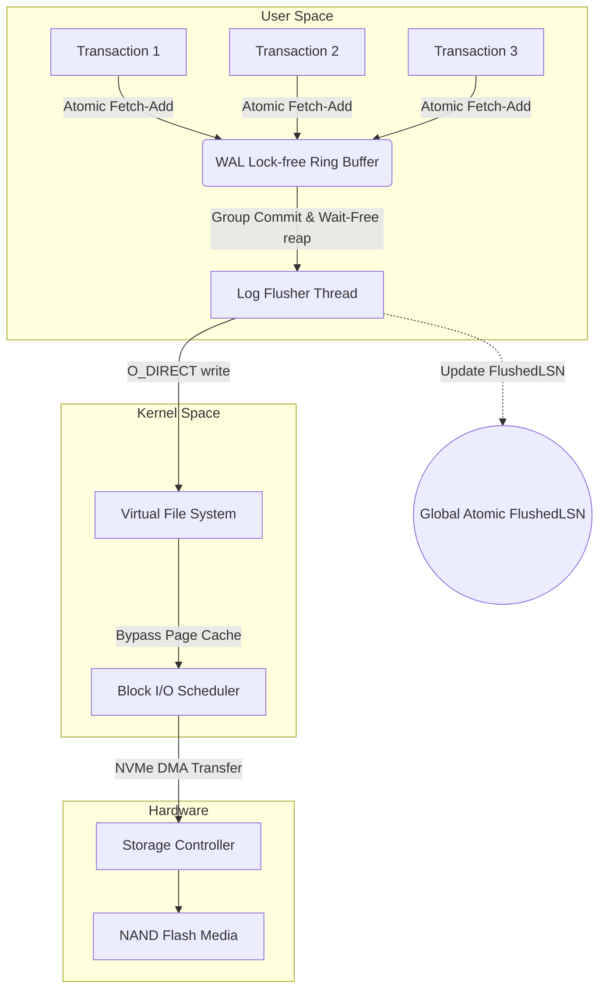
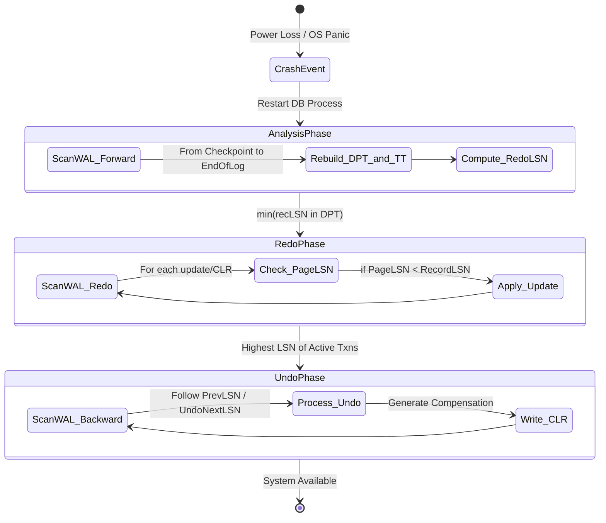

# 03: Write-Ahead Logging (WAL) và Thuật toán Phục hồi ARIES: Phân tích Chuyên sâu về Vi kiến trúc và Nền tảng Toán học

## Tóm tắt Điều hành & Tuyên bố Vấn đề

Bất kỳ ai từng vận hành một cơ sở dữ liệu ở quy mô sản xuất đều biết cảm giác này: điện mất giữa lúc hệ thống đang ghi, và câu hỏi duy nhất còn lại là dữ liệu có sống sót hay không. Đây chính là lý do write-ahead logging (WAL) tồn tại. Bài toán không hề mới - đảm bảo tính bền vững (Durability) của dữ liệu mà không phải hy sinh hiệu năng - nhưng nó vẫn là một trong những vấn đề khó nhất trong kỹ nghệ cơ sở dữ liệu. Khi RAM bốc hơi toàn bộ nội dung chưa kịp ghi, hệ thống phải khôi phục lại trạng thái chính xác đến từng byte, và làm điều đó mà không kéo tụt tốc độ xử lý hàng trăm nghìn giao dịch mỗi giây.

**Vấn đề cốt lõi:** ghi trực tiếp các cấu trúc dữ liệu phức tạp (như B+Tree) xuống đĩa vật lý tạo ra một lượng I/O ngẫu nhiên khổng lồ và không đảm bảo được tính nguyên tử (Atomicity). Nếu hệ thống sập giữa lúc đang ghi một trang dữ liệu, trang đó coi như hỏng hoàn toàn (Torn Page) - không có cách nào biết được nó dừng lại ở đâu.

Câu trả lời cho vấn đề này là kết hợp write-ahead logging với thuật toán phục hồi ARIES. Bài viết này đi sâu vào vi kiến trúc của WAL, các mô hình toán học đứng sau việc đồng bộ hóa đa luồng, lý thuyết hàng đợi của group commit, và các định lý hội tụ trạng thái trong ARIES - tất cả nhằm biến một bài toán phục hồi vốn hỗn loạn thành một chuỗi logic có thể chứng minh được. Phần cuối là những bài học rút ra cho việc thiết kế hạ tầng I/O.

## Cơ sở Lý thuyết và Kiến trúc Vi mô của Write-Ahead Logging (WAL)

Cơ sở dữ liệu quan hệ và các hệ thống lưu trữ phân tán hiện đại dựa vào write-ahead logging để đảm bảo hai tính chất trong ACID: Atomicity và Durability. Thay vì ghi trực tiếp các sửa đổi lên cấu trúc dữ liệu trên đĩa (B+Tree, Heap file...), hệ thống tuần tự hóa các thay đổi thành bản ghi nhật ký (log record) rồi chỉ thêm vào cuối (append-only) của luồng WAL.

Nguyên tắc nền tảng của WAL có thể phát biểu gọn: không một trang dữ liệu $P_i$ nào được phép xả (flush) từ buffer pool xuống thiết bị lưu trữ vật lý trừ khi bản ghi nhật ký đại diện cho lần sửa đổi cuối cùng trên trang đó đã được ghi bền vững xuống đĩa trước.

Gọi $LSN_{page}$ là Log Sequence Number của bản ghi cuối cùng cập nhật trang $P_i$, và $LSN_{flushed}$ là LSN lớn nhất đã được xả an toàn xuống ổ đĩa. Bất đẳng thức này phải luôn đúng tại mọi thời điểm vận hành:

$$ LSN_{page} \le LSN_{flushed} $$

### Cấu trúc và Ý nghĩa Toán học của Log Sequence Number (LSN)

Về mặt vật lý, một LSN thường là số nguyên không dấu 64-bit tăng đơn điệu. Nó đóng vai trò con trỏ định vị độ dời logic, chỉ ra vị trí tuyệt đối của bản ghi bên trong luồng WAL vật lý.

Mỗi bản ghi WAL mang theo các trường siêu dữ liệu:
1. **Transaction ID (TxID):** định danh giao dịch.
2. **Loại hoạt động (Type):** Insert, Update, Delete.
3. **Space ID và Page ID:** vị trí dữ liệu vật lý cư trú.
4. **Before-Image (Undo Log):** dữ liệu trước khi sửa đổi, dùng để rollback.
5. **After-Image (Redo Log):** dữ liệu sau khi sửa đổi, dùng để roll-forward.
6. **PrevLSN:** con trỏ trỏ về bản ghi trước đó của cùng giao dịch, tạo thành một danh sách liên kết ngược.

Chuỗi LSN áp đặt một trật tự tuyến tính, toàn cục lên mọi thao tác thay đổi trạng thái bên trong động cơ cơ sở dữ liệu. Nói cách khác, luồng WAL biến một hệ thống đa luồng vốn dĩ hỗn loạn thành một dãy trạng thái được sắp thứ tự chặt chẽ.

### Quản lý Đồng thời (Concurrency Control) tại cấp độ WAL Buffer

Khi các worker thread thực thi giao dịch song song, chúng cạnh tranh quyền ghi vào một vùng đệm trung gian trong user-space gọi là WAL Buffer. Đây là nút thắt cổ chai lớn nhất quyết định thông lượng tổng thể của hệ thống, nên việc quản lý đồng thời ở đây phải cực kỳ tối ưu.

Một thiết kế đơn giản dùng `std::mutex` toàn cục để bảo vệ WAL Buffer sẽ nghẹt CPU do lock contention ngay khi hệ thống chạm vài nghìn giao dịch mỗi giây. Cách giải quyết thực tế là cấp phát LSN không khóa (lock-free) bằng lệnh `fetch_add` nguyên tử của phần cứng.

Gọi $S_{record}$ là kích thước dự kiến của bản ghi sắp ghi vào. Luồng thực thi gọi lệnh phần cứng nguyên tử:

$$ LSN_{allocated} = \text{AtomicFetchAndAdd}(\text{Global\_LSN}, S_{record}) $$

Lệnh này trả về vị trí $LSN_{allocated}$ dành riêng cho luồng đó, trong một chu kỳ clock, mà không hề chặn các luồng khác. Sau đó luồng chỉ việc chép dữ liệu (memcpy) vào WAL Buffer tại độ dời tương ứng. Cấu trúc này - **Lock-free Ring Buffer** - là lý do các hệ thống như ScyllaDB và InnoDB đạt được thông lượng hàng trăm nghìn TPS.



### Thảm họa Torn Write và CRC32C Checksum

Ở tầng vật lý, việc xả WAL từ RAM xuống thiết bị lưu trữ (NVMe/SSD) đối mặt với một rủi ro cụ thể: Torn Write, hay còn gọi là sector tearing.

SSD chỉ đảm bảo ghi nguyên tử ở mức sector (512 byte hoặc 4096 byte). Khi cơ sở dữ liệu ghi một bản ghi nhật ký lớn hơn giới hạn nguyên tử này - ví dụ một log record 16KB - và mất điện xảy ra ngay giữa lúc phần cứng đang ghi, một phần bản ghi (chẳng hạn 4KB đầu) sẽ được lưu lại, còn phần còn lại vẫn là dữ liệu rác cũ.

Để phát hiện sự cố này, phần đầu mỗi bản ghi WAL luôn kèm theo một mã kiểm tra toàn vẹn tính bằng phần cứng, thường là **CRC32C (Castagnoli)**, bao trùm toàn bộ payload.

Việc kiểm tra CRC diễn ra nghiêm ngặt khi đọc lại nhật ký lúc phục hồi. Nếu:

$$ \text{CRC32C}(\text{ReadPayload}) \ne \text{StoredCRC} $$

hệ thống kết luận đã xảy ra Torn Write và từ chối xử lý bản ghi không hoàn thiện đó ngay lập tức. Điểm lỗi CRC chính là điểm kết thúc hợp lệ của luồng dữ liệu phục hồi.

```cpp
#include <atomic>
#include <cstdint>
#include <cstring>
#include <vector>
#include <nmmintrin.h> // For hardware CRC32 instruction (_mm_crc32_u64)

struct LogRecordHeader {
    uint64_t lsn;
    uint32_t txn_id;
    uint32_t payload_size;
    uint32_t crc32; // Mathematical integrity check
};

class WALManager {
private:
    std::atomic<uint64_t> current_lsn_{0};
    std::atomic<uint64_t> flushed_lsn_{0};
    uint8_t ring_buffer_[1024 * 1024 * 16]; // 16MB lock-free circular buffer
    
public:
    uint64_t AppendRecord(uint32_t txn_id, const std::vector<uint8_t>& data) {
        // Lock-free allocation of buffer space via hardware atomics
        uint32_t total_size = sizeof(LogRecordHeader) + data.size();
        uint64_t allocated_lsn = current_lsn_.fetch_add(total_size, std::memory_order_relaxed);
        
        LogRecordHeader header;
        header.lsn = allocated_lsn;
        header.txn_id = txn_id;
        header.payload_size = data.size();
        header.crc32 = CalculateHardwareCRC32(data.data(), data.size());
        
        // Copy header and payload into the ring_buffer_ using modulo arithmetic
        size_t offset = allocated_lsn % sizeof(ring_buffer_);
        // (Implementation handles wrapping around the edge of the ring buffer)
        
        return allocated_lsn;
    }

    void GroupCommit(uint64_t target_lsn) {
        // Wait-free check if the data has already been flushed by a concurrent thread
        if (flushed_lsn_.load(std::memory_order_acquire) >= target_lsn) {
            return; 
        }
        
        // Acquire internal mutex strictly for disk I/O coordination
        // Issue O_DIRECT write from ring_buffer_ down to physical NVMe
        // Update the global visibility of flushed data
        flushed_lsn_.store(target_lsn, std::memory_order_release);
    }

    uint32_t CalculateHardwareCRC32(const uint8_t* data, size_t length) {
        uint32_t crc = 0xFFFFFFFF;
        const uint64_t* ptr64 = reinterpret_cast<const uint64_t*>(data);
        size_t i = 0;
        
        // Exploit x86-64 SSE 4.2 instruction for massive throughput
        for (; i + 8 <= length; i += 8) {
            crc = _mm_crc32_u64(crc, *ptr64++);
        }
        // ... handle remaining bytes
        return crc ^ 0xFFFFFFFF;
    }
};
```

### Lý thuyết Hàng đợi và Tối ưu hóa Group Commit

Hiệu suất của hệ thống I/O không chỉ nằm ở mã nguồn - nó bị chi phối bởi hàm chi phí của việc tuần tự hóa và xả đĩa.

Ghi từng giao dịch riêng lẻ xuống đĩa (sync-on-commit) gây ra write amplification và lãng phí băng thông PCIe một cách vô ích. Để tránh độ trễ I/O tốn kém này, các động cơ lưu trữ dùng chiến lược **Group Commit**: cố ý chờ một khoảng thời gian ngắn ($T_{wait}$) để gom một nhóm giao dịch cùng hoàn tất việc ghi WAL, rồi mới phát sinh một lượt I/O duy nhất xuống đĩa.

Dưới góc nhìn lý thuyết hàng đợi (Queueing Theory), thông lượng hệ thống tỷ lệ nghịch với số lượng IOPS phải xử lý. Khi áp dụng Group Commit, mô hình hàng đợi chuyển từ $M/M/1$ sang xử lý theo lô $M/G/1$ (Bulk Service).

Giả sử thời gian nối log của một giao dịch là $t_{append\_i}$ và thời gian trễ khi xả xuống phần cứng là $t_{flush\_i}$. Tổng chi phí thời gian cho $N$ giao dịch riêng biệt là:

$$ Cost_{naive} = \sum_{i=1}^{N} (t_{append\_i} + t_{flush\_i}) $$

Khi áp dụng Group Commit cho cả khối $N$ giao dịch:

$$ Cost_{group} = \sum_{i=1}^{N} (t_{append\_i}) + t_{flush\_group} $$

Sự đánh đổi giữa độ trễ của một giao dịch đơn lẻ và thông lượng toàn cục là một bài toán tối ưu lồi. $T_{wait}$ quá lớn thì độ trễ giao dịch tăng vọt, ứng dụng dễ timeout. $T_{wait}$ quá nhỏ thì số lượng I/O tăng vọt, hệ thống phần cứng dễ sập. Các hệ thống như PostgreSQL tự động hiệu chỉnh ngưỡng Group Commit dựa trên băng thông đĩa đo được theo thời gian thực.

## Thuật toán Phục hồi ARIES: Phân tích Toán học và Khả năng Hội tụ

Trong giới thiết kế hệ thống phục hồi dữ liệu, **ARIES** (Algorithms for Recovery and Isolation Exploiting Semantics), do Tiến sĩ C. Mohan tại IBM công bố năm 1992, vẫn được xem là tiêu chuẩn tham chiếu. Ý tưởng cốt lõi của ARIES là "lặp lại lịch sử" (Repeating History), khai thác tính ngữ nghĩa logic của các thao tác dữ liệu.

ARIES được xây dựng trên hai nguyên lý:
* **No-Force:** không ép buộc xả dirty page xuống đĩa khi giao dịch commit (giảm I/O ngẫu nhiên).
* **Steal:** cho phép hệ thống đẩy một phần trang dữ liệu của một giao dịch *chưa* commit xuống đĩa, để giải phóng RAM khi cần.

Sự linh hoạt này kéo theo rủi ro dữ liệu trên đĩa bị sai lệch tạm thời. ARIES giải quyết bằng ba giai đoạn: Analysis (Phân tích), Redo (Tái lập) và Undo (Hoàn tác). Phần lõi nằm ở cách móc nối LSN và cấu trúc **Compensation Log Record (CLR)**, thứ đảm bảo quá trình phục hồi luôn hội tụ.



### Giai đoạn Phân tích (Analysis Phase)

Quá trình bắt đầu bằng việc đọc checkpoint hợp lệ gần nhất. Mục tiêu của pha này là tái tạo chính xác trạng thái bộ nhớ tại thời điểm ngay trước khi sập. Nó dựng lại hai cấu trúc:
1. **Transaction Table (TT):** danh sách giao dịch đang diễn ra cùng LSN cuối cùng của mỗi giao dịch.
2. **Dirty Page Table (DPT):** danh sách các trang đã bị thay đổi trong RAM nhưng chưa kịp xả xuống đĩa. Mỗi mục trong DPT giữ biến $recLSN$ - LSN của lần thay đổi đầu tiên khiến trang đó bị bẩn.

Bằng cách quét xuôi (forward scan) từ checkpoint đến cuối nhật ký, hệ thống bổ sung giao dịch mới vào TT và trang mới vào DPT. Từ đó nó tính ra một tham số then chốt: $RedoLSN$.

$$ RedoLSN = \min(\{recLSN \mid \text{page} \in DPT\}) $$

$RedoLSN$ là cận dưới của khoảng thời gian cần xét lại. Mọi bản ghi có LSN nhỏ hơn giá trị này chắc chắn đã được xả xuống đĩa, nên không cần đọc lại phần WAL cũ đó nữa - tiết kiệm đáng kể thời gian phục hồi.

```rust
struct DirtyPageEntry {
    page_id: u32,
    rec_lsn: u64, // The LSN of the first update that dirtied the page
}

struct TransactionEntry {
    txn_id: u32,
    last_lsn: u64,
    status: TransactionStatus, // Active, Committing, Aborted
}

fn analysis_phase(wal_iterator: &mut WalIterator, checkpoint_lsn: u64) -> (HashMap<u32, TransactionEntry>, HashMap<u32, DirtyPageEntry>, u64) {
    let mut transaction_table: HashMap<u32, TransactionEntry> = HashMap::new();
    let mut dirty_page_table: HashMap<u32, DirtyPageEntry> = HashMap::new();
    
    wal_iterator.seek(checkpoint_lsn);
    
    while let Some(record) = wal_iterator.next() {
        match record.record_type {
            RecordType::Update(page_id) => {
                transaction_table.entry(record.txn_id).or_insert(TransactionEntry {
                    txn_id: record.txn_id,
                    last_lsn: record.lsn,
                    status: TransactionStatus::Active,
                }).last_lsn = record.lsn;
                
                // Track the very first LSN that dirtied this page
                dirty_page_table.entry(page_id).or_insert(DirtyPageEntry {
                    page_id,
                    rec_lsn: record.lsn,
                });
            },
            RecordType::Commit => {
                transaction_table.get_mut(&record.txn_id).unwrap().status = TransactionStatus::Committing;
            },
            // ... other record types handling
        }
    }
    
    let redo_lsn = dirty_page_table.values().map(|entry| entry.rec_lsn).min().unwrap_or(u64::MAX);
    (transaction_table, dirty_page_table, redo_lsn)
}
```

### Giai đoạn Tái lập (Redo Phase) và Sự đảm bảo Idempotence

Nguyên tắc của ARIES ở pha này là "lặp lại lịch sử một cách mù quáng": hệ thống tái tạo chính xác từng trạng thái dữ liệu bất kể giao dịch đó rốt cuộc có commit hay bị abort hay không.

Hệ thống quét WAL từ điểm $RedoLSN$. Gặp một bản ghi Update, ARIES chạy qua ba phép kiểm tra để quyết định có cần tái lập thao tác này trên đĩa hay không:

1. **Kiểm tra DPT:** trang $P_x$ được nhắc đến trong bản ghi phải tồn tại trong DPT. Nếu không, trang này đã được xả an toàn xuống đĩa từ trước khi sập.
2. **Kiểm tra recLSN:** giá trị $recLSN$ của trang $P_x$ trong DPT phải nhỏ hơn hoặc bằng $LSN_{record}$.
3. **Kiểm tra PageLSN vật lý:** nếu hai điều kiện trên đều thỏa, hệ thống nạp trang $P_x$ từ đĩa lên và kiểm tra siêu dữ liệu của chính trang đó:
   $$ PageLSN \le LSN_{record} $$

Nếu $PageLSN$ (LSN in trên đĩa của trang) nhỏ hơn $LSN_{record}$, nghĩa là thay đổi này chưa từng được ghi xuống đĩa. Hệ thống áp dụng After-Image lên trang và cập nhật ngay $PageLSN = LSN_{record}$.

Việc đánh dấu $PageLSN$ hoạt động gần giống một logical clock, ngăn hoàn toàn việc tái lập trùng lặp. Đây chính là tính chất **Idempotence**: dù Redo Phase có bị chạy lại bao nhiêu lần do sập nguồn liên tiếp, trạng thái cuối cùng của cơ sở dữ liệu vẫn không bị hỏng.

### Giai đoạn Hoàn tác (Undo Phase) và Vai trò của CLR

Pha này rollback mọi tàn dư của các giao dịch chưa commit còn nằm trong TT (Active Transactions). Khác với hai pha trước, Undo quét ngược thời gian.

Hệ thống lấy LSN cao nhất từ TT và lùi dần theo chuỗi con trỏ $PrevLSN$. Điểm hay trong thiết kế ARIES nằm ở chỗ: mỗi bước Undo lại sinh ra một bản ghi **CLR (Compensation Log Record)** mới.

Khi áp dụng Before-Image để hoàn tác một thao tác, ARIES ghi một $CLR_i$ mới xuống WAL, mang theo một con trỏ đặc biệt:

$$ UndoNextLSN = PrevLSN(U_i) $$

Bất biến này đảm bảo **hội tụ hữu hạn (Finite Convergence)**: nếu hệ thống sập lần 2, lần 3 ngay trong lúc đang Undo, lần khôi phục kế tiếp sẽ gặp các CLR đã được ghi lại từ trước. Nó sẽ không cố Undo một thao tác đã được Undo rồi - mà nhảy thẳng theo $UndoNextLSN$ để bỏ qua các hành động đã hoàn tác.

Nhờ vậy, chu trình phục hồi trở thành một đồ thị không có vòng lặp (cycle-free), luôn tiến về trạng thái toàn vẹn chứ không bao giờ kẹt trong một vòng hoàn tác vô tận.

## Kiến trúc Đệm, Tương tác OS và Bài toán NUMA

Ở tốc độ hàng triệu giao dịch, việc duy trì WAL trở thành một cuộc tương tác sâu với kernel OS và thiết kế đường dẫn lưu trữ.

Các lời gọi POSIX như `write()` mặc định đổ dữ liệu vào OS Page Cache. Một kernel panic sẽ xóa sạch toàn bộ dữ liệu WAL còn nằm trong cache đó. `fsync()` hoặc `fdatasync()` được sinh ra để ép kernel đẩy dữ liệu bẩn xuống đĩa, nhưng chúng tốn kém vì phải khóa i-node và đồng bộ metadata.

Giải pháp triệt để hơn là dùng cờ **O_DIRECT**. Cờ này bỏ qua hoàn toàn OS Page Cache, mở một đường DMA (Direct Memory Access) để WAL Buffer tương tác thẳng với hệ thống con Block IO và NVMe. Với O_DIRECT, cơ sở dữ liệu loại bỏ được hiện tượng CPU jittering và các đợt khóa ngẫu nhiên từ Kernel Flusher Threads.

Đổi lại, O_DIRECT đòi hỏi bộ nhớ user-space phải được căn chỉnh theo kích thước block (ví dụ 4KB), nên phải dùng `posix_memalign()` thay vì `malloc()`.

### Bức tường NUMA và Partitioned WAL

Một vấn đề khác là NUMA. Trên các máy multi-socket, truy xuất RAM thuộc NUMA node lân cận chậm hơn hẳn. Thiết kế WAL Buffer thành một Ring Buffer tập trung duy nhất sẽ gây ra hiện tượng **Cache Line Bouncing**: các lõi CPU rải rác liên tục tranh nhau cập nhật con trỏ Tail, buộc hệ thống phải giải quyết giao thức MESI qua bus QPI/UPI, kéo tụt thông lượng.

Cách khắc phục là dùng **Thread-Local WAL Buffers** hoặc **Partitioned WAL Buffers**, mỗi nhóm luồng sở hữu một rãnh log riêng. Khi các rãnh này đầy, một luồng Flusher trung tâm chịu trách nhiệm sắp xếp (sorting) và hợp nhất LSN trước khi ép I/O xuống SSD. Bài toán giữ tính toàn cục của thứ tự LSN trong một hệ thống phân mảnh như vậy luôn đi kèm đánh đổi không nhỏ.

### ZNS NVMe: Đồng thiết kế Phần cứng và Phần mềm

Tuổi thọ NAND Flash trong môi trường ghi WAL cường độ cao (ghi nối đuôi từng cụm nhỏ liên tục) luôn là mối lo do **Write Amplification Factor (WAF)**. SSD controller phải chạy garbage collection tốn kém để dọn không gian WAL cũ đã bị truncate/trim.

Các chuẩn phần cứng mới như **Zoned Namespaces (ZNS)** NVMe cho phép cơ sở dữ liệu ra lệnh trực tiếp cho thiết bị lưu trữ quản lý các vùng (zone) theo quy tắc chỉ ghi tuần tự, loại bỏ hoàn toàn garbage collector của firmware. Khi tệp WAL trên ZNS không còn cần thiết (checkpoint đã an toàn), hệ thống chỉ cần Reset Zone - lấy lại băng thông ngay lập tức mà không hao mòn write cycle nào.

Đường đi từ lý thuyết ARIES của thập niên 90 đến chuẩn ZNS NVMe hôm nay là một minh chứng rõ ràng cho triết lý đồng thiết kế phần cứng - phần mềm, nơi những mô hình toán học trừu tượng nhất cuối cùng lại được khắc thẳng lên silicon.

## Bài Học Kinh Nghiệm (Lessons Learned)

Dành cho các kỹ sư xây dựng hệ thống lưu trữ có độ tin cậy cao:
1. **Thiết kế lock-free là bắt buộc:** trong hệ thống đa luồng, việc cấp phát LSN phải qua Atomic Compare-And-Swap của phần cứng. Dùng mutex cho WAL Buffer sẽ phá hỏng khả năng mở rộng của CPU.
2. **Đừng tin phần cứng một cách mù quáng:** torn write luôn có thể xảy ra. Tích hợp CRC32C bằng vi lệnh SSE/AVX là lớp phòng thủ thực tế nhất chống lại hỏng hóc vật lý.
3. **Idempotence là yếu tố sống còn của phục hồi:** mọi thao tác Redo/Undo phải lặp lại được vô hạn lần thông qua PageLSN và CLR. Sập nguồn ngay giữa lúc phục hồi không được phép làm hỏng cơ sở dữ liệu thêm lần nữa.
4. **Bỏ qua kernel khi cần:** để đạt độ trễ dưới mili-giây và tính tất định cao, hãy xây kiến trúc I/O quanh O_DIRECT và io_uring, bỏ qua OS Page Cache.
5. **Gom nhóm I/O (Group Commit):** đừng bao giờ sync đĩa cho từng giao dịch riêng lẻ. Dùng hàng đợi để gộp nhiều thao tác ghi lại, tận dụng băng thông PCIe và giảm chi phí IOPS.
