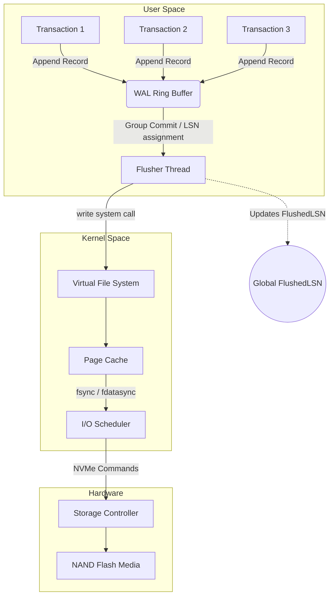
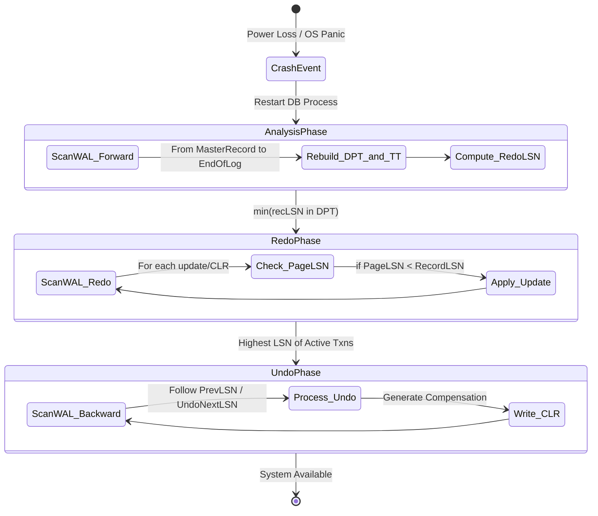
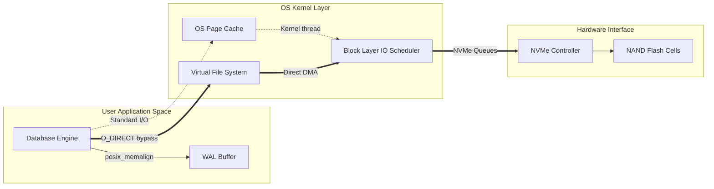

# Write-Ahead Logging (WAL) và Thuật toán phục hồi ARIES: Kiến trúc Vi mô và Cơ sở Toán học

## 1. Cơ sở Lý thuyết và Kiến trúc Vi mô của Write-Ahead Logging (WAL)

Cơ sở dữ liệu quan hệ và các hệ thống lưu trữ phân tán hiện đại dựa vào Write-Ahead Logging (WAL) như một nền tảng kiến trúc vi mô không thể thay thế để đảm bảo hai tính chất cốt lõi trong định lý ACID là tính nguyên tử (Atomicity) và tính bền vững (Durability). Thay vì ghi trực tiếp các sửa đổi trạng thái dữ liệu lên các cấu trúc dữ liệu trên đĩa (như B-Tree hoặc Heap files), hệ thống sẽ tuần tự hóa các thay đổi này thành các bản ghi nhật ký (log records) và chỉ thêm vào cuối (append-only) của tệp WAL. Nguyên tắc tối thượng của WAL được phát biểu toán học một cách chặt chẽ: không một trang dữ liệu $P_i$ nào được phép xả (flush) từ bộ nhớ đệm (Buffer Pool) xuống thiết bị lưu trữ vật lý trừ khi bản ghi nhật ký đại diện cho sự thay đổi cuối cùng trên trang đó đã được đảm bảo tính bền vững trên đĩa. Gọi $LSN_{page}$ là Log Sequence Number của bản ghi cuối cùng cập nhật trang $P_i$ và $LSN_{flushed}$ là LSN lớn nhất đã được xả an toàn xuống đĩa, bất đẳng thức $LSN_{page} \le LSN_{flushed}$ bắt buộc phải luôn đúng trong mọi thời điểm vận hành của hệ thống.

Cấu trúc vật lý của một Log Sequence Number (LSN) thường là một số nguyên không dấu 64-bit, hoạt động như một con trỏ định tuyến độ dời logic (logical offset pointer) chỉ định vị trí tuyệt đối của bản ghi nhật ký bên trong luồng WAL vật lý. Mỗi bản ghi WAL bao bọc các siêu dữ liệu cấu trúc như định danh giao dịch (Transaction ID), loại hoạt động (Insert, Update, Delete), định danh bảng và trang vật lý, cùng với hai cấu phần trọng yếu là Before-Image (dữ liệu trước sửa đổi, dùng cho việc hoàn tác) và After-Image (dữ liệu sau sửa đổi, dùng cho việc tái lập). Việc tuần tự hóa chuỗi LSN tạo ra một trật tự thời gian tuyến tính và tổng quát (total global order) đối với mọi thao tác đột biến trạng thái (state mutation) bên trong động cơ cơ sở dữ liệu. Khi các luồng công việc (worker threads) thực thi giao dịch, chúng cạnh tranh quyền ghi dữ liệu vào một cấu trúc bộ đệm trung gian trong không gian bộ nhớ người dùng (User-space Memory) gọi là WAL Buffer. Việc quản lý đồng thời (concurrency control) tại cấp độ WAL Buffer đòi hỏi các kỹ thuật vi kiến trúc tối ưu như vòng lặp khóa không đồng bộ (lock-free ring buffers) và các thao tác Compare-And-Swap (CAS) cấp độ phần cứng để cực tiểu hóa độ trễ tuần tự hóa, bởi lẽ đây là nút thắt cổ chai (bottleneck) nghiêm trọng nhất đối với thông lượng (throughput) tổng thể của hệ thống.



Dưới góc độ vật lý và hệ điều hành, quá trình xả WAL (WAL flushing) từ bộ đệm trên RAM xuống thiết bị lưu trữ phi biến đổi (Non-Volatile Storage) đối mặt với thách thức to lớn mang tên Torn Write hay Sector Tearing. Một đĩa cứng truyền thống (HDD) hoặc ổ cứng trạng thái rắn (SSD) cung cấp khả năng ghi nguyên tử (atomic write) tại mức đơn vị cung từ (sector size) tối thiểu là 512 bytes hoặc 4096 bytes. Khi cơ sở dữ liệu phát lệnh ghi nhật ký có kích thước vượt quá giới hạn nguyên tử của phần cứng, hoặc lệnh ghi bị gián đoạn do mất điện đột ngột tại mức vi giây, một phần bản ghi WAL có thể đã được lưu trữ trong khi phần còn lại chứa dữ liệu rác, dẫn đến tính trạng hỏng hóc cấu trúc chuỗi LSN. Do vậy, phần đầu của mỗi khối WAL (WAL block) thường được bổ sung mã kiểm tra độ toàn vẹn bằng hàm băm mật mã (Checksum/CRC32C) bao trùm toàn bộ payload. Quá trình kiểm tra CRC được diễn ra nghiêm ngặt khi đọc nhật ký trong giai đoạn phục hồi; nếu $CRC(ReadPayload) \ne StoredCRC$, hệ thống kết luận một sự kiện Torn Write đã diễn ra và từ chối xử lý bản ghi nhật ký không hoàn thiện đó, xem như điểm kết thúc logic của luồng dữ liệu phục hồi.

```cpp
#include <atomic>
#include <cstdint>
#include <cstring>
#include <vector>

struct LogRecord {
    uint64_t lsn;
    uint32_t txn_id;
    uint32_t payload_size;
    uint32_t crc32;
    std::vector<uint8_t> payload;
};

class WALManager {
private:
    std::atomic<uint64_t> current_lsn_{0};
    std::atomic<uint64_t> flushed_lsn_{0};
    uint8_t ring_buffer_[1024 * 1024 * 16]; // 16MB lock-free buffer
    uint32_t head_{0};
    uint32_t tail_{0};

public:
    uint64_t AppendRecord(uint32_t txn_id, const std::vector<uint8_t>& data) {
        uint64_t allocated_lsn = current_lsn_.fetch_add(data.size() + sizeof(LogRecord), std::memory_order_relaxed);
        LogRecord record;
        record.lsn = allocated_lsn;
        record.txn_id = txn_id;
        record.payload_size = data.size();
        record.payload = data;
        record.crc32 = CalculateCRC32(data.data(), data.size());
        
        // Pseudo-implementation: Copy record to ring_buffer_ using CAS for head/tail management
        return allocated_lsn;
    }

    void GroupCommit(uint64_t target_lsn) {
        if (flushed_lsn_.load(std::memory_order_acquire) >= target_lsn) {
            return; // Already flushed by another thread
        }
        // Acquire internal mutex for disk I/O
        // Write ring buffer from tail_ up to target_lsn to file descriptor
        // Call fsync()
        flushed_lsn_.store(target_lsn, std::memory_order_release);
    }

    uint32_t CalculateCRC32(const uint8_t* data, size_t length) {
        // Implementation of hardware accelerated CRC32 instruction (e.g., _mm_crc32_u64)
        return 0; // Placeholder
    }
};
```

Bên cạnh giới hạn vật lý, hiệu suất hệ thống được định hình bởi hàm chi phí cho hoạt động tuần tự hóa và xả đĩa (I/O flushing). Để chống lại độ trễ I/O tốn kém, các động cơ kiến trúc áp dụng chiến lược Group Commit (Gom nhóm xả). Kỹ thuật này cố ý thiết lập các vòng lặp trễ vi mô (microsecond delays) hoặc tận dụng cơ chế thông báo báo hiệu trạng thái luồng (thread condition variables) nhằm chờ đợi một số lượng giao dịch nhất định cùng hoàn thành thao tác thêm WAL. Khi số lượng chạm ngưỡng, hệ thống phát sinh một lệnh gọi hệ thống (system call) như `fdatasync()` duy nhất xuống nhân hệ điều hành. Dưới góc độ giải tích, hàm thông lượng của hệ thống tỷ lệ nghịch với số lượng thao tác I/O trên giây (IOPS). Khi áp dụng Group Commit, tổng chi phí thời gian cho $N$ giao dịch giảm từ $\sum_{i=1}^{N} (t_{append\_i} + t_{fsync\_i})$ xuống còn $\sum_{i=1}^{N} (t_{append\_i}) + t_{fsync\_group}$. Sự đánh đổi giữa độ trễ của một giao dịch đơn lẻ (Latency) và thông lượng toàn cục (Throughput) là một bài toán tối ưu lồi (convex optimization), nơi hệ thống tự động hiệu chỉnh (auto-tuning) ngưỡng Group Commit dựa trên băng thông đĩa hiện tại và tỷ lệ đến của các truy vấn (arrival rate) theo lý thuyết hàng đợi (queueing theory).

## 2. Thuật toán Phục hồi ARIES: Phân tích Toán học và Chi tiết Thực thi

Trong trường phái kiến trúc hệ thống phục hồi dữ liệu, ARIES (Algorithms for Recovery and Isolation Exploiting Semantics) được công nhận rộng rãi là tiêu chuẩn vàng (gold standard) nhờ thiết kế hoàn hảo xoay quanh mô hình lặp lại lịch sử (Repeating History) và việc khai thác tính ngữ nghĩa logic của các thao tác dữ liệu. Phát triển từ nguyên lý No-Force (không buộc xả dữ liệu trang xuống đĩa khi commit) và Steal (cho phép ghi đè một phần trang dữ liệu của một giao dịch chưa commit xuống đĩa), ARIES cung cấp khả năng khai thác tối đa tài nguyên bộ đệm Buffer Pool mà vẫn bảo đảm sự nhất quán ACID thông qua một quy trình ba giai đoạn nghiêm ngặt: Analysis (Phân tích), Redo (Tái lập) và Undo (Hoàn tác). Trái tim của ARIES nằm ở thiết kế móc xích LSN phức tạp, nơi mọi bản ghi WAL thuộc về một giao dịch được liên kết bởi cấu trúc danh sách liên kết ngược qua con trỏ $PrevLSN$. Quan trọng hơn, đối với quá trình Undo, ARIES giới thiệu bản ghi Compensation Log Record (CLR), đóng vai trò xác nhận một thao tác hoàn tác vật lý đã hoàn thành. Điểm tinh tế của CLR là nó cũng được cung cấp một LSN, và nó chứa một con trỏ $UndoNextLSN$ trỏ ngược lại bản ghi cần được hoàn tác tiếp theo của giao dịch đó. Cấu trúc liên kết đệ quy này đảm bảo tính hội tụ hữu hạn (finite convergence) của quy trình phục hồi, loại trừ hoàn toàn khả năng lặp vô hạn nếu hệ thống liên tục gặp sự cố khởi động lại và sụp đổ ngay trong lúc đang tiến hành quá trình Undo.



Giai đoạn đầu tiên, Giai đoạn Phân tích (Analysis Phase), khởi động bằng việc đọc điểm kiểm tra hợp lệ gần nhất (Checkpoint) được lưu ở Master Record. Mục tiêu toán học của pha này là tái cấu trúc chính xác trạng thái không gian bộ nhớ thời điểm trước sự cố (Crash point), đặc biệt là tái tạo hai cấu trúc dữ liệu quan trọng: Transaction Table (Bảng giao dịch - TT) lưu các giao dịch đang diễn ra cùng LSN cuối cùng của chúng, và Dirty Page Table (Bảng trang bẩn - DPT) theo dõi danh sách các trang đã bị thay đổi trong RAM nhưng chưa kịp xả xuống đĩa. Bằng cách quét xuôi (forward scan) từ Checkpoint cho đến điểm cuối của nhật ký (End of Log), hệ thống sẽ bổ sung các giao dịch mới vào TT và các trang mới thay đổi vào DPT. Quá trình quét này cho phép hệ thống xác định điểm LSN cổ nhất trong DPT, được gọi là $RedoLSN$. Giá trị $RedoLSN = \min(\{recLSN \mid \text{page} \in DPT\})$ thiết lập cận dưới (lower bound) tuyệt đối của không gian thời gian mà tại đó hệ thống có nguy cơ mất dấu lịch sử trạng thái trang vật lý. Về mặt lý thuyết đồ thị, quá trình quét trong giai đoạn phân tích là việc tái xây dựng cấu trúc của tập hợp các nút (pages) và các cạnh định hướng (transactions modifications) đại diện cho biểu đồ phụ thuộc trạng thái của hệ thống.

```rust
struct DirtyPageEntry {
    page_id: u32,
    rec_lsn: u64, // The LSN of the first update that dirtied the page
}

struct TransactionEntry {
    txn_id: u32,
    last_lsn: u64,
    status: TransactionStatus, // Active, Committing, Aborted
}

fn analysis_phase(wal_iterator: &mut WalIterator, checkpoint_lsn: u64) -> (HashMap<u32, TransactionEntry>, HashMap<u32, DirtyPageEntry>, u64) {
    let mut transaction_table: HashMap<u32, TransactionEntry> = HashMap::new();
    let mut dirty_page_table: HashMap<u32, DirtyPageEntry> = HashMap::new();
    
    wal_iterator.seek(checkpoint_lsn);
    
    while let Some(record) = wal_iterator.next() {
        match record.record_type {
            RecordType::Update(page_id) => {
                transaction_table.entry(record.txn_id).or_insert(TransactionEntry {
                    txn_id: record.txn_id,
                    last_lsn: record.lsn,
                    status: TransactionStatus::Active,
                }).last_lsn = record.lsn;
                
                dirty_page_table.entry(page_id).or_insert(DirtyPageEntry {
                    page_id,
                    rec_lsn: record.lsn,
                });
            },
            RecordType::Commit => {
                transaction_table.get_mut(&record.txn_id).unwrap().status = TransactionStatus::Committing;
            },
            RecordType::End => {
                transaction_table.remove(&record.txn_id);
            },
            _ => {}
        }
    }
    
    let redo_lsn = dirty_page_table.values().map(|entry| entry.rec_lsn).min().unwrap_or(u64::MAX);
    (transaction_table, dirty_page_table, redo_lsn)
}
```

Chuyển tiếp qua Giai đoạn Tái lập (Redo Phase), triết lý của ARIES thể hiện qua sự mù quáng lặp lại lịch sử (blind history repeating), tái tạo chính xác từng trạng thái của dữ liệu bất kể giao dịch đó đã được Commit hay Abort trước khi sập. Hệ thống bắt đầu quét WAL từ điểm khởi thủy $RedoLSN$ do pha Analysis cung cấp. Khi gặp một bản ghi loại Update hoặc CLR, ARIES tiến hành một tập hợp các phép thử boolean nghiêm ngặt để xác định xem liệu có cần thiết phải tái lập hoạt động này trên thiết bị đĩa vật lý hay không. Điều kiện cần để thực thi thao tác Redo được cấu trúc bởi biểu thức logic ba thành phần. Thứ nhất, trang dữ liệu $P_x$ được đề cập trong bản ghi WAL phải tồn tại bên trong Dirty Page Table. Thứ hai, giá trị $recLSN$ của trang $P_x$ lưu trữ trong DPT phải nhỏ hơn hoặc bằng giá trị $LSN$ của bản ghi WAL đang xét ($recLSN \le LSN_{record}$). Nếu cả hai điều kiện trên thỏa mãn, hệ thống buộc phải nạp (fetch) trang $P_x$ từ thiết bị lưu trữ lên bộ nhớ đệm Buffer Pool. Điểm kiểm chứng cuối cùng và quan trọng nhất được áp dụng bằng cách quan sát siêu dữ liệu ngay trên chính trang vừa nạp: nếu $PageLSN \le LSN_{record}$, thì chắc chắn rằng sự thay đổi vật lý biểu thị bởi bản ghi WAL đã bị mất, do đó hệ thống sẽ đắp (apply) After-Image lên trang, và ngay lập tức cập nhật $PageLSN$ mới bằng với $LSN_{record}$. Việc đánh dấu $PageLSN$ có bản chất như một vector đồng hồ logic (logical clock vector), ngăn chặn triệt để sự cố tái lập trùng lặp (idempotency violation).

Giai đoạn cuối cùng là Hoàn tác (Undo Phase), tiến hành rà soát để khôi phục lại (rollback) mọi tàn dư của các giao dịch chưa được đánh dấu là Commit trong Transaction Table (còn gọi là danh sách Active hoặc In-flight Transactions). Khác với hai giai đoạn trước quét xuôi, quá trình Undo thực hiện duyệt ngược thời gian (backward traversal). Hệ thống lựa chọn LSN cao nhất từ Transaction Table (thuộc bất kỳ giao dịch active nào) và dịch chuyển lùi từng bước về quá khứ theo chuỗi con trỏ $PrevLSN$. Sự ưu việt toán học trong thiết kế ARIES bộc lộ khi quá trình Undo phát sinh ra bản ghi CLR. Gọi $U_i$ là một bản ghi cập nhật vật lý cần được hoàn tác, khi hệ thống áp dụng Before-Image của $U_i$ để xóa bỏ tác động của giao dịch, nó sẽ ghi một bản ghi $CLR_i$ mới xuống WAL. $CLR_i$ được đánh gán một con trỏ $UndoNextLSN = PrevLSN(U_i)$. Cấu trúc bất biến logic (logical invariant) ở đây đảm bảo rằng: nếu hệ thống tiếp tục sụp đổ lần thứ hai, lần thứ ba trong lúc đang nỗ lực hoàn tác, tiến trình Undo ở lần khôi phục tiếp theo sẽ đơn giản bỏ qua các hành động đã được Undo (bằng cách nhìn thấy các CLR đã ghi nhận), và nhảy cóc đệ quy về quá khứ theo đường dẫn của $UndoNextLSN$ thay vì liên tục hoàn tác lại một hoạt động đã được xử lý. Chu kỳ hội tụ trạng thái phục hồi trở thành một đồ thị vòng quay bất khả nghịch (irreversible cycle-free graph), tiết kiệm chu kỳ vi xử lý CPU cực lớn và đạt độ tin cậy tuyệt đối.

## 3. Tối ưu hóa I/O, Quản lý Bộ nhớ Hệ điều hành và Giới hạn Phần cứng

Khi hệ thống cơ sở dữ liệu làm việc ở tốc độ hàng triệu giao dịch mỗi giây, quá trình duy trì WAL không chỉ là vấn đề ở thuật toán cấu trúc dữ liệu, mà chuyển sang cuộc chiến tương tác sâu với Kernel OS và thiết kế đường dẫn lưu trữ (Storage Data Path) trên phần cứng. Theo mặc định, các lời gọi POSIX API như `write()` sẽ đổ dữ liệu vào OS Page Cache trong không gian của Kernel, thay vì áp dụng trực tiếp xuống đĩa từ vật lý. Điều này ngụ ý rằng, mặc dù tiến trình User-Space ghi nhận đã cấp phát lệnh thành công, một cơn hoảng loạn hệ điều hành (Kernel Panic) lập tức khiến toàn bộ dữ liệu WAL mất đi mãi mãi. Do đó, lời gọi `fsync()` hoặc `fdatasync()` được sinh ra để ép Kernel đẩy chuỗi byte dữ liệu bẩn (dirty bytes) qua tầng Block Layer xuống đến bộ nhớ Cache thiết bị (Drive Controller Cache). Tuy nhiên, `fsync()` chịu chi phí vô cùng đắt đỏ do phải khóa các cấu trúc i-node và đồng bộ mọi thay đổi về Metadata (kích thước file, quyền sở hữu, nhãn thời gian ctime/mtime).

Giải pháp triệt để mà các cơ sở dữ liệu tầm cỡ doanh nghiệp (như PostgreSQL, InnoDB) triển khai là O_DIRECT. Cờ `O_DIRECT` được truyền vào trong hàm gọi `open()`, tạo ra một đặc quyền loại bỏ hoàn toàn hệ thống OS Page Cache, mở một đường hầm truyền tin (DMA Pipeline - Direct Memory Access) cho phép Buffer Pool của tiến trình tương tác thẳng vào hệ thống con I/O Scheduler và giao tiếp PCIe của thiết bị NVMe. Với O_DIRECT, cơ sở dữ liệu tự mình gánh chịu mọi logic về bộ nhớ đệm, do L1/L2 Page Cache của OS không còn hiện diện, bù lại, nó loại bỏ hiện tượng nhiễu giật CPU (CPU jittering) và các đợt khóa (locking events) ngẫu nhiên của Kernel Flusher Threads (như pdflush). Khi vận hành WAL Buffer bằng O_DIRECT, bộ nhớ của User-space cũng bắt buộc phải được căn chỉnh giới hạn biên bộ nhớ (Memory Boundary Alignment) theo kích thước Block của thiết bị lưu trữ vật lý (như $4KB$ hoặc $512B$), yêu cầu các hàm cấp phát bộ nhớ tùy chỉnh thay vì `malloc()` truyền thống, chẳng hạn như `posix_memalign()`. Điều này tạo ra một lớp kiến trúc vô cùng hà khắc nhưng là con đường duy nhất để chạm đến giới hạn lý thuyết vật lý (theoretical hardware limits).



Ngoài ra, hình thái bộ nhớ không đồng nhất (Non-Uniform Memory Access - NUMA) là một vấn đề hóc búa đối với WAL. Khi phần cứng đa vi xử lý (Multi-socket CPU architecture) được triển khai, thời gian truy xuất vào vùng RAM thuộc Node NUMA lân cận chậm hơn nhiều so với RAM nội vùng. Thiết kế WAL Buffer thành một cấu trúc Ring Buffer tập trung duy nhất bằng Mutex sẽ lập tức tạo ra hiện tượng Cache Line Bouncing, khi các lõi vi xử lý nằm rải rác trên các Socket khác nhau cạnh tranh quyền thay đổi biến con trỏ Tail của Buffer, buộc hệ thống giải quyết giao thức MESI liên kết qua bus QPI (QuickPath Interconnect). Các kiến trúc cơ sở dữ liệu tiên phong giải bài toán này bằng cách triển khai Thread-Local WAL Buffers hoặc Partitioned WAL Buffers, ở đó mỗi một nhóm luồng công việc sở hữu một rãnh ghi log độc lập. Khi các rãnh này đạt đến trạng thái bão hòa, một luồng Flusher trung tâm chịu trách nhiệm phân loại (Sorting) và hợp nhất LSN (Merge) trước khi ép I/O vật lý xuống SSD. Tuy nhiên, bài toán tổng quát về việc bảo đảm tính toàn cục nghiêm ngặt (strict serialization) của tổng thể LSN trong các hệ thống WAL phân mảnh vẫn là một vấn đề chưa có đáp án hoàn mỹ, mang đến sự đánh đổi khốc liệt về mặt thuật toán.

Cuối cùng, tuổi thọ của bộ nhớ NAND Flash trong môi trường cường độ WAL (với đặc tính chỉ ghi nối đuôi ngẫu nhiên từng cụm nhỏ) luôn là mối bận tâm đối với ổ cứng thể rắn SSD. Hoạt động ghi đè LSN và thao tác TRIM phát sinh từ việc thu hồi các phần WAL đã cũ gây ra hiện tượng Write Amplification Factor (WAF) ở cấp độ ổ cứng vật lý. SSD Controller phải thực hiện quy trình Garbage Collection đắt đỏ, liên tục di chuyển khối dữ liệu rác để chuẩn bị dọn dẹp không gian. Các giao thức phần cứng thế hệ mới như Zoned Namespaces (ZNS) NVMe cho phép cơ sở dữ liệu trực tiếp ra lệnh cho thiết bị lưu trữ quản lý các Vùng lưu trữ (Zones) theo tính chất Sequential-Write-Only, hoàn toàn loại bỏ Garbage Collector của thiết bị Firmware cấp thấp. Khi WAL tệp trên ZNS bị loại bỏ (do Checkpoint đã an toàn), hệ thống cơ sở dữ liệu đơn giản ra lệnh Reset Zone, trả lại ngay lập tức băng thông lý tưởng mà không làm tiêu hao tuổi thọ Write Cycles của phần cứng. Sự tiến hóa liên kết liền mạch từ lý thuyết ARIES của thập niên 90 tới chuẩn ZNS NVMe thế kỷ 21 này là minh chứng rực rỡ nhất cho triết lý đồng thiết kế (Co-design) giữa phần cứng và phần mềm, nơi những định lý hình thức nhất được triển khai lên trên các phiến silicon nhỏ bé.

## Tài liệu SEO Tối ưu Hóa

*   **Meta Title:** Kiến trúc Vi mô WAL và Thuật toán Phục hồi ARIES Chuyên sâu
*   **Meta Description:** Khám phá cấu trúc vi mô của Write-Ahead Logging (WAL) và thuật toán phục hồi ARIES. Phân tích toán học về LSN, Checkpoint, O_DIRECT và tối ưu phần cứng ZNS NVMe.
*   **Keywords:** Write-Ahead Logging, WAL, Thuật toán ARIES, Hệ quản trị cơ sở dữ liệu, Kiến trúc vi mô C++, Phục hồi ACID, NVMe ZNS, O_DIRECT.
*   **Target Audience:** Staff Engineers, Database Architects, Systems Programmers, Computer Science Researchers.
*   **Reading Level:** Advanced/Academic.
