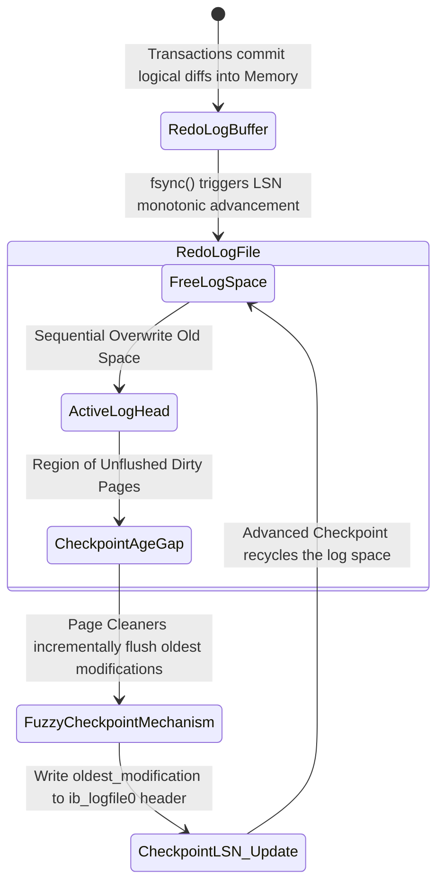

# Anatomy of InnoDB Architecture: Page Flushes, Checkpoints, and the Doublewrite Buffer at the Limits of Hardware

## Executive Summary & Problem Statement

Any large-scale MySQL deployment eventually runs into the same wall: how do you guarantee full ACID durability while still pushing enough I/O throughput to keep up with production traffic? It's an old problem, but it never gets easier, because it sits at the exact seam between the speed of storage media and the speed of the CPU clock.

To hide physical access latency — which is thousands to millions of times slower than an L1/L2 cache hit — MySQL's InnoDB storage engine builds an elaborate virtualized memory space called the **Buffer Pool**. The catch is that keeping data in RAM introduces its own risk: RAM is volatile. A power drop or a kernel panic can turn every "committed" transaction into a potential loss.

Built on top of the ARIES recovery model, InnoDB runs a closed loop coordinated by three mechanisms:
1. **Adaptive Page Flushing** — rotating and freeing RAM resources without causing I/O shocks.
2. **Fuzzy Checkpointing** — managing the redo log lifecycle and keeping recovery time bounded.
3. **Doublewrite Buffer** — guarding against physical data fragmentation (torn pages) at the block-device layer.

This piece walks through InnoDB's micro-architecture: the resource-limit models, the self-tuning PID-style flushing algorithm, and the hardware I/O consequences of it all. Along the way we look at how InnoDB (5.7 through 8.0+) talks directly to NVMe drives via `O_DIRECT`, bypassing the OS page cache to squeeze out the last bit of throughput.

---

## Micro-Architecture of Buffer Pool Management and the Multi-Core Contention Problem

InnoDB carves available RAM into fixed-size pages, 16KB by default — a size chosen to line up well with the branching factor of the B+Tree structures used in clustered indexes.

### The Multi-Dimensional Linked Structure of the Buffer Pool

At runtime, the Buffer Pool isn't just a flat byte array — it's a network of linked lists, each protected by its own latches and mutexes.
1. **Free List:** holds empty page frames ready to receive data loaded from disk.
2. **LRU List:** manages pages currently holding data, clean or dirty. InnoDB uses a variant of LRU called the Midpoint Insertion Strategy, splitting the list into a *New Sublist* (5/8 of capacity) and an *Old Sublist* (3/8). Pages freshly read by a full table scan land in the Old Sublist first and get evicted quickly if nothing touches them again — this is what keeps a big scan from wiping out your cache.
3. **Flush List:** a doubly linked structure ordering dirty pages strictly by their oldest modification LSN.

### The Buffer Pool Mutex Bottleneck

Once the system is juggling tens of thousands of concurrent connections, threads touching these lists need locking (a Buffer Pool Mutex). In MySQL 5.5 and earlier, one global mutex guarded the entire Buffer Pool, and it showed — contention got ugly fast.

Starting with 5.6, and much more so in 8.0, InnoDB introduced **Buffer Pool Instances**: splitting the pool into several independent regions (typically one per CPU core) via the hash function $f(PageID) = PageID \pmod{N}$. That cuts the odds of a lock collision by roughly a factor of $N$, which is what actually makes InnoDB scale on multi-socket, NUMA-aware hardware.

---

## Adaptive Flushing and PID-Style Control

Every DML statement (Insert/Update/Delete) that touches a record turns a clean page into a dirty one.

Little's Law from queueing theory applies here directly: $N = \lambda \times W$, where $N$ is the number of dirty pages, $\lambda$ is the rate they're generated, and $W$ is how long they sit around. If $N$ is allowed to creep toward 100% of Buffer Pool capacity, there are no free pages left, and any `SELECT` that needs to pull data from disk has to wait for a synchronous flush to clear room. That's when throughput falls off a cliff.

### The Birth of Adaptive Flushing

Older versions of InnoDB let the cleanup thread mostly sleep, only flushing once the dirty-page ratio crossed the hard-coded `innodb_max_dirty_pages_pct` threshold. That produced huge I/O bursts and a sawtooth-shaped performance graph — fine one second, stalled the next.

**Adaptive Flushing** fixed this by behaving something like a proportional-integral-derivative (PID) controller: a small feedback loop that continuously reads telemetry and smooths the I/O curve instead of letting it spike.

The flush intensity per second, $P_{flush}(t)$, comes from a differential equation that models the redo-log consumption rate alongside the dirty-page ratio.

If the transaction log generation rate is the derivative $V_{redo} = \frac{d(LSN)}{dt}$, and the Checkpoint Age is defined as:
$$A_{checkpoint}(t) = LSN_{current}(t) - LSN_{flushed}(t)$$

then the required I/O volume interpolates as:

$$P_{flush}(t) = \kappa \cdot \left[ \frac{d}{dt} A_{checkpoint}(t) \right] + \xi \cdot \left( \frac{N_{dirty}(t)}{N_{total\_pages}} \right)^\tau \cdot IO_{capacity}$$

Where:
* $\kappa, \xi, \tau$ are empirically tuned coefficients.
* $IO_{capacity}$ is the bandwidth ceiling set through `innodb_io_capacity`.

Once $A_{checkpoint}$ closes in on the hard limit $A_{max\_capacity}$, the controller flips into an asymmetric mode called **Furious Flushing**, which overrides any configured IOPS cap and forces pages to disk as fast as it can — the goal being to save the system from stalling entirely, cost be damned.

```cpp
// Pseudocode simulating the core algorithm of InnoDB 8.0's Adaptive Flusher controller
class AdaptiveFlusherController {
private:
    double alpha_weight, beta_weight, gamma_exponent;
    uint64_t configured_io_capacity;
    uint64_t max_physical_iops;
    
    double compute_lsn_velocity(double current_checkpoint_age, double prev_checkpoint_age, double delta_time) {
        return (current_checkpoint_age - prev_checkpoint_age) / delta_time;
    }
    
public:
    uint64_t calculate_optimal_flush_rate(SystemTelemetryState telemetry) {
        double derivative_age = compute_lsn_velocity(telemetry.checkpoint_age, telemetry.prev_age, telemetry.dt);
        double dirty_saturation_ratio = static_cast<double>(telemetry.dirty_pages) / telemetry.total_pages;
        
        // Hybrid Proportional-Derivative model
        double theoretical_flush_target = alpha_weight * derivative_age + 
                                          beta_weight * std::pow(dirty_saturation_ratio, gamma_exponent) * configured_io_capacity;
                                          
        double absolute_max_age = telemetry.max_redo_capacity * 0.85; // Safety margin 85%
        
        if (telemetry.checkpoint_age > absolute_max_age) {
            // Furious Flushing mode
            return max_physical_iops;
        }
        
        return std::min(static_cast<uint64_t>(theoretical_flush_target), configured_io_capacity);
    }
};
```

---

## The Mathematical Model of Checkpointing and Multi-Threaded LSN

InnoDB's crash-durability guarantee rests on write-ahead logging: any change made in RAM must land in the redo log before the corresponding data page is allowed to reach the data file (`.ibd`).

### The Log Ring Space and the Log Sequence Number (LSN)
The log subsystem treats disk space as a circular buffer. Time, in this world, is measured by the Log Sequence Number (LSN) — a continuously increasing byte counter.

The whole point of the checkpoint mechanism is to reclaim and overwrite obsolete log bytes, and to plant a durable anchor point that resets the coordinate origin recovery starts from.

### Fuzzy Checkpointing vs. Sharp Checkpoint
InnoDB deliberately avoids the **Sharp Checkpoint** approach — freezing all I/O and flushing everything at once, which would just hang the system. Instead it uses **Fuzzy Checkpointing**.

Background Page Cleaner threads continuously pull a small batch of dirty pages off the tail of the Flush List — the ones with the oldest `oldest_modification` LSN — and flush them to disk. Once a batch of the oldest pages has physically landed, the system advances $Checkpoint\_LSN$ in the `ib_logfile0` header.

The checkpoint's mathematical ceiling is:

$$\Delta LSN(t) \le L_{max\_capacity} \times \phi_{safety\_margin}$$

with $\phi_{safety\_margin} \approx 0.85$. If the application's write rate outpaces this and $\Delta LSN(t)$ crosses the Synchronous Flush Watermark, InnoDB has no choice but to impose a global spin-lock, blocking every write transaction to keep the redo log ring from being overwritten before it's safe. Staying clear of that threshold — usually by sizing `innodb_log_file_size` generously — is squarely the architect's job.



---

## Micro-Architecture of the Doublewrite Buffer: Savior from Partial Page Writes

There's a basic mismatch between the block sizes a database assumes and the block sizes hardware actually guarantees, and that mismatch is one of the riskiest fault lines in the whole storage stack.

InnoDB's page size is fixed at 16KB. Linux and the underlying SSD/HDD, meanwhile, only guarantee atomic writes at the sector level (512 bytes) or the page level (4096 bytes).

When the kernel executes `pwrite()` for a 16KB InnoDB page, the block I/O scheduler (say, `mq-deadline`) splits it into four independent 4KB fragments. If power is lost or the kernel panics after only one or two of those fragments made it to disk, that 16KB page ends up in a corrupted, half-written state — a **Torn Page**, or Partial Page Write.

On restart, that page fails its CRC32c checksum check. The redo log can't save you here either, because redo records are diffs meant to be applied to a page with a coherent structure to begin with — applying a diff to a torn page just produces garbage. The result is the dreaded *"Database Page Corruption"* error.

### The Dual Structure of the Doublewrite Buffer (DWB)

To neutralize this failure mode, InnoDB introduced a dedicated buffer: the Doublewrite Buffer. It trades some write throughput for integrity:

1. **In-memory DWB:** lives in RAM, 2MB in size, holding 128 16KB pages.
2. **On-disk DWB:** a set of pre-allocated static space, historically living inside `ibdata1`, but split out into dedicated `*.dblwr` files starting in MySQL 8.0.20 to reduce contention over shared space.

**How it works:**
When the Page Cleaner gathers dirty pages to flush to `*.ibd`:
- Step 1: a `memcpy` copies 128 dirty pages into the DWB's in-memory region.
- Step 2: the system issues one large sequential 2MB write straight to the static `*.dblwr` region, paired with `fsync()` or `O_DIRECT`. Because it's sequential, this write is fast and doesn't blow up the SSD's write amplification factor.
- Step 3: only once that DWB write reports success does InnoDB scatter the individual pages out to their real locations in the tablespace files, at their normal (random) offsets.

If power dies during step 3 and tears a page in the tablespace, the intact copy is still sitting safely in the 2MB DWB from step 2. During crash recovery, the checksum check catches the corrupted page, and the system copies the clean version from the DWB over it before the redo log even starts rolling forward.

The odds of both copies being torn at once — the DWB copy and the tablespace copy — are effectively zero:
$$P(\text{Fatal Corruption}) = P(\text{Fail\_DWB}) \cap P(\text{Fail\_Data}) \approx 0$$

### The Future of the DWB: AWUPF and Copy-on-Write File Systems

In the cloud era, the doublewrite buffer is slowly becoming less necessary, thanks to two newer technologies:
1. **NVMe 1.4+ AWUPF (Atomic Write Unit Power Fail):** modern enterprise SSDs can guarantee fully atomic writes up to 16KB or 32KB even through a sudden power loss, backed by onboard capacitors.
2. **Copy-on-Write filesystems (ZFS, Btrfs):** these never overwrite a block in place. They write a new version elsewhere and repoint the metadata, so a torn write can never corrupt the previous, still-valid version.

On infrastructure like this, setting `innodb_doublewrite=0` is a reasonable move. Disabling the DWB removes an entire extra write pass, immediately recovering roughly 50% of the I/O write penalty otherwise sitting on top of every flush to flash storage.

```rust
// Abstract pseudocode for the atomic recovery logic of the Doublewrite Buffer
struct DoublewriteBufferManager {
    dwb_disk_region: FileSegmentController,
    tablespace_region: DataFilesController,
}

impl StorageEngineRecovery for DoublewriteBufferManager {
    fn execute_crash_recovery_phase_one(&mut self) -> Result<(), CriticalSystemError> {
        let in_memory_dwb_snapshot = self.dwb_disk_region.load_entire_2mb_region();
        
        for page_id in self.tablespace_region.get_all_registered_pages() {
            let user_data_page = self.tablespace_region.read_raw_16kb_page(page_id);
            
            if !user_data_page.verify_crc32c_checksum() {
                log_warning!("Torn Page detected at LBA offset: {:?}. Activating DWB scan mode...", page_id);
                
                if let Some(valid_dwb_page) = in_memory_dwb_snapshot.search_page_by_id(page_id) {
                    if valid_dwb_page.verify_crc32c_checksum() {
                        // Trigger atomic recovery: overwrite the corrupted page with the intact copy from the DWB
                        self.tablespace_region.overwrite_corrupted_page_with_fsync(page_id, valid_dwb_page)?;
                        log_info!("Data page {:?} was successfully recovered from the DWB structure.", page_id);
                    } else {
                        panic!("Unrecoverable Fatal Error: Page structure corrupted on both storage devices!");
                    }
                }
            }
        }
        
        // Phase one completed safely, moving on to phase two: Roll-Forward
        self.apply_write_ahead_redo_logs()?;
        Ok(())
    }
}
```

## Lessons Learned

For data engineers and systems architects:
1. **Tuning the Adaptive Flusher is genuinely more art than science.** `innodb_io_capacity` and `innodb_io_capacity_max` aren't arbitrary — set them to roughly 70-80% of the random-write IOPS your SSD hardware actually delivers (measure it with `fio`, don't guess). Set too low, dirty pages pile up. Set too high, flushing steals I/O bandwidth from ordinary SELECTs.
2. **Buffer Pool Instances matter on multi-core boxes.** Never run MySQL on a 16+ core machine with a single `innodb_buffer_pool_instances`. Scale it with your core or vCPU count (8, 16, 32...) to break the mutex contention bottleneck.
3. **Watch your Checkpoint Age.** If the database freezes for a second or two under sudden heavy load, it's almost always the ingestion rate outrunning the redo log's capacity, forcing a Synchronous Flush. Sizing `innodb_log_file_size` generously (MySQL 8.0 automates a lot of this via resized redo logs) gives $\Delta LSN(t)$ the room it needs.
4. **AWUPF and disabling the DWB.** On modern enterprise SSDs, or on ZFS with ZIL, disabling the Doublewrite Buffer (`innodb_doublewrite=0`) can save roughly half your SSD's TBW lifespan and double effective write throughput.
