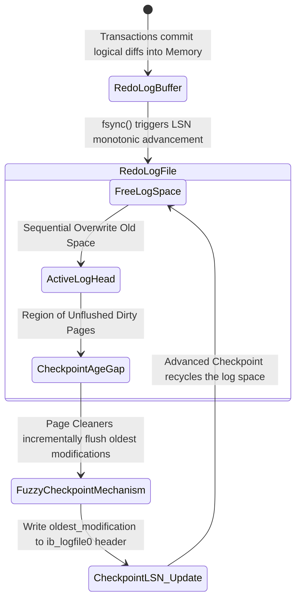

# 04: InnoDBアーキテクチャの解剖: ハードウェアの限界におけるPage Flushes、Checkpoints、およびDoublewrite Bufferの管理

## エグゼクティブサマリーと問題提起

大規模なMySQL環境を運用していると、必ず同じ壁にぶつかる。ACID特性を完全に守りながら、実運用に耐えるI/Oスループットをどう両立させるかという問題だ。決して新しい課題ではないが、ストレージ媒体の速度とCPUのクロックサイクルという、根本的に噛み合わない二つの世界の境界線に位置している以上、簡単に解決できるものでもない。

物理I/Oのレイテンシ(L1/L2キャッシュと比べて数千倍から数百万倍遅い)を隠蔽するため、MySQLのInnoDBストレージエンジンは**Buffer Pool**という巧妙な仮想メモリ空間を構築している。ただし、データをRAM上に置くという選択には代償が伴う。RAMは揮発性であり、電圧低下やカーネルパニック一つで、コミット済みのはずのトランザクションが失われるリスクを抱え込むことになる。

ARIESのリカバリモデルを土台に、InnoDBは以下の3つのメカニズムで構成される一種の閉じたループを運用している。

1. **アダプティブページフラッシュ(Adaptive Page Flushes):** I/Oショックを避けながら、RAMリソースを賢く循環・解放する。
2. **ファジーチェックポイント(Fuzzy Checkpoints):** Redo Logのライフサイクルを管理し、リカバリ時間を一定範囲に抑える。
3. **ダブルライトバッファ(Doublewrite Buffer):** ブロックデバイス層での物理データの断片化(torn page)を防ぐ。

この記事ではInnoDBのマイクロアーキテクチャ、リソース制限の数理モデル、PID的な自己調整アルゴリズム、そしてそれらがもたらすハードウェアI/Oへの影響を順に見ていく。あわせて、InnoDB(5.7から8.0以降)がOSページキャッシュを迂回し、`O_DIRECT`経由でNVMeドライブと直接やり取りする仕組みにも触れる。

---

## Buffer Poolのメモリ管理マイクロアーキテクチャとマルチコア競合問題

InnoDBは利用可能なRAM領域を均一サイズのページに分割する。デフォルトは16KBで、これはクラスタ化インデックスに使われるB+Treeの分岐係数と相性が良くなるよう選ばれた値だ。

### Buffer Poolの多次元リンク構造

実行時のBuffer Poolは単なるバイト配列ではない。ラッチとミューテックスで保護された、複数のリンクリストからなるネットワークだ。

1. **Free List:** ディスクから読み込まれるデータを受け入れる、空のページフレームの一覧。
2. **LRU List:** クリーン・ダーティを問わず、実データを保持しているページを管理する。InnoDBはLRUの派生形であるMidpoint Insertion Strategyを採用しており、リストを容量の5/8を占める*New Sublist*と3/8を占める*Old Sublist*に分割する。フルテーブルスキャンで読み込まれた新規ページはまずOld Sublistに入り、その後アクセスされなければすぐに追い出される。これが「Cache Pollution」を防ぐ仕組みになっている。
3. **Flush List:** ダーティページを、最も古い変更LSNの順に厳密にソートして保持する双方向リンクリスト。

### Buffer Pool Mutexのボトルネック

システムが数万の同時接続をさばくようになると、これらのリンクリストへのアクセスにはロック保護(Buffer Pool Mutex)が必要になる。MySQL 5.5以前ではBuffer Pool全体が単一のMutexで守られており、当然のようにCPU競合が深刻化していた。

MySQL 5.6以降、とりわけ8.0では、InnoDBは**Buffer Pool Instances**を導入した。ハッシュ関数$f(PageID) = PageID \pmod{N}$を使ってBuffer Poolを複数の独立領域(通常CPUコア数に合わせる)に分割する仕組みだ。これによりロック競合の確率は係数$N$のオーダーで下がり、マルチソケット構成やNUMA環境でのスケーラビリティが初めて実用的になる。

---

## アダプティブフラッシュとPID的制御

DMLクエリ(Insert/Update/Delete)がレコードに触れるたびに、RAM上のクリーンページはダーティページへと変わる。

キューイング理論のリトルの法則がここでそのまま当てはまる。$N = \lambda \times W$。$N$はダーティページの総数、$\lambda$は生成速度、$W$は滞留時間だ。$N$がBuffer Pool容量の100%に近づくと、空きページがなくなり、ディスク読み込みを必要とする`SELECT`は同期フラッシュ(Sync Flush)がスペースを空けるのを待つしかなくなる。ここでスループットは崖から落ちるように急落する。

### Adaptive Flushingの誕生

古いバージョンのInnoDBでは、クリーンアップスレッドは基本的に「眠って」おり、ダーティページ率がしきい値`innodb_max_dirty_pages_pct`を超えたときだけフラッシュを始めていた。結果として大きなI/Oバーストが発生し、パフォーマンスグラフはギザギザのノコギリ波を描くことになる。

これを解消したのが**Adaptive Flushing**アルゴリズムだ。比例・積分・微分(PID)コントローラの発想を借り、テレメトリを継続的に収集しながらI/Oカーブを滑らかにする小さなフィードバックループとして動く。

1秒あたりのフラッシュ強度$P_{flush}(t)$は、ダーティページ比率とRedo Log消費速度を組み合わせた微分方程式から導かれる。

トランザクションログの生成速度を導関数$V_{redo} = \frac{d(LSN)}{dt}$とし、チェックポイント年齢(Checkpoint Age)を次のように定義する。
$$A_{checkpoint}(t) = LSN_{current}(t) - LSN_{flushed}(t)$$

必要なI/O量の補間式は次の通り。

$$P_{flush}(t) = \kappa \cdot \left[ \frac{d}{dt} A_{checkpoint}(t) \right] + \xi \cdot \left( \frac{N_{dirty}(t)}{N_{total\_pages}} \right)^\tau \cdot IO_{capacity}$$

ここで:
* $\kappa, \xi, \tau$は経験的に調整される係数。
* $IO_{capacity}$は`innodb_io_capacity`変数で宣言される物理帯域幅の上限。

$A_{checkpoint}$が上限$A_{max\_capacity}$に近づくと、コントローラは**Furious Flushing**と呼ばれる非対称モードに切り替わる。管理者が設定したIOPS上限を無視してでもページをディスクへ押し出し、システム全体がストールするのを何としても避けようとする最終手段だ。

```cpp
// InnoDB 8.0のAdaptive Flusherコントローラーアルゴリズムのカーネルをシミュレートする擬似コード
class AdaptiveFlusherController {
private:
    double alpha_weight, beta_weight, gamma_exponent;
    uint64_t configured_io_capacity;
    uint64_t max_physical_iops;
    
    double compute_lsn_velocity(double current_checkpoint_age, double prev_checkpoint_age, double delta_time) {
        return (current_checkpoint_age - prev_checkpoint_age) / delta_time;
    }
    
public:
    uint64_t calculate_optimal_flush_rate(SystemTelemetryState telemetry) {
        double derivative_age = compute_lsn_velocity(telemetry.checkpoint_age, telemetry.prev_age, telemetry.dt);
        double dirty_saturation_ratio = static_cast<double>(telemetry.dirty_pages) / telemetry.total_pages;
        
        // ハイブリッドPIDモデル（比例・微分）
        double theoretical_flush_target = alpha_weight * derivative_age + 
                                          beta_weight * std::pow(dirty_saturation_ratio, gamma_exponent) * configured_io_capacity;
                                          
        double absolute_max_age = telemetry.max_redo_capacity * 0.85; // Safety margin 85%
        
        if (telemetry.checkpoint_age > absolute_max_age) {
            // Furious Flushing モード
            return max_physical_iops;
        }
        
        return std::min(static_cast<uint64_t>(theoretical_flush_target), configured_io_capacity);
    }
};
```

---

## チェックポイントの数学的モデルとマルチスレッドLSN

InnoDBのクラッシュ耐久性は、write-ahead loggingの原則の上に成り立っている。RAM上の変更はすべて、対応するデータページがデータファイル(`.ibd`)に書き込まれるより前に、Redo Logへ記録されていなければならない。

### ログのリング空間とLog Sequence Number (LSN)

ログサブシステムはディスク領域を円環状のバッファとして扱う。時間の座標軸となるのが、単調増加するバイトカウンターであるログシーケンス番号(LSN)だ。

チェックポイントの本質的な役割は、古くなったログバイト領域を回収・上書き可能にすることと、リカバリ処理の起点となる耐久性のあるアンカーポイントを打つことにある。

### Fuzzy Checkpointing vs Sharp Checkpoint

InnoDBは**Sharp Checkpoint**方式、つまり全I/Oを止めて一斉にディスクへフラッシュするやり方を意図的に避けている。単純にシステムがハングしてしまうからだ。代わりに採用しているのが**Fuzzy Checkpointing**モデルである。

バックグラウンドのPage Cleanerスレッドは、Flush Listの末尾(`oldest_modification` LSNが最小のページが並ぶ場所)から少量のダーティページを継続的に取り出し、ディスクへフラッシュし続ける。最も古いページ群がディスクに到達すると、システムは`ib_logfile0`ヘッダーの$Checkpoint\_LSN$を更新する。

チェックポイントの数学的な上限は次の式で表される。

$$\Delta LSN(t) \le L_{max\_capacity} \times \phi_{safety\_margin}$$

ここで$\phi_{safety\_margin} \approx 0.85$。アプリケーションの書き込み速度がこれを上回り、$\Delta LSN(t)$が同期フラッシュのウォーターマークを超えてしまうと、InnoDBはグローバルスピンロックを発動し、Redo Logリングが上書きされる前にすべての書き込みトランザクションをブロックする。このしきい値に近づかせないこと、具体的には`innodb_log_file_size`を十分に確保しておくことは、アーキテクトの責任と言っていい。



---

## Doublewrite Bufferマイクロアーキテクチャ: Partial Page Writeからの救世主

データベースが前提とするブロックサイズと、実際のハードウェアが保証するブロックサイズには根本的なずれがある。このずれこそが、ストレージスタック全体の中でも特に危険な障害点になっている。

InnoDBのページサイズは16KBに固定されている。一方Linux(仮想ファイルシステム)とSSD/HDDが保証するアトミック書き込みの単位は、セクターサイズ(512バイト)かページサイズ(4096バイト)止まりだ。

カーネルが16KBのInnoDBページに対して`pwrite()`を実行すると、ブロックI/Oスケジューラ(`mq-deadline`など)はこれを4つの独立した4KB断片に分解する。もし停電やカーネルパニックが、そのうち1つか2つの4KB断片しかディスクに届いていない段階で発生したら、その16KBページは破損状態、いわゆる**Torn Page(Partial Page Write)**に陥る。

再起動後、そのページはCRC32cチェックサム検証で失敗する。Redo Logもここでは役に立たない。Redo Logの中身は差分(diff)であり、整合性のある構造を持つページに適用することが前提だからだ。壊れたページに差分を適用しても、出てくるのはさらなるゴミデータでしかない。結果として現れるのが、あの*"Database Page Corruption"*というエラーだ。

### Doublewrite Buffer (DWB) のデュアルアーキテクチャ

この致命的な脅威を無力化するために導入されたのが、Doublewrite Bufferという専用バッファだ。書き込み性能を多少犠牲にする代わりに、整合性を確保する仕組みになっている。

1. **メモリ上のDWB:** RAM内に確保される2MBの領域で、128個の16KBページを保持できる。
2. **ディスク上のDWB:** あらかじめ確保された静的領域。かつては`ibdata1`ファイル内に置かれていたが、MySQL 8.0.20以降は領域の競合を減らすため専用の`*.dblwr`ファイルとして分離された。

**動作の流れ:**

Page Cleanerがダーティページを集めて`*.ibd`へフラッシュしようとするとき:
- ステップ1: `memcpy`により128個のダーティページがDWBのメモリ領域にコピーされる。
- ステップ2: `fsync()`または`O_DIRECT`と組み合わせて、この2MBをディスク上の静的な`*.dblwr`領域へ一括でシーケンシャル書き込みする。シーケンシャルであるため高速に完了し、SSDの書き込み増幅係数(WAF)を悪化させない。
- ステップ3: このDWB書き込みが成功したことを確認できて初めて、InnoDBは各ページを実際のテーブルスペースファイル内の本来の(ランダムな)位置へ分散書き込みする。

仮にステップ3の最中に電源が落ち、テーブルスペース側のページが破損しても、ステップ2で書き込んだ無傷のコピーはDWB内にそのまま残っている。クラッシュリカバリでは、チェックサム検証で破損を検知し、DWBに保存されたクリーンなコピーで上書きしてから、Redo Logのロールフォワードに進む。

DWB側とデータファイル側の両方が同時に破損する確率は、実質的にゼロと見なせる。

$$P(\text{Fatal Corruption}) = P(\text{Fail\_DWB}) \cap P(\text{Fail\_Data}) \approx 0$$

### DWBの未来: AWUPFとCopy-on-Writeファイルシステム

クラウド全盛の今、この重厚なDoublewrite Bufferは、いくつかの新しい技術によって少しずつ不要になりつつある。

1. **NVMe 1.4+ AWUPF (Atomic Write Unit Power Fail):** 最新のエンタープライズSSDはハードウェアレベルでアトミック書き込みを保証する。SSD基板上のコンデンサのおかげで、突然の電源喪失時でも最大16KBから32KBまでの完全なアトミック書き込みが保証される。
2. **Copy-on-Write (CoW) ファイルシステム(ZFS、Btrfsなど):** これらは既存のブロックを直接上書きしない。空き領域に新しいバージョンを書き、メタデータのポインタだけを差し替える。この方式ではTorn Writeが既存の有効なバージョンを壊すことはあり得ない。

こうした環境では、`innodb_doublewrite=0`という選択も現実的になる。DWBを無効化すれば書き込み経路が一段減り、NANDフラッシュにのしかかっていた物理I/Oの負荷を約50%削減できる。

```rust
// Doublewrite Bufferのアトミックリカバリロジックを抽象化した擬似コード
struct DoublewriteBufferManager {
    dwb_disk_region: FileSegmentController,
    tablespace_region: DataFilesController,
}

impl StorageEngineRecovery for DoublewriteBufferManager {
    fn execute_crash_recovery_phase_one(&mut self) -> Result<(), CriticalSystemError> {
        let in_memory_dwb_snapshot = self.dwb_disk_region.load_entire_2mb_region();
        
        for page_id in self.tablespace_region.get_all_registered_pages() {
            let user_data_page = self.tablespace_region.read_raw_16kb_page(page_id);
            
            if !user_data_page.verify_crc32c_checksum() {
                log_warning!("LBAオフセットでのTorn Pageを検出: {:?}. DWBスキャンモードをアクティブにします...", page_id);
                
                if let Some(valid_dwb_page) = in_memory_dwb_snapshot.search_page_by_id(page_id) {
                    if valid_dwb_page.verify_crc32c_checksum() {
                        // アトミックリカバリをアクティブ化：破損したページにDWBからの無傷なページを上書きします
                        self.tablespace_region.overwrite_corrupted_page_with_fsync(page_id, valid_dwb_page)?;
                        log_info!("データページ {:?} はDWB構造から正常に復元されました。", page_id);
                    } else {
                        panic!("致命的なエラー（Fatal Error）：両方のストレージデバイスでページ構造が崩壊しました！");
                    }
                }
            }
        }
        
        // 安全なフェーズ1を完了し、フェーズ2に進む：Roll-Forward
        self.apply_write_ahead_redo_logs()?;
        Ok(())
    }
}
```

## 教訓 (Lessons Learned)

データエンジニアおよびシステムアーキテクト向けに、実務上のポイントをまとめておく。

1. **Adaptive Flusherのチューニングは経験がものを言う分野だ。** `innodb_io_capacity`と`innodb_io_capacity_max`は適当な数値ではなく、`fio`などで実測したSSDのランダム書き込みIOPSの70〜80%程度を目安に設定する。低すぎればダーティページが積み上がり、高すぎれば通常のSELECTからI/Oリソースを奪ってしまう。
2. **マルチコア環境ではBuffer Pool Instancesの設定を怠らないこと。** 16コア以上のマシンで`innodb_buffer_pool_instances`を1のまま運用するのは避けたい。コア数やvCPU数に応じて8、16、32といった値に設定し、Mutex競合のボトルネックを解消する。
3. **Checkpoint Ageの動きには注意を払う。** 急激な負荷上昇時にデータベースが1〜2秒完全に固まるようなら、ほぼ間違いなくデータ取り込み速度がRedo Logの処理能力を超え、Synchronous Flushが強制発動している。`innodb_log_file_size`を十分に確保しておく(MySQL 8.0ではResized Redo Logの仕組みである程度自動化されている)ことで、$\Delta LSN(t)$に余裕を持たせられる。
4. **AWUPFとDWB無効化の判断。** 最新のエンタープライズSSDやZIL付きのZFS環境であれば、Doublewrite Buffer(`innodb_doublewrite=0`)を無効化することで、SSDの寿命(TBW)を約半分節約し、書き込みスループットをほぼ倍にできる。
