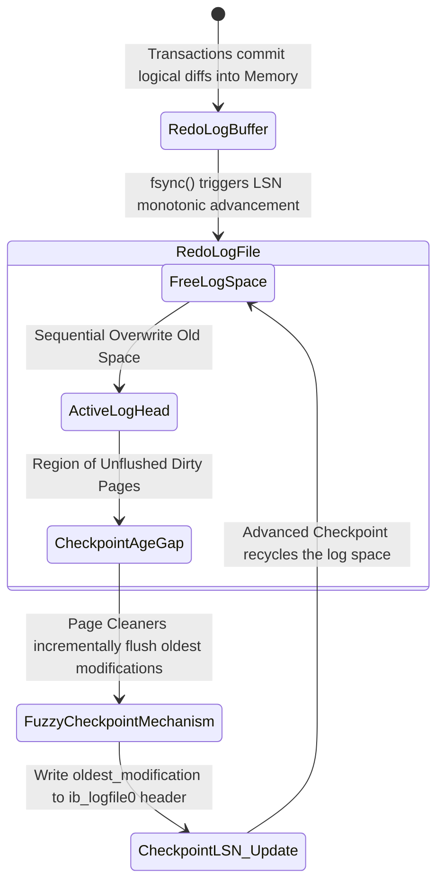

# 04: Giải phẫu Kiến trúc InnoDB: Quản lý Page Flushes, Checkpoints và Doublewrite Buffer tại Giới hạn Phần cứng

## Tóm tắt Điều hành & Tuyên bố Vấn đề

Ai từng vận hành MySQL ở quy mô lớn cũng từng đối mặt với cùng một câu hỏi: làm sao giữ trọn vẹn các đặc tính ACID mà vẫn duy trì thông lượng I/O đủ để đáp ứng traffic thực tế? Đây không phải bài toán mới, nhưng nó chưa bao giờ dễ, vì nằm ngay ở điểm giao giữa tốc độ của thiết bị lưu trữ và tốc độ xung nhịp CPU - hai thứ vốn dĩ chênh lệch nhau hàng nghìn lần.

Để che giấu độ trễ truy xuất vật lý - chậm hơn L1/L2 cache từ hàng nghìn đến hàng triệu lần - engine lưu trữ InnoDB của MySQL dựng nên một không gian bộ nhớ ảo hóa khá cầu kỳ gọi là **Buffer Pool**. Cái giá phải trả là RAM dễ bay hơi: chỉ cần một cú sụt điện áp hay một lần kernel panic, mọi giao dịch tưởng như đã commit thành công đều có thể biến mất.

Dựa trên nền tảng phục hồi ARIES, InnoDB vận hành một vòng khép kín được điều phối bởi ba cơ chế:
1. **Adaptive Page Flushing:** luân chuyển và giải phóng RAM một cách có kiểm soát để tránh gây sốc I/O.
2. **Fuzzy Checkpointing:** quản lý vòng đời của redo log và giữ thời gian phục hồi trong tầm kiểm soát.
3. **Doublewrite Buffer:** chặn đứng nguy cơ phân mảnh dữ liệu vật lý (torn page) ngay ở tầng thiết bị khối.

Bài viết này đi qua vi kiến trúc của InnoDB: các mô hình giới hạn tài nguyên, thuật toán flushing tự điều chỉnh theo kiểu PID, và những hệ lụy phần cứng đi kèm. Ta cũng sẽ xem InnoDB (từ 5.7 đến 8.0 trở lên) giao tiếp trực tiếp với ổ NVMe qua `O_DIRECT`, bỏ qua OS page cache, để vắt kiệt phần thông lượng còn lại.

---

## Vi Kiến Trúc Quản Trị Buffer Pool và Bài toán Tranh chấp Đa lõi

InnoDB chia không gian RAM khả dụng thành các trang kích thước cố định, mặc định 16KB - con số được chọn để tương thích tốt với hệ số rẽ nhánh của cấu trúc B+Tree dùng trong clustered index.

### Cấu trúc Liên kết Đa chiều của Buffer Pool

Khi đang chạy, Buffer Pool không đơn thuần là một mảng byte phẳng, mà là một mạng lưới các danh sách liên kết, mỗi danh sách được bảo vệ bởi latch và mutex riêng.
1. **Free List:** các khung trang trống, sẵn sàng nhận dữ liệu nạp từ đĩa.
2. **LRU List:** quản lý các trang đang giữ dữ liệu, dù sạch hay bẩn. InnoDB dùng một biến thể LRU gọi là Midpoint Insertion Strategy, chia danh sách thành *New Sublist* (5/8 dung lượng) và *Old Sublist* (3/8). Các trang vừa đọc từ đĩa do một lượt full table scan sẽ vào Old Sublist trước, và bị đẩy ra ngay nếu không có ai đụng đến nữa - đây chính là cơ chế ngăn một lượt quét lớn xóa sạch cache.
3. **Flush List:** danh sách liên kết đôi, sắp xếp các trang bẩn nghiêm ngặt theo LSN thay đổi cũ nhất.

### Nút thắt Cổ chai Buffer Pool Mutex

Khi hệ thống phải xử lý hàng chục nghìn kết nối đồng thời, các luồng chạm vào những danh sách này cần khóa bảo vệ (Buffer Pool Mutex). Ở MySQL 5.5 trở về trước, toàn bộ Buffer Pool bị khóa bởi một mutex duy nhất - và hậu quả là tranh chấp CPU nghiêm trọng.

Từ 5.6, và rõ rệt hơn ở 8.0, InnoDB đưa vào **Buffer Pool Instances**: chia Buffer Pool thành nhiều vùng độc lập (thường bằng số lõi CPU) qua hàm băm $f(PageID) = PageID \pmod{N}$. Nhờ đó xác suất va chạm khóa giảm theo bậc $N$ - đây mới là thứ thực sự giúp InnoDB mở rộng tốt trên các máy chủ đa socket, NUMA.

---

## Adaptive Flushing và Điều Khiển kiểu PID

Mỗi câu lệnh DML (Insert/Update/Delete) chạm vào một bản ghi sẽ biến một trang sạch trong RAM thành trang bẩn.

Định lý Little trong lý thuyết hàng đợi áp dụng trực tiếp ở đây: $N = \lambda \times W$, với $N$ là số trang bẩn, $\lambda$ là tốc độ sinh ra chúng, $W$ là thời gian chúng nằm lại trong bộ nhớ. Nếu để $N$ tiến gần 100% dung lượng Buffer Pool, sẽ không còn trang trống nào, và bất kỳ `SELECT` nào cần đọc từ đĩa cũng phải chờ một lượt sync flush dọn chỗ. Đó là lúc thông lượng rơi tự do.

### Sự Ra đời của Adaptive Flushing

Các bản InnoDB cũ để luồng dọn dẹp gần như "ngủ", chỉ xả trang khi tỷ lệ trang bẩn vượt ngưỡng cứng `innodb_max_dirty_pages_pct`. Kết quả là những đợt I/O burst lớn, đồ thị hiệu năng có hình răng cưa - lúc mượt, lúc khựng.

**Adaptive Flushing** ra đời để sửa điều này, hoạt động gần giống một bộ điều khiển PID (tỷ lệ - tích phân - đạo hàm): một vòng phản hồi nhỏ, liên tục đọc telemetry và làm mượt đường cong I/O thay vì để nó tăng vọt.

Cường độ xả trang mỗi giây, $P_{flush}(t)$, đến từ một phương trình vi phân mô phỏng tốc độ tiêu thụ redo log song song với tỷ lệ trang bẩn.

Nếu tốc độ sinh nhật ký giao dịch là đạo hàm $V_{redo} = \frac{d(LSN)}{dt}$, và Checkpoint Age được định nghĩa:
$$A_{checkpoint}(t) = LSN_{current}(t) - LSN_{flushed}(t)$$

thì khối lượng I/O cần thiết được nội suy như sau:

$$P_{flush}(t) = \kappa \cdot \left[ \frac{d}{dt} A_{checkpoint}(t) \right] + \xi \cdot \left( \frac{N_{dirty}(t)}{N_{total\_pages}} \right)^\tau \cdot IO_{capacity}$$

Trong đó:
* $\kappa, \xi, \tau$ là các hệ số điều chỉnh dựa trên thực nghiệm.
* $IO_{capacity}$ là giới hạn băng thông khai báo qua `innodb_io_capacity`.

Khi $A_{checkpoint}$ tiến sát ngưỡng $A_{max\_capacity}$, bộ điều khiển chuyển sang chế độ bất đối xứng gọi là **Furious Flushing**: bỏ qua mọi giới hạn IOPS đã cấu hình, ép trang xuống đĩa bằng mọi giá để cứu hệ thống khỏi bị treo cứng.

```cpp
// Pseudocode mô phỏng hạt nhân thuật toán bộ điều khiển Adaptive Flusher trong InnoDB 8.0
class AdaptiveFlusherController {
private:
    double alpha_weight, beta_weight, gamma_exponent;
    uint64_t configured_io_capacity;
    uint64_t max_physical_iops;
    
    double compute_lsn_velocity(double current_checkpoint_age, double prev_checkpoint_age, double delta_time) {
        return (current_checkpoint_age - prev_checkpoint_age) / delta_time;
    }
    
public:
    uint64_t calculate_optimal_flush_rate(SystemTelemetryState telemetry) {
        double derivative_age = compute_lsn_velocity(telemetry.checkpoint_age, telemetry.prev_age, telemetry.dt);
        double dirty_saturation_ratio = static_cast<double>(telemetry.dirty_pages) / telemetry.total_pages;
        
        // Mô hình PID lai (Proportional-Derivative)
        double theoretical_flush_target = alpha_weight * derivative_age + 
                                          beta_weight * std::pow(dirty_saturation_ratio, gamma_exponent) * configured_io_capacity;
                                          
        double absolute_max_age = telemetry.max_redo_capacity * 0.85; // Safety margin 85%
        
        if (telemetry.checkpoint_age > absolute_max_age) {
            // Chế độ Furious Flushing
            return max_physical_iops;
        }
        
        return std::min(static_cast<uint64_t>(theoretical_flush_target), configured_io_capacity);
    }
};
```

---

## Mô Hình Toán Học của Checkpointing và LSN Đa Luồng

Khả năng chịu sập nguồn (crash durability) của InnoDB đứng trên nguyên lý write-ahead logging: mọi thay đổi vật lý trên RAM phải được ghi vào redo log trước khi trang dữ liệu tương ứng được phép chạm tới data file (`.ibd`).

### Không gian Vòng Log và Log Sequence Number (LSN)

Bộ điều khiển log nội bộ coi không gian đĩa như một vùng đệm hình vòng tròn. Trục thời gian ở đây được đo bằng Log Sequence Number (LSN) - một bộ đếm byte tăng đơn điệu.

Mục đích cốt lõi của checkpoint là thu hồi và cho phép ghi đè lên các byte log đã lỗi thời, đồng thời cắm một mốc neo bền vững để quá trình phục hồi sau này có điểm xuất phát.

### Fuzzy Checkpointing so với Sharp Checkpoint

InnoDB cố tình tránh mô hình **Sharp Checkpoint** - đóng băng toàn bộ I/O và xả hết dữ liệu cùng lúc - vì cách này đơn giản là làm treo hệ thống. Thay vào đó nó dùng **Fuzzy Checkpointing**.

Các luồng Page Cleaner chạy ngầm liên tục rút một lượng nhỏ trang bẩn từ đuôi Flush List (nơi chứa các trang có LSN `oldest_modification` nhỏ nhất) rồi xả xuống đĩa. Khi một mẻ trang cũ nhất đã chạm tới đĩa, hệ thống cập nhật $Checkpoint\_LSN$ trong header của `ib_logfile0`.

Giới hạn toán học của checkpoint được biểu diễn:

$$\Delta LSN(t) \le L_{max\_capacity} \times \phi_{safety\_margin}$$

với $\phi_{safety\_margin} \approx 0.85$. Nếu tốc độ ghi của ứng dụng vượt quá khả năng này, đẩy $\Delta LSN(t)$ qua Synchronous Flush Watermark, InnoDB buộc phải kích hoạt một khóa toàn cục (global spin-lock), chặn mọi giao dịch ghi để tránh ghi đè lên phần redo log chưa an toàn. Tránh chạm ngưỡng này - thường bằng cách đặt `innodb_log_file_size` đủ rộng rãi - là trách nhiệm của người thiết kế hệ thống.



---

## Vi Kiến Trúc Doublewrite Buffer: Cứu tinh trước Partial Page Write

Có một khoảng cách khá thô giữa kích thước block mà cơ sở dữ liệu giả định và kích thước block mà phần cứng thực sự đảm bảo. Khoảng cách đó lại chính là một trong những điểm mong manh nhất của toàn bộ storage stack.

Page size của InnoDB cố định ở 16KB. Trong khi đó Linux (VFS) và SSD/HDD bên dưới chỉ đảm bảo ghi nguyên tử ở mức sector (512 byte) hoặc page (4096 byte).

Khi kernel thực thi `pwrite()` cho một trang 16KB của InnoDB, block I/O scheduler (như `mq-deadline`) sẽ chia nó thành 4 mảnh 4KB độc lập. Nếu mất điện hoặc kernel panic xảy ra khi mới chỉ 1-2 mảnh 4KB kịp ghi xuống đĩa, trang 16KB đó rơi vào trạng thái hỏng dở dang - gọi là **Torn Page**, hay Partial Page Write.

Khi khởi động lại, trang đó sẽ trượt kiểm tra CRC32c. Redo log cũng không cứu được, vì bản ghi redo vốn là các diff, chỉ áp dụng đúng lên một trang có cấu trúc còn nguyên vẹn - áp diff lên một trang đã rách chỉ tạo ra thêm rác. Kết quả là lỗi quen thuộc: *"Database Page Corruption"*.

### Kiến trúc Kép của Doublewrite Buffer (DWB)

Để triệt tiêu rủi ro này, InnoDB đưa vào một vùng đệm riêng gọi là Doublewrite Buffer, đánh đổi một phần thông lượng ghi để lấy tính toàn vẹn:

1. **DWB trong bộ nhớ:** nằm trong RAM, dung lượng 2MB, chứa được 128 trang 16KB.
2. **DWB trên đĩa:** vùng không gian tĩnh được cấp phát sẵn, trước đây nằm trong `ibdata1`, nhưng từ MySQL 8.0.20 được tách ra thành các tệp `*.dblwr` riêng để giảm tranh chấp không gian.

**Cách vận hành:**
Khi Page Cleaner gom các trang bẩn để xả xuống `*.ibd`:
- Bước 1: `memcpy` sao chép 128 trang bẩn vào vùng RAM của DWB.
- Bước 2: hệ thống phát một lệnh ghi tuần tự 2MB thẳng xuống vùng `*.dblwr` trên đĩa, kèm `fsync()` hoặc cờ `O_DIRECT`. Vì là ghi tuần tự nên rất nhanh, và không làm tăng write amplification của SSD.
- Bước 3: chỉ khi lệnh ghi DWB báo thành công, InnoDB mới phân tán từng trang riêng lẻ về đúng vị trí (ngẫu nhiên) của chúng trong các tệp tablespace.

Nếu mất điện đúng lúc bước 3 làm rách một trang trong tablespace, bản sao nguyên vẹn vẫn còn nằm trong DWB từ bước 2. Khi crash recovery chạy, việc kiểm tra checksum sẽ phát hiện trang hỏng, và hệ thống chép bản sạch từ DWB đè lên nó trước khi redo log bắt đầu roll-forward.

Xác suất cả hai bản sao (DWB và tablespace) cùng bị rách trong cùng một lần là gần như bằng không:
$$P(\text{Fatal Corruption}) = P(\text{Fail\_DWB}) \cap P(\text{Fail\_Data}) \approx 0$$

### Tương lai của DWB: AWUPF và Copy-on-Write Filesystem

Trong thời đại cloud, Doublewrite Buffer - vốn khá cồng kềnh - đang dần trở nên bớt cần thiết nhờ hai công nghệ mới:
1. **NVMe 1.4+ AWUPF (Atomic Write Unit Power Fail):** SSD enterprise hiện đại đảm bảo ghi nguyên tử ở tầng phần cứng, lên tới 16KB hoặc 32KB, kể cả khi mất điện đột ngột - nhờ hệ tụ điện tích hợp trên bo mạch.
2. **Filesystem copy-on-write (ZFS, Btrfs):** những hệ thống này không bao giờ ghi đè lên block cũ. Chúng viết phiên bản mới ở vùng trống rồi chỉnh lại con trỏ metadata - nên torn write không bao giờ chạm được vào phiên bản cũ còn hợp lệ.

Trên những hạ tầng như vậy, việc đặt `innodb_doublewrite=0` là lựa chọn hợp lý. Tắt DWB loại bỏ hẳn một lượt ghi phụ, ngay lập tức giải phóng khoảng 50% chi phí I/O vật lý vốn đang đè lên mỗi lần flush xuống flash storage.

```rust
// Mã giả trừu tượng logic phục hồi nguyên tử của Doublewrite Buffer
struct DoublewriteBufferManager {
    dwb_disk_region: FileSegmentController,
    tablespace_region: DataFilesController,
}

impl StorageEngineRecovery for DoublewriteBufferManager {
    fn execute_crash_recovery_phase_one(&mut self) -> Result<(), CriticalSystemError> {
        let in_memory_dwb_snapshot = self.dwb_disk_region.load_entire_2mb_region();
        
        for page_id in self.tablespace_region.get_all_registered_pages() {
            let user_data_page = self.tablespace_region.read_raw_16kb_page(page_id);
            
            if !user_data_page.verify_crc32c_checksum() {
                log_warning!("Phát hiện Torn Page tại LBA offset: {:?}. Kích hoạt chế độ quét DWB...", page_id);
                
                if let Some(valid_dwb_page) = in_memory_dwb_snapshot.search_page_by_id(page_id) {
                    if valid_dwb_page.verify_crc32c_checksum() {
                        // Kích hoạt phục hồi nguyên tử: đè trang nguyên vẹn từ DWB lên trang bị hỏng
                        self.tablespace_region.overwrite_corrupted_page_with_fsync(page_id, valid_dwb_page)?;
                        log_info!("Trang dữ liệu {:?} đã được phục hồi thành công từ cấu trúc DWB.", page_id);
                    } else {
                        panic!("Lỗi không thể phục hồi (Fatal Error): Cấu trúc trang sụp đổ trên cả hai thiết bị lưu trữ!");
                    }
                }
            }
        }
        
        // Hoàn thành pha một an toàn, tiếp tục chuyển sang pha hai: Roll-Forward
        self.apply_write_ahead_redo_logs()?;
        Ok(())
    }
}
```

## Bài Học Kinh Nghiệm (Lessons Learned)

Dành cho các data engineer và systems architect:
1. **Tinh chỉnh Adaptive Flusher là chuyện đòi hỏi kinh nghiệm thực chiến.** `innodb_io_capacity` và `innodb_io_capacity_max` không phải con số tùy tiện - nên đặt ở mức 70-80% khả năng IOPS ghi ngẫu nhiên thực đo được của SSD (dùng `fio` để đo, đừng đoán). Đặt quá thấp thì trang bẩn chất đống. Đặt quá cao thì flushing sẽ giành hết băng thông I/O của các SELECT bình thường.
2. **Buffer Pool Instances gần như bắt buộc trên máy nhiều lõi.** Đừng bao giờ chạy MySQL trên máy 16+ core mà chỉ để `innodb_buffer_pool_instances` bằng 1. Đặt giá trị này theo số core hoặc vCPU (8, 16, 32...) để phá bỏ nút thắt tranh chấp mutex.
3. **Theo dõi sát Checkpoint Age.** Nếu database thỉnh thoảng đứng hình 1-2 giây khi tải tăng đột biến, gần như chắc chắn tốc độ nạp dữ liệu đã vượt khả năng của redo log, buộc hệ thống kích hoạt Synchronous Flush. Đặt `innodb_log_file_size` đủ lớn (MySQL 8.0 tự động hóa phần này khá nhiều qua cơ chế resized redo log) để $\Delta LSN(t)$ có đủ không gian xoay xở.
4. **AWUPF và việc tắt DWB.** Trên SSD enterprise hiện đại, hoặc ZFS có ZIL, việc tắt Doublewrite Buffer (`innodb_doublewrite=0`) có thể tiết kiệm khoảng một nửa tuổi thọ ghi (TBW) của SSD và gần như tăng gấp đôi thông lượng ghi.
