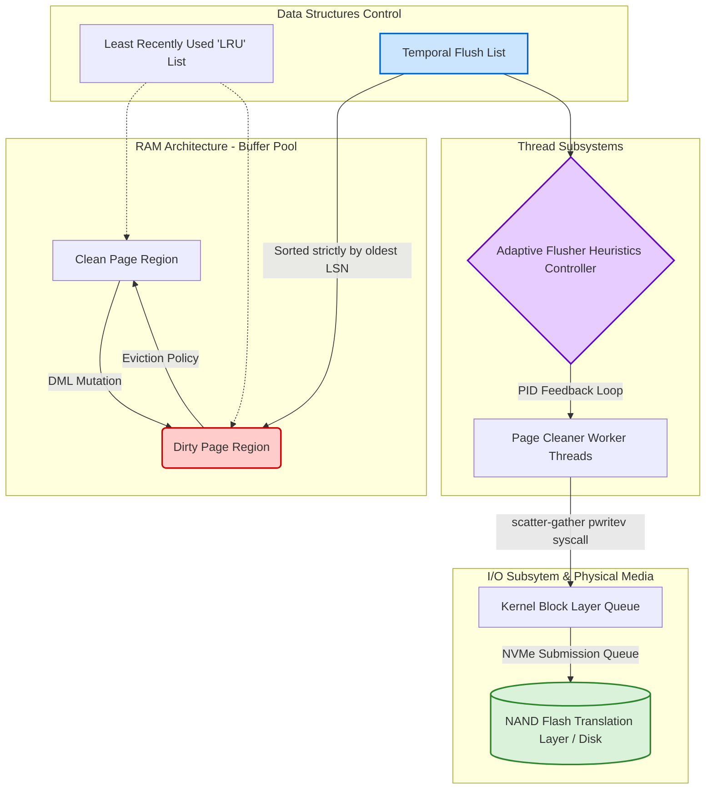
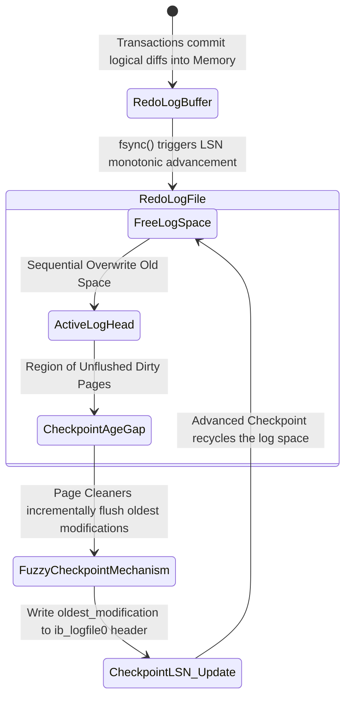

# Cách InnoDB Quản Lý Page Flushes, Checkpoints và Doublewrite Buffer

Trong các hệ quản trị cơ sở dữ liệu quan hệ (RDBMS) phục vụ những hệ thống quy mô siêu lớn, việc đảm bảo trọn vẹn các đặc tính phân tán và bền vững ACID (Atomicity, Consistency, Isolation, Durability) đồng thời đẩy giới hạn thông lượng I/O lên trạng thái cực đại luôn là một bài toán hóc búa thuộc phạm trù khoa học máy tính mức hệ thống. Cội nguồn của mọi thiết kế cấu trúc dữ liệu bền vững đều phải giải quyết nghịch lý cơ học giữa tốc độ của thiết bị lưu trữ bán dẫn hoặc từ tính và tốc độ vi xử lý của CPU. Để che giấu độ trễ truy xuất (I/O latency hiding) vật lý — vốn thường cao hơn từ hàng ngàn đến hàng triệu lần so với chu kỳ xung nhịp L1/L2 Cache — engine lưu trữ InnoDB của MySQL triển khai một kiến trúc ảo hóa không gian vô cùng phức tạp xoay quanh cấu trúc Buffer Pool. Tuy nhiên, việc lưu trú dữ liệu trên bộ nhớ chính (RAM) sinh ra một rủi ro hiện hữu: tính dễ bay hơi (volatility) của bộ nhớ vật lý biến mọi giao dịch đã được hệ thống xác nhận (committed transactions) thành nguy cơ thất thoát vĩnh viễn khi xảy ra biến cố sụt giảm điện áp hoặc hiện tượng sụp đổ nhân hệ điều hành (kernel panic). Dựa trên nền tảng của luận án phục hồi ARIES (Algorithms for Recovery and Isolation Exploiting Semantics), InnoDB vận hành một nguyên lý kiến trúc nghiêm ngặt được tiêu chuẩn hóa là Write-Ahead Logging (WAL). Toàn bộ hệ thống luồng thực thi nền trong kiến trúc này được điều phối bởi ba cơ cấu cốt lõi hoạt động song hành như một hệ sinh thái nhiệt động lực học khép kín: hệ thống xả trang (Page Flushes) để luân chuyển và giải phóng tài nguyên không gian RAM, kiến trúc đánh dấu trạng thái đồng bộ (Checkpoints) nhằm tối ưu hóa vòng đời của tệp nhật ký ghi trước, và cấu trúc đệm ghi kép (Doublewrite Buffer) được thiết kế đặc thù để ngăn chặn thảm họa phân mảnh dữ liệu vật lý ở tầng điều khiển thiết bị khối (block device driver). Bài nghiên cứu học thuật chuyên sâu này sẽ tiến hành mổ xẻ vi kiến trúc, các mô hình toán học giới hạn tài nguyên, thuật toán nội suy tự điều khiển, và hệ lụy của I/O phần cứng cấu thành nên nền tảng cốt lõi của InnoDB. Bằng cách sử dụng trực tiếp cờ `O_DIRECT` trong các lệnh gọi hệ thống (system calls) chuẩn POSIX của hạt nhân Linux, InnoDB loại bỏ hoàn toàn sự can thiệp tốn kém của bộ đệm trang hệ điều hành (OS Page Cache), thiết lập một đường ống dẫn dữ liệu trực tiếp từ không gian địa chỉ ảo (user space virtual memory) tới bộ điều khiển truy cập trực tiếp bộ nhớ (Direct Memory Access - DMA) của chip điều khiển NVMe hoặc SAS. Sự ủy quyền kiểm soát độc tôn này bắt buộc bộ quản lý của InnoDB phải tinh chỉnh độ chính xác trong vòng đời của từng byte dữ liệu, tạo tiền đề cho các thuật toán điều khiển PID (Proportional-Integral-Derivative) nội bộ hoạt động theo chu kỳ vi giây, bảo vệ tính toàn vẹn của đồ thị luồng bit lưu trữ.

## Vi Kiến Trúc Quản Trị Bộ Nhớ Khối Và Thuật Toán Page Flushes Thích Ứng (Adaptive Flushing)

Kiến trúc nền tảng của bộ quản lý khối (Block Manager) trong InnoDB định hình không gian RAM khả dụng thành các trang (pages) có kích thước đồng nhất cố định, theo tiêu chuẩn cấu hình vi kiến trúc là 16KB, kích thước này được tối ưu hóa toán học nhằm tương thích với độ sâu và hệ số rẽ nhánh (branching factor) của cấu trúc B+Tree đa tầng được sử dụng trong các chỉ mục cụm (clustered indexes). Khi một truy vấn thực thi ngôn ngữ thao tác dữ liệu (DML) tác động lên một bản ghi, hệ thống không khởi tạo lệnh ghi I/O đồng bộ lên vị trí cung từ (sector) của đĩa vật lý mà thực hiện sự thay đổi vi mô đó ngay trên bộ định tuyến của trang cư trú trong RAM. Quá trình biến đổi này làm thay đổi checksum tổng của khối bộ nhớ và chuyển đổi một trang dữ liệu hoàn toàn sạch (clean page) thành một trang bị sửa đổi tạm thời (dirty page). Sự gia tăng tuyến tính của các dirty pages theo trục thời gian thực thi sinh ra một bài toán ràng buộc phi tuyến tính về sự cạn kiệt tài nguyên cục bộ: nếu hạt nhân hệ thống cho phép số lượng dirty pages sinh sôi đạt tới giới hạn tiệm cận vô hạn, Buffer Pool sẽ rơi vào trạng thái bão hòa, không còn các trang trống (free pages) để thỏa mãn các yêu cầu nạp lỗi trang (page faults) từ không gian lưu trữ đĩa, dẫn đến một sự sụp đổ thảm khốc về thông lượng giao dịch (throughput starvation). Dựa trên nguyên lý của lý thuyết hàng đợi tĩnh, Định lý Little (Little's Law) áp dụng cho hệ thống quản lý vùng nhớ này được biểu diễn bởi công thức $N = \lambda \times W$, trong đó $N$ đại diện cho tổng số dirty pages tích lũy trong Buffer Pool, $\lambda$ biểu thị tỷ lệ sinh trang bẩn (page mutation rate) dưới áp lực của các giao dịch luồng hệ thống, và $W$ là thời gian lưu trú (residence time) trung bình bắt buộc của một dirty page trước khi thuật toán xả trang phân phối lại nó xuống thiết bị I/O tĩnh. Nhằm kiểm soát $N$ luôn dao động trong một biên độ chịu đựng cấu hình (thường được siết chặt bởi tham số cực đại `innodb_max_dirty_pages_pct`), InnoDB duy trì song song hai cấu trúc danh sách liên kết đa chiều cực kỳ nhạy bén: danh sách LRU (Least Recently Used) để kiểm soát bài toán bãi bỏ bộ đệm dựa trên tần suất truy cập không gian cục bộ (spatial-temporal locality), và danh sách Flush List. Flush List là một cấu trúc dữ liệu liên kết đôi bất đối xứng duy trì trật tự tô-pô (topological sorting) của các dirty pages nghiêm ngặt dựa trên thời điểm tích phân sớm nhất chúng bị biến đổi. Mỗi nút trong ma trận danh sách này lưu trữ con trỏ vùng nhớ thực thi (memory pointers) cùng với siêu dữ liệu định danh tọa độ thời gian sự kiện, được chuẩn hóa thông qua đại lượng Log Sequence Number (LSN). Khi vùng đệm tiến sát đường cong giới hạn dung sai, thuật toán Page Flusher (Tác vụ xả trang ngầm) sẽ được các luồng daemon đánh thức. Trong các kiến trúc tiền nhiệm trước phiên bản 5.6, InnoDB sử dụng cơ chế xả trang cưỡng bức định kỳ, tạo ra các khối lượng công việc I/O khổng lồ (I/O burst spikes) giáng thẳng xuống vi điều khiển ổ cứng, khiến hiệu năng bị dao động dưới hình dạng hàm răng cưa nguy hiểm. Khắc phục triệt để lỗ hổng này, thuật toán Adaptive Flushing (Xả trang thích ứng tự động) đã được tích hợp bằng cách mô phỏng kỹ thuật kỹ sư tự động hóa bộ điều khiển tuyến tính PID. Vi điều khiển này liên tục thu thập và nội suy dữ liệu giám sát của động cơ cơ sở dữ liệu để tính toán một hàm mật độ xả trang tiệm cận mức tối ưu nhất nhằm dàn phẳng tuyệt đối đồ thị hoạt động hàng đợi I/O trên chuẩn giao tiếp PCIe. Về mặt biểu diễn giải tích toán học, cường độ xả trang trong một giây, ký hiệu bằng hàm thời gian $P_{flush}(t)$, được xác lập dựa trên một phương trình vi phân phức hợp mô phỏng tỷ lệ tiêu thụ dung lượng Redo Log đồng pha với hệ số dirty pages trong hệ thống. Nếu ta định nghĩa tốc độ sinh nhật ký giao dịch là đạo hàm $V_{redo} = \frac{d(LSN)}{dt}$, và trạng thái Tuổi Checkpoint (Checkpoint Age) là $A_{checkpoint}(t) = LSN_{current}(t) - LSN_{flushed}(t)$. Hàm mục tiêu của bộ siêu tối ưu hóa (hyper-optimizer) nhằm tối thiểu hóa phương sai của hàm mất mát $L(t) = \omega_1(A_{checkpoint}(t) - A_{target})^2 + \omega_2(N_{dirty}(t) - N_{target})^2$. Thông qua giải tích số học trên ma trận hệ số, khối lượng I/O cần thiết phát sinh được ước lượng thông qua công thức hàm đa biến:

$$P_{flush}(t) = \kappa \cdot \left[ \frac{d}{dt} A_{checkpoint}(t) \right] + \xi \cdot \left( \frac{N_{dirty}(t)}{N_{total\_pages}} \right)^\tau \cdot IO_{capacity}$$

Trong hệ phương trình trạng thái này, các vector tham số $\kappa$, $\xi$ và $\tau$ là các hằng số tinh chỉnh thực nghiệm (heuristic coefficients) do vòng lặp nội suy của InnoDB học máy theo thời gian thực từ cấu trúc phần cứng; trong khi $IO_{capacity}$ chính là giới hạn băng thông vật lý thiết bị (IOPS) khai báo tĩnh thông qua biến `innodb_io_capacity` và `innodb_io_capacity_max`. Vòng lặp sự kiện của hệ thống liên tục lấy mẫu (sampling) gia tốc của LSN trong mỗi chu kỳ thời gian Planck cục bộ. Khi phát hiện biến thiên $A_{checkpoint}$ bắt đầu tiệm cận ngưỡng tiệm cận cực đại của vật lý không gian log $A_{max\_capacity}$, hàm số lập tức chuyển sang chế độ bất đối xứng (asymmetric execution mode), vượt quyền mọi hạn chế I/O do quản trị viên thiết lập, kích hoạt luồng xả cuồng nộ (furious flushing flush). Cơ chế bạo lực này hy sinh toàn bộ chu kỳ máy và băng thông hàng đợi để ép buộc các trang xuống đĩa nhằm tránh đình trệ hoàn toàn hệ thống. Để tối đa hóa hiệu suất phần cứng cơ sở vật lý SSD và HDD, cấu trúc này triển khai giải thuật quét vùng lân cận (neighbor page flushing), vận dụng định lý locality trong kiến trúc hệ thống để hợp nhất các yêu cầu I/O đơn khối. Khi trang tại địa chỉ Logical Block Address (LBA) $X$ được luồng làm sạch chỉ định xả, bộ định tuyến nội bộ mở rộng biên độ tìm kiếm trên extent 1MB vật lý để định vị các khối $X \pm \Delta$ cũng đang duy trì cờ bẩn. Quần thể các khối dữ liệu phân tán này được kết cấu lại thành một khung truyền thông đa tập hợp (scatter-gather I/O frame) đẩy thẳng vào không gian hạt nhân (kernel space) thông qua giao thức system call `pwritev()` hoặc khung đa hàng đợi `io_uring` thế hệ mới. Hiện tượng khuếch đại hợp nhất này giúp chuyển dịch các thao tác ghi ngẫu nhiên (random scatter writes) — vốn cực kỳ đắt đỏ trên chỉ số độ trễ quay (rotational delay) đối với cơ học quay ổ từ tính và sinh ra hệ số Write Amplification Factor (WAF) khổng lồ đối với Flash Translation Layer (FTL) của SSD — thành các dải ghi tuần tự (sequential band writes) với khối lượng lớn, tối ưu hóa đến hạn mức trần của hàng đợi nộp lệnh giao thức NVMe (NVMe submission queues).



```cpp
// Pseudocode mô phỏng hạt nhân thuật toán bộ điều khiển Adaptive Flusher
class AdaptiveFlusherController {
private:
    double alpha_weight, beta_weight, gamma_exponent;
    uint64_t configured_io_capacity;
    uint64_t max_physical_iops;
    
    double compute_lsn_velocity(double current_checkpoint_age, double prev_checkpoint_age, double delta_time) {
        // Tính toán đạo hàm theo thời gian của tuổi checkpoint
        return (current_checkpoint_age - prev_checkpoint_age) / delta_time;
    }
    
public:
    uint64_t calculate_optimal_flush_rate(SystemTelemetryState telemetry) {
        double derivative_age = compute_lsn_velocity(telemetry.checkpoint_age, telemetry.prev_age, telemetry.dt);
        double dirty_saturation_ratio = static_cast<double>(telemetry.dirty_pages) / telemetry.total_pages;
        
        // Cấu trúc hàm cơ bản của bộ điều khiển lai PID
        double theoretical_flush_target = alpha_weight * derivative_age + 
                                          beta_weight * std::pow(dirty_saturation_ratio, gamma_exponent) * configured_io_capacity;
                                          
        double absolute_max_age = telemetry.max_redo_capacity * 0.90;
        
        if (telemetry.checkpoint_age > absolute_max_age) {
            // Chế độ Furious Flushing: Bỏ qua mọi giới hạn tuyến tính để bảo vệ hệ thống khỏi sự sụp đổ
            return max_physical_iops;
        }
        
        return std::min(static_cast<uint64_t>(theoretical_flush_target), max_physical_iops);
    }
};
```

## Mô Hình Toán Học Checkpointing Và Quy Trình Quản Lý Log Sequence Number Đa Tuyến

Bản chất tối thượng định nghĩa khả năng tồn tại sau sự cố sụp đổ hệ thống (crash durability) của định dạng InnoDB được kiến trúc trên một định lý bất di bất dịch của ngành khoa học cơ sở dữ liệu: Nguyên lý Ghi Nhật Ký Trước (Write-Ahead Logging - WAL). Luận thuyết này cưỡng chế quy tắc rằng bất kỳ sự thay đổi vật lý hoặc siêu dữ liệu nào áp đặt lên cấu trúc của RAM (bao gồm cập nhật bản ghi dữ liệu tuple, phân chia nút B+Tree, hoán đổi liên kết trang, hoặc mở rộng không gian tệp) đều bắt buộc phải được tuần tự hóa (serialized encoding) và lưu trữ cứng vào một luồng dữ liệu nhật ký giao dịch bổ sung (redo log) trước khi chính xác cái trang dữ liệu đang bị giam giữ trong bộ nhớ đó được phép xả xuống hệ thống tập tin vật lý. Thiết kế mảng Redo Log vận hành như một cỗ máy thời gian vật lý có độ tinh giải cực cao, bao bọc chuỗi vector hình thái biến đổi dữ liệu dưới dạng mã máy nhị phân cơ bản (physical diffs). Trình điều khiển log nội bộ phân bổ không gian đĩa vật lý có giới hạn này dưới dạng một ảo ảnh không gian vòng chuỗi tuyến tính (circular linear virtual space), liên tục được định vị tọa độ và lập chỉ mục bởi một bộ đếm tích phân số byte theo một chiều thời gian đơn điệu (monotonically increasing byte counter offset) được gọi bằng danh pháp khoa học kỹ thuật là Log Sequence Number (LSN). Mật mã LSN không chỉ đại diện cho một tọa độ điểm vị trí tĩnh trong luồng byte mà còn phục vụ vai trò đồng hồ thời gian nguyên tử mức logic (logical logical clock) nhằm phối hợp sự đồng bộ tuyệt đối trong toàn mạng lưới đa luồng của hệ thống, tái tạo lại mô hình định vị sự kiện bốn chiều như không thời gian Minkowski, nơi mọi thao tác thay đổi trạng thái (state transition) đều được sắp xếp trình tự tuyệt đối một cách tất định. Cơ chế hệ thống Checkpoint là một tiến trình sống có nhiệm vụ quản lý, giám sát và tái chế toàn bộ vòng đời của không gian tọa độ LSN này. Mục tiêu cơ bản của Checkpoint là cung cấp khả năng thu hồi, ghi đè không gian vật lý của các bản ghi log đã thoái hóa (obsolete log bytes) và đồng thời cắm một mốc neo đậu an toàn vững chắc (durable safe anchor point) nhằm thiết lập lại tọa độ gốc (origin coordinates) khởi động quá trình phục hồi dữ liệu khi nhân hệ điều hành bất thình lình bị vô hiệu hóa nguồn cấp điện. Cấu trúc thiết kế không áp dụng mô hình Checkpoint Sắc Nét (Sharp Checkpoint) nguyên thủy — một cơ chế yêu cầu đóng băng toàn bộ luồng giao dịch I/O của máy chủ để xả toàn cục mọi không gian trang cấu trúc, vốn là một tác nhân gây tử vong hệ thống vì tạo ra độ trễ hàng giờ đồng hồ trên quy mô kho dữ liệu siêu việt. Thay vào đó, InnoDB khai sinh mô hình Fuzzy Checkpointing (Đánh dấu Đồng bộ Mờ). Kiến trúc không gian thuật toán này chỉ đạo các luồng ngầm thực thi lệnh nền liên tục trích xuất khối lượng nhỏ từ Flush List để tiến hành đồng bộ các chỉnh sửa cục bộ tĩnh, hoàn toàn không gây cản trở và tranh chấp cơ chế khóa (mutex lock contention) trên các tài nguyên không gian mà khối lượng giao dịch người dùng đang trực tiếp hoạt động. Trình điều phối kiểm soát điểm (checkpoint coordinator process) sẽ tuần tự tiến hành tra cứu và ngoại suy giá trị toán học biên của trường `oldest_modification` từ lá cắt tận cùng bên dưới của Flush List, vì đơn vị trang nằm tại nút chót cấu trúc liên kết này biểu diễn cho sự kiện thời điểm biến đổi dữ liệu xa thẳm nhất trong tiến trình quá khứ mà hạt nhân hệ thống chưa thể xác nhận tính đồng bộ trên phiến đĩa vật lý. Giá trị nguyên tử này sẽ được ghi vào một phần tử dữ liệu siêu cấp lưu trữ cứng trong header của block số 0 trực thuộc tệp vùng hệ thống `ib_logfile0`, được định danh với biến cấu trúc toàn cục là $Checkpoint\_LSN$. Trên khía cạnh phân tích không gian hệ thống, phương trình bảo toàn khối lượng năng lượng trạng thái của logic kiến trúc Checkpoint bị giới hạn bởi một chu vi vật lý vòng lặp tối đa nghiêm ngặt. Phân vùng vật lý tối đa của cấu trúc tập hợp đĩa log thiết lập giới hạn hằng số $L_{max\_capacity}$. Tuổi thọ tiệm cận của LSN hiện hành (Checkpoint Age), $\Delta LSN(t)$, được tính bởi hiệu số định lượng $\Delta LSN(t) = LSN_{current}(t) - Checkpoint\_LSN(t)$. Bộ điều khiển an toàn duy trì một bất đẳng thức vật lý bắt buộc để chống sập nguồn:

$$\Delta LSN(t) \le L_{max\_capacity} \times \phi_{safety\_margin}$$

Trong đó, $\phi_{safety\_margin}$ là hệ số hấp thụ động năng thảm họa cấu hình tĩnh thường bằng $0.85$ (tương ứng bảo tồn 15% diện tích để quản lý khủng hoảng cấp bách). Nếu động lượng giao dịch đẩy $ \Delta LSN(t) $ vượt thấu hai cảnh báo tĩnh nội bộ được đặt tên là Ngưỡng Xả Không Đồng Bộ (Asynchronous Flush Watermark) và Ngưỡng Xả Đồng Bộ (Synchronous Flush Watermark), hệ thống sẽ trải qua sự thoái hóa thông lượng cưỡng bức. Vượt quá hạn mức $L_{async\_watermark}$, các tiến trình dọn dẹp nền được thăng cấp quyền lên mức lập lịch nhân hệ điều hành tối đa (real-time scheduler priority) nhằm ngốn trọn băng thông I/O có thể hấp thụ. Nếu các mũi tiêm nhập dữ liệu (injection rate) vẫn vượt qua tốc độ xả vật lý khiến $\Delta LSN(t) > L_{sync\_watermark}$, lõi phân bổ bộ nhớ InnoDB sẽ thi hành một khóa đấm đồng bộ toàn cục (global spin-lock block), phong tỏa mọi giao dịch cố gắng cấp phát mới không gian LSN. Tại giai đoạn đứt gãy không gian này, máy tính hoàn toàn tê liệt cục bộ để tạo đủ băng thông rảnh bảo vệ sinh mệnh của cơ sở dữ liệu. Tối ưu hóa biến số $L_{max\_capacity}$ yêu cầu các kiến trúc sư hệ thống phải cấu hình tham số `innodb_log_file_size` sao cho phương trình tích phân lượng giao dịch Redo Log sinh ra trong giới hạn độ trễ chờ đợi (residence cycle $W$): $\int_{t_0}^{t_0 + W} V_{redo}(\tau) d\tau < L_{async\_watermark}$. Kỹ thuật cấu trúc song song học Multi-Page Cleaner Threads phân chia không gian vòng lặp thành các thực thể Instance độc lập. Các luồng worker được nội suy giải quyết cơ chế MapReduce thu nhỏ, hợp nhất giá trị giới hạn của từng instance bộ đệm riêng lẻ để chọn ra LSN giới hạn chung an toàn tuyệt đối cực tiểu, dọn đường cho việc ghi chép lại log vào vòng không gian vật lý đầu tiên.



## Vi Kiến Trúc Doublewrite Buffer Và Bài Toán Ngăn Chặn Thảm Họa Phân Mảnh Dữ Liệu Partial Page Write

Khi công nghệ hệ điều hành phần mềm cắt ngang và tương tác trực tiếp với giao diện giao tiếp vật lý thiết bị, sự khác biệt thô bạo về thiết kế đặc tả kích thước khối giao dịch gốc vô tình thiết lập nên một vùng đứt gãy dữ liệu (data fault line) vô cùng rủi ro. Đơn vị cơ bản vô hướng của cấu trúc vi tính bộ nhớ InnoDB luôn được khóa cứng tại giới hạn chuẩn 16KB (hoặc có thể được quản trị biên dịch lại tại mức 4KB, 8KB, 32KB, 64KB tùy môi trường tải) nhằm duy trì trạng thái hiệu năng đỉnh cao của giải thuật tìm kiếm B+Tree đa phân và triệt tiêu chiều cao tổng thể của cây chỉ mục. Trong thế giới ngược lại, khối lượng đơn vị vi xử lý tĩnh của hệ thống nhân Linux (Virtual File System Block Size) và vi kiến trúc vật lý thiết bị ổ cứng lưu trữ — từ Sector của ổ cơ từ tính truyền thống (HDD) cho đến kiến trúc Page logic bên trong cấu trúc Cell của NAND flash điều khiển ổ trạng thái rắn (SSD) — lại chỉ vận hành trơn tru ở các giới hạn phân đoạn cực nhỏ như 512 byte hay 4096 byte (4KB). Kết quả phái sinh tất yếu là khi kiến trúc gọi hàm cấp phát hệ thống thực thi một tác vụ I/O ghi trang thông qua hệ thống `pwrite()` đối với một trang nguyên bản kích thước 16KB duy nhất của InnoDB, hệ điều hành hạt nhân không coi đây là một biến cố ghi nguyên tử một chu kỳ (atomic monotonic write event). Thay vào đó, bộ lập lịch luồng khối (block I/O scheduler như `mq-deadline` hoặc `bfq`) sẽ chia rẽ tàn bạo trang nguyên khối này thành bốn mảnh cấu trúc 4KB độc lập và xếp chồng chúng vào hàng đợi chuyển giao của driver điều khiển vòng (ring buffer queue). Sự bất đồng bộ phi cấu trúc này định nghĩa cửa sổ tử thần của hệ thống (window of total destruction). Nếu một cú kích hoạt nhiễu loạn nguồn cung cấp năng lượng (AC power loss), lỗi phần cứng (hardware panic) hoặc hiện tượng reset thiết bị xảy ra sai lệch đúng vào vài giây cực vi phân khi driver đang chuyển giao dữ liệu, trang 16KB trên đĩa vật lý sẽ rơi tự do vào trạng thái lượng tử hỏng hóc chí mạng mang tên Phân Mảnh Ghi Một Phần (Partial Page Write) hay theo thuật ngữ học giả là Rách Trang (Torn Page). Trong trạng thái tồn tại lai tạp vô luân này, thân xác vật lý của khối không gian trang bị xẻ đôi: một phần tư lượng không gian chứa siêu dữ liệu của dĩ vãng, ba phần tư còn lại ghi đè dữ liệu của thì tương lai. Hệ lụy trực tiếp khi hệ thống bừng tỉnh phục hồi (crash recovery) là bộ kiểm tra toàn vẹn chuỗi bit bằng cơ chế checksum đa thức hàm băm (như tính toán mã CRC32 hoặc chuẩn tiên tiến CRC32c được tối ưu phần cứng SSE4.2 CPU) sẽ thất bại sụp đổ vì tổng lượng giá trị phần đầu và chân trang không phản ánh lẫn nhau. Lúc này, phép thuật của vòng lặp Redo Log cũng hoàn toàn câm điền: các mã máy nhị phân của redo log chỉ được lập trình để thay đổi biên độ chênh lệch trên cơ sở định dạng trang là nguyên vẹn hợp chuẩn vật lý. Cố gắng ghi đè redo log lên một rác trang cấu trúc sẽ gây ra lỗi giải thuật hạt nhân dẫn tới thông báo lỗi vô phương cứu chữa "Database Page Corruption". Để trung hòa vĩnh viễn mối đe dọa sinh tử làm sụp đổ hoàn toàn định dạng tệp dữ liệu (*.ibd), các nhà thiết kế thuật toán cốt lõi của InnoDB đã sáng chế ra kiến trúc tuyến phòng thủ chiều sâu (in-depth structural defense) với thiết kế đệm trung gian tuyệt hảo mang tên Doublewrite Buffer (Vùng Đệm Ghi Trùng Kép - DWB). Vi kiến trúc này cấu thành bởi hai giới hạn hạ tầng độc lập: một vùng bộ nhớ vi mô (buffer accumulation threshold) tích hợp trong cấu trúc RAM bộ quản lý vùng và một giới hạn không gian tĩnh phân chia thành vùng nhớ liên tục bao gồm các dải vật lý lặp sẵn (pre-allocated continuous blocks) cắm rễ bên trong không gian dùng chung (system tablespace `ibdata1`) hoặc các tập tin mở rộng tĩnh biệt lập độc lập (áp dụng từ kiến trúc vi dịch MySQL 8.0.20+). Không gian trên đĩa luôn duy trì kích thước tiêu chuẩn 128 trang dữ liệu (hợp thành một đoạn mã dài 2MB byte tĩnh). Thuật toán thiết kế hoạt động của phân vùng DWB thi hành một quy trình kiểm duyệt đồng bộ hà khắc tuyệt đối ngăn chặn rủi ro ghi rác I/O ngẫu nhiên (random scatter write). Tại điểm bùng phát hệ thống, khi luồng Page Cleaner tập hợp cấu trúc để làm trống hệ thống xả các dirty pages xuống các tệp tablespace dữ liệu người dùng, toàn bộ khối bộ nhớ này sẽ được nhân bản (memcpy object cloning) ngay lập tức sang dải đệm RAM dành riêng của DWB. Một khi phân vùng bộ đệm RAM đầy đặn, hệ thống sẽ phóng thích lệnh gọi phần cứng đặc thù ghi tuần tự cực đại nguyên khối (sequential bulk physical write) kéo dài kích thước đúng 2 Mebibyte nhắm thẳng xuống phân vùng cấu trúc DWB nằm tĩnh tại trên đĩa. Sự kiện này được niêm phong bằng lời gọi hệ thống độc tài `fsync()` hoặc chèn cờ `O_DIRECT`, tác động như một vòng rào cản bộ nhớ cứng (hardware memory flush barrier), cam kết trọn vẹn rằng bit cuối cùng của bản sao lưu nguyên bản này đã kết tủa vững chãi ở cấp độ thiết bị flash của phần cứng vật lý. Tác vụ ghi tuần tự 2MB là cực kỳ nhẹ nhàng với hiệu năng cao tột đỉnh, tiêu hao không đáng kể IOPS chu kỳ bởi nó tận dụng sự trơn tru của thuật toán tìm kiếm đường đi (seek-time trajectory optimization) trên bộ chuyển đổi động cơ đĩa cứng quay HDD, cũng như hoàn toàn ngăn chặn cơ chế bành trướng độ khuếch đại ghi (Write Amplification Factor) lên ma trận Flash Translation Layer (FTL) điều phối ô nhớ NAND trên các dòng thiết bị SSD cao cấp. Chỉ duy nhất khi lệnh `fsync` này được mạch điều khiển thiết bị đánh dấu mã trạng thái thành công hoàn toàn (return 0 success), InnoDB mới khai hỏa pha bùng phát giao dịch thứ hai của tiến trình: phân rã các khối trang riêng lẻ thành từng hạt I/O phân mảnh (scatter payloads), phi tập trung chúng về các con trỏ định vị offset ngẫu nhiên tại các vùng Tablespace (*.ibd), rồi đóng lại tiến trình bằng những lời gọi lệnh `fsync()` cục bộ khác. Phân tích trên cơ sở lý thuyết xác suất hệ thống, ngay cả khi một nhiễu loạn nguồn $E_{failure}$ làm đứt đoạn hoàn toàn trong quá trình cấu hình ghi ngẫu nhiên mảnh nhỏ, thì bộ máy InnoDB vẫn duy trì một bộ khuôn nguyên bản, sạch bóng không bị xâm phạm nằm trong két sắt phân vùng DWB. Khả năng tương tác vi sóng của hai sự kiện phân mảnh ngẫu nhiên phá hủy cùng một khối lượng LBA vật lý cả tại DWB lẫn Tablespace xấp xỉ mức giới hạn bằng 0, được chuẩn hóa bởi công thức xác suất lỗi hợp nhất $P(Corruption_{total}) = \prod_{i=1}^{n} P(Fail\_DWB_i \cap Fail\_Data_i) \approx 0$. Trong các kịch bản hiếm hoi mà quá trình phục hồi tai nạn máy chủ diễn ra, hoạt động đầu tiên của InnoDB ở không gian Ring-0 không phải áp dụng Log Redo, mà là cơ chế quét dọn vệ sinh rà soát (DWB scavenging mechanism). Quá trình đối chiếu kiểm tra chuỗi CRC32 của mỗi block chứa bên trong giới hạn 2MB; giả sử trang nằm trong két sắt DWB vẹn toàn cấu trúc checksum, nhưng trang đích trong Data Tablespace lại tơi tả rách nát, thuật toán phục hồi đè sẽ tiến hành sao chép ghi mượn (overwrite cloning recovery) khôi phục định dạng không gian gốc trước khi cơ chế tiến hóa giao dịch log phía sau (Redo log Roll-Forward Phase) được phép kích hoạt. Mặc dù cấu trúc này hy sinh dung lượng băng thông giới hạn ghi thông qua cơ chế write penalty gấp đôi, song nó đổi lại sinh mạng và sự toàn vẹn muôn đời cho hệ thống tổ chức. Tuy vậy, trong bối cảnh kiến trúc thời đại kỷ nguyên hiện tại — với sự phát triển của chuẩn phần cứng cấp bách NVM Express thế hệ 1.4 trở lên sở hữu hỗ trợ Atomic Write Unit Power Fail (AWUPF) cung cấp cam kết ghi bảo vệ mất nguồn nguyên tử trên khối trang kích thước bằng hoặc lớn hơn 16KB, hoặc các định dạng tập tin hiện đại sử dụng kiến trúc phân cấp Copy-on-Write (CoW) như chuẩn ZFS File System — cấu trúc phần mềm DWB khổng lồ này trở thành tài nguyên tĩnh dư thừa thặng dư. Các kiến trúc sư hạ tầng có thể kích hoạt tùy biến cài đặt hằng số hệ thống `innodb_doublewrite=0` để vô hiệu hóa mạch kiểm soát trung gian, tháo kẹp rào cản băng thông I/O, trực tiếp cởi trói và giải phóng 50% gánh nặng thao tác ghi vật lý (I/O write operations throughput penalty) đang đặt trĩu trên cấu trúc NAND flash vi dẫn, đẩy thẳng sức mạnh hoạt động của cấu trúc cơ sở dữ liệu lên những trần cực hạn tốc độ quang học vô định mới ở không gian điện toán đám mây.

```rust
// Mã giả trừu tượng trong ngôn ngữ Rust minh họa cấu trúc phục hồi nguyên tử của Doublewrite Buffer
struct DoublewriteBufferManager {
    dwb_disk_region: FileSegmentController,
    tablespace_region: DataFilesController,
}

impl StorageEngineRecovery for DoublewriteBufferManager {
    fn execute_crash_recovery_phase_one(&mut self) -> Result<(), CriticalSystemError> {
        let in_memory_dwb_snapshot = self.dwb_disk_region.load_entire_2mb_region();
        
        // Quét toàn bộ khối cấu trúc trang trong không gian tệp dữ liệu *.ibd
        for page_id in self.tablespace_region.get_all_registered_pages() {
            let user_data_page = self.tablespace_region.read_raw_16kb_page(page_id);
            
            if !user_data_page.verify_crc32c_checksum() {
                log_warning!("Phát hiện hiện tượng Torn Page tại LBA offset: {:?}. Kích hoạt chế độ quét DWB...", page_id);
                
                // Khảo sát sự tồn tại nguyên vẹn của trang bên trong phân vùng két sắt DWB
                if let Some(valid_dwb_page) = in_memory_dwb_snapshot.search_page_by_id(page_id) {
                    if valid_dwb_page.verify_crc32c_checksum() {
                        // Kích hoạt phục hồi: đè trang nguyên vẹn từ DWB lên trang bị hỏng trong Tablespace
                        self.tablespace_region.overwrite_corrupted_page_with_fsync(page_id, valid_dwb_page)?;
                        log_info!("Trang dữ liệu {:?} đã được phục hồi thành công từ cấu trúc Doublewrite Buffer.", page_id);
                    } else {
                        // Thảm họa kép sụp đổ: cả hai vị trí đều bị lỗi checksum (hiếm khi xảy ra)
                        panic!("Lỗi không thể phục hồi (Fatal Error): Cấu trúc trang bị phân mảnh sụp đổ trên cả DWB và Data Tablespace!");
                    }
                }
            }
        }
        
        // Hoàn thành pha một an toàn, tiếp tục chuyển sang pha hai: áp dụng Redo Log (Roll-Forward)
        self.apply_write_ahead_redo_logs()?;
        Ok(())
    }
}
```

## Tối Ưu Hóa Tìm Kiếm (SEO)
* **Từ khóa chính**: InnoDB Page Flushes, Thuật toán MySQL Checkpoint LSN, Kiến trúc Doublewrite Buffer, Phân mảnh dữ liệu Partial Page Write, Tối ưu hóa I/O MySQL, Nguyên lý Write-Ahead Logging.
* **Mô tả Meta (Meta Description)**: Tài liệu nghiên cứu kỹ thuật chuyên sâu về cấu trúc hệ thống bộ nhớ InnoDB của MySQL. Khám phá các mô hình toán học giải tích kiểm soát thuật toán Adaptive Page Flushes, chu trình luân hồi vi kiến trúc Checkpoint qua LSN, và cơ chế Doublewrite Buffer bảo vệ toàn vẹn dữ liệu phần cứng.
* **Thẻ chuyên ngành (Tags)**: Database Micro-Architecture, MySQL Performance Tuning, InnoDB Storage Engine, ACID Compliance, NVMe FTL WAF, System Engineering Architecture.
