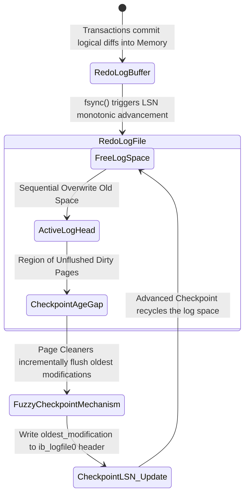

# 04: Giải phẫu Kiến trúc InnoDB: Quản lý Page Flushes, Checkpoints và Doublewrite Buffer tại Giới hạn Phần cứng

## Tóm tắt Điều hành & Tuyên bố Vấn đề

Với những hệ thống RDBMS vận hành ở quy mô rất lớn, câu hỏi kinh điển vẫn luôn tồn tại: làm sao giữ đủ bốn tính chất ACID mà vẫn khai thác được tối đa thông lượng I/O của phần cứng? Đây là bài toán nằm ở tận gốc rễ của kỹ thuật hệ thống, bởi nó chạm vào một nghịch lý cơ học không thể tránh - tốc độ của thiết bị lưu trữ tĩnh (flash, đĩa từ) và tốc độ xung nhịp CPU vốn dĩ lệch nhau nhiều bậc độ lớn.

Để che giấu độ trễ truy xuất vật lý - vốn chậm hơn L1/L2 cache từ hàng nghìn đến hàng triệu lần - engine InnoDB của MySQL dựng lên một không gian bộ nhớ ảo hóa khá phức tạp gọi là **Buffer Pool**. Nhưng đặt dữ liệu trong RAM đồng nghĩa chấp nhận một rủi ro cố hữu: RAM dễ bay hơi. Chỉ một cú sụt điện áp hay một lần kernel panic cũng đủ khiến những giao dịch tưởng đã commit thành công biến mất không dấu vết.

Đứng trên nền tảng phục hồi ARIES, InnoDB vận hành một hệ thống khép kín, phối hợp bởi ba cơ chế:
1. **Adaptive Page Flushing:** xoay vòng và giải phóng RAM một cách có kiểm soát, tránh gây sốc I/O.
2. **Fuzzy Checkpointing:** quản lý vòng đời của redo log, giữ thời gian phục hồi trong giới hạn chấp nhận được.
3. **Doublewrite Buffer:** chặn đứng nguy cơ phân mảnh dữ liệu vật lý (torn page) ngay ở tầng thiết bị khối.

Bài viết này mổ xẻ vi kiến trúc InnoDB: các mô hình toán học giới hạn tài nguyên, thuật toán tự điều chỉnh kiểu PID cho việc flush trang, và những tác động thực tế lên phần cứng I/O. Ta cũng sẽ xem cách InnoDB (từ bản 5.7 tới 8.0 trở lên) nói chuyện trực tiếp với ổ NVMe qua `O_DIRECT`, bỏ qua OS page cache, để lấy thêm phần thông lượng còn sót lại.

---

## Vi Kiến Trúc Buffer Pool và Bài toán Tranh chấp Đa lõi

InnoDB tổ chức RAM khả dụng thành các trang kích thước cố định, mặc định 16KB - con số này được chọn để ăn khớp với hệ số rẽ nhánh của cấu trúc B+Tree dùng trong clustered index.

### Cấu trúc Liên kết Đa chiều của Buffer Pool

Khi hệ thống đang chạy, Buffer Pool không phải một mảng byte đơn giản mà là một mạng lưới các danh sách liên kết, mỗi danh sách được bảo vệ riêng bằng latch và mutex.
1. **Free List:** các khung trang còn trống, chờ nhận dữ liệu nạp từ đĩa.
2. **LRU List:** quản lý các trang đang giữ dữ liệu, dù sạch hay bẩn. InnoDB dùng biến thể LRU gọi là Midpoint Insertion Strategy, chia danh sách thành *New Sublist* (5/8 dung lượng) và *Old Sublist* (3/8). Trang vừa đọc từ đĩa bởi một lượt full table scan sẽ vào Old Sublist trước tiên, và bị loại ngay nếu không ai đụng tới nữa - đây là cách InnoDB tránh để một câu quét lớn quét sạch cache của mọi người khác.
3. **Flush List:** danh sách liên kết đôi, giữ thứ tự các trang bẩn nghiêm ngặt theo LSN thay đổi cũ nhất.

### Nút thắt Cổ chai Buffer Pool Mutex

Khi số kết nối đồng thời lên tới hàng chục nghìn, việc các luồng chạm vào những danh sách này cần khóa bảo vệ (Buffer Pool Mutex). Ở MySQL 5.5 trở về trước, cả Buffer Pool chỉ có một mutex duy nhất canh giữ - và hệ quả là tranh chấp CPU rất nặng nề.

Từ MySQL 5.6, và rõ hơn nữa ở 8.0, InnoDB đưa vào **Buffer Pool Instances**: chia Buffer Pool thành nhiều vùng độc lập (thường khớp với số lõi CPU) thông qua hàm băm $f(PageID) = PageID \pmod{N}$. Xác suất va chạm khóa nhờ đó giảm theo bậc $N$ - đây chính là điều thực sự cho phép InnoDB mở rộng tốt trên máy chủ đa socket, kiến trúc NUMA.

---

## Adaptive Flushing và Cơ chế Điều Khiển kiểu PID

Mỗi lệnh DML (Insert/Update/Delete) chạm vào một bản ghi sẽ biến một trang sạch trong RAM thành trang bẩn.

Định lý Little quen thuộc trong lý thuyết hàng đợi áp dụng trực tiếp: $N = \lambda \times W$, trong đó $N$ là số trang bẩn, $\lambda$ là tốc độ sinh chúng, $W$ là thời gian chúng còn nằm trong bộ nhớ. Khi $N$ tiến gần 100% dung lượng Buffer Pool thì không còn trang trống, và mọi `SELECT` cần đọc từ đĩa buộc phải chờ một đợt sync flush dọn chỗ trước. Đó là lúc thông lượng của cả hệ thống rơi thẳng đứng.

### Sự Ra đời của Adaptive Flushing

Các bản InnoDB đời cũ để luồng dọn dẹp gần như ngủ suốt, chỉ bắt đầu xả trang khi tỷ lệ trang bẩn vượt ngưỡng cứng `innodb_max_dirty_pages_pct`. Kết quả là những đợt I/O burst rất lớn, khiến đồ thị hiệu năng trông như răng cưa - êm rồi lại khựng, cứ thế lặp lại.

**Adaptive Flushing** ra đời để khắc phục điều đó, hoạt động na ná một bộ điều khiển PID: một vòng phản hồi nhỏ, liên tục lấy số liệu telemetry để làm phẳng đường cong I/O thay vì để nó tăng vọt từng đợt.

Cường độ flush mỗi giây, $P_{flush}(t)$, được tính từ một phương trình vi phân mô phỏng tốc độ tiêu thụ redo log song song với tỷ lệ trang bẩn hiện tại.

Nếu tốc độ sinh log giao dịch là đạo hàm $V_{redo} = \frac{d(LSN)}{dt}$, và Checkpoint Age định nghĩa là:
$$A_{checkpoint}(t) = LSN_{current}(t) - LSN_{flushed}(t)$$

thì khối lượng I/O cần phát sinh được nội suy theo công thức:

$$P_{flush}(t) = \kappa \cdot \left[ \frac{d}{dt} A_{checkpoint}(t) \right] + \xi \cdot \left( \frac{N_{dirty}(t)}{N_{total\_pages}} \right)^\tau \cdot IO_{capacity}$$

Trong đó:
* $\kappa, \xi, \tau$ là các hệ số điều chỉnh dựa trên số liệu thực nghiệm.
* $IO_{capacity}$ là mức băng thông khai báo qua `innodb_io_capacity`.

Khi $A_{checkpoint}$ tiến sát ngưỡng $A_{max\_capacity}$, bộ điều khiển chuyển sang chế độ bất đối xứng gọi là **Furious Flushing**: bỏ qua toàn bộ giới hạn IOPS đã cấu hình, ép trang xuống đĩa bằng mọi giá miễn cứu được hệ thống khỏi bị treo cứng.

```cpp
// Pseudocode mô phỏng hạt nhân thuật toán bộ điều khiển Adaptive Flusher trong InnoDB 8.0
class AdaptiveFlusherController {
private:
    double alpha_weight, beta_weight, gamma_exponent;
    uint64_t configured_io_capacity;
    uint64_t max_physical_iops;
    
    double compute_lsn_velocity(double current_checkpoint_age, double prev_checkpoint_age, double delta_time) {
        return (current_checkpoint_age - prev_checkpoint_age) / delta_time;
    }
    
public:
    uint64_t calculate_optimal_flush_rate(SystemTelemetryState telemetry) {
        double derivative_age = compute_lsn_velocity(telemetry.checkpoint_age, telemetry.prev_age, telemetry.dt);
        double dirty_saturation_ratio = static_cast<double>(telemetry.dirty_pages) / telemetry.total_pages;
        
        // Mô hình PID lai (Proportional-Derivative)
        double theoretical_flush_target = alpha_weight * derivative_age + 
                                          beta_weight * std::pow(dirty_saturation_ratio, gamma_exponent) * configured_io_capacity;
                                          
        double absolute_max_age = telemetry.max_redo_capacity * 0.85; // Safety margin 85%
        
        if (telemetry.checkpoint_age > absolute_max_age) {
            // Chế độ Furious Flushing
            return max_physical_iops;
        }
        
        return std::min(static_cast<uint64_t>(theoretical_flush_target), configured_io_capacity);
    }
};
```

---

## Mô Hình Toán Học của Checkpointing và LSN Đa Luồng

Khả năng chịu sập nguồn của InnoDB đứng vững nhờ nguyên lý write-ahead logging: mọi thay đổi vật lý trong RAM phải được ghi vào redo log trước khi trang dữ liệu tương ứng được chạm tới data file (`.ibd`).

### Không gian Vòng Log và Log Sequence Number (LSN)

Bộ điều khiển log nội bộ coi không gian đĩa như một vùng đệm hình vòng. Trục thời gian trong thế giới này được đo bằng Log Sequence Number (LSN) - một bộ đếm byte tăng đơn điệu không ngừng.

Mục đích cốt lõi của cơ chế checkpoint là thu hồi và cho phép ghi đè lên các byte log đã lỗi thời, đồng thời đóng một mốc neo bền vững để quá trình phục hồi có điểm khởi đầu rõ ràng.

### Fuzzy Checkpointing so với Sharp Checkpoint

InnoDB tránh hẳn mô hình **Sharp Checkpoint** - đóng băng toàn bộ I/O và xả hết dữ liệu cùng lúc - vì cách này chỉ khiến hệ thống treo cứng. Thay vào đó, nó dùng **Fuzzy Checkpointing**.

Các luồng Page Cleaner chạy nền liên tục lấy ra một lượng nhỏ trang bẩn từ đuôi Flush List (nơi giữ các trang có LSN `oldest_modification` nhỏ nhất) rồi xả xuống đĩa. Khi một mẻ trang cũ nhất đã tới đĩa, hệ thống cập nhật giá trị $Checkpoint\_LSN$ trong header của `ib_logfile0`.

Giới hạn toán học của checkpoint được biểu diễn:

$$\Delta LSN(t) \le L_{max\_capacity} \times \phi_{safety\_margin}$$

với $\phi_{safety\_margin} \approx 0.85$. Nếu tốc độ ghi của ứng dụng vượt quá mức này, đẩy $\Delta LSN(t)$ qua Synchronous Flush Watermark, InnoDB buộc phải bật một khóa toàn cục (global spin-lock), chặn mọi giao dịch ghi để redo log ring không bị ghi đè trước khi kịp an toàn. Việc tránh chạm ngưỡng này - thường bằng cách đặt `innodb_log_file_size` đủ lớn - là phần việc thuộc về người thiết kế hệ thống.



---

## Vi Kiến Trúc Doublewrite Buffer: Lá Chắn trước Partial Page Write

Có một khoảng lệch khá cơ bản giữa kích thước block mà một cơ sở dữ liệu giả định và kích thước block mà phần cứng thực sự đảm bảo. Chính khoảng lệch này lại là một trong những điểm mong manh nhất của toàn bộ tầng lưu trữ.

Page size của InnoDB cố định ở 16KB. Trong khi đó Linux (VFS) và SSD/HDD bên dưới chỉ đảm bảo ghi nguyên tử ở mức sector (512 byte) hoặc page (4096 byte).

Khi kernel thực thi `pwrite()` cho một trang InnoDB 16KB, bộ lập lịch I/O khối (chẳng hạn `mq-deadline`) sẽ tách nó thành 4 mảnh 4KB độc lập. Nếu mất điện hay kernel panic xảy ra ngay khi mới có 1 hoặc 2 mảnh 4KB kịp ghi xuống đĩa, trang 16KB đó rơi vào trạng thái dở dang, hỏng cấu trúc - gọi là **Torn Page**, hay Partial Page Write.

Khi hệ thống khởi động lại, trang đó sẽ trượt kiểm tra CRC32c. Redo log cũng bó tay trong trường hợp này, bởi bản ghi redo vốn là các diff, chỉ áp dụng được lên một trang còn nguyên cấu trúc - áp một diff lên trang đã rách chỉ sinh thêm dữ liệu vô nghĩa. Kết quả cuối cùng là lỗi quen thuộc: *"Database Page Corruption"*.

### Kiến trúc Kép của Doublewrite Buffer (DWB)

Để loại bỏ hoàn toàn rủi ro này, InnoDB dùng một vùng đệm chuyên biệt gọi là Doublewrite Buffer, chấp nhận hy sinh một phần thông lượng ghi để đổi lấy tính toàn vẹn:

1. **DWB trong bộ nhớ:** nằm trong RAM, dung lượng 2MB, đủ chứa 128 trang 16KB.
2. **DWB trên đĩa:** vùng không gian tĩnh được cấp phát sẵn từ trước, xưa nay nằm trong `ibdata1`, nhưng từ MySQL 8.0.20 đã được tách ra thành các tệp `*.dblwr` riêng để giảm tranh chấp không gian với các cấu trúc khác.

**Cách hoạt động:**
Khi Page Cleaner gom các trang bẩn để xả xuống `*.ibd`:
- Bước 1: `memcpy` sao chép 128 trang bẩn vào vùng RAM của DWB.
- Bước 2: hệ thống phát một lệnh ghi tuần tự 2MB thẳng xuống vùng `*.dblwr` trên đĩa, đi kèm `fsync()` hoặc cờ `O_DIRECT`. Vì ghi tuần tự nên rất nhanh, và không đẩy write amplification của SSD lên cao.
- Bước 3: chỉ sau khi lệnh ghi DWB báo thành công, InnoDB mới rải từng trang riêng lẻ về đúng vị trí (ngẫu nhiên) của chúng trong các tệp tablespace.

Nếu mất điện đúng lúc bước 3, làm rách một trang trong tablespace, thì bản sao nguyên vẹn vẫn còn nằm yên trong DWB từ bước 2. Trong quá trình crash recovery, việc kiểm tra checksum sẽ phát hiện trang hỏng, và hệ thống chép bản sạch từ DWB đè lên nó, trước khi redo log bắt đầu roll-forward.

Xác suất cả hai bản sao - DWB và tablespace - cùng bị rách trong cùng một sự cố gần như bằng không:
$$P(\text{Fatal Corruption}) = P(\text{Fail\_DWB}) \cap P(\text{Fail\_Data}) \approx 0$$

### Tương lai của DWB: AWUPF và Filesystem Copy-on-Write

Trong thời đại cloud, Doublewrite Buffer - vốn khá cồng kềnh - đang dần bớt cần thiết nhờ hai hướng công nghệ mới:
1. **NVMe 1.4+ AWUPF (Atomic Write Unit Power Fail):** các SSD enterprise hiện đại đảm bảo ghi nguyên tử ở tầng phần cứng, lên tới 16KB hoặc 32KB, kể cả khi mất điện đột ngột, nhờ hệ tụ điện tích hợp sẵn trên bo mạch.
2. **Filesystem copy-on-write (ZFS, Btrfs):** những hệ thống này không bao giờ ghi đè lên block cũ. Chúng viết phiên bản mới vào vùng trống rồi chỉnh lại con trỏ metadata - nên torn write không bao giờ chạm được tới phiên bản cũ vẫn còn hợp lệ.

Trên những hạ tầng như vậy, đặt `innodb_doublewrite=0` là lựa chọn hợp lý. Việc tắt DWB loại bỏ hẳn một lượt ghi phụ, ngay lập tức giải phóng khoảng 50% chi phí I/O vật lý vốn đang đè nặng lên mỗi lần flush xuống flash storage.

```rust
// Mã giả trừu tượng logic phục hồi nguyên tử của Doublewrite Buffer
struct DoublewriteBufferManager {
    dwb_disk_region: FileSegmentController,
    tablespace_region: DataFilesController,
}

impl StorageEngineRecovery for DoublewriteBufferManager {
    fn execute_crash_recovery_phase_one(&mut self) -> Result<(), CriticalSystemError> {
        let in_memory_dwb_snapshot = self.dwb_disk_region.load_entire_2mb_region();
        
        for page_id in self.tablespace_region.get_all_registered_pages() {
            let user_data_page = self.tablespace_region.read_raw_16kb_page(page_id);
            
            if !user_data_page.verify_crc32c_checksum() {
                log_warning!("Phát hiện Torn Page tại LBA offset: {:?}. Kích hoạt chế độ quét DWB...", page_id);
                
                if let Some(valid_dwb_page) = in_memory_dwb_snapshot.search_page_by_id(page_id) {
                    if valid_dwb_page.verify_crc32c_checksum() {
                        // Kích hoạt phục hồi nguyên tử: đè trang nguyên vẹn từ DWB lên trang bị hỏng
                        self.tablespace_region.overwrite_corrupted_page_with_fsync(page_id, valid_dwb_page)?;
                        log_info!("Trang dữ liệu {:?} đã được phục hồi thành công từ cấu trúc DWB.", page_id);
                    } else {
                        panic!("Lỗi không thể phục hồi (Fatal Error): Cấu trúc trang sụp đổ trên cả hai thiết bị lưu trữ!");
                    }
                }
            }
        }
        
        // Hoàn thành pha một an toàn, tiếp tục chuyển sang pha hai: Roll-Forward
        self.apply_write_ahead_redo_logs()?;
        Ok(())
    }
}
```

## Bài Học Kinh Nghiệm (Lessons Learned)

Dành cho các kỹ sư dữ liệu và kiến trúc sư hệ thống:
1. **Tinh chỉnh Adaptive Flusher đòi hỏi kinh nghiệm thực chiến, không phải công thức có sẵn.** `innodb_io_capacity` và `innodb_io_capacity_max` cần phản ánh khoảng 70-80% năng lực IOPS ghi ngẫu nhiên thực đo được của SSD (dùng `fio` để đo thay vì đoán). Đặt quá thấp, trang bẩn sẽ chất đống. Đặt quá cao, việc flush sẽ giành hết băng thông I/O của các SELECT thông thường.
2. **Buffer Pool Instances gần như là điều kiện bắt buộc trên máy nhiều lõi.** Đừng chạy MySQL trên máy 16+ core mà vẫn để `innodb_buffer_pool_instances` bằng 1. Đặt giá trị này theo số lõi hay vCPU (8, 16, 32...) để phá bỏ nút thắt tranh chấp mutex.
3. **Theo dõi Checkpoint Age một cách nghiêm túc.** Nếu database thỉnh thoảng đứng hình 1-2 giây mỗi khi tải tăng đột biến, gần như chắc chắn tốc độ nạp dữ liệu đã vượt khả năng xử lý của redo log, buộc hệ thống kích hoạt Synchronous Flush. Đặt `innodb_log_file_size` đủ lớn (MySQL 8.0 đã tự động hóa phần lớn việc này qua cơ chế resized redo log) để $\Delta LSN(t)$ có đủ dư địa.
4. **Cân nhắc AWUPF và việc tắt DWB.** Trên SSD enterprise hiện đại, hoặc ZFS có ZIL, tắt Doublewrite Buffer (`innodb_doublewrite=0`) có thể tiết kiệm khoảng một nửa tuổi thọ ghi (TBW) của SSD và gần như tăng gấp đôi thông lượng ghi thực tế.
