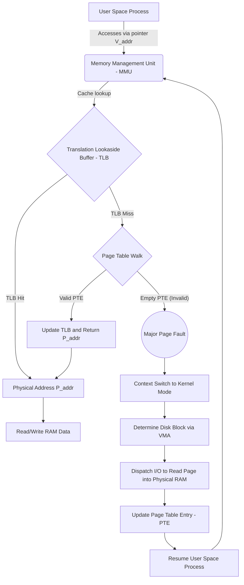

# Exploring Memory-Mapped Files (mmap): The Micro-Architectural Foundation and the Fatal Decision Behind MongoDB's MMAPv1

## Executive Summary & Problem Statement

Looking back at the history of database engines, one decision keeps showing up as the fork in the road that determines a system's fate: how it manages caching and physical storage. The first generation of NoSQL databases — MongoDB's original MMAPv1 engine being the clearest example — took a shortcut that looked brilliant at first and turned out to be a slow-motion liability: hand off all of I/O and memory management to the OS kernel via memory-mapped files (`mmap`).

That shortcut bought MongoDB an incredible pace of early development. But once the data outgrew RAM and reached terabyte scale, and concurrent write volume climbed into the hundreds of thousands, the whole `mmap`-based model started to buckle. Database-wide locks, page fault thrashing that froze entire threads, storage fragmentation — all of it surfaced at once.

**The core problem:** the kernel is a general-purpose memory manager. It has no idea what a B-Tree root node is, or which pages matter more than others to your query workload. Leave page eviction to a generic algorithm like LRU, and sooner or later a critical index node gets swapped out to disk, triggering a page fault that stalls the entire processing thread.

This piece walks through the mechanics of `mmap`, uses Amdahl's Law to show mathematically why multi-threaded performance collapsed under this model, dissects exactly how MMAPv1 died, and explains why moving to a self-managed engine like **WiredTiger** — with MVCC and a user-space buffer pool — wasn't just an upgrade, it was survival.

---

## The Micro-Architectural Mechanism of Memory-Mapped Files (mmap)

Memory-mapped files — the `mmap` syscall in POSIX — let the contents of a file on disk get mapped directly into a process's virtual address space, bypassing `read()`/`write()` entirely. Once mapped, a process touches the file the same way it would touch an ordinary byte array in RAM, through plain pointers.

### The Virtual Mapping Setup Process

When a process calls `mmap()`, the kernel does **not** perform any disk I/O right away. It just sets up a new Virtual Memory Area (VMA) — a record saying the virtual address range from $V_{start}$ to $V_{end}$ corresponds to a particular file on disk.

This mapping leans heavily on the multi-level page table and the Translation Lookaside Buffer (TLB) inside the CPU's Memory Management Unit (MMU).

Mathematically, this is a transformation from virtual space $\mathcal{V}$ to physical space $\mathcal{P}$, mediated by the block device $\mathcal{D}$. For a page of size $S_{page}$ (typically 4KB) at virtual address $V_{addr}$, the physical address $P_{addr}$ isn't resolved until a page fault actually happens. With $\mathcal{F}$ as the address resolution function:

$$ P_{addr} = \mathcal{F}(V_{addr}) = P_{base} + (V_{addr} \pmod{S_{page}}) $$

### Anatomy of the Page Fault and Its Latency Penalty

At the core of `mmap` sits **Demand Paging**, driven by **Major Page Faults**.

When code dereferences a pointer into the $V_{addr}$ range and the backing physical page hasn't been loaded yet, the MMU comes up empty in the page table and raises a hardware exception, handing control to the kernel.

The Major Page Fault sequence:
1. **Context Switch:** the process gets suspended.
2. **Kernel VMA Lookup:** the kernel figures out which file and offset the faulting address maps to.
3. **I/O Fetch:** the kernel grabs a free RAM page frame and issues a DMA transfer to pull the data in from disk.
4. **PTE Update:** the page table entry gets updated to point $V_{addr}$ at the freshly loaded RAM page.
5. **Resume:** control returns and the process re-executes the memory access.



From an I/O math standpoint, this path is brutally expensive. Let $T_{L1}$ be L1 cache latency (1ns), $T_{RAM}$ be RAM latency (100ns), and $T_{disk}$ be disk latency (100µs for NVMe, 5ms for a spinning disk). Let $P_{fault}$ be the probability that any given access triggers a page fault.

Expected access time works out to:
$$ E[T_{access}] = (1 - P_{fault}) \cdot T_{RAM} + P_{fault} \cdot T_{disk} $$

Because $T_{disk} \gg T_{RAM}$ — a gap of $10^3$ to $10^5$ — even a tiny $P_{fault}$ of 0.01 tanks performance by orders of magnitude. A single scan query is enough to turn a database process into a machine that does nothing but context-switch.

### The "Zero-Copy" Illusion of mmap

Despite the page fault tax, `mmap` sold early systems on an attractive illusion: zero-copy reads and writes.
With plain `read()`, data flows Disk → Kernel Page Cache → User Buffer.
With `mmap`, the kernel page cache *is* the user buffer — the application reads and writes straight into it.

That let MongoDB's original engine team move fast. No buffer pool to build, no LRU eviction to manage, no background flushing algorithm to write — the kernel handled all of it. For a startup racing to ship, that was a real edge.

The debt just came due later.

```c
// Pseudocode illustrating MongoDB MMAPv1's mmap illusion
#include <sys/mman.h>
#include <sys/stat.h>
#include <fcntl.h>

void* init_database_mmap(const char* db_file_path, size_t* out_size) {
    int fd = open(db_file_path, O_RDWR);
    struct stat sb;
    fstat(fd, &sb);
    
    // Ask the kernel to map the entire database into virtual space
    void* db_memory = mmap(NULL, sb.st_size, PROT_READ | PROT_WRITE, MAP_SHARED, fd, 0);
    
    *out_size = sb.st_size;
    close(fd); // The OS keeps the mapping alive even after fd is closed
    
    return db_memory;
    // From here, MongoDB accesses the B-Tree and Documents via raw C++ pointers straight into db_memory
}
```

---

## Anatomy of MongoDB MMAPv1: Architecture, Quantitative Limits, and Blind Spots

In MMAPv1 (the default engine through version 3.0), every physical MongoDB file was mapped straight into virtual space via the mechanism above.

### The Linear (Exponential) File Allocation Rule
MMAPv1 numbers its data-file segments (`database.0`, `database.1`, ...). Each new file doubles the previous one's capacity, following a base-2 exponential up to a 2GB cap:
$$ S_i = \min(2^i \cdot 64 \text{ MB}, 2048 \text{ MB}) $$

The idea was to keep documents on contiguous disk extents, cutting seek time on spinning disks. Inside each file, extents hold a doubly linked list of BSON documents.

### The Dynamic Allocation Problem and Document Relocation
NoSQL documents have a flexible schema, which cuts both ways. A document that's 1KB today might balloon to 5KB tomorrow as the app pushes more data into its internal arrays.

If the space right next to a document is already taken, an update triggers what's known as **Document Relocation**:
1. MongoDB requests a fresh 5KB region elsewhere.
2. It `memcpy`s the whole document there.
3. It frees the old 1KB region — fragmentation, right there.
4. It has to update EVERY LEAF NODE in EVERY INDEX to point at the new physical address.

Dynamic padding was added later to pre-reserve some slack space, but it burns a lot of extra storage and doesn't eliminate the ripple I/O risk, just softens it.

### The Amdahl's Law Bottleneck: The Database-Level Lock

Because RAM is accessed via raw C++ pointers, thread safety gets expensive fast. MMAPv1 started with a single global reader-writer lock across the whole process, later relaxed to a database-level lock.

In practice, that meant a write to the `Users` collection locked the entire database — `Orders`, `Products`, everything — while it ran. Nobody else could read or write anything.

Amdahl's Law spells out exactly how bad this gets. Let $P$ be the fraction of execution time that runs in parallel, and $S = 1 - P$ the sequential portion spent inside the lock's critical section. The best possible speedup on $N$ cores is:
$$ \text{Speedup}(N) = \frac{1}{(1 - P) + \frac{P}{N}} $$

With MMAPv1, one lock spans the whole database, so $1-P$ is large. As $N \to \infty$, the ceiling on speedup is:
$$ \lim_{N \to \infty} \text{Speedup}(N) = \frac{1}{1 - P} $$
Buying a 128-core box for a MMAPv1 deployment was, in practice, money wasted — 127 of those cores would just spin, waiting on the lock.

### The Page Fault Thrashing Nightmare and the "Yield" Surrender

The worst-case scenario is when a **Database Lock** collides with a **Major Page Fault**:
1. Thread $T_1$ grabs the write lock on the database.
2. $T_1$ tries to write to a document at virtual address $V_x$.
3. That physical page had quietly been swapped out to disk by the OS's LRU logic, which decided it wasn't used often enough.
4. $T_1$ page-faults and blocks, waiting maybe 10 milliseconds for the kernel to fetch the page back from disk.
5. For those entire 10 milliseconds, $T_1$ is STILL HOLDING THE WRITE LOCK.
6. Thousands of other connections freeze. The system appears to hang for no visible reason.

MongoDB's workaround was a yield mechanism: before touching memory, check via Linux's `mincore()` whether the target page is actually resident in RAM. If not, voluntarily release the lock, kick off a background page-in, and wait. It worked, in the sense that it avoided the worst outcomes, but it turned the concurrency model into a tangle of edge cases that was hard to reason about.

---

## The Demise of MMAPv1 and the Shift to WiredTiger

As data volumes exploded, MMAPv1's core weakness became fatal: leaving memory management entirely to the kernel meant the database was blind to its own data. The OS has no concept of the difference between a B-Tree root node — which absolutely needs to stay pinned in RAM — and an old, rarely-touched document that's fine to push to disk.

### The MVCC and User-Space Compromise

MongoDB acquired WiredTiger in 2014, which marked a real shift in engineering philosophy. WiredTiger throws out `mmap`'s automatic handling entirely and builds its own **buffer pool** in user space.

That buys back full control: WiredTiger runs an LFU/LRU-variant eviction policy that's aware of the semantic hierarchy of the data, so B-Tree structure stays pinned in RAM where it belongs.

Instead of a blunt database-level lock, WiredTiger runs **Multi-Version Concurrency Control (MVCC)**. Writes never modify a row in place — they create a new version in RAM, linked via pointer chains. The payoff:
- Readers never block writers.
- Locking happens at the document level.
- The parallel fraction $P \approx 1$, so Amdahl's Law now lets WiredTiger actually use all 128 cores of that server.

### The Power of Block Compression

Dropping `mmap` also unlocked compression. Because `mmap` maps disk to RAM 1:1, on-disk data could never be compressed — doing so would break the byte-offset addressing the whole scheme depends on.

With an independent buffer pool, data sits decompressed in RAM while it's being worked on, but when the flusher writes it back down, WiredTiger runs the block through zstd or Snappy first.
The compression ratio $\mathcal{C}_{ratio} = \frac{S_{uncompressed}}{S_{compressed}}$ typically lands somewhere between 3x and 5x — which cuts storage cost, sure, but also multiplies effective I/O throughput, since far fewer bytes need to move for the same amount of information.

```rust
// Abstract pseudocode showing the superiority of a User-Space Buffer Pool (like WiredTiger)
struct BufferPoolManager {
    page_table: HashMap<LogicalPageId, FrameId>, // The DBMS's own private virtual mapping
    frames: Vec<PageFrame>,
    eviction_policy: Box<dyn EvictionAlgorithm>,
    wal_manager: WriteAheadLog,
}

impl BufferPoolManager {
    fn fetch_page(&mut self, page_id: LogicalPageId) -> Result<&mut PageData, DiskError> {
        if let Some(&frame_id) = self.page_table.get(&page_id) {
            // Cache Hit: update Semantic LFU
            self.eviction_policy.record_access(frame_id);
            Ok(self.frames[frame_id].get_data_mut())
        } else {
            // Cache Miss: the DBMS coordinates I/O itself — no Kernel Interrupt / stalled Page Fault!
            let frame_id = self.evict_oldest_document_page()?; 
            
            // Use O_DIRECT + Async I/O (io_uring) to pull the data up
            let compressed_data = disk_manager.async_read_page(page_id)?;
            let raw_data = snappy::decompress(compressed_data);
            
            self.frames[frame_id].fill(raw_data);
            self.page_table.insert(page_id, frame_id);
            Ok(self.frames[frame_id].get_data_mut())
        }
    }
}
```

### Conclusion

MMAPv1's death wasn't a story about bad engineering — it's really just proof that systems software goes through a predictable lifecycle. `mmap` did exactly what it needed to do in its time: it let MongoDB ship fast, win developers over, and become the face of the Web 2.0 database boom.

But once workloads moved into serious multi-threaded, microservices-scale territory, the underlying math of bandwidth and lock contention wasn't something you could talk your way around. By reclaiming user space with WiredTiger's MVCC, an independent buffer pool, and block compression, MongoDB turned itself from an early NoSQL experiment into a datastore that could actually carry transactional, enterprise-grade workloads.

The lesson that sticks: never hand off your application's core semantic knowledge to a general-purpose kernel that has no idea what any of your data actually means.
