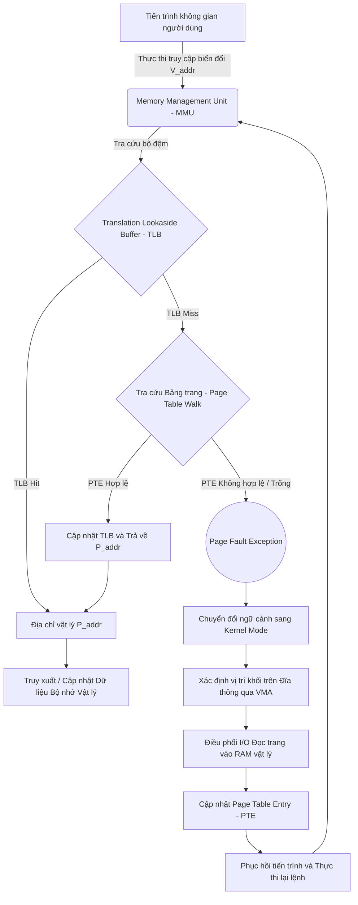
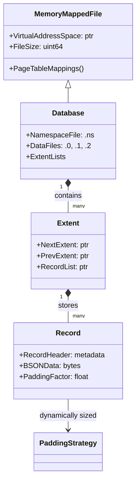

# Phân tích Chuyên sâu về Memory-Mapped Files (mmap): Nền tảng Vi kiến trúc và Quyết định Loại bỏ MMAPv1 của MongoDB

## Khái niệm và Cơ chế Hoạt động Vi kiến trúc của Memory-Mapped Files (mmap)

Memory-Mapped Files, thường được gọi thông qua system call `mmap` trong các hệ điều hành tuân thủ chuẩn POSIX, đại diện cho một cơ chế quản lý bộ nhớ ở mức nhân (kernel), cho phép ánh xạ trực tiếp một tập tin trên đĩa vật lý vào không gian bộ nhớ ảo (virtual memory space) của một tiến trình. Phương pháp tiếp cận này loại bỏ sự cần thiết của các lời gọi hệ thống đọc và ghi truyền thống như `read()` và `write()`, thay vào đó ủy quyền toàn bộ trách nhiệm phân bổ và đồng bộ hóa dữ liệu cho hệ thống quản lý bộ nhớ ảo (Virtual Memory Manager - VMM) của hệ điều hành. Dưới góc độ vi kiến trúc, khi một tiến trình thực thi lời gọi `mmap()`, hạt nhân hệ điều hành không ngay lập tức tải toàn bộ dữ liệu từ đĩa cứng vào bộ nhớ vật lý (RAM). Thay vào đó, nó cấu trúc một vùng nhớ ảo (Virtual Memory Area - VMA) mới trong không gian địa chỉ ảo của tiến trình, và cập nhật bảng trang (Page Table) tương ứng, thiết lập một ánh xạ lỏng lẻo giữa địa chỉ ảo và các khối logic trên thiết bị lưu trữ. Phương trình toán học biểu diễn ánh xạ này có thể được mô tả qua phép biến đổi địa chỉ ảo thành địa chỉ vật lý, nơi mà không gian ảo $\mathcal{V}$ được ánh xạ sang không gian vật lý $\mathcal{P}$ kết hợp với không gian thiết bị khối $\mathcal{D}$. Nếu một trang bộ nhớ kích thước $S_{page}$ (thường là 4KB) nằm tại địa chỉ ảo $V_{addr}$, địa chỉ vật lý tương ứng $P_{addr}$ chỉ được xác định khi xảy ra lỗi trang (page fault). Gọi $\mathcal{F}: \mathcal{V} \rightarrow \mathcal{P} \cup \mathcal{D}$ là hàm phân giải địa chỉ, ta có $P_{addr} = \mathcal{F}(V_{addr}) = P_{base} + (V_{addr} \pmod{S_{page}})$. Sự kiện ánh xạ này phụ thuộc mật thiết vào cấu trúc phân cấp của bảng trang đa mức (multi-level page table) và cơ chế bộ đệm chuyển đổi địa chỉ (Translation Lookaside Buffer - TLB) nằm bên trong khối quản lý bộ nhớ (Memory Management Unit - MMU) của bộ vi xử lý.



Cơ chế xử lý lỗi trang (page fault mechanism) là trái Hình của việc thực thi `mmap`. Khi một luồng ứng dụng cố gắng truy cập vào một địa chỉ ảo $V_{addr}$ mà trang tương ứng chưa được tải vào bộ nhớ vật lý, MMU sẽ phát sinh một ngắt phần cứng gọi là "major page fault". Ngắt này buộc hệ điều hành đình chỉ tiến trình hiện tại, lưu trữ ngữ cảnh (context), và chuyển quyền điều khiển cho trình xử lý ngắt trong kernel. Kernel sử dụng thông tin từ VMA để xác định chính xác vị trí của khối dữ liệu trên đĩa cứng, sau đó yêu cầu bộ điều khiển thiết bị I/O thực hiện thao tác DMA (Direct Memory Access) để chép dữ liệu từ đĩa vào một khung trang (page frame) trống trong RAM. Quá trình này đòi hỏi độ trễ cực cao, thường ở mức độ mili-giây (milliseconds) đối với ổ cứng HDD truyền thống, hoặc hàng chục micro-giây (microseconds) đối với SSD NVMe, tạo ra một rào cản nghiêm trọng đối với hiệu suất thời gian thực. Giả sử thời gian trung bình để xử lý một truy cập bộ nhớ cache L1 là $T_{L1}$, và thời gian phục vụ một major page fault là $T_{fault}$. Chi phí trung bình cho mỗi lần truy cập bộ nhớ $E[T_{access}]$ có thể được biểu diễn bằng kỳ vọng toán học: $E[T_{access}] = (1 - P_{fault}) \cdot T_{L1} + P_{fault} \cdot T_{fault}$, trong đó $P_{fault}$ là xác suất xảy ra page fault. Vì $T_{fault} \gg T_{L1}$ (thường chênh lệch đến sáu hoặc bảy bậc độ lớn), ngay cả một giá trị $P_{fault}$ rất nhỏ cũng làm suy giảm thảm khốc hiệu suất tổng thể của hệ thống. Hơn nữa, việc sử dụng `mmap` phụ thuộc vào bộ đệm trang (Page Cache) của hệ điều hành, nơi nhân kernel tự động quyết định trang nào cần được giữ lại trong RAM và trang nào cần bị trục xuất (evicted) xuống đĩa swap hoặc xóa bỏ khi bộ nhớ đầy. Hệ điều hành thường áp dụng các thuật toán như LRU (Least Recently Used) biến thể, ví dụ như thuật toán Clock hoặc bộ nhớ đệm hai danh sách (Two-List Strategy trong Linux). Mặc dù các thuật toán này hoạt động tốt cho các kịch bản sử dụng tệp chung chung, chúng lại hoàn toàn thiếu tri thức ngữ nghĩa (semantic knowledge) về tầm quan trọng của các khối dữ liệu cụ thể trong bối cảnh của một hệ quản trị cơ sở dữ liệu (DBMS).

```c
// Mã giả minh họa cách một DBMS có thể ánh xạ vùng dữ liệu sử dụng mmap() trong C/C++
#include <sys/mman.h>
#include <sys/stat.h>
#include <fcntl.h>
#include <unistd.h>
#include <stdint.h>
#include <stdio.h>

void* map_database_file(const char* filepath, size_t* out_size) {
    int fd = open(filepath, O_RDWR);
    if (fd == -1) return NULL;
    
    struct stat sb;
    if (fstat(fd, &sb) == -1) {
        close(fd);
        return NULL;
    }
    
    // Yêu cầu Kernel cấp phát VMA nhưng chưa phân bổ trang vật lý ngay lập tức (MAP_SHARED)
    void* mapped_region = mmap(NULL, sb.st_size, PROT_READ | PROT_WRITE, MAP_SHARED, fd, 0);
    if (mapped_region == MAP_FAILED) {
        close(fd);
        return NULL;
    }
    
    *out_size = sb.st_size;
    close(fd); // File descriptor có thể đóng lại một cách an toàn sau khi mmap thành công
    return mapped_region;
}
```

Bất chấp sự thiếu hụt tri thức về dữ liệu ứng dụng, lợi ích mà `mmap` mang lại cho các hệ thống phần mềm đời đầu là không thể phủ nhận. Bằng cách sử dụng `mmap`, các ứng dụng tránh được sự tốn kém của thao tác sao chép bộ nhớ kép (double copying). Trong các phương thức I/O truyền thống, dữ liệu đầu tiên được DMA chuyển từ đĩa cứng vào bộ đệm của hạt nhân (Kernel Buffer Cache), sau đó vi xử lý phải thực hiện thao tác chép toàn bộ khối dữ liệu này sang không gian bộ nhớ của ứng dụng (User Space Buffer). Việc loại bỏ bản sao trung gian này giảm bớt đáng kể chu kỳ CPU bị lãng phí và độ trễ truy xuất. Đối với các kỹ sư xây dựng hệ thống cơ sở dữ liệu thời kỳ nguyên thủy, kiến trúc `mmap` cung cấp một con đường tắt vô cùng hấp dẫn: ủy thác hoàn toàn bộ phận "Buffer Pool" phức tạp cho nhân Linux hoặc Windows quản lý. Thay vì phải tự viết các cấu trúc dữ liệu khóa-đồng-hồ (clock hand algorithms), các cây quản lý trang trống, hay điều phối cơ chế ghi ngầm (background flushing), đội ngũ phát triển chỉ cần xem toàn bộ cơ sở dữ liệu như một mảng khổng lồ trên RAM. Các hàm con trỏ chuẩn trong ngôn ngữ C/C++ có thể thao tác trực tiếp lên các byte cấu thành tài liệu (document) hay bản ghi (record). Sự trừu tượng hóa mạnh mẽ này đã giảm thiểu hàng chục nghìn dòng mã hệ thống, là tiền đề cốt lõi giúp các hệ thống cơ sở dữ liệu thế hệ đầu như MongoDB có thể vươn lên nhanh chóng trong giai đoạn khởi thủy của hệ sinh thái NoSQL, bất chấp việc kiến trúc này ẩn chứa vô vàn hệ lụy tinh vi về mặt cấp phát khóa toàn cục và điều độ I/O.

## Kiến trúc Storage Engine MMAPv1 của MongoDB và Giới hạn Định lượng

Trong kiến trúc của MMAPv1, hệ thống lưu trữ mặc định của MongoDB từ những phiên bản đầu tiên cho đến tận phiên bản 3.0, mọi tệp dữ liệu vật lý được liên kết mật thiết và trực tiếp với không gian bộ nhớ ảo. Khung lưu trúc của MMAPv1 dựa trên khái niệm các tệp dữ liệu phân đoạn được đánh số tăng dần (ví dụ: `database.0`, `database.1`, `database.2`), trong đó mỗi tệp mới được cấp phát có dung lượng gấp đôi tệp trước đó, tuân theo quy luật tăng trưởng hàm số mũ cơ số 2 cho đến khi đạt mức giới hạn 2 Gigabytes. Mô hình cấp phát này được biểu diễn bởi công thức dung lượng của tệp thứ $i$: $S_i = \min(2^i \cdot 64 \text{ MB}, 2048 \text{ MB})$, trong đó $S_i$ là giới hạn phân bổ. Mục đích vi mô của thiết kế này là nhằm duy trì tính liên tục (contiguity) của các khối dữ liệu trên môi trường đĩa cứng quay truyền thống (HDD), nhằm giảm chi phí thời gian tìm kiếm (seek time) khi con trỏ từ tính di chuyển. Nội bộ các tệp dữ liệu này, không gian được chia thành các extent (vùng mở rộng), mỗi extent đại diện cho một danh sách liên kết đôi (doubly linked list) chứa đựng các bản ghi dữ liệu và các vùng đệm (padding). Việc cấp phát không gian trong MMAPv1 là một bài toán phân bổ động phức tạp mang tính rủi ro cao. Bất cứ khi nào một tài liệu (document) JSON (được biểu diễn dưới dạng BSON) trải qua một thao tác cập nhật (update) làm tăng tổng kích thước vượt quá giới hạn của vùng nhớ padding được chỉ định, MMAPv1 buộc phải di dời toàn bộ tài liệu sang một vị trí vật lý hoàn toàn mới trong bộ nhớ. Quá trình di dời này không chỉ đòi hỏi thao tác chép lại bộ nhớ lớn (memcpy) mà còn kích hoạt một chuỗi hiệu ứng gợn sóng (ripple effect), buộc hệ thống phải cập nhật lại tất cả các nút lá (leaf nodes) của cấu trúc cây B-Tree trong mọi chỉ mục (index) đang tham chiếu đến tài liệu này, dẫn đến một khối lượng lớn các phép ghi I/O không lường trước được.



Để bảo vệ tính toàn vẹn của dữ liệu trong môi trường đa luồng, MMAPv1 đã sử dụng các cấu trúc khóa (locks) vô cùng nguyên thủy. Giai đoạn sơ khai, MMAPv1 phụ thuộc vào khóa mức độ tiến trình (process-level lock) hay khóa cấp cơ sở dữ liệu (database-level lock). Có nghĩa là, một thao tác ghi cực nhỏ trên một collection bất kỳ cũng sẽ tước đoạt quyền truy cập của mọi luồng khác đang cố gắng đọc hoặc ghi vào cùng một cơ sở dữ liệu. Định luật Amdahl (Amdahl's Law) cung cấp một mô hình toán học rõ ràng minh họa cho sự suy giảm hiệu suất thảm hại trong kiến trúc này. Giả sử $P$ là tỷ lệ thời gian hệ thống có thể thực thi song song và $S$ là tỷ lệ bắt buộc phải thực thi tuần tự (trong trường hợp này, thời gian thực thi trong vùng tranh chấp khóa cơ sở dữ liệu). Theo định luật Amdahl, mức tăng tốc tối đa (Speedup) của một hệ thống có $N$ luồng xử lý được tính bằng: $\text{Speedup}(N) = \frac{1}{(1 - P) + \frac{P}{N}}$. Trong kiến trúc khóa toàn cục của MMAPv1, thành phần tuần tự $1 - P$ là vô cùng lớn, vì mọi thao tác thay đổi bộ nhớ đều phải đi qua chốt chặn đồng bộ (synchronization chokepoint) này. Khi số lượng luồng $N$ tiến tới vô cực, giới hạn trên của hiệu suất chỉ phụ thuộc hoàn toàn vào phần thời gian chờ khóa: $\lim_{N \to \infty} \text{Speedup}(N) = \frac{1}{1 - P}$. Việc cố gắng nâng cấp hệ thống phần cứng bằng cách thêm vào hàng chục lõi CPU (cores) trở nên hoàn toàn vô nghĩa, do các lõi này chỉ đơn thuần ở trong trạng thái quay vòng chờ (spin-waiting) để chiếm đoạt được Mutex lock. 

Sự phụ thuộc vào cơ chế ánh xạ `mmap` dẫn đến một hiện tượng suy giảm hiệu suất nghiêm trọng khác gọi là page fault thrashing. Khi tập dữ liệu thao tác (working set) của cơ sở dữ liệu vượt qua tổng dung lượng RAM vật lý có sẵn, hệ điều hành sẽ liên tục hoán đổi (swap) các trang bộ nhớ giữa RAM và đĩa. Tại cấp độ hạt nhân, hệ điều hành hoàn toàn không nhận thức được cấu trúc cây phân cấp (hierarchical tree structures) của các chỉ mục B-Tree hay các mối quan hệ đồ thị giữa các tệp của MMAPv1. Trình dọn dẹp trang của nhân (kswapd trong Linux) có thể quyết định xóa một nút gốc (root node) vô cùng quan trọng của cây B-Tree ra khỏi bộ nhớ vật lý chỉ vì nó không được truy cập trong một phần nghìn giây cuối cùng theo thuật toán LRU, trong khi giữ lại những tài liệu ngẫu nhiên không bao giờ được quét tới lần thứ hai. Khi một luồng của MongoDB tiếp tục duyệt cây chỉ mục, việc truy cập vào nút gốc bị thiếu này sẽ tạo ra một major page fault, đình trệ toàn bộ luồng. Cùng lúc đó, vì MMAPv1 vẫn đang nắm giữ khóa độc quyền (exclusive lock) hoặc khóa đọc/ghi (read/write lock) trong quá trình thao tác, việc luồng này bị đình trệ do I/O block có nghĩa là khóa đó bị giữ lại trên nhiều mili-giây, ngăn chặn toàn bộ các truy vấn từ hàng ngàn kết nối khác. Phương pháp duy nhất mà MongoDB thực hiện để giảm thiểu thảm họa này là chèn các lời gọi API kiểm tra trạng thái trang (ví dụ như `mincore` trong Linux) để dự đoán xem dữ liệu có trong RAM hay không và chủ động nhường CPU (yield). Quá trình nhường này giải phóng khóa tạm thời và yêu cầu một luồng nền tải trang đó vào (page-in background thread), một biện pháp vá víu cực kỳ tốn kém về mặt chuyển đổi ngữ cảnh và làm tăng độ phức tạp của biểu đồ trạng thái đồng thời (concurrency state machine).

## Đánh giá định lượng về Quản lý Bộ nhớ, Vấn đề Đồng thời và Sự chuyển dịch sang WiredTiger

Khi kỷ nguyên của dữ liệu lớn bùng nổ, sự bất cập của MMAPv1 trở thành rào cản chí mạng đối với vị thế của MongoDB. Sự phụ thuộc vô điều kiện vào OS kernel để xử lý việc trục xuất bộ nhớ (memory eviction) và đồng bộ đĩa cứng đồng nghĩa với việc không có một giao thức ghi log trước (Write-Ahead Logging - WAL) chuyên dụng nào có thể hoạt động tối ưu. Mặc dù MMAPv1 sau này đã tích hợp cơ chế Journaling, nó vẫn phải duy trì hai góc nhìn riêng biệt về bộ nhớ (bản sao chia sẻ mmap và bản sao riêng tư mmap-private) để quản lý dữ liệu chưa cam kết (uncommitted data). Giao thức này dẫn đến hiện tượng khuếch đại bộ nhớ (memory amplification) và yêu cầu việc ánh xạ lại file journal liên tục sau mỗi chu kỳ cam kết (commit interval), tạo ra gánh nặng lớn lên bộ xử lý quản lý bộ nhớ (MMU) trong việc xé bỏ và tái cấu trúc các mục nhập của TLB (TLB shootdowns trên các kiến trúc đa lõi NUMA). Mật độ của các giao dịch trên mỗi giây (Transactions Per Second - TPS) bị giới hạn nghiêm trọng bởi cấu trúc đồng bộ hóa thô sơ và thiếu tính nhất quán trong thời gian phục hồi sau sự cố (Crash Recovery). Phương trình thời gian phục hồi $T_{recovery}$ trong MMAPv1 tỷ lệ thuận một cách tàn nhẫn với quy mô tổng thể của các cấu trúc dữ liệu không hoàn chỉnh bị bỏ lại trên đĩa, khiến việc khôi phục một cụm bị sập nguồn (hard crash) có thể kéo dài hàng giờ đồng hồ do việc duyệt và kiểm tra tính toàn Hình của các danh sách liên kết mở rộng (extent linked lists).

```rust
// Mô phỏng siêu cấu trúc chuyển đổi sang hệ thống Buffer Pool độc lập (như WiredTiger)
struct BufferPoolManager {
    page_table: HashMap<PageId, FrameId>,
    frames: Vec<PageFrame>,
    free_list: Vec<FrameId>,
    eviction_policy: Box<dyn EvictionAlgorithm>,
    wal_manager: WriteAheadLog,
}

impl BufferPoolManager {
    fn fetch_page(&mut self, page_id: PageId) -> Result<&mut PageData, DiskError> {
        if let Some(&frame_id) = self.page_table.get(&page_id) {
            self.eviction_policy.record_access(frame_id);
            Ok(self.frames[frame_id].get_data())
        } else {
            // Lỗi trang được xử lý nội bộ tại User Space, không gây ngắt cứng Kernel!
            let frame_id = self.evict_and_allocate()?;
            let data = disk_manager.read_page_sync(page_id)?;
            self.frames[frame_id].fill(data);
            self.page_table.insert(page_id, frame_id);
            Ok(self.frames[frame_id].get_data())
        }
    }
}
```

Quyết định loại bỏ hoàn toàn MMAPv1 và thâu tóm WiredTiger của MongoDB đánh dấu một sự chuyển mình về mặt triết học kỹ thuật vi kiến trúc. WiredTiger hoàn toàn chối bỏ cơ chế tự động của `mmap` đối với dữ liệu cốt lõi, thay vào đó thực thi một Buffer Pool chuyên dụng nằm hoàn toàn trong không gian bộ nhớ người dùng (user space). Cấu trúc này cho phép cơ sở dữ liệu có toàn quyền sinh sát đối với vòng đời của từng trang nhớ. Thông qua thuật toán LFU (Least Frequently Used) kết hợp với nhận thức về phân cấp (hierarchy awareness), WiredTiger luôn bảo vệ các nút gốc nội tại của cấu trúc dữ liệu (B-Tree nodes) khỏi việc bị đẩy xuống đĩa, trong khi nhanh chóng loại bỏ các trang dữ liệu chỉ được đọc một lần trong chu kỳ phân tích. Mô hình điều khiển truy cập đồng thời đa phiên bản (Multi-Version Concurrency Control - MVCC) của WiredTiger thay thế các chốt chặn khóa thô bạo (coarse-grained locks) của MMAPv1 bằng cấu trúc không khóa (lock-free) ở cấp độ tài liệu (document-level concurrency). Bằng cách duy trì nhiều phiên bản của một tài liệu trong RAM sử dụng cấu trúc chuỗi con trỏ (pointer chains), các truy vấn đọc không bao giờ chặn các truy vấn ghi, và các thao tác ghi trên các tài liệu khác nhau diễn ra độc lập và song song tuyệt đối. Tỷ lệ tăng tốc trong hệ thống đa luồng giờ đây tiệm cận với kịch bản lý tưởng của Định luật Amdahl, nơi $P \approx 1$. Hiệu suất tính toán được tận dụng triệt để thông qua cơ chế nén khối linh hoạt (block compression), sử dụng thuật toán như Snappy hay zstd ngay trước khi I/O vật lý diễn ra. Hệ số nén $\mathcal{C}_{ratio} = \frac{S_{uncompressed}}{S_{compressed}}$ có thể đạt tới 4x hoặc 5x, không chỉ giúp tiết kiệm dải thông đĩa cứng (disk bandwidth) mà còn tăng mật độ thông tin chứa trong các trang bộ đệm trong RAM, nâng cao tỷ lệ trúng bộ nhớ đệm (cache hit ratio).

Sự khác biệt về toán học giữa việc sử dụng `mmap` phân bổ lười biếng (lazy allocation) và kiến trúc Log-Structured Merge Tree (LSM) hay B-Tree được điều chỉnh tối ưu bằng WAL của WiredTiger cho thấy rõ tại sao không có một hệ quản trị cơ sở dữ liệu phân tán (Distributed DBMS) hiện đại nào còn duy trì sự phụ thuộc vào VMM của nhân hệ điều hành cho đường truyền dữ liệu (data path) chính yếu. Bằng cách lấy lại quyền kiểm soát bộ nhớ, MongoDB có khả năng thiết lập các ranh giới cứng (hard limits) cho việc sử dụng RAM (thường là $(RAM_{total} - 1 \text{ GB}) \times 50\%$), ngăn chặn triệt để sự cố hết bộ nhớ hệ thống (OOM kills) vốn là cơn ác mộng kinh niên của người dùng quản trị MMAPv1. Hơn nữa, việc tính toán checksum (mã băm toàn vẹn dữ liệu) tại lớp khối logic đảm bảo khả năng kháng lại sự suy thoái tĩnh của bit (bit rot) trên các ổ đĩa quang từ, một khả năng không thể hiện thực hóa trong mô hình đổ bóng bộ nhớ `mmap` nguyên sơ. Tổng kết lại, sự kết liễu của MMAPv1 không phải là sự phản bội lại một thiết kế tồi tệ, mà là một bước tiến hóa tất yếu trong hành trình nâng tầm MongoDB từ một kho dữ liệu NoSQL tối giản nguyên sơ thành một nền tảng lưu trữ giao dịch (transactional datastore) doanh nghiệp hoàn thiện, nơi độ trễ dự đoán được (predictable latency), hiệu năng đa luồng cực cao và sự nhất quán dữ liệu nguyên tử đóng vai trò sống còn.

## Tối ưu hóa Kiến trúc Cơ sở Dữ liệu & Storage Engine (SEO Section)
* Tìm hiểu sâu về Memory-Mapped Files (mmap), cơ chế ánh xạ bộ nhớ ảo trong hệ điều hành Linux và tác động của nó tới hiệu năng DBMS.
* Phân tích chuyên sâu kiến trúc storage engine MMAPv1 của MongoDB, giới hạn cấp phát khóa toàn cục (Global Lock) và tỷ lệ page fault thrashing.
* Khám phá lý do kỹ thuật đằng sau quyết định loại bỏ MMAPv1 để chuyển sang WiredTiger, tập trung vào mô hình MVCC (Multi-Version Concurrency Control) và quản lý Buffer Pool ở không gian người dùng.
* Cẩm nang thiết kế kiến trúc hệ thống lưu trữ phân tán, phân tích ưu nhược điểm giữa việc sử dụng bộ nhớ đệm Kernel và tự quản lý trang nhớ thông qua thuật toán thay thế LRU/LFU chuyên dụng.
* Đánh giá thuật toán cây B-Tree, cơ chế Write-Ahead Logging (WAL), và các kỹ thuật chống phân mảnh bộ nhớ vi kiến trúc cho các cơ sở dữ liệu NoSQL quy mô cực lớn.
