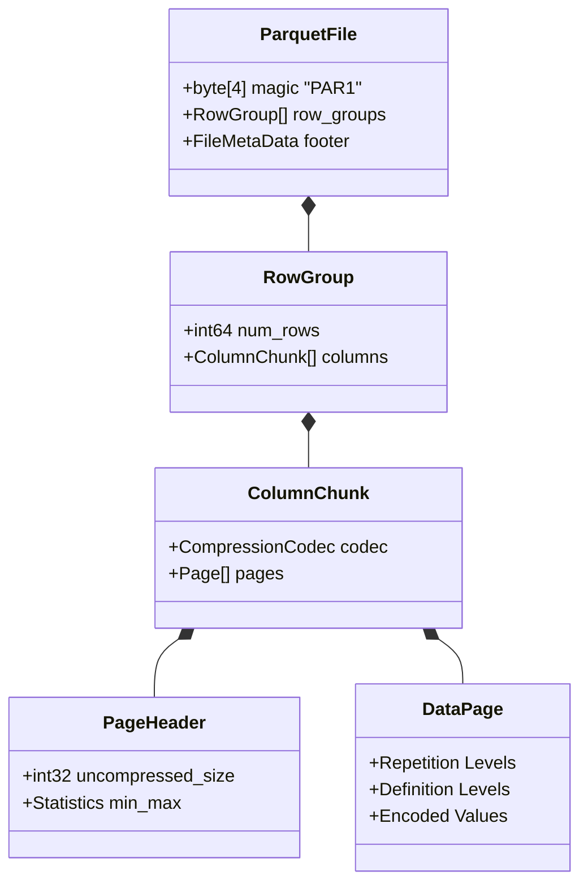

# Column-Oriented Storage: Anatomizing Parquet, the Dremel Algorithm, and ClickHouse MergeTree's Vectorized Engine

## Why Row Storage Breaks Down at Analytical Scale

The rise of Big Data exposed a physical limit that traditional relational database management systems were never built around. RDBMS engines were designed for transactional processing (OLTP), and they store data row by row — the row-oriented layout. That layout works well when a query touches every column of a handful of rows. It falls apart under online analytical processing (OLAP), where a query scans billions of records but only needs to compute over a handful of columns. Row-oriented storage, applied to that workload, wastes an enormous amount of I/O bandwidth and pollutes the CPU cache along the way.

The core problem is simple: memory bandwidth and disk I/O bandwidth are both finite resources. Loading an entire row just to compute a `SUM` or `COUNT` over one column can waste up to 90% of the data actually moved across the PCIe bus and the RAM bus.

Column-oriented storage — formally, the Decomposed Storage Model (DSM) — was the answer. By rearranging physical data so that values of the same attribute sit contiguously in memory, the storage engine unlocks much higher compression ratios and far better sequential I/O throughput.

This article works through that model in some depth: the micro-architecture of the Parquet and ORC file formats, the math behind Google's Dremel algorithm for nested data, the sparse-index design inside ClickHouse's MergeTree engine, and how vectorized execution (SIMD, AVX-512) turns all of this into raw throughput on modern CPUs.

---

## The Math Behind the Decomposed Storage Model

Traditional row-oriented storage — the N-ary Storage Model (NSM) — stores each record (tuple) as one contiguous block of bytes on disk.

Suppose a relation $R$ has $N$ records and $M$ independent attributes $A_1, A_2, ..., A_M$, where attribute $A_i$ occupies $S(A_i)$ bytes. Under NSM, computing an aggregate like `SUM(A_k)` requires loading every tuple in full. The I/O volume moved across the PCIe bus and RAM is:
$$ I/O_{NSM} = N \times \sum_{i=1}^{M} S(A_i) $$

DSM instead separates each column into its own linear array, so the physical I/O volume for the same query drops to:
$$ I/O_{DSM} = N \times S(A_k) $$

The gap between these two grows quickly as $M$ increases — real data warehouse tables commonly have hundreds of columns. Cutting I/O from gigabytes down to megabytes is what produces the thousand-fold speedups columnar engines are known for.

### Spatial Locality and Cache Lines

x86-64 CPUs don't read RAM byte by byte — they read in cache lines, 64 bytes by default.

- **Under NSM:** if a query only needs the `Age` column (4 bytes), the CPU still loads a full 64-byte cache line, dragging along 60 bytes belonging to unrelated columns like `Name` and `Address`. This is cache pollution, and it drags the cache-hit ratio down badly.
- **Under DSM:** a single 64-byte cache line holds exactly 16 consecutive `Age` values ($16 \times 4 = 64$). Every byte the CPU pulls in is useful. The hardware prefetcher recognizes the linear access pattern easily and stages the next cache lines ahead of time, pushing utilization close to 100%.

---

## Entropy and Column Compression

The physical layout of columnar storage opens the door to compression techniques that don't work nearly as well on row-oriented data. Claude Shannon's information theory defines the minimum expected number of bits needed to represent a random variable $X$ with probability distribution $P(x)$ as its entropy:
$$ H(X) = - \sum_{x \in \mathcal{X}} P(x) \log_2 P(x) $$

In DSM, values belonging to the same attribute tend to share a narrow value domain, so they're highly correlated and their entropy is low. That's exactly the condition lightweight, fast compression algorithms exploit at runtime:

1. **Run-Length Encoding (RLE).** If a column stores `Country` and the data is sorted, you'll see runs like `VN, VN, VN...` repeated $L$ times in a row. RLE collapses that run into a single tuple `(VN, L)`, dropping space complexity from $\mathcal{O}(L \times S(v))$ to $\mathcal{O}(\log_2 L + S(v))$.

2. **Dictionary Encoding.** Rather than storing the same long string repeatedly, the engine scans the column once, builds a dictionary mapping `String -> Integer`, and stores the physical data as a plain array of integers.

3. **Bit-Packing and Frame of Reference (FOR).** Suppose an integer column's values range from $1000$ to $1010$. FOR takes $Min = 1000$ as a reference point and stores each value as a delta $d_i = x_i - 1000 \in [0, 10]$. Representing $10$ only needs $\lceil \log_2 (10) \rceil = 4$ bits instead of a full 32-bit IEEE integer — so the engine packs eight such values into a single 32-bit block.

```cpp
#include <cstdint>
#include <cstddef>
// Register-level C++ function decoding (unpacking) a 3-bit Bit-Packed stream
void decode_3bit_packed_stream(const uint8_t* __restrict__ encoded, size_t num_values, uint32_t* __restrict__ output) {
    uint64_t bit_buffer = 0;
    uint32_t bits_in_buffer = 0;
    size_t byte_offset = 0;
    const uint32_t mask = 7; // (1<<3)-1 (binary 111)

    for (size_t i = 0; i < num_values; ++i) {
        while (bits_in_buffer < 3) {
            bit_buffer |= static_cast<uint64_t>(encoded[byte_offset++]) << bits_in_buffer;
            bits_in_buffer += 8;
        }
        output[i] = static_cast<uint32_t>(bit_buffer & mask);
        bit_buffer >>= 3;
        bits_in_buffer -= 3;
    }
}
```

---

## Inside Apache Parquet and ORC

Apache Parquet and Apache ORC (Optimized Row Columnar) are the de facto standards across the Hadoop and Spark ecosystem, built specifically to run well on HDFS and S3.

### Parquet's Three-Level Structure

Parquet's on-disk layout is a three-level decomposition:

1. **Row Group.** A macro-level partition, typically several hundred megabytes, containing a batch of records (say, a million rows). This is the unit Spark splits work across without creating a bottleneck.
2. **Column Chunk.** Within a Row Group, all the data for one column is stored contiguously.
3. **Page.** The smallest read/decompression unit, usually 1MB–8MB. RLE and bit-packing are applied independently within each page.



### Predicate Pushdown and the Trailing Footer

Parquet puts its metadata at the end of the file — the footer — which is the reverse of how most file formats are laid out. That means a query engine has to seek to the end of the file first to read the metadata, which includes a statistics matrix (min/max, null count) for every column chunk.

That's what makes predicate pushdown possible. Take a query like `SELECT * FROM table WHERE Age > 60`. The engine reads the footer and sees that Row Group 1's `Age` column has $Max = 55$. It can prune the entire Row Group immediately, without scanning or reading a single byte of that group's data. One cheap integer comparison saves hundreds of megabytes of I/O.

---

## The Dremel Algorithm: Encoding Nested Structures

Flat tables are the easy case. The real challenge in columnar storage is nested data — arrays, JSON, Protobuf. How do you store a column that holds a multi-dimensional array and still reconstruct its exact structure on read?

Parquet borrows the answer directly from Google's Dremel paper, attaching two small integers to every scalar value:

1. **Definition Level (DL).** Records the tree depth at which the structure goes missing (null), which lets the reader restore the null correctly at its actual parent element.
2. **Repetition Level (RL).** Marks array boundaries — the depth at which a repeated list starts a new element. When $RL = 0$, the reader knows a brand-new top-level record is starting.

When Parquet reads a file back, a small state machine uses these two levels to reassemble the flat, primitive values into a multi-level nested JSON tree without losing any structural information. Both RL and DL compress extremely well under RLE, so the overhead they add is minimal.

---

## ClickHouse MergeTree: Sparse Indexing and I/O at the Limit

Parquet is a passive file format meant for data sitting still. ClickHouse takes the same columnar idea and turns it into an active, low-latency database engine — its MergeTree table engine is built as an append-only structure.

MergeTree's physical design mirrors a Log-Structured Merge-Tree (LSM-Tree). Every `INSERT` gets flushed straight to disk as a new immutable Data Part, already decomposed into per-column `.bin` files. A background process continuously merges smaller parts into larger ones, using K-way streaming merges with $\mathcal{O}(N \log_2 K)$ complexity.

### Sparse Indexing and Granules

ClickHouse skips the B+Tree entirely. Instead it uses a sparse index built around a unit called a granule — exactly 8192 records. Rather than indexing every row, ClickHouse only records the primary key of the *first* row in each granule, in the `.idx` file.

The memory math works out nicely: a table with $10^{10}$ rows (10 billion records) and a granule size of 8192 needs a primary index array of only $10^{10} / 8192 \approx 1.22 \times 10^6$ entries. If the primary key is a `UInt64` (8 bytes), the entire index for 10 billion rows fits in about **9.7 megabytes** of RAM.

That's small enough to sit comfortably in the CPU's L3 cache. For a query like `WHERE Key = 12345`, ClickHouse runs a binary search over this flat array to find the right granule, then issues a DMA request to pull exactly that granule from the column files on disk. Seek time $T_{seek}$ approaches zero, and the query is free to push NVMe PCIe Gen 4/5 bandwidth (up to 14GB/s) right up against its physical ceiling.

---

## Vectorized Execution: Where the Performance Actually Comes From

What ties all of this together and pushes ClickHouse's performance ahead of most alternatives is its vectorized execution engine.

Traditional RDBMSs use the Volcano iterator model: every operator calls `next()` and processes one row at a time. Virtual function calls and branching on every row wreck the CPU's branch predictor.

ClickHouse instead moves data through the engine as blocks — contiguous arrays — which lets it fully exploit SIMD instruction sets like AVX-2 and AVX-512 on x86-64.

### The Branchless Hot Loop and AVX-512

AVX-512 gives you 512-bit ZMM registers. In a single clock cycle, the ALU can perform 16 operations on 16 pairs of 32-bit integers, fully in parallel.

Here's what a branchless filter looks like in practice:

```rust
use std::arch::x86_64::*;

/// Algorithm processing 16 parallel 32-bit integer scalar elements via AVX-512
#[target_feature(enable = "avx512f")]
pub unsafe fn vectorized_filter_greater_than_avx512(data: &[i32], threshold: i32, mask_out: &mut [u16]) {
    let len = data.len();
    let vec_threshold = _mm512_set1_epi32(threshold); // Broadcast the parameter across all 16 register lanes

    let mut i = 0;
    let mut mask_idx = 0;

    while i + 16 <= len {
        // Load 512 bits (16 x 32-bit integers) into a ZMM register
        let chunk = _mm512_loadu_si512(data.as_ptr().add(i) as *const __m512i);

        // The comparison directly returns a packed 16-bit mask (0s and 1s)
        // No IF/ELSE used -> never suffers a Branch Misprediction Penalty
        let cmp_mask: u16 = _mm512_cmpgt_epi32_mask(chunk, vec_threshold);

        mask_out[mask_idx] = cmp_mask;
        i += 16;
        mask_idx += 1;
    }
}
```

Removing `if-else` branches from the hot loop entirely means the code is immune to branch misprediction penalties — the situation where a superscalar out-of-order CPU has to flush hundreds of already-queued instructions because it guessed the wrong branch.

That's really the point of this whole design. Column-oriented storage, the Dremel encoding, sparse indexes, and vectorized execution are all different expressions of the same idea: when the software's data layout matches the physical rhythm of the hardware — cache lines, SIMD registers, NVMe DMA transfers — data processing speed stops being an engineering compromise and starts being close to whatever the hardware is physically capable of.
