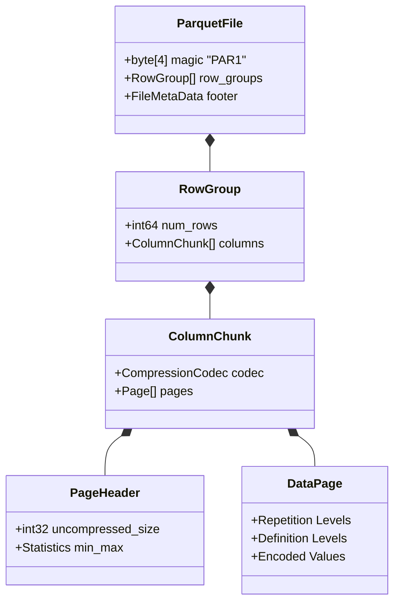

# 列指向ストレージ (Column-Oriented Storage) の科学: Parquetの解剖、Dremelの定理、ClickHouse MergeTreeのベクトル化エンジン

## なぜ行指向ストレージは分析ワークロードで限界を迎えるのか

ビッグデータ時代の到来は、従来のリレーショナルデータベース管理システム (RDBMS) がそもそも想定していなかった物理的な限界を露呈させました。RDBMSはトランザクション処理 (OLTP) 向けに最適化されており、データを行単位 (Row-Oriented) で保存します。この方式は、クエリが少数の行のすべての列に触れる場合にはうまく機能します。しかしオンライン分析処理 (OLAP) のように、クエリが数十億件のレコードをスキャンしながら実際には数個の列しか使わないワークロードでは話が変わります。行指向ストレージをこの用途に当てはめると、I/O帯域幅の大部分が無駄になり、その過程でCPUキャッシュも汚染されてしまいます。

問題の核心はシンプルです。メモリ帯域幅とディスクI/O帯域幅はどちらも有限のリソースです。ある1つの列に対して `SUM` や `COUNT` を計算するためだけに行全体をロードすると、PCIeバスとRAMバスを実際に流れるデータの最大90%が無駄になります。

列指向ストレージ — 学術的には分解ストレージモデル (Decomposed Storage Model, DSM) と呼ばれる方式 — は、この問題への答えとして生まれました。同じ属性の値がメモリ上で隣接するように物理データを並べ替えることで、ストレージエンジンははるかに高い圧縮率と優れたシーケンシャルI/Oスループットを実現します。

本稿では、この列指向モデルをやや踏み込んで解説します。ParquetとORCファイルフォーマットのマイクロアーキテクチャ、ネストされたデータを扱うGoogleのDremelアルゴリズムの数学的背景、ClickHouseのMergeTreeエンジン内部にある疎インデックス (Sparse Index) の設計、そしてベクトル化処理 (SIMD、AVX-512) がこれらすべてを現代のCPU上での実際のスループットへと変換する仕組みまでを扱います。

---

## 分解ストレージモデル (DSM) の数学的基礎

従来の行指向ストレージモデル、N-ary Storage Model (NSM) は、各レコード (tuple) をディスク上の連続したバイトブロックとして保存します。

データリレーション $R$ に $N$ 件のレコードと、$M$ 個の独立した属性 $A_1, A_2, ..., A_M$ が含まれ、属性 $A_i$ が $S(A_i)$ バイトを占めるとします。NSMモデルでは、`SUM(A_k)` のような集約関数を計算するために、システムはすべてのタプルをロードしなければなりません。PCIeバスとRAMバスを介して転送されるI/Oデータ量は次の通りです。
$$ I/O_{NSM} = N \times \sum_{i=1}^{M} S(A_i) $$

一方でDSMは各列を独立した線形配列に分離するため、同じクエリに必要な物理I/O量は次のように減少します。
$$ I/O_{DSM} = N \times S(A_k) $$

この差は列数 $M$ が増えるほど急速に広がっていきます。実際のデータウェアハウスのテーブルには通常数百の列があります。I/O量をギガバイトからメガバイトへと削減できることこそが、列指向エンジンが数千倍もの高速化を実現できる理由です。

### 空間的局所性 (Spatial Locality) とキャッシュライン

x86-64のCPUはRAMから1バイトずつ読み取るわけではなく、キャッシュライン (デフォルトで64バイト) 単位で読み取ります。

- **NSMの場合:** クエリが `Age` 列 (4バイト) だけを必要としていても、CPUは64バイトのキャッシュラインをまるごとロードし、`Name` や `Address` といった無関係な列の60バイトも一緒に持ち込んでしまいます。これがキャッシュ汚染 (Cache Pollution) であり、キャッシュヒット率を大きく下げる原因になります。
- **DSMの場合:** 64バイトのキャッシュラインには、連続する16個の `Age` 値がぴったり収まります ($16 \times 4 = 64$)。CPUがロードするバイトはすべて有用なデータです。ハードウェアプリフェッチャは線形アクセスパターンを容易に認識し、次のキャッシュラインを先読みするため、利用率はほぼ100%に達します。

---

## エントロピーと列データの圧縮

列指向ストレージの物理的な配置は、行指向データではうまく機能しない圧縮手法への扉を開きます。クロード・シャノンの情報理論によれば、確率分布 $P(x)$ を持つ確率変数 $X$ を表現するために必要な最小期待ビット数、すなわちエントロピーは次のように定義されます。
$$ H(X) = - \sum_{x \in \mathcal{X}} P(x) \log_2 P(x) $$

DSMでは、同じ属性に属する値は狭い値域に収まる傾向があるため、相関性が高くエントロピーは低くなります。これはまさに、軽量で高速な圧縮アルゴリズムが実行時に力を発揮できる条件です。

1. **連長圧縮 (Run-Length Encoding, RLE):** `Country` 列がソート済みであれば、`VN, VN, VN...` のように同じ値が $L$ 回連続するシーケンスが現れます。RLEはこれを単一のタプル `(VN, L)` に圧縮し、空間計算量を $\mathcal{O}(L \times S(v))$ から $\mathcal{O}(\log_2 L + S(v))$ へと減らします。

2. **辞書エンコーディング (Dictionary Encoding):** 同じ長い文字列を何度も保存する代わりに、エンジンは列を一度スキャンして `String -> Integer` の辞書を構築し、物理データは単純な整数の配列として保存します。

3. **ビットパッキング (Bit-Packing) と参照フレーム (Frame of Reference, FOR):** ある整数列の値が $1000$ から $1010$ の範囲だとします。FORは $Min = 1000$ を基準点とし、各値を誤差 $d_i = x_i - 1000 \in [0, 10]$ として保存します。$10$ を表現するにはIEEE標準の32ビットではなく $\lceil \log_2 (10) \rceil = 4$ ビットあれば十分なので、エンジンはこうした値を8個まとめて1つの32ビットブロックに詰め込みます。

```cpp
#include <cstdint>
#include <cstddef>
// 3ビットのビットパッキング (Bit-Packed) ストリームを解凍 (unpack) するレジスタレベルのC++関数
void decode_3bit_packed_stream(const uint8_t* __restrict__ encoded, size_t num_values, uint32_t* __restrict__ output) {
    uint64_t bit_buffer = 0;
    uint32_t bits_in_buffer = 0;
    size_t byte_offset = 0;
    const uint32_t mask = 7; // (1<<3)-1 (2進数 111)

    for (size_t i = 0; i < num_values; ++i) {
        while (bits_in_buffer < 3) {
            bit_buffer |= static_cast<uint64_t>(encoded[byte_offset++]) << bits_in_buffer;
            bits_in_buffer += 8;
        }
        output[i] = static_cast<uint32_t>(bit_buffer & mask);
        bit_buffer >>= 3;
        bits_in_buffer -= 3;
    }
}
```

---

## Apache ParquetとORCの内部構造

Apache ParquetとApache ORC (Optimized Row Columnar) は、HDFSやS3の上で高い性能を発揮するように設計された、Hadoop/Sparkエコシステムにおける事実上の業界標準です。

### Parquetの3層構造

Parquetのファイル上のレイアウトは、3つの階層に分解されています。

1. **行グループ (Row Group):** マクロレベルのパーティションで、通常は数百メガバイト単位、レコードのバッチ (例えば100万行) を含みます。Sparkがボトルネックを生まずに作業を分割する単位となります。
2. **列チャンク (Column Chunk):** 1つの行グループの中で、ある1列分のデータがすべて連続して格納されます。
3. **ページ (Page):** 最小の読み取り・解凍単位で、通常1MBから8MBです。RLEやビットパッキングは各ページ内で独立に適用されます。



### 述語のプッシュダウン (Predicate Pushdown) と末尾に置かれるメタデータ

Parquetはメタデータをファイルの末尾 (Footer) に配置します。これは他の多くのファイルフォーマットとは逆の設計です。そのため、クエリエンジンはまずファイルの末尾にシークしてメタデータを読み取る必要があります。このメタデータには、各列チャンクの統計マトリックス (Min/Max、Null Count) が含まれています。

この配置こそが述語のプッシュダウンを可能にします。例えば `SELECT * FROM table WHERE Age > 60` というクエリを考えてみましょう。エンジンはFooterを読み取り、行グループ1の `Age` 列が $Max = 55$ であることを確認します。この時点でエンジンは、その行グループのデータを1バイトもスキャンや読み取りをすることなく、行グループ1全体を即座に除外できます。1回の安価な整数比較だけで、数百メガバイトものI/Oが節約されるわけです。

---

## Dremelアルゴリズム: ネスト構造のエンコーディング

フラットなテーブルは扱いやすいケースです。列指向ストレージの本当の難しさは、配列やJSON、Protobufのようなネストされたデータにあります。多次元配列を保持する列を、読み取り時に正確な構造ごと復元できる形でどう保存すればよいのでしょうか。

Parquetは、この答えをGoogleのDremel論文からそのまま借用し、各スカラー値に2つの小さな整数を付加します。

1. **定義レベル (Definition Level, DL):** 構造が欠落 (Null) しているツリーの深さを記録します。これにより、読み取り側は正しい親要素の位置でNull状態を正確に復元できます。
2. **反復レベル (Repetition Level, RL):** 配列の境界を示します。つまり、繰り返しリストが新しい要素を開始する深さです。$RL = 0$ のとき、読み取り側は新しい最上位レコードが始まったと判断できます。

Parquetがファイルを読み戻す際、小さな状態機械がこの2つのレベルを使って、フラットなプリミティブ値を、構造情報を一切失うことなく多層のネストされたJSONツリーへと組み立て直します。RLとDLはどちらもRLEによって非常によく圧縮されるため、追加されるオーバーヘッドはごくわずかです。

---

## ClickHouse MergeTree: 疎インデックスと限界に近いI/O

Parquetは静止したデータのためのパッシブなファイルフォーマットです。ClickHouseは同じ列指向の発想を、能動的で低レイテンシなデータベースエンジンへと転換しました。そのMergeTreeテーブルエンジンは、追記専用 (append-only) の構造として設計されています。

MergeTreeの物理設計は、Log-Structured Merge-Tree (LSM-Tree) を踏襲しています。`INSERT` が実行されるたびに、データはあらかじめ列ごとの `.bin` ファイルに分解された状態で、不変な新しいData Partとしてディスクに直接書き込まれます。バックグラウンドのプロセスは、小さなパートをより大きなパートへと継続的にマージしており、これには複雑度 $\mathcal{O}(N \log_2 K)$ のK-wayストリーミングマージが使われます。

### 疎インデックス (Sparse Index) とグラニュール (Granule)

ClickHouseはB+Treeを完全に捨てています。代わりに、グラニュール (Granule) と呼ばれる単位を中心に構築された疎インデックスを使います。1つのグラニュールは正確に8192レコードです。行ごとにインデックスを作る代わりに、ClickHouseは各グラニュールの*最初の*行の主キーだけを `.idx` ファイルに記録します。

このときのメモリの計算は非常にすっきりしています。$10^{10}$ 行 (100億レコード) のテーブルで、グラニュールサイズが8192なら、主インデックス配列に必要な要素数はわずか $10^{10} / 8192 \approx 1.22 \times 10^6$ です。主キーが `UInt64` 型 (8バイト) であれば、100億行分のインデックス全体が約 **9.7メガバイト** のRAMに収まります。

これはCPUのL3キャッシュに余裕を持って収まるサイズです。`WHERE Key = 12345` のようなクエリでは、ClickHouseはこのフラットな配列上で二分探索を行い目的のグラニュールを特定し、その後DMAリクエストを発行してディスク上の列ファイルから正確にそのグラニュールだけを取得します。シーク時間 $T_{seek}$ はほぼゼロに近づき、クエリはNVMe PCIe Gen 4/5の帯域幅 (最大14GB/s) を物理的な上限近くまで押し上げることができます。

---

## ベクトル化実行: 性能の本当の源泉

ここまでの要素をすべて結びつけ、ClickHouseの性能を他の多くの選択肢より頭一つ抜けさせているのが、ベクトル化実行エンジンです。

従来のRDBMSはVolcanoイテレータモデルを採用しており、各オペレータが `next()` を呼び出して行を1つずつ処理します。行ごとに発生する仮想関数呼び出しと分岐は、CPUの分岐予測器を大きく乱します。

ClickHouseはこれとは異なり、データをブロック — 連続したメモリ上の配列 — としてエンジン内を流します。これにより、x86-64アーキテクチャ上のAVX-2やAVX-512といったSIMD命令セットを余すところなく活用できます。

### 分岐なしホットループ (Branchless Hot Loop) とAVX-512

AVX-512は512ビットのZMMレジスタを提供します。1クロックサイクルで、ALUは16個の32ビット整数ペアに対する16の演算を完全に並列に実行できます。

実際の分岐なしフィルタ (branchless filter) は次のような形になります。

```rust
use std::arch::x86_64::*;

/// AVX-512上で16個の32ビット整数スカラー要素を並行して処理するアルゴリズム
#[target_feature(enable = "avx512f")]
pub unsafe fn vectorized_filter_greater_than_avx512(data: &[i32], threshold: i32, mask_out: &mut [u16]) {
    let len = data.len();
    let vec_threshold = _mm512_set1_epi32(threshold); // パラメータを16個のレジスタセルにプッシュ
    
    let mut i = 0;
    let mut mask_idx = 0;
    
    while i + 16 <= len {
        // 512ビット (16個の32ビット整数) をZMMにロード
        let chunk = _mm512_loadu_si512(data.as_ptr().add(i) as *const __m512i);
        
        // 比較により、16ビットの圧縮マスク (0と1) が直接返される
        // IF/ELSE文を使用しない -> 分岐予測ミスによるペナルティ (Branch Misprediction Penalty) を完全に回避
        let cmp_mask: u16 = _mm512_cmpgt_epi32_mask(chunk, vec_threshold);
        
        mask_out[mask_idx] = cmp_mask;
        i += 16;
        mask_idx += 1;
    }
}
```

ホットループから `if-else` 構造を完全に取り除くことで、このコードは分岐予測ミスによるペナルティから無縁になります。これは、スーパースカラ・アウトオブオーダー実行を行うCPUが、分岐を読み違えたせいでキューに溜まった何百もの命令を破棄せざるを得なくなる状況を指します。

そしてこれこそが、この設計全体の核心です。列指向ストレージ、Dremelのエンコーディング、疎インデックス、そしてベクトル化実行 — これらはすべて同じ発想の異なる現れ方に過ぎません。ソフトウェアのデータレイアウトがハードウェアの物理的なリズム — キャッシュライン、SIMDレジスタ、NVMeのDMA転送 — と噛み合ったとき、データ処理の速度はもはや工学的な妥協ではなく、ハードウェアが物理的に出せる限界そのものに近づいていくのです。
