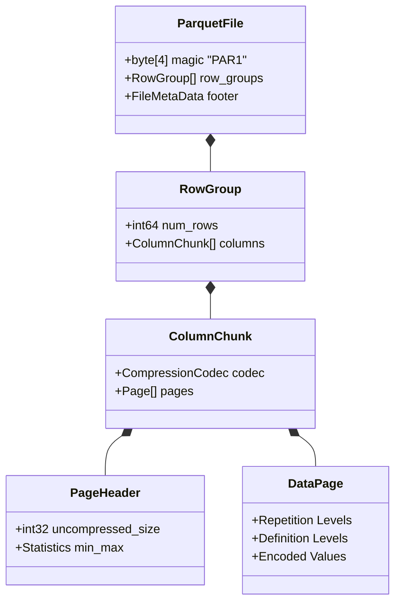

# 06: Lưu trữ Hướng cột: Parquet, Định lý Dremel và Vectorized Execution của ClickHouse MergeTree

## Tóm tắt & Vấn đề

Khi dữ liệu tăng lên tới quy mô big data, những giới hạn vật lý của các hệ quản trị cơ sở dữ liệu quan hệ truyền thống lộ rõ. RDBMS cổ điển được tối ưu cho OLTP, nên nó lưu dữ liệu theo hàng (row-oriented). Vấn đề là khi áp dụng mô hình này cho khối lượng công việc OLAP — nơi một truy vấn quét qua hàng tỷ bản ghi nhưng chỉ cần tính toán trên một vài cột — lưu trữ theo hàng biến thành gánh nặng băng thông I/O và gây ô nhiễm cache một cách lãng phí.

Vấn đề cốt lõi rất đơn giản: băng thông bộ nhớ và băng thông đĩa đều hữu hạn. Tải nguyên một hàng chỉ để tính SUM hay COUNT trên một cột duy nhất có thể lãng phí tới 90% dung lượng truyền tải qua bus PCIe và RAM.

Lưu trữ hướng cột — hay còn gọi là Decomposed Storage Model (DSM) — ra đời để giải quyết đúng vấn đề đó. Bằng cách xếp các giá trị cùng một thuộc tính nằm liền kề nhau trên đĩa, hệ thống đạt được tỷ lệ nén cao hơn hẳn và tốc độ đọc tuần tự vượt trội.

Bài viết này đi vào vi kiến trúc của định dạng Parquet và ORC, giải thích thuật toán Dremel, mổ xẻ chỉ mục thưa của ClickHouse MergeTree, và cho thấy sức mạnh của vectorized execution với SIMD AVX-512 trên CPU hiện đại.

---

## Nền tảng Toán học của Mô hình Phân rã Lưu trữ (DSM)

Mô hình lưu trữ theo hàng truyền thống (N-ary Storage Model - NSM) đặt một bản ghi (tuple) thành một khối byte liền nhau trên đĩa.

Gọi $R$ là một quan hệ dữ liệu có $N$ bản ghi và $M$ thuộc tính $A_1, A_2, ..., A_M$, với $S(A_i)$ là kích thước lưu trữ của thuộc tính $A_i$.
Trong NSM, để tính một hàm tổng hợp như `SUM(A_k)`, hệ thống buộc phải nạp toàn bộ tuple. Khối lượng I/O truyền qua bus PCIe và RAM là:
$$ I/O_{NSM} = N \times \sum_{i=1}^{M} S(A_i) $$

Ngược lại, DSM tách mỗi cột thành một mảng tuyến tính độc lập. Khối lượng I/O vật lý chỉ còn:
$$ I/O_{DSM} = N \times S(A_k) $$

Khoảng cách giữa hai con số này càng lớn khi số cột $M$ càng nhiều — mà các bảng data warehouse thực tế thường có hàng trăm cột. Giảm khối lượng I/O từ gigabyte xuống megabyte tạo ra bước nhảy hiệu năng có thể lên tới hàng nghìn lần.

### Tính Địa phương Không gian và Cache Line

Trên kiến trúc x86-64, CPU không đọc từng byte lẻ từ RAM — nó đọc theo cache line, mặc định 64 byte.
- Với NSM: nếu bạn chỉ cần cột `Age` (4 byte), CPU vẫn phải nạp 64 byte, kéo theo 60 byte thuộc các cột không liên quan như `Name`, `Address`. Đây là hiện tượng cache pollution, khiến tỷ lệ cache hit giảm mạnh.
- Với DSM: một cache line 64 byte chứa đúng 16 giá trị `Age` liên tiếp ($16 \times 4 = 64$). CPU dùng trọn 100% dữ liệu tải về. Hardware prefetcher cũng dễ nhận ra mẫu truy cập tuyến tính này và tải trước các dòng địa chỉ tiếp theo gần như hoàn hảo.

---

## Lý thuyết Thông tin, Entropy và Nén Cột

Chính đặc tính vật lý của lưu trữ cột mở ra cơ hội lớn cho các thuật toán nén. Theo lý thuyết thông tin của Shannon, lượng thông tin tối thiểu (entropy) tính bằng bit để biểu diễn một biến ngẫu nhiên $X$ với phân phối $P(x)$ là:
$$ H(X) = - \sum_{x \in \mathcal{X}} P(x) \log_2 P(x) $$

Trong DSM, dữ liệu của cùng một thuộc tính thường thuộc cùng một miền giá trị, có độ tương quan cao và entropy thấp. Điều đó cho phép áp dụng các thuật toán nén nhẹ, chạy nhanh ngay tại runtime:

1. **Run-Length Encoding (RLE):** nếu một cột `Country` đã được sắp xếp, dữ liệu sẽ có chuỗi lặp kiểu `VN, VN, VN...` kéo dài $L$ lần. RLE nén chuỗi đó thành một cặp `(VN, L)`. Độ phức tạp không gian giảm từ $\mathcal{O}(L \times S(v))$ xuống còn $\mathcal{O}(\log_2 L + S(v))$.

2. **Dictionary Encoding:** thay vì lưu các chuỗi ký tự dài lặp đi lặp lại, hệ thống quét qua cột, dựng một từ điển ánh xạ `String -> Integer`. Dữ liệu vật lý sau đó chỉ là một mảng số nguyên.

3. **Bit-Packing và Frame of Reference (FOR):** nếu một cột số nguyên có giá trị trong khoảng 1000 đến 1010, thuật toán FOR lấy $Min = 1000$ làm mốc, các giá trị thực lưu thành mảng sai số $d_i = x_i - 1000 \in [0, 10]$. Để lưu số 10 chỉ cần $\lceil \log_2 (10) \rceil = 4$ bit thay vì 32 bit chuẩn IEEE — hệ thống nhồi 8 giá trị như vậy vào một khối 32-bit.

```cpp
#include <cstdint>
#include <cstddef>
// Hàm C++ mức thanh ghi giải mã (unpack) chuỗi 3-bit Bit-Packed
void decode_3bit_packed_stream(const uint8_t* __restrict__ encoded, size_t num_values, uint32_t* __restrict__ output) {
    uint64_t bit_buffer = 0;
    uint32_t bits_in_buffer = 0;
    size_t byte_offset = 0;
    const uint32_t mask = 7; // (1<<3)-1 (nhị phân 111)

    for (size_t i = 0; i < num_values; ++i) {
        while (bits_in_buffer < 3) {
            bit_buffer |= static_cast<uint64_t>(encoded[byte_offset++]) << bits_in_buffer;
            bits_in_buffer += 8;
        }
        output[i] = static_cast<uint32_t>(bit_buffer & mask);
        bit_buffer >>= 3;
        bits_in_buffer -= 3;
    }
}
```

---

## Kiến trúc Phân cấp Tệp: Apache Parquet và ORC

Apache Parquet và Apache ORC (Optimized Row Columnar) là hai chuẩn phổ biến nhất trong hệ sinh thái Hadoop/Spark, được thiết kế riêng cho HDFS và S3.

### Cấu trúc Ba Cấp của Parquet

Tệp Parquet được tổ chức theo ba lớp lồng nhau:
1. **Row Group:** phân vùng lớn, thường vài trăm megabyte, chứa một tập bản ghi (ví dụ một triệu dòng). Nhờ đó Spark có thể chia nhỏ công việc map/reduce mà không bị nghẽn.
2. **Column Chunk:** bên trong mỗi Row Group, dữ liệu của một cột được gói liên tục.
3. **Page:** đơn vị đọc/giải nén nhỏ nhất (1MB đến 8MB). Các thuật toán RLE, Bit-Packing được áp dụng riêng cho từng Page.



### Predicate Pushdown và Metadata nằm ở Cuối tệp

Một điểm khác thường của Parquet: metadata nằm ở cuối tệp (footer), ngược với cách bố trí truyền thống.
Engine truy vấn phải seek tới cuối tệp trước để đọc metadata, trong đó có ma trận thống kê Min/Max và Null Count của từng Column Chunk.

Cách sắp xếp này chính là thứ kích hoạt predicate pushdown.
Với câu truy vấn `SELECT * FROM table WHERE Age > 60`, engine đọc footer, thấy Row Group 1 có cột `Age` với $Max = 55$, và lập tức loại bỏ toàn bộ Row Group đó mà không cần chạm vào đĩa. Một phép so sánh số nguyên rẻ tiền đã cứu được hàng trăm megabyte I/O.

---

## Định lý Dremel: Phân rã Cấu trúc Lồng nhau

Thách thức lớn nhất của lưu trữ cột không phải là bảng phẳng, mà là dữ liệu lồng nhau — mảng đa chiều, JSON, Protobuf. Làm sao lưu một cột chứa mảng lồng mà vẫn khôi phục đúng cấu trúc khi đọc lại?

Parquet mượn trực tiếp thuật toán từ Google Dremel, gắn thêm hai tham số vào mỗi giá trị vô hướng:
1. **Definition Level (DL):** cho biết tại độ sâu nào của cây cấu trúc bị thiếu (null), giúp khôi phục đúng vị trí null ở phần tử cha.
2. **Repetition Level (RL):** đánh dấu ranh giới mảng — tại tầng nào của cấu trúc một danh sách bắt đầu một phần tử mới. Khi $RL = 0$, engine biết đang bắt đầu một document mới ở cấp cao nhất.

Khi đọc lại Parquet, một finite state automaton dùng hai chỉ số này để ráp các giá trị nguyên thủy phẳng ngược trở lại thành cây JSON lồng nhiều lớp, không bỏ sót chi tiết cấu trúc nào. Cả RL lẫn DL đều được nén RLE rất hiệu quả nên chiếm dung lượng không đáng kể.

---

## ClickHouse MergeTree: Chỉ mục Thưa và Tốc độ I/O

Parquet là một định dạng lưu trữ thụ động, dùng cho tệp tĩnh. ClickHouse, với engine bảng MergeTree, biến mô hình cột thành một cỗ máy xử lý độ trễ thấp hoạt động liên tục.

Kiến trúc vật lý của MergeTree gần giống một Log-Structured Merge-Tree. Mỗi `INSERT` được ClickHouse xả thẳng xuống đĩa dưới dạng các Data Part bất biến, tách theo từng cột thành các tệp `.bin` riêng. Một tiến trình nền liên tục thực hiện K-way streaming merge với độ phức tạp $\mathcal{O}(N \log_2 K)$ để gộp các Part nhỏ thành Part lớn hơn.

### Chỉ mục Thưa và Granule

ClickHouse bỏ hẳn cấu trúc B+Tree cồng kềnh, thay bằng chỉ mục thưa (sparse index) với đơn vị là granule — mỗi granule chứa đúng 8192 bản ghi. Thay vì ánh xạ từng dòng, ClickHouse chỉ lưu giá trị khóa chính của dòng *đầu tiên* trong mỗi granule vào tệp chỉ mục `.idx`.

Xét về bộ nhớ: một bảng có $10^{10}$ dòng (10 tỷ bản ghi), granule 8192 dòng, số phần tử trong mảng chỉ mục chỉ còn $10^{10} / 8192 \approx 1.22 \times 10^6$.
Nếu khóa chính là `UInt64` (8 byte), toàn bộ index của 10 tỷ dòng chỉ chiếm khoảng 9.7 megabyte trong RAM.

Kích thước nhỏ như vậy cho phép cả bảng định tuyến nằm gọn trong L3 cache của CPU. Với truy vấn `WHERE Key = 12345`, ClickHouse chạy binary search trên mảng phẳng này để định vị granule, rồi yêu cầu I/O tải đúng granule đó từ các tệp cột vật lý qua DMA. Thời gian tìm kiếm $T_{seek}$ gần như bằng 0, và băng thông NVMe PCIe Gen 4/5 (lên tới 14GB/s) được khai thác gần hết mức.

---

## Vectorized Execution: Sức mạnh Cộng hưởng với Lưu trữ Cột

Yếu tố quyết định hiệu năng vượt trội của ClickHouse là vectorized execution engine.
RDBMS truyền thống dùng mô hình Volcano Iterator — mỗi phép toán đại số gọi hàm `next()` để xử lý từng dòng một. Các hàm ảo và nhánh rẽ (branching) liên tục phá vỡ hệ thống dự đoán nhánh của CPU.

ClickHouse thay vào đó truyền dữ liệu theo từng khối mảng (block/array), tận dụng trọn vẹn tập lệnh SIMD như AVX-2 và AVX-512 trên x86-64.

### Vòng lặp Không Nhánh và AVX-512

AVX-512 cung cấp thanh ghi ZMM 512 bit. Trong một chu kỳ đồng hồ, ALU có thể xử lý song song 16 phép tính trên 16 số nguyên 32-bit.

Ví dụ thuật toán lọc dữ liệu không rẽ nhánh:

```rust
use std::arch::x86_64::*;

/// Thuật toán xử lý 16 phần tử vô hướng số nguyên 32-bit song song trên AVX-512
#[target_feature(enable = "avx512f")]
pub unsafe fn vectorized_filter_greater_than_avx512(data: &[i32], threshold: i32, mask_out: &mut [u16]) {
    let len = data.len();
    let vec_threshold = _mm512_set1_epi32(threshold); // Đẩy tham số ra 16 ô thanh ghi
    
    let mut i = 0;
    let mut mask_idx = 0;
    
    while i + 16 <= len {
        // Load 512 bit (16 số nguyên 32 bit) vào ZMM
        let chunk = _mm512_loadu_si512(data.as_ptr().add(i) as *const __m512i);
        
        // Phép so sánh trả về trực tiếp một mask thu gọn 16-bit (0 và 1)
        // Không dùng lệnh IF/ELSE -> Không bao giờ bị Branch Misprediction Penalty
        let cmp_mask: u16 = _mm512_cmpgt_epi32_mask(chunk, vec_threshold);
        
        mask_out[mask_idx] = cmp_mask;
        i += 16;
        mask_idx += 1;
    }
}
```

Loại bỏ hoàn toàn `if-else` khỏi vòng lặp nóng giúp kiến trúc này tránh được branch misprediction penalty — thứ vốn khiến CPU siêu vô hướng out-of-order phải hủy bỏ hàng trăm lệnh đã xếp hàng trong pipeline.

Kết hợp việc thiết kế nhận biết phần cứng này với đặc tính I/O tuần tự của lưu trữ cột, ta thấy rõ một nguyên lý cốt lõi của data engineering: khi định dạng phần mềm được uốn theo đúng nhịp vật lý của silicon — cache line, thanh ghi SIMD, DMA của NVMe — tốc độ xử lý dữ liệu gần như chỉ còn bị giới hạn bởi vật lý của phần cứng, chứ không phải bởi thiết kế phần mềm nữa.
