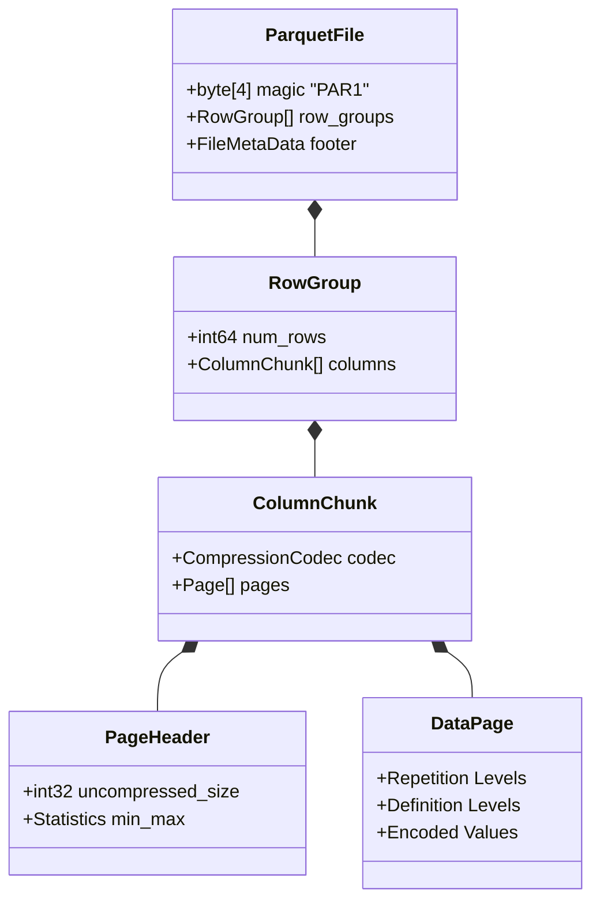

# Lưu trữ Hướng cột (Column-Oriented Storage): Giải phẫu Parquet, Định lý Dremel và Sức mạnh Vector hóa của ClickHouse MergeTree

## Vì sao mô hình lưu trữ theo hàng đuối sức trước khối lượng dữ liệu phân tích

Sự bùng nổ của Big Data phơi bày một giới hạn vật lý mà các hệ quản trị cơ sở dữ liệu quan hệ (RDBMS) truyền thống chưa từng phải đối mặt. RDBMS được thiết kế tối ưu cho xử lý giao dịch (OLTP) và lưu dữ liệu theo từng hàng — mô hình Row-Oriented. Cách này ổn khi truy vấn chạm vào mọi cột của một vài hàng. Nhưng với khối lượng công việc phân tích trực tuyến (OLAP), nơi truy vấn quét qua hàng tỷ bản ghi nhưng chỉ cần tính toán trên một vài thuộc tính, mô hình lưu trữ theo hàng lại lãng phí một lượng lớn băng thông I/O và kéo theo hiện tượng ô nhiễm bộ nhớ đệm (cache pollution).

Vấn đề cốt lõi khá đơn giản: băng thông bộ nhớ và băng thông đĩa đều là tài nguyên hữu hạn. Việc tải toàn bộ một hàng chỉ để tính `SUM` hay `COUNT` trên một cột duy nhất có thể lãng phí tới 90% dữ liệu thực sự được truyền qua bus PCIe và bus RAM.

Lưu trữ hướng cột — về mặt kỹ thuật gọi là Mô hình Phân rã Lưu trữ (Decomposed Storage Model - DSM) — chính là lời giải cho bài toán đó. Bằng cách sắp xếp lại dữ liệu vật lý sao cho các giá trị cùng một thuộc tính nằm liền kề nhau trong bộ nhớ, storage engine đạt được tỷ lệ nén cao hơn hẳn và tốc độ truy xuất I/O tuần tự vượt trội.

Bài viết này đi sâu vào mô hình đó: vi kiến trúc của định dạng tệp Parquet và ORC, nền tảng toán học đằng sau thuật toán Dremel của Google cho dữ liệu lồng nhau, thiết kế chỉ mục thưa (sparse index) bên trong engine MergeTree của ClickHouse, và cách xử lý vector hóa (SIMD, AVX-512) biến tất cả những điều đó thành thông lượng thực tế trên các CPU hiện đại.

---

## Cơ sở Toán học của Mô hình Phân rã Lưu trữ (DSM)

Mô hình lưu trữ theo hàng truyền thống — N-ary Storage Model (NSM) — lưu mỗi bản ghi (tuple) như một khối byte liền kề trên đĩa.

Giả sử một quan hệ dữ liệu $R$ chứa $N$ bản ghi và $M$ thuộc tính độc lập $A_1, A_2, ..., A_M$, trong đó thuộc tính $A_i$ chiếm $S(A_i)$ byte. Trong mô hình NSM, để tính một hàm tổng hợp như `SUM(A_k)`, hệ thống phải nạp toàn bộ các tuple. Khối lượng I/O truyền qua bus PCIe và RAM là:
$$ I/O_{NSM} = N \times \sum_{i=1}^{M} S(A_i) $$

Ngược lại, DSM tách từng cột thành một mảng tuyến tính độc lập, nên khối lượng I/O vật lý cho cùng truy vấn giảm xuống chỉ còn:
$$ I/O_{DSM} = N \times S(A_k) $$

Khoảng cách giữa hai con số này nới rộng rất nhanh khi $M$ tăng — các bảng data warehouse thực tế thường có hàng trăm cột. Việc giảm I/O từ gigabyte xuống megabyte chính là lý do các engine hướng cột đạt được mức tăng tốc hàng nghìn lần.

### Tính Địa phương Không gian (Spatial Locality) và Cache Line

CPU x86-64 không đọc RAM từng byte một — nó đọc theo từng Cache Line, mặc định 64 byte.

- **Ở NSM:** nếu truy vấn chỉ cần cột `Age` (4 byte), CPU vẫn phải nạp trọn 64 byte của một Cache Line, kéo theo 60 byte thuộc các cột không liên quan như `Name`, `Address`. Đây là hiện tượng Cache Pollution, và nó kéo tỷ lệ Cache Hit xuống thấp đáng kể.
- **Ở DSM:** một Cache Line 64 byte chứa đúng 16 giá trị `Age` liên tiếp ($16 \times 4 = 64$). Mọi byte CPU nạp vào đều hữu ích. Trình prefetch phần cứng dễ dàng nhận ra mẫu truy cập tuyến tính và nạp trước các Cache Line tiếp theo, đẩy tỷ lệ sử dụng lên gần 100%.

---

## Entropy và Nén dữ liệu theo Cột

Cách bố trí vật lý của lưu trữ cột mở ra những kỹ thuật nén mà dữ liệu theo hàng không tận dụng được. Theo Lý thuyết Thông tin của Claude Shannon, số bit kỳ vọng tối thiểu cần để biểu diễn một biến ngẫu nhiên $X$ với phân phối xác suất $P(x)$ — gọi là entropy — được tính:
$$ H(X) = - \sum_{x \in \mathcal{X}} P(x) \log_2 P(x) $$

Trong DSM, các giá trị thuộc cùng một thuộc tính thường nằm trong một miền giá trị hẹp, nên chúng có độ tương quan cao và entropy thấp. Đây chính là điều kiện lý tưởng để các thuật toán nén nhẹ, tốc độ cao phát huy tác dụng ngay tại thời gian chạy:

1. **Run-Length Encoding (RLE):** Nếu một cột lưu `Country` và dữ liệu đã được sắp xếp, ta sẽ thấy các chuỗi lặp như `VN, VN, VN...` kéo dài $L$ lần liên tiếp. RLE nén chuỗi đó thành một tuple duy nhất `(VN, L)`, giảm độ phức tạp không gian từ $\mathcal{O}(L \times S(v))$ xuống $\mathcal{O}(\log_2 L + S(v))$.

2. **Dictionary Encoding:** Thay vì lưu đi lưu lại cùng một chuỗi dài, engine quét qua cột một lần, xây dựng một bảng từ điển ánh xạ `String -> Integer`, rồi lưu dữ liệu vật lý dưới dạng mảng số nguyên đơn giản.

3. **Bit-Packing và Frame of Reference (FOR):** Giả sử một cột số nguyên có giá trị nằm trong khoảng từ $1000$ đến $1010$. FOR lấy $Min = 1000$ làm mốc tham chiếu và lưu mỗi giá trị dưới dạng sai số $d_i = x_i - 1000 \in [0, 10]$. Để biểu diễn số $10$, ta chỉ cần $\lceil \log_2 (10) \rceil = 4$ bit thay vì một số nguyên 32-bit chuẩn IEEE — nhờ vậy engine có thể đóng gói tám giá trị như vậy vào cùng một khối 32-bit.

```cpp
#include <cstdint>
#include <cstddef>
// Hàm C++ mức thanh ghi giải mã (unpack) chuỗi 3-bit Bit-Packed
void decode_3bit_packed_stream(const uint8_t* __restrict__ encoded, size_t num_values, uint32_t* __restrict__ output) {
    uint64_t bit_buffer = 0;
    uint32_t bits_in_buffer = 0;
    size_t byte_offset = 0;
    const uint32_t mask = 7; // (1<<3)-1 (nhị phân 111)

    for (size_t i = 0; i < num_values; ++i) {
        while (bits_in_buffer < 3) {
            bit_buffer |= static_cast<uint64_t>(encoded[byte_offset++]) << bits_in_buffer;
            bits_in_buffer += 8;
        }
        output[i] = static_cast<uint32_t>(bit_buffer & mask);
        bit_buffer >>= 3;
        bits_in_buffer -= 3;
    }
}
```

---

## Bên trong Apache Parquet và ORC

Apache Parquet và Apache ORC (Optimized Row Columnar) là chuẩn thực tế của hệ sinh thái Hadoop/Spark, được thiết kế riêng để chạy tốt trên HDFS và S3.

### Cấu trúc Ba tầng của Parquet

Kiến trúc tệp vật lý của Parquet được phân rã thành ba tầng:

1. **Row Group:** phân vùng ở tầng vĩ mô, thường vài trăm megabyte, chứa một lô bản ghi (ví dụ một triệu dòng). Đây là đơn vị mà Spark dùng để chia nhỏ công việc mà không tạo ra nút thắt cổ chai.
2. **Column Chunk:** bên trong một Row Group, toàn bộ dữ liệu của một cột được lưu liền kề nhau.
3. **Page:** đơn vị đọc/giải nén nhỏ nhất, thường từ 1MB đến 8MB. RLE và Bit-Packing được áp dụng độc lập trên từng Page.



### Predicate Pushdown và Metadata nằm ở cuối tệp (Footer)

Parquet đặt metadata ở cuối tệp — Footer — ngược hẳn với cách bố trí của phần lớn các định dạng tệp khác. Điều này buộc engine xử lý truy vấn phải seek đến cuối tệp trước để đọc metadata, bao gồm một ma trận thống kê (Min/Max, Null Count) cho từng Column Chunk.

Chính điều này khiến Predicate Pushdown trở nên khả thi. Lấy ví dụ truy vấn `SELECT * FROM table WHERE Age > 60`. Engine đọc Footer và thấy cột `Age` của Row Group 1 có $Max = 55$. Nó lập tức loại bỏ toàn bộ Row Group đó mà không cần quét hay đọc một byte dữ liệu nào. Chỉ một phép so sánh số nguyên rẻ tiền đã tiết kiệm được hàng trăm megabyte I/O.

---

## Thuật toán Dremel: Mã hóa Cấu trúc Lồng nhau

Bảng phẳng là trường hợp dễ. Thách thức thực sự trong lưu trữ cột nằm ở dữ liệu lồng nhau — mảng, JSON, Protobuf. Làm sao để lưu một cột chứa mảng đa chiều mà vẫn tái tạo đúng cấu trúc khi đọc lại?

Parquet mượn trực tiếp lời giải từ bài báo Dremel của Google, gắn thêm hai số nguyên nhỏ vào mỗi giá trị vô hướng:

1. **Definition Level (DL):** ghi lại độ sâu của cây tại nơi cấu trúc bị thiếu (Null), cho phép bộ đọc khôi phục chính xác trạng thái Null ở đúng phần tử cha.
2. **Repetition Level (RL):** đánh dấu ranh giới mảng — độ sâu tại đó một danh sách lặp bắt đầu một phần tử mới. Khi $RL = 0$, bộ đọc biết rằng một bản ghi cấp cao nhất hoàn toàn mới đang bắt đầu.

Khi Parquet đọc lại một tệp, một máy trạng thái nhỏ dùng hai mức này để lắp ráp các giá trị nguyên thủy dạng phẳng trở lại thành cây JSON lồng nhau nhiều tầng mà không mất bất kỳ thông tin cấu trúc nào. Cả RL và DL đều nén cực tốt bằng RLE, nên chi phí phụ trội mà chúng thêm vào là không đáng kể.

---

## ClickHouse MergeTree: Chỉ mục Thưa và I/O ở giới hạn tối đa

Parquet là một định dạng tệp thụ động, dành cho dữ liệu nằm yên. ClickHouse lấy chính ý tưởng hướng cột đó và biến nó thành một database engine chủ động, độ trễ thấp — engine bảng MergeTree được xây dựng như một cấu trúc chỉ-thêm (append-only).

Kiến trúc vật lý của MergeTree mô phỏng Log-Structured Merge-Tree (LSM-Tree). Mỗi lệnh `INSERT` được ghi thẳng xuống đĩa thành một Data Part bất biến mới, đã được phân rã sẵn thành các tệp `.bin` riêng cho từng cột. Một tiến trình nền liên tục hợp nhất các Part nhỏ thành Part lớn hơn, sử dụng phép hợp nhất luồng K-đường (K-way streaming merge) với độ phức tạp $\mathcal{O}(N \log_2 K)$.

### Chỉ mục Thưa (Sparse Index) và Granule

ClickHouse bỏ hẳn cấu trúc B+Tree. Thay vào đó, nó dùng chỉ mục thưa xây dựng quanh một đơn vị gọi là Granule — đúng 8192 bản ghi. Thay vì lập chỉ mục cho từng dòng, ClickHouse chỉ ghi lại giá trị khóa chính của dòng *đầu tiên* trong mỗi Granule, vào tệp `.idx`.

Bài toán bộ nhớ ở đây khá đẹp: một bảng có $10^{10}$ dòng (10 tỷ bản ghi) với kích thước Granule là 8192 chỉ cần một mảng chỉ mục chính gồm $10^{10} / 8192 \approx 1.22 \times 10^6$ phần tử. Nếu khóa chính là kiểu `UInt64` (8 byte), toàn bộ chỉ mục cho 10 tỷ dòng chỉ chiếm khoảng **9.7 Megabyte** RAM.

Kích thước đó đủ nhỏ để nằm gọn trong L3 Cache của CPU. Với một truy vấn như `WHERE Key = 12345`, ClickHouse thực hiện tìm kiếm nhị phân trên mảng phẳng này để xác định đúng Granule, sau đó gửi yêu cầu DMA để tải chính xác Granule đó từ các tệp cột trên đĩa. Thời gian seek $T_{seek}$ tiệm cận 0, và truy vấn có thể đẩy băng thông NVMe PCIe Gen 4/5 (lên tới 14GB/s) sát tới giới hạn vật lý của nó.

---

## Vector hóa Thực thi: Nguồn gốc thực sự của hiệu năng

Yếu tố gắn kết mọi thứ ở trên và đẩy hiệu năng của ClickHouse vượt xa phần lớn các lựa chọn khác chính là bộ máy thực thi vector hóa (Vectorized Execution Engine).

Các RDBMS truyền thống dùng mô hình Volcano Iterator: mỗi toán tử gọi `next()` và xử lý từng dòng một. Việc gọi hàm ảo và rẽ nhánh liên tục trên mỗi dòng phá hỏng bộ dự đoán nhánh (branch predictor) của CPU.

ClickHouse thay vào đó luân chuyển dữ liệu qua engine dưới dạng các Block — những mảng liền kề — nhờ đó khai thác trọn vẹn các tập lệnh SIMD như AVX-2 và AVX-512 trên kiến trúc x86-64.

### Vòng lặp Không Nhánh (Branchless Hot Loop) và AVX-512

AVX-512 cung cấp các thanh ghi ZMM 512-bit. Trong một chu kỳ đồng hồ duy nhất, ALU có thể thực hiện 16 phép tính trên 16 cặp số nguyên 32-bit, hoàn toàn song song.

Đây là hình dạng thực tế của một thuật toán lọc không rẽ nhánh (branchless filter):

```rust
use std::arch::x86_64::*;

/// Thuật toán xử lý 16 phần tử vô hướng số nguyên 32-bit song song trên AVX-512
#[target_feature(enable = "avx512f")]
pub unsafe fn vectorized_filter_greater_than_avx512(data: &[i32], threshold: i32, mask_out: &mut [u16]) {
    let len = data.len();
    let vec_threshold = _mm512_set1_epi32(threshold); // Đẩy tham số ra 16 ô thanh ghi
    
    let mut i = 0;
    let mut mask_idx = 0;
    
    while i + 16 <= len {
        // Load 512 bit (16 số nguyên 32 bit) vào ZMM
        let chunk = _mm512_loadu_si512(data.as_ptr().add(i) as *const __m512i);
        
        // Phép so sánh trả về trực tiếp một mask thu gọn 16-bit (0 và 1)
        // Không dùng lệnh IF/ELSE -> Không bao giờ bị Branch Misprediction Penalty
        let cmp_mask: u16 = _mm512_cmpgt_epi32_mask(chunk, vec_threshold);
        
        mask_out[mask_idx] = cmp_mask;
        i += 16;
        mask_idx += 1;
    }
}
```

Loại bỏ hoàn toàn cấu trúc `if-else` khỏi vòng lặp nóng (hot loop) đồng nghĩa với việc đoạn code miễn nhiễm với Branch Prediction Miss Penalty — tình huống một CPU siêu vô hướng, thực thi ngoài thứ tự phải hủy bỏ hàng trăm lệnh đã được xếp hàng chờ chỉ vì đoán sai một nhánh rẽ.

Đó thực chất chính là điểm mấu chốt của toàn bộ thiết kế này. Lưu trữ hướng cột, cách mã hóa Dremel, chỉ mục thưa và thực thi vector hóa đều là những biểu hiện khác nhau của cùng một ý tưởng: khi cách bố trí dữ liệu của phần mềm khớp với nhịp điệu vật lý của phần cứng — Cache Line, thanh ghi SIMD, các phiên DMA của NVMe — tốc độ xử lý dữ liệu không còn là một sự thỏa hiệp kỹ thuật nữa, mà tiệm cận với giới hạn mà phần cứng có thể đạt được.
