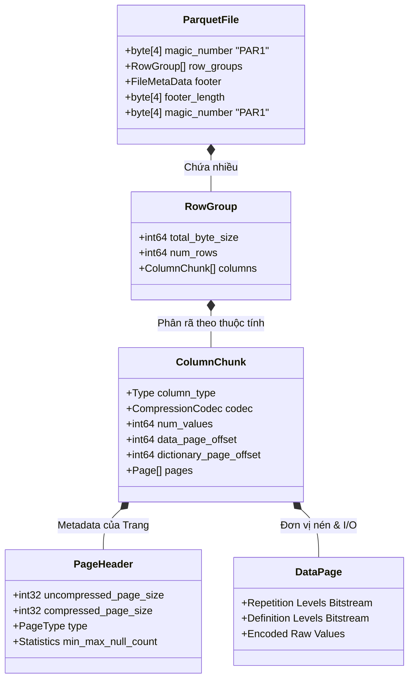

# 06: Column-Oriented Storage: Giải phẫu Parquet, ORC và ClickHouse MergeTree

## Cơ sở lý thuyết của mô hình phân rã lưu trữ và Phân tích vi kiến trúc định dạng Parquet cùng ORC

Mô hình lưu trữ dữ liệu truyền thống theo hàng (N-ary Storage Model - NSM) đã bộc lộ những hạn chế vật lý nghiêm trọng và những điểm nghẽn cổ chai kiến trúc (architectural bottlenecks) khi phải đối mặt với các khối lượng công việc phân tích trực tuyến (Online Analytical Processing - OLAP) quy mô lớn. Các truy vấn này điển hình quét qua hàng tỷ bản ghi (tuple) nhưng chỉ trích xuất và tính toán trên một tập hợp con cực kỳ nhỏ các thuộc tính. Để giải quyết triệt để sự lãng phí băng thông bộ nhớ và các giới hạn về I/O đĩa từ tính lẫn bộ nhớ flash, mô hình phân rã lưu trữ (Decomposed Storage Model - DSM), hay còn được gọi một cách phổ biến là lưu trữ dạng cột (Column-Oriented Storage), đã được cộng đồng nghiên cứu cơ sở dữ liệu hệ thống hóa như một nền tảng thiết kế tối thượng. Trong mô hình DSM, hệ thống lưu trữ phân rã quan hệ lưu trữ vật lý bằng cách đảm bảo mỗi thuộc tính (cột) của một quan hệ dữ liệu được lưu trữ kề nhau thành các dải tuyến tính (contiguous linear stripes) trên phương tiện lưu trữ. Đặc tính này bảo đảm rằng việc đọc một tập hợp cột cụ thể sẽ khai thác tối đa tính địa phương không gian (spatial locality) của hệ thống phân cấp bộ nhớ đệm (cache hierarchy) trong các bộ vi xử lý và đặc tính nạp trước dữ liệu tuần tự (sequential read-ahead) của bộ điều khiển lưu trữ. Khi hệ điều hành hoặc phần cứng lưu trữ tải dữ liệu vào bộ nhớ đệm trang (Page Cache) thông qua các lời gọi hệ thống phân bổ hoặc ánh xạ bộ nhớ như `mmap` hoặc các lệnh đọc bỏ qua đệm (Direct I/O qua cờ `O_DIRECT`), toàn bộ một khối dữ liệu trên một dòng cache (thường là 64 bytes đối với kiến trúc vi xử lý x86-64) sẽ chỉ chứa các giá trị hữu ích và có cấu trúc nội tại tương đồng. Điều này trái ngược hoàn toàn với mô hình NSM, nơi các dòng cache bị làm ô nhiễm (cache pollution) bởi các byte thuộc tính không liên quan đến truy vấn hiện tại, dẫn tới hiện tượng trượt bộ nhớ đệm (cache misses) với tần suất cao. Dưới góc độ toán học và phân tích chi phí I/O phức hợp, giả sử một quan hệ dữ liệu $R$ chứa $N$ bản ghi và $M$ thuộc tính độc lập $A_1, A_2, ..., A_M$, với kích thước định dạng chuẩn của mỗi thuộc tính là $S(A_i)$. Trong mô hình NSM, để tính toán một hàm tập hợp hoặc một phép chiếu vô hướng trên một thuộc tính $A_k$, hệ thống lưu trữ phải đọc và truyền tải một khối lượng dữ liệu vật lý tương đương $N \times \sum_{i=1}^{M} S(A_i)$ qua bus PCIe và bus bộ nhớ. Trong khi đó, mô hình DSM nguyên thủy chỉ yêu cầu một khối lượng I/O vật lý xấp xỉ chính xác bằng $N \times S(A_k)$. Sự chênh lệch kích thước I/O này không mang tính tuyến tính mà trở nên khuếch đại theo hàm mũ khi số lượng cột $M$ lớn và băng thông bộ nhớ thực tế (effective memory bandwidth) tiệm cận với giới hạn định mức của phần cứng. Tính chất vật lý của dải ô nhớ tuần tự còn mở ra cơ hội to lớn cho các thuật toán nén thông tin, dựa trên thực tế là dữ liệu của cùng một thuộc tính thường thuộc về cùng một miền giá trị (domain), dẫn đến sự phân bố đồng nhất cao và độ nhiễu thấp. Để biểu diễn tỷ lệ nén lý thuyết dựa trên lý thuyết thông tin và entropy của Shannon, giả sử một luồng dữ liệu cột là một biến ngẫu nhiên $X$ có hàm khối phân phối xác suất $P(x)$, lượng thông tin kỳ vọng tối thiểu (entropy) tính bằng bit để biểu diễn mỗi phần tử được xác định bởi phương trình tích phân rời rạc $H(X) = - \sum_{x \in \mathcal{X}} P(x) \log_2 P(x)$. Khả năng nén của mô hình lưu trữ dạng cột luôn vượt trội so với NSM do các giá trị kế tiếp nhau thường có mức độ tương quan (correlation) cao, làm giảm đáng kể entropy cục bộ có điều kiện $H(X_i | X_{i-1})$. Sự suy giảm entropy này cho phép việc ứng dụng dày đặc các thuật toán mã hóa tối ưu hóa hạng nhẹ (lightweight compression algorithms) như mã hóa độ dài loạt (Run-Length Encoding - RLE), mã hóa từ điển (Dictionary Encoding), mã hóa đồng bằng (Delta Encoding) và đóng gói bit (Bit-Packing) để ép không gian lưu trữ vật lý tiệm cận đến giới hạn nén lý thuyết mà không tiêu tốn quá nhiều chu kỳ của đơn vị logic số học (ALU) trong quá trình giải mã tại thời gian chạy (runtime).

Apache Parquet và Apache ORC (Optimized Row Columnar) là hai định dạng tệp cột tiêu chuẩn công nghiệp thể hiện rõ nét triết lý thiết kế này thông qua các cấu trúc vi mô phân cấp chặt chẽ và siêu dữ liệu (metadata) nội hàm tinh vi. Trong kiến trúc phân mảnh của Parquet, cấu trúc liên kết của một tệp vật lý được chia thành nhiều Row Group (Nhóm hàng), mỗi Row Group lại chứa một tập hợp song song các Column Chunk (Khối cột), và mỗi Column Chunk được phân rã tiếp tục thành một chuỗi các Page (Trang). Sự phân rã ba cấp độ này cung cấp một khuôn khổ khả năng tối ưu hóa đa chiều có tính toán trước (pre-computed dimensionality). Ở cấp độ cao nhất, Row Group cung cấp một phân vùng vĩ mô dữ liệu thô để phân chia không gian công việc một cách cô lập trong môi trường thực thi phân tán (ví dụ: mô hình MapReduce hoặc Apache Spark), hạn chế áp lực trên bộ điều phối tài nguyên (Resource Manager). Cấp độ Column Chunk bao bọc một cách liên tục toàn bộ dữ liệu vật lý của một cột duy nhất trong giới hạn biên của Row Group, phục vụ cho việc đọc tuần tự khối lượng lớn (bulk sequential read). Cuối cùng, Page (Data Page hoặc Dictionary Page) tồn tại như một đơn vị tính toán phân giải, nén, giải mã nguyên tử và phân bổ bộ nhớ nhỏ nhất, thường có kích thước từ 1MB đến 8MB nhằm cân bằng dung lượng thư mục chỉ mục bộ nhớ ảo và thông lượng I/O của thiết bị. Metadata của Parquet được cố tình thiết kế theo cấu trúc đính kèm ở phần đuôi tệp (footer) thay vì tiêu đề (header). Cơ chế này buộc các bộ phân tích truy vấn (query parsers) phải thực hiện một quá trình đọc ngẫu nhiên (random seek) vào cuối tệp để bóc tách toàn bộ sơ đồ phân bổ byte nội bộ (byte allocation schema) và thu thập các ma trận thống kê tối thiểu-tối đa (Min-Max statistics) cho các cột mà không cần quét toàn bộ tệp hoặc thậm chí nạp các trang dữ liệu vào RAM. Quy trình này thiết lập nền tảng kỹ thuật cho kỹ thuật đẩy xuống vị từ vi mô (Predicate Pushdown) tại mức cấu trúc tệp. Dựa vào mô hình đại số quan hệ, nếu một vị từ kiểm tra $Q(A_k)$ yêu cầu điều kiện $A_k > \theta$, và siêu dữ liệu gắn trong bộ nhớ trung tâm cho một Row Group chỉ ra rằng giá trị lớn nhất $Max(A_k) \le \theta$, bộ định tuyến luồng thực thi (execution router) sẽ lập tức loại bỏ (prune) hoàn toàn Row Group vật lý đó khỏi đường ống xử lý (processing pipeline), bảo vệ hàng tỷ chu kỳ bộ nhớ băng thông rộng (DRAM bandwitdh) và ngăn chặn sự ô nhiễm không gian nhớ của các khối Page Cache trong kernel Linux. Để tăng tốc hơn nữa mật độ lưu trữ, Parquet áp dụng sự kết hợp lai ghép phức tạp giữa RLE và Bit-Packing tại cấp độ mức bit. RLE đặc biệt hữu hiệu đối với các mảng bit hoặc cột có số lượng gốc (cardinality) thấp và sự lặp lại liền kề cao. Giả sử hệ thống xử lý một luồng chứa các giá trị có tính trật tự như một chuỗi $v_1, v_1, v_1, ...$ kéo dài đúng $L$ lần. Thông qua cơ chế RLE, thay vì sử dụng không gian $\mathcal{O}(L \times S(v_1))$, bộ mã hóa sẽ chuyển đổi chuỗi vật lý tĩnh này thành một bộ dữ liệu cặp đơn giản $(v_1, L)$, do đó triệt tiêu không gian phức hợp lưu trữ theo hàm tiệm cận $\mathcal{O}(\log_2 L + S(v_1))$. Bit-Packing, mặt khác, hoạt động như một thuật toán loại bỏ độ dư thừa phần cứng bằng cách đánh giá miền giới hạn thực tế của các khối số học. Khi các số nguyên thu thập được giới hạn trong một khoảng $[Min, Max]$ rất hẹp thông qua cấu trúc toán học quy chiếu định mức (Frame of Reference) được tính bởi biểu thức $FOR(x_i) = x_i - Min$, hệ thống không còn dùng các kiểu dữ liệu kích thước cố định như 32-bit hay 64-bit IEEE. Thay vào đó, bộ đóng gói sẽ dùng hàm trần logarithm $\lceil \log_2 (Max - Min + 1) \rceil$ bit cho mỗi phần tử, xếp chồng các giá trị phi tiêu chuẩn này một cách xuyên suốt các ranh giới byte (cross-byte boundaries), đòi hỏi các lệnh chuyển dịch bit (bit-shifting) cực nhanh để phục hồi. Tương tự với Parquet, định dạng ORC cũng dựa trên những tính chất toán học phân rã cột với cấu trúc danh pháp Stripe (tương tự Row Group). ORC còn tiến một bước xa hơn vào vùng cấu trúc chỉ mục bằng cách nhúng các Bloom Filter và các vi chỉ mục (lightweight row indexes) trực tiếp trong định dạng tệp, cấu thành các hàm băm xác suất (probabilistic hash functions) giúp nhận dạng tức thời sự vắng mặt của một phần tử với sai số dương giả (false positive) cực nhỏ. Dưới đây là kiến trúc vi mô trừu tượng hóa của định dạng tệp Parquet, được mô hình hóa rõ ràng qua một biểu đồ phân cấp hệ thống thể hiện sự kết nối giữa các khối từ vĩ mô đến vi mô.



Thử thách lớn nhất và cũng là thành tựu khoa học xuất sắc nhất trong việc thiết kế Parquet là khả năng mô hình hóa mảng và cấu trúc dữ liệu lồng nhau phức tạp (nested structures) thường thấy trong JSON hoặc Protobuf. Để phân tích bài toán này, Parquet tích hợp thuật toán phân tách cấu trúc hình cây của hệ thống Dremel, dựa trên hai biến trạng thái nguyên thủy là Mức lặp lại (Repetition Level - RL) và Mức định nghĩa (Definition Level - DL). Bất kỳ quan hệ phân tầng lồng nhau nào đều có thể được làm phẳng không tổn hao (lossless flattening) xuống các dạng chuỗi dữ liệu một chiều nhờ vào ma trận trạng thái cấu trúc này. Definition Level được định nghĩa bằng toán học là tổng số các trường tùy chọn (optional fields) và các trường có tính mảng lặp lại (repeated fields) tồn tại trên đường dẫn ngữ nghĩa (semantic path) từ gốc của cấu trúc tài liệu đến giá trị hiện tại. Cấp độ này chỉ định một cách dứt khoát tại độ sâu vật lý nào cấu trúc tài liệu bị thiếu (null), do đó khôi phục hoàn hảo trạng thái null tại đúng nút (node) chính xác khi tái tạo cây. Mặt khác, Repetition Level hoạt động như một tín hiệu thiết lập biên mảng (array boundary marker). Nó xác định mức độ sâu cấu trúc mà tại đó một danh sách đang lặp lại bắt đầu một phần tử đồng cấp (sibling element) mới. Khi $RL = 0$, bộ giải mã (decoder) lập tức nhận diện rằng nó đang xử lý việc khởi tạo một bản ghi cấp cao nhất hoàn toàn mới. Bản thân luồng bit cấp độ RL/DL này thường tiêu thụ rất ít không gian, được nén cục bộ một cách mạnh mẽ thông qua RLE và mã hóa Huffman. Hoạt động tái cấu trúc một tệp vật lý từ các luồng bit rời rạc thành một bộ định tuyến trong bộ nhớ (in-memory document object model) là một dạng cỗ máy trạng thái hữu hạn tự động (Finite State Automaton) với độ nhạy vi mô phụ thuộc vào sự chuyển tiếp của RL. Để đạt được tốc độ giải mã Bit-Packing (un-packing) tối ưu mà không trở thành một điểm nghẽn bộ vi xử lý do sự phân tách độ dài không căn chỉnh (unaligned length offsets), các cỗ máy hiện đại áp dụng một kỹ thuật tối ưu mã cực đoan bằng C++ nhằm giải nén hàng loạt (bulk-unpacking) thay vì chạy các vòng lặp cấp byte truyền thống. Dưới đây là mô phỏng thuật toán C++ ở mức thanh ghi bộ nhớ cho tác vụ giải mã cấu trúc bit-packing, sử dụng cơ chế mặt nạ bit (bit-masking) dịch chuyển để kéo dữ liệu nguyên thủy ra các bộ nhớ heap chuẩn cho tính toán tiếp theo.

```cpp
#include <cstdint>
#include <cstddef>
#include <vector>

// Hàm thực thi cấp thấp giải nén luồng byte đã bit-packed thành các số nguyên chuẩn.
// Giả định bit_width là không đổi và đã được trích xuất từ PageHeader.
void decode_bitpacked_stream(const uint8_t* __restrict__ encoded_data, 
                             size_t num_values, 
                             uint8_t bit_width, 
                             uint32_t* __restrict__ output) {
    uint64_t bit_buffer = 0;
    uint32_t bits_in_buffer = 0;
    size_t byte_offset = 0;
    
    // Tạo bit mask để trích xuất chính xác 'bit_width' số bit.
    // Ví dụ: bit_width = 3 -> mask = (1 << 3) - 1 = 7 (bị hệ nhị phân 111)
    const uint32_t mask = (1U << bit_width) - 1;

    for (size_t i = 0; i < num_values; ++i) {
        // Cần đảm bảo bit_buffer luôn chứa đủ số bit để đọc
        while (bits_in_buffer < bit_width) {
            // Tải 1 byte kế tiếp vào vị trí cao hơn của bit_buffer
            bit_buffer |= static_cast<uint64_t>(encoded_data[byte_offset++]) << bits_in_buffer;
            bits_in_buffer += 8;
        }
        
        // Trích xuất giá trị đóng gói thông qua mask và gán vào bộ nhớ đầu ra
        output[i] = static_cast<uint32_t>(bit_buffer & mask);
        
        // Dịch phải bộ đệm để loại bỏ các bit đã tiêu thụ và giảm bộ đếm trạng thái
        bit_buffer >>= bit_width;
        bits_in_buffer -= bit_width;
    }
}
```

## Phân tích vi kiến trúc của ClickHouse MergeTree và Tối ưu hóa Vector hóa

Hệ quản trị cơ sở dữ liệu phân tích hướng cột cực nhanh ClickHouse khai thác mô hình lưu trữ dạng cột tới các ranh giới giới hạn cực hạn của vi kiến trúc CPU và thiết bị lưu trữ bán dẫn hiện đại thông qua cơ chế cốt lõi mang tên dòng họ bảng MergeTree. Khác biệt một cách căn bản với các kiến trúc thiết kế tệp phân tích tĩnh truyền thống như Parquet (vốn được ưu tiên cho mô hình dữ liệu lưu trữ đám mây thụ động như HDFS hoặc S3), MergeTree được thiết kế sâu sắc như một cấu trúc dữ liệu lưu trữ chủ động có khả năng ghi liên tục với cường độ cao (high-throughput append-only engine). Cấu trúc vật lý của hệ thống được phác họa dựa trên các nguyên tắc bất biến của cấu trúc liên kết Cây kết hợp lưu trữ nhật ký (Log-Structured Merge-Tree - LSM Tree), nhưng được biến đổi và định hình chuyên biệt sâu sắc để hòa nhập với các hoạt động lưu trữ và nén dữ liệu phân rã cột độc lập. Khi các thao tác cấy dữ liệu mới (INSERT operations) được nạp vào ClickHouse, luồng dữ liệu lập tức được ghi trực tiếp xuống phương tiện bền vững thành các phân mảnh thư mục vật lý rời rạc được gọi là các Phân đoạn dữ liệu (Data Parts). Các Part này có tính chất hoàn toàn bất biến (immutable), không bao giờ chịu sự thay đổi tại chỗ (in-place updates), qua đó loại bỏ mọi cơ chế khóa song song đắt đỏ (pessimistic locking) và duy trì thông lượng I/O tuyến tính của đĩa. Ở hậu trường hệ thống, một bộ lập lịch luồng ngầm định (background thread scheduler) sẽ liên tục kiểm tra và khởi động các quá trình Hợp nhất dữ liệu (Merging Process), đọc dữ liệu dạng nén từ các Part nhỏ, trộn chúng theo khóa sắp xếp (sorting key) để thiết lập một tập Part lớn hơn và áp dụng các cơ chế thu dọn rác như giới hạn vòng đời dữ liệu (Time-To-Live TTL). Thuật toán merge hoạt động trên nguyên tắc hợp nhất luồng K-đường (K-way streaming merge) với độ phức tạp tiệm cận theo thời gian là $\mathcal{O}(N \log_2 K)$ trong đó $N$ là tổng lượng bản ghi và $K$ là số lượng Part được xử lý, đảm bảo mức tiêu thụ RAM luôn nằm trong giới hạn cố định bất chấp dung lượng của đĩa.

Điểm xuất sắc và dị biệt của cấu trúc cơ sở MergeTree không phụ thuộc vào việc triển khai cấu trúc B+Tree cồng kềnh cho hệ thống chỉ mục thứ cấp như các RDBMS (Relational Database Management System) giao dịch truyền thống, mà sức mạnh đó nằm ở hệ thống phân bổ cấu trúc hạt và Chỉ mục thưa thớt (Sparse Indexing). Toàn bộ dữ liệu thô của tất cả các cột được sắp xếp nghiêm ngặt theo phương pháp từ điển dọc theo khóa chính (Primary Key) khi lưu trữ xuống đĩa và được tổ chức logic phân chia thành các Hạt dữ liệu (Granules). Một Granule là đơn vị cấu trúc tĩnh không thể phân chia (indivisible atomic unit) đối với công cụ đọc dữ liệu vi mô (reader engine), theo mặc định chứa chính xác 8192 bản ghi. Thay vì tạo một ánh xạ cho mỗi hàng riêng lẻ như B-Tree, ClickHouse chỉ trích xuất và bảo lưu giá trị định danh của khóa chính thuộc hàng bắt đầu của mỗi Granule và nạp khối khóa tĩnh này vào bộ nhớ truy cập ngẫu nhiên (RAM). Phương pháp mô hình hóa bộ nhớ chỉ mục tối giản này làm giảm cường độ tiêu thụ footprint bộ nhớ tới mức không tưởng. Xem xét bài toán không gian: nếu một bảng phân tích sự kiện chứa một tập khổng lồ $10^{10}$ hàng (khoảng 10 tỷ bản ghi), với cấu hình tham số kích thước Granule giữ mức mặc định $8192$, chỉ mục chính vật lý tồn tại trong bộ nhớ chỉ gồm một mảng một chiều xấp xỉ $1.22 \times 10^6$ phần tử. Với kích thước số nguyên 64-bit cho khóa chính, dung lượng thực tế chỉ dao động ở mức dưới 10 Megabyte. Kích thước chỉ mục vô cùng khiêm tốn này cho phép toàn bộ cấu trúc định tuyến dữ liệu cốt lõi (routing array) nằm lọt thỏm trọn vẹn bên trong bộ nhớ đệm L3 Cache của các vi xử lý máy chủ. Khi không có yêu cầu truy cập DRAM cấp thấp cho việc quét cây chỉ mục, xác suất một đơn vị nạp trước dữ liệu phần cứng (hardware prefetcher) của lõi vi xử lý có thể nhận dạng các mẫu truy cập (access patterns), dự đoán chính xác và tải trước các dòng địa chỉ tiếp theo tiệm cận tỷ lệ hoàn hảo 100%, do tính chất bộ nhớ là một mảng phẳng tuyến tính hoàn toàn (perfectly linear array). Khi một truy vấn có chứa điều kiện lọc `WHERE` được khởi tạo, cỗ máy xử lý tiến hành thuật toán tìm kiếm nhị phân chia để trị (Binary Search) trên mảng chỉ mục Granule thưa thớt này nhằm đánh dấu (mark) và khoanh vùng khẩn cấp (fast pruning) chuỗi Granule có xác suất chứa dữ liệu thỏa mãn tập điều kiện. Số lượng hạt thực tế bị ràng buộc phải đọc từ thiết bị đĩa vật lý được mô hình là $G_{scan}$. Khác biệt hệ thống I/O cơ hữu được minh họa bằng thời gian đáp ứng lý thuyết tổng quát tuân theo phương trình động học của thiết bị đĩa: $T_{I/O} = G_{scan} \times \left( T_{seek} + \frac{S_{granule}}{B_{disk}} \right)$. Do cấu trúc lưu trữ của Part đảm bảo rằng một cột vật lý được phân rã thành luồng khối dữ liệu liên tiếp, giá trị hao phí thời gian đầu từ tìm kiếm $T_{seek}$ tiệm cận mức 0 hoàn hảo khi bộ lên lịch I/O đọc các Granule kề nhau. Tính năng này kích hoạt các giao thức NVMe ở mức tận dụng tối đa băng thông vật lý PCI-Express (như 7GB/s cho một thiết bị PCIe Gen 4), biến giới hạn phân tích phần mềm trở thành một phép thử đo lường trực tiếp về sức mạnh vật lý của thiết bị phần cứng đính kèm.

Yếu tố cộng sinh mạnh mẽ nhất thiết lập nên danh tiếng vô địch phân tích của mô hình ClickHouse là Cỗ máy thực thi truy vấn được vector hóa (Vectorized Execution Engine), một kiến trúc vi mô giúp ClickHouse đè bẹp triệt để các hệ thống xử lý từng bản ghi kiểu dòng thác lửa (Volcano iterator model) về mặt thông lượng (throughput) và độ trễ (latency). Kỹ thuật Vectorization thay thế việc luân chuyển các hàng đơn lẻ đắt đỏ ngang qua chuỗi toán tử đại số quan hệ (operator tree). Thay vào đó, nó cô lập và truyền dẫn từng Khối dữ liệu mảng (Block/Array), chứa nội tại hàng nghìn giá trị vô hướng nguyên thủy thuộc cùng một cột. Sự chuyển đổi cấu trúc luồng điều khiển (control flow) này chỉ để cung cấp và nhắm đến một điểm tiếp xúc vật lý tối thượng: Tận dụng trực tiếp kho vũ khí tập lệnh xử lý Đơn Lệnh Đa Dữ Liệu (SIMD - Single Instruction Multiple Data) như AVX-2 và AVX-512 trên thiết kế silicon x86-64 tiên tiến hoặc tập lệnh NEON trên máy chủ ARM64. Khi cỗ máy vật lý nhận yêu cầu xử lý phép chiếu biểu thức trên hai cột vô hướng kiểu số nguyên, thay vì biên dịch một vòng lặp `for` với các biến lặp vô hồn bị chèn ép băng thông, một đoạn mã nội tại (compiler intrinsic code) sẽ chỉ định quá trình nạp (load) một khối dữ liệu $16 \times 32$-bit (tổng cộng 512 bit) từ vùng nhớ RAM vào thanh ghi ZMM siêu lớn của cấu trúc AVX-512. Kế tiếp, một chỉ thị vi mã (microcode instruction) duy nhất từ bộ giải mã lệnh CPU sẽ kích hoạt một cụm các Đơn vị Logic Số học (ALU) thực thi tính toán 16 phép biến đổi trên 16 cặp phần tử hoàn toàn độc lập và đồng thời ngay trong một xung nhịp đồng hồ đơn nhất (single clock cycle). Việc liên tục quét tuần tự qua bộ đệm mảng tĩnh theo cột loại trừ vĩnh viễn sự hiện diện của các cấu trúc phân nhánh rẽ (if-else branches) trong vòng lặp kín (hot loop). Trạng thái phi phân nhánh này miễn nhiễm cỗ máy khỏi những bản án thảm họa của các lỗi Bộ dự đoán nhánh thất bại (Branch Prediction Miss Penalties), một lỗi có thể xóa sổ hàng trăm lệnh vi mô đã xếp hàng trước (pipeline flushing) trong các CPU có hệ thống đa luồng và dự đoán hướng thực thi siêu vô hướng (Superscalar Out-of-Order Execution). Ở tầng thấp hơn, mức độ tương tác nghiêm ngặt của hệ điều hành Linux cũng đóng vai trò sinh tử. Quá trình phân bổ con trỏ vùng nhớ cho engine luôn tuân thủ nguyên tắc ép bộ nhớ căn chỉnh ranh giới (Memory Alignment) tại mức 64-byte. Khớp hoàn hảo với kích thước một dòng bộ nhớ đệm (Cache Line). Việc thất bại trong quy trình căn chỉnh con trỏ, gọi là hiện tượng truy cập bộ nhớ không thẳng hàng (unaligned load), sẽ khiến một tác vụ nạp 512-bit vector đâm qua ranh giới của hai luồng Cache Line riêng biệt. Hiện tượng vỡ luồng này (Cache-Line Split) khiến bộ phân giải địa chỉ phần cứng sinh thêm một lệnh nạp bổ sung ngầm định, làm suy hao trầm trọng băng thông bus vòng nối liền (Ring Bus) trong vi mạch vi xử lý. Hơn nữa, cỗ máy I/O của kernel được thao túng cực kỳ có chủ đích thông qua các lời gọi báo hiệu vùng nhớ POSIX như `madvise` kèm theo các cờ thông báo phần cứng nhạy cảm như `MADV_WILLNEED` hoặc `MADV_RANDOM`. Cờ điều phối này chỉ thị cho tầng Quản lý bộ nhớ ảo (Virtual Memory Manager) của Linux điều tiết các thuật toán Page Cache Read-Ahead của nhân (kernel), dự đoán chính xác kích cỡ nạp vào nhằm hạn chế dứt điểm các Lỗi trang nghiêm trọng (Hard Page Faults) — những lỗi buộc luồng vector hiện tại phải ngủ đông và chờ ngắt ổ đĩa quay (disk interrupts). Đỉnh điểm của quá trình tối ưu bộ nhớ còn liên quan đến thao tác kích hoạt Các trang nhớ Khổng lồ (Transparent Huge Pages, 2MB hoặc 1GB), nén bảng trang hệ thống xuống hàng ngàn lần để gần như triệt tiêu hoàn toàn sự đắt đỏ của các Lỗi đệm dịch địa chỉ ảo sang vật lý (Translation Lookaside Buffer - TLB Misses). Phác đồ Mermaid phía dưới mô phỏng sinh động kiến trúc giải phẫu vòng đời nền của tiến trình bảo trì dữ liệu MergeTree: luồng giao thoa bất biến giữa bộ đệm tĩnh của RAM và hệ thống tệp lưu trữ khối của hệ điều hành.

```mermaid
stateDiagram-v2
    direction LR
    [*] --> Memory_MemTable: Tác vụ chèn dữ liệu (INSERT)
    
    state Lưu_Trữ_Khởi_Tạo {
        Memory_MemTable --> Part_Cơ_Sở_1: Xả đệm (Flush to OS Cache)
        Memory_MemTable --> Part_Cơ_Sở_2: Xả đệm (Flush to OS Cache)
    }
    
    state Cỗ_Máy_Nền_MergeTree (Background Scheduler) {
        Part_Cơ_Sở_1 --> Bộ_Hợp_Nhất_K_Đường: Đọc mảng cấu trúc cột (Streamed read)
        Part_Cơ_Sở_2 --> Bộ_Hợp_Nhất_K_Đường: Đọc mảng cấu trúc cột (Streamed read)
        Bộ_Hợp_Nhất_K_Đường --> Luồng_Dữ_Liệu_Sắp_Xếp: Trộn song song
        Luồng_Dữ_Liệu_Sắp_Xếp --> Khối_Nén_LZ4_ZSTD: Bit-packing và Nén thuật toán
        Khối_Nén_LZ4_ZSTD --> Part_Hợp_Nhất_Mới: Ghi trực tiếp xuống (O_DIRECT)
    }
    
    Part_Hợp_Nhất_Mới --> Bảng_Định_Tuyến_Hệ_Thống: Hoán đổi tham chiếu nguyên tử
    Bảng_Định_Tuyến_Hệ_Thống --> Hủy_Part_Cũ: Cơ chế thu gom rác (GC)
    Hủy_Part_Cũ --> [*]
```



Để thấu hiểu năng lực kỹ thuật của thực thi vector song song một cách tường minh, chúng ta sẽ xem xét qua một khối mã C++ hoặc Rust đại diện cho thuật toán lọc dữ liệu không chứa lệnh rẽ nhánh của vòng lặp trung tâm (branchless hot-loop), khai thác tàn khốc tập lệnh intrinsics của khối kiến trúc AVX-512. Hàm cấp thấp dưới đây nhận một khối mảng cột số nguyên `data`, liên tục so sánh song song với một giới hạn giá trị `threshold`, và cập nhật một mặt nạ logic bit (bitmask) `mask_out`. Đặc điểm vi mô đáng gờm của khối thiết kế này là vòng lặp hoàn toàn vắng bóng các điều kiện nhảy `if/else`, đảm bảo luồng lệnh siêu phân cấp (superscalar pipeline) không bao giờ bị đứt gãy giữa chừng. Tập lệnh AVX-512 `_mm512_cmpgt_epi32_mask` tạo ra ma trận mặt nạ không gian 16-bit nguyên lý không cần chi phí nén dữ liệu thêm biệt lập. Mặt nạ siêu việt này ngay lập tức được cung cấp vào một khối tập lệnh xử lý luồng nén bằng công cụ thao tác trích xuất song song của Intel (PEXT - Parallel Bit Extract), cô đọng các mảng mảng kết quả thành cấu trúc nhỏ hẹp nhất. Cấp độ kiểm soát phần cứng vật lý vô song này, được trang bị song song với cơ cấu truy xuất vật lý phân rã trên hệ đĩa thể rắn NVMe tiên tiến, là công nghệ lõi đưa các giải pháp cơ sở dữ liệu ClickHouse lướt qua hàng trăm Terabyte dữ liệu sự kiện chỉ trong khung thời gian tính bằng phần nghìn giây. Nó cũng chứng minh một nguyên lý tối thượng trong khoa học máy tính thế kỷ 21: Khi thiết kế lưu trữ cột tiếp xúc tới giới hạn vật lý của cấu trúc transistor CMOS và bus băng thông bộ nhớ của định luật Moore, hệ thống nào đạt tới khả năng nhận thức và hòa nhịp với hệ nhịp đập thực sự của cấu trúc vi xử lý (Hardware-Aware Architecture) sẽ là hệ thống sở hữu tốc độ phân tích và nén vượt qua ngoài quy chuẩn truyền thống.

```rust
use std::arch::x86_64::*;

/// Vòng lặp vector hóa (Vectorized loop) với thuật toán tự động tháo vòng (loop unrolling)
/// Tích hợp cấu trúc AVX-512 xử lý 16 phần tử vô hướng số nguyên 32-bit trên một luồng chu kỳ mạch
#[target_feature(enable = "avx512f")]
pub unsafe fn vectorized_filter_greater_than_avx512(
    data: &[i32],
    threshold: i32,
    mask_out: &mut [u16]
) {
    let len = data.len();
    // Khởi tạo và nạp phát xạ tham số threshold ra đủ không gian vector thanh ghi 512-bit
    let vec_threshold = _mm512_set1_epi32(threshold);
    
    let mut i = 0;
    let mut mask_idx = 0;
    
    // Thuật toán xử lý vòng lặp khối lớn - 16 số nguyên mỗi chu kỳ băng thông không nghỉ
    while i + 16 <= len {
        // Tải 16 số nguyên 32-bit không bắt buộc thẳng hàng (unaligned load) từ bộ nhớ chính vào thanh ghi SIMD
        // Trên các thế hệ chip hiện đại, lệnh unaligned load đã tiệm cận tốc độ lệnh aligned nếu không cắt ngang ranh giới cache line
        let chunk = _mm512_loadu_si512(data.as_ptr().add(i) as *const __m512i);
        
        // Phát lệnh so sánh vector lõi phần cứng (cmp_gt).
        // Lệnh AVX-512 trả về trực tiếp một mask thu gọn 16-bit (mỗi bit tương ứng một kết quả của 16 phép tính),
        // Không sử dụng nhánh lệnh (branchless architecture)
        let cmp_mask: u16 = _mm512_cmpgt_epi32_mask(chunk, vec_threshold);
        
        // Truyền xuất trực tiếp giá trị biến đổi sang địa chỉ vùng nhớ mask
        mask_out[mask_idx] = cmp_mask;
        
        i += 16;
        mask_idx += 1;
    }
    
    // Ghi chú: Xử lý phần dư nhỏ lẻ bằng cơ chế nạp hướng dẫn vô hướng chuẩn (scalar processing)
    // Các dòng mã này bị lược bỏ cho mục đích minh họa kiến trúc lõi trong bài nghiên cứu.
}
```

## SEO

* **Title:** 06: Column-Oriented Storage: Giải phẫu Parquet, ORC và ClickHouse MergeTree - Phân tích Vi kiến trúc Khắc nghiệt
* **Meta Description:** Một phân tích triệt để, chuyên nghiệp, đi sâu vào tận cùng bản chất vi kiến trúc (micro-architecture) của các mô hình lưu trữ dạng cột. Giải phẫu Parquet, ORC, thuật toán Dremel, toán học chỉ mục thưa thớt của ClickHouse MergeTree, và sức mạnh xử lý vector (AVX-512) đập tan ranh giới băng thông phần cứng.
* **Keywords:** Column-Oriented Storage, Apache Parquet, Apache ORC, ClickHouse, MergeTree, Decomposed Storage Model, Vectorized Execution Engine, SIMD AVX-512, Sparse Index, O_DIRECT mmap, I/O Bottlenecks, Data Engineering Internals.
* **Author:** Staff Engineer & Data Systems Architect
* **Category:** Database Internals, Storage Engines, High-Performance Computing, Data Infrastructure
