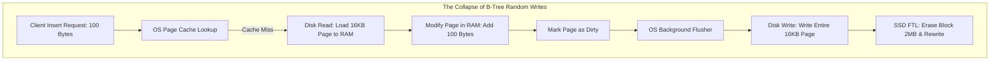
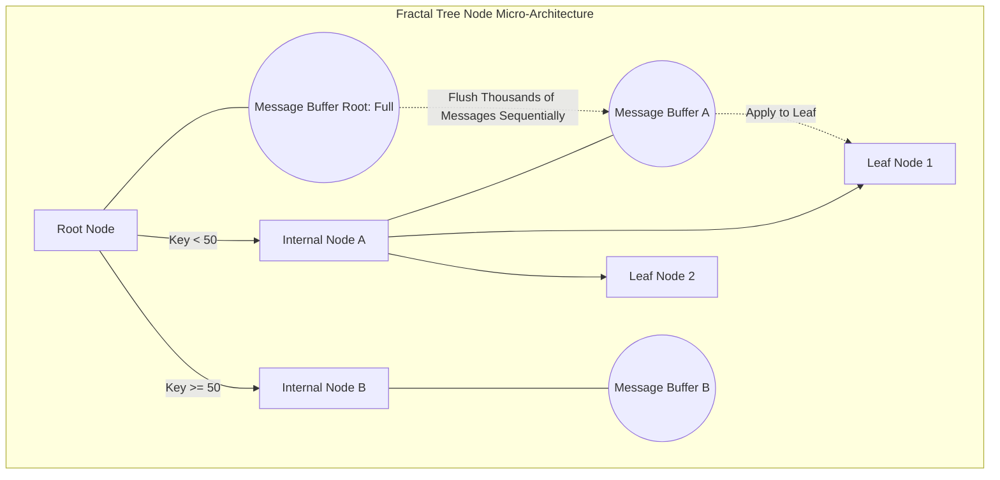

# Fractal Trees and TokuDB: A Data Structure Built for Write-Heavy Workloads

## Why B-Trees Struggle Under Heavy Write Load

For decades the B-Tree, and its B+-Tree variant, has been the default storage structure inside relational databases — MySQL's InnoDB, PostgreSQL, Oracle. It was designed with random reads and range queries in mind. That assumption held up fine for most OLTP systems, but it starts to crack once you point a B-Tree at IoT telemetry, time-series data, or event logs, where millions of inserts land every second. Under that kind of load the B-Tree's architecture runs into a hard physical limit, and this is exactly the gap a fractal tree index was built to close.

**The core problem is write amplification.** To persist a single 100-byte record, the database has to read an entire 16KB page from disk, patch in the new bytes, and write the whole page back. The waste factor can run as high as 160x. That doesn't just eat disk throughput — it also shortens the life of SSDs, because the flash translation layer (FTL) burns through its program/erase cycle budget far faster than it needs to.

This article works through **Fractal Trees** (also called Cache-Oblivious Lookahead Arrays), the structure behind storage engines like TokuDB. We'll cover the math behind the exponential I/O reduction that comes from the **message buffer** design, how Bloom filters solve the read-side cost that this approach introduces, and why reshaping the write path — rather than trying to make individual writes faster — is what actually removes the bottleneck.

---

## Where the B-Tree's Math Breaks Down Under Write-Heavy Workloads

Before appreciating what Fractal Trees do differently, it helps to see precisely where the B-Tree runs out of road under random I/O.

A B-Tree with branching factor $B$ holding $N$ records has a height that grows as $H = \lceil \log_B(N) \rceil$.
On every insert, the engine walks from the root down to the target leaf. If that leaf isn't already resident in RAM — a page cache miss — the system takes a **page fault**.

A page fault means the CPU raises a hardware interrupt, switches into kernel space, and performs synchronous I/O to pull the page into memory. None of that is free, and it happens on the hot path of every write that misses cache.

### The Write Amplification Factor (WAF)

Say the physical page size is $P$ bytes (16KB is typical for InnoDB) and a single row is $R$ bytes (say, 100 bytes).
Once a page is dirtied and its flush cycle comes around, the full 16KB gets written to the NVMe/SSD device — regardless of the fact that only 100 of those bytes actually changed.

The write amplification factor $W_A$ is:
$$ W_A = \frac{P}{R} = \frac{16,384 \text{ bytes}}{100 \text{ bytes}} \approx 163.8 $$

In other words, every 1 GB of logical data inserted turns into roughly 163 GB of physical writes. On spinning disks, these are random writes, and a 10ms seek time caps an HDD at something like 100 IOPS.

SSDs don't have a mechanical seek penalty, but they have their own version of this problem: **garbage collection inside the flash translation layer**.
A NAND cell can't be overwritten in place. The SSD controller has to pull an entire block (commonly 2MB) into internal RAM, patch the 16KB page, erase the block, and rewrite all 2MB. The B-Tree's own write amplification stacks on top of the SSD's internal amplification, and the result is the **"write cliff"** — throughput that looks fine at 50,000 IOPS suddenly falling off to around 200 IOPS once the drive's spare capacity gets consumed.



---

## Fractal Tree Micro-Architecture: Message Buffers and Deferred I/O

Researchers at MIT and Rutgers built Fractal Trees to get around this physical wall, drawing on cache-oblivious data structure theory.
The core idea is simple to state even if the engineering behind it isn't: **turn expensive random writes into batched sequential writes** by deferring I/O instead of doing it immediately.

What makes this work is the **message buffer** — attached to every internal node of the tree, not just the leaves.

When an application inserts `(Key K, Value V)`, that request gets packaged into a message. Instead of walking straight down to the leaf that owns key $K$ and writing there, the engine just drops the message into the buffer of the **root node**, which typically sits in the CPU's L1/L2 cache. The insert returns almost instantly — write latency is on the order of $\sim 1 \mu s$.

### Cascading Flushes

Once the root's message buffer fills up, the system triggers a **flush**.
Messages get sorted by routing key and pushed down, in large batches, into the buffers of the corresponding child nodes.
This flush cascades: thousands of messages move from higher-level nodes to lower-level ones, level by level, until they finally land on leaf nodes and the physical data actually gets rewritten — once.



---

## The I/O Cost Model: Why This Actually Works

The case for Fractal Trees isn't just intuition — it holds up under a straightforward asymptotic analysis.

Let $B$ be the number of records that fit in a message buffer, $N$ the total record count in the structure, and $k$ the tree's branching factor.
Tree height comes out to:
$$ H = \log_k \left( \frac{N}{B} \right) + 1 $$

A B-Tree insert costs, on average:
$$ C_{btree\_insert} = \mathcal{O}\left( \log_k \frac{N}{B} \right) \text{ I/Os} $$

In a Fractal Tree, once a node's buffer holds $B$ messages, flushing it moves all $B$ messages down to $k$ children using $k$ sequential writes.
Moving one block of $B$ messages down a level costs $O(1)$ I/O per child.
So the *amortized* cost of pushing a single message down one level works out to:
$$ \text{Amortized Cost per level} = \mathcal{O}\left( \frac{1}{B} \right) $$

Since a message has to fall through $H$ levels before it lands on a leaf, the total amortized I/O cost per insert is:
$$ C_{fractal\_insert} = \mathcal{O}\left( \frac{\log_k(N/B)}{B} \right) $$

That $B$ sitting in the denominator is the whole point. Because $B$ is typically large — a few thousand to tens of thousands of messages per buffer — the Fractal Tree's insert cost comes out $10^2$ to $10^3$ times lower than the B-Tree's. The I/O bottleneck effectively disappears: a bulk load of billions of rows that used to take days can finish in minutes.

---

## Paying for It Back: Read Amplification and Bloom Filters

There's no free lunch here. Deferring I/O to speed up writes comes at the cost of point reads.

Take a query like `SELECT * FROM table WHERE Key = K`.
In a B-Tree, the engine just walks straight to the leaf.
In a Fractal Tree, the latest value for $K$ might not be sitting in the leaf yet — it could still be parked in a message buffer somewhere higher up the tree. To reconstruct the current state of $K$, the engine would, naively, need to scan every buffer on the path from root to leaf. That's a real **read amplification** problem, and it's the natural tax for the write-side gains above.

TokuDB's answer is to embed a **Bloom filter** in every message buffer.
A Bloom filter is a probabilistic structure that uses a set of hash functions $h_1(x), h_2(x), ..., h_k(x)$ over a bit array to test key membership.
- If the filter returns `False`, the key is guaranteed not to be in that buffer.
- If it returns `True`, the key might be there — with a low false-positive rate, typically around $1\%$.

The read path checks each buffer's Bloom filter on the way down. A `False` result lets the engine skip that buffer entirely, with no need to touch RAM or disk for it. That brings Fractal Tree read performance back in line with a B-Tree's, at roughly $\mathcal{O}(\log_k N)$.

---

## Implementing It: A Multi-Threaded C++ Sketch

Turning this design into working code means paying close attention to CPU cache behavior and concurrency, not just the high-level algorithm.
The message buffer itself shouldn't be a linked list — that fragments the heap and kills spatial locality. A static circular array works better because it plays nicely with the hardware prefetcher.

The pseudocode below models an internal Fractal Tree node. It uses `std::shared_mutex` so reads don't block writes, plus a background thread that flushes the buffer asynchronously once it fills.

```cpp
#include <vector>
#include <shared_mutex>
#include <memory>
#include <thread>

// Define a message structure comprising an Operation type (Insert/Delete/Update)
enum class OpType { INSERT, DELETE, UPDATE };
template<typename K, typename V>
struct Message {
    OpType type;
    K key;
    V value;
    uint64_t transaction_ts;
};

template <typename Key, typename Value>
class FractalTreeNode {
private:
    static constexpr size_t BUFFER_CAPACITY = 65536; // Capacity of 64K Messages
    std::vector<Message<Key, Value>> message_buffer;
    std::vector<Key> pivot_keys;
    std::vector<std::shared_ptr<FractalTreeNode>> children;

    // Read-Write Lock to maximize multi-threaded performance
    std::shared_mutex node_rw_lock;
    BloomFilter<Key> bloom_filter;
    bool is_leaf;

public:
    FractalTreeNode() : is_leaf(false) {
        message_buffer.reserve(BUFFER_CAPACITY);
    }

    // Client interface: returns almost immediately (O(1))
    void insert_message(const Message<Key, Value>& msg) {
        bool needs_flush = false;
        {
            std::unique_lock<std::shared_mutex> lock(node_rw_lock);
            message_buffer.push_back(msg);
            bloom_filter.add(msg.key);

            if (message_buffer.size() >= BUFFER_CAPACITY) {
                needs_flush = true;
            }
        } // Release the lock as quickly as possible

        if (needs_flush) {
            // Push the flush task to a background async Thread Pool
            ThreadPool::submit([this]() { this->cascade_flush_async(); });
        }
    }

private:
    void cascade_flush_async() {
        std::unique_lock<std::shared_mutex> lock(node_rw_lock);

        // Must ensure the Thread Pool doesn't cause a race condition if multiple threads call flush
        if (message_buffer.empty()) return;

        // Partition messages into buckets corresponding to child nodes
        std::vector<std::vector<Message<Key, Value>>> buckets(children.size());
        for (const auto& msg : message_buffer) {
            size_t child_idx = find_routing_index(msg.key);
            buckets[child_idx].push_back(msg);
        }

        // Bulk push down to child nodes
        for (size_t i = 0; i < children.size(); ++i) {
            if (!buckets[i].empty()) {
                // Recursively insert the batch of messages into the child
                children[i]->batch_receive_messages(buckets[i]);
            }
        }

        // Clear the buffer and reinitialize the Bloom Filter
        message_buffer.clear();
        bloom_filter.reset();
    }

    size_t find_routing_index(const Key& key) {
        // Binary Search over the pivot_keys array
        auto it = std::upper_bound(pivot_keys.begin(), pivot_keys.end(), key);
        return std::distance(pivot_keys.begin(), it);
    }
};
```

---

## Where This Leaves Us

Fractal Trees, and structurally similar designs like the Log-Structured Merge Tree used by RocksDB and Cassandra, changed what counted as an acceptable write path for a storage engine. By committing to sequential, batched I/O instead of trying to make random writes cheaper, they remove the B-Tree's write amplification problem at the root rather than patching around it.

TokuDB (later maintained by Percona) had its moment as the go-to MySQL engine for write-heavy workloads that outgrew InnoDB, but RocksDB — via MyRocks — has largely taken over that niche, helped along by a larger open-source community backed by Meta. Even so, the fractal tree index remains a clean demonstration of a principle worth keeping in mind: the fastest way to handle a write isn't to process it faster on disk — it's to avoid touching the disk at all until you actually have to.
