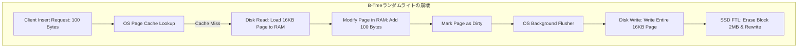
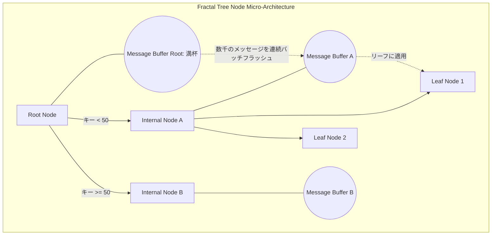

# Fractal TreesとTokuDB: 書き込みが多いワークロードのためにB-Treeを置き換えるデータ構造

## B-Treeが書き込み負荷の前で行き詰まる理由

何十年もの間、B-Treeとその派生であるB+-Treeは、MySQL(InnoDB)、PostgreSQL、Oracleといったリレーショナルデータベース管理システム(RDBMS)のストレージ構造として使われ続けてきました。設計の前提はランダムリード(Random Reads)とレンジクエリ(Range Queries)の最適化です。この前提は多くのOLTPシステムでは十分機能しますが、IoTのテレメトリデータ、時系列(Time-series)データ、イベントログのように毎秒数百万件の挿入(Insert)が発生する環境にB-Treeを当てはめると、途端に破綻し始めます。まさにこのギャップを埋めるために設計されたのが、フラクタルツリーインデックスです。

**根本的な問題は書き込み増幅(Write Amplification)にある。** わずか100バイトのレコードを1件保存するだけで、データベースは16KBのページ全体をディスクから読み込み、変更箇所を書き込み、ページ全体を再度書き戻す必要があります。この無駄は最大160倍にも達します。これはディスクのスループットを圧迫するだけでなく、SSDの寿命も縮めます。フラッシュ変換レイヤー(FTL)が本来必要な量をはるかに超えるペースでプログラム/消去サイクル(P/E Cycles)を消費してしまうからです。

この記事では、TokuDBのようなストレージエンジンを支える**Fractal Trees**(Cache-Oblivious Lookahead Arraysとも呼ばれる)を掘り下げます。**メッセージバッファ(Message Buffer)**という仕組みによってI/Oが指数関数的に減る理由、その代償として生じる読み取りコストをBloom Filterがどう解決するか、そして個々の書き込みを速くしようとするのではなく書き込みパス全体を作り直すことがなぜボトルネック解消の本質なのかを見ていきます。

---

## 書き込みが多いワークロードでB-Treeの数学が破綻する仕組み

Fractal Treesが何を変えたのかを理解する前に、まずB-TreeがランダムなI/O圧力の下でどこで限界を迎えるのかを正確に把握しておく必要があります。

分岐係数(branching factor) $B$ を持ち、$N$ 個のレコードを保持するB-Tree構造の高さは、漸近的に $H = \lceil \log_B(N) \rceil$ となります。
挿入(Insert)操作のたびに、エンジンはルートノードから目的のリーフノードまで走査します。そのリーフノードがまだRAM上に存在しない場合(Page Cache Miss)、システムは**ページフォルト(Page Fault)**を発生させます。

ページフォルトが起きると、CPUはハードウェア割り込み(Hardware Interrupt)を発生させ、カーネルスペース(Kernel Space)へコンテキストスイッチし、データページをRAMに読み込むための同期I/Oを実行します。これらの処理はどれもタダではなく、キャッシュミスを起こした書き込みのたびにホットパス上で発生します。

### ライトアンプリフィケーション係数(Write Amplification Factor - WAF)

物理ページサイズを $P$ バイト(InnoDBでは通常16KB)、1レコード(Tuple/Row)のサイズを $R$ バイト(例: 100バイト)とします。
ページが変更され(Dirty Page)、フラッシュ(Flush)のタイミングが来ると、実際に変わったのは100バイトだけでも、16KB全体をNVMe/SSDディスクへ書き込むことになります。

ライトアンプリフィケーション係数 $W_A$ は次の式で表されます。

$$ W_A = \frac{P}{R} = \frac{16,384 \text{ bytes}}{100 \text{ bytes}} \approx 163.8 $$

つまり、アプリケーションが1GBのデータを挿入するたびに、ディスクは163GB相当の物理的な書き込みを背負うことになります。回転式ディスク(HDD)ではこれらの書き込みはランダムライト(Random Writes)になり、10msのシークタイム(Seek Time)によってHDDの性能は100 IOPS程度まで落ち込みます。

SSDには機械的なシークタイムはありませんが、代わりに別の問題を抱えています。**FTL(Flash Translation Layer)のガベージコレクション**です。
SSDはすでにデータが書き込まれたNANDセルに直接上書きすることができません。ブロック(通常2MB)全体を内部RAMに読み込み、16KBのページを書き換え、ブロック全体を消去してから2MB全体を再度書き込む必要があります。B-Tree自身のライトアンプリフィケーションが、このSSD内部のライトアンプリフィケーションにさらに乗算され、結果として**「Write Cliff」**と呼ばれる現象が起きます。50,000 IOPSほど出ていた性能が、ドライブの予備領域を使い切った途端に200 IOPS程度まで急落するのです。



---

## Fractal Treeのマイクロアーキテクチャ: メッセージバッファとI/Oの遅延

この物理的な壁を越えるため、MITとRutgersの研究者たちはCache-Obliviousデータ構造理論をもとに**Fractal Trees**を考案しました。
核となる発想は単純です。**遅延I/O(Deferred I/O)によって、コストの高いランダムライトをバッチ化されたシーケンシャルライトに変換する**というものです。単純に聞こえますが、それを実現する実装は決して単純ではありません。

これを可能にしているのが**メッセージバッファ(Message Buffer)**で、リーフノードだけでなくツリーの*すべての中間ノード*(Internal Nodes)に取り付けられています。

アプリケーションがデータ`(Key K, Value V)`を挿入すると、このリクエストは「メッセージ」としてパッケージ化されます。キー $K$ を保持する正しいリーフノードまでディスクを掘り下げて書き込む代わりに、エンジンはこのメッセージを、たいていCPUのL1/L2キャッシュに常駐している**ルートノード(Root Node)**のバッファに落とすだけです。挿入操作はほぼ即座に完了し、書き込みのレイテンシはおよそ $\sim 1 \mu s$ にとどまります。

### カスケーディングフラッシュ(Cascading Flushes)

ルートノードのメッセージバッファが満杯になると、システムは**フラッシュ(Flush)**処理を発火させます。
メッセージはルーティングキー(Routing Keys)ごとに仕分けられ、対応する子ノードのバッファへ大きなバッチ単位で押し流されます。
このフラッシュは連鎖的に進みます。何千ものメッセージが上位ノードから下位ノードへと段階的に流れ落ち、最終的にリーフノードへ到達したときにようやく物理データが一度だけ書き換えられます。



---

## I/Oコストモデル: なぜこの仕組みが機能するのか

Fractal Treesの優位性は感覚的な話ではなく、素直な漸近計算量分析(Asymptotic Complexity Analysis)によって裏付けられます。

メッセージバッファに収まるレコード数を $B$、構造全体の総レコード数を $N$、ツリーの分岐係数を $k$ とします。
このときツリーの高さは次のようになります。

$$ H = \log_k \left( \frac{N}{B} \right) + 1 $$

B-Treeでは、1回の挿入操作は平均して次のコストがかかります。

$$ C_{btree\_insert} = \mathcal{O}\left( \log_k \frac{N}{B} \right) \text{ I/Os} $$

Fractal Treeでは、あるノードのバッファが $B$ 個のメッセージで満杯になったとき、それを $k$ 個の子ノードへ $k$ 回のシーケンシャルな書き込みでフラッシュします。
$B$ 個のメッセージのブロックを1段下へ移動させるI/Oコストは、子ノード1つあたり $O(1)$ です。
したがって、**単一のメッセージ**をツリーの1段下へ移動させる*償却コスト(amortized cost)*は次のようになります。

$$ \text{Amortized Cost per level} = \mathcal{O}\left( \frac{1}{B} \right) $$

メッセージがリーフノードに到達するまでには $H$ 段を落ちていく必要があるため、1件のレコードを挿入するための償却I/Oコストの総和は次のとおりです。

$$ C_{fractal\_insert} = \mathcal{O}\left( \frac{\log_k(N/B)}{B} \right) $$

分母に $B$ が現れている、これこそがこの分析の要点です。$B$ は通常大きく、1つのバッファに数千から数万件のメッセージを保持できるため、Fractal Treeの挿入コストはB-Treeよりも $10^2$ から $10^3$ 倍小さくなります。I/Oのボトルネックは実質的に消え、数十億行を一括ロードするような処理は、以前は数日かかっていたものが数分で終わるようになります。

---

## その代償: リードアンプリフィケーションとBloom Filter

ここにも「タダ飯」は存在しません。書き込みを速くするためにI/Oを遅延させた分、ポイントリード(Point Read)側でコストを払うことになります。

`SELECT * FROM table WHERE Key = K`というクエリを例に考えてみます。
B-Treeでは、エンジンはただリーフノードに直行するだけです。
Fractal Treeでは、キー $K$ の最新の値がまだリーフノードに書き込まれておらず、ツリーの上位のどこかのメッセージバッファに留まっている可能性があります。$K$ の現在の状態を組み立てるには、素朴に考えればルートからリーフまでのパス上にある全バッファを走査する必要があり、これは無視できない**リードアンプリフィケーション(Read Amplification)**の問題になります。書き込み側で得た利得に対する自然な代償と言えます。

TokuDBがこれに対して用意した答えは、**すべてのメッセージバッファに Bloom Filter を埋め込む**というものです。
Bloom Filterは、複数のハッシュ関数 $h_1(x), h_2(x), ..., h_k(x)$ を使ってビット配列を維持し、キーの存在有無を判定する確率的データ構造です。
- フィルタが `False` を返した場合、そのキーがそのバッファに存在しないことは保証されます。
- `True` を返した場合、キーが存在する可能性がありますが、偽陽性率(False Positive Rate)はおよそ $1\%$ 程度と低く抑えられています。

読み取りパスでは、パスを下りながら各バッファのBloom Filterをチェックします。`False` が返ればそのバッファはRAM/ディスクへのアクセスなしにまるごとスキップできます。これによってFractal Treeの読み取り性能はB-Tree相当、漸近的には $\mathcal{O}(\log_k N)$ にまで戻ります。

---

## 実装してみる: マルチスレッドC++のスケッチ

この設計を実際に動くコードに落とし込むには、高レベルなアルゴリズムだけでなく、CPUキャッシュの挙動や並行処理(Concurrency)にも細心の注意を払う必要があります。
メッセージバッファ自体は連結リスト(Linked List)にすべきではありません。ヒープの断片化を招き、空間的局所性(Spatial Locality)を壊してしまうからです。ハードウェアプリフェッチャ(Hardware Prefetcher)と相性の良い、静的な循環配列(Circular Array)の方が適しています。

以下の擬似コードは、Fractal Treeの中間ノードをモデル化したものです。読み取りが書き込みをブロックしないように `std::shared_mutex` を使い、バッファが満杯になったらバックグラウンドスレッドが非同期にフラッシュします。

```cpp
#include <vector>
#include <shared_mutex>
#include <memory>
#include <thread>

// 演算(Insert/Delete/Update)を含むメッセージ構造体を定義
enum class OpType { INSERT, DELETE, UPDATE };
template<typename K, typename V>
struct Message {
    OpType type;
    K key;
    V value;
    uint64_t transaction_ts;
};

template <typename Key, typename Value>
class FractalTreeNode {
private:
    static constexpr size_t BUFFER_CAPACITY = 65536; // 64K メッセージの容量
    std::vector<Message<Key, Value>> message_buffer;
    std::vector<Key> pivot_keys;
    std::vector<std::shared_ptr<FractalTreeNode>> children;
    
    // マルチスレッドのパフォーマンスを最大化するためのRead-Write Lock
    std::shared_mutex node_rw_lock;
    BloomFilter<Key> bloom_filter;
    bool is_leaf;

public:
    FractalTreeNode() : is_leaf(false) {
        message_buffer.reserve(BUFFER_CAPACITY);
    }

    // クライアント向けのインターフェース: ほぼ即座に(O(1))で返却
    void insert_message(const Message<Key, Value>& msg) {
        bool needs_flush = false;
        {
            std::unique_lock<std::shared_mutex> lock(node_rw_lock);
            message_buffer.push_back(msg);
            bloom_filter.add(msg.key);
            
            if (message_buffer.size() >= BUFFER_CAPACITY) {
                needs_flush = true;
            }
        } // 可能な限り早くロックを解放
        
        if (needs_flush) {
            // バックグラウンドで実行される非同期スレッドプールにフラッシュタスクをプッシュ
            ThreadPool::submit([this]() { this->cascade_flush_async(); });
        }
    }

private:
    void cascade_flush_async() {
        std::unique_lock<std::shared_mutex> lock(node_rw_lock);
        
        // 複数のスレッドがflushを呼び出した場合、スレッドプールが競合状態(race condition)を引き起こさないことを保証する必要がある
        if (message_buffer.empty()) return;

        // メッセージを子ノードに対応するバケツ(buckets)に分割
        std::vector<std::vector<Message<Key, Value>>> buckets(children.size());
        for (const auto& msg : message_buffer) {
            size_t child_idx = find_routing_index(msg.key);
            buckets[child_idx].push_back(msg);
        }
        
        // 子ノードへ一括プッシュ(Bulk Push)
        for (size_t i = 0; i < children.size(); ++i) {
            if (!buckets[i].empty()) {
                // 子へメッセージのバッチを再帰的に挿入
                children[i]->batch_receive_messages(buckets[i]);
            }
        }
        
        // バッファを空にし、ブルームフィルタを再初期化
        message_buffer.clear();
        bloom_filter.reset();
    }
    
    size_t find_routing_index(const Key& key) {
        // pivot_keys配列での二分探索(Binary Search)
        auto it = std::upper_bound(pivot_keys.begin(), pivot_keys.end(), key);
        return std::distance(pivot_keys.begin(), it);
    }
};
```

---

## まとめ: 現代のエコシステムにおける位置づけ

Fractal Trees、そしてRocksDBやCassandraが採用しているLog-Structured Merge Tree(LSM Tree)のような構造的に似た設計は、ストレージエンジンにとって「許容できる書き込みパス」の定義そのものを変えました。ランダムライトを個別に速くしようとするのではなく、シーケンシャルでバッチ化されたI/Oに徹することで、B-Treeの書き込み増幅問題を対症療法ではなく根本から取り除いたのです。

TokuDB(後にPerconaが保守)は、InnoDBでは手に負えなくなった書き込みが多いワークロード向けのMySQLエンジンとして一時代を築きましたが、その後はMetaが支える大きなオープンソースコミュニティを背景に、MyRocksを通じたRocksDBがこの領域の主役を奪っていきました。それでもフラクタルツリーインデックスは、覚えておく価値のある一つの原則をきれいに示しています。書き込みを速くする最良の方法は、ディスク上での処理を速くすることではなく、本当に必要になるまでディスクに触れないことなのです。
