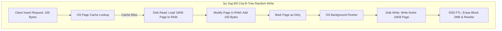
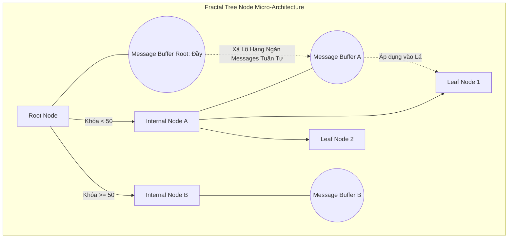

# 07: Fractal Trees và TokuDB: Cấu trúc Thay thế B-Tree cho Write-Heavy Workload

## Tóm tắt & Vấn đề

B-Tree và biến thể B+-Tree đã thống trị kiến trúc lưu trữ của các RDBMS như MySQL (InnoDB), PostgreSQL, Oracle suốt nhiều thập kỷ. Thiết kế của nó nhắm tới việc tối ưu đọc ngẫu nhiên và truy vấn dải. Nhưng khi dữ liệu IoT, time-series và event log trở nên phổ biến — nơi hàng triệu thao tác insert diễn ra mỗi giây — B-Tree bắt đầu lộ ra những giới hạn kiến trúc khó cứu vãn trong write-heavy workload.

Vấn đề cốt lõi là write amplification. Để cập nhật một bản ghi chỉ 100 byte, hệ thống buộc phải đọc, sửa, rồi ghi đè lại toàn bộ một trang 16KB xuống đĩa. Lãng phí I/O ở đây có thể lên tới 160 lần. Điều này không chỉ bóp nghẹt thông lượng đĩa mà còn rút ngắn tuổi thọ SSD, vì flash translation layer (FTL) tiêu hao chu kỳ ghi/xóa nhanh hơn nhiều so với mức cần thiết.

Bài viết này mổ xẻ Fractal Trees — còn gọi là Cache-Oblivious Lookahead Arrays — công nghệ lõi phía sau storage engine TokuDB. Ta sẽ đi qua toán học đằng sau việc giảm I/O nhờ cấu trúc message buffer, cách Bloom filter giải quyết bài toán đọc ngẫu nhiên, và vì sao Fractal Trees có thể né gần như hoàn toàn nút thắt cổ chai vật lý của hệ thống lưu trữ hiện đại.

---

## Giới hạn Toán học của B-Tree trong Tải Ghi

Để hiểu vì sao Fractal Trees ra đời, trước hết cần nhìn thẳng vào chỗ B-Tree sụp đổ dưới áp lực I/O ngẫu nhiên.

B-Tree có hệ số phân nhánh $B$ và chứa $N$ bản ghi, chiều cao cây xấp xỉ $H = \lceil \log_B(N) \rceil$.
Khi chèn một bản ghi, hệ thống duyệt từ root xuống leaf. Nếu leaf đó chưa nằm trong RAM, một page fault xảy ra — CPU phát ngắt phần cứng, chuyển sang kernel space, và thực hiện I/O đồng bộ để nạp trang dữ liệu.

### Hệ số Khuếch đại Ghi (Write Amplification Factor)

Gọi $P$ là kích thước một trang vật lý (thường 16KB trong InnoDB), $R$ là kích thước một bản ghi (ví dụ 100 byte).
Khi trang bị sửa (dirty page) và đến chu kỳ flush, toàn bộ 16KB phải ghi xuống NVMe/SSD, dù chỉ 100 byte thực sự đổi.

Hệ số khuếch đại ghi $W_A$:
$$ W_A = \frac{P}{R} = \frac{16,384 \text{ bytes}}{100 \text{ bytes}} \approx 163.8 $$

Cứ mỗi 1GB dữ liệu ứng dụng chèn vào, đĩa phải cõng thêm khoảng 163GB dữ liệu ghi đè vật lý. Với HDD, các thao tác này là ghi ngẫu nhiên, và seek time 10ms khiến HDD chỉ đạt khoảng 100 IOPS.

Với SSD không có seek time cơ học, vấn đề khác xuất hiện: garbage collection của FTL. SSD không thể ghi đè trực tiếp lên một ô NAND đã có dữ liệu — nó phải đọc cả block (thường 2MB) vào RAM nội bộ, sửa trang 16KB, xóa toàn bộ block, rồi ghi lại 2MB đó. Write amplification của B-Tree cộng dồn với write amplification của FTL tạo ra hiện tượng "write cliff" — hiệu suất SSD rơi đột ngột từ 50.000 IOPS xuống chỉ còn khoảng 200 IOPS sau một thời gian sử dụng.



---

## Vi kiến trúc Fractal Tree: Message Buffers và Trì hoãn I/O

Để lách qua rào cản vật lý này, các nhà nghiên cứu ở MIT và Rutgers phát triển Fractal Trees dựa trên lý thuyết cấu trúc dữ liệu cache-oblivious. Ý tưởng cốt lõi: biến các thao tác ghi ngẫu nhiên đắt đỏ thành các đợt ghi tuần tự theo lô, bằng cách trì hoãn I/O.

Thành phần then chốt là message buffer, gắn vào mọi nút trung gian của cây — không chỉ ở leaf.

Khi ứng dụng chèn `(Key K, Value V)`, yêu cầu này được gói thành một "message". Thay vì phải tìm đúng leaf chứa khóa $K$ rồi ghi vào đó, hệ thống chỉ thả message vào buffer của root node — vốn luôn nằm sẵn trong L1/L2 cache của CPU. Thao tác chèn kết thúc gần như ngay lập tức, độ trễ chỉ khoảng 1 micro giây.

### Hiệu ứng Thác đổ (Cascading Flushes)

Khi buffer của root đầy, hệ thống kích hoạt flush: phân loại các message theo routing key, rồi xả xuống buffer của các nút con tương ứng theo từng lô lớn. Đây là một quy trình thác đổ — hàng nghìn message chảy từ nút cấp cao xuống nút cấp thấp hơn, giống nước tràn qua các bậc thang, cho tới khi chạm leaf và thực sự thay đổi dữ liệu vật lý.



---

## Phân tích Độ Phức Tạp: Mô hình Chi phí I/O

Sức mạnh của Fractal Tree không chỉ là trực giác — nó được chứng minh bằng phân tích độ phức tạp tiệm cận.

Gọi $B$ là kích thước một khối I/O (số bản ghi chứa trong một message buffer), $N$ là tổng số bản ghi, $k$ là hệ số phân nhánh của cây.
Chiều cao cây:
$$ H = \log_k \left( \frac{N}{B} \right) + 1 $$

Với B-Tree, mỗi lần chèn tốn trung bình:
$$ C_{btree\_insert} = \mathcal{O}\left( \log_k \frac{N}{B} \right) \text{ I/Os} $$

Với Fractal Tree, khi buffer tại một nút đầy, nó chứa $B$ message và xả toàn bộ xuống $k$ nút con bằng $k$ lần ghi đĩa tuần tự. Chi phí I/O để chuyển một khối $B$ message xuống một tầng là $O(1)$ cho mỗi nút con. Vậy chi phí khấu hao để di chuyển một message đơn lẻ xuống một tầng của cây là:
$$ \text{Amortized Cost per level} = \mathcal{O}\left( \frac{1}{B} \right) $$

Vì một message phải đi qua $H$ tầng trước khi chạm leaf, tổng chi phí I/O khấu hao để chèn một bản ghi là:
$$ C_{fractal\_insert} = \mathcal{O}\left( \frac{\log_k(N/B)}{B} \right) $$

Hệ số chia $B$ ở mẫu số chính là chỗ hay của phép tính này. Vì $B$ thường rất lớn — từ vài nghìn đến vài chục nghìn message — chi phí chèn của Fractal Tree nhanh hơn B-Tree từ $10^2$ đến $10^3$ lần. Nút thắt I/O gần như biến mất: việc chèn hàng tỷ dòng dữ liệu, thay vì mất vài ngày, giờ chỉ mất vài phút.

---

## Giải Bài toán Read Amplification bằng Bloom Filter

Không có bữa trưa nào miễn phí. Bằng cách trì hoãn I/O để tối ưu ghi, Fractal Tree tự tạo ra một vấn đề mới ở phía đọc.

Xét truy vấn `SELECT * FROM table WHERE Key = K`.
Trong B-Tree, hệ thống chỉ cần đi thẳng xuống leaf. Trong Fractal Tree, bản ghi $K$ vừa được cập nhật có thể chưa nằm ở leaf mà vẫn còn nằm trong một message buffer nào đó ở giữa đường. Hệ thống buộc phải duyệt qua mọi buffer trên đường từ root xuống leaf để tổng hợp trạng thái mới nhất của $K$ — gây ra read amplification đáng kể.

TokuDB giải quyết vấn đề này bằng cách nhúng một Bloom filter vào từng message buffer.
Bloom filter là cấu trúc xác suất, dùng các hàm băm $h_1(x), h_2(x), ..., h_k(x)$ để duy trì một mảng bit kiểm tra sự tồn tại của khóa.
- Nếu trả về `False`: khóa chắc chắn không có trong buffer này.
- Nếu trả về `True`: khóa có thể có (tỷ lệ dương tính giả rất thấp, khoảng 1%).

Khi tìm khóa $K$ trên đường xuống, hệ thống kiểm tra Bloom filter của từng buffer. Nếu `False`, nó bỏ qua buffer đó ngay, không cần nạp buffer từ RAM hay đĩa. Nhờ vậy tốc độ đọc của Fractal Tree được kéo gần về mức của B-Tree, tiệm cận $\mathcal{O}(\log_k N)$.

---

## Hiện thực hóa bằng Mã Nguồn Đa luồng (C++)

Chuyển lý thuyết này thành mã hệ thống đòi hỏi cẩn trọng với cache CPU và lập trình đồng thời. Message buffer không nên là linked list vì nó gây phân mảnh heap và phá vỡ spatial locality — nó nên là một mảng vòng tĩnh để tận dụng hardware prefetcher.

Dưới đây là pseudocode mô phỏng một nút trung gian của Fractal Tree, dùng `std::shared_mutex` để đọc không chặn ghi, cùng một luồng nền xả buffer bất đồng bộ.

```cpp
#include <vector>
#include <shared_mutex>
#include <memory>
#include <thread>

// Định nghĩa một cấu trúc thông điệp bao gồm Phép toán (Insert/Delete/Update)
enum class OpType { INSERT, DELETE, UPDATE };
template<typename K, typename V>
struct Message {
    OpType type;
    K key;
    V value;
    uint64_t transaction_ts;
};

template <typename Key, typename Value>
class FractalTreeNode {
private:
    static constexpr size_t BUFFER_CAPACITY = 65536; // Sức chứa 64K Messages
    std::vector<Message<Key, Value>> message_buffer;
    std::vector<Key> pivot_keys;
    std::vector<std::shared_ptr<FractalTreeNode>> children;
    
    // Read-Write Lock để tối đa hóa hiệu năng đa luồng
    std::shared_mutex node_rw_lock;
    BloomFilter<Key> bloom_filter;
    bool is_leaf;

public:
    FractalTreeNode() : is_leaf(false) {
        message_buffer.reserve(BUFFER_CAPACITY);
    }

    // Giao diện cho Client: Trả về gần như ngay lập tức (O(1))
    void insert_message(const Message<Key, Value>& msg) {
        bool needs_flush = false;
        {
            std::unique_lock<std::shared_mutex> lock(node_rw_lock);
            message_buffer.push_back(msg);
            bloom_filter.add(msg.key);
            
            if (message_buffer.size() >= BUFFER_CAPACITY) {
                needs_flush = true;
            }
        } // Giải phóng khóa nhanh nhất có thể
        
        if (needs_flush) {
            // Đẩy nhiệm vụ xả đệm cho Thread Pool bất đồng bộ chạy nền
            ThreadPool::submit([this]() { this->cascade_flush_async(); });
        }
    }

private:
    void cascade_flush_async() {
        std::unique_lock<std::shared_mutex> lock(node_rw_lock);
        
        // Cần đảm bảo Thread Pool không gây race condition nếu nhiều luồng gọi flush
        if (message_buffer.empty()) return;

        // Phân vùng thông điệp vào các giỏ (buckets) tương ứng với các nút con
        std::vector<std::vector<Message<Key, Value>>> buckets(children.size());
        for (const auto& msg : message_buffer) {
            size_t child_idx = find_routing_index(msg.key);
            buckets[child_idx].push_back(msg);
        }
        
        // Đẩy hàng loạt (Bulk Push) xuống nút con
        for (size_t i = 0; i < children.size(); ++i) {
            if (!buckets[i].empty()) {
                // Đệ quy chèn lô thông điệp vào con
                children[i]->batch_receive_messages(buckets[i]);
            }
        }
        
        // Làm trống bộ đệm và khởi tạo lại Bloom Filter
        message_buffer.clear();
        bloom_filter.reset();
    }
    
    size_t find_routing_index(const Key& key) {
        // Tìm kiếm nhị phân (Binary Search) trên mảng pivot_keys
        auto it = std::upper_bound(pivot_keys.begin(), pivot_keys.end(), key);
        return std::distance(pivot_keys.begin(), it);
    }
};
```

---

## Kết luận: Ý nghĩa trong Hệ sinh thái Hiện đại

Fractal Trees — cùng với các cấu trúc họ hàng như Log-Structured Merge Trees của RocksDB và Cassandra — đã vẽ lại giới hạn thực tế của lưu trữ dữ liệu ghi nặng. Bằng cách ưu tiên mô hình I/O tuần tự theo lô, cấu trúc này gần như loại bỏ hoàn toàn điểm nghẽn write amplification vốn ám ảnh B-Tree.

TokuDB (của Percona) từng là một lựa chọn đáng chú ý để thay InnoDB trong các workload ghi nặng, nhưng RocksDB — thông qua MyRocks — dần chiếm ưu thế nhờ cộng đồng mã nguồn mở lớn hơn từ Facebook. Dù vậy, Fractal Tree vẫn là một minh chứng toán học đẹp cho một nguyên lý đơn giản: kiến trúc phần mềm tối ưu không phải là cố xử lý nhanh hơn trên đĩa, mà là tìm cách né hoàn toàn việc phải chạm vào đĩa.
