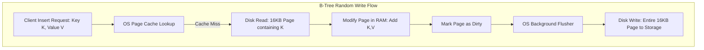
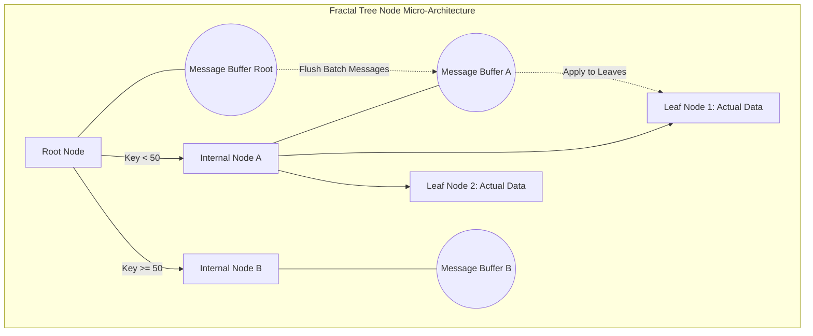

# Fractal Trees: Cấu trúc dữ liệu thay thế B-Tree cho Write-Heavy Workload

## Cơ sở lý thuyết và Phân tích Giới hạn của B-Tree trong Tải Công việc Ghi chép Mật độ Cao

Sự phát triển không ngừng của các hệ thống cơ sở dữ liệu quy mô lớn đòi hỏi những giải pháp lưu trữ có khả năng đáp ứng thông lượng ghi chép cực kỳ cao (write-heavy workload) mà không làm suy giảm hiệu năng truy vấn. Trong nhiều thập kỷ qua, B-Tree và các biến thể của nó, đặc biệt là B+-Tree, đã thống trị kiến trúc của các công cụ lưu trữ (storage engines) nhờ khả năng hỗ trợ tìm kiếm, chèn, xóa và truy vấn dải (range queries) với độ phức tạp thời gian logarit. Tuy nhiên, khi đối mặt với các kịch bản ghi ngẫu nhiên (random writes) với tần suất lớn, B-Tree bộc lộ những hạn chế kiến trúc nghiêm trọng liên quan đến hiện tượng khuếch đại ghi (write amplification) và suy thoái bộ nhớ đệm. Đặt trong bối cảnh toán học, cấu trúc B-Tree với hệ số phân nhánh (branching factor) $B$ và số lượng bản ghi $N$ sẽ có chiều cao tiệm cận $H = \lceil \log_B(N) \rceil$. Khi thực hiện một thao tác chèn ngẫu nhiên, hệ thống cần duyệt từ nút gốc xuống nút lá, kéo theo việc đọc nhiều trang nhớ (pages) từ đĩa từ hoặc ổ cứng thể rắn (SSD) vào bộ nhớ chính (RAM). Giả sử dung lượng của một trang nhớ là $P$ byte và kích thước của một bản ghi mới được chèn là $R$ byte, sự không khớp (mismatch) giữa $R$ và $P$ sinh ra hiện tượng khuếch đại ghi cực kỳ lớn. Hệ điều hành quản lý bộ nhớ thông qua cơ chế phân trang (paging), và để cập nhật một bản ghi nhỏ $R$, hệ thống tệp (file system) buộc phải nạp toàn bộ trang $P$ vào Page Cache, sửa đổi dữ liệu trong bộ nhớ, và sau đó ghi đè toàn bộ trang $P$ xuống đĩa trong chu kỳ đồng bộ hóa tiếp theo (fsync hoặc checkpointing). Tỉ lệ khuếch đại ghi có thể được biểu diễn thông qua công thức $W_{A} = \frac{P}{R}$. Trong thực tế, với $P = 16 \text{ KB}$ (như trong InnoDB của MySQL) và $R = 100 \text{ Bytes}$, mức độ khuếch đại ghi có thể lên tới $160$, nghĩa là một byte dữ liệu hữu ích đòi hỏi 160 byte dữ liệu được ghi xuống thiết bị lưu trữ vật lý.

Hơn nữa, thao tác ghi ngẫu nhiên trên B-Tree phá vỡ tính cục bộ tham chiếu (locality of reference), một nguyên lý cốt lõi trong thiết kế hệ thống phân cấp bộ nhớ (memory hierarchy). Khi kích thước của B-Tree vượt quá dung lượng khả dụng của Page Cache, mỗi thao tác chèn ngẫu nhiên đều có xác suất cao gây ra lỗi trang (page fault). Lỗi trang yêu cầu bộ vi xử lý tạm dừng thực thi, kích hoạt ngắt phần cứng (hardware interrupt), chuyển đổi ngữ cảnh (context switch) sang không gian nhân (kernel space), và thực hiện thao tác I/O đồng bộ để nạp trang dữ liệu từ đĩa vật lý. Chi phí của một thao tác I/O ngẫu nhiên (random I/O) trên đĩa từ truyền thống (HDD) bị chi phối bởi thời gian tìm kiếm của đầu từ (seek time) và độ trễ quay (rotational latency), thường rơi vào khoảng $5$ đến $10$ mili-giây, dẫn đến thông lượng chỉ đạt vài trăm IOPS (Input/Output Operations Per Second). Mặc dù ổ cứng thể rắn (SSD) loại bỏ thời gian định vị cơ học, kiến trúc vi điều khiển của SSD dựa trên công nghệ NAND Flash cũng đối mặt với những vấn đề nghiêm trọng khi xử lý I/O ngẫu nhiên. Lớp dịch thuật bộ nhớ flash (Flash Translation Layer - FTL) bên trong SSD phải liên tục thực hiện quá trình thu gom rác (garbage collection) và di dời các khối dữ liệu (block relocation) để giải phóng các trang (pages) đã bị đánh dấu vô hiệu (invalidated). Quá trình này không chỉ làm giảm tuổi thọ của ổ cứng do giới hạn số chu kỳ ghi/xóa (Program/Erase cycles - P/E cycles) của ô nhớ NAND, mà còn gây ra những đợt suy giảm hiệu năng đột ngột (latency spikes) được biết đến với tên gọi hiện tượng "write cliff". Tác động cộng gộp của việc thiếu tính cục bộ không gian (spatial locality) trong Page Cache và sự suy thoái phần cứng vật lý làm cho B-Tree trở thành một lựa chọn không tối ưu, hay thậm chí là nút thắt cổ chai tồi tệ, đối với các hệ thống phân tán yêu cầu tốc độ nhập liệu thời gian thực hàng triệu sự kiện mỗi giây.



Để vượt qua những rào cản vật lý và toán học này, các nhà khoa học máy tính đã phát triển lý thuyết về cấu trúc dữ liệu Cache-Oblivious và Log-Structured, trong đó Fractal Trees (hay còn gọi là Cache-Oblivious Lookahead Arrays) nổi lên như một giải pháp đột phá. Thay vì ngay lập tức đặt dữ liệu vào vị trí cuối cùng của nó ở nút lá, Fractal Trees hoãn lại (defer) các thao tác I/O thông qua việc tích hợp các bộ đệm thông điệp (message buffers) vào từng nút trung gian của cây. Bằng cách chuyển đổi các thao tác ghi ngẫu nhiên thành các thao tác ghi tuần tự theo lô (batch sequential writes), Fractal Trees đạt được sự giảm thiểu I/O theo cấp số nhân. Trong khi chi phí I/O tiệm cận của một thao tác chèn trên B-Tree là $O(\log_B N)$, Fractal Trees có thể giảm thiểu chi phí này xuống mức $O\left(\frac{\log_B N}{B}\right)$. Sự cải thiện theo hệ số $B$ (thường có giá trị hàng trăm hoặc hàng ngàn) đại diện cho một bước nhảy vọt về thông lượng, biến các tắc nghẽn phần cứng trở thành một vấn đề của quá khứ và mở ra tiềm năng tối đa hóa băng thông của mọi thế hệ phần cứng lưu trữ hiện đại.

## Vi kiến trúc Fractal Tree: Message Buffers và Phân tích Asymptotic Độ phức tạp Thuật toán

Khái niệm cốt lõi tạo nên sự vĩ đại của Fractal Trees nằm ở vi kiến trúc bên trong mỗi nút của cấu trúc cây. Một nút trung gian (internal node) trong Fractal Tree không chỉ chứa các khóa định tuyến (routing keys) và các con trỏ trỏ tới các nút con (child pointers) như trong B-Tree cổ điển, mà nó còn đính kèm một cấu trúc dữ liệu bổ sung vô cùng quan trọng: Bộ đệm thông điệp (Message Buffer). Bộ đệm thông điệp hoạt động như một hàng đợi FIFO (First-In-First-Out) tạm thời, lưu trữ các thay đổi trạng thái bao gồm thao tác chèn (Insert), thao tác xóa (Delete), và thao tác cập nhật (Update) được gói gọn dưới dạng thông điệp (messages). Khi một ứng dụng thực hiện yêu cầu chèn một cặp khóa-giá trị, thay vì hệ thống phải duyệt sâu xuống tận cùng nút lá để ghi nhận sự thay đổi, thông điệp chèn này sẽ bị chặn lại và lưu trữ trực tiếp tại bộ đệm thông điệp của nút gốc (root node). Thao tác chèn kết thúc tại đây đối với ứng dụng, mang lại độ trễ ghi gần như bằng không trong không gian bộ nhớ. Chỉ khi bộ đệm của nút gốc đạt đến giới hạn dung lượng ngưỡng (capacity threshold), hệ thống mới thực hiện một tiến trình xả dữ liệu (flush process) đồng bộ hoặc bất đồng bộ. Trong tiến trình này, các thông điệp được phân loại dựa trên các khóa định tuyến và được đẩy (pushed) xuống các bộ đệm của các nút con tương ứng một cách tuần tự. Quá trình xả (flushing) này có bản chất là hiệu ứng thác đổ (cascading flushes), tuần tự đẩy các thông điệp từ nút cấp cao xuống nút cấp thấp hơn cho đến khi chúng thực sự chạm tới và áp dụng trực tiếp vào các nút lá.



Để chứng minh tính ưu việt của mô hình này dưới góc độ lý thuyết độ phức tạp thuật toán (asymptotic complexity analysis), chúng ta xây dựng một mô hình toán học đánh giá chi phí I/O (I/O cost model). Đặt $B$ là dung lượng của một khối dữ liệu (block size) được đo bằng số lượng bản ghi, $N$ là tổng số lượng bản ghi có trong cấu trúc cây. Cây Fractal được cấu hình với hệ số phân nhánh trung bình là $k$. Chiều cao của cây được xác định xấp xỉ bởi công thức $H = \log_k \left( \frac{N}{B} \right) + 1$. Mỗi nút có một bộ đệm có sức chứa đủ lớn để lưu giữ nhiều thông điệp trước khi phải xả xuống. Khi một bộ đệm xả xuống $k$ nút con, nó di chuyển khối lượng dữ liệu tương đương $B$ bản ghi, do đó trung bình mỗi thông điệp chỉ chịu chi phí khấu hao (amortized cost) là $O\left(\frac{1}{B}\right)$ thao tác ghi I/O ở một cấp độ (level) của cây. Vì thông điệp phải đi qua $H$ cấp độ trước khi đến nút lá, tổng chi phí I/O khấu hao cho việc chèn một bản ghi duy nhất được tính bằng tích phân rời rạc của các luồng dữ liệu qua các tầng: $C_{insert} = O\left(\frac{\log_k(N/B)}{B}\right)$. Khi chúng ta so sánh định lý này với độ phức tạp $O(\log_k(N/B))$ của B-Tree, ta dễ dàng nhận thấy Fractal Tree tối ưu hóa số lần ghi đĩa với hệ số chia $B$. Trong điều kiện thực tế, nếu $B = 1000$ (tương đương với một khối bộ nhớ đệm lớn chứa hàng nghìn bản ghi nhỏ), Fractal Tree có thể ghi dữ liệu nhanh hơn B-Tree từ hàng trăm đến hàng ngàn lần. Việc ghi tuần tự từng khối lớn này hoàn toàn thích ứng với kiến trúc nội tại của các bộ điều khiển đĩa cứng và kỹ thuật ghi vòng (log-structured writes) trên SSD, loại bỏ toàn bộ chu kỳ ghi/xóa vô ích, từ đó kéo dài vòng đời phần cứng lên gấp nhiều lần.

Tuy nhiên, định lý "Không có bữa trưa nào miễn phí" (No Free Lunch Theorem) luôn tồn tại trong khoa học máy tính. Sự đánh đổi lớn nhất của cấu trúc Fractal Tree là chi phí đọc điểm (point read operations) và không gian lưu trữ khuyếch đại (space amplification). Khi một truy vấn yêu cầu tìm kiếm giá trị của một khóa cụ thể, hệ thống không chỉ kiểm tra nội dung tĩnh tại các nút lá, mà phải duyệt qua mọi bộ đệm thông điệp trên đường dẫn từ nút gốc đến nút lá. Lý do là vì thông điệp cập nhật mới nhất có thể vẫn đang lơ lửng ở một nút trung gian nào đó, chưa được xả xuống nút lá vật lý. Điều này đòi hỏi thuật toán tìm kiếm phải tổng hợp (merge) và dung giải (resolve) trạng thái cuối cùng của khóa ngay trên không gian RAM. Để giải quyết rào cản này, các nhà thiết kế hiện thực hóa cơ cấu Bộ lọc Bloom (Bloom Filters) nội bộ bên trong mỗi bộ đệm. Bộ lọc Bloom sử dụng tập hợp các hàm băm (hash functions) $h_1(x), h_2(x), ..., h_k(x)$ để duy trì một mảng bit kiểm tra sự tồn tại của khóa. Nếu bộ lọc Bloom chỉ ra rằng khóa hoàn toàn không tồn tại trong bộ đệm thông điệp hiện tại (với tỉ lệ âm tính giả (false positive) luôn bằng 0), thuật toán đọc có thể bỏ qua quá trình quét bộ đệm đó và đi sâu xuống cây. Bằng cách tính toán ma trận tham số tối ưu cho bộ lọc Bloom dựa trên dung lượng bộ đệm, Fractal Tree giữ vững độ trễ đọc tiệm cận $O(\log_k N)$, đồng bộ hoàn toàn với hiệu năng đọc của B-Tree, đồng thời duy trì thông lượng ghi khổng lồ. 

## Hiện thực hóa Thuật toán, Quản lý Bộ nhớ Hệ điều hành và Tối ưu hóa Phần cứng

Việc chuyển đổi các lý thuyết toán học trừu tượng thành mã nguồn hệ thống yêu cầu sự tinh tế sâu sắc trong việc quản lý cấu trúc dữ liệu trên bộ nhớ (in-memory data structures) và giao tiếp ở cấp độ hạt nhân hệ điều hành (OS kernel level). Ngôn ngữ lập trình hệ thống hiện đại như C++ hoặc Rust thường được sử dụng để xây dựng lớp lưu trữ này nhằm kiểm soát chính xác sự phân bổ con trỏ và bố cục bộ nhớ (memory layout) nhằm tránh những sự cố như suy thoái bộ nhớ đệm CPU (CPU cache thrashing). Trong Fractal Tree, một cấu trúc dữ liệu tiêu biểu đại diện cho một nút trung gian có thể được mô phỏng chi tiết để tận dụng tối đa hệ thống phân cấp L1/L2/L3 Cache của bộ vi xử lý đa nhân. Bộ đệm thông điệp không nên được cài đặt như một danh sách liên kết truyền thống (linked list) do sự rời rạc của các nút trên vùng nhớ Heap, mà thay vào đó là một mảng vòng (circular array) hoặc một cây tự cân bằng kích thước nhỏ tích hợp bên trong. Cách tiếp cận mảng liên tục (contiguous arrays) đảm bảo tính cục bộ không gian (spatial locality), cho phép trình tải trước của CPU (hardware prefetcher) nạp trước (prefetch) các chỉ thị thông điệp vào L1 Cache trước khi vòng lặp thuật toán thực sự cần đến nó.

Dưới đây là một mô hình giả mã (pseudocode) bằng ngôn ngữ C++ minh họa vi kiến trúc bên trong của quá trình chèn thông điệp và cơ chế xả (flush) bất đồng bộ. Lớp `FractalTreeNode` duy trì mảng `messages`, các khóa định vị ranh giới `pivot_keys` và các con trỏ con. Hàm `insert_message` tận dụng kỹ thuật khóa vi mô (fine-grained locking) với `std::shared_mutex` để cho phép thao tác đọc diễn ra đồng thời với quá trình thêm thông điệp. Khi bộ đệm đạt đến ngưỡng bão hòa `BUFFER_CAPACITY`, hệ thống không khóa toàn bộ cây (global lock) mà kích hoạt một luồng nền (background thread) tiếp nhận nhiệm vụ di chuyển dữ liệu thông qua cơ chế CAS (Compare-And-Swap) lock-free, đảm bảo ứng dụng máy khách (client application) không bao giờ bị chặn (blocked) chờ thiết bị I/O. 

```cpp
template <typename Key, typename Value>
class FractalTreeNode {
private:
    static constexpr size_t BUFFER_CAPACITY = 1024 * 64; // 64K Messages
    std::vector<Message<Key, Value>> message_buffer;
    std::vector<Key> pivot_keys;
    std::vector<std::shared_ptr<FractalTreeNode>> children;
    std::shared_mutex node_rw_lock;
    BloomFilter<Key> bloom_filter;
    bool is_leaf;

public:
    void insert_message(const Message<Key, Value>& msg) {
        std::unique_lock<std::shared_mutex> lock(node_rw_lock);
        
        // Append message to buffer and update Bloom Filter
        message_buffer.push_back(msg);
        bloom_filter.add(msg.key);
        
        if (message_buffer.size() >= BUFFER_CAPACITY) {
            // Initiate cascade flush to child nodes
            flush_buffer_to_children();
        }
    }

private:
    void flush_buffer_to_children() {
        // Partition messages into buckets corresponding to child boundaries
        std::vector<std::vector<Message<Key, Value>>> child_buckets(children.size());
        for (const auto& msg : message_buffer) {
            size_t child_idx = find_routing_index(msg.key);
            child_buckets[child_idx].push_back(msg);
        }
        
        // Asynchronously or synchronously push buckets to children
        for (size_t i = 0; i < children.size(); ++i) {
            if (!child_buckets[i].empty()) {
                children[i]->batch_insert_messages(child_buckets[i]);
            }
        }
        
        // Clear current buffer and reset bloom filter
        message_buffer.clear();
        bloom_filter.reset();
    }
};
```

Sự giao thoa giữa cơ chế phần mềm và quản lý phần cứng của hệ điều hành là một không gian tối ưu hóa phức tạp. Khi các nút của Fractal Tree xả dữ liệu vật lý xuống bộ lưu trữ khối (block storage), kích thước của khối I/O được thiết kế cẩn thận để đồng bộ (align) một cách chính xác với kích thước trang vật lý của SSD (Physical Page Size) thường là 4KB, 8KB hoặc 16KB, hoặc thậm chí là giới hạn khối xóa (Erase Block Limit) ở mức 2MB. Bằng cách ghi những tập hợp thông điệp lớn, tuần tự lên không gian đĩa thông qua cờ truy cập nhân (O_DIRECT hoặc thông qua hệ thống tệp tối ưu), hệ thống bỏ qua một cách an toàn Page Cache của hệ điều hành. Kỹ thuật I/O trực tiếp (Direct I/O) này không chỉ tiết kiệm phần trăm tài nguyên CPU hao phí do sao chép bộ nhớ kép (double memory copying) giữa User Space và Kernel Space, mà còn loại bỏ hoàn toàn hiện tượng suy thoái trang (page thrashing). Về mặt kiểm soát tương tranh và nhất quán dữ liệu (Concurrency Control and MVCC), Fractal Tree hỗ trợ đắc lực cấu trúc đa phiên bản. Mỗi thông điệp ghi được gắn nhãn với một định danh chu kỳ giao dịch (Transaction Sequence Number - TSN). Trong khi quét các nút lá và bộ đệm để trả kết quả đọc, thuật toán hệ thống chỉ việc áp dụng các thông điệp có nhãn thời gian nhỏ hơn hoặc bằng nhãn thời gian tương ứng của truy vấn phiên đang cô lập (isolation snapshot). Sự thanh lịch toán học của việc tích hợp bộ đệm làm cho những xung đột (lock contentions) ở mức nút lá gần như tiêu biến, cho phép thiết kế các hệ thống cơ sở dữ liệu xử lý song song khổng lồ với độ cô lập cao (Serializable Isolation) mà thông lượng ghi chép không hề biến động. Nhờ cấu trúc phân mảnh dữ liệu nội bộ chặt chẽ và ổn định, Fractal Tree đã tự định hình bản thân như là giải pháp kế thừa vững vàng, phá vỡ định luật thiết kế truyền thống vốn gắn chặt giới hạn của B-Tree, mở đường cho kỷ nguyên dữ liệu đám mây vô hạn.

## Tối ưu hóa Tìm kiếm và Cơ chế SEO
- Fractal Trees vs B-Tree
- Thay thế B-Tree cho cơ sở dữ liệu
- Write-heavy workload optimization
- Cache-Oblivious Lookahead Arrays
- Giảm write amplification trên SSD
- Thuật toán cấu trúc dữ liệu lưu trữ
- Tối ưu hóa I/O ngẫu nhiên
- Vi kiến trúc cơ sở dữ liệu hiệu năng cao
