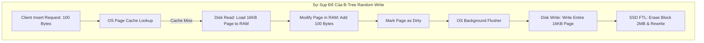
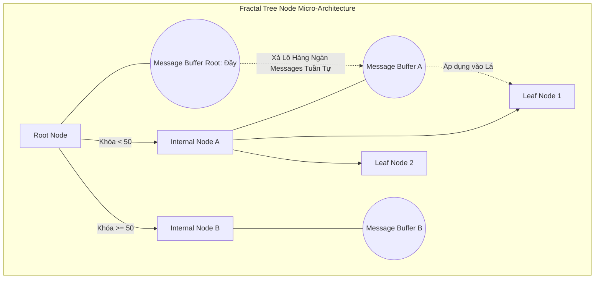

# Fractal Trees và TokuDB: Cấu trúc Dữ liệu Thay thế B-Tree cho Workload Ghi Mật độ Cao

## Vì sao B-Tree đuối sức trước tải ghi lớn

Suốt nhiều thập kỷ, B-Tree và biến thể B+-Tree gần như là lựa chọn mặc định cho cấu trúc lưu trữ bên trong các hệ quản trị cơ sở dữ liệu quan hệ — InnoDB của MySQL, PostgreSQL, Oracle. Thiết kế của nó nhắm vào đọc ngẫu nhiên (Random Reads) và truy vấn dải (Range Queries), và giả định này vẫn ổn với phần lớn hệ thống OLTP thông thường. Nhưng mọi thứ bắt đầu rạn nứt khi B-Tree phải xử lý dữ liệu telemetry IoT, dữ liệu chuỗi thời gian (Time-series), hay nhật ký sự kiện — nơi hàng triệu thao tác chèn (Insert) diễn ra mỗi giây. Dưới áp lực đó, kiến trúc của B-Tree chạm vào một giới hạn vật lý thực sự, và đây chính là khoảng trống mà fractal tree index sinh ra để lấp đầy.

**Vấn đề cốt lõi nằm ở khuếch đại ghi (Write Amplification).** Để lưu một bản ghi chỉ 100 bytes, cơ sở dữ liệu buộc phải đọc nguyên một trang (Page) 16KB từ đĩa, vá phần dữ liệu thay đổi vào, rồi ghi lại toàn bộ trang đó xuống đĩa. Mức lãng phí có thể lên tới 160 lần. Điều này không chỉ bóp nghẹt thông lượng đĩa, mà còn rút ngắn tuổi thọ SSD, vì lớp Flash Translation Layer (FTL) phải tiêu tốn chu kỳ ghi/xóa (P/E Cycles) nhanh hơn nhiều so với mức cần thiết.

Bài viết này sẽ mổ xẻ **Fractal Trees** (còn gọi là Cache-Oblivious Lookahead Arrays) — cấu trúc đứng sau các storage engine như TokuDB. Chúng ta sẽ đi qua phần toán học lý giải vì sao **message buffer** giúp giảm I/O theo cấp số nhân, cách Bloom Filter giải quyết cái giá phải trả ở phía đọc mà cách tiếp cận này tạo ra, và vì sao việc định hình lại toàn bộ đường đi của thao tác ghi — thay vì cố làm từng lần ghi nhanh hơn — mới thực sự loại bỏ được nút thắt cổ chai.

---

## Toán học của B-Tree sụp đổ ở đâu khi tải ghi tăng cao

Trước khi hiểu Fractal Trees làm khác đi điều gì, cần thấy rõ B-Tree cạn kiệt khả năng ở đâu dưới áp lực I/O ngẫu nhiên.

Một cấu trúc B-Tree với hệ số phân nhánh (branching factor) $B$, chứa $N$ bản ghi, có chiều cao tăng theo $H = \lceil \log_B(N) \rceil$.
Mỗi lần thực hiện Insert, engine phải duyệt từ nút gốc xuống nút lá đích. Nếu nút lá đó chưa nằm sẵn trong RAM (Page Cache Miss), hệ thống sẽ phát sinh một **Lỗi Trang (Page Fault)**.

Một lỗi trang buộc CPU phải kích hoạt ngắt phần cứng (Hardware Interrupt), chuyển ngữ cảnh sang Kernel Space, và thực hiện I/O đồng bộ để nạp trang dữ liệu vào RAM. Không bước nào trong số này miễn phí, và chúng xảy ra ngay trên đường găng của mọi thao tác ghi bị cache miss.

### Bài toán Hệ số Khuếch đại Ghi (Write Amplification Factor - WAF)

Giả sử kích thước một trang vật lý là $P$ bytes (thường 16KB với InnoDB), và một bản ghi (Tuple/Row) có kích thước $R$ bytes (ví dụ 100 bytes).
Khi trang bị sửa đổi (Dirty Page) và đến chu kỳ Flush, toàn bộ 16KB phải được ghi xuống ổ NVMe/SSD, bất kể thực tế chỉ có 100 bytes thay đổi.

Hệ số Khuếch đại Ghi $W_A$ được định nghĩa:

$$ W_A = \frac{P}{R} = \frac{16,384 \text{ bytes}}{100 \text{ bytes}} \approx 163.8 $$

Nói cách khác, cứ mỗi 1 GB dữ liệu logic được chèn vào, đĩa phải gánh khoảng 163 GB dữ liệu ghi vật lý. Trên ổ đĩa cơ học (HDD), các thao tác này là ghi ngẫu nhiên (Random Writes), và thời gian Seek 10ms khiến HDD tụt xuống chỉ còn khoảng 100 IOPS.

SSD không có độ trễ seek cơ học, nhưng lại có một phiên bản khác của cùng vấn đề: **cơ chế thu gom rác bên trong Flash Translation Layer**.
Một ô nhớ NAND không thể bị ghi đè trực tiếp. Bộ điều khiển SSD phải đọc cả một khối (Block, thường 2MB) vào RAM nội bộ, vá trang 16KB, xóa toàn bộ Block, rồi ghi lại toàn bộ 2MB. Khuếch đại ghi của bản thân B-Tree chồng lên khuếch đại ghi nội tại của SSD, tạo ra hiện tượng **"Write Cliff"** — hiệu suất đang chạy tốt ở mức 50.000 IOPS bỗng rơi tự do xuống còn khoảng 200 IOPS ngay khi vùng đệm dự phòng của ổ đĩa cạn kiệt.



---

## Vi kiến trúc Fractal Tree: Message Buffer và Sự Trì hoãn I/O

Để vượt qua rào cản vật lý này, các nhà nghiên cứu tại MIT và Rutgers đã phát triển **Fractal Trees**, dựa trên lý thuyết cấu trúc dữ liệu Cache-Oblivious.
Ý tưởng cốt lõi rất dễ phát biểu, dù phần kỹ thuật đứng sau nó thì không hề đơn giản: **biến các thao tác ghi ngẫu nhiên đắt đỏ thành ghi tuần tự theo lô (Batch Sequential Writes)** bằng cách trì hoãn I/O thay vì thực hiện ngay lập tức.

Điều làm nên cơ chế này là **Message Buffer** — được gắn vào *mọi nút trung gian* (Internal Nodes) của cây, không chỉ riêng nút lá.

Khi một ứng dụng chèn `(Key K, Value V)`, yêu cầu này được đóng gói thành một "thông điệp" (Message). Thay vì phải đào sâu xuống đĩa để tìm đúng nút lá chứa khóa $K$ rồi ghi vào đó, engine chỉ đơn giản thả thông điệp này vào Buffer của **Nút Gốc (Root Node)** — vốn thường nằm sẵn trong L1/L2 Cache của CPU. Thao tác chèn hoàn tất gần như ngay lập tức, với độ trễ ghi chỉ khoảng $\sim 1 \mu s$.

### Hiệu ứng Thác đổ (Cascading Flushes)

Khi Message Buffer của Nút Gốc đầy, hệ thống kích hoạt quy trình **Flush**.
Các thông điệp được phân loại theo khóa định tuyến (Routing Keys) rồi đẩy xuống Buffer của các nút con tương ứng theo từng lô lớn.
Quá trình Flush này lan tỏa theo tầng: hàng ngàn thông điệp chảy dần từ nút cấp cao xuống nút cấp thấp hơn, cho tới khi chạm tới Nút Lá — và chỉ tại thời điểm đó, dữ liệu vật lý mới thực sự bị ghi lại, đúng một lần.



---

## Mô hình Chi phí I/O: Vì sao cách tiếp cận này hiệu quả

Ưu thế của Fractal Tree không chỉ là cảm tính — nó được chứng minh bằng một phép phân tích độ phức tạp tiệm cận (Asymptotic Complexity Analysis) khá trực quan.

Gọi $B$ là số bản ghi mà một Message Buffer có thể chứa, $N$ là tổng số bản ghi trong toàn bộ cấu trúc, và $k$ là hệ số phân nhánh của cây.
Chiều cao cây khi đó là:

$$ H = \log_k \left( \frac{N}{B} \right) + 1 $$

Trong B-Tree, mỗi thao tác chèn tốn trung bình:

$$ C_{btree\_insert} = \mathcal{O}\left( \log_k \frac{N}{B} \right) \text{ I/Os} $$

Trong Fractal Tree, khi Buffer của một nút chứa đủ $B$ thông điệp, việc flush sẽ đẩy toàn bộ $B$ thông điệp này xuống $k$ nút con chỉ bằng $k$ thao tác ghi tuần tự.
Chi phí I/O để chuyển một khối $B$ thông điệp xuống một tầng là $O(1)$ I/O cho mỗi nút con.
Do đó, chi phí *khấu hao (amortized cost)* để đẩy **một thông điệp đơn lẻ** xuống một tầng của cây là:

$$ \text{Amortized Cost per level} = \mathcal{O}\left( \frac{1}{B} \right) $$

Vì một thông điệp phải rơi qua $H$ tầng trước khi chạm tới nút lá, tổng chi phí I/O khấu hao để chèn một bản ghi là:

$$ C_{fractal\_insert} = \mathcal{O}\left( \frac{\log_k(N/B)}{B} \right) $$

Sự xuất hiện của $B$ ở mẫu số chính là mấu chốt của toàn bộ phép phân tích. Vì $B$ thường rất lớn — mỗi Buffer có thể chứa từ vài ngàn đến vài chục ngàn thông điệp — chi phí chèn của Fractal Tree thấp hơn B-Tree từ $10^2$ đến $10^3$ lần. Nút thắt cổ chai I/O gần như biến mất: một tác vụ nạp hàng loạt (bulk load) hàng tỷ dòng dữ liệu, trước đây mất vài ngày, giờ có thể hoàn tất trong vài phút.

---

## Cái giá phải trả: Read Amplification và Bloom Filter

Không có bữa trưa nào miễn phí ở đây cả. Việc trì hoãn I/O để tăng tốc ghi kéo theo một cái giá ở phía đọc điểm (Point Read).

Xét một truy vấn như `SELECT * FROM table WHERE Key = K`.
Trong B-Tree, engine chỉ cần đi thẳng xuống nút lá.
Trong Fractal Tree, giá trị mới nhất của $K$ có thể chưa nằm ở nút lá — nó vẫn có thể đang "lơ lửng" trong một Message Buffer nào đó ở tầng cao hơn của cây. Để tái tạo trạng thái hiện tại của $K$, về mặt lý thuyết engine phải quét qua mọi Buffer trên đường đi từ Root xuống Leaf, và đó là một vấn đề **Read Amplification** đáng kể — cái giá tự nhiên phải trả cho lợi ích đã đạt được ở phía ghi.

Giải pháp của TokuDB là nhúng một **Bloom Filter** vào từng Message Buffer.
Bloom Filter là một cấu trúc dữ liệu xác suất, sử dụng một tập các hàm băm $h_1(x), h_2(x), ..., h_k(x)$ trên một mảng bit để kiểm tra sự tồn tại của khóa.
- Nếu Bloom Filter trả về `False`: khóa chắc chắn không tồn tại trong Buffer đó.
- Nếu trả về `True`: khóa có thể tồn tại, với tỉ lệ dương tính giả (False Positive) khá thấp, thường vào khoảng $1\%$.

Khi tìm khóa $K$ trên đường đi xuống, hệ thống kiểm tra Bloom Filter của từng Buffer. Nếu kết quả là `False`, engine bỏ qua hoàn toàn Buffer đó mà không cần chạm tới RAM hay đĩa. Nhờ vậy, tốc độ đọc của Fractal Tree được kéo về gần tương đương B-Tree, ở mức tiệm cận $\mathcal{O}(\log_k N)$.

---

## Hiện thực hóa: Bản phác thảo C++ đa luồng

Biến thiết kế này thành mã chạy được đòi hỏi sự chú ý kỹ lưỡng tới hành vi CPU cache và lập trình đồng thời (Concurrency), chứ không chỉ dừng ở thuật toán mức cao.
Bản thân Message Buffer không nên là một Danh sách liên kết (Linked List) — cấu trúc đó gây phân mảnh Heap và phá vỡ tính cục bộ không gian (Spatial Locality). Một mảng vòng tĩnh (Circular Array) phù hợp hơn nhiều vì nó tận dụng tốt Hardware Prefetcher.

Đoạn giả mã dưới đây mô phỏng một nút trung gian của Fractal Tree. Nó dùng `std::shared_mutex` để đọc không chặn ghi, cùng một luồng nền (Background Thread) xả Buffer bất đồng bộ mỗi khi Buffer đầy.

```cpp
#include <vector>
#include <shared_mutex>
#include <memory>
#include <thread>

// Định nghĩa một cấu trúc thông điệp bao gồm Phép toán (Insert/Delete/Update)
enum class OpType { INSERT, DELETE, UPDATE };
template<typename K, typename V>
struct Message {
    OpType type;
    K key;
    V value;
    uint64_t transaction_ts;
};

template <typename Key, typename Value>
class FractalTreeNode {
private:
    static constexpr size_t BUFFER_CAPACITY = 65536; // Sức chứa 64K Messages
    std::vector<Message<Key, Value>> message_buffer;
    std::vector<Key> pivot_keys;
    std::vector<std::shared_ptr<FractalTreeNode>> children;
    
    // Read-Write Lock để tối đa hóa hiệu năng đa luồng
    std::shared_mutex node_rw_lock;
    BloomFilter<Key> bloom_filter;
    bool is_leaf;

public:
    FractalTreeNode() : is_leaf(false) {
        message_buffer.reserve(BUFFER_CAPACITY);
    }

    // Giao diện cho Client: Trả về gần như ngay lập tức (O(1))
    void insert_message(const Message<Key, Value>& msg) {
        bool needs_flush = false;
        {
            std::unique_lock<std::shared_mutex> lock(node_rw_lock);
            message_buffer.push_back(msg);
            bloom_filter.add(msg.key);
            
            if (message_buffer.size() >= BUFFER_CAPACITY) {
                needs_flush = true;
            }
        } // Giải phóng khóa nhanh nhất có thể
        
        if (needs_flush) {
            // Đẩy nhiệm vụ xả đệm cho Thread Pool bất đồng bộ chạy nền
            ThreadPool::submit([this]() { this->cascade_flush_async(); });
        }
    }

private:
    void cascade_flush_async() {
        std::unique_lock<std::shared_mutex> lock(node_rw_lock);
        
        // Cần đảm bảo Thread Pool không gây race condition nếu nhiều luồng gọi flush
        if (message_buffer.empty()) return;

        // Phân vùng thông điệp vào các giỏ (buckets) tương ứng với các nút con
        std::vector<std::vector<Message<Key, Value>>> buckets(children.size());
        for (const auto& msg : message_buffer) {
            size_t child_idx = find_routing_index(msg.key);
            buckets[child_idx].push_back(msg);
        }
        
        // Đẩy hàng loạt (Bulk Push) xuống nút con
        for (size_t i = 0; i < children.size(); ++i) {
            if (!buckets[i].empty()) {
                // Đệ quy chèn lô thông điệp vào con
                children[i]->batch_receive_messages(buckets[i]);
            }
        }
        
        // Làm trống bộ đệm và khởi tạo lại Bloom Filter
        message_buffer.clear();
        bloom_filter.reset();
    }
    
    size_t find_routing_index(const Key& key) {
        // Tìm kiếm nhị phân (Binary Search) trên mảng pivot_keys
        auto it = std::upper_bound(pivot_keys.begin(), pivot_keys.end(), key);
        return std::distance(pivot_keys.begin(), it);
    }
};
```

---

## Kết luận: Vị trí của Fractal Tree trong hệ sinh thái hiện nay

Fractal Trees, cùng với các cấu trúc có tinh thần tương tự như Log-Structured Merge Tree (LSM Tree) mà RocksDB và Cassandra sử dụng, đã thay đổi định nghĩa về một "đường ghi chấp nhận được" đối với storage engine. Thay vì cố gắng làm cho từng thao tác ghi ngẫu nhiên nhanh hơn, chúng cam kết với I/O tuần tự theo lô, và nhờ đó loại bỏ tận gốc vấn đề khuếch đại ghi của B-Tree, thay vì chỉ vá víu xung quanh nó.

TokuDB (sau này được Percona duy trì) từng có thời là engine MySQL được chọn cho các workload ghi mật độ cao mà InnoDB không còn kham nổi, nhưng RocksDB — thông qua MyRocks — dần chiếm lĩnh vị trí đó nhờ một cộng đồng mã nguồn mở lớn hơn, được hậu thuẫn bởi Meta. Dù vậy, fractal tree index vẫn là một minh chứng rõ ràng cho một nguyên lý đáng ghi nhớ: cách nhanh nhất để xử lý một thao tác ghi không phải là xử lý nó nhanh hơn trên đĩa, mà là tránh chạm vào đĩa cho tới khi thực sự bắt buộc phải làm vậy.
