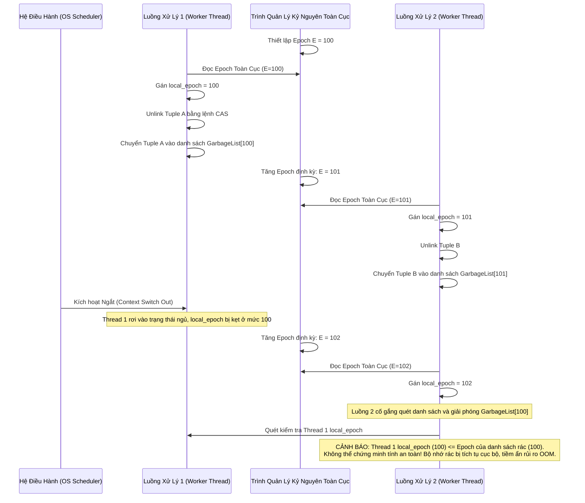

# Multi-Version Concurrency Control (MVCC): Phân Tích Kiến Trúc Mức Thấp và Hệ Sinh Thái Quản Lý Bộ Nhớ Đa Luồng

Quản lý đồng thời đa phiên bản (Multi-Version Concurrency Control - MVCC) là một trong những nền tảng vi kiến trúc quan trọng nhất của các hệ quản trị cơ sở dữ liệu hiện đại và các hệ thống bộ nhớ giao dịch đa luồng (Transactional Memory). Khác với các phương pháp kiểm soát đồng thời dựa trên khóa bảo vệ (Lock-based Concurrency Control) truyền thống vốn thường xuyên gây ra hiện tượng tắc nghẽn (bottleneck) do sự cạnh tranh gay gắt giữa các thao tác đọc và ghi, MVCC duy trì song song nhiều phiên bản vật lý cho cùng một thực thể dữ liệu logic. Ở cấp độ trừu tượng toán học, giả sử trạng thái logic của cơ sở dữ liệu tại thời điểm $t$ được đại diện bởi một tập hợp các tuple $D_t = \{R_1, R_2, \dots, R_n\}$, kiến trúc MVCC sẽ ánh xạ mỗi tuple logic $R_i$ thành một tập hợp các phiên bản vật lý $V_i = \{v_{i,1}, v_{i,2}, \dots, v_{i,m}\}$. Mỗi phiên bản $v_{i,j}$ đi kèm với một khoảng thời gian hợp lệ được xác định bởi hai nhãn thời gian (timestamp): $[T_{begin}, T_{end})$. Sự phân tách này cho phép các giao dịch chỉ đọc (read-only transactions) có thể truy xuất trạng thái dữ liệu nhất quán tại một thời điểm trong quá khứ mà không bị chặn bởi các giao dịch đang thực hiện thao tác ghi trên cùng một thực thể, từ đó tối đa hóa thông lượng (throughput) của hệ thống đa lõi (multi-core architecture). Tùy thuộc vào cấp độ cô lập (isolation level) được thiết lập, ví dụ như Read Committed hay Serializable, cỗ máy xử lý giao dịch sẽ quyết định việc gán giá trị thời gian thực thi (execution timestamp) nào vào các thao tác đọc nhằm thiết lập khả năng phục hồi (recoverability) và tính tuần tự (serializability). Tuy nhiên, cái giá phải trả cho tính năng cô lập dữ liệu tuyệt vời này là sự phức tạp tột độ trong việc thiết kế cấu trúc dữ liệu lưu trữ dưới cùng, giải quyết bài toán cấp phát bộ nhớ động, đồng bộ hóa các bộ đệm CPU (CPU cache coherence) và thu gom rác (garbage collection) ở cấp độ vi mô. Các kỹ sư thiết kế hệ thống phải đối mặt với một loạt các rào cản vật lý từ phần cứng, bao gồm chi phí truy cập bộ nhớ chính (memory latency), hiện tượng trượt bộ đệm (cache miss), sự cố chia sẻ sai (false sharing) trên các đường bộ đệm (cache lines) 64-byte, và cả sự tiêu tốn chu kỳ CPU do các lệnh rào cản bộ nhớ (memory barriers) được tạo ra bởi các chỉ thị đồng bộ hóa đa bộ xử lý (multiprocessor synchronization primitives) như Compare-And-Swap (CAS). Trong một kiến trúc MVCC tiêu chuẩn, cấu trúc của một phiên bản (version tuple) thường bao gồm các trường siêu dữ liệu (metadata) khổng lồ được nhúng trực tiếp vào tiêu đề (header) của tuple để phục vụ cho thuật toán xác định tính khả biến (visibility algorithms). Cụ thể, siêu dữ liệu này bao gồm định danh giao dịch tạo ra phiên bản ($TxnID_{creator}$), định danh giao dịch xóa phiên bản ($TxnID_{deleter}$), và một con trỏ định tuyến (pointer) liên kết phiên bản hiện tại với các phiên bản cũ hơn hoặc mới hơn trong chuỗi phiên bản (version chain). Kích thước của tiêu đề này thường dao động từ 16 đến 32 byte tùy thuộc vào cơ chế lưu trữ, điều này làm tăng đáng kể áp lực lên băng thông bộ nhớ và làm giảm hiệu suất sử dụng dung lượng của bộ đệm L1/L2/L3 khi phải đọc một lượng lớn dữ liệu không chứa thông tin thực tế của ứng dụng (payload data).

## Kiến Trúc Lưu Trữ Đa Phiên Bản và Phân Tích Đường Đi Con Trỏ (Pointer Chasing) Ở Mức Độ Vi Mô

Quá trình tổ chức lưu trữ các phiên bản vật lý có thể được phân loại thành ba mô hình thiết kế chính: Append-Only Storage, Time-Travel Storage, và Delta Storage, mỗi mô hình mang lại những đặc tính hiệu năng hoàn toàn khác biệt ở mức độ tương tác với kiến trúc phân cấp bộ nhớ của CPU. Mô hình Append-Only Storage, được áp dụng nổi bật trong hệ quản trị cơ sở dữ liệu PostgreSQL, hoạt động theo nguyên tắc lưu trữ mọi phiên bản mới của một tuple ngay trong cùng một không gian bộ nhớ (table space) với tất cả các phiên bản trước đó. Khi một giao dịch thực hiện thao tác cập nhật (update), thay vì sửa đổi trực tiếp trên cấu trúc dữ liệu hiện tại, hệ thống sẽ cấp phát một vùng nhớ mới, sao chép toàn bộ nội dung của tuple, thay đổi các thuộc tính mong muốn, và chèn tuple mới này vào cuối trang dữ liệu (data page). Về mặt toán học, nếu một tuple có kích thước là $S_{tuple}$ byte và tỷ lệ cập nhật của hệ thống là $\lambda$ cập nhật/giây, thì tốc độ phình to bộ nhớ của mô hình Append-Only được tính bằng phương trình vi phân $\frac{dM}{dt} = \lambda \times S_{tuple}$. Mô hình này cực kỳ thân thiện với các hệ thống lưu trữ có đặc tính ghi tuần tự tốt như đĩa từ truyền thống (HDD) hoặc thậm chí là một số loại SSD dựa trên NAND flash, nhưng lại bộc lộ nhược điểm chết người đối với cấu trúc bộ đệm CPU khi các phiên bản liên tiếp của cùng một tuple logic có thể bị phân mảnh và nằm rải rác ở những trang nhớ vật lý khác nhau, phá vỡ nguyên lý địa phương không gian (spatial locality). Khi thuật toán duyệt chuỗi phiên bản (version traversal) buộc phải theo dõi các con trỏ từ phiên bản mới nhất lùi về phiên bản cũ nhất để tìm ra phiên bản khả biến, bộ xử lý trung tâm (CPU) sẽ vấp phải hiện tượng đuổi bắt con trỏ (pointer chasing) khét tiếng. Giả sử xác suất xảy ra lỗi trượt bộ đệm mức 3 (L3 Cache Miss) khi giải tham chiếu một con trỏ là $P_{miss}$, thời gian truy xuất bộ nhớ chính là $T_{mem}$ (thường rơi vào khoảng 100ns), và thời gian truy xuất bộ đệm L1 là $T_{cache}$ (khoảng 1ns). Nếu chiều dài của chuỗi phiên bản cần phải duyệt là $L$, thời gian kỳ vọng cực đại để xác định được một phiên bản hợp lệ cho một giao dịch đọc sẽ được mô hình hóa bằng kỳ vọng toán học: $$E[T_{resolve}] = L \times \left( P_{miss} \times T_{mem} + (1 - P_{miss}) \times T_{cache} \right)$$. Với cấu trúc Append-Only, tham số $P_{miss}$ thường tiến rất sát tới biên giới hạn $1.0$ do tính chất phân mảnh bộ nhớ tột độ của nó, khiến hiệu suất quét dữ liệu (table scan) và độ trễ phản hồi (response latency) suy giảm thảm hại theo chiều dài của chuỗi phiên bản.

Để khắc phục rào cản vật lý này, mô hình Delta Storage (được sử dụng bởi các cỗ máy như MySQL, Oracle, và SAP HANA) đã được thiết kế lại hoàn toàn dựa trên nguyên lý vi phân dữ liệu. Thay vì tạo ra một bản sao toàn bộ của tuple mỗi khi có sự kiện cập nhật, Delta Storage sẽ thay đổi trực tiếp (in-place update) phiên bản chính nằm trong vùng nhớ không gian bảng (main tablespace) và song song đó, nó sinh ra một bản ghi vi phân (delta record) chứa duy nhất những trường dữ liệu vừa bị thay đổi cùng với các siêu dữ liệu cần thiết. Bản ghi vi phân này được đẩy vào một khu vực bộ nhớ chuyên biệt được thiết kế dưới dạng bộ đệm vòng (ring buffer) gọi là Rollback Segment hoặc Undo Log. Nếu ký hiệu độ lớn trung bình của dữ liệu bị thay đổi là $S_{\Delta}$, thì phương trình biểu diễn tốc độ tiêu hao dung lượng bộ nhớ của không gian Undo Log sẽ trở thành $\frac{dM_{undo}}{dt} = \lambda \times (S_{\Delta} + S_{metadata})$, mang lại một chi phí bộ nhớ nhỏ hơn rất nhiều so với mô hình Append-Only, đặc biệt trong các bảng dữ liệu khổng lồ với hàng trăm cột nhưng mỗi lần cập nhật chỉ chạm tới một vài trường dữ liệu. Tuy nhiên, định lý không có bữa trưa miễn phí (no free lunch theorem) cũng áp dụng tại đây: mặc dù Delta Storage tối ưu hóa việc sử dụng bộ nhớ và cải thiện tốc độ ghi cho không gian lưu trữ chính, việc tái tạo (reconstruct) một phiên bản cũ của dữ liệu lại đòi hỏi chu trình tính toán cực kỳ chuyên sâu từ các đơn vị logic số học (ALU) của CPU. Để tạo ra trạng thái của tuple tại thời điểm $t_{past}$, bộ vi xử lý phải bắt đầu từ phiên bản mới nhất hiện diện trong vùng bộ nhớ chính và tuần tự áp dụng đảo ngược (reverse apply) các bản ghi vi phân $\Delta_k, \dots, \Delta_1$ được nối ghép thông qua danh sách liên kết. Thuật toán tái tạo phiên bản này yêu cầu việc thao tác trên cấu trúc bit và vùng nhớ vô định (raw memory buffers) bằng các phép toán con trỏ ép kiểu trực tiếp nhằm tránh tối đa chi phí của cơ chế đa hình ảo (virtual polymorphism) hay cấp phát động trong quá trình thực thi vòng lặp. Hơn nữa, để đảm bảo tính an toàn bộ nhớ trong môi trường đa luồng, thuật toán phải sử dụng các lệnh rào cản bộ nhớ với định danh `std::memory_order_acquire` nhằm đảm bảo rằng quá trình giải tham chiếu các con trỏ từ vùng Undo Log không bị ảnh hưởng bởi việc tái sắp xếp lệnh (instruction reordering) của phần cứng đường ống (pipeline) CPU hoặc của chính bộ biên dịch tối ưu (compiler optimization).

Đặc biệt ở cấp độ mã nguồn hệ thống, hiện tượng chia sẻ sai (false sharing) là một mối đe dọa thường trực trong kiến trúc Delta Storage khi siêu dữ liệu về cờ khóa (lock flags) hoặc định danh giao dịch nằm trên cùng một đường truyền bộ đệm (cache line) có kích thước 64-byte với con trỏ Undo của một luồng xử lý khác. Theo giao thức đảm bảo tính nhất quán bộ đệm MESI (Modified, Exclusive, Shared, Invalid), khi một lõi CPU (Core A) thực thi lệnh ghi lên một biến, toàn bộ đường bộ đệm chứa biến đó trên tất cả các lõi CPU khác sẽ bị đánh dấu là Không hợp lệ (Invalid). Nếu lõi CPU (Core B) đang cố gắng đọc một biến hoàn toàn khác nhưng tình cờ nằm trên cùng đường bộ đệm đó, nó sẽ phải chịu đựng một lỗi trượt bộ đệm (cache miss) cực kỳ đắt đỏ và buộc phải yêu cầu tải lại toàn bộ 64-byte từ bộ nhớ chính hoặc bộ đệm chia sẻ L3, dẫn đến việc các lõi CPU liên tục tước đoạt quyền sở hữu độc quyền (exclusive ownership) của cache line, tạo ra lưu lượng thông tin liên lạc dư thừa khổng lồ trên bus bộ nhớ nối chuẩn (interconnect bus). Để vượt qua rào cản vật lý này, các cấu trúc dữ liệu tuple trong mã nguồn Low-Level thường sử dụng chỉ thị căn chỉnh bộ nhớ như `alignas(64)` trong C++ nhằm ép buộc trình biên dịch phân bổ không gian sao cho các trường dữ liệu có khả năng bị tranh chấp cao được tách biệt an toàn trên các đường bộ đệm riêng rẽ, dẫu cho hành động này có thể làm phình to kích thước của siêu dữ liệu bộ đệm do sự phân mảnh nội vi (internal fragmentation).

```mermaid
graph TD
    subgraph CPU_Cache_Architecture
        L1_Core1[L1 Cache Core 0] -->|MESI Invalidate| L1_Core2[L1 Cache Core 1]
        L1_Core1 --> L2_Core1[L2 Cache]
        L1_Core2 --> L2_Core2[L2 Cache]
        L2_Core1 --> L3_Shared[L3 Shared Cache]
        L2_Core2 --> L3_Shared
    end
    subgraph Physical_Memory_Layout
        L3_Shared --> Main_Tuple[Main Version Tuple\nHeader | ID | Payload\nalignas 64 bytes]
        Main_Tuple -.->|Atomic Undo Pointer| Delta_1[Delta Record 1\nTxnID | Changed Columns]
        Delta_1 -.->|Atomic Undo Pointer| Delta_2[Delta Record 2\nTxnID | Changed Columns]
    end
    style Main_Tuple fill:#f9f,stroke:#333,stroke-width:2px
    style Delta_1 fill:#bbf,stroke:#333,stroke-width:1px
    style Delta_2 fill:#bbf,stroke:#333,stroke-width:1px
```

```cpp
// Minh họa cấu trúc dữ liệu Low-Level của Delta Storage trong môi trường Đa luồng
#include <atomic>
#include <cstdint>
#include <cstring>

// Căn chỉnh 64 byte để ngăn chặn False Sharing trên cache line
struct alignas(64) UndoRecord {
    std::atomic<UndoRecord*> next_delta;
    uint64_t transaction_id;
    uint32_t delta_size;
    // Biến mảng linh hoạt (flexible array member) lưu trữ raw bytes của diff
    uint8_t payload[]; 
};

struct alignas(64) TupleHeader {
    uint64_t xmin; // Transaction ID tạo ra tuple (Start Timestamp)
    std::atomic<uint64_t> xmax; // Transaction ID cập nhật/xóa tuple
    std::atomic<UndoRecord*> undo_pointer; // Con trỏ Head tới Undo Log Chain
    uint32_t tuple_length;
    uint16_t attributes_mask;
};

// Hàm đọc và áp dụng Delta sử dụng cơ chế Wait-Free
void reconstruct_version(const TupleHeader* base_tuple, uint64_t read_ts, uint8_t* output_buffer) {
    // Copy base tuple vào buffer an toàn của tiến trình cục bộ
    std::memcpy(output_buffer, reinterpret_cast<const uint8_t*>(base_tuple) + sizeof(TupleHeader), base_tuple->tuple_length);
    
    // Acquire semantics ngăn chặn CPU reordering, đảm bảo tính nhất quán dữ liệu read-side
    UndoRecord* current_delta = base_tuple->undo_pointer.load(std::memory_order_acquire);
    
    while (current_delta != nullptr) {
        // Kiểm tra tính khả biến toán học: Nếu Transaction ID của bản ghi Delta nhỏ hơn Read TS
        if (current_delta->transaction_id < read_ts) {
            // Version này đã hoàn toàn hợp lệ đối với không gian thời gian của read_ts
            break; 
        }
        
        // Áp dụng thuật toán delta patch trực tiếp trên buffer byte
        apply_binary_patch_logic(output_buffer, current_delta->payload, current_delta->delta_size);
        
        // Tiếp tục đi sâu vào quá khứ theo chuỗi liên kết
        current_delta = current_delta->next_delta.load(std::memory_order_acquire);
    }
}
```

## Thuật Toán Thu Gom Rác (Garbage Collection) và Nền Tảng Kỷ Nguyên (Epoch-Based Reclamation) Ở Biên Giới Hiệu Năng

Sự tích tụ liên tục của các phiên bản cũ và các bản ghi vi phân trong kiến trúc MVCC tạo ra áp lực khổng lồ lên hệ thống cấp phát bộ nhớ vật lý. Nếu không có một cơ chế thu gom rác (Garbage Collection - GC) hoạt động mãnh liệt, phân tán và chính xác tuyệt đối ở tầng lõi, ứng dụng sẽ nhanh chóng tiêu hao cạn kiệt tài nguyên bộ nhớ truy cập ngẫu nhiên (RAM), dẫn đến việc hệ điều hành phải kích hoạt cơ chế hoán đổi trang nhớ (swapping/paging) chậm chạp ra đĩa từ cứng, hoặc tồi tệ hơn, kích hoạt cơ chế phòng vệ cuối cùng: bộ đồ tể OOM Killer (Out-Of-Memory Killer). Nguyên lý cơ bản để xác định một phiên bản trở thành rác (garbage) là khi nó không còn bất kỳ cơ hội nào để được đọc bởi bất kỳ giao dịch nào đang hoạt động hiện hành hoặc sẽ được khởi tạo trong tương lai. Ký hiệu tập hợp các giao dịch đang hoạt động tại thời điểm hiện tại là $ActiveTxns$, nhãn thời gian đọc của hệ thống (read timestamp) nhỏ nhất trong số tất cả các giao dịch này được gọi là đường chân trời sự kiện của cơ sở dữ liệu (Database Event Horizon), hay về mặt toán học là $TS_{min} = \min_{T \in ActiveTxns} (TS_{read}(T))$. Một phiên bản vật lý $v_k$ được định danh là có thể thu hồi (reclaimable) khi và chỉ khi nhãn thời gian kết thúc của nó (thời điểm nó bị thay thế hoặc vô hiệu hóa bởi một phiên bản mới) nhỏ hơn triệt để so với đường chân trời sự kiện này. Về mặt biểu thức logic vị từ (Predicate Logic): $$\forall v_k \in Memory, \text{IsGarbage}(v_k) \iff v_k.T_{end} < TS_{min}$$. Thách thức lớn nhất về mặt kiến trúc hệ thống không nằm ở việc chứng minh nguyên lý toán học này, mà nằm ở bài toán làm thế nào để thực thi quá trình đánh dấu và giải phóng bộ nhớ một cách đồng thời, không cần khóa chặn (lock-free), và không can thiệp phá hủy hiệu suất vào bộ đệm chỉ mục (instruction cache) của bộ vi xử lý trung tâm. Các phương pháp thu gom rác truyền thống nhắm vào từng tuple riêng biệt (Tuple-level GC) thường yêu cầu các nhân thread quét nền (background vacuum threads) duyệt liên tục qua toàn bộ cấu trúc dữ liệu cây (B+ Tree) hoặc bảng băm (Hash Table) để tìm kiếm các tuple thỏa mãn điều kiện thời gian. Chu trình này không chỉ gây lãng phí băng thông bộ nhớ khổng lồ và phá hủy toàn bộ các dữ liệu nền tảng đang được lưu sẵn trong bộ đệm L3 (hiện tượng cache pollution), mà nó còn tước đoạt các tài nguyên tính toán ALU quý giá vốn dĩ nên được ưu tiên tối đa cho các giao dịch trực tiếp từ ứng dụng.

Để vượt qua nút thắt cổ chai vô hình của kiến trúc von Neumann này, các hệ thống cơ sở dữ liệu xử lý trong bộ nhớ (In-Memory Database Systems) tốc độ cực cao định hướng kiến trúc đa lõi như Silo, Hekaton, hay HyPer đã loại bỏ hoàn toàn mô hình GC dựa trên việc đếm số tham chiếu (Reference Counting) vốn đòi hỏi các lệnh nguyên tử (atomic operations) đắt đỏ, và áp dụng một kỹ thuật quản lý bộ nhớ phi tập trung tiên tiến mang tên Kỷ Nguyên Thu Hồi (Epoch-Based Reclamation - EBR). Thay vì theo dõi sự tồn tại vòng đời của từng tuple cụ thể lẻ tẻ, hệ thống phân chia trục thời gian thực thi vô hạn thành các đoạn kỷ nguyên vĩ mô rời rạc được đánh số tuần tự theo cấu trúc số nguyên 64-bit đơn điệu, ký hiệu là $E_1, E_2, \dots, E_i$. Hệ thống duy trì một biến số toàn cục duy nhất, thường được gọi là Kỷ Nguyên Toàn Cục Hiện Tại (Global Current Epoch - $E_{global}$), được tăng lên đều đặn bởi một tiểu trình nền chuyên biệt (background epoch manager) sau mỗi chu kỳ thời gian cố định (ví dụ: khoảng thời gian $40ms$ mỗi nhịp). Mỗi luồng thực thi (worker thread) cục bộ xử lý giao dịch, khi bắt đầu xử lý một nhóm yêu cầu mới, sẽ tự động đăng ký (register) bản thân nó với kỷ nguyên toàn cục này bằng cách đọc và lưu trữ giá trị $E_{global}$ vào một biến lưu trữ cục bộ của luồng (Thread-Local Storage - TLS) có tên là $E_{local}$. Sự chênh lệch định lượng giữa các kỷ nguyên cục bộ của từng luồng cho phép hệ thống biết được một cách toàn diện luồng nào đang bị tụt hậu lại phía sau hoặc đang rơi vào trạng thái ngủ. Khi một luồng thực thi thao tác cập nhật (update) hoặc xóa (delete) và quyết định tách rời (unlink) một phiên bản cũ $v_k$ khỏi cấu trúc dữ liệu chính (thường sử dụng lệnh CAS để hoán đổi con trỏ), nó tuyệt đối không bao giờ gọi hàm giải phóng bộ nhớ hệ thống (như hàm `free()` trong C hoặc `delete` trong C++) ngay lập tức. Hành động bốc đồng đó sẽ gây ra lỗi cấp phát lửng (use-after-free anomaly) vốn có thể làm sụp đổ (Segmentation Fault) toàn bộ hệ thống ngay tức khắc nếu một luồng đang đọc đồng thời (concurrent reader thread) khác vẫn còn đang sở hữu con trỏ tham chiếu trỏ tới vùng nhớ đang bị giải phóng đó. Thay vì thế, luồng sẽ đưa con trỏ của vùng nhớ phi thường này vào một danh sách hàng đợi rác cục bộ của chính luồng đó (thread-local garbage queue) tương ứng với kỷ nguyên $E_{global}$ hiện tại, gọi là $GarbageList[E_{global}]$. Quá trình gọi hàm `free()` thu gom bộ nhớ thực sự đối với hệ điều hành chỉ xảy ra ở chế độ an toàn trên các danh sách rác của những kỷ nguyên đã vượt qua giới hạn nguy hiểm (safe epochs). Một kỷ nguyên $E_{safe}$ được coi là bảo toàn và tuyệt đối không còn bất kỳ con trỏ ma nào trên bất kỳ bộ ghi (register) hay ngăn xếp (stack) nào của bất kỳ luồng nào có khả năng tham chiếu tới nó, khi và chỉ khi tất cả các luồng thực thi đang hoạt động trong toàn bộ hệ thống đều đã tiến bước sang các kỷ nguyên mới hơn nó ít nhất hai chu kỳ, tức là giới hạn: $$\forall thread \in ActiveThreads, E_{local}(thread) > E_{safe} + 1$$. Phương pháp EBR ở cấp độ lý thuyết đã loại bỏ hoàn toàn yêu cầu phải sử dụng các bộ đếm tham chiếu nguyên tử (atomic reference counters) liên tục trên từng tuple, qua đó giảm thiểu triệt để số lượng các lệnh Compare-and-Swap (CAS) vốn tiêu thụ hàng trăm chu kỳ CPU để đồng bộ hóa và giảm lưu lượng giao tiếp độc hại giữa các lõi CPU trên đường truyền kết nối vòng (Ring Interconnect). Dẫu vậy, EBR không phải là viên đạn bạc hoàn hảo; nó tồn tại một điểm yếu chí mạng về kiến trúc khi đối mặt với các luồng thực thi bị treo đột ngột (stalled threads). Nếu một luồng bị ngắt (preempted) đột ngột bởi bộ định thời (scheduler) của nhân hệ điều hành trong một thời gian dài (có thể do quá tải I/O) và không thể tiếp tục vòng lặp cập nhật $E_{local}$ của mình, toàn bộ quá trình xác định kỷ nguyên an toàn và thu gom rác trên tất cả các luồng đang hoạt động khác sẽ bị đình trệ (blocked) hoàn toàn, khiến lượng bộ nhớ rác bị dồn ứ vô hạn với tốc độ hàm mũ mà không thể giải phóng.



## Quản Lý Bộ Nhớ Phân Trang và Vi Kiến Trúc NUMA (Non-Uniform Memory Access)

Hệ thống quản lý bộ nhớ của hệ điều hành (OS Memory Management Subsystem) cũng tương tác một cách sâu sắc và đôi khi gây ra những hệ quả khôn lường đối với các thuật toán MVCC ở cấp độ cấu trúc hạ tầng. Khi cơ chế thu gom rác cuối cùng cũng hoạt động và giải phóng những vùng nhớ khổng lồ, trả lại quyền kiểm soát vùng nhớ đó cho hệ điều hành thông qua lệnh hệ thống `munmap()`, nhân hệ điều hành (kernel) bắt buộc phải tiến hành bảo vệ tính toàn vẹn hệ thống bằng cách vô hiệu hóa các mục tương ứng trong Bộ đệm Biên dịch Địa chỉ Ảo (Translation Lookaside Buffer - TLB) của tất cả các lõi CPU trong hệ thống nhằm ngăn chặn các vi phạm bảo mật, tấn công truy cập chéo, hoặc lỗi phân trang (page fault). Quá trình bắt buộc này kích hoạt cơ chế bắn phá TLB (TLB Shootdown), một trong những cơn ác mộng lớn nhất của lập trình hiệu năng cao. Cơ chế này yêu cầu lõi CPU đang thực thi lệnh giải phóng phải gửi một tín hiệu Ngắt Liên Xử Lý (Inter-Processor Interrupt - IPI) trực tiếp vào hàng đợi ngắt phần cứng của các lõi CPU khác. Khi nhận được tín hiệu ngắt này, các lõi CPU khác đang chạy với tốc độ tối đa buộc phải xả sạch đường ống lệnh (pipeline flush), tạm dừng quá trình thực thi khối mã lệnh không gian người dùng (userspace code), thực hiện lệnh chuyển ngữ cảnh (context switch) tốn kém vào trong không gian kernel, vô hiệu hóa cấu trúc TLB tương ứng, gửi tín hiệu xác nhận (ACK) trở lại qua bus hệ thống, và sau đó mới khôi phục ngữ cảnh để tiếp tục công việc. Độ trễ khổng lồ sinh ra từ các ngắt IPI đồng bộ này có thể dao động lên tới hàng chục nghìn chu kỳ đồng hồ (clock cycles), gây ra những đợt tăng vọt vi mô (micro-spikes) nghiêm trọng trong chỉ số độ trễ phân vị thứ 99 (p99 latency) của toàn bộ cỗ máy cơ sở dữ liệu đang vận hành dưới tải trọng cực lớn.

Để né tránh cái bẫy kỹ thuật này, các kiến trúc sư bộ nhớ cơ sở dữ liệu hiện đại thường gạt bỏ hoàn toàn bộ cấp phát mặc định của hệ điều hành và tự thiết kế xây dựng các công cụ cấp phát bộ nhớ không gian người dùng chuyên dụng (custom userspace allocators), ví dụ điển hình như các thuật toán được lấy cảm hứng từ thư viện `jemalloc` hay `tcmalloc`. Trong các cấu trúc này, bộ nhớ không bao giờ thực sự được trả lại (unmapped) cho hệ điều hành ngay lập tức. Thay vào đó, nó được đưa vào trạng thái ngủ đông và được giữ lại trong các kho lưu trữ (arenas) và bộ đệm luồng cục bộ (thread-local memory caches). Các khối nhớ nhỏ $4KB$ hoặc Các trang nhớ siêu lớn (Huge Pages) có kích thước lên tới $2MB$ sẽ được đưa vào cơ chế tái chế trực tiếp bên trong không gian ảo của chính ứng dụng cơ sở dữ liệu, cho phép cấp phát lại cho các phiên bản tuple mới mà không tốn chi phí gọi hệ thống. Hành động này triệt tiêu hoàn toàn sự cần thiết của các cuộc tấn công bắn phá TLB và nâng cao đáng kể thông lượng giao dịch. Đồng thời, cấu trúc dữ liệu MVCC còn phải được tinh chỉnh để tôn trọng kiến trúc truy cập bộ nhớ không đồng nhất (Non-Uniform Memory Access - NUMA). Trong một bo mạch chủ sở hữu nhiều khe cắm CPU vật lý (multi-socket system), bộ nhớ RAM được chia thành các node NUMA gắn liền trực tiếp với mỗi CPU. Việc một luồng đang chạy trên lõi CPU ở NUMA node 0 truy cập vào dữ liệu lịch sử phiên bản của một tuple được cấp phát nằm ở bộ nhớ của NUMA node 1 sẽ phải đi qua liên kết kết nối bộ xử lý (chẳng hạn như Intel QPI hoặc AMD Infinity Fabric), dẫn đến việc tăng gấp đôi hoặc gấp ba độ trễ truy xuất. Các công cụ MVCC tiên tiến nhận thức được sự hiện diện của NUMA sẽ sử dụng API của hệ điều hành (như `numa_alloc_onnode` trên Linux) để cưỡng chế việc cấp phát vùng nhớ Rollback Segment của một giao dịch sao cho nó nằm chính xác trên cùng một node NUMA với luồng đang thực thi giao dịch đó, loại trừ vĩnh viễn các chuyến đi bộ nhớ xuyên vùng tốn kém.

Tựu trung lại, bằng cách đi sâu vào tầng vi kiến trúc, sự thiết kế của hệ thống MVCC không đơn thuần chỉ là lý thuyết về quản lý chuỗi lịch sử phiên bản thời gian; nó là một bản giao hưởng phức tạp và khắc nghiệt của các quyết định tối ưu hóa bộ nhớ cấp thấp, dự đoán luồng dữ liệu (data fetching predictability), phân tách đường đệm, và khả năng làm chủ sự phức tạp của cơ chế đồng bộ hóa đa bộ xử lý NUMA. Khi các công nghệ phần cứng tiếp tục mở rộng chân trời giới hạn thông qua Bộ nhớ Giao dịch Phần cứng (Hardware Transactional Memory - HTM, ví dụ như Intel TSX cung cấp cơ chế khóa phần cứng không tốn kém) hoặc Bộ nhớ Bất biến (Non-Volatile RAM - NVRAM, mang đến khả năng cấu trúc lại bộ đệm vòng với độ bền vững dữ liệu vĩnh cửu), các cấu trúc lưu trữ và giải thuật định tuyến phiên bản của MVCC chắc chắn sẽ phải tiếp tục chuyển mình, cấu trúc lại định dạng lưu trữ vi phân và loại bỏ các kỹ thuật GC cũ kỹ để tiến tới kỷ nguyên của thông lượng siêu dữ liệu đột phá trong các thập kỷ tới.

## SEO Metadata
- **Focus Keyword:** MVCC Low-Level, Multi-Version Concurrency Control, Quản lý bộ nhớ đa luồng, Garbage Collection EBR, NUMA Architecture, CPU Cache False Sharing.
- **Meta Description:** Khám phá kiến trúc vi mô và thuật toán cốt lõi của Multi-Version Concurrency Control (MVCC) ở mức độ Low-Level, phân tích bộ đệm CPU L3, Pointer Chasing, False Sharing, và Epoch-based Reclamation (EBR).
- **Tags:** MVCC, Concurrency Control, C++ Low-Level, Database Micro-Architecture, Lock-free Algorithms, Epoch-based Reclamation, Delta Storage.
