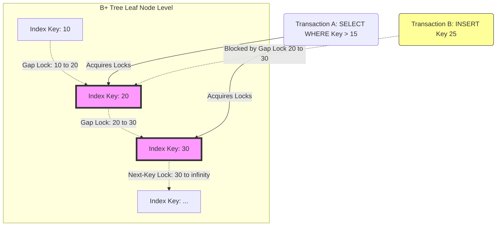

# 10: Transaction Isolation Levels: Write Skew、Read Skew、Phantom Readsを読み解く

## この記事の概要

並行データベースシステムにおけるTransaction Isolation Levelsを、実装の観点から掘り下げていく。特に厄介な3つの異常、Read Skew、Write Skew、Phantom Readsについて、マイクロアーキテクチャ、アルゴリズム、そして裏にある数学的な構造まで見ていく。ANSI SQL-92規格の定義だけでは現象を言い当てるにとどまり、実装の中身までは見えてこない。そこでこの記事では、これらの異常を検出・防止するために使われるSerialization Graph(SG)という形式的な手法を軸に説明する。

読み進めると、次のようなことが分かるはずだ。

- 従来のDirty ReadsやNon-repeatable Readsという定義が、MVCCやSnapshot Isolationを使う現代の環境ではなぜ物足りないのか。
- cache line bouncing(MESIプロトコル)、CPUのメモリ並べ替え、NUMAアーキテクチャといった現象が、ソフトウェア側のロックや分離アルゴリズムとどう絡み合うか。
- Serializable Snapshot Isolation(SSI)、Epoch-Based Memory Reclamation、Next-Key LockingによるPredicate Lockingの近似実装がどう設計されているか。
- データの不変条件を壊さずに、高スループットなトランザクションシステムをどう組み立て、デバッグするか。

## 根本にある問題

並行性の高いOLTPシステムでは、データベースエンジンはACID特性(Atomicity、Consistency、Isolation、Durability)を守りながら、毎秒何千もの重複したトランザクションをさばかなければならない。ここには根本的なトレードオフがある。Strict Serializabilityは数学的な正しさを保証するが、実行を逐次化してしまい性能を犠牲にする。一方Concurrencyはハードウェアの利用率を上げられるが、気づかないうちにデータが壊れるリスクを背負う。

ANSI SQL-92規格は、特定の異常を防げるかどうかでisolation levels(Read Uncommitted、Read Committed、Repeatable Read、Serializable)を分類しようとした。

1. **Dirty Reads:** まだコミットされていないデータを読んでしまうこと。
2. **Non-repeatable Reads(Read Skew):** 同じタプルを2回読んだのに、違う値が返ってくること。
3. **Phantom Reads:** 並行するinsert/deleteのせいで、範囲クエリを再実行すると異なる行の集合が返ってくること。

ただ、この古典的な枠組みには大きな抜け穴がある。Write Skewだ。これはSnapshot Isolation(PostgreSQLやOracleなど)を使うシステムに構造的に潜んでいる異常で、SQL-92の分類にはそもそも登場しない。根本的な問題は、現代のデータベースエンジンが単純なロックだけには頼れないという点にある。CPUキャッシュの無効化やメモリオーバーヘッドを最小限に抑えながら、分離違反を示すトポロジー上のサイクルを捉えるには、依存関係を追跡するための有向非巡回グラフのような、メモリ効率の良い複雑な数学的構造を維持する必要がある。

## 詳細な技術分析

### トランザクション異常とSerialization Graphの基礎

isolation levelsを形式的に扱うには、トランザクションの履歴を操作のスケジュールとして分解する必要がある。トランザクション$T_i$は読み取り操作$r_i(x)$と書き込み操作$w_i(x)$からなり、コミット$c_i$かアボート$a_i$で終わる。あるスケジュール$S$は、それと同じ結果を生む直列スケジュールが存在するとき、strictly conflict-serializable(厳密な競合直列化可能)と呼ばれる。

異常を検出するには、Serialization Graph(SG)——コミット済みトランザクションをノード、競合をエッジとする有向グラフ——を組み立てる。

- **Write-Read(WR):** コミットされたばかりのデータを読む依存関係。
- **Read-Write(RW):** あるトランザクションが、別のトランザクションが読んだデータを上書きする逆依存関係(anti-dependency)。
- **Write-Write(WW):** ブラインドライト同士の依存関係。

スケジュール$S$がstrictly conflict-serializableであるのは、そのSerialization Graph $SG(S)$にサイクルが存在しない場合に限られる。Adyaらが提唱したGeneralized Isolation Levelの枠組みでは、あらゆる異常が有向サイクルとしてモデル化される。分離レベルの実装は、結局のところCPUのボトルネックにならない範囲で、$O(1)$や$O(V+E)$の時間で特定の巡回構造を動的に刈り込む処理に落ち着く。

### Read Skewとマイクロアーキテクチャの整合性

Read Skewは、トランザクションが構造的に一貫したスナップショットを見るべきだという前提を破る。Read Committedでは、$T_1$が$x$を読み、$T_2$が$x$を上書きしてコミットし、その後$T_1$が再び$x$を読むと違う値が返ってくる。

Snapshot Isolationはこれを、単調増加するトランザクションタイムスタンプ$TS(T_i)$を割り当てることで防ぐ。エンジンは可視性関数$V(x, T_i)$を評価し、$CTS(T_j) \le TS(T_i)$を満たす$x$の物理バージョンを探す。

内部では、タプルのバージョンはロックフリーのリングバッファ内でアトミックなCompare-And-Swap(CAS)を使って管理される。Core Aがタプルを更新するとき、そのcache lineの排他的所有権(MESIプロトコルの'Modified'状態)を取得する。Core Bがバージョンチェーンを読もうとするとcache missが発生し、Core Aは共有L3キャッシュへの書き戻し('Shared'状態への移行)を強いられる。このcache line bouncingがスループットの天井を作ってしまう。

さらに、古いバージョンを回収するにはEpoch-Based Reclamationが必要になる。`munmap`のような単純なメモリ解放を使うと、全コアを止めるInter-Processor Interrupts(IPI)経由のTranslation Lookaside Buffer(TLB)シュートダウンが発生してしまう。高度なエンジンはHuge Pages上のカスタムslabアロケータを使ってこれを回避している。

```rust
// Rustでのロックフリーな可視性評価
use std::sync::atomic::{AtomicPtr, Ordering};
use crossbeam_epoch::{self as epoch, Atomic};

struct TupleVersion {
    val: i64,
    commit_ts: u64,
    prev: Atomic<TupleVersion>,
}

fn evaluate_visibility<'g>(
    chain_head: &Atomic<TupleVersion>, txn_start_ts: u64, guard: &'g epoch::Guard
) -> Option<i64> {
    let mut current_ptr = chain_head.load(Ordering::Acquire, guard);
    while !current_ptr.is_null() {
        let current_version = unsafe { current_ptr.deref() };
        if current_version.commit_ts <= txn_start_ts {
            return Some(current_version.val);
        }
        current_ptr = current_version.prev.load(Ordering::Acquire, guard);
    }
    None
}
```

### Write Skewの厄介さ

Write Skewは特にSnapshot Isolationで問題になる。2つのトランザクションが一貫したスナップショットを見て、互いに重なるデータを読みながら、アプリケーションの不変条件で結びついた別々の集合を書き換えるときに起こる。

**例:** 不変条件 $A + B \ge 0$ を考える。
- $A=100, B=100$。
- $T_1$は$A, B$を読み、$A$を150減らす(ローカルでは $100+100-150 \ge 0$ なので問題なく見える)。
- $T_2$は$A, B$を読み、$B$を150減らす(こちらも $100+100-150 \ge 0$ で問題なく見える)。
- 書き込み集合が重ならないため、両方ともコミットされてしまう($W(T_1) \cap W(T_2) = \emptyset$)。
- 結果: $A = -50, B = -50$。不変条件は破られている。

数学的に言えば、Write Skewは Serialization Graphにおける「危険な構造」——2つの隣接するRW(逆依存)エッジからなるサイクル $T_i \xrightarrow{rw} T_j \xrightarrow{rw} T_k$ ——に対応する。

これを防ぐために使われるのがSerializable Snapshot Isolation(SSI)だ。SSIは各トランザクションノードに`inConflict`と`outConflict`というフラグを持たせ、実行時に読み書きの逆依存関係を動的に追跡する。あるトランザクションが入出力両方のRWエッジを持つ「ピボット」になったとき、システムはサイクルを断ち切るためにどちらかのトランザクションを強制的にアボートさせる。CPUソケットをまたいでこれを効率よく追跡するには、Thread-Local Storage(TLS)上に密度の高い分割可能なハッシュセットを持つ必要がある。

### Phantom ReadsとPredicate Locking

Phantom Readsは動的な範囲クエリ(`SELECT * WHERE condition`)に影響する。$T_1$が範囲クエリを実行して集合$\mathcal{S}_1$を得る。$T_2$が条件に合致する行を新しく挿入する。$T_1$が同じクエリを再実行すると$\mathcal{S}_2$が返ってくる($\mathcal{S}_1 \neq \mathcal{S}_2$)。

まだ存在しない行を物理的にロックすることはできない。理論的な解決策はPredicate Locking——数学的な述語$f(row) \rightarrow boolean$そのものをロックする方法——だが、任意のブール述語をすべての書き込み操作に対して評価するのは計算量的に厳しい(NP困難)。

そこで現代のデータベースは、B+Tree上でNext-Key LockingやGap Lockingを使ってこれを近似する。範囲クエリがリーフノードに到達すると、エンジンは個々のレコードだけでなく、連続するレコードの間にある物理的な「隙間」に対しても共有読み取りロックを取得する。



gap locksの管理には、物理リソースIDを複雑なキューにマッピングする、futexで保護されたハッシュバケットを使う洗練されたロックマネージャが必要になる。その背後では、TarjanのStrongly Connected Componentsアルゴリズムを常時バックグラウンドで走らせるデッドロック検出が支えている。

## 教訓とベストプラクティス

1. **SQL-92のIsolation定義を鵜呑みにしない:** 「Repeatable Read」や「Snapshot Isolation」でPostgreSQLやOracleを使っている場合、明示的に`SERIALIZABLE`へ引き上げるか、アプリケーション側で`SELECT ... FOR UPDATE`ロックを実装しない限り、Write Skewに対して構造的に脆弱なままだ。
2. **ロックのハードウェアコストを理解する:** ロックを取得するたびに、アトミック操作がcache lineを書き換え、MESIプロトコル経由で他の全CPUコアにそれを無効化させる。高スループットのinsertにおけるgap locksは、必然的に大規模なCPU相互接続の混雑を引き起こす。
3. **Phantomの隙間に注意する:** 「医師は1日8シフト以上持てない」といった集計制約にアプリケーションが依存している場合、通常の行ロックだけでは並行insertから守れない。Next-Key Locking(MySQLのSerializableでは自動的に働く)に頼るか、集計対象を個別のロック可能な行としてマテリアライズする必要がある。
4. **HTMは有望な方向性だ:** Intel TSXのようなHardware Transactional Memory(HTM)を使えば、競合検出をL1/L2キャッシュ内で完結させられる。肥大化しがちなソフトウェアのSSIグラフを迂回し、マルチソケットNUMA環境でもこれまでにないスケーリングが可能になる。

## 結論

トランザクションの分離を保証するというのは、単なるデータベース意味論の話では終わらない。実際にはシリコンの物理特性、メモリレイテンシ、グラフ理論との地道な戦いだ。SQL-92の現象論的な定義からSerialization Graphという形式的な数学へと軸足を移したことで、現代のエンジンは毎秒数百万のトランザクションを処理できるようになった。SSI、Epoch-Based Reclamation、Gap Lockingの実装を低いレベルまで理解しておくことは、データ損失ゼロで超高スケールのトランザクションシステムを作ろうとするアーキテクトにとって欠かせない知識だ。
