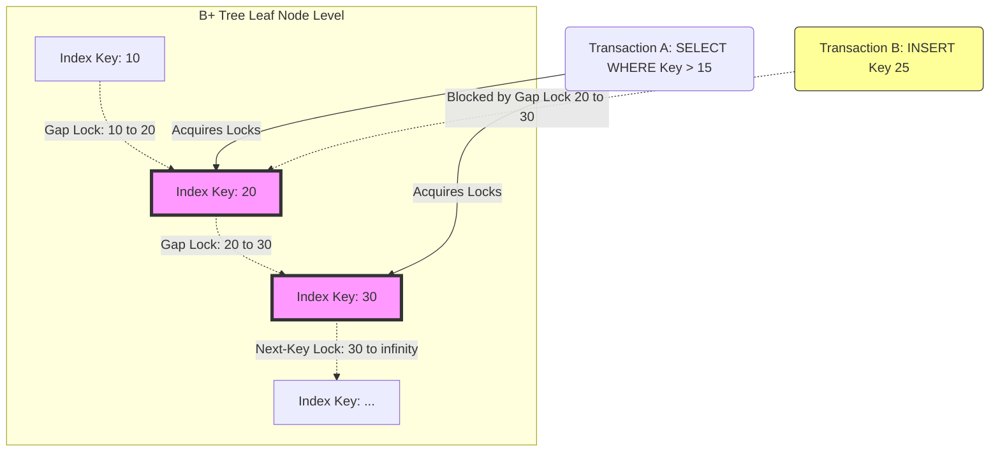

# 10: Transaction Isolation Levels: Mổ xẻ Write Skew, Read Skew và Phantom Reads

## Bạn Đang Đọc Gì

Bài viết này xem xét kỹ Transaction Isolation Levels trong các hệ cơ sở dữ liệu đồng thời, đi vào chi tiết vi kiến trúc, thuật toán và nền tảng toán học đằng sau ba dị thường khét tiếng: Read Skew, Write Skew, và Phantom Reads. Định nghĩa của chuẩn ANSI SQL-92 thường chỉ mô tả hiện tượng bề mặt mà không giải thích cơ chế bên trong, nên ở đây ta sẽ dùng phương pháp Serialization Graph (SG) — một cách hình thức hóa chặt chẽ hơn để phát hiện và ngăn chặn các dị thường này.

Những điểm chính bạn sẽ nắm được:
- Vì sao định nghĩa truyền thống về Dirty Reads và Non-repeatable Reads không đủ để mô tả các hệ thống MVCC và Snapshot Isolation hiện đại.
- Cách các hiện tượng như cache line bouncing (giao thức MESI), CPU memory reordering, và kiến trúc NUMA tương tác với các thuật toán khóa và cô lập ở tầng phần mềm.
- Chi tiết triển khai của Serializable Snapshot Isolation (SSI), Epoch-Based Memory Reclamation, và cách Next-Key Locking xấp xỉ Predicate Locking.
- Cách thiết kế và debug một hệ thống giao dịch thông lượng cao mà không phá vỡ các bất biến của dữ liệu.

## Vấn Đề Cốt Lõi

Trong các hệ thống OLTP có mức độ đồng thời cao, engine cơ sở dữ liệu phải xử lý hàng nghìn giao dịch chồng chéo mỗi giây, đồng thời vẫn giữ được các thuộc tính ACID. Có một sự căng thẳng cơ bản ở đây: Strict Serializability đảm bảo tính đúng đắn về toán học nhưng buộc thực thi tuần tự, làm giảm hiệu năng; còn Concurrency tận dụng tối đa phần cứng nhưng lại tiềm ẩn nguy cơ làm hỏng dữ liệu một cách âm thầm.

Chuẩn ANSI SQL-92 cố gắng phân loại các isolation levels (Read Uncommitted, Read Committed, Repeatable Read, Serializable) dựa trên việc chúng ngăn được dị thường nào:

1. **Dirty Reads:** đọc dữ liệu chưa commit.
2. **Non-repeatable Reads (Read Skew):** một giao dịch đọc cùng một tuple hai lần và nhận hai kết quả khác nhau.
3. **Phantom Reads:** một truy vấn phạm vi trả về tập hàng khác nhau ở hai lần thực thi, do có insert/delete đồng thời chen vào.

Nhưng khung phân loại cổ điển này bỏ sót hẳn Write Skew — một dị thường khá nghiêm trọng, tồn tại có tính cấu trúc trong các hệ thống dùng Snapshot Isolation như PostgreSQL hay Oracle. Vấn đề cốt lõi là các engine hiện đại không thể chỉ dựa vào khóa đơn giản. Chúng phải duy trì những cấu trúc toán học phức tạp và tiết kiệm bộ nhớ — như đồ thị có hướng không chu trình để theo dõi phụ thuộc — nhằm phát hiện các chu trình tô-pô biểu thị vi phạm cô lập, trong khi vẫn tránh làm CPU cache bị invalidate liên tục và tránh chi phí bộ nhớ quá lớn.

## Phân Tích Kỹ Thuật

### Nền tảng: Dị thường Giao dịch và Serialization Graph

Để hình thức hóa isolation levels, ta cần phân rã lịch sử giao dịch thành một lịch trình các thao tác. Giả sử giao dịch $T_i$ gồm các thao tác đọc $r_i(x)$ và ghi $w_i(x)$, kết thúc bằng commit $c_i$ hoặc abort $a_i$. Một lịch trình $S$ được gọi là strictly conflict-serializable nếu việc thực thi nó tương đương với một lịch trình tuần tự nào đó.

Ta phát hiện dị thường bằng cách dựng Serialization Graph (SG) — một đồ thị có hướng không chu trình, trong đó các nút là các giao dịch đã commit, còn các cạnh biểu diễn xung đột:
- **Write-Read (WR):** đọc dữ liệu vừa được commit.
- **Read-Write (RW):** phụ thuộc ngược (anti-dependency), khi một giao dịch ghi đè lên dữ liệu mà giao dịch khác đã đọc.
- **Write-Write (WW):** các lần ghi mù (blind writes) chồng lên nhau.

Một lịch trình $S$ là strictly conflict-serializable khi và chỉ khi Serialization Graph $SG(S)$ của nó không có chu trình. Khung Generalized Isolation Level do Adya và cộng sự đề xuất mô hình hóa mọi dị thường dưới dạng chu trình có hướng. Việc thực thi cô lập, xét cho cùng, chính là bài toán cắt tỉa động các cấu trúc chu trình cụ thể trong thời gian $O(1)$ hoặc $O(V+E)$, mà không tạo ra nghẽn cổ chai cho CPU.

### Read Skew và Tính Nhất quán ở Tầng Vi kiến trúc

Read Skew vi phạm một giả định cơ bản: một giao dịch nên thấy một snapshot nhất quán về mặt cấu trúc. Với Read Committed, $T_1$ đọc $x$, $T_2$ ghi đè $x$ rồi commit, và khi $T_1$ đọc lại $x$ nó nhận một giá trị khác.

Snapshot Isolation giải quyết vấn đề này bằng cách gán một timestamp tăng đơn điệu $TS(T_i)$ cho mỗi giao dịch. Engine đánh giá hàm khả kiến $V(x, T_i)$ để tìm phiên bản vật lý của $x$ sao cho $CTS(T_j) \le TS(T_i)$.

Ở tầng sâu hơn, các phiên bản tuple được quản lý trong ring buffer lock-free bằng thao tác nguyên tử Compare-And-Swap (CAS). Khi Core A cập nhật một tuple, nó giành quyền sở hữu độc quyền cache line (trạng thái 'Modified' trong MESI). Khi Core B đọc chuỗi phiên bản, nó gặp cache miss, buộc Core A phải ghi ngược dữ liệu về L3 cache dùng chung (chuyển sang trạng thái 'Shared'). Hiện tượng cache line bouncing này chính là thứ giới hạn thông lượng hệ thống.

Ngoài ra, việc thu hồi các phiên bản cũ đòi hỏi Epoch-Based Reclamation. Nếu giải phóng bộ nhớ một cách đơn giản bằng system call như `munmap`, hệ thống sẽ kích hoạt TLB shootdown qua Inter-Processor Interrupts (IPI), khiến mọi lõi CPU phải dừng lại. Các engine tiên tiến tránh việc này bằng cách dùng slab allocator tùy chỉnh trên Huge Pages.

```rust
// Đánh giá khả năng hiển thị không khóa bằng Rust
use std::sync::atomic::{AtomicPtr, Ordering};
use crossbeam_epoch::{self as epoch, Atomic};

struct TupleVersion {
    val: i64,
    commit_ts: u64,
    prev: Atomic<TupleVersion>,
}

fn evaluate_visibility<'g>(
    chain_head: &Atomic<TupleVersion>, txn_start_ts: u64, guard: &'g epoch::Guard
) -> Option<i64> {
    let mut current_ptr = chain_head.load(Ordering::Acquire, guard);
    while !current_ptr.is_null() {
        let current_version = unsafe { current_ptr.deref() };
        if current_version.commit_ts <= txn_start_ts {
            return Some(current_version.val);
        }
        current_ptr = current_version.prev.load(Ordering::Acquire, guard);
    }
    None
}
```

### Write Skew Nguy hiểm ở Đâu

Write Skew là vấn đề đặc biệt khó chịu với Snapshot Isolation. Nó xảy ra khi hai giao dịch cùng nhìn vào một snapshot nhất quán, đọc những dữ liệu giao nhau, nhưng lại sửa các tập dữ liệu rời nhau — trong khi ứng dụng lại có một bất biến ràng buộc cả hai tập đó.

**Ví dụ:** bất biến $A + B \ge 0$.
- $A=100, B=100$.
- $T_1$ đọc $A, B$, giảm $A$ đi 150 (trạng thái cục bộ vẫn thấy $100+100-150 \ge 0$, hợp lệ).
- $T_2$ đọc $A, B$, giảm $B$ đi 150 (cũng thấy $100+100-150 \ge 0$, hợp lệ).
- Cả hai đều commit vì tập ghi của chúng không giao nhau ($W(T_1) \cap W(T_2) = \emptyset$).
- Kết quả: $A = -50, B = -50$ — bất biến đã bị phá vỡ.

Về mặt toán học, Write Skew tương ứng với một "cấu trúc nguy hiểm" trong Serialization Graph: một chu trình gồm hai cạnh RW liền kề nhau: $T_i \xrightarrow{rw} T_j \xrightarrow{rw} T_k$.

Để ngăn chặn điều này, các engine dùng Serializable Snapshot Isolation (SSI). SSI theo dõi các phụ thuộc ngược (RW) tại runtime bằng hai cờ `inConflict` và `outConflict` gắn trên mỗi nút giao dịch. Khi một giao dịch trở thành "pivot" — có cả cạnh RW đi vào lẫn đi ra — hệ thống buộc một trong hai giao dịch phải abort để cắt đứt chu trình. Để theo dõi hiệu quả việc này trên nhiều CPU socket, cần một cấu trúc hash set mật độ cao, có thể phân vùng, đặt trong Thread-Local Storage (TLS).

### Phantom Reads và Predicate Locking

Phantom Reads xảy ra với các truy vấn phạm vi động (`SELECT * WHERE condition`). $T_1$ truy vấn một phạm vi và thấy tập $\mathcal{S}_1$. $T_2$ chèn một hàng mới khớp điều kiện. $T_1$ truy vấn lại và thấy $\mathcal{S}_2$ khác với $\mathcal{S}_1$.

Bạn không thể khóa vật lý một hàng chưa tồn tại. Giải pháp lý thuyết là Predicate Locking — khóa trực tiếp vị từ toán học $f(row) \rightarrow boolean$. Nhưng đánh giá một vị từ boolean bất kỳ với mọi thao tác ghi là bài toán khó về mặt tính toán (NP-hard).

Vì vậy các cơ sở dữ liệu hiện đại xấp xỉ điều này bằng Next-Key Locking hoặc Gap Locking trên B+Tree. Khi một truy vấn phạm vi chạm tới leaf node, engine lấy khóa đọc chia sẻ không chỉ trên từng bản ghi cụ thể, mà cả trên "khoảng trống" vật lý giữa các bản ghi liên tiếp.



Quản lý gap locks đòi hỏi một lock manager khá tinh vi, dùng các bucket băm được bảo vệ bởi futex để ánh xạ resource ID vật lý sang các hàng đợi phức tạp, đứng sau là một tiến trình deadlock detection chạy nền liên tục, sử dụng thuật toán Strongly Connected Components của Tarjan.

## Bài Học và Thực hành Tốt

1. **Đừng tin tuyệt đối vào định nghĩa isolation của SQL-92:** nếu bạn dùng PostgreSQL hay Oracle ở mức "Repeatable Read" hay "Snapshot Isolation", bạn vẫn dễ dính Write Skew, trừ khi chủ động nâng lên `SERIALIZABLE` hoặc tự cài đặt khóa `SELECT ... FOR UPDATE` ở tầng ứng dụng.
2. **Hiểu chi phí phần cứng của khóa:** mỗi lần lấy khóa, một thao tác nguyên tử sẽ thay đổi một cache line và làm nó bị invalidate trên mọi CPU core khác qua giao thức MESI. Gap locks trong các insert thông lượng cao chắc chắn gây tắc nghẽn đáng kể ở kênh giao tiếp giữa các CPU.
3. **Cẩn thận với khoảng trống phantom:** nếu ứng dụng của bạn dựa vào các ràng buộc tổng hợp — ví dụ "một bác sĩ không được nhận quá 8 ca trực một ngày" — thì khóa hàng thông thường không đủ để chặn các insert đồng thời. Bạn cần dựa vào Next-Key Locking (tự động có trong MySQL Serializable) hoặc vật chất hóa phần tổng hợp đó thành một hàng riêng có thể khóa được.
4. **HTM là hướng đi đáng chú ý:** Hardware Transactional Memory (HTM), như Intel TSX, cho phép phát hiện xung đột hoàn toàn bên trong cache L1/L2, bỏ qua các đồ thị SSI phần mềm vốn dễ phình to, và mở ra khả năng mở rộng tốt hơn hẳn trên các hệ thống NUMA nhiều socket.

## Kết Luận

Đảm bảo tính cô lập của giao dịch không đơn thuần là bài toán ngữ nghĩa của cơ sở dữ liệu — đó là một cuộc đấu tranh thực sự với giới hạn vật lý của silicon, độ trễ bộ nhớ, và lý thuyết đồ thị. Việc chuyển từ các định nghĩa mang tính hiện tượng của SQL-92 sang sự chặt chẽ toán học của Serialization Graph đã cho phép các engine hiện đại xử lý hàng triệu giao dịch mỗi giây. Hiểu rõ cách triển khai ở mức thấp của SSI, Epoch-Based Reclamation, và Gap Locking là điều cần thiết cho bất kỳ kiến trúc sư nào muốn xây dựng hệ thống giao dịch quy mô lớn mà không đánh mất dữ liệu.
