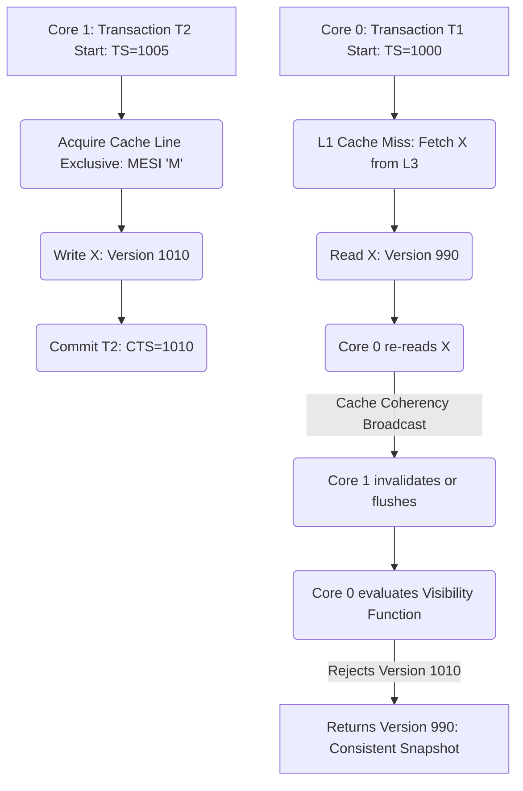
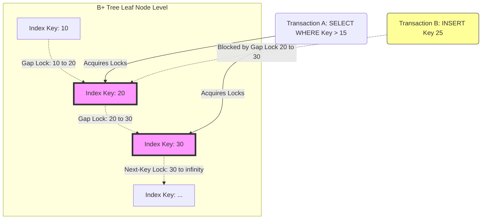

# 10: Transaction Isolation Levels: Mổ xẻ Write Skew, Read Skew và Phantom Reads

## Fundamentals of Transactional Anomalies and Concurrency Control Architectures

The rigorous specification of transaction isolation levels constitutes the foundational cornerstone of concurrent database systems, delineating the exact boundaries between strict serializability and operational performance. In highly concurrent architectures, the execution of multiple transactions overlapping in time necessitates sophisticated concurrency control mechanisms to preserve the fundamental properties of Atomicity, Consistency, Isolation, and Durability (ACID). The ANSI SQL-92 standard originally attempted to formalize isolation levels—Read Uncommitted, Read Committed, Repeatable Read, and Serializable—based on the absence of specific phenomenological anomalies: Dirty Reads, Non-repeatable Reads (frequently generalized as Read Skew in snapshot semantics), and Phantom Reads. However, modern transactional theory recognizes this classification as strictly inadequate, particularly due to its failure to account for Write Skew, an anomaly prevalent in Multi-Version Concurrency Control (MVCC) environments running under Snapshot Isolation. To comprehend the micro-architectural and algorithmic intricacies of these anomalies, one must decompose the transactional history into a formal schedule of operations. Let a transaction $T_i$ consist of a sequence of read operations $r_i(x)$ and write operations $w_i(x)$ on data item $x$, culminating in either a commit $c_i$ or an abort $a_i$. A schedule $S$ is a partial ordering of these operations across multiple transactions. Strict serializability demands that the execution of $S$ is equivalent to some serial schedule wherein transactions execute sequentially without interleaving. Deviation from this strict equivalence manifests as transactional anomalies, which we shall dissect through the lenses of Read Skew, Phantom Reads, and Write Skew. The mathematical detection of these anomalies relies on the construction and analysis of a Directed Acyclic Graph (DAG) representing the Serialization Graph (SG), where nodes are committed transactions and edges represent conflicts. We define three fundamental types of conflicts: Write-Read (WR, read uncommitted data), Read-Write (RW, anti-dependency where a transaction overwrites data another has read), and Write-Write (WW, blind writes). A schedule $S$ is strictly conflict-serializable if and only if its Serialization Graph $SG(S)$ contains no cycles. The presence of cycles involving specific permutations of these dependency edges precisely characterizes the algorithmic nature of the anomaly encountered. For instance, the Generalized Isolation Level framework proposed by Adya et al. models all anomalies as directed cycles in the serialization graph, rendering the SQL-92 phenomena effectively obsolete for serious engine development. The mathematical invariants dictate that any isolation mechanism must continuously evaluate the dynamic graph $G = (V, E)$ where $V = \{T_1, T_2, ..., T_n\}$ and $E = E_{WW} \cup E_{WR} \cup E_{RW}$. The enforcement of isolation levels maps directly to the pruning or prevention of specific cyclic structures within this graph topology. The algorithmic verification of these acyclic properties fundamentally requires topological sorting mechanisms capable of executing in sub-linear time to prevent the graph analysis from becoming the primary computational bottleneck within the transactional execution pipeline. This necessitates the use of intricate, memory-optimized data structures that map transaction lifetimes to physical memory addresses with minimal latency, avoiding cross-socket memory accesses in Non-Uniform Memory Access (NUMA) architectures.

## Read Skew and Write Skew: Micro-architectural Coherency and Serializable Snapshot Isolation

Read Skew, a specialized manifestation of the Non-repeatable Read anomaly, fundamentally violates the invariant that a transaction should perceive a structurally consistent snapshot of the database state throughout its execution lifetime. In a conventional Read Committed isolation level, a transaction $T_1$ may issue a read operation $r_1(x)$, subsequently preempted by a concurrent transaction $T_2$ that executes $w_2(x)$ and $c_2$. Upon $T_1$ re-issuing $r_1(x)$, it retrieves the mutated value, thereby observing two distinct states of $x$ within the same transactional context, effectively shattering the illusion of isolation. Snapshot Isolation attempts to mitigate this by assigning a monotonically increasing transaction timestamp $TS(T_i)$ at the commencement of the transaction, ensuring that $T_i$ only observes tuple versions committed prior to its logical inception point. However, Read Skew can still occur in subtly misconfigured systems, weakly-consistent replicas, or cross-partition distributed transactions where synchronized clock guarantees are inherently probabilistic rather than absolute. The formal definition of Snapshot Isolation dictates a visibility function $V(x, T_i)$, which meticulously evaluates to the value of the version of $x$ endowed with the maximum commit timestamp $CTS(T_j)$ such that $CTS(T_j) \le TS(T_i)$ and $T_j$ has successfully committed. Mathematically, the version selected $x_k$ must satisfy the condition: $\forall x_m \in Versions(x), CTS(x_k) \ge CTS(x_m)$ given $CTS(x_k) \le TS(T_i)$ and $CTS(x_m) \le TS(T_i)$. The operating system's memory management subsystem plays an overwhelmingly critical role in facilitating this multi-versioned state without catastrophic performance degradation. Tuple versions are dynamically allocated on the heap or maintained within highly optimized, lock-free ring buffers in shared memory. This heavily relies on the CPU's atomic Compare-And-Swap (CAS) instructions—such as `CMPXCHG` on x86 architectures or `LL/SC` (Load-Linked/Store-Conditional) on ARM—to atomically append new physical versions to the tuple's logical version chain. The traversal of this version chain during a read operation necessitates non-trivial cache coherency traffic across the multiprocessor interconnect, such as the Intel QuickPath Interconnect (QPI) or AMD Infinity Fabric. When Core A updates a tuple, it acquires exclusive ownership of the cache line (the 'Modified' state in the MESI protocol). When Core B subsequently attempts to read the version chain, it induces a cache miss, forcing Core A to write back the modified line to the shared L3 cache or main memory, transitioning the line to the 'Shared' state. This micro-architectural choreography, known as cache line bouncing, can severely throttle throughput if the version chains traverse multiple disjoint cache lines.



To sustain high throughput, the engine requires an asynchronous garbage collection daemon to aggressively reclaim physically obsolete tuple versions whose $CTS$ falls below the global low-water mark of the oldest active transaction's timestamp. This epoch-based memory reclamation algorithm must carefully navigate the operating system's virtual memory translation tables. Naive deallocation triggers frequent OS kernel interventions, utilizing system calls like `munmap` or `madvise`, which invariably invoke Translation Lookaside Buffer (TLB) shootdowns via Inter-Processor Interrupts (IPIs). A TLB shootdown halts all cores to synchronize page table modifications, effectively acting as a global stop-the-world pause. To circumvent this, advanced engines implement custom slab allocators mapped over pre-allocated Huge Pages (e.g., 2MB or 1GB mappings via `mmap` with `MAP_HUGETLB`), bypassing standard `glibc` memory allocators to guarantee contiguous physical memory placement and zero TLB overhead during version recycling. In systems programming languages like Rust, implementing the lock-free version chain demands excruciatingly precise manipulation of atomic pointers and explicit memory ordering rules (e.g., `Acquire`/`Release` semantics) to prevent the CPU's out-of-order execution engine and the compiler's optimization passes from reordering memory accesses in a manner that violates sequential consistency.

```rust
use std::sync::atomic::{AtomicPtr, Ordering};
use std::ptr::null_mut;
use crossbeam_epoch::{self as epoch, Atomic, Owned, Shared};

struct TupleVersion {
    val: i64,
    commit_ts: u64,
    prev: Atomic<TupleVersion>,
}

struct TransactionContext {
    start_ts: u64,
    active_epoch: epoch::Guard,
}

fn evaluate_visibility<'g>(
    chain_head: &Atomic<TupleVersion>, 
    txn: &TransactionContext, 
    guard: &'g epoch::Guard
) -> Option<i64> {
    let mut current_ptr = chain_head.load(Ordering::Acquire, guard);
    
    while !current_ptr.is_null() {
        let current_version = unsafe { current_ptr.deref() };
        
        if current_version.commit_ts <= txn.start_ts {
            return Some(current_version.val);
        }
        
        current_ptr = current_version.prev.load(Ordering::Acquire, guard);
    }
    None
}
```

Write Skew represents an exponentially more insidious anomaly that specifically plagues Snapshot Isolation, an isolation level universally lauded for entirely circumventing the overhead of read locks while effectively preventing Dirty Reads, Non-repeatable Reads, and Phantom Reads. The Write Skew anomaly materializes when two concurrent transactions, $T_1$ and $T_2$, both evaluate a consistent temporal snapshot of the database state, read intersecting sets of data, but subsequently mutate disjoint sets of data that are semantically bound by an overarching application-level invariant. Because Snapshot Isolation's inherent write-write conflict detection mechanism only triggers a transaction abort when two concurrent execution streams attempt to write to the exact same physical tuple concurrently, it blindly permits both $T_1$ and $T_2$ to successfully commit, thereby silently and catastrophically violating the shared invariant. Formally, suppose a distributed financial ledger enforces the invariant constraint $\Phi: A + B \ge 0$. Transaction $T_1$ commences, reads $A=100, B=100$, and issues an update to decrement $A$ by $150$. Concurrently, $T_2$ commences, reads $A=100, B=100$, and issues an update to decrement $B$ by $150$. Both transactions meticulously validate their logic against their local snapshots ($100 + 100 - 150 \ge 0$). Furthermore, both transactions successfully pass Snapshot Isolation's commit validation phase because their respective write sets ($W(T_1) = \{A\}$ and $W(T_2) = \{B\}$) are strictly disjoint, meaning their mathematical intersection is the empty set: $W(T_1) \cap W(T_2) = \emptyset$. However, the post-commit database state definitively yields $A = -50, B = -50$, brutally violating the overarching invariant $\Phi$, an outcome strictly impossible under any linearizable or serial execution schedule. The rigorous mathematical characterization of Write Skew was deeply analyzed by Adya et al., mathematically demonstrating that Write Skew corresponds precisely to a specific, irreducible cycle formation in the Serialization Graph classified as a "dangerous structure." A dangerous structure consists fundamentally of two adjacent read-write (anti-dependency) edges. Let the notation $T_1 \xrightarrow{rw} T_2$ denote an anti-dependency, signifying that transaction $T_1$ reads a version of a data item that is chronologically subsequently overwritten by a newer version committed by transaction $T_2$. The Write Skew anomaly invariably manifests as a directed cycle containing a sub-path of the form $T_i \xrightarrow{rw} T_j \xrightarrow{rw} T_k$, where it is virtually always the case that the cycle closes such that $T_i = T_k$. To systematically eradicate Write Skew without reverting to the crippling, throughput-destroying lock contention characteristic of pessimistic Two-Phase Locking (2PL), state-of-the-art database systems deploy Serializable Snapshot Isolation (SSI). SSI fundamentally instruments the database engine to track these read-write anti-dependencies dynamically and asynchronously at runtime. The algorithm maintains sophisticated metadata structures, typically consisting of an `inConflict` flag and an `outConflict` flag, mapped to each active transaction context within the execution engine. When the heuristic scheduler detects that a transaction has organically evolved into the pivot node of a dangerous structure—meaning it concurrently exhibits both an incoming anti-dependency ($T_{in} \xrightarrow{rw} T_{pivot}$) and an outgoing anti-dependency ($T_{pivot} \xrightarrow{rw} T_{out}$)—it preemptively aborts one of the constituent transactions to forcibly sever the cycle and restore serializability. This cycle detection mechanism is essentially an intricate, continuous graph traversal problem performed incessantly in the background, necessitating highly concurrent, latch-free hash tables optimized for non-uniform memory access (NUMA) topologies to store the dependency edges, thereby avoiding bottlenecking the primary transaction execution threads.

```cpp
#include <atomic>
#include <vector>
#include <memory>
#include <mutex>
#include <unordered_map>
#include <immintrin.h> 

class SSITransactionNode {
public:
    const uint64_t txn_id;
    alignas(64) std::atomic<bool> in_conflict{false};
    alignas(64) std::atomic<bool> out_conflict{false};
    alignas(64) std::atomic<bool> is_aborted{false};

    explicit SSITransactionNode(uint64_t id) : txn_id(id) {}

    inline void mark_in_conflict() {
        in_conflict.store(true, std::memory_order_release);
    }

    inline void mark_out_conflict() {
        out_conflict.store(true, std::memory_order_release);
    }
    
    inline bool evaluates_dangerous_structure() const {
        return in_conflict.load(std::memory_order_acquire) && 
               out_conflict.load(std::memory_order_acquire);
    }
};

void register_anti_dependency(const std::shared_ptr<SSITransactionNode>& reader, 
                              const std::shared_ptr<SSITransactionNode>& writer) {
    if (reader->txn_id == writer->txn_id) return;
    
    reader->mark_out_conflict();
    writer->mark_in_conflict();
    
    if (reader->evaluates_dangerous_structure()) {
        reader->is_aborted.store(true, std::memory_order_seq_cst);
    }
    if (writer->evaluates_dangerous_structure()) {
        writer->is_aborted.store(true, std::memory_order_seq_cst);
    }
}
```

The underlying Operating System and micro-architectural hardware mechanisms requisite for supporting SSI at scale are remarkably complex. The read set $R(T_i)$ and write set $W(T_i)$ must be tracked with vanishingly minimal overhead. Frequently, high-performance systems utilize partitioned Bloom filters or extremely dense, precise hash sets allocated directly in thread-local storage (TLS) to brutally minimize cache line bouncing across disparate CPU sockets interconnected by the PCIe bus or QPI. When tracking anti-dependencies, the physical memory footprint of the dependency graph becomes an existential constraint; retaining the access history of committed transactions indefinitely is mathematically impossible due to finite RAM bounds. The engine must aggressively prune the Serialization Graph, maintaining only the metadata for transactions whose temporal lifetimes strictly overlap with currently active transactions. Furthermore, modern microprocessors featuring hardware transactional memory (HTM), such as Intel's Transactional Synchronization Extensions (TSX), can theoretically execute these complex SSI checks entirely within the L1/L2 cache hierarchy without incurring any software instrumentation overhead. In an HTM context, a CPU core tracks read sets automatically in the cache's tag arrays and detects conflicts intrinsically via standard cache coherency protocol messages. If an anti-dependency cycle attempts to crystallize, the hardware immediately aborts the transaction at the microcode level and rolls back the processor's register state in a handful of clock cycles, bypassing the sprawling software SSI graph entirely.

## Phantom Reads, Predicate Locking, and B-Tree Next-Key Lock Implementations

Phantom Reads inject yet another staggering layer of complexity into the transaction isolation matrix, primarily afflicting dynamic range queries that operate over a highly fluid, mutable set of tuples matching an arbitrary logical predicate. Unlike Read Skew or Write Skew, which strictly involve mutations or anti-dependencies regarding pre-existing, physically addressable and uniquely identifiable tuples, Phantom Reads manifest structurally when a transaction $T_1$ executes a query of the form `SELECT * FROM relations WHERE mathematical_condition(x) == true`, observing an initial set of rows $\mathcal{S}_1$. Subsequently, an entirely disjoint transaction $T_2$ performs an insertion, deletion, or mutation of a row such that the newly created or modified row now dynamically satisfies the mathematical constraints of `mathematical_condition(x)`, and immediately commits. If $T_1$ re-executes the mathematically identical query, it observes an intrinsically different set of rows $\mathcal{S}_2$, where the sets are decidedly unequal: $\mathcal{S}_1 \neq \mathcal{S}_2$. The fundamental, mathematically intractable challenge in universally preventing Phantom Reads lies in the sheer impossibility of acquiring a physical lock on a tuple that does not yet exist within the physical storage strata of the database subsystem. To effectively combat this topological anomaly, database systems must employ locking mechanisms that abstract and generalize beyond discrete physical memory addresses or block offsets.

Predicate Locking represents the theoretically pristine and optimal mathematical solution to this dilemma. In a Predicate Locking architecture, the transaction manager dynamically acquires a lock not on physical tuples, but on the logical mathematical predicate itself (e.g., the higher-order function $f(row) \rightarrow boolean$). Any concurrent transaction attempting an insertion, deletion, or mutation must sequentially evaluate its target tuple's physical attributes against all active, memory-resident predicate locks. If the physical attributes of the tuple evaluate to `true` against any locked predicate, a definitive conflict is registered, and the writing transaction is subsequently blocked or aborted. However, the staggering computational complexity of evaluating arbitrary, arbitrarily complex boolean predicates—which may include non-linear mathematics, string matching, or geospatial intersections—against every single write operation across a system processing millions of transactions per second renders true Predicate Locking computationally intractable. Mathematically, determining if two arbitrary predicates overlap is fundamentally an NP-hard constraint satisfaction dilemma, effectively transforming a relatively straightforward isolation problem into a computationally unsolvable bottleneck for high-throughput OLTP systems. Consequently, modern commercial and open-source database engines pragmatically approximate Predicate Locking using deeply optimized physical constructs: Index-Key Locking, Next-Key Locking, or Gap Locking. These sophisticated techniques heavily depend on exploiting the physical layout and contiguous structural properties of the underlying database indices, which are almost universally implemented as highly optimized B+ Trees or Fractal Trees. When a range query executes, the execution engine traverses the B+ Tree from the root down to the leaf nodes. Upon locating the relevant leaf nodes, it acquires shared read locks not merely on the specific index records that match the query, but crucially, on the physical "gaps" between those contiguous records, as well as the unbounded gap immediately preceding the first matching record and the gap succeeding the last matching record (Next-Key Locking). These gap locks act as physical barriers, explicitly preventing concurrent transactions from inserting new physical index entries that would mathematically fall within the queried range. This approximation relies entirely on the structural invariant that any newly inserted tuple satisfying the mathematical range condition must necessarily correspond to a newly created entry within the physically locked, contiguous leaf-node region of the B+ Tree.



From a low-level operating system and micro-architectural perspective, managing these gap locks requires highly sophisticated lock manager architectures engineered to minimize latency. The lock manager typically employs an immense array of mutex-protected or futex-protected hash buckets, meticulously mapping physical resource identifiers (e.g., a composite of `TablespaceID` + `PageID` + `SlotID`) to complex, doubly-linked lock queues. Gap locks, however, immensely complicate the cryptographic hash mapping function, requiring the lock manager to logically differentiate between discrete record locks and unbounded gap locks that are inextricably associated with the same physical cryptographic key. Furthermore, the lock manager must rigorously implement continuous deadlock detection algorithms. These algorithms typically utilize dynamic Waits-For Graphs (WFG) and invoke continuous cycle-detection heuristics (e.g., Tarjan's strongly connected components algorithm) in a background thread to instantly resolve the inevitable, mathematically certain locking standstills induced by the highly aggressive, pessimistic nature of next-key locks. Tarjan's algorithm, for instance, executes a depth-first search to identify strongly connected components in the directed Waits-For Graph in strictly $O(|V| + |E|)$ time, rapidly isolating cyclical lock dependencies. The interplay between these volatile, memory-resident lock structures and the asynchronous, DMA-driven page flushing mechanisms (checkpointing) is an agonizingly delicate balancing act. The lock manager must absolutely ensure that logical gap locks are accurately maintained and structurally transposed even as the underlying physical B+ Tree pages undergo violent structural modifications—splits, merges, rebalances, and evictions from the volatile buffer pool to non-volatile NVMe storage via `io_uring` or asynchronous I/O (AIO) interfaces. 

The convergence of Multi-Version Concurrency Control, Serializable Snapshot Isolation, and sophisticated algorithmic locking paradigms highlights the extreme engineering depths required to mathematically guarantee transaction isolation. The historical transition from the phenomenological, heavily flawed definitions of the ANSI SQL-92 standard to the formal, rigorously proven mathematical rigor of Serialization Graphs has enabled the development of database architectures capable of sustaining millions of deeply complex transactions per second while maintaining strict serializability constraints. As hardware architectures ruthlessly evolve toward massively multi-core systems characterized by extreme Non-Uniform Memory Access (NUMA) patterns, hyper-fast PCIe 5.0 interconnects, and byte-addressable Non-Volatile Memory (NVM) technologies like Intel Optane, the low-level implementations of these isolation algorithms will be forced to undergo continuous, radical paradigm shifts. Traditional locking protocols heavily rely on atomic operations that lock cache lines across the entire processor interconnect, resulting in devastating latency spikes as the core count scales linearly. Future architectural designs must invariably shift towards highly localized, partitioned optimistic concurrency control schemes, deeply integrated epoch-based memory reclamation algorithms, and pervasive utilization of hardware-accelerated conflict detection mechanisms. These advanced paradigms represent the vanguard of this continuous computational evolution, striving to aggressively push the theoretical boundaries of concurrent data processing while ensuring absolute, mathematically verifiable data integrity against the persistent, deeply embedded specters of Write Skew, Read Skew, and Phantom Reads. The mathematical invariants dictating transaction validity, the convoluted algorithmic data structures orchestrating memory management, and the raw exploitation of silicon physics inextricably link to form the impregnable bedrock of distributed consensus, state machine replication, and the very concept of isolated concurrent execution.

## SEO Section
* **Mô tả:** Bài viết Whitepaper kỹ thuật chuyên sâu mổ xẻ các mức độ cô lập giao dịch (Transaction Isolation Levels), phân tích tường tận các hiện tượng Write Skew, Read Skew và Phantom Reads dưới góc độ kiến trúc vi mô, toán học, hệ điều hành và thuật toán.
* **Từ khóa:** Transaction Isolation Levels, Write Skew, Read Skew, Phantom Reads, Multi-Version Concurrency Control, MVCC, Serializable Snapshot Isolation, SSI, B+ Tree, SQL-92, NUMA, Concurrency Control Algorithms, C++, Rust.
