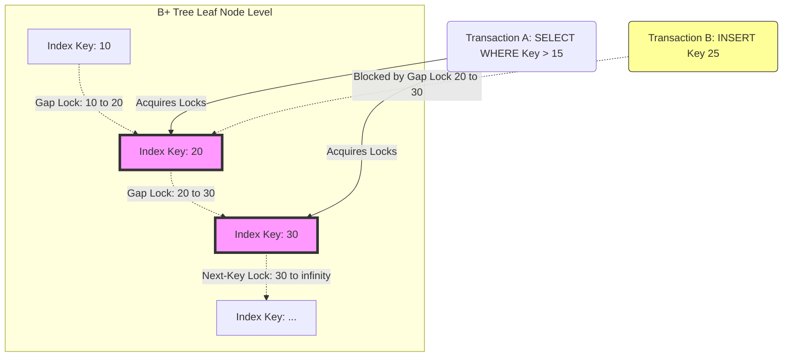

# 10: Transaction Isolation Levels: Dissecting Write Skew, Read Skew, and Phantom Reads

## What This Article Covers

Most engineers learn transaction isolation levels from the ANSI SQL-92 table — four levels, three anomalies, done. That table is a reasonable starting point, but it hides more than it explains. It says nothing about write skew, nothing about how a database actually enforces "serializable" under the hood, and nothing about the cache-coherency cost of the locks that make any of this possible.

This piece goes past the standard's phenomenological definitions and into the mechanics: how serialization graphs formally capture every anomaly as a cycle, how read skew and write skew show up in real schedules, and how engines like PostgreSQL detect and block them using Serializable Snapshot Isolation.

**What you'll get out of this:**
- Why the textbook definitions of dirty reads and non-repeatable reads fall short once you're dealing with MVCC and snapshot isolation.
- How cache line bouncing, the MESI protocol, and NUMA topology shape the real-world cost of locking.
- How Serializable Snapshot Isolation, epoch-based reclamation, and next-key locking actually work under the hood.
- Practical guidance for building and debugging high-throughput transactional systems without silently breaking your invariants.

## The Core Problem

In a busy OLTP system, the engine has to run thousands of overlapping transactions per second while still upholding ACID (Atomicity, Consistency, Isolation, Durability). The tension is straightforward to state: **strict serializability** guarantees correctness by making transactions behave as if they ran one at a time, but enforcing that naively kills throughput. **Concurrency** gets you hardware utilization, but push it too far and you get silent data corruption instead of a crash — the worst kind of bug, because nothing looks wrong until it does.

ANSI SQL-92 tried to tame this by defining isolation levels (Read Uncommitted, Read Committed, Repeatable Read, Serializable) in terms of which anomalies each one rules out:
1. **Dirty Reads:** reading data that hasn't been committed yet.
2. **Non-repeatable Reads (Read Skew):** re-reading the same row within a transaction and getting a different value.
3. **Phantom Reads:** re-running a range query and getting a different set of rows because of concurrent inserts or deletes.

What that framework left out entirely is **write skew**, an anomaly that shows up specifically in systems built on snapshot isolation — PostgreSQL's default `REPEATABLE READ`, Oracle's `SERIALIZABLE`, and similar designs. The deeper issue is that locks alone can't catch it. Modern engines instead track dependencies as a graph — often a directed graph checked for cycles — to detect isolation violations, and they have to do this without turning every transaction into a source of cache-line contention across cores.

## How It Actually Works

### Serialization Graphs: The Formal Model Behind Isolation

To reason about isolation formally, you first need to decompose a transaction's history into a schedule of operations. A transaction $T_i$ consists of read operations $r_i(x)$ and write operations $w_i(x)$, ending in either a commit $c_i$ or an abort $a_i$. A schedule $S$ is strictly conflict-serializable if executing it produces the same result as some serial (one-at-a-time) ordering of the same transactions.

We detect anomalies by building a **Serialization Graph (SG)** — a graph where nodes are committed transactions and edges represent conflicts between them:
- **Write-Read (WR):** one transaction reads data another just wrote.
- **Read-Write (RW):** an anti-dependency, where a transaction overwrites data another has already read.
- **Write-Write (WW):** blind writes to the same item.

A schedule $S$ is strictly conflict-serializable if and only if its serialization graph $SG(S)$ contains no cycles. Adya et al.'s generalized isolation framework builds on this by modeling every known anomaly — including write skew — as a specific cyclic pattern. Enforcing an isolation level, in this framing, becomes a matter of detecting and breaking those cycles as they form, ideally in close to $O(V+E)$ time so it doesn't become the bottleneck itself.

### Read Skew and the Hardware Cost of Coherency

Read skew breaks a simple expectation: a transaction should see one consistent snapshot of the data, not a mix of old and new values. Under Read Committed, this happens directly — $T_1$ reads $x$, $T_2$ overwrites $x$ and commits, and when $T_1$ reads $x$ again it sees the new value.

Snapshot isolation fixes this by giving each transaction a monotonically increasing timestamp $TS(T_i)$. Every read then goes through a visibility function $V(x, T_i)$ that walks the version chain for $x$ and picks the version whose commit timestamp satisfies $CTS(T_j) \le TS(T_i)$ — effectively, the newest version that existed when the transaction started.

The implementation detail that matters here is how those versions are stored and reclaimed. Tuple versions typically live in lock-free structures updated via atomic Compare-And-Swap. When Core A writes a new version, it takes exclusive ownership of that cache line (the 'Modified' state in MESI terms). When Core B then reads the version chain, it triggers a cache miss and forces Core A to flush back to shared L3 (moving to the 'Shared' state). Under high contention, this back-and-forth — **cache line bouncing** — becomes a real throughput limiter, independent of anything happening at the SQL level.

There's a second cost: old versions eventually need to be reclaimed, and that's handled through **epoch-based reclamation** rather than freeing memory immediately. A naive approach — calling `munmap` as soon as a version is dead — triggers TLB shootdowns via inter-processor interrupts, which stall every core on the machine just to invalidate one mapping. Production engines avoid this by batching reclamation into epochs and using custom slab allocators over huge pages instead.

```rust
// Lock-free visibility evaluation in Rust
use std::sync::atomic::{AtomicPtr, Ordering};
use crossbeam_epoch::{self as epoch, Atomic};

struct TupleVersion {
    val: i64,
    commit_ts: u64,
    prev: Atomic<TupleVersion>,
}

fn evaluate_visibility<'g>(
    chain_head: &Atomic<TupleVersion>, txn_start_ts: u64, guard: &'g epoch::Guard
) -> Option<i64> {
    let mut current_ptr = chain_head.load(Ordering::Acquire, guard);
    while !current_ptr.is_null() {
        let current_version = unsafe { current_ptr.deref() };
        if current_version.commit_ts <= txn_start_ts {
            return Some(current_version.val);
        }
        current_ptr = current_version.prev.load(Ordering::Acquire, guard);
    }
    None
}
```

### Write Skew: The Anomaly SQL-92 Forgot

Write skew is specific to snapshot isolation, and it's sneaky precisely because neither transaction involved does anything wrong in isolation. Two transactions read the same consistent snapshot, their read sets overlap, but they write to disjoint rows — and an invariant that spans both rows quietly breaks.

**A concrete example.** Say the application invariant is $A + B \ge 0$, and currently $A=100, B=100$.
- $T_1$ reads both $A$ and $B$, then decrements $A$ by 150. Locally, the invariant still holds from $T_1$'s point of view: $100+100-150 \ge 0$.
- $T_2$ reads both $A$ and $B$, then decrements $B$ by 150. Same reasoning: $100+100-150 \ge 0$.
- Both commit, because their write sets don't overlap ($W(T_1) \cap W(T_2) = \emptyset$) — nothing forces a conflict at the storage layer.
- The actual result: $A = -50, B = -50$. The invariant is violated, and neither transaction's logic was wrong on its own.

In graph terms, write skew is a cycle built from two adjacent anti-dependency (RW) edges: $T_i \xrightarrow{rw} T_j \xrightarrow{rw} T_k$. Ordinary snapshot isolation never looks for this pattern, which is exactly why it lets write skew through.

**Serializable Snapshot Isolation (SSI)** closes the gap by tracking RW anti-dependencies as they happen, using `inConflict` and `outConflict` flags on each transaction. When a transaction ends up with both an incoming and an outgoing RW edge — becoming what SSI calls a pivot — the system knows a dangerous cycle might be forming and aborts one of the transactions to break it. Making this cheap enough to run on every transaction, across multiple CPU sockets, generally means partitioning the conflict-tracking hash sets per thread rather than sharing one global structure.

### Phantom Reads and the Limits of Row-Level Locking

Phantom reads show up with range queries rather than single-row reads. $T_1$ runs `SELECT * WHERE condition` and gets back set $\mathcal{S}_1$. $T_2$ inserts a new row matching that condition and commits. $T_1$ re-runs the same query and now gets $\mathcal{S}_2 \neq \mathcal{S}_1$ — a row appeared that wasn't there a moment ago.

The obvious lock-a-row approach doesn't work here, because the row causing the problem didn't exist yet when $T_1$ first queried. The theoretically clean fix is **predicate locking** — locking the condition itself, $f(row) \rightarrow boolean$, rather than any particular row. In practice this is a non-starter: checking an arbitrary predicate against every incoming write is computationally intractable to do generally.

What real databases do instead is approximate predicate locking with **next-key locking** or **gap locking** over a B+-tree index. When a range query walks down to a leaf, the engine locks not just the matching records but the physical gaps between neighboring keys, so an insert into one of those gaps gets blocked until the reading transaction finishes.



Running the gap-lock manager itself is not free: it needs futex-protected hash buckets mapping resource IDs to wait queues, plus a background deadlock detector — typically running Tarjan's strongly-connected-components algorithm — to catch the cycles that gap locks inevitably create under contention.

## Lessons Learned & Best Practices

1. **Don't take the SQL-92 isolation names at face value.** Running PostgreSQL or Oracle under "Repeatable Read" or "Snapshot Isolation" still leaves you exposed to write skew unless you explicitly move to `SERIALIZABLE` or add application-level `SELECT ... FOR UPDATE` locks where the invariant demands it.
2. **Locks aren't free at the hardware level.** Every lock acquisition is an atomic operation that touches a cache line and invalidates it on every other core via MESI. Gap locks on a high-throughput insert path are a common source of CPU interconnect congestion that shows up as mysterious latency spikes, not as an obvious lock-wait metric.
3. **Watch for phantom gaps in aggregate constraints.** If a rule spans multiple rows — "a doctor can't work more than 8 shifts a day" — row-level locks won't stop a concurrent insert from violating it. You need next-key locking (automatic under MySQL's `SERIALIZABLE`) or a materialized counter row you can lock directly.
4. **Hardware transactional memory changes the calculus.** Intel TSX and similar HTM implementations push conflict detection down into the L1/L2 cache itself, which can sidestep a lot of the software-level SSI bookkeeping and scale better across multi-socket NUMA systems — though it comes with its own set of practical limitations (transaction size limits, abort rates) worth checking before relying on it.

## Conclusion

Guaranteeing correct transaction isolation ends up touching everything from application-level invariants down to cache-coherency protocols — it's genuinely a systems problem, not just a database semantics one. Moving past SQL-92's anomaly-based definitions and toward the formal machinery of serialization graphs is what let engines like PostgreSQL push serializable transaction isolation into production at scale, rather than treating it as a theoretical curiosity you fall back to `REPEATABLE READ` to avoid. If you're building anything with cross-row invariants under snapshot isolation, understanding how SSI, epoch-based reclamation, and gap locking work together is the difference between a system that's correct by luck and one that's correct by design.
