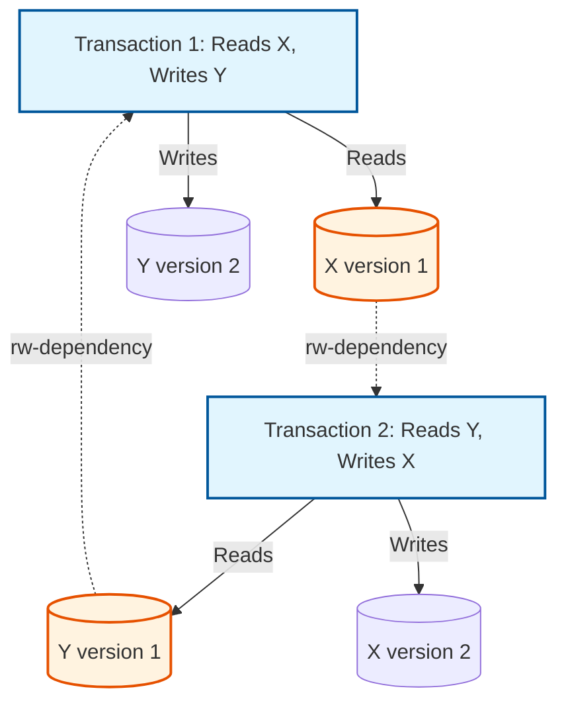
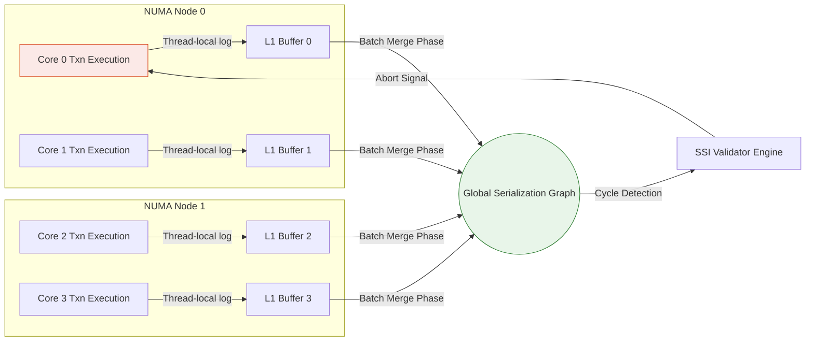

# 11: Serializable Snapshot Isolation (SSI): ロックフリーなシリアライザビリティのためのアーキテクチャの基盤とマイクロレベルの最適化

## この記事について

Serializable Snapshot Isolation (SSI) は、データベースエンジニアを長年悩ませてきた問題に対する、なかなか洗練された答えの一つだ。ロックや競合のコストを払うことなく、完全なシリアライザビリティの正しさをどう手に入れるか、という問題である。SSIは、strict serializability（厳密な直列化可能性)の数学的な保証と、Multi-Version Concurrency Control (MVCC) によるロックフリーで高スループットな読み取りパスを組み合わせることで、これを実現している。

この記事では理論と実装を並行して見ていく。まず、Feketeの定理がWrite Skewのような異常を引き起こす「危険な構造」——アンチデペンデンシーのサイクル——を正確にどう特定するのか、そしてデータベースエンジンがCPUパイプラインを止めることなくロックフリーなデータ構造でそれを実行時に検出する仕組みを見る。さらにマイクロアーキテクチャ側の話にも踏み込む。Thread-Local Storage、NUMAを意識したメモリ割り当て、キャッシュラインのアライメント(False Sharingの回避)といった要素が、単なる細部ではなく、SSIが大規模環境で実用に耐えるかどうかを左右する要因である理由を説明する。あわせて、ロックエスカレーションやアボート率の調整、ハードウェアとソフトウェアの設計判断が交わる部分についても、具体的な教訓を紹介する。

## 核心的な問題

従来、データ整合性のゴールドスタンダードであるstrict serializabilityを保証するには、Strict Two-Phase Locking (SS2PL) を使うのが定石だった。問題は、SS2PLが共有データ構造に本物の競合を生むことだ。トランザクションはreadロックとwriteロックの取得を強いられ、その結果スレッドのスラッシング、キャッシュ無効化の嵐、そして負荷が上がるほど悪化するレイテンシが発生する。つまるところ、readがwriteをブロックし、writeがreadをブロックするのだ。

Snapshot Isolation (SI) はこの性能面の問題を解決した。各トランザクションに不変のスナップショットを与えることで、readがwriteを、writeがreadを決してブロックしないようにしたのである。このロックフリーな読み取りパスには確かな価値がある。ただし問題は、SIが実際にはシリアライザビリティを保証しない点にある。よく知られた次のような異常を許してしまう。

1. **Write Skew:** 2つのトランザクションが重複するデータを読むが、互いに素なサブセットに書き込む結果、単独では破られなかったはずの不変条件を、両者が組み合わさることで破ってしまう(例:$A + B \ge 0$)。
2. **Read-Only Anomaly:** 読み取りしか行わないトランザクションでも、他の2つの更新トランザクションの時間的な絡み合い方次第で、矛盾した状態を観測してしまうことがある。

そこで核心的な問題はこうなる。SIが本来避けようとしていたロックのボトルネックに逆戻りすることなく、シリアライザビリティの数学的な保証を保ちつつWrite Skewを排除するにはどうすればよいか。

## 深い技術的分析

### 理論的基盤:Serialization GraphsとFeketeの定理

SIがどこで破綻するのかを正確に特定するため、**Formal Serialization Graph $SG(T, E)$**を構築する。ここで$T$はコミット済みトランザクションの集合、$E$はデータ依存関係(Read-Write/rw、Write-Read/wr、Write-Write/ww)の集合である。ある実行履歴がconflict-serializableであるのは、$SG$が非巡回(acyclic)である場合に限られる。

Snapshot Isolationはすでに`ww-dependencies`を排除しており(First-Committer-Winsによる)、`wr-dependencies`は常に時間的に前方を指す。SIが排除できないのは、`rw-dependencies`(アンチデペンデンシー)だけで構成されるサイクルだ。

Feketeらはここで有用な事実を証明した。**SI下での非シリアライズ可能な実行は例外なく、単一の「ピボット」トランザクションで出会う、正確に2つの連続したrw-dependencyエッジを含む有向サイクルを持つシリアライゼーショングラフを生む。**

$$ \exists \text{ cycle } C \in SG \implies (T_{in} \xrightarrow{rw} T_{pivot} \xrightarrow{rw} T_{out}) \in C $$

ピボットトランザクション$T_{pivot}$は、$T_{in}$からのrw-dependencyを受け取る側であると同時に、$T_{out}$へのrw-dependencyを送る側でもある。$T_{in}$と$T_{out}$が同一のトランザクションだった場合、それがWrite Skewである。



SSIはこの数学的な必然性に依拠している。完全なサイクルを検出しようとする代わりに——それはNP完全問題だ——SSIはこの特定の危険な構造だけを監視する。あるトランザクションがこの構造の一部だと判明すれば、コミットする前にアボートすればよい。

### アルゴリズムのメカニズム:SIREAD Locksと依存関係の追跡

SSIを実装するには**SIREAD locks**を追跡する必要がある。この名前とは裏腹に、これらはブロッキングの意味でのロックではなく、**ロックフリーなメタデータの記録**にすぎない。SIREAD lockは、あるトランザクションが特定のタプルの特定バージョンを読んだという事実を記録するだけのものだ。

内部では、エンジンが共有メモリ上にパーティショニングされ十分に最適化されたハッシュテーブルをいくつか保持している。

- **Hash Table 1:** 物理データアイテム(タプル、インデックスページ)を、それらを読み取ったアクティブなトランザクションへマッピングする。
- **Hash Table 2:** アクティブなトランザクションを、そのrw-dependency(入り方向・出方向の両方のエッジ)へマッピングする。

トランザクションがあるデータアイテムに書き込むと、エンジンはHash Table 1をプローブする。もし並行するトランザクションがすでに古いバージョンを読んでいれば、rw-dependencyエッジが記録される。これはあらゆる書き込みのクリティカルパス上にある処理なので、安価に済ませる必要がある。

$$ \text{Overhead}_{SSI} = \sum_{i=1}^{N_{reads}} \mathcal{O}(hash\_insert) + \sum_{j=1}^{N_{writes}} \mathcal{O}(hash\_probe + edge\_insert) $$

検証時には、エンジンはあるトランザクションが`inConflict`フラグと`outConflict`フラグの両方を立てているかを確認する。立っていればピボットの候補だ。そこからエンジンは時間的な順序を確認する。$T_{out}$は$T_{in}$がコミットするより前にコミットしているか。これが確認できれば、どちらか一方のトランザクションが非同期にアボートされる。

```rust
// Advanced Rust pseudocode for SSI Validation
struct TransactionState {
    id: u64,
    status: AtomicU8,
    in_conflict: AtomicBool,
    out_conflict: AtomicBool,
    in_edges: RwLock<Vec<Arc<ConflictEdge>>>,
    out_edges: RwLock<Vec<Arc<ConflictEdge>>>,
}

fn check_for_dangerous_structure(pivot: &Arc<TransactionState>) -> bool {
    if pivot.in_conflict.load(Ordering::Relaxed) && pivot.out_conflict.load(Ordering::Relaxed) {
        let out_edges = pivot.out_edges.read().unwrap();
        for edge in out_edges.iter() {
            let t_out = &edge.destination;
            let in_edges = pivot.in_edges.read().unwrap();
            for in_edge in in_edges.iter() {
                let t_in = &in_edge.source;
                // Temporal constraint: T_out must commit before T_in
                if is_concurrent(t_in, pivot) && is_concurrent(pivot, t_out) {
                    if t_out.status.load(Ordering::Acquire) == COMMITTED {
                         return true; // Dangerous structure confirmed
                    }
                }
            }
        }
    }
    false
}
```

### マイクロアーキテクチャのハードウェアの考慮事項とボトルネック

この理論上のきれいさは、ハードウェアという現実の壁にぶつかる。SIREAD locksの追跡は、もともと読み取り専用だった操作を、共有メタデータを変更する操作へと変えてしまう。マルチコアでNUMAを意識したサーバーでは、グローバルな依存関係グラフへの書き込みが、CPUインターコネクト(例えばQuickPath Interconnect)上で**キャッシュコヒーレンシのトラフィック**を発生させる。

数十個のコアが同じ競合データセグメントのメタデータを更新すると、**キャッシュライン無効化の嵐**が起き、パイプラインが止まり、Instructions Per Cycle (IPC) が目に見えて低下する。

これを避ける方法は、**Thread-Local Storage (TLS)** のリングバッファを使って、論理的な追跡と物理的な変更を切り離すことだ。あるコアがトランザクションを実行している間、そのコアはSIREADの活動を非同期に、自分のL1/L2キャッシュ内にあるローカルバッファへ記録していく。バックグラウンドスレッドが後からこれらのログをまとめてグローバルグラフへマージする。これにより、放っておけば支配的なコストになってしまうコア間のアトミックなCompare-And-Swap (CAS) 操作のコストが償却される。



### ロックエスカレーションとTLBミス

長時間実行されるクエリは数百万のSIREAD locksを積み上げ、その過程でRAMを食いつぶすことがある。SSIの答えは**ロックエスカレーション**(粒度の格上げ)だ。事態が手に負えなくなると、タプルレベルのロックがページレベル、場合によってはリレーションレベルのロックへと格上げされる。

ただしその代償として、SIREADメタデータを物理ページへマッピングする作業は**Translation Lookaside Buffer (TLB)**に相応の負荷をかける。よくある対策は**Transparent Huge Pages (THP)**——例えば1GBページ——を使うことで、TLBヒット率を大きく引き上げ、Memory Management Unit (MMU) がほぼ即座にルックアップを解決できるようにする。ハッシュバケットを64バイトのキャッシュライン境界にきっちり揃えることも、無関係なメタデータ同士のFalse Sharingを防ぐのに役立つ。

## 学んだ教訓とベストプラクティス

1. **偽陽性に注意する。** SSIは本質的に確率的な仕組みだ。ロックエスカレーションは偽陽性の可能性を高める——同じロックされたページ上の異なるタプルに触れただけで、実際にはシリアライザビリティを一度も破っていないトランザクションがアボートされてしまう。アボート率を注意深く監視すること。
2. **ハードウェアのレイアウトを適切にする。** 自分でこの仕組みを実装するなら、SSIメタデータをスレッド間で同期的に書き込んではいけない。TLSとバッチマージの組み合わせが、CPUインターコネクト上でのキャッシュ無効化の嵐を防いでくれる。
3. **アプリケーション設計も依然として重要だ。** 偏りの大きいワークロード——例えば少数のホットな行に集中するZipfian分布——は密度の高いシリアライゼーショングラフを生み、SSIはそれに対してアボートの連鎖で応じる。本当にホットなレコードに対しては、悲観的な行レベルロック(`SELECT FOR UPDATE`)の方が楽観的なSSIより速くなることがある。逆説的に聞こえるが、アボートのコストを考えれば納得できる。
4. **メモリレイアウトが勝敗を分ける。** メタデータ構造にはhuge pageと`alignas(64)`を使うこと。メインメモリへのキャッシュミスはおよそ100ns、L1ヒットはおよそ1nsで済む。毎秒何百万回も回るSSIの検証ループの中では、この差がすべてを決める。

## 結論

Serializable Snapshot Isolationは、普段は同じ設計の中に無理なく収まらない3つの要素——厳密なグラフ理論、楽観的なロックフリーデータ構造、そしてハードウェアを意識したマイクロアーキテクチャのチューニング——を組み合わせている。その見返りとして、現代のワークロードが求めるスループットとスケーラビリティを犠牲にすることなく、strict serializabilityの数学的な保証を手に入れられるのだ。
