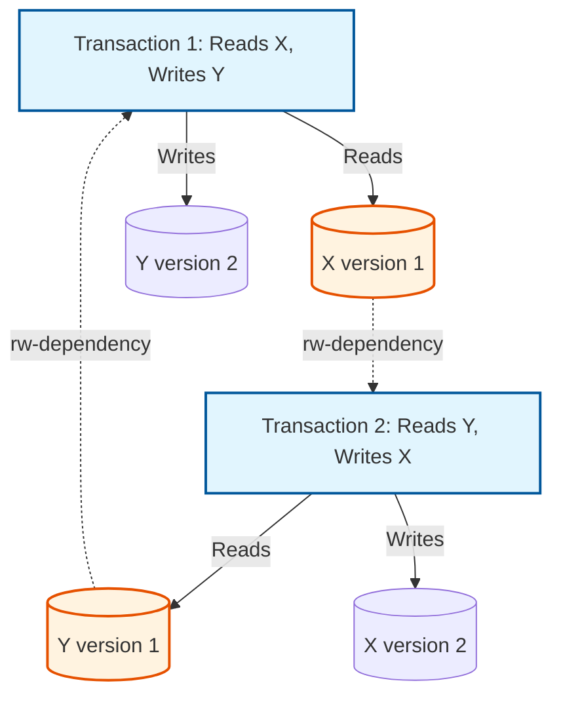
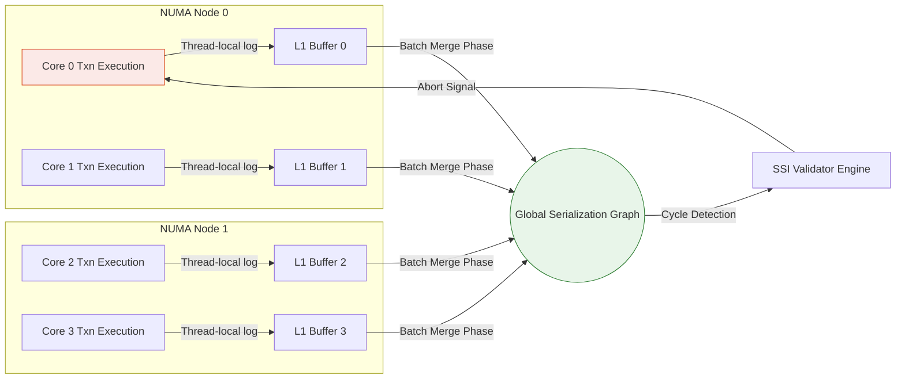

# 11: Serializable Snapshot Isolation (SSI): Nền Tảng Kiến Trúc và Tối Ưu Hóa Vi Mô Cho Serializability Không Khóa

## Bài viết này nói về điều gì

Serializable Snapshot Isolation (SSI) là một trong những lời giải thanh lịch nhất cho một bài toán đã làm đau đầu dân kỹ thuật database từ lâu: làm sao có được đảm bảo đúng đắn của serializability đầy đủ mà không phải trả giá bằng khóa (lock) và tranh chấp (contention)? SSI làm được điều này bằng cách kết hợp đảm bảo toán học của strict serializability với đường đọc không khóa (lock-free), thông lượng cao của Multi-Version Concurrency Control (MVCC).

Bài viết đi qua cả lý thuyết lẫn cách triển khai thực tế. Chúng ta sẽ xem định lý Fekete xác định chính xác "cấu trúc nguy hiểm" nào — các chu trình của anti-dependencies — gây ra những bất thường như Write Skew, và cách các database engine phát hiện chúng tại runtime bằng cấu trúc dữ liệu lock-free thay vì làm đình trệ CPU pipeline. Bài viết cũng đi sâu vào khía cạnh vi kiến trúc: tại sao Thread-Local Storage, cấp phát bộ nhớ nhận biết NUMA, và căn chỉnh cache line (để tránh False Sharing) không chỉ là chi tiết phụ mà chính là yếu tố quyết định SSI có khả thi ở quy mô lớn hay không. Kèm theo đó là vài bài học thực tế về lock escalation, điều chỉnh tỷ lệ abort, và điểm giao thoa giữa thiết kế phần cứng và phần mềm.

## Vấn Đề Cốt Lõi

Theo cách truyền thống, để đảm bảo strict serializability — tiêu chuẩn vàng của tính toàn vẹn dữ liệu — người ta dùng Strict Two-Phase Locking (SS2PL). Vấn đề là SS2PL tạo ra tranh chấp thực sự trên các cấu trúc dữ liệu dùng chung: transaction phải giành read lock và write lock, dẫn đến thread thrashing, những cơn bão vô hiệu hóa cache, và độ trễ càng lúc càng tệ khi tải tăng. Nói ngắn gọn: read chặn write, write chặn read.

Snapshot Isolation (SI) giải quyết được vế hiệu năng của bài toán đó. Cho mỗi transaction một bản snapshot bất biến của database, thế là read không bao giờ chặn write, write không bao giờ chặn read. Đường đọc không khóa này thực sự có giá trị. Vấn đề là SI không thực sự đảm bảo serializability — nó để lọt vài anomaly khá nổi tiếng:

1. **Write Skew:** hai transaction đọc những tập dữ liệu chồng lấn nhưng ghi vào các tập con rời nhau, và kết quả là chúng cùng phá vỡ một invariant mà từng transaction riêng lẻ sẽ không phá vỡ (ví dụ $A + B \ge 0$).
2. **Read-Only Anomaly:** một transaction chỉ đọc thôi vẫn có thể thấy một trạng thái không nhất quán, đơn giản vì cách hai transaction cập nhật khác xen kẽ nhau về thời gian.

Vậy vấn đề cốt lõi trở thành: làm sao giữ được đảm bảo toán học của serializability và loại bỏ Write Skew, mà không phải quay lại những nút thắt cổ chai của locking mà SI vốn sinh ra để tránh?

## Phân Tích Kỹ Thuật Chuyên Sâu

### Nền Tảng Lý Thuyết: Serialization Graphs và Định Lý Fekete

Để xác định chính xác SI hụt ở đâu, ta xây dựng một **Formal Serialization Graph $SG(T, E)$**, trong đó $T$ là tập các transaction đã commit và $E$ là tập các data dependency (Read-Write/rw, Write-Read/wr, Write-Write/ww). Một lịch sử thực thi là conflict-serializable đúng khi $SG$ phi chu trình (acyclic).

Snapshot Isolation đã loại bỏ được `ww-dependencies` (nhờ First-Committer-Wins) và `wr-dependencies` thì luôn hướng về phía trước theo thời gian. Cái nó không loại bỏ được là các chu trình dựng từ `rw-dependencies` — anti-dependencies.

Fekete và cộng sự đã chứng minh một điều rất hữu ích: **mọi thực thi non-serializable dưới SI đều tạo ra một serialization graph chứa một chu trình có hướng với đúng hai cạnh rw-dependency liên tiếp gặp nhau tại một transaction "pivot" duy nhất.**

$$ \exists \text{ cycle } C \in SG \implies (T_{in} \xrightarrow{rw} T_{pivot} \xrightarrow{rw} T_{out}) \in C $$

Transaction pivot, $T_{pivot}$, vừa là đầu nhận của một rw-dependency từ $T_{in}$, vừa là đầu gửi của một rw-dependency tới $T_{out}$. Khi $T_{in}$ và $T_{out}$ hóa ra là cùng một transaction, đó chính là Write Skew.



Đây chính là điều SSI dựa vào. Thay vì cố phát hiện toàn bộ chu trình — vốn là bài toán NP-complete — SSI chỉ theo dõi riêng cấu trúc nguy hiểm này. Nếu một transaction hóa ra nằm trong đó, SSI sẽ abort nó trước khi kịp commit.

### Cơ Chế Thuật Toán: SIREAD Locks và Dependency Tracking

Triển khai SSI đòi hỏi theo dõi **SIREAD locks**, mà dù mang tên như vậy, chúng không phải khóa theo nghĩa chặn (blocking) — chúng là **bản ghi metadata lock-free**. Một SIREAD lock chỉ đơn giản ghi lại việc một transaction đã đọc một version cụ thể của một tuple.

Bên dưới, engine duy trì vài hash table được phân mảnh và tối ưu hóa kỹ trong shared memory:

- **Hash Table 1:** ánh xạ các data item vật lý (tuple, index page) tới các transaction đang hoạt động đã đọc chúng.
- **Hash Table 2:** ánh xạ các transaction đang hoạt động tới các rw-dependency của chúng (cả cạnh vào lẫn cạnh ra).

Khi một transaction ghi vào một data item, engine sẽ probe Hash Table 1. Nếu có transaction đồng thời nào đã đọc version cũ hơn, một cạnh rw-dependency sẽ được ghi lại. Việc này phải diễn ra thật rẻ, vì giờ nó nằm trên đường găng (critical path) của mọi lần ghi.

$$ \text{Overhead}_{SSI} = \sum_{i=1}^{N_{reads}} \mathcal{O}(hash\_insert) + \sum_{j=1}^{N_{writes}} \mathcal{O}(hash\_probe + edge\_insert) $$

Ở giai đoạn validation, engine kiểm tra xem một transaction có đang bật cả hai cờ `inConflict` lẫn `outConflict` hay không. Nếu có, đó là ứng viên pivot. Từ đó engine kiểm tra thứ tự thời gian: $T_{out}$ có commit trước $T_{in}$ không? Nếu đúng, một trong hai transaction sẽ bị abort bất đồng bộ.

```rust
// Advanced Rust pseudocode for SSI Validation
struct TransactionState {
    id: u64,
    status: AtomicU8,
    in_conflict: AtomicBool,
    out_conflict: AtomicBool,
    in_edges: RwLock<Vec<Arc<ConflictEdge>>>,
    out_edges: RwLock<Vec<Arc<ConflictEdge>>>,
}

fn check_for_dangerous_structure(pivot: &Arc<TransactionState>) -> bool {
    if pivot.in_conflict.load(Ordering::Relaxed) && pivot.out_conflict.load(Ordering::Relaxed) {
        let out_edges = pivot.out_edges.read().unwrap();
        for edge in out_edges.iter() {
            let t_out = &edge.destination;
            let in_edges = pivot.in_edges.read().unwrap();
            for in_edge in in_edges.iter() {
                let t_in = &in_edge.source;
                // Temporal constraint: T_out must commit before T_in
                if is_concurrent(t_in, pivot) && is_concurrent(pivot, t_out) {
                    if t_out.status.load(Ordering::Acquire) == COMMITTED {
                         return true; // Dangerous structure confirmed
                    }
                }
            }
        }
    }
    false
}
```

### Các Yếu Tố và Nút Thắt Phần Cứng Vi Kiến Trúc

Sự gọn gàng về lý thuyết này va phải một vấn đề thực tế: phần cứng. Việc theo dõi SIREAD locks biến những thao tác vốn chỉ đọc thành thao tác làm thay đổi metadata dùng chung. Trên một server đa nhân, nhận biết NUMA, việc ghi vào đồ thị phụ thuộc toàn cục sinh ra **lưu lượng cache coherency** trên CPU interconnect (ví dụ QuickPath Interconnect).

Khi hàng chục nhân cùng cập nhật metadata cho cùng một phân đoạn dữ liệu đang bị tranh chấp, ta có một **cơn bão vô hiệu hóa cache line** — pipeline bị đình trệ, và Instructions Per Cycle (IPC) tụt rõ rệt.

Cách để tránh việc này là tách rời logical tracking khỏi physical mutation bằng các ring buffer **Thread-Local Storage (TLS)**. Khi một nhân đang chạy một transaction, nó ghi log hoạt động SIREAD một cách bất đồng bộ vào buffer cục bộ nằm trong L1/L2 cache của chính nó. Một background thread sau đó gom nhóm và merge các log này vào đồ thị toàn cục. Cách này phân bổ đều chi phí của các thao tác Compare-And-Swap (CAS) nguyên tử liên nhân — vốn nếu không sẽ chiếm phần lớn chi phí.



### Lock Escalation và TLB Misses

Các query chạy lâu có thể tạo ra hàng triệu SIREAD lock và ngốn hết RAM trong quá trình đó. Câu trả lời của SSI là **Lock Escalation** (nâng cấp độ hạt - granularity promotion): khóa ở mức tuple được nâng lên mức page hoặc thậm chí mức relation khi mọi thứ vượt tầm kiểm soát.

Điểm bất lợi là việc ánh xạ SIREAD metadata lên các physical page gây áp lực thật sự lên **Translation Lookaside Buffer (TLB)**. Một cách khắc phục phổ biến là **Transparent Huge Pages (THP)** — chẳng hạn trang 1GB — giúp tăng đáng kể tỷ lệ TLB hit và cho phép Memory Management Unit (MMU) giải quyết các lookup gần như tức thì. Việc căn chỉnh các hash bucket đúng theo ranh giới cache line 64-byte cũng giúp tránh False Sharing giữa các mẩu metadata không liên quan tới nhau.

## Bài Học Rút Ra & Thực Hành Tốt Nhất

1. **Cẩn thận với false positive.** SSI vốn mang tính xác suất. Lock escalation làm tăng khả năng false positive — bạn sẽ abort những transaction chưa từng thực sự vi phạm serializability, chỉ vì chúng đụng vào những tuple khác nhau trên cùng một page vừa bị khóa. Theo dõi sát tỷ lệ abort.
2. **Sắp xếp phần cứng cho đúng.** Nếu bạn tự xây dựng cơ chế này, đừng bao giờ ghi SSI metadata một cách đồng bộ qua các thread. Kết hợp TLS với batch-merge là thứ giúp bạn tránh kích hoạt những cơn bão vô hiệu hóa cache trên CPU interconnect.
3. **Thiết kế ứng dụng vẫn quan trọng.** Các workload lệch mạnh — chẳng hạn phân phối Zipfian với một tập nhỏ các dòng "nóng" — tạo ra serialization graph dày đặc, và SSI sẽ đáp lại bằng những chuỗi abort liên tiếp. Với các bản ghi thực sự nóng, pessimistic row-level locking (`SELECT FOR UPDATE`) đôi khi lại nhanh hơn optimistic SSI, nghe có vẻ ngược đời cho tới khi bạn tính đến chi phí của việc abort.
4. **Bố cục bộ nhớ là nơi quyết định thắng thua.** Dùng huge page và `alignas(64)` cho các cấu trúc metadata. Một cache miss tới bộ nhớ chính tốn khoảng 100ns; một L1 hit chỉ tốn khoảng 1ns. Trong một vòng lặp validation của SSI chạy hàng triệu lần mỗi giây, khoảng cách đó quyết định tất cả.

## Kết Luận

Serializable Snapshot Isolation gộp chung ba thứ vốn hiếm khi nằm chung một thiết kế một cách thoải mái: lý thuyết đồ thị chặt chẽ, cấu trúc dữ liệu lock-free lạc quan, và tinh chỉnh vi kiến trúc nhận biết phần cứng. Kết quả là bạn có được đảm bảo toán học của strict serializability mà không phải hy sinh thông lượng và khả năng mở rộng mà các workload hiện đại đòi hỏi.
