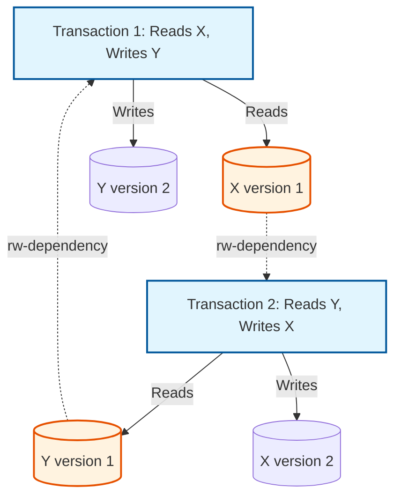
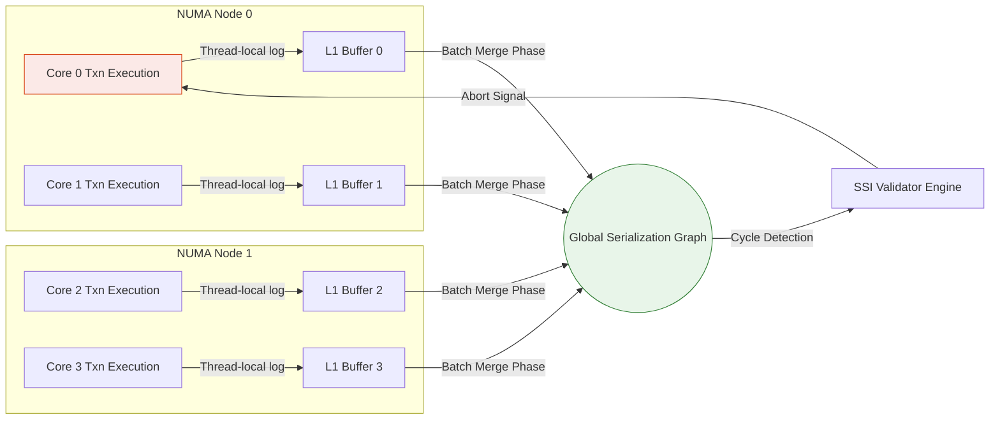

# 11: Serializable Snapshot Isolation (SSI): Architectural Foundations and Micro-Level Optimizations for Lock-Free Serializability

## What This Article Covers

Serializable Snapshot Isolation (SSI) is one of the more elegant answers to a problem that has dogged database engineers for decades: how do you get the correctness guarantees of full serializability without paying for it in locks and contention? SSI gets there by combining the mathematical guarantee of strict serializability with the lock-free, high-throughput read path of Multi-Version Concurrency Control (MVCC).

This piece walks through the theory and the implementation together. We'll look at how Fekete's theorem pins down exactly which "dangerous structures" — cycles of anti-dependencies — cause anomalies like Write Skew, and how database engines detect them at runtime using lock-free data structures instead of stalling the CPU pipeline. We'll also get into the micro-architectural side of things: why Thread-Local Storage, NUMA-aware memory allocation, and cache-line alignment (to avoid False Sharing) aren't just nice-to-haves but the difference between SSI being practical at scale and not. Along the way there are some concrete lessons on lock escalation, abort-rate tuning, and where hardware and software design decisions intersect.

## The Core Problem

Traditionally, guaranteeing strict serializability — the gold standard for data integrity — meant Strict Two-Phase Locking (SS2PL). The trouble is that SS2PL puts real contention on shared data structures: transactions have to acquire read and write locks, which leads to thread thrashing, cache invalidation storms, and latency that gets worse under load. In short, reads block writes, and writes block reads.

Snapshot Isolation (SI) fixed the performance side of that equation. Give each transaction its own immutable snapshot of the database, and reads never block writes, writes never block reads. That lock-free read path is genuinely valuable. The catch is that SI doesn't actually guarantee serializability — it allows a couple of well-known anomalies to slip through:

1. **Write Skew:** two transactions read overlapping data but write to disjoint subsets, and together they violate an invariant neither would have broken alone (say, $A + B \ge 0$).
2. **Read-Only Anomaly:** a transaction that only reads can still observe an inconsistent state, because of how two other update transactions happen to interleave in time.

So the core problem becomes: how do you keep the mathematical guarantee of serializability and rule out Write Skew, without falling back to the locking bottlenecks that SI was designed to escape?

## Deep Technical Analysis

### Theoretical Foundations: Serialization Graphs and the Fekete Theorem

To pin down exactly where SI falls short, we build a **Formal Serialization Graph $SG(T, E)$**, where $T$ is the set of committed transactions and $E$ is the set of data dependencies (Read-Write/rw, Write-Read/wr, Write-Write/ww). A history is conflict-serializable exactly when $SG$ is acyclic.

Snapshot Isolation already rules out `ww-dependencies` (via First-Committer-Wins) and `wr-dependencies` always point forward in time. What it can't rule out are cycles built from `rw-dependencies` — anti-dependencies.

Fekete et al. proved something useful here: **every non-serializable execution under SI produces a serialization graph containing a directed cycle with exactly two consecutive rw-dependency edges meeting at a single "pivot" transaction.**

$$ \exists \text{ cycle } C \in SG \implies (T_{in} \xrightarrow{rw} T_{pivot} \xrightarrow{rw} T_{out}) \in C $$

The pivot transaction, $T_{pivot}$, is simultaneously on the receiving end of an rw-dependency from $T_{in}$ and the sending end of one to $T_{out}$. When $T_{in}$ and $T_{out}$ turn out to be the same transaction, that's Write Skew.



This is what SSI leans on. Rather than trying to detect full cycles — which is NP-complete — SSI watches for this specific dangerous structure instead. If a transaction turns out to be part of one, SSI aborts it before it can commit.

### Algorithmic Mechanics: SIREAD Locks and Dependency Tracking

Implementing SSI means tracking **SIREAD locks**, which despite the name are not locks in any blocking sense — they're **lock-free metadata records**. An SIREAD lock just notes that a transaction read a particular version of a tuple.

Under the hood, the engine keeps a couple of partitioned, heavily optimized hash tables in shared memory:

- **Hash Table 1:** maps physical data items (tuples, index pages) to the active transactions that have read them.
- **Hash Table 2:** maps active transactions to their rw-dependencies (both incoming and outgoing edges).

When a transaction writes to a data item, the engine probes Hash Table 1. If some concurrent transaction had already read the older version, an rw-dependency edge gets recorded. This has to happen cheaply, since it's now on the critical path for every write.

$$ \text{Overhead}_{SSI} = \sum_{i=1}^{N_{reads}} \mathcal{O}(hash\_insert) + \sum_{j=1}^{N_{writes}} \mathcal{O}(hash\_probe + edge\_insert) $$

At validation time, the engine checks whether a transaction has both its `inConflict` and `outConflict` flags set. If so, it's a pivot candidate. From there the engine checks the temporal ordering: does $T_{out}$ commit before $T_{in}$? If that holds, one of the transactions gets aborted asynchronously.

```rust
// Advanced Rust pseudocode for SSI Validation
struct TransactionState {
    id: u64,
    status: AtomicU8,
    in_conflict: AtomicBool,
    out_conflict: AtomicBool,
    in_edges: RwLock<Vec<Arc<ConflictEdge>>>,
    out_edges: RwLock<Vec<Arc<ConflictEdge>>>,
}

fn check_for_dangerous_structure(pivot: &Arc<TransactionState>) -> bool {
    if pivot.in_conflict.load(Ordering::Relaxed) && pivot.out_conflict.load(Ordering::Relaxed) {
        let out_edges = pivot.out_edges.read().unwrap();
        for edge in out_edges.iter() {
            let t_out = &edge.destination;
            let in_edges = pivot.in_edges.read().unwrap();
            for in_edge in in_edges.iter() {
                let t_in = &in_edge.source;
                // Temporal constraint: T_out must commit before T_in
                if is_concurrent(t_in, pivot) && is_concurrent(pivot, t_out) {
                    if t_out.status.load(Ordering::Acquire) == COMMITTED {
                         return true; // Dangerous structure confirmed
                    }
                }
            }
        }
    }
    false
}
```

### Micro-Architectural Hardware Considerations and Bottlenecks

All this theoretical cleanliness runs into a practical problem: hardware. Tracking SIREAD locks turns what used to be read-only operations into operations that mutate shared metadata. On a multi-core, NUMA-aware server, writing to the global dependency graph generates **cache coherency traffic** across the CPU interconnect (QuickPath Interconnect, for example).

When dozens of cores are all updating metadata for the same contended segment of data, you get a **cache line invalidation storm** — pipelines stall, and Instructions Per Cycle (IPC) drops noticeably.

The way around this is to decouple logical tracking from physical mutation using **Thread-Local Storage (TLS)** ring buffers. As a core runs a transaction, it logs SIREAD activity asynchronously into a local buffer that lives in its own L1/L2 cache. A background thread later batches and merges these logs into the global graph. That amortizes the cost of the inter-core atomic Compare-And-Swap (CAS) operations that would otherwise dominate.



### Lock Escalation and TLB Misses

Long-running queries can rack up millions of SIREAD locks and eat through RAM in the process. SSI's answer is **Lock Escalation** (granularity promotion): tuple-level locks get promoted to page-level or even relation-level locks when things get out of hand.

The downside is that mapping SIREAD metadata onto physical pages puts real pressure on the **Translation Lookaside Buffer (TLB)**. One common fix is **Transparent Huge Pages (THP)** — 1GB pages, for instance — which pushes the TLB hit ratio up substantially and lets the Memory Management Unit (MMU) resolve lookups almost instantly. It also helps to align hash buckets exactly to 64-byte cache line boundaries, which avoids False Sharing between unrelated pieces of metadata.

## Lessons Learned & Best Practices

1. **Watch for false positives.** SSI is inherently probabilistic. Lock escalation makes false positives more likely — you'll abort transactions that never actually violated serializability, just because they touched different tuples on the same now-locked page. Keep an eye on abort rates.
2. **Get the hardware layout right.** If you're building this yourself, never write SSI metadata synchronously across threads. TLS plus batch-merge is what keeps you from triggering cache invalidation storms across the CPU interconnect.
3. **Application design still matters.** Skewed workloads — think Zipfian distributions with a small set of hot rows — produce dense serialization graphs, and SSI will respond with abort cascades. For genuinely hot records, pessimistic row-level locking (`SELECT FOR UPDATE`) can end up faster than optimistic SSI, which feels backwards until you think about the abort cost.
4. **Memory layout is where this gets won or lost.** Use huge pages and `alignas(64)` for your metadata structures. A cache miss to main memory costs roughly 100ns; an L1 hit costs about 1ns. In an SSI validation loop running millions of times a second, that gap is the whole ballgame.

## Conclusion

Serializable Snapshot Isolation pulls together three things that don't usually sit comfortably in the same design: rigorous graph theory, optimistic lock-free data structures, and hardware-aware micro-architectural tuning. The payoff is that you get the mathematical guarantee of strict serializability without giving up the throughput and scalability that modern workloads demand.
