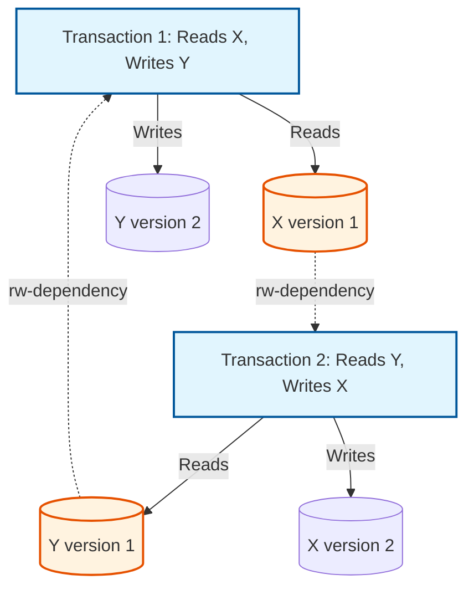
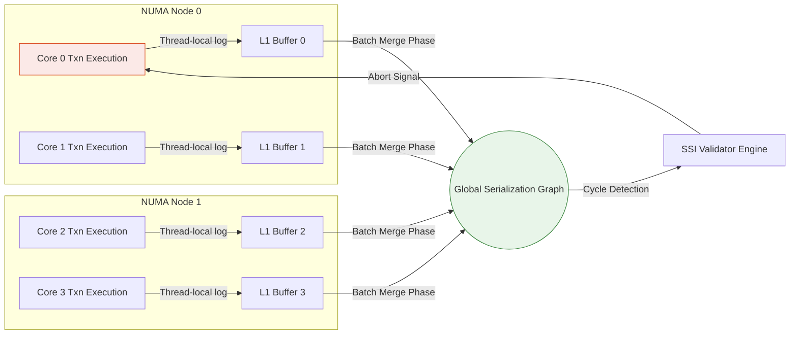

# Serializable Snapshot Isolation (SSI): Architectural Foundations and Micro-Level Optimizations for Lock-Free Serializability

## Theoretical Foundations of Concurrency Control and Snapshot Isolation Anomalies
The relentless pursuit of scalable concurrency control mechanisms within distributed and multi-core database systems fundamentally revolves around the mitigation of transactional anomalies while maximizing hardware resource utilization. Traditional serializability, often achieved via Strict Two-Phase Locking (SS2PL), imposes severe contention on shared data structures, inducing thread thrashing, cache invalidation storms, and profound latency degradation under highly concurrent workloads. The introduction of Multiversion Concurrency Control (MVCC) and Snapshot Isolation (SI) provided a pragmatic escape from the catastrophic performance penalties of SS2PL. Under SI, transactions operate on an immutable, transactionally consistent snapshot of the database, ensuring that read operations are never blocked by write operations, and write operations never block reads. This lock-free read semantic is extremely advantageous for read-heavy workloads; however, SI mathematically fails to guarantee true serializability, permitting complex anomalies such as the Write Skew and the Read-Only Anomaly.

To rigorously define the limitations of SI, one must construct a Formal Serialization Graph $SG(T, E)$, where $T$ represents the set of committed transactions and $E$ represents the directed edges corresponding to data dependencies. These dependencies are strictly categorized into three types: Read-Write (rw-dependency, or anti-dependency), Write-Read (wr-dependency), and Write-Write (ww-dependency). According to the foundational serialization theorem, an execution history is conflict-serializable if and only if its corresponding serialization graph is acyclic. SI inherently prevents ww-dependencies across concurrent transactions through the First-Committer-Wins rule, and wr-dependencies always point forward in time. However, SI permits cycles that contain one or more rw-dependencies. Specifically, a theorem by Fekete et al. demonstrated that every non-serializable execution under SI must exhibit a serialization graph containing a directed cycle with exactly two consecutive rw-dependency edges adjacent to a single "pivot" transaction. The pivot transaction, $T_{pivot}$, must simultaneously act as the receiver of an rw-dependency from $T_{in}$ and the emitter of an rw-dependency to $T_{out}$. The Write Skew anomaly manifests when $T_{in}$ and $T_{out}$ are identically the same transaction, creating a trivial cycle where two concurrent transactions read overlapping data sets but write to disjoint subsets, modifying the state in a mutually inconsistent manner.

$$ \exists \text{ cycle } C \in SG \implies (T_{in} \xrightarrow{rw} T_{pivot} \xrightarrow{rw} T_{out}) \in C $$

The mathematical necessity of this "dangerous structure" forms the bedrock of Serializable Snapshot Isolation (SSI). Instead of attempting to statically detect cyclic dependencies at the precise moment of execution—an operation mathematically proven to be NP-complete in general dynamic contexts—SSI takes a probabilistic and optimistic approach. SSI augments the underlying SI mechanism by maintaining runtime metadata about read and write operations to identify the formulation of these consecutive rw-dependencies. When the SSI validation phase detects that a transaction is participating in a dangerous structure, it preemptively aborts one of the involved transactions to surgically sever the cycle before the transaction can commit. This cycle prevention algorithm relies on the observation that while not all dangerous structures lead to actual non-serializable executions, all non-serializable executions are strictly predicated upon the existence of a dangerous structure. Thus, by eliminating the structure, SSI guarantees strict serializability without ever acquiring a read lock or impeding the lock-free read operations fundamental to MVCC.



The prevention of the Read-Only Anomaly further underscores the complexity of SI limitations. In this pathological scenario, a purely read-only transaction, which mathematically cannot introduce data modification conflicts, observes an inconsistent database state due to the subtle temporal interleaving of two other update transactions experiencing an rw-dependency cycle. The read-only transaction becomes a conduit that exposes the non-serializability of the underlying history to the application layer. SSI inherently protects against this by tracking rw-dependencies even for read-only operations, seamlessly aborting the structural pivot before the read-only transaction commits its mathematically skewed observation. The elegance of SSI lies in its optimistic nature; the overhead of tracking these dependencies is largely confined to memory manipulation of lightweight metadata structures, completely avoiding the catastrophic synchronization bottlenecks of traditional locking mechanisms while preserving the isolation guarantees demanded by mission-critical financial and distributed systems.

## Algorithmic Mechanics and Memory Architecture of Serializable Snapshot Isolation
The implementation of Serializable Snapshot Isolation requires an intricate and highly optimized runtime architecture to monitor and manage the dynamic formulation of transaction serialization graphs without imposing unacceptable performance degradation. The core algorithm mandates the tracking of SIREAD locks, which, despite the nomenclature, are entirely lock-free metadata constructs. An SIREAD lock simply records the fact that a specific transaction has observed a specific version of a tuple, page, or relation. Concurrently, the system must monitor the writes of modifying transactions to identify when a new version of a tuple is created that mathematically invalidates the SIREAD observation of a concurrent transaction. This precise moment marks the creation of an rw-dependency edge in the serialization graph, where the reading transaction logically precedes the writing transaction in the serialization order.

To manage this metadata, the database engine typically employs a sophisticated shared-memory architecture consisting of heavily partitioned hash tables. One hash table maps physical data items—such as heap tuples or index pages—to the active transactions that have read them. Another table maps active transactions to the list of rw-dependencies they have acquired, either as the source (out-edge) or the destination (in-edge). When a transaction modifies a data item, the engine probes the SIREAD hash table. If concurrent transactions have read the older version of this item, the engine registers an rw-dependency directed from the reading transaction to the writing transaction. This dependency tracking must occur with minimal cache-line contention; therefore, modern implementations leverage lock-free data structures, hazard pointers, and cache-aligned memory allocations to prevent false sharing across non-uniform memory access (NUMA) nodes. The critical path of tuple modification is augmented with a rapid metadata check, which heavily relies on CPU instruction pipelining and branch prediction to ensure the overhead remains negligible under standard workloads.

$$ \text{Overhead}_{SSI} = \sum_{i=1}^{N_{reads}} \mathcal{O}(hash\_insert) + \sum_{j=1}^{N_{writes}} \mathcal{O}(hash\_probe + edge\_insert) $$

The crux of the SSI algorithm executes during the validation phase or synchronously during operation, where the engine evaluates the newly formed rw-dependencies to detect the Fekete "dangerous structure" ($T_{in} \xrightarrow{rw} T_{pivot} \xrightarrow{rw} T_{out}$). The engine maintains boolean flags within each transaction's local state: `inConflict` (indicating an incoming rw-edge) and `outConflict` (indicating an outgoing rw-edge). If a transaction simultaneously sets both flags, it becomes a candidate pivot. However, aborting immediately upon setting both flags is overly pessimistic. The true Fekete theorem stipulates that for a non-serializable cycle to exist, the transactions forming the dangerous structure must have concurrent lifetimes. Specifically, $T_{out}$ must commit before $T_{in}$ commits, otherwise the temporal constraints of the snapshot isolation bounds mathematically preclude the cycle. Therefore, the SSI algorithm incorporates a sophisticated commit-ordering check. When a pivot structure is detected, the engine examines the commit status and temporal boundaries of $T_{in}$ and $T_{out}$. If the conditions for an actual serialization anomaly are met, the engine deterministically selects a victim transaction—often the one that has performed the least amount of work or the one currently executing the operation that completes the dangerous structure—and issues an asynchronous abort signal.

```rust
struct TransactionState {
    id: u64,
    status: AtomicU8,
    in_conflict: AtomicBool,
    out_conflict: AtomicBool,
    // Pointers to conflict edges for detailed graph traversal
    in_edges: RwLock<Vec<Arc<ConflictEdge>>>,
    out_edges: RwLock<Vec<Arc<ConflictEdge>>>,
}

fn check_for_dangerous_structure(pivot: &Arc<TransactionState>) -> bool {
    if pivot.in_conflict.load(Ordering::Relaxed) && pivot.out_conflict.load(Ordering::Relaxed) {
        // Iterate through outgoing edges to find T_out
        let out_edges = pivot.out_edges.read().unwrap();
        for edge in out_edges.iter() {
            let t_out = &edge.destination;
            // Iterate through incoming edges to find T_in
            let in_edges = pivot.in_edges.read().unwrap();
            for in_edge in in_edges.iter() {
                let t_in = &in_edge.source;
                // Verify temporal concurrency constraint: T_out must commit before T_in
                if is_concurrent(t_in, pivot) && is_concurrent(pivot, t_out) {
                    if t_out.status.load(Ordering::Acquire) == COMMITTED {
                         return true; // Dangerous structure confirmed
                    }
                }
            }
        }
    }
    false
}
```

A paramount challenge in the algorithmic design of SSI is managing the unbounded growth of the serialization graph metadata. Long-running transactions or queries scanning massive fact tables can generate millions of SIREAD locks, exhausting available shared memory and inducing severe garbage collection pauses. To mitigate this memory pressure, the SSI implementation must employ a technique known as "lock escalation" or "granularity promotion." When the number of SIREAD locks on tuples within a single physical page exceeds a predefined threshold, the engine automatically promotes the locks to a single page-level lock. If page-level locks accumulate, they are promoted to a relation-level lock. This hierarchical promotion drastically reduces memory consumption and improves the spatial locality of dependency checking, albeit at the cost of precision. Lock escalation inherently introduces false positives; an rw-dependency may be flagged between two transactions that accessed different tuples on the same page, leading to a spurious abort. The algorithmic tuning of these escalation thresholds represents a delicate equilibrium between physical memory constraints, CPU cache efficiency, and the transaction abort rate, necessitating continuous runtime heuristics and dynamic adaptation.

## Micro-Architectural Optimizations and Hardware Considerations for SSI
The deployment of Serializable Snapshot Isolation in extreme-throughput environments necessitates a profound understanding of micro-architectural interactions, as the theoretical elegance of the algorithm can be utterly compromised by modern hardware bottlenecks. The pervasive tracking of SIREAD locks and rw-dependencies transforms what would be read-only operations under standard Snapshot Isolation into metadata-mutating operations. Every logical read requires a physical write to the shared dependency graph. In a multi-core, NUMA-aware server architecture, this paradigm shift precipitates severe cache coherency traffic over the QuickPath Interconnect (QPI) or Infinity Fabric. When dozens of processor cores attempt to update the metadata associated with heavily contended, highly localized data segments (such as the root pages of a B-Tree index), the resulting cache line invalidation storm can stall the CPU pipelines, degrading the instruction-per-cycle (IPC) metric significantly.

To circumvent the catastrophic degradation imposed by global cache invalidations, enterprise-grade SSI implementations must decouple the logical tracking of dependencies from the immediate physical mutation of shared memory structures. This is frequently achieved through a thread-local, lock-free ring buffer architecture. As a transaction executes on a specific core, its SIREAD observations and potential rw-dependencies are logged asynchronously into a local buffer mapped entirely within the core's L1/L2 cache hierarchy. A dedicated background thread, or an asynchronous epoch-based reconciliation phase, periodically flushes these local buffers into the global serialization graph. This batched, delayed consolidation drastically amortizes the cost of inter-core synchronization and minimizes atomic compare-and-swap (CAS) operations on the critical execution path. However, this asynchronous reconciliation introduces a temporal window where the global graph is technically inconsistent with the physical execution state, slightly delaying the detection of Fekete structures. The architecture must mathematically guarantee that the reconciliation epoch boundary occurs strictly before the transaction's commit phase, ensuring that no transaction commits while participating in an undetected dangerous structure.



Furthermore, the hardware translation lookaside buffer (TLB) and virtual memory paging system profoundly impact the efficiency of SSI's hierarchical lock escalation. When SIREAD metadata is mapped to physical pages, the database engine must perform continuous virtual-to-physical address translations to associate a modified tuple with the corresponding page-level tracking structures. In systems with immense working sets, TLB misses become a dominant source of latency. Optimizing SSI demands the rigorous utilization of Transparent Huge Pages (THP) or explicitly allocated 1GB huge pages configured via the operating system kernel. By mapping the shared memory segment containing the serialization graph and SIREAD hash tables utilizing huge pages, the implementation significantly increases the TLB hit ratio, allowing the CPU's memory management unit (MMU) to resolve dependency lookups with near-zero latency. Additionally, aligning the hash table buckets to exact 64-byte cache line boundaries ensures that a single memory fetch retrieves the entire metadata required to evaluate an rw-dependency, eliminating pathological scenarios where an unaligned fetch spans multiple cache lines and triggers extraneous DRAM accesses.

Ultimately, the true efficacy of Serializable Snapshot Isolation is governed by the application's spatial and temporal access patterns juxtaposed against these hardware limitations. Highly skewed workloads characterized by Pareto distributions (e.g., Zipfian distributions where a minuscule fraction of records receive the vast majority of reads and writes) inherently generate dense, highly connected serialization graphs. In such environments, the probability of detecting a false-positive Fekete structure due to relation-level lock escalation approaches certainty, resulting in massive abort cascades that cripple throughput. Advanced micro-architectural implementations dynamically monitor the graph density and abort velocity, employing feedback loops to adaptively modulate the lock escalation thresholds or selectively degrade to pessimistic locking for specific "hot" database regions. The synthesis of rigorous graph theory, optimistic lock-free data structures, and profound hardware-level optimization renders Serializable Snapshot Isolation a pinnacle achievement in modern transactional systems, delivering the mathematical certainty of strict serializability without compromising the scalability required by planetary-scale data infrastructure.

## SEO
* **Keywords**: Serializable Snapshot Isolation, SSI, True Serializability, Lock-free Concurrency Control, Multiversion Concurrency Control, MVCC, Snapshot Isolation Anomalies, Write Skew, Database Micro-architecture, Transaction Serialization Graph, PostgreSQL SSI Implementation, Fekete Theorem.
* **Description**: A massive, deeply technical whitepaper exploring the theoretical foundations, algorithmic mechanics, and hardware-level micro-architectural optimizations of Serializable Snapshot Isolation (SSI). Discover how modern databases achieve true serializability without locks.
* **Author**: Elite Staff Engineer & Technical Writer.
