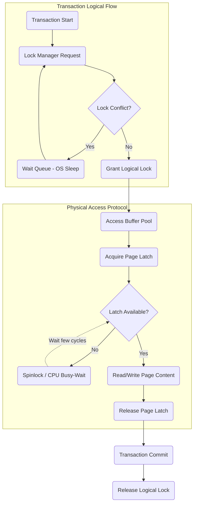

# 12: Locks, Latches, và Spinlocks: Kiểm soát đồng thời trong Database Engine

## Cơ sở lý thuyết về đồng bộ hóa đa luồng và cấu trúc vi mô của hệ thống quản lý cơ sở dữ liệu

Trong kiến trúc của các hệ thống quản trị cơ sở dữ liệu hiện đại, việc đảm bảo tính nhất quán và toàn vẹn dữ liệu khi có hàng nghìn luồng thực thi truy cập đồng thời là một thách thức kỹ thuật cực kỳ phức tạp. Các hệ thống này hoạt động trên các kiến trúc phần cứng đa lõi (multi-core) và bộ nhớ truy cập không đồng nhất (Non-Uniform Memory Access - NUMA), nơi mà độ trễ truy cập bộ nhớ và chi phí giao tiếp giữa các bộ đệm (cache) của bộ vi xử lý đóng vai trò quyết định đối với thông lượng tổng thể. Để duy trì các thuộc tính ACID (Atomicity, Consistency, Isolation, Durability) trong khi tối đa hóa mức độ xử lý song song, các kỹ sư hệ thống cơ sở dữ liệu phải thiết kế những cơ chế đồng bộ hóa tinh vi ở nhiều cấp độ trừu tượng khác nhau. Mức độ trừu tượng cao nhất thường liên quan đến tính nhất quán logic của các giao dịch (transactions), trong khi mức độ thấp nhất liên quan đến tính nhất quán vật lý của các cấu trúc dữ liệu trong bộ nhớ chính và bộ đệm. Tại cốt lõi của các cơ chế đồng bộ hóa này là ba khái niệm nền tảng nhưng thường xuyên bị nhầm lẫn: Locks, Latches, và Spinlocks. Mỗi khái niệm phục vụ một mục đích cụ thể, hoạt động trên một vùng thời gian (timescale) khác nhau và chịu ảnh hưởng trực tiếp từ các quyết định thiết kế của hệ điều hành cũng như các giới hạn của phần cứng vi mô.

Để hiểu rõ sự cần thiết của các cơ chế đồng bộ hóa này, chúng ta cần phân tích giới hạn của xử lý song song thông qua Định luật Amdahl. Định luật này mô tả mức tăng tốc độ lý thuyết tối đa có thể đạt được của một hệ thống khi một phần của hệ thống được cải thiện, đặc biệt là khi tăng số lượng đơn vị xử lý. Giả sử $p$ là tỷ lệ thời gian thực thi của thuật toán có thể được song song hóa hoàn toàn, và $1-p$ là phần tuần tự bắt buộc phải thực thi độc quyền. Mức tăng tốc độ tối đa $S(n)$ khi sử dụng $n$ lõi xử lý được tính bằng công thức toán học $S(n) = \frac{1}{(1-p) + \frac{p}{n}}$. Trong bối cảnh của cơ sở dữ liệu, phần tuần tự $1-p$ chính là thời gian mà các luồng phải chờ đợi để thu thập các khóa bảo vệ (Locks, Latches) nhằm truy cập vào các vùng găng (critical sections). Khi $n$ tiến tới vô cực, giới hạn tăng tốc của hệ thống sẽ hội tụ về $\frac{1}{1-p}$. Do đó, tối thiểu hóa thời gian giữ khóa và giảm thiểu chi phí tranh chấp (contention overhead) là mục tiêu sống còn để thiết kế một Database Engine có khả năng mở rộng. Sự tranh chấp này có thể được mô hình hóa sâu hơn bằng lý thuyết hàng đợi (Queueing Theory), cụ thể là Định luật Little. Định luật Little phát biểu rằng số lượng yêu cầu trung bình $L$ trong một hệ thống ổn định bằng với tốc độ tới trung bình $\lambda$ nhân với thời gian trung bình $W$ mà một yêu cầu dành ra trong hệ thống, biểu diễn qua phương trình $L = \lambda W$. Nếu các vùng găng được thiết kế kém, thời gian phục vụ trung bình $\mu^{-1}$ của việc xử lý dữ liệu bên trong vùng găng sẽ tăng lên, làm tăng hệ số sử dụng $\rho = \frac{\lambda}{\mu}$. Khi $\rho$ tiến gần đến 1, thời gian chờ đợi $W$ sẽ tăng tiệm cận tới vô cực theo mô hình hàng đợi M/M/1, dẫn đến hiện tượng sụp đổ thông lượng (throughput collapse).

Locks, trong thuật ngữ cơ sở dữ liệu, là một cấu trúc dữ liệu mức cao được quản lý bởi Lock Manager, nhằm mục đích duy trì tính nhất quán logic (logical consistency) của toàn bộ cơ sở dữ liệu theo định nghĩa của mức cô lập giao dịch (Transaction Isolation Level). Locks bảo vệ các thực thể logic như bản ghi (tuples), trang dữ liệu (pages), bảng (tables), hoặc toàn bộ cơ sở dữ liệu khỏi các giao dịch xung đột. Vòng đời của một Lock kéo dài trong suốt khoảng thời gian thực thi của một giao dịch, có thể lên tới hàng chục mili-giây hoặc thậm chí hàng phút. Các giao dịch thường tuân theo giao thức Khóa hai giai đoạn (Two-Phase Locking - 2PL), trong đó giao dịch yêu cầu các Lock trong giai đoạn phát triển (growing phase) và chỉ giải phóng chúng trong giai đoạn co lại (shrinking phase), thường là tại thời điểm kết thúc (commit hoặc abort). Lock Manager lưu trữ thông tin về Locks trong một bảng băm khổng lồ, bao gồm các ma trận xung đột tương thích (compatibility matrices) cực kỳ phức tạp để quản lý các loại khóa chia sẻ (Shared - S), khóa độc quyền (Exclusive - X), và các khóa có ý định (Intent - IS, IX). Việc yêu cầu và giải phóng một Lock đòi hỏi chi phí tính toán rất lớn, bao gồm việc phân bổ bộ nhớ động, quản lý cấu trúc dữ liệu danh sách liên kết, và phát hiện bế tắc (deadlock detection) thông qua các thuật toán duyệt đồ thị chờ (Wait-For Graph).

Ngược lại hoàn toàn với Locks, Latches là những cơ chế bảo vệ vùng găng ở mức vật lý (physical consistency), được thiết kế để duy trì cấu trúc nội bộ của các cấu trúc dữ liệu như B+Tree, Hash Table, hoặc các khối điều khiển bộ đệm (Buffer Control Blocks). Latches hoạt động cực kỳ nhanh, vòng đời của chúng chỉ tồn tại trong khoảng thời gian một luồng thực hiện việc đọc hoặc sửa đổi cục bộ một cấu trúc dữ liệu trong bộ nhớ, thường đo bằng micro-giây hoặc nano-giây. Latches không cần phải tuân theo bất kỳ giao thức cấp phát nào như 2PL và cũng không có hệ thống phát hiện bế tắc trung tâm. Các lập trình viên xây dựng hệ thống cơ sở dữ liệu phải chịu trách nhiệm hoàn toàn về việc viết mã nguồn sao cho không xảy ra bế tắc vật lý khi sử dụng Latches, thường bằng cách áp dụng một trật tự thu nhận Latch nghiêm ngặt (strict latch acquisition ordering). Do thời gian giữ Latch cực kỳ ngắn, cấu trúc dữ liệu của Latch phải cực kỳ gọn nhẹ, thường chỉ là một vài byte được nhúng trực tiếp vào cấu trúc dữ liệu mà nó bảo vệ, nhằm tối ưu hóa hiệu suất của bộ nhớ cache. Spinlocks, một dạng đặc biệt và ở mức thấp nhất của Latches, được hiện thực hóa trực tiếp bằng các chỉ thị kiến trúc vi mô của CPU. Spinlocks sẽ thực hiện vòng lặp bận (busy-wait) liên tục kiểm tra trạng thái của một biến bộ nhớ cho đến khi khóa khả dụng, thay vì yêu cầu hệ điều hành thực hiện việc chuyển đổi ngữ cảnh (context switch) vốn tốn kém hàng nghìn chu kỳ CPU.

## Phân tích chi tiết về Locks, Latches và Spinlocks: Kiến trúc và thuật toán tối ưu hóa

Kiến trúc bên trong của Lock Manager là một tác phẩm nghệ thuật về thiết kế hệ thống phân tán nội bộ. Mỗi yêu cầu Lock từ một giao dịch sẽ được băm (hash) dựa trên ID của tài nguyên (ví dụ: Table ID + Page ID + Tuple ID) để tìm ra một thùng (bucket) trong Lock Table. Để đảm bảo tính nguyên vẹn của bản thân Lock Table, cấu trúc này lại phải được bảo vệ bởi các Latches. Điều này tạo ra một hệ thống đồng bộ hóa lồng nhau, nơi mà việc xin cấp phép một Lock logic trước tiên yêu cầu thu thập một Latch vật lý trên bảng băm tương ứng. Công thức tính xác suất xung đột trên một thùng băm khi có $n$ yêu cầu đồng thời và $m$ thùng được biểu diễn bằng bài toán nghịch lý ngày sinh, xấp xỉ bởi hàm $P_{collision} = 1 - e^{-\frac{n^2}{2m}}$. Để giảm thiểu xác suất xung đột này, các hệ thống cơ sở dữ liệu thương mại như SQL Server hoặc mã nguồn mở như PostgreSQL cấu hình số lượng thùng $m$ lên tới hàng triệu và sử dụng các chiến lược khóa phân vùng (partitioned locking). Khi một luồng yêu cầu Lock logic không thể thu thập được khóa ngay lập tức do một giao dịch khác đang giữ trạng thái xung đột, luồng này sẽ được đưa vào hàng đợi chờ và bị hệ điều hành đình chỉ thực thi (suspend). Quá trình đình chỉ này kích hoạt sự can thiệp trực tiếp của bộ lập lịch (scheduler) của hệ điều hành, đẩy luồng hiện tại ra khỏi lõi CPU và khôi phục trạng thái (registers, program counter) của một luồng khác. Sự dịch chuyển ngữ cảnh (context switch) nặng nề này tiêu tốn khoảng vài micro-giây, khiến CPU bị lãng phí đáng kể thay vì xử lý dữ liệu hữu ích.

Để thao tác với dữ liệu nằm trên các trang (pages) trong đĩa cứng hoặc bộ nhớ, Latches được sử dụng làm người bảo vệ tuyến đầu. Trong cấu trúc dữ liệu B+Tree kinh điển, quá trình duyệt từ nút gốc xuống nút lá đòi hỏi một kỹ thuật gọi là Latch Crabbing hoặc Latch Coupling. Luồng thực thi sẽ thu thập Latch trên nút cha, sau đó thu thập Latch trên nút con, rồi mới tiến hành giải phóng Latch trên nút cha. Quá trình di chuyển an toàn này đảm bảo rằng không có bất kỳ luồng sửa đổi cấu trúc (như chia tách hoặc hợp nhất nút - node split/merge) nào có thể can thiệp phá vỡ tính liên kết vật lý của cây trong quá trình duyệt. Tuy nhiên, việc liên tục xin và giải phóng Latch tại nút gốc của B+Tree tạo ra một nút thắt cổ chai vô cùng nghiêm trọng. Để giải quyết rào cản thông lượng này, các thuật toán hiện đại sử dụng Latches hỗ trợ Đọc-Ghi (Reader-Writer Latches) kết hợp với các kỹ thuật khóa nới lỏng (Optimistic Lock Coupling). Theo thuật toán này, luồng đọc sẽ không thu nhận Latch theo kiểu truyền thống mà sẽ đọc một biến phiên bản (version counter) tại mỗi nút. Biến phiên bản này đóng vai trò như một bộ đếm monotonically increasing. Sau khi đọc xong dữ liệu từ nút, luồng sẽ kiểm tra lại biến phiên bản. Nếu biến phiên bản thay đổi hoặc biểu thị rằng một luồng ghi đang tiến hành cập nhật, luồng đọc sẽ tự động hủy bỏ kết quả vừa đọc và thử lại từ đầu. Thuật toán này loại bỏ hoàn toàn chi phí ghi vào bộ nhớ dùng chung trong quá trình đọc, giảm thiểu tối đa sự can thiệp của giao thức đồng nhất bộ nhớ đệm (cache coherence protocol) của phần cứng.



Ở tầng thấp nhất của hệ thống, Spinlocks được triển khai dựa trên các chỉ thị bộ nhớ nguyên tử (atomic memory instructions) do kiến trúc vi xử lý cung cấp. Phổ biến nhất trong số đó là Test-And-Set (TAS) và Compare-And-Swap (CAS). Lệnh CAS nhận vào ba tham số: một địa chỉ bộ nhớ, một giá trị kỳ vọng (expected value), và một giá trị mới (new value). Lệnh này chỉ cập nhật giá trị mới vào địa chỉ bộ nhớ nếu và chỉ nếu giá trị hiện tại tại địa chỉ đó hoàn toàn khớp với giá trị kỳ vọng, và toàn bộ quá trình so sánh - cập nhật này diễn ra trong một chu kỳ nguyên tử không thể chia cắt ở cấp độ phần cứng. Một Spinlock cơ bản có thể được cấu thành từ một vòng lặp vô hạn liên tục thực hiện lệnh CAS để đổi trạng thái khóa từ 0 (chưa khóa) sang 1 (đã khóa). Tuy nhiên, một vòng lặp CAS liên tục sẽ tạo ra một thảm họa về mặt băng thông trên bus bộ nhớ. Khi nhiều luồng cùng cố gắng tranh chấp một Spinlock, các luồng này sẽ liên tục phát ra các tín hiệu vô hiệu hóa bộ đệm (cache invalidation signals) tới tất cả các lõi CPU khác, làm tắc nghẽn hoàn toàn đường truyền dữ liệu nội bộ. Để giải quyết vấn đề vật lý này, thuật toán Spinlock với thời gian chờ theo cấp số nhân (Exponential Backoff Spinlock) được áp dụng một cách rộng rãi.

```cpp
#include <atomic>
#include <thread>

class ExponentialBackoffSpinlock {
private:
    std::atomic<bool> lock_flag{false};

public:
    void lock() {
        int backoff_time = 1;
        // Test and Test-And-Set (TTAS) optimization
        while (true) {
            // Spin locally in CPU cache without bus traffic
            while (lock_flag.load(std::memory_order_relaxed)) {
                _mm_pause(); // Hint to CPU architecture to optimize power/resources
            }
            // Attempt to acquire lock atomically
            bool expected = false;
            if (lock_flag.compare_exchange_weak(expected, true, std::memory_order_acquire)) {
                return; // Lock successfully acquired
            }
            // Exponential backoff to reduce bus contention
            for (int i = 0; i < backoff_time; ++i) {
                _mm_pause();
            }
            backoff_time = std::min(backoff_time * 2, 1024);
        }
    }

    void unlock() {
        lock_flag.store(false, std::memory_order_release);
    }
};
```

Đoạn mã giả C++ trên minh họa kỹ thuật Test-and-Test-and-Set (TTAS) kết hợp với Exponential Backoff. Luồng thực thi trước tiên sẽ đọc giá trị của `lock_flag` bằng chỉ thị `load` thông thường với ngữ nghĩa `memory_order_relaxed`. Việc đọc thông thường này cho phép giá trị khóa được nhân bản và lưu trú bình yên trong bộ đệm L1 của mỗi lõi CPU. Lõi CPU chỉ cần quay vòng trên giá trị cục bộ này mà không phát ra bất kỳ yêu cầu bộ nhớ nào ra bên ngoài. Chỉ khi giá trị này được quan sát thấy là khả dụng (bằng false), luồng mới thực hiện lệnh `compare_exchange_weak` (tương đương với lệnh x86 `LOCK CMPXCHG`) cực kỳ đắt đỏ. Sự kết hợp với hàm nội tại `_mm_pause()` là một chi tiết kiến trúc tối quan trọng. Hàm này thông báo cho vi xử lý siêu luồng (hyper-threaded processor) rằng luồng hiện tại đang thực hiện vòng lặp bận, cho phép phần cứng chuyển đổi động các tài nguyên của lõi xử lý (như ALU, Register Renaming pool) sang cho luồng logic anh em (sibling thread) đang cùng chia sẻ lõi vật lý đó, đồng thời ngăn chặn hiện tượng vi phạm trật tự bộ nhớ (memory order violation) do việc đầu cơ thực thi (speculative execution) gây ra khi thoát khỏi vòng lặp.

## Tương tác hệ điều hành, giới hạn phần cứng và chiến lược kiểm soát đồng thời hiện đại

Một khía cạnh thường bị bỏ qua nhưng gây hậu quả tàn khốc nhất đối với hiệu năng của cơ sở dữ liệu trên kiến trúc NUMA là giao thức đồng nhất bộ đệm MESI (Modified, Exclusive, Shared, Invalid). Giao thức phần cứng này duy trì tính nhất quán ảo giữa các bộ đệm L1/L2 tách biệt của từng lõi vi xử lý. Khi một luồng trên Lõi A sở hữu Spinlock (ghi giá trị 1 vào biến), dòng bộ đệm (cache line) chứa biến đó trên Lõi A sẽ chuyển sang trạng thái Modified (M), trong khi bản sao của dòng bộ đệm đó trên tất cả các lõi khác sẽ bị ép chuyển sang trạng thái Invalid (I). Nếu Lõi B cố gắng đọc biến đó để kiểm tra trạng thái khóa, một hiện tượng trượt bộ đệm (cache miss) sẽ xảy ra, buộc phần cứng phải thực hiện một giao dịch phức tạp qua kết nối nội bộ (ví dụ: Intel QPI hoặc AMD Infinity Fabric) để đọc giá trị mới nhất từ Lõi A. Tệ hại hơn nữa là hiện tượng chia sẻ giả (False Sharing). False Sharing xảy ra khi hai biến Lock độc lập bảo vệ hai tài nguyên hoàn toàn khác nhau lại vô tình được trình biên dịch xếp đặt nằm sát nhau trên cùng một dòng bộ đệm vật lý (thường có kích thước 64 byte). Ngay cả khi Lõi A thao tác trên Khóa 1 và Lõi B thao tác trên Khóa 2 không hề có xung đột logic, phần cứng MESI vẫn liên tục vô hiệu hóa dòng bộ đệm của nhau (cache line bouncing), làm giảm hiệu năng hệ thống xuống hàng chục lần. Để ngăn chặn hoàn toàn hiện tượng vật lý này, các kỹ sư cơ sở dữ liệu buộc phải sử dụng các chỉ thị căn chỉnh bộ nhớ (memory alignment directives) như `alignas(64)` trong C++ để buộc mỗi cấu trúc dữ liệu Spinlock nằm gọn trên một dòng bộ đệm riêng biệt, hy sinh một lượng nhỏ không gian bộ nhớ để đổi lấy tốc độ và băng thông tuyệt đối.

Trong thực tiễn vận hành hệ điều hành Linux, ranh giới giữa Spinlock vòng lặp bận hoàn toàn và một quá trình chuyển đổi ngữ cảnh nặng nề được làm mờ bởi khái niệm Futex (Fast Userspace Mutex). Một Spinlock truyền thống sẽ vắt kiệt 100% tài nguyên CPU để chờ đợi một khóa có thể bị giữ trong khoảng thời gian quá lâu do luồng giữ khóa bị hệ điều hành tạm dừng giữa chừng (preemption). Để khắc phục thảm họa này, Futex cung cấp một giải pháp lai cực kỳ tinh xảo. Trong điều kiện không có tranh chấp, luồng thực thi sẽ thu nhận Futex hoàn toàn trong không gian người dùng (userspace) thông qua các lệnh bộ nhớ nguyên tử với chi phí tiệm cận bằng không. Khi phát hiện xung đột kéo dài (sau khi vòng lặp bận thất bại một số lần nhất định), luồng thực thi sẽ đưa ra một lời gọi hệ thống (syscall) mang tên `futex_wait`. Lời gọi này yêu cầu nhân hệ điều hành (Linux Kernel) đưa luồng vào trạng thái ngủ đông (sleep) và gắn nó vào một hàng đợi chờ an toàn ngay bên trong nhân, giải phóng hoàn toàn tài nguyên CPU cho các tác vụ khác. Khi luồng đang giữ khóa hoàn tất vùng găng của nó, thay vì chỉ đổi trạng thái biến trong userspace, nó sẽ kiểm tra xem có luồng nào đang bị kẹt hay không và phát ra lời gọi `futex_wake` để đánh thức luồng đang chờ một cách có trật tự. Sự kết hợp giữa cơ chế thăm dò nhanh ở chế độ người dùng và sự can thiệp có kiểm soát của chế độ đặc quyền hạt nhân giúp cân bằng hoàn hảo giữa độ trễ tối thiểu và thông lượng tối đa trong môi trường đa nhiệm ưu tiên.

Tuy nhiên, với sự phát triển của phần cứng, các chiến lược kiểm soát đồng thời truyền thống đang ngày càng lộ rõ các giới hạn vật lý. Sự ra đời của Bộ nhớ Giao dịch Phần cứng (Hardware Transactional Memory - HTM), điển hình là tập lệnh Intel TSX (Transactional Synchronization Extensions), đã mở ra một kỷ nguyên mới cho cấu trúc cơ sở dữ liệu. HTM cho phép luồng thực thi tự động bắt đầu thao tác trên vùng găng mà không cần thu nhận bất kỳ Latches nào. Phần cứng CPU sẽ âm thầm theo dõi tất cả các thao tác đọc và ghi liên quan đến vùng găng đó tại mức vi kiến trúc của bộ đệm L1. Nếu không có luồng nào khác can thiệp vào các địa chỉ bộ nhớ đó, CPU sẽ tự động và nguyên tử hóa việc áp dụng (commit) tất cả thay đổi cùng lúc một cách minh bạch. Nếu phát hiện xung đột dữ liệu thực sự (data hazard conflict), CPU sẽ ngay lập tức hủy bỏ giao dịch phần cứng, tự động khôi phục toàn bộ trạng thái thanh ghi và bộ nhớ về thời điểm ban đầu với tốc độ của ánh sáng vi mạch, và luồng thực thi sẽ quay trở lại phương án dự phòng dùng Spinlock mềm truyền thống (fallback path). HTM biến các vùng găng tĩnh (pessimistic lock) trở thành các vùng găng động tối ưu (optimistic lock), tận dụng tối đa băng thông khổng lồ của bộ đệm vi xử lý và loại bỏ gần như toàn bộ chi phí nguyên tử và lưu lượng truyền tải trên bus bộ nhớ khi thao tác trên các vùng dữ liệu ít xảy ra tranh chấp logic.

Những kỹ thuật phức tạp về Locks, Latches, và Spinlocks không phải là những khái niệm trừu tượng hàn lâm, mà chúng chính là những bánh răng, trục khuỷu và hệ thống bôi trơn vi mô ở tận cùng sâu thẳm của các cỗ máy xử lý dữ liệu khổng lồ. Từ các hệ thống phân tán phục vụ hàng tỷ lượt giao dịch thương mại điện tử đến các kho dữ liệu phân tích quy mô petabyte, sự thống trị của chúng dựa trên những quyết định vi tính toán về giới hạn phần cứng và kiến trúc hệ điều hành. Chỉ bằng cách hiểu rõ bản chất vật lý của các chỉ thị nguyên tử, chi phí thảm khốc của việc dịch chuyển ngữ cảnh, tác động phá hủy băng thông của sự cố vô hiệu hóa bộ đệm, và vận dụng triệt để lý thuyết toán học về xác suất và mô hình hàng đợi, các nhà khoa học máy tính mới có thể định hình nên một Database Engine vững chãi, bất khả xâm phạm và bứt phá mọi giới hạn tốc độ.

## SEO Optimization
- Keyword Focus: Locks, Latches, Spinlocks, Database Engine, Concurrency Control, Hardware Transactional Memory, B-Tree Latch Crabbing, MESI Protocol, Queueing Theory, Multi-core Synchronization.
- Meta Title: Phân Tích Chuyên Sâu Về Locks, Latches, và Spinlocks Trong Database Engine
- Meta Description: Khám phá sâu vào cấu trúc vi mô, thuật toán và sự tương tác giữa Locks, Latches và Spinlocks với kiến trúc CPU, hệ điều hành nhằm tối ưu kiểm soát đồng thời trong Database Engine.
- Tags: Database Internals, Concurrency, Multithreading, Spinlocks, Latches, Transactions, Computer Science, Performance Tuning.
