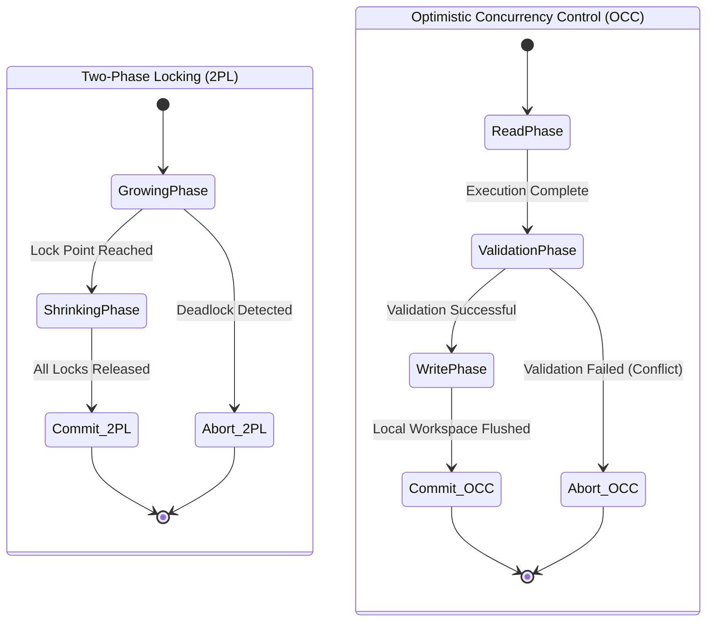

## Theoretical Foundations of Transactional Concurrency Control

Concurrency control within database management systems ensures the serializability of transactions executing simultaneously across multiple threads or processing units. Serializability, defined formally, dictates that the outcome of a concurrent execution of a set of transactions must be strictly equivalent to some sequential execution of those same transactions. To enforce this critical invariant, systems employ sophisticated algorithms broadly categorized into pessimistic and optimistic approaches. Two-Phase Locking (2PL) represents the canonical pessimistic strategy, predicated on the fundamental assumption that transaction conflicts are frequent and must be prevented a priori through explicit synchronization mechanisms. In stark contrast, Optimistic Concurrency Control (OCC) assumes that conflicts are exceedingly rare, allowing transactions to proceed unhindered during their operational phases and deferring conflict resolution to a posterior validation phase. The mathematical underpinning of serializability relies on the concept of a conflict graph $G = (V, E)$, where vertices $V$ represent committed transactions and directed edges $E$ represent conflicting operations (read-write, write-read, or write-write) between them. A schedule is conflict-serializable if and only if its corresponding conflict graph is strictly acyclic. Two-Phase Locking guarantees the acyclicity of this graph by enforcing a rigid protocol governing the acquisition and release of locks. The protocol is divided into a growing phase, during which a transaction may obtain locks but cannot release any, and a shrinking phase, during which a transaction may release locks but cannot acquire any new ones. Let $T_i$ be a transaction. If $T_i$ requests a shared lock $S(x)$ or an exclusive lock $X(x)$ on a data item $x$, the lock manager grants it only if no other transaction holds an incompatible lock on $x$. The compatibility matrix dictates that multiple shared locks can coexist, but an exclusive lock is strictly mutually exclusive with any other lock type. The mathematical formulation of the locking theorem guarantees that any schedule produced by a system adhering to the Two-Phase Locking protocol will inherently produce an acyclic conflict graph, thereby ensuring strict conflict serializability. However, the basic Two-Phase Locking protocol is highly susceptible to cascading aborts and deadlocks. Cascading aborts occur when a transaction $T_j$ reads data written by an uncommitted transaction $T_i$, and $T_i$ subsequently aborts, forcing $T_j$ to also abort, potentially triggering a catastrophic domino effect across the system. To mitigate this, Strict Two-Phase Locking (S2PL) requires that all exclusive locks be held until the transaction fully commits or aborts, while Rigorous Two-Phase Locking (SS2PL) mandates that both shared and exclusive locks be held until termination. Deadlocks, conversely, represent circular dependencies in the lock wait-for graph, necessitating sophisticated detection algorithms utilizing cycle-finding heuristics such as Tarjan's strongly connected components algorithm or Kosaraju's algorithm, which execute in $\mathcal{O}(V+E)$ time. Alternatively, systems employ prevention mechanisms utilizing distributed timestamps for wait-die or wound-wait schemes, imposing a strict partial ordering on lock acquisitions. Optimistic Concurrency Control fundamentally diverges from this paradigm by entirely eliminating the locking overhead during the execution phase. An Optimistic Concurrency Control transaction $T_i$ is partitioned into three distinct phases: the read phase, the validation phase, and the write phase. During the read phase, $T_i$ executes all its operations on a purely local copy of the database, maintaining a read set $RS(T_i)$ and a write set $WS(T_i)$ that record the precise memory addresses and values accessed. This local execution ensures that other concurrent transactions observe no intermediate states, thus maintaining perfect isolation until validation. The mathematical formalization of the validation phase requires ensuring that for any two transactions $T_i$ and $T_j$ where $T_i$ is assigned a timestamp earlier than $T_j$, denoted as $ts(T_i) < ts(T_j)$, one of three conditions must strictly hold to guarantee serializability. First, $T_i$ completes its write phase entirely before $T_j$ begins its read phase. Second, the write set of $T_i$ has absolutely no intersection with the read set of $T_j$, defined as $WS(T_i) \cap RS(T_j) = \emptyset$, and $T_i$ completes its write phase before $T_j$ initiates its write phase. Third, the write set of $T_i$ does not intersect with either the read set or the write set of $T_j$, formally $WS(T_i) \cap RS(T_j) = \emptyset$ and $WS(T_i) \cap WS(T_j) = \emptyset$, and $T_i$ completes its read phase before $T_j$ completes its read phase. If none of these stringent validation criteria are satisfied, the validating transaction $T_j$ must be unceremoniously aborted and its local workspace discarded, a process that relies heavily on rapid garbage collection and memory reclamation techniques within the operating system kernel. The probability of validation failure $P_{abort}$ in Optimistic Concurrency Control is a complex non-linear function of the transaction arrival rate $\lambda$, the average transaction read set size $R$, the average write set size $W$, and the total database size $D$. Assuming uniform access distribution, the probability of conflict can be approximated using the binomial expansion of independent access probabilities, rendering Optimistic Concurrency Control highly efficient only when $\frac{\lambda \times (R \times W)}{D} \ll 1$. When the system operates under conditions of high data contention, this probability approaches unity exponentially, resulting in catastrophic thrashing where the computational effort expended during the read phases is entirely squandered by incessant validation failures. Under such hostile conditions, the system throughput rapidly degrades toward zero, necessitating dynamic fallback mechanisms to pessimistic locking or highly adaptive admission control algorithms utilizing advanced queuing theory. Furthermore, the generation of monotonic timestamps required for assigning serialization orders in OCC frequently utilizes logical Lamport clocks or hardware-assisted time-stamp counters (TSC), introducing synchronization bottlenecks in distributed shared-memory architectures where clock skew and network latency disrupt the strict ordering prerequisites.



## Micro-Architectural Implications and Hardware-Level Synchronization

The divergent theoretical foundations of Two-Phase Locking and Optimistic Concurrency Control manifest in profoundly different micro-architectural signatures when implemented on modern multi-core processors operating across non-uniform memory access (NUMA) domains. The fundamental constraint governing all concurrent database architectures is the CPU cache coherence protocol, typically a variant of the MOESI (Modified, Owned, Exclusive, Shared, Invalid) model communicating over highly congested QPI (QuickPath Interconnect) or UPI (UltraPath Interconnect) links. Two-Phase Locking requires the explicit acquisition of locks before any data modification can commence. A lock manager is essentially a highly contentious shared data structure, often implemented as a gigantic hash table of mutexes, semaphores, or low-level spinlocks. When multiple threads executing transactions attempt to acquire locks on disparate data items that happen to map to the same lock table bucket, or worse, reside on the identical physical CPU cache line, they encounter the devastating micro-architectural phenomenon known as false sharing. The hardware cache coherence protocol must forcibly invalidate the entire cache line across all processor cores whenever any thread mutates a lock state within that line, regardless of whether the threads are contending for the exact same logical lock. This pathological cache line bouncing induces exorbitant memory bus traffic, saturates interconnect bandwidth, and stalls the execution pipelines of the affected processors as they synchronously wait for main memory fetches. To mitigate this disastrous effect, advanced lock manager implementations aggressively utilize padded atomic variables, employing compiler directives such as `alignas(64)` or `alignas(128)`, and NUMA-aware physical memory allocation strategies to ensure that contiguous lock structures are aligned strictly to cache line boundaries. The physical acquisition of a lock ultimately necessitates atomic read-modify-write CPU instructions, such as `LOCK CMPXCHG` or `LOCK XADD` on the x86_64 architecture, or `LDREX`/`STREX` pairs on ARM processors. These atomic instructions are exceptionally expensive because they actively bypass the processor's standard store buffers and act as full bidirectional memory barriers. They serialize instruction execution, actively drain load/store queues, and prevent the processor's sophisticated out-of-order execution engine from deeply pipelining subsequent memory accesses. A single transaction in a Two-Phase Locking system might execute thousands of these atomic operations, imposing a massive fixed latency overhead purely for synchronization, regardless of the actual underlying data contention. Furthermore, maintaining the global wait-for graph for continuous deadlock detection requires periodic transversals of complex pointer-based data structures, inevitably resulting in extremely high L1/L2 cache miss rates and translation lookaside buffer (TLB) thrashing due to the intrinsically poor spatial locality of linked graphs. In stark contrast, Optimistic Concurrency Control fundamentally circumvents atomic operations during its critical read phase. Transactions construct their read and write sets in tightly packed thread-local storage (TLS), entirely avoiding mutations to any global shared state. Consequently, the CPU cache operates at maximum theoretical efficiency, with transaction data residing comfortably within core-local L1 and L2 caches, completely shielded from external coherence invalidations. The architectural friction in Optimistic Concurrency Control is instead entirely localized to the validation and write phases. During validation, the transaction must publish its write set and rigorously verify its read set against the write sets of all concurrent transactions that committed during its execution window. This validation phase unequivocally requires entering a critical section, often protected by a singular global sequence lock (seqlock) or a highly optimized distributed timestamp allocation mechanism. The global seqlock represents a monumental hardware serialization point; if the validation phase is not executed with absolute minimal instruction count latency, this global lock becomes the ultimate Amdahl's bottleneck, artificially limiting the maximum achievable transactional throughput irrespective of the number of available physical CPU cores.

$$
T_{throughput\_2PL} = \frac{N_{cores}}{T_{exec} + N_{locks} \times \left(T_{atomic} + P_{contention} \times T_{wait}\right) + T_{deadlock\_detection}}
$$

$$
T_{throughput\_OCC} = \frac{N_{cores} \times (1 - P_{abort})}{T_{read\_phase} + T_{validation\_phase} + T_{write\_phase} + P_{abort} \times T_{retry\_penalty}}
$$

The write phase of Optimistic Concurrency Control introduces profound memory management complexities at the operating system and virtual memory kernel level. Because transactions speculatively modify local copies of data, a massive volume of transient memory objects must be allocated, tracked, and subsequently garbage-collected with extreme rapidity. Modern OCC implementations often leverage sophisticated Epoch-Based memory Reclamation (EBR), hazard pointers, or Read-Copy-Update (RCU) mechanisms to guarantee that obsolete memory versions are not prematurely reclaimed while slower concurrent transactions are still actively reading them. The OS memory allocator, such as jemalloc or tcmalloc, becomes a highly critical path component, as the relentless rate of allocation and deallocation in a high-throughput Optimistic Concurrency Control system can easily saturate the kernel's virtual memory subsystem, precipitating catastrophic lock contention within the page table management structures and triggering spontaneous TLB shootdowns across cores. When an Optimistic Concurrency Control validation succeeds, the localized write set must be durably installed into the global database state. This installation phase necessitates a careful orchestration of release-acquire memory barriers to guarantee that all memory updates become visible to subsequent transactions atomically according to the Total Store Order (TSO) or relaxed memory models inherent to the underlying silicon architecture. If the write set is excessively large, blindly copying the data from the thread-local workspace to the globally visible structures will heavily pollute the CPU cache hierarchy, selfishly evicting the hot data of other concurrently executing threads. Conversely, when validation ultimately fails, the transaction must be entirely rolled back. The physical rollback mechanism in pure Optimistic Concurrency Control is computationally trivial, as the local workspace pointer is simply discarded or recycled. However, the relentlessly squandered CPU cycles, branch prediction bandwidth, and memory bus utilization consumed during the aborted speculative read phase represent a pure, unrecoverable loss of systemic processing capacity. Advanced hardware transactional memory (HTM) extensions, such as Intel TSX (Transactional Synchronization Extensions), boldly attempt to push the Optimistic Concurrency Control paradigm directly into the silicon logic gates. HTM leverages the L1 cache as a highly volatile speculative buffer, automatically tracking read and write sets dynamically via augmented cache line metadata bits. If a conflicting memory access is detected asynchronously by the MESI protocol snooping mechanism on the memory bus, the processor hardware instantly aborts the transaction, silently discarding the speculative state in a mere fraction of a clock cycle. While HTM dramatically circumvents the exorbitant software overhead of programmatic Optimistic Concurrency Control validation, it remains fundamentally shackled by the physical capacity constraints of the L1 cache and its associativity limits; transactions whose read or write sets exceed these physical hardware boundaries inevitably suffer from repeated capacity aborts, stubbornly necessitating a pessimistic software fallback mechanism that ironically mimics the very Two-Phase Locking protocols the hardware sought to eliminate. Thus, the unforgiving micro-architectural reality dictates that no single concurrency control mechanism is universally optimal, as the intricate interplay between algorithmic software overhead, memory subsystem capacity, and silicon cache coherence dynamics heavily dictates the actual observed performance limits.

```rust
// Advanced Implementation of OCC Validation Logic employing Atomic Operations
use std::sync::atomic::{AtomicU64, Ordering};
use std::collections::HashSet;

pub struct Transaction {
    pub start_timestamp: u64,
    pub read_set: HashSet<usize>,
    pub write_set: HashSet<usize>,
    pub local_workspace: std::collections::HashMap<usize, Vec<u8>>,
}

pub struct OCCManager {
    global_timestamp: AtomicU64,
    committed_transactions: std::sync::RwLock<Vec<Transaction>>,
}

impl OCCManager {
    pub fn begin_transaction(&self) -> Transaction {
        Transaction {
            // Acquire semantics ensure visibility of prior commits
            start_timestamp: self.global_timestamp.load(Ordering::Acquire),
            read_set: HashSet::new(),
            write_set: HashSet::new(),
            local_workspace: std::collections::HashMap::new(),
        }
    }

    pub fn validate_and_commit(&self, mut txn: Transaction) -> Result<(), &'static str> {
        // Fetch and increment creates a strict serial ordering point
        let commit_timestamp = self.global_timestamp.fetch_add(1, Ordering::SeqCst);
        let history = self.committed_transactions.read().unwrap();
        
        // Critical Validation Phase: Check for overlapping read/write sets
        for past_txn in history.iter() {
            if past_txn.start_timestamp > txn.start_timestamp {
                // If a past transaction modified any memory address we read, serializability is violated
                if !txn.read_set.is_disjoint(&past_txn.write_set) {
                    return Err("Validation Failed: Detected Read-Write Conflict during Validation Window");
                }
            }
        }
        
        drop(history);
        
        // Write Phase: Install thread-local workspace into global memory state
        let mut history_write = self.committed_transactions.write().unwrap();
        // (Implementation of global state pointer updates and memory barriers omitted for brevity)
        history_write.push(txn);
        Ok(())
    }
}
```

## Algorithmic Implementation and Asymptotic Behaviors

The profound algorithmic dichotomy between Two-Phase Locking and Optimistic Concurrency Control directly influences the asymptotic complexity and behavioral characteristics of transaction processing under wildly varying environmental parameters. A rigorous, objective mathematical analysis requires systematically evaluating the temporal and spatial complexities associated with explicit lock management versus multi-version workspace management and conflict validation. In a standard, industry-grade Two-Phase Locking implementation, the global lock manager typically utilizes a highly concurrent hash table where the key is generated via a cryptographic hash (such as MurmurHash3 or CityHash) of the data item's physical or logical address, and the mapped value is a pointer to an intricate lock request queue. When a transaction requests a lock, the system hashes the identifier in expected $\mathcal{O}(1)$ time, but must actively traverse the hash bucket's collision chain and subsequently iterate linearly through the lock request queue to determine operational compatibility. In the presence of heavy contention and highly skewed access patterns, the lock queue length $L$ can grow substantially, severely degrading the lock acquisition complexity to an unacceptable $\mathcal{O}(L)$. Furthermore, actively resolving deadlocks via programmatic cycle detection in a directed wait-for graph containing $V$ active transactions and $E$ blocking dependencies demands a heavy $\mathcal{O}(V + E)$ time complexity. Because cycle detection algorithms must run periodically via a background daemon thread or trigger aggressively upon a predefined timeout, they invariably introduce severe, non-deterministic latency spikes into the system's tail latency profile (p99). To strictly avoid deadlocks without graph traversals, wound-wait or wait-die schemes utilize distributed timestamps, rigidly dictating that an older transaction may forcefully preempt a younger transaction, or conversely, a younger transaction must proactively terminate and wait for an older one. While these timestamp-based heuristic mechanisms successfully reduce the asymptotic complexity of deadlock resolution to $\mathcal{O}(1)$ per lock conflict, they artificially and prematurely induce transaction aborts even when no actual cyclic dependency exists in the mathematical graph, effectively penalizing maximum throughput to maintain lower algorithmic latency. Optimistic Concurrency Control completely bypasses these lock management complexities but unavoidably substitutes them with the asymptotic computational cost of read/write set validation. Let $R_{size}$ and $W_{size}$ represent the total cardinality of the read and write sets, respectively. The crucial validation phase explicitly requires mathematically comparing the validating transaction's read set against the write sets of all $K$ transactions that successfully committed since the genesis of the validating transaction. A naive, purely sequential implementation utilizing simple list intersections yields an abhorrent validation complexity of $\mathcal{O}(K \times R_{size} \times W_{size})$, which is computationally disastrous for long-running analytics transactions where $K$ becomes exceedingly large. High-performance Optimistic Concurrency Control implementations therefore must leverage highly optimized bloom filters, skip lists, or concurrent lock-free hash sets to drastically optimize this intersection test. By maintaining a global ring-buffer array of commit timestamps and utilizing vector clocks or strict epoch-based validation thresholds, the system can quickly exclude temporally disjoint transactions in $\mathcal{O}(1)$ time, reducing the actual computational intersection validation strictly to potentially conflicting temporal windows. However, constructing, maintaining, and garbage-collecting these advanced probabilistic data structures intrinsically consumes significant auxiliary RAM bandwidth and processor cycles.

$$
C_{validation} = \sum_{i=1}^{K} \left( \mathcal{O}(1)_{bloom\_filter\_check} + \mathbb{I}_{positive} \cdot \mathcal{O}(R_{size} \log W_{size, i}) \right)
$$

The mathematical probability of the indicator function $\mathbb{I}_{positive}$ evaluating to true depends intrinsically on the skewness of the data access distribution, which is practically modeled using a Zipfian distribution governed by an alpha parameter $\alpha$. In a highly skewed Zipfian workload ($\alpha > 0.9$) where a minuscule fraction of data items receives the overwhelming majority of read and write accesses, Optimistic Concurrency Control validation failures scale non-linearly with the transaction arrival rate. The repeated aborts and mandatory retries inadvertently construct a devastating positive feedback loop: an aborted transaction immediately restarts via an exponential backoff algorithm, contributing to a massively higher instantaneous arrival rate, which subsequently further exacerbates the probability of subsequent validation failures. This pathological state, mathematically categorized as the optimistic thrashing threshold, occurs precisely when the induced retry rate violently surpasses the system's global commit rate. At this exact algorithmic asymptote, the effective throughput of the database system violently collapses to zero, despite the hardware CPU cores exhibiting 100% utilization while furiously spinning on doomed validation loops. Two-Phase Locking, conversely, handles extreme Zipfian skew with significantly more algorithmic grace. While extreme contention on hot data items inevitably causes transactions to violently block on mutexes, the explicit locking mechanism acts as an inherent, self-regulating throttling mechanism. The operating system thread scheduler forcefully puts blocked threads to sleep, conserving highly valuable CPU resources and explicitly preventing the catastrophic positive feedback loop characteristic of purely Optimistic Concurrency Control. The throughput of Two-Phase Locking under severe skew plateau stabilizes at a level directly dictated by the serialized execution time of the conflicting transactions, but crucially, it does not collapse into thrashing. Modern, advanced database engines therefore almost never implement pure Two-Phase Locking or pure Optimistic Concurrency Control in isolation. Instead, they deploy monumentally complex hybrid protocols, such as Multi-Version Concurrency Control (MVCC) aggressively coupled with strict Two-Phase Locking for all write operations and optimistic snapshot isolation validation for read-only transactions, or dynamically adaptive systems that utilize sophisticated machine learning heuristics to seamlessly switch a transaction's concurrency control mechanism dynamically based on real-time contention metrics, queue depths, and historical access patterns. Such hybrid architectures demand astronomical engineering complexity, as the state machines governing complex lock transitions, timestamp allocations, and asynchronous multi-version garbage collection must interoperate flawlessly at the silicon level, ensuring that the strict mathematical guarantees of absolute conflict serializability are never violated across the highly volatile protocol boundaries.

```cpp
// Advanced C++ Lock Manager Pseudocode for 2PL with Deadlock Prevention
#include <iostream>
#include <unordered_map>
#include <mutex>
#include <vector>
#include <thread>
#include <shared_mutex>
#include <condition_variable>

enum class LockMode { SHARED, EXCLUSIVE };

struct LockRequest {
    uint64_t transaction_id;
    LockMode mode;
    bool granted;
};

class LockManager {
private:
    // Padded to prevent catastrophic false sharing across CPU cache lines
    struct alignas(64) LockState {
        std::vector<LockRequest> wait_queue;
        int shared_count = 0;
        bool exclusive_held = false;
        std::mutex bucket_mutex;
        std::condition_variable cv;
    };

    std::unordered_map<uint64_t, LockState*> lock_table;
    std::shared_mutex table_mutex; // Protects the hash map metadata

public:
    bool acquire_lock(uint64_t txn_id, uint64_t data_id, LockMode mode) {
        // Shared lock on global table to find or lazily create bucket
        table_mutex.lock_shared();
        auto it = lock_table.find(data_id);
        LockState* state = nullptr;
        if (it != lock_table.end()) {
            state = it->second;
            table_mutex.unlock_shared();
        } else {
            table_mutex.unlock_shared();
            table_mutex.lock(); // Upgrade to exclusive to insert memory pointer
            if (lock_table.find(data_id) == lock_table.end()) {
                state = new LockState();
                lock_table[data_id] = state;
            } else {
                state = lock_table[data_id];
            }
            table_mutex.unlock();
        }

        // Acquire bucket-level mutex forcing CPU memory barrier
        std::unique_lock<std::mutex> lock(state->bucket_mutex);
        
        if (mode == LockMode::SHARED && !state->exclusive_held) {
            state->shared_count++;
            state->wait_queue.push_back({txn_id, mode, true});
            return true;
        } else if (mode == LockMode::EXCLUSIVE && state->shared_count == 0 && !state->exclusive_held) {
            state->exclusive_held = true;
            state->wait_queue.push_back({txn_id, mode, true});
            return true;
        } else {
            // Lock conflict detected, append transaction to wait queue
            state->wait_queue.push_back({txn_id, mode, false});
            // Thread yield: blocks utilizing kernel condition variable, conserving CPU
            state->cv.wait(lock, [&]{ return check_grant_condition(state, txn_id, mode); });
            return true; 
        }
    }
    
private:
    bool check_grant_condition(LockState* state, uint64_t txn_id, LockMode mode) {
        // Internal state validation logic (simplified for brevity)
        return false; 
    }
};
```

## SEO Configuration

* **Title**: Massive Technical Deep-Dive: Two-Phase Locking (2PL) vs. Optimistic Concurrency Control (OCC)
* **Meta Description**: An elite technical whitepaper dissecting Two-Phase Locking and Optimistic Concurrency Control. Explore micro-architectural impacts, cache coherence, algorithms, and extreme workload analysis.
* **Keywords**: Two-Phase Locking, Optimistic Concurrency Control, 2PL vs OCC, database transaction isolation, serializability, CPU cache coherence, hardware transactional memory, deadlock detection, multi-version concurrency control, C++ lock manager, Rust OCC validation, database architecture.
* **Canonical URL**: `https://yourdomain.com/blogs/part-2/13-2pl-vs-occ`
* **Target Audience**: Staff Engineers, Database Architects, Systems Programmers, and Advanced Computer Science Researchers.
