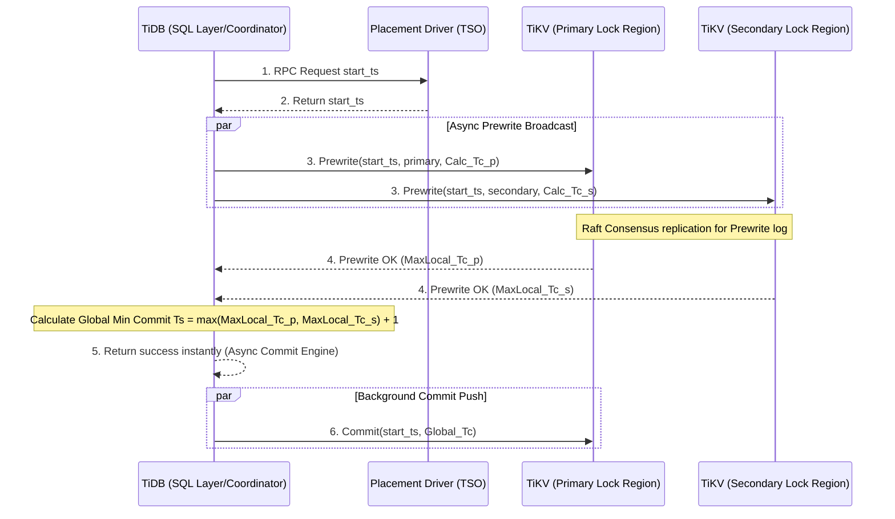

# The Percolator Model: How Google Spanner and TiDB Handle Distributed Transactions

## Introduction

Google published the Percolator model in 2010, and it quietly reshaped how distributed databases handle transactions. The problem it tackled looked nearly unsolvable at the time: how do you get full ACID guarantees on top of Bigtable, a massive NoSQL store that was never designed with transactions in mind?

This article walks through how Percolator actually works under the hood, and why it still matters. We'll look at how it combines Multi-Version Concurrency Control (MVCC) with a stateless variant of Two-Phase Commit (2PC), why it stores each logical value across three physical columns ($A_{data}$, $A_{lock}$, $A_{write}$) to play nicely with LSM-Tree storage, and where the design starts to strain under network latency — specifically the Timestamp Oracle (TSO) bottleneck that TiDB attacks with Async Commit. We'll also cover Spanner's more radical answer to the same problem: TrueTime, which uses atomic clocks and GPS to put a hard bound on clock uncertainty. Together these systems form a fairly complete picture of how distributed transactions in Spanner and TiDB trace back to a single shared ancestor.

## The Core Problem

In cloud and microservices architectures, data gets hashed and sharded across thousands of independent servers, often spread across data centers in different regions. Keeping things consistent when a transaction touches multiple records at once is genuinely hard.

- Traditional RDBMSs rely on a centralized lock manager. Move that into a distributed setting and it becomes a single point of failure, and network latency turns lock contention into a real performance problem.
- Classic 2PC, as implemented in the X/Open XA architecture, requires a coordinator to persist transaction state to disk. If that coordinator crashes mid-transaction, every participant is left holding resources it can't release — the blocking problem.

What Google needed was a distributed mechanism with no single bottleneck, one where read-only transactions could run fast without ever waiting on writers. That's the gap Percolator was built to fill.

## Deep Technical Analysis

### Theoretical Foundations: MVCC and Time Coordinates

Percolator's theoretical basis rests on combining MVCC with a distributed variant of 2PC built on Optimistic Concurrency Control (OCC).

Each version of a piece of data isn't just a static value — it's a coordinate in a two-dimensional space defined by time. When transaction $T_i$ starts, it's assigned a start timestamp $T_{s,i}$. That timestamp acts like a filter: $T_i$ can only see data written by some committed transaction $T_j$ whose commit timestamp satisfies $T_{c,j} < T_{s,i}$. This gives you Snapshot Isolation (SI), which eliminates dirty reads and phantom reads outright, leaving only a small residual risk of write skew.

### Micro-Level Data Structure: The Three-Column Layout

To make this concrete, Percolator introduces a specific data layout inside Bigtable's LSM-Tree storage. Every logical attribute $A$ is implicitly split into three physical columns:

1. **Column $A_{data}$ (Payload):** Holds the raw value. When a transaction writes, the new value $V_{new}$ is pushed here immediately, keyed by $T_s$ — even before the transaction has committed.
2. **Column $A_{lock}$ (Semaphore):** Manages the distributed locking. A writing transaction sets a flag here; any concurrent transaction that sees the flag has to back off, per OCC, rather than deadlock.
3. **Column $A_{write}$ (Source of Truth):** This is the record of what actually happened. It's only written once the transaction commits, keyed by $T_c$, and its value is a pointer back to the corresponding $T_s$ entry in $A_{data}$.

This indirection is what makes the scheme work well on NVMe: the payload — which can be large — gets flushed to disk exactly once, and write amplification stays low.

### The Stateless-Coordinator 2PC Mechanism and the Primary Lock

Percolator's coordinator — usually just a client library — holds no state of its own. The transaction's progress lives entirely in the data layer.

The workflow looks like this:
1. **Prewrite Phase:** The client figures out which keys ($K$) need to change and picks one at random to be the Primary Lock $k_p$. Everything else becomes a Secondary Lock. It broadcasts a Prewrite to every storage node involved; each node checks for conflicts (has a newer transaction already written here, or is the row already locked?). If it's clear, the node writes the new value into $A_{data}$ and a flag into $A_{lock}$ — secondary locks also carry a back-pointer to $k_p$.
2. **Commit Phase:** The client gets a commit timestamp $T_c$ and sends the Commit instruction only to the node holding $k_p$. If that lock is still intact, the node writes a pointer into $A_{write}$ at $T_c$ and clears the lock.
3. **Background Cleanup:** The instant $k_p$ commits, the whole transaction is considered committed — globally. Committing the remaining secondary locks happens asynchronously in the background; the client doesn't wait around for it.

### The TSO Problem and TiDB's Async Commit Solution

Every Percolator transaction needs the Timestamp Oracle (TSO) to hand out a timestamp. Under load, the TSO turns into exactly the kind of bottleneck this whole design was meant to avoid — it has to field a huge volume of RPCs, and even with batching, round-trip latency doesn't go away.

TiDB, PingCAP's open-source engine that descends directly from Percolator, rebuilt this layer. By leaning on Raft consensus, TiDB came up with Async Commit (and its 1PC variant). Instead of going back to the TSO, each TiKV node estimates its own expected commit timestamp from its local clock. The coordinator collects these and takes the max as the global $T_c$. The second commit round-trip disappears entirely — it runs in the background — cutting RTT from two round-trips down to one, roughly halving the control-plane network cost.

### Google Spanner's Answer: The TrueTime API

Spanner takes a different route: instead of routing everything through a logical timestamp service, it attacks the problem at the level of physical time itself. Google equips its data centers with GPS receivers and rubidium atomic clocks, and exposes the result as the TrueTime API.

Calling $TT.now()$ doesn't return a single instant — it returns an uncertainty window $[t_{earliest}, t_{latest}]$. Google engineers that window, $\epsilon$, to stay under about 7 milliseconds.

Spanner uses this in its Commit Wait rule. During the final phase of 2PC, it sets $T_c = t_{latest}$, but the coordinator can't report success right away — it has to wait until $TT.now().earliest > T_c$ before it does. That short wait, bounded by $\epsilon$, is what rules out causal reordering across the whole system and gives Spanner strict, externally consistent global transactions — without needing a centralized TSO and its associated round trips.

## Lessons Learned & Best Practices

1. **2PC doesn't have to be slow or blocking.** By making the coordinator stateless — writing metadata directly into the data — and anchoring everything on a single Primary Lock, Percolator sidesteps the classic SPOF problem in traditional 2PC. It's worth studying this design if you're building anything with distributed writes.
2. **LSM-Tree matters here, not incidentally.** Percolator's three-column layout would be brutal on a B+Tree-backed store — it generates a huge number of random accesses. On an LSM-Tree, those same operations become sequential writes. The optimization only works because it's paired with the right underlying data structure.
3. **Watch your fsync calls.** `fsync()` is expensive, and calling it per-operation kills throughput. Systems like TiKV batch commits with `io_uring` and Direct I/O so the cost of flushing goes from scaling with the number of operations to roughly constant.
4. **Sometimes the fix is hardware, not software.** Once the TSO hits its practical ceiling, there's no clever algorithm left to squeeze more out of it — Google's answer was to deploy atomic clocks. That's an unusual move, but it's what let Spanner sidestep the bottleneck entirely rather than optimize around it.

## Conclusion

The path from Google's original Percolator prototype — 2PC layered on OCC — through TiKV/TiDB's Raft-based Async Commit, to Spanner's TrueTime API, tells a coherent story about how distributed transactions evolved once engineers stopped treating time as something you could take for granted. It combines ideas from serialization theory, asynchronous I/O design, clock physics, and LSM-Tree storage engineering. None of these systems eliminate every tradeoff, but together they show how far you can push consistency guarantees in a genuinely distributed setting — and that groundwork still underpins how modern cloud databases are built today.
