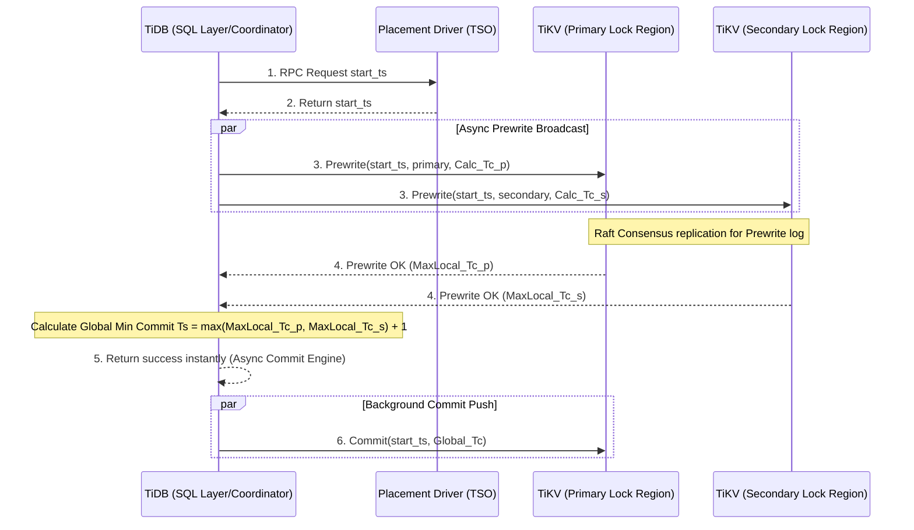

# 14: Percolator モデル：Google Spanner と TiDB が Distributed Transactions を処理する方法

## エグゼクティブサマリー (Executive Summary)

分散データベースがトランザクションをどう処理するか、その考え方を大きく変えたアーキテクチャの一つが**Percolatorモデル**だ。2010年にGoogleが発表したPercolatorは、Bigtableという巨大なNoSQLストレージの上で、完全なACIDトランザクションを実現するという、当時ほぼ不可能とされていた課題に答えを出した。

**この記事で押さえられること:**
- Percolatorが多版同時実行制御(MVCC)とステートレスな2フェーズコミット(2PC)をどう組み合わせて動いているか。
- NVMeのI/Oを意識してLSM-Tree構造の上に直接データを載せる、独特な3カラム設計($A_{data}$、$A_{lock}$、$A_{write}$)。
- Timestamp Oracle(TSO)がなぜボトルネックになりやすいのか、そしてTiDBがAsync Commitでそれをどう回避したのか。
- Google Spannerがルビジウム原子時計とGPSを使ったTrueTime APIによって、CAP定理の制約に対してどう向き合っているか。

## コアな問題点 (The Core Problem)

クラウドとマイクロサービスの世界では、データは地理的に離れた複数のデータセンターにまたがる、数千台規模の独立したサーバーへとハッシュ化・シャーディングされて分散配置される。複数レコードを同時に更新するトランザクションで一貫性を守ることは、この構成では決して簡単ではない。

- 従来型のRDBMSは中央集権的なロックマネージャーに頼る。分散環境にそのまま持ち込むと単一障害点になるうえ、ネットワーク遅延がそのままパフォーマンスの足かせになる。
- X/Open XAに沿った古典的な2PCでは、コーディネーターがトランザクションの状態をディスクに保存する必要がある。コーディネーターが途中でクラッシュすると、参加している全サーバーのリソースが無期限にブロックされてしまう。

Googleが必要としていたのは、こうしたボトルネックがなく、書き込みトランザクションに邪魔されずに読み取り専用トランザクションを高速に処理できる、真に分散した仕組みだった。Percolatorモデルはそのために生まれた。

## 詳細な技術分析 (Deep Technical Analysis)

### 理論的基盤: MVCCと時間の座標

Percolatorの土台は、多版同時実行制御(MVCC)と、楽観的並行性制御(OCC)ベースの分散2PCを密接に組み合わせたところにある。

データの各バージョンは単なるスカラー値ではなく、二次元の時間空間上の座標点として扱われる。トランザクション$T_i$が始まると、システムは開始タイムスタンプ$T_{s,i}$を割り当てる。このタイムスタンプはいわば偏光レンズのように働き、$T_i$はコミット済みトランザクション$T_j$が作った$T_{c,j} < T_{s,i}$を満たすバージョンだけを見ることが許される。これによって**Snapshot Isolation(SI)**が保証され、ダーティリードとファントムリードは完全に排除される。残るリスクはライトスキューのみだ。

### データのミクロ構造: 3カラム手法 (Three-Column Layout)

この抽象的な仕組みを実装に落とし込むため、PercolatorはBigtable/LSM-Treeのストレージ層に独自のデータ分割方式を組み込んだ。論理的な属性$A$は、実際には3つの物理カラムへと分解される。

1. **$A_{data}$カラム(実データ):** 生の値が保存される場所。トランザクションが更新を行うと、まだコミットが完了していない段階でも、新しい値$V_{new}$がキー$T_s$のもとでここに書き込まれる。
2. **$A_{lock}$カラム(セマフォ):** 分散排他ロックを管理する。書き込み時にはこのカラムにフラグを立てる必要があり、それを見た並行トランザクションはデッドロックを避けるためOCCの原則に沿って自らバックオフする。
3. **$A_{write}$カラム(信頼できる記録):** トランザクションが正常にコミットされたときだけ更新される、いわば真実の記録。エントリのキーは$T_c$で、値は$A_{data}$カラム内の座標$T_s$を指すポインタになっている。

この間接ポインタを使う方式は、NVMeの帯域を無駄なく使い、write amplificationを抑える効果がある。大きなデータ本体はディスクに一度だけ書き込めば済む。

### ステートレス2PCの仕組み (Stateless Coordinator) とプライマリロック

Percolatorは「ステートレスコーディネーター」という発想を体現している。コーディネーター(通常はクライアントライブラリ)自体は状態を一切持たず、トランザクションの進行状況はすべてデータ層の中に直接刻み込まれる。

トランザクションの流れ:
1. **Prewrite Phase:** クライアントは変更対象のキー集合$K$を洗い出し、その中からランダムに一つをプライマリロック$k_p$として選ぶ。残りはすべてセカンダリロックになる。クライアントは全ストレージノードへPrewriteコマンドをブロードキャストし、各ノードは競合(将来のトランザクションによる上書きやロック保持の有無)をチェックする。問題なければ、新しい値が$A_{data}$に、フラグが$A_{lock}$に書き込まれる(セカンダリロックは$k_p$へのポインタを保持する)。
2. **Commit Phase:** クライアントはコミットタイムスタンプ$T_c$を取得し、**プライマリロック$k_p$を持つノードにだけ**Commitコマンドを送る。$k_p$のロックがまだ有効なら、そのノードは時刻$T_c$で$A_{write}$にポインタを書き込み、$A_{lock}$のフラグを消す。
3. **バックグラウンドでの非同期反映:** $k_p$がコミットされた瞬間、分散トランザクション全体が成功したとみなされる。残り数千に及ぶセカンダリロックへのコミット処理はバックグラウンドスレッドに任され、クライアントはそれを待つ必要がない。

### TSOの問題とTiDBのAsync Commitという答え

Percolatorのすべてのトランザクションは、Timestamp Oracle(TSO)から時刻の割り当てを受ける必要がある。TSOは数百万件のRPCをさばくことになるため、ネットワーク遅延がそのままボトルネックになりやすい。RPCをバッチ処理しても、往復にかかるRTTそのものは消えない。

Percolatorの流れを汲むオープンソースのTiDBは、この層を根本から作り直した。Raftコンセンサスを深く組み込むことで、**Async Commit / 1PC**という構造を生み出したのだ。

TiDBはTSOに毎回問い合わせる代わりに、各ストレージノード(TiKV)が自分のローカルクロックから予想コミット時刻を自己計算するよう求める。コーディネーターはそれらの値を集約し、グローバルな最大値$T_c$を決定する。これによって2フェーズ目のコミットは事実上省略され、バックグラウンドで処理されるようになった。RTTのサイクルは2回から1回に減り、ネットワーク帯域の消費も約半分になる。

### Google Spannerの物理的な挑戦: TrueTime API

Google Spannerはさらに踏み込み、時間そのものの扱い方に手を入れた。壊れやすいTSOに頼る代わりに、Googleはデータセンターに GPS受信機とルビジウム原子時計を配備し、**TrueTime API**という仕組みを作り上げた。

$TT.now()$関数は、単一の時刻ではなく不確実性区間$[t_{earliest}, t_{latest}]$を返す。この区間の幅$\epsilon$は常に7ミリ秒未満に収まるよう設計されている。

Spannerはこれを**Commit Wait Rule**という形で使う。2PCの最終フェーズで、Spannerは$T_c = t_{latest}$を割り当てる。コーディネーターはすぐに成功を返さず、$TT.now().earliest > T_c$になるまであえて待機する。この数ミリ秒の待ち時間が因果関係の逆転リスクを完全に排除し、厳密なグローバル外部一貫性を実現する。TSOのRTTがボトルネックになるという問題そのものを、ハードウェアで解決してしまったわけだ。

## 教訓と実践 (Lessons Learned)

1. **2PCへの見方を改める。** 2PCは本質的に遅くて詰まりやすいものだと思われがちだが、必ずしもそうではない。「ステートレスコーディネーター」(メタデータをデータ本体に直接刻み込む発想)と「プライマリロック」というアンカーの組み合わせによって、Percolatorは従来の2PCが抱えていた単一障害点の問題をきれいに解決した。マイクロサービスを設計するアーキテクトなら、この発想から学べることは多い。
2. **LSM-Treeの威力を軽視しない。** Percolatorの3カラム構造をB+Treeで実装すると、大量のランダムアクセスが発生してディスクを疲弊させる。LSM-Treeを使うことで、これらの操作がすべてシーケンシャル書き込みに変換される。ソフトウェアの最適化は、下敷きになるデータ構造の特性と切り離せない。
3. **`fsync()`の呼び出し回数を意識する。** `fsync()`はパフォーマンスの大敵だ。TiKVのような優れたエンジンは、Group CommitやDirect I/O、`io_uring`を組み合わせて、ディスクフラッシュの回数を$\mathcal{O}(M)$から$\mathcal{O}(1)$に抑えている。個々の操作ごとに律儀に`fsync`を呼ぶような設計は避けたい。
4. **ソフトウェアが限界に達したら、ハードウェアに頼るという選択肢もある。** TSOのボトルネックのようにソフトウェア側の工夫が飽和したとき、残る解決策はハードウェアへの投資であることも多い。ルビジウム原子時計を配備するというGoogleの判断は、結果としてSpannerを世界トップクラスのデータベースへと押し上げた。

## 結論 (Conclusion)

2PCとOCCを組み合わせたGoogleのPercolatorから、RaftとAsync Commitでネットワークコストを削ったTiKV/TiDB、そしてTrueTime APIによって時間そのものを制御下に置いたSpannerへと至る道のりは、コンピュータサイエンスの一つの叙事詩と言っていい。直列化可能性のグラフ理論、非同期なLinuxカーネルの設計、不確実な時間を扱う工夫、そしてLSM-Treeというストレージ技術。これらを組み合わせることで、システム設計者たちは弱点の少ないデータストアを作り上げ、この先何十年ものクラウドコンピューティングの姿を形作ってきた。
