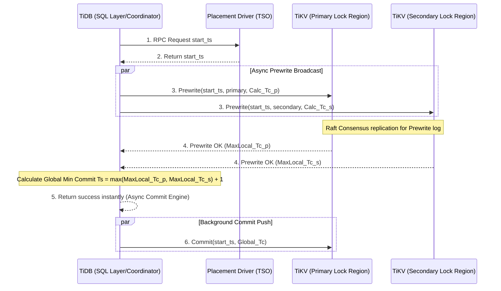

# Mô hình Percolator: Cách Google Spanner và TiDB xử lý Distributed Transactions

## Giới thiệu

Năm 2010, Google công bố mô hình Percolator, và nó âm thầm định hình lại cách các cơ sở dữ liệu phân tán xử lý giao dịch. Bài toán mà nó giải quyết khi đó gần như bất khả thi: làm sao có được đầy đủ tính chất ACID trên nền Bigtable — một kho lưu trữ NoSQL khổng lồ chưa bao giờ được thiết kế để hỗ trợ giao dịch.

Bài viết này đi vào cơ chế thực sự bên trong Percolator, và lý do nó vẫn còn quan trọng cho đến hôm nay. Ta sẽ xem cách nó kết hợp Điều khiển Đồng thời Đa Phiên bản (MVCC) với một biến thể phi trạng thái của Giao thức Xác nhận Hai Pha (2PC), vì sao mỗi giá trị logic lại được tách thành ba cột vật lý ($A_{data}$, $A_{lock}$, $A_{write}$) để tương thích với cấu trúc lưu trữ LSM-Tree, và điểm nào trong thiết kế bắt đầu chịu áp lực từ độ trễ mạng — cụ thể là điểm nghẽn ở Timestamp Oracle (TSO) mà TiDB giải quyết bằng Async Commit. Ta cũng sẽ nói về hướng đi khác, triệt để hơn, của Spanner: TrueTime, dùng đồng hồ nguyên tử và GPS để giới hạn chặt độ bất định của thời gian. Gộp lại, các hệ thống này cho ta một bức tranh khá trọn vẹn về việc distributed transactions trong Spanner và TiDB thực chất bắt nguồn từ cùng một tổ tiên.

## Vấn Đề Cốt Lõi

Trong kiến trúc điện toán đám mây và microservices, dữ liệu bị băm (hashed) và phân mảnh (sharded) qua hàng nghìn máy chủ độc lập, thường đặt tại nhiều trung tâm dữ liệu ở các khu vực khác nhau. Giữ tính nhất quán khi một giao dịch chạm vào nhiều bản ghi cùng lúc là bài toán không hề dễ.

- Các RDBMS truyền thống dựa vào một bộ quản lý khóa tập trung (Centralized Lock Manager). Đưa mô hình này vào môi trường phân tán, nó lập tức trở thành điểm lỗi đơn lẻ (SPOF), và độ trễ mạng biến việc tranh chấp khóa thành vấn đề hiệu năng thực sự.
- Giao thức 2PC cổ điển, như được cài đặt trong kiến trúc X/Open XA, đòi hỏi một Trình điều phối (Coordinator) phải lưu trạng thái giao dịch xuống đĩa. Nếu Coordinator này chết giữa chừng, mọi bên tham gia đều bị kẹt lại với tài nguyên không thể giải phóng — đây chính là Blocking Problem.

Điều Google cần là một cơ chế phân tán không có điểm nghẽn duy nhất, nơi các giao dịch chỉ đọc có thể chạy nhanh mà không phải chờ các giao dịch ghi. Đó chính là khoảng trống mà Percolator được sinh ra để lấp đầy.

## Phân Tích Kỹ Thuật Chuyên Sâu

### Nền Tảng Lý Thuyết: MVCC và Tọa Độ Thời Gian

Nền tảng lý thuyết của Percolator dựa trên việc kết hợp MVCC với một biến thể phân tán của 2PC được xây dựng trên Khóa Lạc quan (Optimistic Concurrency Control - OCC).

Mỗi phiên bản dữ liệu không đơn thuần là một giá trị tĩnh — nó là một tọa độ trong không gian hai chiều được định nghĩa bởi thời gian. Khi giao dịch $T_i$ bắt đầu, nó được gán một nhãn thời gian bắt đầu $T_{s,i}$. Nhãn thời gian này hoạt động như một bộ lọc: $T_i$ chỉ có thể thấy dữ liệu được ghi bởi giao dịch $T_j$ nào đó đã commit, với nhãn thời gian commit thỏa $T_{c,j} < T_{s,i}$. Điều này cho ta mức cô lập Snapshot Isolation (SI), triệt tiêu hoàn toàn Đọc Bẩn (Dirty Read) và Đọc Bóng Ma (Phantom Read), chỉ để lại một rủi ro nhỏ về Lệch Ghi (Write Skew).

### Cấu Trúc Vi Mô Dữ Liệu: Kỹ Thuật Ba Cột

Để hiện thực hóa điều này, Percolator đưa ra một cách bố trí dữ liệu cụ thể bên trong lớp lưu trữ LSM-Tree của Bigtable. Mỗi thuộc tính logic $A$ được tách ngầm thành ba cột vật lý:

1. **Cột $A_{data}$ (Payload):** Chứa giá trị thô. Khi giao dịch ghi, giá trị mới $V_{new}$ được đẩy vào đây ngay lập tức, với khóa là $T_s$ — kể cả khi giao dịch chưa commit.
2. **Cột $A_{lock}$ (Semaphore):** Quản lý cơ chế khóa phân tán. Giao dịch đang ghi sẽ đặt một cờ hiệu ở đây; bất kỳ giao dịch song song nào thấy cờ này đều phải lùi lại (backoff) theo nguyên lý OCC, thay vì rơi vào deadlock.
3. **Cột $A_{write}$ (Source of Truth):** Đây là bản ghi thể hiện điều thực sự đã xảy ra. Nó chỉ được ghi khi giao dịch commit thành công, với khóa là $T_c$, và giá trị là một con trỏ trỏ ngược về mục $T_s$ tương ứng trong $A_{data}$.

Cách gián tiếp này là lý do cơ chế hoạt động tốt trên NVMe: phần payload — vốn có thể rất lớn — chỉ cần xả xuống đĩa đúng một lần, và hiện tượng khuếch đại ghi (write amplification) được giữ ở mức thấp.

### Cơ Chế 2PC Phi Trạng Thái và Khóa Chính

Coordinator của Percolator — thường chỉ là một thư viện phía client — không lưu bất kỳ trạng thái nào của riêng nó. Toàn bộ tiến trình của giao dịch nằm gọn trong lớp dữ liệu.

Quy trình diễn ra như sau:
1. **Pha Tiền Ghi (Prewrite):** Client xác định tập khóa ($K$) cần thay đổi và chọn ngẫu nhiên một khóa làm Khóa Chính (Primary Lock) $k_p$. Mọi khóa còn lại trở thành Khóa Phụ (Secondary Lock). Client phát lệnh Prewrite đến mọi nút lưu trữ liên quan; mỗi nút kiểm tra xung đột (có giao dịch mới hơn đã ghi vào đây chưa, hay dòng dữ liệu đang bị khóa?). Nếu an toàn, nút đó ghi giá trị mới vào $A_{data}$ và một cờ vào $A_{lock}$ — các khóa phụ cũng mang theo một con trỏ ngược về $k_p$.
2. **Pha Xác Nhận (Commit):** Client lấy nhãn thời gian commit $T_c$ và chỉ gửi lệnh Commit đến nút đang giữ $k_p$. Nếu khóa đó vẫn còn nguyên vẹn, nút này ghi một con trỏ vào $A_{write}$ tại $T_c$ và xóa cờ khóa.
3. **Dọn Dẹp Nền (Background Async):** Ngay khi $k_p$ được commit, toàn bộ giao dịch được xem là đã commit thành công — trên phạm vi toàn cục. Việc commit các Khóa Phụ còn lại diễn ra bất đồng bộ ở nền; client không cần chờ đợi việc này.

### Vấn Đề TSO và Giải Pháp Async Commit Của TiDB

Mọi giao dịch Percolator đều cần Timestamp Oracle (TSO) cấp một nhãn thời gian. Dưới tải cao, TSO trở thành đúng loại điểm nghẽn mà toàn bộ thiết kế này vốn muốn tránh — nó phải xử lý một lượng RPC khổng lồ, và dù có gộp lô (batching), độ trễ round-trip vẫn không biến mất.

TiDB, cỗ máy mã nguồn mở của PingCAP kế thừa trực tiếp từ Percolator, đã tái cấu trúc lại toàn bộ tầng này. Bằng cách dựa vào Raft consensus, TiDB tạo ra Async Commit (cùng biến thể 1PC của nó). Thay vì hỏi lại TSO, mỗi nút TiKV tự ước lượng thời gian commit dự kiến của riêng nó dựa trên đồng hồ cục bộ. Coordinator gom các giá trị này lại và lấy giá trị lớn nhất làm $T_c$ toàn cục. Vòng commit thứ hai biến mất hoàn toàn — nó chạy ngầm ở nền — giúp giảm RTT từ hai vòng xuống còn một, tiết kiệm khoảng một nửa chi phí băng thông cho tầng điều khiển.

### Hướng Đi Của Google Spanner: TrueTime API

Spanner chọn một con đường khác: thay vì dồn mọi thứ qua một dịch vụ cấp nhãn thời gian logic, nó tấn công thẳng vào bài toán ở cấp độ thời gian vật lý. Google trang bị cho các trung tâm dữ liệu của mình các bộ thu GPS và đồng hồ nguyên tử rubidium, rồi phơi bày kết quả đó qua TrueTime API.

Gọi $TT.now()$ không trả về một thời điểm duy nhất — nó trả về một khoảng bất định $[t_{earliest}, t_{latest}]$. Google thiết kế để độ rộng của khoảng này, $\epsilon$, luôn dưới khoảng 7 mili-giây.

Spanner tận dụng điều này trong Quy Tắc Chờ Xác Nhận (Commit Wait). Ở pha cuối của 2PC, nó ấn định $T_c = t_{latest}$, nhưng coordinator không được báo thành công ngay — nó phải chờ đến khi $TT.now().earliest > T_c$ mới được phép làm vậy. Khoảng chờ ngắn ngủi này, bị chặn bởi $\epsilon$, chính là thứ loại trừ khả năng đảo lộn quan hệ nhân quả trên toàn hệ thống, và mang lại cho Spanner các giao dịch toàn cục nhất quán chặt chẽ — mà không cần một TSO tập trung cùng các vòng round-trip đi kèm.

## Bài Học Kinh Nghiệm & Thực Tiễn

1. **2PC không nhất thiết phải chậm hay bế tắc.** Bằng cách làm cho coordinator phi trạng thái — ghi metadata trực tiếp vào dữ liệu — và neo mọi thứ vào một Khóa Chính duy nhất, Percolator tránh được bài toán SPOF kinh điển của 2PC truyền thống. Đây là thiết kế đáng để nghiên cứu nếu bạn đang xây dựng bất cứ thứ gì có ghi dữ liệu phân tán.
2. **LSM-Tree ở đây không phải chi tiết phụ.** Cấu trúc ba cột của Percolator sẽ rất tệ nếu chạy trên một kho lưu trữ dùng B+Tree — nó tạo ra một lượng lớn truy cập ngẫu nhiên. Trên LSM-Tree, chính những thao tác đó lại trở thành ghi tuần tự (sequential writes). Tối ưu này chỉ hiệu quả vì nó đi cùng đúng cấu trúc dữ liệu nền tảng.
3. **Cẩn thận với số lần gọi fsync.** `fsync()` vốn đắt đỏ, và gọi nó cho từng thao tác riêng lẻ sẽ giết chết thông lượng. Các hệ thống như TiKV gộp lô commit (Group Commit) cùng `io_uring` và Direct I/O để chi phí xả đĩa chuyển từ tỉ lệ với số thao tác thành gần như hằng số.
4. **Đôi khi giải pháp nằm ở phần cứng, không phải phần mềm.** Khi TSO chạm trần thực tế của nó, không còn thuật toán khéo léo nào có thể vắt thêm hiệu năng — câu trả lời của Google là triển khai đồng hồ nguyên tử. Đây là một nước đi khác thường, nhưng chính nó giúp Spanner né hẳn điểm nghẽn thay vì chỉ tối ưu quanh nó.

## Kết Luận

Con đường từ nguyên mẫu Percolator ban đầu của Google — 2PC đặt trên nền OCC — qua Async Commit dựa trên Raft của TiKV/TiDB, đến TrueTime API của Spanner, kể một câu chuyện khá mạch lạc về cách distributed transactions tiến hóa một khi các kỹ sư ngừng xem thời gian là thứ hiển nhiên đáng tin cậy. Nó gộp chung các ý tưởng từ lý thuyết tuần tự hóa, thiết kế I/O bất đồng bộ, vật lý đồng hồ, và kỹ thuật lưu trữ LSM-Tree. Không hệ thống nào trong số này xóa bỏ hết mọi đánh đổi, nhưng gộp lại, chúng cho thấy ta có thể đẩy các cam kết về tính nhất quán đi xa đến đâu trong một môi trường thực sự phân tán — và nền tảng đó vẫn đang định hình cách các cơ sở dữ liệu đám mây hiện đại được xây dựng ngày nay.
