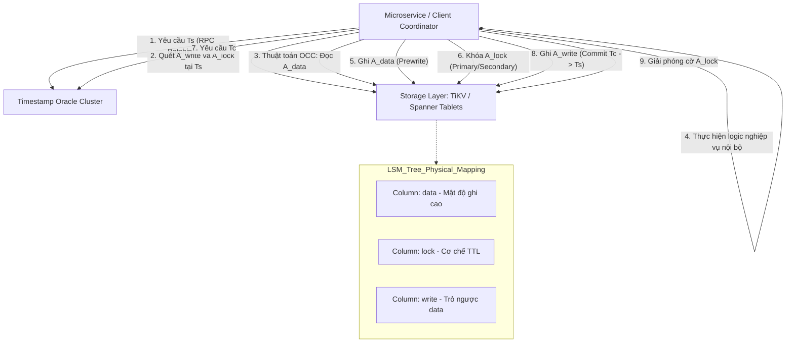
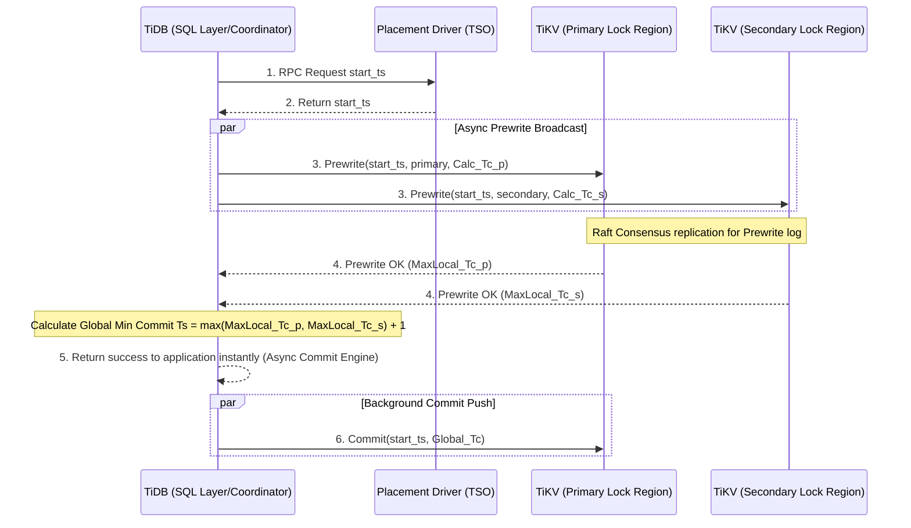

# 14: Mô hình Percolator: Cách Google Spanner và TiDB xử lý Distributed Transactions

## Kiến trúc vi mô và cơ sở toán học của mô hình Percolator trong xử lý giao dịch phân tán

Trong bối cảnh điện toán đám mây hiện đại và sự bùng nổ của kiến trúc hướng dịch vụ vi mô (microservices architecture), các hệ thống cơ sở dữ liệu phân tán (distributed databases) đã trở thành trụ cột hạ tầng không thể thiếu đối với các siêu ứng dụng toàn cầu. Nền tảng cốt lõi quyết định tính toàn vẹn của các hệ thống này chính là cơ chế xử lý giao dịch phân tán (distributed transactions). Khi dữ liệu bị băm (hashed) và phân mảnh (sharded) ngang qua hàng nghìn máy chủ vật lý độc lập đặt tại nhiều trung tâm dữ liệu phân tán về mặt địa lý, bài toán duy trì các thuộc tính ACID (Atomicity, Consistency, Isolation, Durability) truyền thống trở nên vô cùng phức tạp, bị chi phối chặt chẽ bởi các ràng buộc cứng của vật lý mạng và lý thuyết hệ thống, điển hình là định lý CAP (Consistency, Availability, Partition Tolerance) và định lý mở rộng PACELC. Vào năm 2010, Google đã công bố bài báo khoa học giới thiệu mô hình Percolator, một kiến trúc đột phá được thiết kế nguyên thủy để thay thế hệ thống MapReduce batch-processing trong việc xây dựng và cập nhật liên tục hệ thống chỉ mục tìm kiếm web toàn cầu. Mô hình Percolator đã thiết lập một hệ chuẩn mực mới bằng cách tách rời hoàn toàn tầng tính toán giao dịch (transaction coordination layer) khỏi tầng lưu trữ dữ liệu (storage layer) thông qua việc sử dụng cơ sở dữ liệu khóa-giá trị NoSQL Bigtable làm kho lưu trữ nền tảng. Khác biệt hoàn toàn so với các kiến trúc cơ sở dữ liệu quan hệ (RDBMS) tập trung, vốn phụ thuộc vào các khóa toàn cục (global locks) hoặc cấu trúc quản lý khóa trung tâm (centralized lock manager) dễ gây ra thắt cổ chai về hiệu suất và rủi ro điểm lỗi đơn lẻ (Single Point of Failure - SPOF), Percolator theo đuổi một phương pháp tiếp cận hoàn toàn phi tập trung và lạc quan. Cơ sở lý thuyết của Percolator xoay quanh sự kết hợp chặt vẽ giữa kỹ thuật Điều khiển Đồng thời Đa Phiên bản (Multi-Version Concurrency Control - MVCC) và biến thể phân tán của Giao thức Xác nhận Hai Pha (Two-Phase Commit - 2PC) dựa trên hệ thống Khóa Lạc quan (Optimistic Concurrency Control - OCC). Động lực cốt lõi của sự kết hợp này là khả năng cô lập các giao dịch đang diễn ra song song trên một không gian dữ liệu dùng chung cực lớn, đảm bảo rằng mọi giao dịch truy vấn (read-only transactions) sẽ không bao giờ bị chặn bởi các giao dịch cập nhật (write-transactions), đồng thời vẫn ngăn ngừa được các dị thường dữ liệu ngầm định.

Cấu trúc hình thức và cơ sở toán học của kỹ thuật Điều khiển Đồng thời Đa Phiên bản (MVCC) trong Percolator được xây dựng dựa trên lý thuyết đồ thị tuần tự hóa (serialization graphs) và các tiên đề về trật tự thời gian. Mỗi phiên bản của dữ liệu không chỉ là một giá trị vô hướng (scalar value) tĩnh mà là một điểm tọa độ trong không gian thời gian hai chiều. Khi một giao dịch phân tán $T_i$ bắt đầu vòng đời của nó, hệ thống sẽ gán cho nó một định danh duy nhất và đơn điệu tăng nghiêm ngặt (strictly monotonically increasing identifier) được gọi là nhãn thời gian bắt đầu (start timestamp), ký hiệu là $T_{s,i}$. Nhãn thời gian này đóng vai trò như một thấu kính phân cực, quyết định chính xác tập hợp các trạng thái dữ liệu (data snapshots) mà giao dịch $T_i$ có thẩm quyền quan sát. Đối với bất kỳ khóa dữ liệu $K$ nào, hàm đọc $Read(K, T_{s,i})$ sẽ quét dọc theo trục thời gian vật lý lưu trữ để tìm ra một phiên bản dữ liệu $V_K$ được tạo ra bởi một giao dịch lịch sử $T_j$ đã hoàn tất xác nhận (committed) với nhãn thời gian xác nhận $T_{c,j}$, thỏa mãn bất đẳng thức: $T_{c,j} < T_{s,i}$ và $T_{c,j} = \max(\{T_{c,k} \mid T_{c,k} < T_{s,i}\})$. Thuộc tính này đảm bảo hệ thống cung cấp một mức độ cô lập (isolation level) được gọi là Snapshot Isolation (SI), một tiêu chuẩn cô lập tiệm cận với khả năng Tuần tự hóa Nghiêm ngặt (Strict Serializability) nhưng mang lại thông lượng truy xuất cao hơn gấp nhiều lần. Trong môi trường Snapshot Isolation, các dị thường cô lập kinh điển theo tiêu chuẩn SQL ANSI/ISO như Đọc Bẩn (Dirty Read), Đọc Không Thể Lặp Lại (Non-repeatable Read) và Đọc Bóng Ma (Phantom Read) được triệt tiêu hoàn toàn về mặt toán học. Tuy nhiên, tính chất của Snapshot Isolation vẫn để ngỏ một khe hở cho hiện tượng Lệch Ghi (Write Skew). Hiện tượng Write Skew có thể được định nghĩa bằng hình thức học: Giả sử hai giao dịch đồng thời $T_1$ và $T_2$ có tập dữ liệu đọc $R(T)$ và tập dữ liệu ghi $W(T)$ với các nhãn thời gian thỏa mãn $T_{s,1} < T_{c,2}$ và $T_{s,2} < T_{c,1}$. Write Skew xảy ra nếu và chỉ nếu $R(T_1) \cap W(T_2) \neq \emptyset$, $R(T_2) \cap W(T_1) \neq \emptyset$, nhưng không gian ghi của chúng rời rạc $W(T_1) \cap W(T_2) = \emptyset$. Mặc dù giới hạn học thuật chỉ ra điểm yếu này, trong thực tiễn kỹ thuật phần mềm, khả năng xảy ra Write Skew trong kiến trúc microservices thường rất thấp do mô hình dữ liệu (data modeling) thường được thiết kế để phân tách các miền giới hạn (bounded contexts), và hiệu suất mà Snapshot Isolation mang lại bù đắp hoàn toàn cho việc phải sử dụng các cơ chế chống Write Skew tốn kém (chẳng hạn như Serializable Snapshot Isolation - SSI sử dụng đồ thị kiểm tra chu kỳ đọc-ghi).

Để hiện thực hóa các khái niệm lý thuyết trừu tượng này trên thiết bị lưu trữ vật lý, Percolator đưa ra một thiết kế cấu trúc vi mô phân mảnh dữ liệu (data layout micro-architecture) cực kỳ độc đáo bên trong lớp lưu trữ của Bigtable. Một bảng tính lô-gic (logical table) chứa các cột thông tin thực tế sẽ được trình biên dịch cơ sở dữ liệu ngầm định mở rộng (implicitly multiplexed) thành nhiều cột vật lý ẩn. Cụ thể, để quản lý vòng đời của một thuộc tính $A$ (ví dụ: số dư ngân hàng), Percolator tạo ra tối thiểu ba cột vật lý riêng biệt: $A_{data}$, $A_{lock}$, và $A_{write}$. Mỗi cột này hoạt động như một chuỗi thời gian (time-series) lưu giữ các cập nhật lịch sử. Cột $A_{data}$ giữ nhiệm vụ lưu trữ các giá trị thô (raw payload) của dữ liệu; khi một giao dịch đang trong quá trình thực thi chưa hoàn tất (in-flight transaction) cố gắng ghi một giá trị mới $V_{new}$, giá trị này sẽ được đẩy thẳng vào cột $A_{data}$ với khóa tìm kiếm chính là nhãn thời gian $T_s$ của nó, tạo thành một bản ghi ở trạng thái chưa xác nhận (uncommitted status). Cột $A_{lock}$ đóng vai trò như một hệ thống cờ hiệu (semaphore) phân tán, quản lý cơ chế khóa độc quyền (exclusive lock). Khi một giao dịch tiến hành thao tác ghi, nó phải dành quyền sở hữu ô dữ liệu này bằng cách ghi định danh của nó vào cột $A_{lock}$. Bất kỳ giao dịch song song nào khác nhìn thấy một cờ hiệu đang tồn tại trong cột $A_{lock}$ sẽ phải chủ động lùi bước (backoff) hoặc tự hủy (abort) theo nguyên lý OCC, ngăn chặn tình trạng bế tắc (deadlock) kéo dài. Cuối cùng, cột $A_{write}$ đóng vai trò là một thanh ghi chân lý (source of truth) cho trạng thái hoàn tất của dữ liệu; nó chỉ được cập nhật khi và chỉ khi giao dịch đã xác nhận thành công. Tại thời điểm đó, một bản ghi mới với khóa là nhãn thời gian xác nhận $T_c$ sẽ được đưa vào $A_{write}$, trong đó giá trị (payload) của bản ghi này không chứa dữ liệu thực mà chỉ là một con trỏ (pointer) số học trỏ ngược lại vùng nhớ của $T_s$ trong cột $A_{data}$. Kỹ thuật sử dụng con trỏ gián tiếp này tối ưu hóa băng thông đĩa cứng cực kỳ hiệu quả, vì giá trị dữ liệu lớn (large binaries, chuỗi JSON phức tạp) chỉ được ghi xuống đĩa đúng một lần duy nhất tại pha chưa xác nhận, giúp hạn chế hiện tượng khuếch đại ghi (write amplification) vốn là ác mộng của các hệ thống lưu trữ phân tán sử dụng bộ nhớ thể rắn (SSD). Toàn bộ thao tác ghi ba cột này liên kết trực tiếp với kiến trúc cây Log-Structured Merge (LSM-Tree) của Bigtable, một cấu trúc dữ liệu được sinh ra để biến mọi thao tác ghi ngẫu nhiên (random writes) thành thao tác ghi tuần tự (sequential writes), tối đa hóa thông lượng (throughput) trên đĩa từ truyền thống cũng như tăng cường tuổi thọ (wear-leveling) của đĩa NVMe hiện đại thông qua cơ chế MemTable nằm trên bộ nhớ truy cập ngẫu nhiên (RAM) kết hợp với các tệp SSTable (Sorted String Table) bất biến trên đĩa cứng tĩnh.

Vai trò điều phối nhịp đập thời gian của toàn bộ mô hình được ủy thác cho một kiến trúc vi dịch vụ (microservice) cực kỳ nhạy cảm về độ trễ, được gọi là Timestamp Oracle (TSO). TSO là một bộ đếm đếm (counter) toàn cục, cấp phát các số nguyên 64-bit đơn điệu tăng cho tất cả các nút phân tán. Tính nguyên vẹn và khả dụng liên tục của TSO là cực kỳ trọng yếu, bởi bất kỳ sự gián đoạn nào của dịch vụ này sẽ làm tê liệt khả năng bắt đầu giao dịch của toàn hệ thống. Để chống lại điểm lỗi đơn lẻ (SPOF) truyền thống, cụm máy chủ TSO thường được quản lý bởi các giao thức đồng thuận mạnh mẽ như thuật toán Paxos hoặc Raft, trong đó một nút Lãnh đạo (Leader Node) được bầu cử để chịu trách nhiệm cấp phát. Dưới góc độ vi kiến trúc CPU và tối ưu hóa hệ điều hành, TSO không xử lý các yêu cầu một cách riêng lẻ. Việc trả lời từng gói tin RPC (Remote Procedure Call) chứa một yêu cầu cấp phát nhãn thời gian đơn độc sẽ tạo ra một lượng khổng lồ các yêu cầu ngắt mềm (software interrupts), phá hủy bộ đệm Translation Lookaside Buffer (TLB), và gây quá tải hàng đợi thiết bị mạng (NIC queue). Giải pháp cho vấn đề này là kỹ thuật gộp yêu cầu (RPC Batching) và Cấp phát Khối (Block Allocation). Khi Lãnh đạo TSO nhận yêu cầu, nó sẽ trích xuất (carve out) một khoảng rộng (window) gồm hàng chục nghìn nhãn thời gian, đẩy cấu hình cửa sổ này xuống hệ thống tệp tin nhật ký ghi trước (Write-Ahead Log - WAL) để đảm bảo độ bền vững, sau đó trả về toàn bộ lô nhãn thời gian đó cho các trình quản lý kết nối (connection pools) lưu trữ ngay trên bộ nhớ cache của client. Sự tối ưu hóa khốc liệt này, kết hợp với các lệnh truy xuất không qua khóa (lock-free programming) sử dụng chỉ thị phần cứng như Compare-And-Swap (CAS) thông qua bộ đệm dòng L1/L2 (L1/L2 cache lines), đưa độ trễ cấp phát TSO xuống mức thấp hơn một phần tư mili-giây, đủ sức gánh vác hàng triệu giao dịch mỗi giây trên môi trường mạng đa trung tâm dữ liệu.



## Cơ chế thực thi giao dịch hai pha (2PC) tối ưu và quản lý bộ nhớ, đồng bộ hóa đồng hồ

Khi phân tích sâu vào hành vi động học (dynamic behavior) của mạng lưới, giao thức xác nhận hai pha (2PC) của Percolator đóng vai trò là xương sống của tính nhất quán phân tán. Tuy nhiên, không giống như mô hình 2PC kinh điển của giao thức XA nơi một Trình điều phối Trung tâm (Central Coordinator) phải quản lý trạng thái của giao dịch trên bộ nhớ liên tục (persistent memory) hoặc đĩa từ khiến tốc độ bị thắt nút cổ chai khủng khiếp, Percolator hiện thực hóa một kỹ thuật gọi là "Điều phối viên Không Trạng thái" (Stateless Coordinator). Thay vì lưu trữ trạng thái giao dịch ở một vị trí độc lập, Percolator khắc (engrave) tiến trình của giao dịch trực tiếp vào lớp dữ liệu (data layer) dưới dạng các siêu dữ liệu (metadata) nội tuyến. Để giải phẫu quy trình này, giả thuyết một giao dịch $T_{update}$ cần sửa đổi đồng thời một tập hợp gồm $N$ bản ghi phân tán rải rác trên không gian mạng: $K = \{k_1, k_2, \dots, k_n\}$. Quá trình khởi chạy (bootstrap) bắt đầu bằng Pha Tiền Ghi (Prewrite Phase). Client (đóng vai trò điều phối viên) sẽ phân tích tập hợp $K$ và lựa chọn ngẫu nhiên một khóa bất kỳ làm "Khóa Chính" (Primary Lock), ký hiệu là $k_p \in K$. Việc lựa chọn ngẫu nhiên đóng vai trò thiết yếu trong việc cân bằng tải, phân tán điểm nóng khóa (lock hotspot) đều ra toàn cụm. Tập hợp $K \setminus \{k_p\}$ còn lại được định danh là các "Khóa Phụ" (Secondary Locks). Client khởi tạo một chuỗi các kết nối gRPC bất đồng bộ (asynchronous gRPC channels) phát tán lệnh Prewrite đến mọi thiết bị lưu trữ quản lý các khóa thuộc tập $K$. Kèm theo lệnh Prewrite là thông điệp mang payload dữ liệu chưa xác nhận, nhãn thời gian bắt đầu $T_s$, và quan trọng nhất: một con trỏ định tuyến (routing pointer) tham chiếu đến định danh của Khóa Chính $k_p$. Tại nút lưu trữ, vi điều khiển cơ sở dữ liệu sẽ phân tích (parse) gói tin RPC, và tiến hành thuật toán bảo vệ xung đột cục bộ. Trước tiên, nút sẽ quét ngược cột $A_{write}$ với phạm vi quét $[T_s, +\infty)$. Nếu kết quả tìm kiếm tồn tại bất kỳ bản ghi $T_{write} \geq T_s$, hệ thống phát hiện một sự vi phạm nghiêm trọng về tính nhân quả: một giao dịch tương lai vô danh nào đó đã hoàn tất việc sửa đổi dữ liệu này trong lúc giao dịch hiện tại $T_{update}$ đang xử lý tính toán cục bộ. Hiện tượng này kích hoạt một xung đột Write-Write Conflict, buộc giao dịch hiện tại bị từ chối truy cập (Access Denied / Rollback). Tiếp theo, thuật toán sẽ kiểm tra sự hiện diện của bất kỳ cờ hiệu nào trong cột $A_{lock}$ bất kể nhãn thời gian của nó. Sự tồn tại của cờ hiệu ngụ ý rằng một phiên làm việc khác đang nắm giữ quyền ưu tiên độc quyền. Nếu rào cản này không thể vượt qua, giao dịch lại tiếp tục bị hủy bỏ và tiến trình cấp phát ngẫu nhiên số lùi (Exponential Backoff) tại Client được gọi để tự khởi động lại vòng lặp giao dịch trong tương lai. Nếu và chỉ nếu các rào cản này được vượt qua trơn tru, hệ thống sẽ thực hiện thao tác I/O bất biến: ghi giá trị $V_{new}$ vào cột $A_{data}$ với tọa độ $T_s$, đồng thời ghi cờ khóa vào $A_{lock}$ chứa tham chiếu mạng đến vị trí của $k_p$.

Độ phức tạp và sự đánh đổi khốc liệt nhất về mặt năng lượng (power budget) và độ trễ của pha Prewrite không nằm ở băng thông mạng, mà nằm ở hệ thống con I/O (I/O subsystem) của hệ điều hành Linux. Cơ chế Write-Ahead Logging (WAL) buộc phải đồng bộ hóa (synchronize) các thay đổi từ bộ đệm ẩn VFS (Virtual File System) xuống bộ lưu trữ quang học hoặc chíp nhớ Flash NAND. Để đảm bảo thuộc tính Độ Bền (Durability) chống lại sự cố mất điện cực đoan (power outage), hạt nhân Linux cung cấp hàm hệ thống (syscall) `fsync()` hoặc `fdatasync()`. Tuy nhiên, việc gọi `fsync()` cho từng gói Prewrite đơn lẻ tạo ra sự lãng phí băng thông PCIe và gây đình trệ ống lệnh (pipeline stall) nội bộ của ổ NVMe. Do chi phí phần cứng cố định của một thao tác xả bộ đệm (flush) có thể ngốn khoảng từ 1 đến 3 mili-giây, các nhà kiến trúc hệ thống áp dụng kỹ thuật Gom Cụm Lệnh Ghi (Group Commit Pipeline). Bằng cách kết hợp kiến trúc nhét lệnh giao thức mạng (Network io_uring) và các luồng tập hợp (aggregation threads), nút lưu trữ chứa hàng nghìn tác vụ I/O nhỏ giọt vào chung một bộ đệm vòng (ring buffer) trong bộ nhớ RAM, sau đó đánh thức (wakeup) một luồng công nhân độc quyền (dedicated worker thread) thực thi một lệnh xả đĩa (flush) khổng lồ xuống tập tin WAL. Chiến lược này thay đổi hàm chi phí tiệm cận của độ trễ đĩa từ $O(M)$ thành $O(1)$ đối với $M$ giao dịch đồng thời, giải phóng hoàn toàn tiềm năng chịu tải của cụm máy chủ và đẩy giới hạn IOPS (Input/Output Operations Per Second) lên ngưỡng bão hòa của bộ điều khiển đĩa. Hơn thế nữa, bằng cách mở cờ `O_DIRECT` khi thao tác mở tệp, tiến trình cơ sở dữ liệu sẽ vượt qua qua lớp Page Cache của kernel Linux, tự mình thực thi các thuật toán quản lý vùng nhớ đệm LRU (Least Recently Used) không gian người dùng (userspace). Sự làm chủ tài nguyên bộ nhớ nguyên thủy này cho phép công cụ LSM-Tree giảm thiểu tỷ lệ bế tắc CPU trong các lần Thu Gom Rác (Garbage Collection), tối ưu hóa luồng ghi đồng thời loại trừ hiện tượng trễ chót vót (tail-latency spikes).

```cpp
// Pseudocode C++ mô phỏng lõi kiểm soát tương tranh và ghi đĩa trực tiếp
enum class PrewriteStatus { SUCCESS, WRITE_CONFLICT, LOCK_CONFLICT };

PrewriteStatus TiKV_Prewrite(const std::string& key, const std::string& value, 
                             uint64_t start_ts, const std::string& primary_key) {
    std::lock_guard<std::mutex> latch(MemoryMutexPool::get(key));
    
    // Quét vùng nhớ không gian L0 SSTable & Memtable
    if (Engine::has_write_record_newer_than(key, start_ts)) {
        return PrewriteStatus::WRITE_CONFLICT; // Write Skew Protection
    }
    
    if (Engine::is_locked(key)) {
        return PrewriteStatus::LOCK_CONFLICT; // Pessimistic overlapping
    }
    
    // Ghi lô-gic nguyên tử (Atomic write to Memtable)
    WriteBatch batch;
    batch.put_data(key, start_ts, value);
    batch.put_lock(key, start_ts, LockMeta{primary_key, ttl_timeout});
    
    // Đẩy xuống WAL sử dụng cơ chế Direct I/O Group Commit
    Status io_status = WAL_Subsystem::append_and_fsync_group(batch);
    if (!io_status.ok()) {
        throw FatalIOException("NVMe Subsystem failure during WAL flush.");
    }
    return PrewriteStatus::SUCCESS;
}
```

Nếu toàn bộ quy trình tiền ghi hoàn tất mỹ mãn đối với Khóa Chính và tất cả các Khóa Phụ, hệ thống mạng phân tán chính thức bước vào Pha Xác Nhận (Commit Phase) để kích hoạt sự thay đổi thực trạng toàn cầu. Khách hàng (Client) lập tức gửi một gói tin RPC nhỏ mang nhãn thời gian bắt đầu $T_s$ và yêu cầu một nhãn thời gian xác nhận hoàn toàn mới $T_c$ từ hệ thống Oracle (với điều kiện tiên quyết $T_c > T_s$). Mấu chốt kỹ thuật thần kỳ của Percolator nằm ở thao tác nguyên tử đơn điểm xác nhận tại Khóa Chính. Client phát lệnh Commit chứa cặp $(T_s, T_c)$ gửi đích danh đến máy chủ vật lý chứa Khóa Chính $k_p$. Nút nhận kiểm tra lần cuối sự hiện diện của khóa tương ứng với $T_s$ tại cột $A_{lock}$. Tại sao khóa này có thể biến mất? Trong một môi trường phân tán nhiễu loạn, một Client khác có thể lầm tưởng rằng Client điều phối hiện tại đã tử nạn (crashed), dẫn đến việc kích hoạt một tiến trình nền Dọn Dẹp Khóa (Lock Resolution). Tiến trình nền này có khả năng ép buộc khôi phục trạng thái (rollback) nhằm khơi thông sự ách tắc tài nguyên. Nếu rủi ro cướp cờ này xảy ra, lệnh Commit thất bại toàn diện. Tuy nhiên, nếu khóa vẫn an toàn trên đĩa, vi điều khiển cơ sở dữ liệu sẽ vận hành một lệnh I/O duy nhất nhưng mang tính quyết định: Ghi bản ghi tham chiếu trỏ ngược $T_s$ vào cột $A_{write}$ tại điểm $T_c$, đồng thời xóa (tombstone) cờ khóa tại $A_{lock}$. Khoảnh khắc bit dữ liệu này được xác nhận bởi lệnh `fsync()`, ranh giới sinh tử của giao dịch đã được quyết định. Giao dịch được tuyên bố là Thành Công Trực Tuyến Toàn Cầu (Globally Committed). Kể từ giây phút này, điều kỳ diệu của việc thiết kế bất đồng bộ bắt đầu: các thao tác Commit đối với hàng ngàn Khóa Phụ còn lại được tách thành một tiến trình nền mờ nhạt (background worker threads). Khách hàng nhận được xác nhận thành công ngay lập tức và tiếp tục luồng công việc của mình mà không bị mắc kẹt chờ đợi mạng phản hồi từ các Khóa Phụ. Nếu một giao dịch đọc bất kỳ (ví dụ một luồng kiểm toán) vô tình đọc phải một Khóa Phụ đang còn giữ cờ $A_{lock}$ trỏ về $k_p$, giao dịch đó sẽ tự động "đuổi theo" liên kết đồ thị trỏ về Khóa Chính. Bằng cách quan sát trạng thái cột $A_{write}$ của Khóa Chính, giao dịch đọc đó sẽ ngay lập tức nội suy (extrapolate) được số phận lịch sử của Khóa Phụ và tự nguyện bóp nghẹt độ trễ bằng cách hỗ trợ dọn dẹp cờ thừa (Fast-forward Recovery). Kiến trúc mỏ neo độc quyền này đã giải phóng hàng chục PetaByte tài nguyên lưu trữ khỏi sự đồng bộ hóa vi mô khắt khe của hệ thống 2PC cổ điển.

## Cải tiến kiến trúc trên Google Spanner và TiDB: Tối ưu hóa mạng và đồng bộ phần cứng

Dù mô hình kiến trúc của Percolator phô diễn vẻ đẹp của sự bất đồng bộ trong thiết kế phân tán, bản thân nó vẫn tồn tại hai vết rạn nứt cấu trúc nghiêm trọng khi vận hành trên những mạng lưới quang học xuyên lục địa (cross-continent optical networking). Điểm yếu thứ nhất là độ trễ quá cao khi mỗi giao dịch luôn đòi hỏi tối thiểu ba hoặc bốn vòng khứ hồi tín hiệu (Round-Trip Times - RTT) qua lại liên tục với cụm Timestamp Oracle. Điểm yếu thứ hai là sự khập khiễng rủi ro đối với sự đứt gãy mạng (Network Partitions) đối với chính các nút lưu trữ dữ liệu đơn chiếc, vì trong bài báo gốc của Google, sự sao chép dữ liệu hoàn toàn phụ thuộc vào hệ sinh thái quản lý file đĩa phân tán GFS, một hệ thống thiếu vắng cấu trúc đồng thuận máy trạng thái mạnh. Hệ thống mã nguồn mở PingCAP TiDB và kiến trúc nền tảng phân tán của Google Spanner đã cấu trúc lại toàn bộ tầng I/O và nền tảng thời gian này, nâng giới hạn kỹ thuật phần mềm tiến sát biên giới của vật lý học máy tính. TiDB đã tích hợp và nhúng sâu giao thức mạng đồng thuận Raft (Raft Consensus Algorithm) vào tầng lưu trữ cơ sở TiKV. Thay vì mỗi node độc lập ghi lệnh Prewrite xuống đĩa cứng đơn, lệnh Prewrite trở thành một Đề Xuất Trạng Thái (State Machine Proposal). Một tập dữ liệu không nằm trên một server đơn lẻ, mà tồn tại song song như một Tập Quần Thể (Raft Group Region) bao phủ trên ba trung tâm dữ liệu. Lệnh Prewrite của Percolator phải được sao chép đến tối thiểu hai trong số ba bản sao (Majority Quorum) bằng các kênh RPC song song trước khi được coi là hoàn tất. Phương thức tương tác này làm gia tăng mạnh độ trễ tổng thể, được biểu diễn bằng công thức giới hạn trễ mạng: $\Delta_{total} = O(|K| \times \Delta_{raft}) + 2 \times \Delta_{tso}$. Nhằm xoa dịu giới hạn toán học này, TiDB đã khai sinh cấu trúc Giao Dịch Không Đồng Bộ (Async Commit) và Giao Dịch Một Pha (1PC). Thay vì duy trì chu trình đồng bộ cứng ngắc, TiDB sửa đổi giao thức gửi lệnh Prewrite bằng cách yêu cầu các nút lưu trữ tự nội suy và phản hồi một chỉ số Thời Gian Xác Nhận Dự Kiến (Calculated Commit Timestamp) dựa trên Max Timestamp vật lý của đồng hồ hệ điều hành địa phương. Điều phối viên tổng hợp các số liệu dự kiến này và tự quyết định nhãn thời gian $T_c$ cực đại (Global Max $T_c$). Ngay khi tất cả các bản sao Raft xác nhận lưu trữ hoàn tất giai đoạn Prewrite cùng mốc $T_c$ nội suy này, toàn bộ giao dịch ngay lập tức được thông báo là Thành Công. Giai đoạn Commit thứ hai được loại bỏ hoàn toàn và đẩy xuống chạy ẩn trong hệ thống lõi. Nếu không có xung đột hệ thống tồi tệ, kiến trúc cải tiến này đã giảm số vòng truy vấn RTT từ 2 xuống còn 1. Băng thông luồng kiểm soát (control plane) được tiết kiệm khoảng 50%, mang lại một hiệu suất cực đỉnh so với các mô hình dữ liệu NoSQL khác.



Nếu những sáng tạo của TiDB chỉ loanh quanh ở việc tối ưu hóa sơ đồ truyền tin của phần mềm, thì Google Spanner đã đập vỡ giới hạn này bằng cách tác động trực tiếp vào cơ chế vận hành vi mô của chính chiều không gian thời gian (dimension of time), thay thế hoàn toàn mạng TSO yếu ớt bằng kiến trúc đồng hồ API TrueTime cực đoan. Nhận thức được rằng một máy chủ tập trung duy nhất cấp phát số không bao giờ có thể mở rộng quy mô (scale-out) trên bình diện toàn hành tinh (planetary scale), Google đã trang bị cho các trung tâm dữ liệu của mình hệ thống thu nhận tín hiệu vệ tinh định vị (GPS receivers) phối hợp chặt chẽ với các Đồng Hồ Nguyên Tử Rubidium (Rubidium Atomic Clocks) tiên tiến nhất, tạo ra cơ chế mạng lưới vật lý TrueTime. Hàm đo thời gian của TrueTime, ký hiệu là $TT.now()$, không tuân thủ lý thuyết vật lý Newton bằng cách trả về một điểm thời gian tuyệt đối chính xác vô hướng, mà thay vào đó mô hình hóa thời gian bằng hệ vật lý lượng tử (quantum mechanics modeling): nó trả về một khoảng bất định (uncertainty window) dạng $[t_{earliest}, t_{latest}]$. Hàm này đóng dấu tính nhất quán toán học tuyệt đối rằng: thời khắc vật lý chính xác của vụ trụ (absolute physical time) $t_{abs}$ luôn luôn bị kẹp gọn trong phổ bất định đó: $t_{earliest} \leq t_{abs} \leq t_{latest}$. Chiều rộng của ranh giới bất định này, ký hiệu $\epsilon = t_{latest} - t_{earliest}$, được bảo trì cực kỳ nghiêm ngặt dưới ngưỡng giới hạn 7 mili-giây (thậm chí là dưới 1 mili-giây trong các cơ sở hạ tầng mạng cáp quang siêu tốc), kiểm soát cẩn trọng các yếu tố như độ lệch tần số dao động thạch anh (quartz oscillator drift rate) hoặc sự khuếch đại nhiễu từ cáp tín hiệu mạng (network signal jitter). Cơ sở dữ liệu Spanner ứng dụng khái niệm lượng tử này để thiết lập luật lệ khắc nghiệt nhất cho mọi giao thức xử lý đa bản ghi: Quy Tắc Chờ Xác Nhận (Commit Wait Rule). Trong pha chốt hạ quá trình 2PC, Spanner gán giá trị nhãn thời gian xác nhận $T_c$ bằng với ngưỡng trên của cửa sổ thời gian $t_{latest}$. Trình điều phối (coordinator) ngay lúc này không được quyền báo cáo thành công, mà buộc phải ra lệnh cho bộ điều phối nhân hệ điều hành (kernel scheduler) đình chỉ (sleep) tiến trình hiện tại của luồng mạng. Việc phong ấn tài nguyên này kết thúc khi và chỉ khi bộ đo độ phân giải cao hr-timer xác định rằng hàm $TT.now().earliest$ đã vượt qua ngưỡng an toàn $T_c$. Quãng thời gian đình chỉ bắt buộc đó loại bỏ vĩnh viễn rủi ro của sự đảo lộn nhân quả (causality inversion). Bằng chứng toán học đơn giản cho thấy: Giả sử giao dịch $T_1$ kết thúc vào thời điểm vật lý $t_1$ và trả về thành công, một giao dịch $T_2$ theo sau phụ thuộc nhân quả vào $T_1$ sẽ bắt đầu ở thời điểm vật lý $t_2$. Vì khách hàng quan sát $T_1$ thành công trước khi gửi $T_2$, ta chắc chắn $t_1 < t_2$. Luật Commit Wait buộc $T_{c,1} < TT.now(t_1).earliest \leq t_1$. Lại có, theo kiến trúc TrueTime, $t_2 \leq TT.now(t_2).latest = T_{s,2}$. Kéo theo $T_{c,1} < T_{s,2}$, đảm bảo cấu trúc tuần tự nghiêm ngặt toàn cục (Strict Global External Consistency) với một hệ số tin cậy tuyệt đối (100% confidence level).

Quy tắc đình chỉ vi mô này đóng vai trò thay thế mỏ neo độc quyền vốn có của TSO. Sự tin cậy vào đồng hồ nguyên tử phân tán phá bỏ xiềng xích của giới hạn RTT phụ thuộc vào các cuộc gọi RPC thông thường. Kiến trúc I/O của Spanner có thể phục vụ những luồng dữ liệu đọc liên hoàn (Read-Only Transactions) với hiệu suất chưa từng có trong lịch sử phần mềm. Một tiến trình truy vấn thống kê dữ liệu không cần khóa (lock-free) đơn giản chỉ yêu cầu một cột mốc thời gian $T_{read} = TT.now().latest$, sau đó trực tiếp phân giải địa chỉ IP của bản sao mạng (Raft/Paxos replica) tĩnh có độ trễ ngắn nhất (local datacenter bounds) để đọc khối dữ liệu ở cột $A_{write}$. Nhờ sự nhất quán Paxos, các bản sao (Follower Replicas) luôn theo dõi trạng thái biên thời gian an toàn (Safe Time Boundaries) của chúng; nếu $T_{read}$ nhỏ hơn biên giới an toàn, cỗ máy đọc phân tán sẽ trực tiếp đọc từ RAM thông qua các thư viện lập trình không ngữ cảnh phân luồng vòng (lock-free thread-local structures). Tính năng này đập tan đi cái gọi là cơn ác mộng "thundering herd" (hiện tượng đàn thú giẫm đạp) của hàng vạn kết nối cơ sở dữ liệu dồn về một máy chủ đơn độc, đồng thời phân tán hóa bài toán băng thông khổng lồ về rìa mạng biên (edge network tier) của hệ thống. Nhìn chung, chặng đường chuyển hóa từ nguyên mẫu phần mềm Percolator với 2PC OCC cổ điển, qua các tinh chỉnh giao thức logic Async Commit của TiDB, và cuối cùng tiến hóa thành mạng lưới thực thể kết nối vật lý bằng hạt nhân TrueTime của Google Spanner đã viết nên một trang sử hào hùng của khoa học dữ liệu. Không còn những giả định lý thuyết thô sơ, việc dung hợp kiến thức cơ học lượng tử, mạng tinh thể nguyên tử, hệ điều hành I/O Asynchronous Kernel Ring Buffer và công nghệ lưu trữ cấu trúc LSM-Tree đã đem lại những giới hạn tưởng chừng không tưởng, tạo dựng nền móng điện toán vĩnh cửu định hình tương lai phát triển Internet trên không gian đám mây phi máy chủ.

## Tổng kết chuyên sâu & Siêu dữ liệu SEO (SEO Metadata)

* **Mô Hình Percolator Phân Tán:** Dựa trên cấu trúc Điều Khiển Đồng Thời Đa Phiên Bản (MVCC) song hành cùng Giao Thức Xác Nhận Hai Pha (2PC). Kỹ thuật này phân tách hoàn hảo tiến trình điều phối mạng vô hướng khỏi tầng cơ sở dữ liệu đĩa từ khổng lồ.
* **Cơ Chế Cô Lập Ảnh Chụp (Snapshot Isolation):** Toán học lý thuyết minh chứng tính phòng thủ tuyệt đối chống lại các dị thường Đọc Bẩn (Dirty Read) và Đọc Bóng Ma (Phantom Read).
* **Quản Trị Hệ Điều Hành Cấp Thấp (Low-Level OS Tweaks):** Đột phá băng thông IOPS trên giao thức lưu trữ định tuyến NVMe thông qua kỹ thuật Gom Cụm Lệnh Ghi (Group Commit WAL), mở khóa Direct I/O vượt qua rào cản Page Cache của hạt nhân Linux.
* **Cải Tiến Đồng Thuận Hệ Thống TiDB (TiDB Consensus Hacks):** Chuyển dịch mô hình Percolator tĩnh thành mạng Raft Quorum động, tích hợp phương pháp Xác Nhận Không Đồng Bộ (Async Commit) tiệt tiêu vòng RTT dư thừa và loại bỏ thắt cổ chai TSO.
* **Kiến Trúc Google Spanner & API TrueTime:** Lắp ghép API thời gian với máy thu vô tuyến điện GPS và đồng hồ nguyên tử Rubidium, xác định độ trễ bất định phối hợp cấu trúc Commit Wait Rule để thiết lập Tiêu Chuẩn Nhất Quán Bên Ngoài Toàn Cầu (Global External Consistency).
