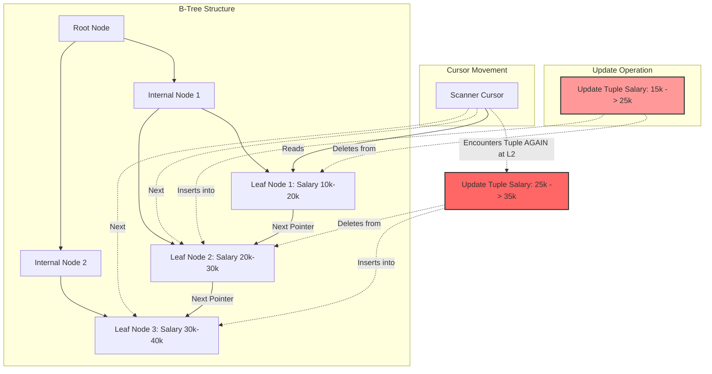

# The Halloween Problem: The Phantom in the Query Engine

On Halloween in 1976, engineers on IBM's System R project ran a perfectly ordinary UPDATE statement and watched it apparently loop forever. What they'd stumbled into is now known as the Halloween Problem, and it remains one of the more instructive anomalies in database engine design — a case where a correct-looking query goes wrong not because of a logic bug, but because of how the execution engine physically moves data around while it's still reading it.

This article walks through the mechanism in some detail: why a pipelined execution model is vulnerable to it, how a B+Tree index update creates the illusion of "new" rows appearing mid-scan, and the two main families of fixes — blocking operators (Eager Spool) and multi-version concurrency control — that modern engines use to shut it down. Along the way we'll also look at what these fixes cost in terms of memory, disk I/O, and even CPU cache behavior, because none of them are free.

## The Core Problem

To keep memory usage low and latency predictable, most execution engines are built around the **Volcano / Iterator model**: operators like Scan, Filter, and Update pass rows to each other one at a time, rather than materializing the whole table between steps.

That design is efficient, but it opens the door to a nasty failure mode. Consider this statement: `Give a 10% raise to all employees with salary < $25,000`. The optimizer picks an index scan on the `salary` column to drive it.

1. The Scan operator finds employee A, currently earning $20,000, and passes the row up to Update.
2. Update computes the new salary — $22,000 — writes it to disk, and **updates the index** to match.
3. In the index's B+Tree, employee A's entry physically moves from the "20K" region to the "22K" region — forward, in the direction the scan is still heading.
4. The Scan cursor keeps advancing. When it reaches the 22K region, it **runs into employee A again**. Since $22,000 is still under the $25,000 threshold, the row qualifies a second time. The raise gets applied again, then again, until the salary finally crosses $25,000.

That's the Halloween Problem: a single UPDATE statement re-processing rows it already touched, because the write side of the pipeline relocated a row into territory the read side hadn't scanned yet. The root cause is state leakage between the read phase and the write phase — what's sometimes called read-write aliasing — which breaks the isolation a single statement is supposed to have from itself. Left unchecked, it corrupts the intended semantics of the update and can drive I/O and log volume into runaway growth.

## Deep Technical Analysis

### The Physical Mechanism Behind Index Mutation Anomalies

The anomaly traces back to how a **B+Tree** actually stores data. When an update changes the value of an indexed key, you can't update it in place — doing so would break the tree's ordering invariant. Instead, the operation is decomposed into a **DELETE** at the old position and an **INSERT** at the new one.

That physical relocation — from leaf node $N_i$ to leaf node $N_j$, where $j > i$ — is exactly what produces the anomaly. The scanning cursor only holds a latch on the current leaf, $N_i$, which is good for concurrency but means the cursor has no idea that a new version of a row it already processed has just reappeared at $N_j$, further along its scan path.



You can model the number of times a given row gets reprocessed, $N_{iter}$, as a function of its starting key $k_0$ and the growth factor $\alpha$ applied each pass (1.1 for a 10% raise):
$$ N_{iter} = \left\lceil \log_{\alpha} \left( \frac{K_{threshold}}{k_0} \right) \right\rceil $$
It's logarithmic, so it doesn't take many iterations to matter — but each one writes a fresh Write-Ahead Log entry, and at scale that adds up to gigabytes of redundant WAL and wasted NVMe bandwidth.

### Architectural Fix: The Eager Spool Operator

The most direct fix happens at the query optimizer level. When the planner notices that the columns being scanned overlap with the columns an Update is modifying, it inserts an **Eager Spool** operator — also called a blocking operator — to break the pipeline.

The idea is materialization: instead of letting reads and writes interleave, Eager Spool first drains every Record ID (RID) from the Scan operator into an in-memory buffer, building a static, fixed snapshot of what to update. Only after the scan is 100% complete does it start feeding those RIDs to the Update operator, by which point the underlying B+Tree can shift however it likes without the scan ever seeing it.

```cpp
// C++ pseudocode simulating a Spool operator that breaks the pipeline
class EagerSpoolOperator : public Operator {
private:
    std::vector<RecordID> materialized_rids;
public:
    void Open() override {
        // Eagerly materialize all Record IDs to break the pipeline
        Tuple* current_tuple = child_operator->Next();
        while (current_tuple != nullptr) {
            materialized_rids.push_back(current_tuple->GetRecordID());
            current_tuple = child_operator->Next();
        }
    }
    Tuple* Next() override {
        // Serve data from the static buffer, no longer touching the B+Tree
        if (current_index < materialized_rids.size()) {
            return StorageManager::GetInstance()->FetchTuple(materialized_rids[current_index++]);
        }
        return nullptr;
    }
};
```

### The Anomaly Through the Lens of MVCC (PostgreSQL MVCC & HOT)

Systems built around Multi-Version Concurrency Control, PostgreSQL among them, sidestep the problem differently — and arguably more elegantly than spooling.

Every tuple in PostgreSQL carries a bit of bookkeeping metadata: `xmin` (the transaction that created it), `xmax` (the transaction that deleted it), and `cmin`/`cmax` (the Command ID — which statement, within the current transaction, produced this version). When the Scan operator runs into a tuple version further along that it hasn't seen before, the visibility filter checks `cmin`. If that version turns out to have been created by *the very statement currently running*, PostgreSQL treats it as "not yet visible" data from the future and quietly skips it — no spooling required, the loop is cut off at the visibility layer.

There's a second mechanism worth knowing: **Heap-Only Tuples (HOT)**. If an UPDATE doesn't touch any indexed column, PostgreSQL can write the new row version into the same heap page as the old one, linked by an internal pointer, without touching the index at all. The index is never aware anything changed, so the scan cursor can't possibly stumble into the new version. The Halloween Problem only resurfaces once you update a column that's actually indexed.

### Hardware Consequences: I/O Spills and TLB Pressure

Eager Spool isn't free — it just moves the bottleneck from the CPU down into the memory hierarchy. Update 50 million rows and the working memory allocated for the operation (`work_mem` in PostgreSQL terms) will run out well before the spool is done materializing RIDs, forcing it to spill to disk.

Using Aggarwal and Vitter's external-memory model, the total block-transfer cost of that spill comes out to roughly:
$$ Cost_{I/O} \approx 2 \cdot N \cdot \left\lceil \log_{B-1} \left( \frac{N}{B} \right) \right\rceil $$

There's a subtler cost at the CPU layer too. A huge in-memory array of RIDs, scattered across many pages, puts real pressure on the Translation Lookaside Buffer (TLB). Every TLB miss forces the memory management unit to walk the page tables — a detour that costs hundreds of clock cycles and stalls the instruction pipeline while it happens.

## Lessons Learned

1. **Understand what a wide UPDATE actually costs.** Any UPDATE that touches an indexed column across a large range is implicitly triggering an Eager Spool operator behind the scenes. That operator needs a proportional amount of `work_mem`; without enough of it, the query spills to disk and drags the rest of the system down with it.
2. **HOT updates in PostgreSQL are worth designing around.** Don't index every column just because you can — index only what you actually query on. Keeping updates non-key (i.e., not touching indexed columns) keeps them eligible for Heap-Only Tuples, letting you sidestep the Halloween Problem entirely without paying for spooling or B+Tree churn.
3. **Tune hardware for spool-heavy workloads.** On large data warehouse boxes, configure Linux to use **Huge Pages (2MB or 1GB)**. Bigger pages mean a smaller page table, which fits more comfortably inside TLB coverage — that removes a real CPU bottleneck when the execution engine has to allocate hundreds of megabytes for a blocking spool operator.
4. **Treat it as a lesson in isolating state.** Any architecture where a producer and a consumer share mutable state through the same data structure — while both are actively reading and writing it — is vulnerable to some version of this problem, not just databases.

## Conclusion

The Halloween Problem isn't just a piece of IBM engineering folklore. It's a durable example of how the clean abstractions of relational algebra can collide with the physical reality of how data actually sits on disk and in memory. What started as an infinite logical loop turned into a genuine architectural challenge — one that pushed database engineers to combine ideas from relational theory (MVCC, blocking operators) with hardware-level thinking (huge pages, TLB behavior, cache-conscious data layout) just to keep a simple UPDATE statement well-behaved.
