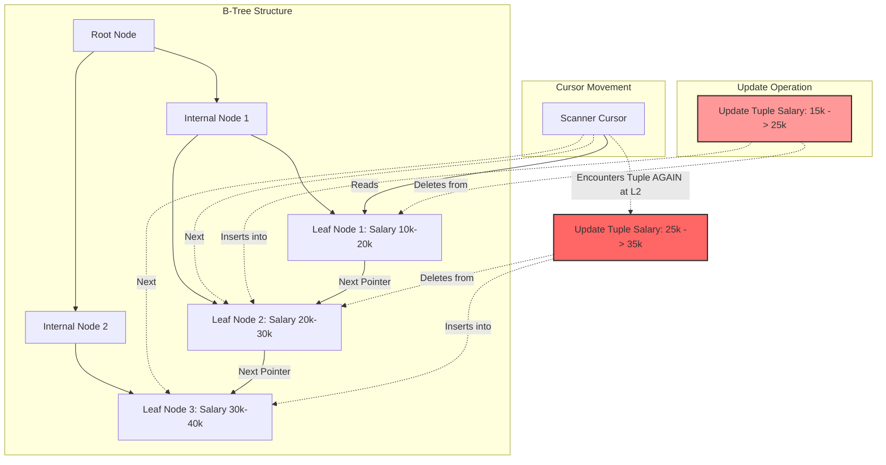

# 15: The Halloween Problem: クエリエジンとデータベースマイクロアーキテクチャの幽霊

## エグゼクティブサマリー

**The Halloween Problem**は、データベース管理システム(DBMS)のアーキテクチャの中でも古くから知られる厄介な異常のひとつだ。1976年のハロウィンの頃にIBMのSystem R研究チームが偶然発見したことからこの名がついた。パイプライン化されたクエリ実行モデル(pipelined execution)には、こういう見落としがちな脆弱性が潜んでいる。

**この記事で扱う内容:**
- ハロウィン問題とは具体的にどんな異常で、なぜ単純なUPDATE文が無限ループとデータ破壊を引き起こしうるのか。
- Volcano Iteratorモデルの演算子(Operator)がどう状態リーク(state leakage)を起こすのか、B+Tree構造がなぜ同一レコードの二重更新という錯覚を生むのか。
- PostgreSQLやSQL Serverといった実際のストレージエンジンが、Eager Spool演算子でパイプラインをあえて止めたり、MVCCのCommand IDで解決したりする手法。
- ディスクへのスピル(spill to disk)がI/Oに与える影響、CPU層でのTLB Miss(Translation Lookaside Buffer miss)といったマイクロアーキテクチャ側の教訓。

## コアとなる問題

RAMを節約しレイテンシを抑えるため、実行エンジンは通常パイプライン(Pipeline) / Volcano Iteratorモデルで動く。このモデルでは、演算子(Scan、Filter、Updateなど)はテーブル全体の読み込みを待たず、行ごとに順次データを受け渡していく。

**典型的なシナリオを考えてみる。** 「給与が25,000ドル未満の全従業員の給与を10%引き上げる」というコマンドを実行したとする。オプティマイザ(Query Optimizer)は`給与`列のインデックスを使ってスキャンすることを選ぶ。
1. Scan演算子が給与20,000ドルの従業員Aを見つけ、Update演算子に渡す。
2. Update演算子は新しい給与を22,000ドルと計算し、ディスクに書き込み、インデックスも更新する。
3. インデックスのB+Tree内で、従業員Aは20K台の領域から22K台の領域へと位置を移す(前方へのシフト)。
4. Scan演算子のカーソルはそのまま前進を続ける。22K台の領域に到達すると、再び従業員Aに遭遇してしまう。22Kはまだ25K未満なので、給与は2度目、3度目と引き上げられ続け、25Kの閾値を超えるまで止まらない。

問題の本質は、読み取りフェーズと書き込みフェーズの間で状態がリークすること(Read-Write Aliasing)にある。これが単一ステートメント内部の分離性を壊し、データの整合性を損ない、I/Oが際限なく膨らむ原因になる。

## 詳細な技術分析

### インデックス突然変異異常の物理的メカニズム

物理ストレージ層の奥では、B+Tree構造がバックボーンになっている。更新でキー値が変わる場合、順序の不変性を保つためにインプレース更新はできない。実際にはUPDATE操作は**DELETE(古い位置の削除)**と**INSERT(新しい位置への挿入)**に分解される。

リーフノード$N_i$からリーフノード$N_j$ ($j > i$) への物理的な移動こそが異常の直接の原因だ。スキャナカーソル(Scanner Cursor)は並行性を保つために現在のリーフノード$N_i$にしかラッチ(Latch)を持たない。前方の$N_j$で同じレコードが別バージョンとして再出現していることに、カーソルは気づきようがない。



数学的には、キー$k_0$を持つ初期レコードが何回再更新されるか($N_{iter}$)は、底を$\alpha$とする対数関数でモデル化できる。
$$ N_{iter} = \left\lceil \log_{\alpha} \left( \frac{K_{threshold}}{k_0} \right) \right\rceil $$
ここで$\alpha$は増加係数(例: 1.1)である。この再帰的な繰り返しは、想定外に大きなWrite-Ahead Log(WAL)を生み、NVMeドライブの帯域を無駄に消費させる。

### アーキテクチャ上の解決策: Eager Spool演算子

最も原始的な対処法は、クエリオプティマイザに介入させることだ。スキャン対象の列とUPDATE対象の列が重なっていることを検出すると、システムは**Eager Spool**(あるいはBlocking Operator)という演算子を自動的に挿入する。

Eager Spoolの役割は実体化(Materialization)にある。読み取りと書き込みを同時並行させる代わりに、Scan演算子からすべてのレコードID(RID)をまず読み切ってRAM上にキャッシュし、静的な配列にする。スキャンが100%完了して初めて、Update演算子にRIDを渡し始める。

```cpp
// パイプラインを破壊するSpool演算子をシミュレートしたC++疑似コード
class EagerSpoolOperator : public Operator {
private:
    std::vector<RecordID> materialized_rids;
public:
    void Open() override {
        // パイプラインを破壊するためにすべてのRecord IDをEagerに実体化する
        Tuple* current_tuple = child_operator->Next();
        while (current_tuple != nullptr) {
            materialized_rids.push_back(current_tuple->GetRecordID());
            current_tuple = child_operator->Next();
        }
    }
    Tuple* Next() override {
        // B+Treeにはもう関与せず、静的キャッシュからデータを提供する
        if (current_index < materialized_rids.size()) {
            return StorageManager::GetInstance()->FetchTuple(materialized_rids[current_index++]);
        }
        return nullptr;
    }
};
```

### MVCCの観点からの異常(PostgreSQL MVCC & HOT)

PostgreSQLのような比較的新しいシステムでは、MVCC(多版同時実行制御)がこの問題をもっと自然な形で解決している。

PostgreSQLの各タプルには、メタデータとして`xmin`(作成したトランザクションID)、`xmax`(削除したトランザクションID)、そして`cmin`/`cmax`(Command ID - トランザクション内でのステートメント識別子)が保存されている。Scan演算子が前方で新しいタプルを見つけると、可視性フィルター(Visibility Filter)が`cmin`をチェックする。そのバージョンがまさに現在実行中のステートメント自身によって作られたものだと分かれば、システムはそれを「未来のデータ」として静かに無視し、Spoolを使わずにハロウィンのループを断ち切る。

さらにPostgreSQLにはHeap-Only Tuples(HOT)という仕組みがある。UPDATEがインデックス対象の列に影響しない場合、新しいデータは内部ポインタを使って古いデータと同じページ内に作られる。インデックス側はこの変更を一切知らないため、スキャンカーソルがこの異常に遭遇することはない。問題が再燃するのは、インデックスキー自体が変わる場合だけだ。

### ハードウェアへの影響: I/OスピルとTLB Miss

Eager Spoolはただでは済まない。ボトルネックをCPUからメモリ階層(Memory Hierarchy)へと移すだけとも言える。5,000万件のレコードを更新すれば、割り当てられたRAM(`work_mem`)はすぐ尽きる。そうなるとEager Spoolはデータをディスクへスピル(Spill to Disk)せざるを得ない。

AggarwalとVitterの外部I/O理論に従うと、ブロック転送の合計コストは次のように見積もれる。
$$ Cost_{I/O} \approx 2 \cdot N \cdot \left\lceil \log_{B-1} \left( \frac{N}{B} \right) \right\rceil $$

さらに厄介なのがCPU層だ。RAM上の巨大なRID配列はTranslation Lookaside Buffer(TLB)を使い果たす。TLB Missが起きると、メモリ管理ユニット(MMU)はページテーブルを走査(Page Table Walk)するのに数百CPUサイクルを費やすことになり、命令パイプライン全体が止まってしまう。

## 教訓と実践

1. **UPDATEクエリのコストを見積もる。** インデックス対象の列を直接書き換えるような大規模UPDATEを設計に組み込むと、暗黙のうちにEager Spool演算子が発火する。このステートメントは大量のRAM(`work_mem`)を要求する。対策を怠るとクエリがディスクにスピルし、システム全体の速度を引きずり下ろす。
2. **PostgreSQLのHOT Updateはうまく使うと強い味方になる。** すべての列にインデックスを張らないこと。検索に本当に必要な列だけをインデックス化し、UPDATE文がインデックスキーに触れないようにしておけば、Heap-Only Tuplesが働き、Spoolingのコストやインデックスの断片化なしにハロウィン問題を回避できる。
3. **Spoolを使うシステムはハードウェア構成も見直す。** 大規模なデータウェアハウスを運用するなら、Linuxサーバーで**Huge Pages(2MB/1GB)**を使う設定にしておく。Huge Pagesはページテーブルのサイズを抑え、TLBキャッシュの守備範囲に収めることで、実行エンジンがブロッキングSpool演算子のために数百MBのメモリを動的確保する際のCPUボトルネックを和らげる。
4. **論理層と物理層の分離を意識する。** The Halloween Problemが教えてくれるのは、データフローアーキテクチャにおいてproducerモジュールとconsumerモジュールの間で状態がリークすると、それだけで再帰的な致命傷になりうるということだ。

## 結論

The Halloween Problemは、IBMにまつわる単なる歴史上の逸話ではない。関係代数という数学的な世界と、磁気記録という物理的な現実との境界線を鋭く映し出す、今も生きている問題だ。単純な論理的無限ループとして始まったこの現象は、深いアーキテクチャ上の課題へと発展し、オペレーティングシステムやデータベースのエンジニアに、関係代数(MVCC、Spooling)からハードウェアのマイクロアーキテクチャ(Huge Pages、TLB、キャッシュアライン)まで一貫して考えることを求め続けている。
