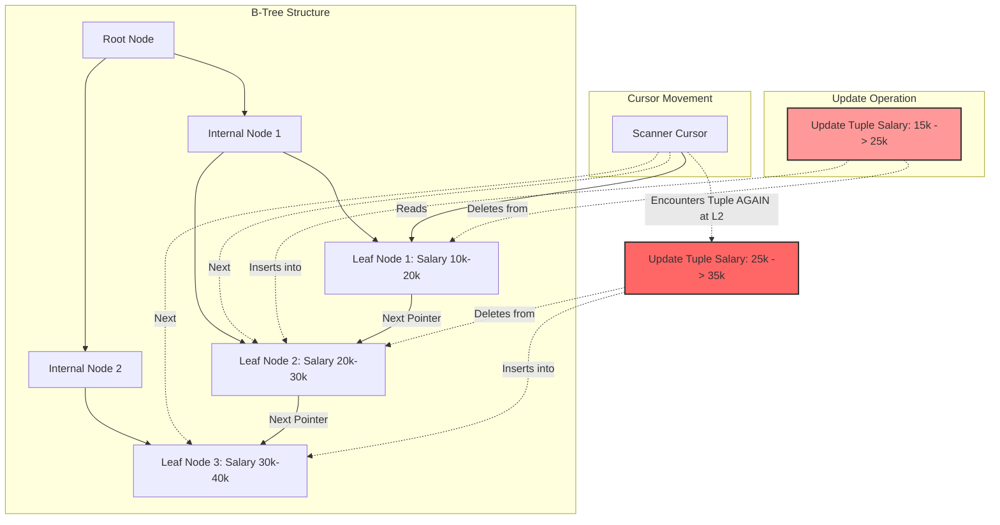

# The Halloween Problem: Bóng ma trong động cơ truy vấn cơ sở dữ liệu

Vào đúng dịp Halloween năm 1976, nhóm nghiên cứu System R của IBM chạy một câu lệnh UPDATE hết sức bình thường và chứng kiến nó dường như lặp vô hạn. Thứ họ vô tình phát hiện ra sau này được gọi là Halloween Problem — một trong những dị thường đáng nhớ nhất trong thiết kế engine cơ sở dữ liệu, nơi một câu truy vấn trông hoàn toàn đúng lại chạy sai, không phải vì lỗi logic mà vì cách engine thực thi vật lý di chuyển dữ liệu ngay trong lúc nó còn đang được đọc.

Bài viết này đi sâu vào cơ chế đó: tại sao mô hình thực thi dạng pipeline lại dễ mắc phải vấn đề này, vì sao một thao tác cập nhật chỉ mục B+Tree lại tạo ra ảo giác về những dòng dữ liệu "mới" xuất hiện giữa chừng khi quét, và hai nhóm giải pháp chính mà các engine hiện đại dùng để chặn đứng nó — toán tử chặn (Eager Spool) và kiểm soát đồng thời đa phiên bản (MVCC). Chúng ta cũng sẽ xem các giải pháp này tốn kém thế nào về bộ nhớ, I/O đĩa, và cả hành vi cache của CPU, vì không cái nào miễn phí cả.

## Vấn Đề Cốt Lõi Của Halloween Problem

Để tiết kiệm RAM và giữ độ trễ ổn định, phần lớn engine thực thi được xây dựng theo **mô hình Volcano / Iterator**: các toán tử như Scan, Filter, Update truyền dữ liệu cho nhau từng dòng một, thay vì vật chất hóa toàn bộ bảng giữa các bước.

Thiết kế đó hiệu quả, nhưng lại mở ra một kiểu lỗi khá khó chịu. Hãy hình dung câu lệnh: `Tăng 10% lương cho tất cả nhân viên có lương < 25,000$`. Trình tối ưu hóa chọn quét theo chỉ mục (index) trên cột `lương` để thực thi.

1. Toán tử Scan tìm thấy nhân viên A, đang hưởng lương 20,000$, và đẩy dòng này lên toán tử Update.
2. Update tính ra lương mới — 22,000$ — ghi xuống đĩa, và **cập nhật lại chỉ mục** cho khớp.
3. Trong cấu trúc B+Tree của chỉ mục, entry của nhân viên A bị dịch chuyển vật lý từ vùng "20K" sang vùng "22K" — tức là về phía trước, đúng hướng mà con trỏ quét vẫn đang tiến tới.
4. Con trỏ Scan tiếp tục tiến lên. Khi đến vùng 22K, nó **gặp lại chính nhân viên A**. Vì 22,000$ vẫn còn dưới ngưỡng 25,000$, dòng này lại đủ điều kiện lần nữa. Lương được tăng thêm lần hai, rồi lần ba... cho đến khi vượt qua mốc 25,000$.

Đó chính là Halloween Problem: một câu lệnh UPDATE duy nhất xử lý lại những dòng nó đã từng chạm vào, chỉ vì phía ghi của pipeline đã dịch chuyển dòng dữ liệu sang vùng mà phía đọc chưa kịp quét tới. Nguyên nhân gốc là sự rò rỉ trạng thái giữa pha đọc và pha ghi — đôi khi gọi là read-write aliasing — phá vỡ tính cô lập mà lẽ ra một câu lệnh phải có với chính nó. Nếu không được xử lý, nó làm sai lệch ý nghĩa thực sự của câu update, đồng thời khiến I/O và log tăng trưởng mất kiểm soát.

## Phân Tích Kỹ Thuật Chuyên Sâu

### Cơ Chế Vật Lý Đằng Sau Dị Thường Đột Biến Chỉ Mục

Gốc rễ của dị thường nằm ở cách một **B+Tree** thực sự lưu trữ dữ liệu. Khi một update làm thay đổi giá trị của khóa được đánh chỉ mục, bạn không thể ghi đè tại chỗ (in-place) — làm vậy sẽ phá vỡ bất biến về thứ tự của cây. Thay vào đó, thao tác được phân rã thành một lệnh **DELETE** ở vị trí cũ và một lệnh **INSERT** ở vị trí mới.

Sự dịch chuyển vật lý đó — từ nút lá $N_i$ sang nút lá $N_j$, với $j > i$ — chính là thứ sinh ra dị thường. Con trỏ quét chỉ giữ chốt (latch) trên nút lá hiện tại, $N_i$, điều này tốt cho tính đồng thời nhưng cũng có nghĩa là con trỏ hoàn toàn không biết một phiên bản mới của dòng nó đã xử lý vừa xuất hiện lại ở $N_j$, phía trước trên đường quét.



Ta có thể mô hình hóa số lần một dòng bị xử lý lặp lại, $N_{iter}$, như một hàm của khóa ban đầu $k_0$ và hệ số tăng $\alpha$ áp dụng ở mỗi lượt (1.1 cho mức tăng 10%):
$$ N_{iter} = \left\lceil \log_{\alpha} \left( \frac{K_{threshold}}{k_0} \right) \right\rceil $$
Đây là hàm lô-ga-rít, nên không cần nhiều vòng lặp để gây ảnh hưởng đáng kể — nhưng mỗi vòng lại ghi thêm một bản ghi Write-Ahead Log mới, và ở quy mô lớn, con số này cộng dồn thành hàng gigabyte WAL dư thừa, ngốn sạch băng thông ổ NVMe.

### Giải Pháp Kiến Trúc: Toán Tử Eager Spool

Cách xử lý trực tiếp nhất diễn ra ở tầng trình tối ưu hóa truy vấn. Khi bộ lập kế hoạch (planner) nhận thấy tập cột đang được quét trùng với tập cột mà Update đang thay đổi, nó chèn vào một toán tử **Eager Spool** — còn gọi là blocking operator — để phá vỡ pipeline.

Ý tưởng ở đây là vật chất hóa (materialization): thay vì để đọc và ghi đan xen nhau, Eager Spool trước tiên rút cạn toàn bộ Record ID (RID) từ toán tử Scan vào một bộ đệm trong bộ nhớ, dựng nên một snapshot tĩnh, cố định về những gì cần cập nhật. Chỉ sau khi quét xong 100%, nó mới bắt đầu đưa các RID này cho toán tử Update — lúc đó B+Tree bên dưới có dịch chuyển thế nào cũng không còn ảnh hưởng, vì Scan đã hoàn tất từ lâu.

```cpp
// Pseudocode C++ mô phỏng toán tử Spool phá vỡ đường ống
class EagerSpoolOperator : public Operator {
private:
    std::vector<RecordID> materialized_rids;
public:
    void Open() override {
        // Eagerly materialize toàn bộ Record IDs để phá vỡ pipeline
        Tuple* current_tuple = child_operator->Next();
        while (current_tuple != nullptr) {
            materialized_rids.push_back(current_tuple->GetRecordID());
            current_tuple = child_operator->Next();
        }
    }
    Tuple* Next() override {
        // Phục vụ dữ liệu từ bộ đệm tĩnh, không dính líu đến B+Tree nữa
        if (current_index < materialized_rids.size()) {
            return StorageManager::GetInstance()->FetchTuple(materialized_rids[current_index++]);
        }
        return nullptr;
    }
};
```

### Nhìn Dị Thường Qua Lăng Kính MVCC (PostgreSQL MVCC & HOT)

Các hệ thống xây dựng quanh Kiểm soát đồng thời đa phiên bản (MVCC), PostgreSQL là ví dụ điển hình, tránh vấn đề này theo một cách khác — và có thể nói là tinh tế hơn spooling.

Mỗi tuple trong PostgreSQL mang theo một ít metadata sổ sách: `xmin` (giao dịch đã tạo ra nó), `xmax` (giao dịch đã xóa nó), và `cmin`/`cmax` (Command ID — câu lệnh nào, trong giao dịch hiện tại, đã sinh ra phiên bản này). Khi toán tử Scan gặp một phiên bản tuple ở phía trước mà nó chưa từng thấy, bộ lọc khả kiến (visibility filter) sẽ kiểm tra `cmin`. Nếu phiên bản đó hóa ra được tạo bởi *chính câu lệnh đang chạy*, PostgreSQL coi đây là dữ liệu "chưa khả kiến" đến từ tương lai và lặng lẽ bỏ qua — không cần spooling, vòng lặp bị cắt đứt ngay ở tầng visibility.

Còn một cơ chế nữa đáng biết: **Heap-Only Tuples (HOT)**. Nếu một UPDATE không đụng đến cột nào được đánh chỉ mục, PostgreSQL có thể ghi phiên bản dòng mới vào cùng heap page với dòng cũ, liên kết bằng một con trỏ nội bộ, mà không cần đụng đến index chút nào. Index hoàn toàn không biết có thay đổi gì xảy ra, nên con trỏ quét không thể nào vấp phải phiên bản mới. Halloween Problem chỉ quay lại khi bạn cập nhật một cột thực sự nằm trong chỉ mục.

### Hệ Quả Phần Cứng: I/O Tràn Đĩa Và Áp Lực Lên TLB

Eager Spool không hề miễn phí — nó chỉ dịch chuyển điểm nghẽn từ CPU xuống hệ thống phân cấp bộ nhớ. Cập nhật 50 triệu dòng, và bộ nhớ làm việc cấp cho thao tác này (`work_mem` trong PostgreSQL) sẽ cạn kiệt từ trước khi spool vật chất hóa xong toàn bộ RID, buộc nó phải tràn dữ liệu xuống đĩa.

Dùng mô hình I/O ngoại vi của Aggarwal và Vitter, tổng chi phí chuyển khối của lần tràn đĩa đó xấp xỉ:
$$ Cost_{I/O} \approx 2 \cdot N \cdot \left\lceil \log_{B-1} \left( \frac{N}{B} \right) \right\rceil $$

Còn có một chi phí tinh vi hơn ở tầng CPU. Một mảng RID khổng lồ trong bộ nhớ, rải rác trên nhiều trang, tạo áp lực thực sự lên Translation Lookaside Buffer (TLB). Mỗi lần TLB miss buộc bộ quản lý bộ nhớ (MMU) phải duyệt qua page table — một đường vòng tốn hàng trăm chu kỳ xung nhịp và làm đình trệ toàn bộ instruction pipeline trong lúc đó.

## Bài Học Kinh Nghiệm

1. **Hiểu rõ cái giá thực sự của một UPDATE diện rộng.** Bất kỳ UPDATE nào đụng đến cột được đánh chỉ mục trên một phạm vi lớn đều ngầm kích hoạt một toán tử Eager Spool phía sau. Toán tử đó cần một lượng `work_mem` tương xứng; không đủ, truy vấn sẽ tràn xuống đĩa và kéo chậm cả hệ thống theo.
2. **HOT update trong PostgreSQL đáng để thiết kế hướng tới.** Đừng đánh chỉ mục mọi cột chỉ vì có thể — chỉ index những cột thực sự được dùng để tra cứu. Giữ cho các update là non-key (không đụng cột chỉ mục) sẽ giúp chúng đủ điều kiện dùng Heap-Only Tuples, tránh hoàn toàn Halloween Problem mà không phải trả giá bằng spooling hay phân mảnh B+Tree.
3. **Tinh chỉnh phần cứng cho khối lượng công việc nặng về spool.** Trên các máy chủ data warehouse lớn, cấu hình Linux dùng **Huge Pages (2MB hoặc 1GB)**. Trang lớn hơn đồng nghĩa page table nhỏ hơn, dễ nằm gọn trong phạm vi phủ của TLB hơn — điều này loại bỏ một điểm nghẽn CPU thực sự khi engine thực thi phải cấp phát hàng trăm MB cho một toán tử spool chặn.
4. **Xem đây là bài học về cô lập trạng thái.** Bất kỳ kiến trúc nào có producer và consumer cùng chia sẻ trạng thái khả biến qua cùng một cấu trúc dữ liệu — trong khi cả hai đều đang đọc và ghi vào đó — đều dễ mắc một biến thể nào đó của vấn đề này, không chỉ riêng cơ sở dữ liệu.

## Kết Luận

Halloween Problem không đơn thuần là một giai thoại kỹ thuật của IBM. Đó là một ví dụ bền vững cho thấy các trừu tượng gọn gàng của đại số quan hệ có thể va chạm ra sao với thực tế vật lý của việc dữ liệu thực sự nằm trên đĩa và trong bộ nhớ như thế nào. Từ một vòng lặp logic vô tận, vấn đề này đã trở thành một thách thức kiến trúc thực sự — buộc các kỹ sư cơ sở dữ liệu phải kết hợp ý tưởng từ lý thuyết quan hệ (MVCC, toán tử chặn) với tư duy ở tầng phần cứng (huge pages, hành vi TLB, bố trí dữ liệu tôn trọng cache) chỉ để giữ cho một câu UPDATE đơn giản chạy đúng như mong đợi.
