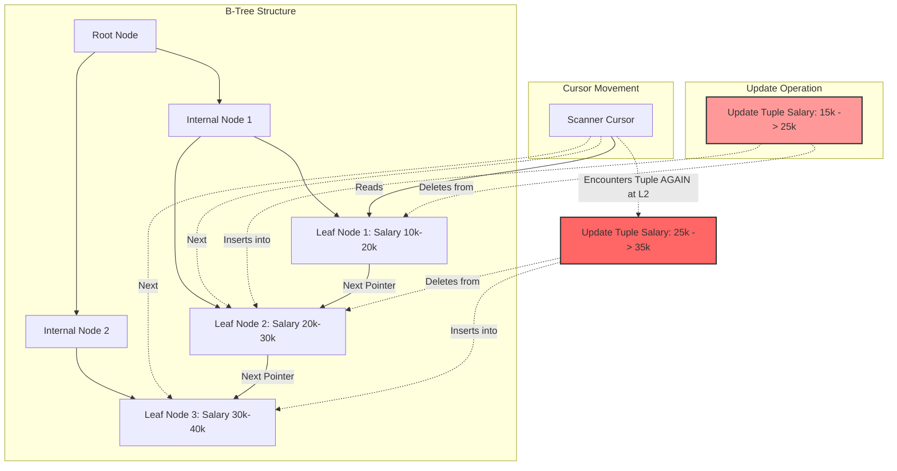

# 15: The Halloween Problem: Bóng ma trong động cơ truy vấn và kiến trúc vi mô cơ sở dữ liệu

## Tóm Tắt Điều Hành

**The Halloween Problem** là một trong những dị thường lâu đời nhất trong kiến trúc hệ quản trị cơ sở dữ liệu (DBMS) - và cũng là một trong những cái dễ bị bỏ sót nhất. Nhóm nghiên cứu System R của IBM phát hiện ra nó tình cờ vào đúng dịp Halloween năm 1976, nên cái tên gắn liền từ đó. Vấn đề nằm ở một lỗ hổng khá tinh vi của mô hình thực thi truy vấn theo kiểu đường ống (pipelined execution).

**Bài viết này đề cập:**
- Dị thường Halloween thực chất là gì, và tại sao một câu UPDATE tưởng chừng vô hại có thể khiến dữ liệu bị ghi đè lặp đi lặp lại.
- Cách các toán tử trong mô hình Volcano Iterator rò rỉ trạng thái (state leakage), và vì sao cấu trúc B+Tree lại tạo ra ảo giác gặp lại cùng một bản ghi.
- Cách PostgreSQL và SQL Server xử lý vấn đề này trong thực tế - từ việc chèn toán tử Eager Spool để chặn đường ống, đến dùng Command ID trong MVCC.
- Cái giá phải trả ở tầng phần cứng: tràn bộ nhớ xuống đĩa (spill to disk) ảnh hưởng I/O ra sao, và vì sao TLB Miss (Translation Lookaside Buffer miss) lại liên quan đến chuyện này.

## Vấn Đề Cốt Lõi

Để tiết kiệm RAM và giảm độ trễ, động cơ thực thi truy vấn trong hầu hết DBMS vận hành theo mô hình đường ống (Pipeline / Volcano Iterator). Các toán tử như Scan, Filter, Update truyền dữ liệu cho nhau từng dòng một, thay vì chờ đọc xong toàn bộ bảng rồi mới xử lý.

**Một kịch bản cụ thể:** giả sử bạn chạy lệnh tăng 10% lương cho tất cả nhân viên có lương dưới 25,000$. Trình tối ưu hóa chọn dùng chỉ mục (index) trên cột `Lương` để quét dữ liệu.
1. Toán tử Scan tìm thấy nhân viên A với lương 20,000$, đẩy lên toán tử Update.
2. Toán tử Update tính lương mới là 22,000$, ghi xuống đĩa và cập nhật lại chỉ mục.
3. Trong cấu trúc B+Tree của chỉ mục, nhân viên A bị chuyển từ vùng 20K sang vùng 22K - dịch chuyển về phía trước.
4. Con trỏ quét (scan cursor) vẫn tiếp tục tiến lên. Khi đến vùng 22K, nó gặp lại chính nhân viên A. Vì 22K vẫn nhỏ hơn 25K, lương lại bị tăng lần hai, lần ba... cho đến khi vượt ngưỡng 25K mới thôi.

Cốt lõi của vấn đề là sự rò rỉ trạng thái giữa pha đọc và pha ghi (Read-Write Aliasing), phá vỡ tính cô lập vốn phải có bên trong một câu lệnh duy nhất. Hậu quả là dữ liệu sai lệch và I/O tăng vọt không kiểm soát.

## Phân Tích Kỹ Thuật Chuyên Sâu

### Cơ Chế Vật Lý Của Dị Thường Đột Biến Chỉ Mục

Ở lớp lưu trữ vật lý, cấu trúc B+Tree là xương sống của mọi thứ. Khi một cập nhật làm thay đổi giá trị khóa, thao tác này không thể ghi đè tại chỗ (in-place update) vì sẽ phá vỡ tính có thứ tự của cây. Thay vào đó, UPDATE thực chất được tách thành hai bước: DELETE (xóa vị trí cũ) và INSERT (chèn vị trí mới).

Việc dịch chuyển vật lý từ nút lá $N_i$ sang nút lá $N_j$ ($j > i$) chính là nguồn gốc của dị thường này. Con trỏ quét (Scanner Cursor) chỉ giữ chốt (Latch) trên nút lá hiện tại $N_i$ để tối đa hóa khả năng xử lý đồng thời - nó không có cách nào biết rằng một phiên bản khác của cùng bản ghi vừa xuất hiện tại $N_j$, ngay phía trước đường đi của nó.



Về mặt toán học, số lần một bản ghi với khóa ban đầu $k_0$ bị lặp update có thể mô phỏng bằng một hàm tăng logarit cơ số $\alpha$:
$$ N_{iter} = \left\lceil \log_{\alpha} \left( \frac{K_{threshold}}{k_0} \right) \right\rceil $$
trong đó $\alpha$ là hệ số tăng (ví dụ 1.1). Quá trình lặp này tạo ra một lượng lớn Write-Ahead Log (WAL) không cần thiết, ăn vào băng thông của ổ NVMe.

### Giải Pháp Kiến Trúc: Toán Tử Eager Spool

Cách xử lý cơ bản nhất là can thiệp ngay tại trình tối ưu hóa truy vấn. Khi hệ thống phát hiện tập cột được Scan giao nhau với tập cột bị Update thay đổi, nó sẽ tự động chèn một toán tử Eager Spool (còn gọi là Blocking Operator).

Mục đích của Eager Spool là vật chất hóa (Materialization) dữ liệu. Thay vì vừa đọc vừa ghi song song, nó đọc hết toàn bộ định danh bản ghi (Record ID - RID) từ toán tử Scan, lưu vào RAM thành một mảng tĩnh. Chỉ sau khi quét xong toàn bộ, nó mới bắt đầu cấp RID cho toán tử Update.

```cpp
// Pseudocode C++ mô phỏng toán tử Spool phá vỡ đường ống
class EagerSpoolOperator : public Operator {
private:
    std::vector<RecordID> materialized_rids;
public:
    void Open() override {
        // Eagerly materialize toàn bộ Record IDs để phá vỡ pipeline
        Tuple* current_tuple = child_operator->Next();
        while (current_tuple != nullptr) {
            materialized_rids.push_back(current_tuple->GetRecordID());
            current_tuple = child_operator->Next();
        }
    }
    Tuple* Next() override {
        // Phục vụ dữ liệu từ bộ đệm tĩnh, không dính líu đến B+Tree nữa
        if (current_index < materialized_rids.size()) {
            return StorageManager::GetInstance()->FetchTuple(materialized_rids[current_index++]);
        }
        return nullptr;
    }
};
```

### Dị Thường Dưới Góc Nhìn MVCC (PostgreSQL MVCC & HOT)

Các hệ thống hiện đại như PostgreSQL xử lý bài toán này gọn hơn nhiều nhờ MVCC (Kiểm soát đồng thời đa phiên bản).

Mỗi tuple trong PostgreSQL mang theo metadata: `xmin` (ID giao dịch tạo ra nó), `xmax` (ID giao dịch xóa nó), và `cmin`/`cmax` (Command ID - định danh câu lệnh cụ thể bên trong giao dịch). Khi toán tử Scan gặp một tuple mới xuất hiện phía trước, bộ lọc khả kiến (Visibility Filter) sẽ kiểm tra `cmin`. Nếu phát hiện phiên bản này được tạo ra bởi chính câu lệnh đang chạy, hệ thống coi đó là "dữ liệu tương lai" và bỏ qua nó - cắt đứt vòng lặp Halloween mà không cần dùng đến Spool.

PostgreSQL còn có thêm cơ chế Heap-Only Tuples (HOT). Nếu UPDATE không đụng đến cột đang được index, dữ liệu mới sẽ được tạo ngay trong cùng một page với dữ liệu cũ, thông qua một con trỏ nội bộ. Vì index không hề hay biết về thay đổi này, con trỏ quét sẽ không bao giờ gặp lại bản ghi đó lần nữa. Dị thường chỉ quay lại khi khóa index thực sự bị sửa đổi.

### Hệ Quả Ở Tầng Phần Cứng: I/O Spill và TLB Miss

Eager Spool không phải là giải pháp miễn phí - nó chỉ dịch chuyển điểm nghẽn từ CPU sang hệ thống phân cấp bộ nhớ. Khi cập nhật 50 triệu bản ghi, RAM cấp cho `work_mem` sẽ nhanh chóng cạn kiệt, buộc Eager Spool phải tràn dữ liệu xuống đĩa (Spill to Disk).

Theo lý thuyết I/O ngoại vi của Aggarwal và Vitter, tổng chi phí chuyển khối được tính xấp xỉ bằng:
$$ Cost_{I/O} \approx 2 \cdot N \cdot \left\lceil \log_{B-1} \left( \frac{N}{B} \right) \right\rceil $$

Vấn đề ở tầng CPU còn khó chịu hơn. Một mảng RID khổng lồ nằm trong RAM sẽ làm cạn Translation Lookaside Buffer (TLB). Khi TLB Miss xảy ra, bộ quản lý bộ nhớ (MMU) phải duyệt bảng trang (Page Table Walk), tốn hàng trăm chu kỳ CPU và làm chậm cả instruction pipeline.

## Bài Học Kinh Nghiệm & Thực Tiễn

1. **Hiểu chi phí thật của UPDATE diện rộng.** Nếu ứng dụng có các câu UPDATE tác động trực tiếp lên cột đang được index, bạn đang âm thầm kích hoạt Eager Spool. Câu lệnh này cần một lượng RAM đáng kể (`work_mem`). Không tối ưu kịp thời, truy vấn sẽ spill xuống đĩa và kéo chậm cả hệ thống.
2. **Tận dụng HOT Update của PostgreSQL.** Đừng index mọi cột - chỉ index những cột thực sự cần cho tra cứu. Giữ cho UPDATE không đụng vào cột index (non-key update) sẽ kích hoạt Heap-Only Tuples, giúp tránh Halloween Problem mà không phải trả giá bằng Spooling hay phân mảnh B+Tree.
3. **Cấu hình phần cứng phù hợp cho hệ thống có Spool.** Với các data warehouse lớn, nên cấu hình Linux dùng Huge Pages (2MB/1GB). Việc này giảm kích thước Page Table, giữ nó gọn trong phạm vi bao phủ của TLB cache, giảm bớt điểm nghẽn CPU khi động cơ thực thi phải cấp phát hàng trăm MB cho các toán tử Spool.
4. **Tách bạch giữa logic và vật lý.** The Halloween Problem là một bài học kinh điển về thiết kế phần mềm: bất kỳ sự rò rỉ trạng thái nào giữa module sinh (producer) và module tiêu thụ (consumer) trong một kiến trúc luồng dữ liệu đều tiềm ẩn rủi ro lặp đệ quy nguy hiểm.

## Kết Luận

The Halloween Problem không chỉ là một câu chuyện lịch sử của IBM. Nó cho thấy ranh giới mong manh giữa đại số quan hệ trên lý thuyết và cách dữ liệu thực sự được ghi lên đĩa từ. Bắt đầu từ một vòng lặp logic tưởng như đơn giản, vấn đề này buộc các kỹ sư hệ điều hành và cơ sở dữ liệu phải suy nghĩ xuyên suốt từ đại số quan hệ (MVCC, Spooling) cho đến vi kiến trúc phần cứng (Huge Pages, TLB, cache alignment) để giữ cho hệ thống hoạt động đúng.
